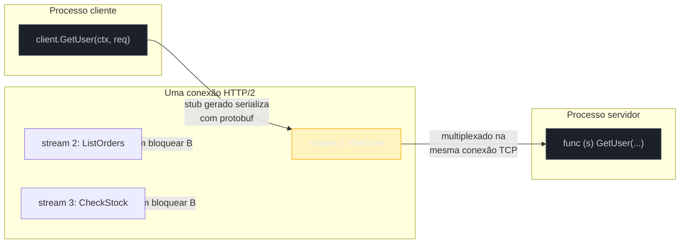

# Por que gRPC e onde Go brilha

> [!abstract] TL;DR
> **gRPC** é RPC (chamada de procedimento remoto) sobre **HTTP/2**, com contrato **contract-first** escrito em `.proto` e payload **binário** (Protocol Buffers) em vez de JSON texto. O contrato gera código cliente e servidor em qualquer linguagem suportada — você chama `client.GetUser(ctx, req)` como se fosse uma função local, e o gRPC cuida de serializar, transportar e desserializar por baixo. Go é a **casa nativa** do gRPC: o próprio protobuf-compiler plugin oficial (`protoc-gen-go-grpc`) é mantido pelo time do Go, o runtime do gRPC nasceu junto com o ecossistema de microsserviços do Google (que é essencialmente todo em Go/C++), e o modelo de concorrência de goroutines encaixa quase perfeito com streams bidirecionais. gRPC ganha de REST quando a comunicação é **serviço-a-serviço** (sem navegador no meio), quando você precisa de **streaming** de verdade (não polling disfarçado), e quando **tipagem forte compartilhada** entre times economiza mais do que a legibilidade de JSON vale a pena.

## O problema que motiva a pergunta

Imagine dois serviços internos do seu backend: `orders-service` precisa perguntar pro `inventory-service` se um item tem estoque, toda vez que alguém finaliza uma compra. Não é um usuário no navegador — é máquina falando com máquina, na mesma rede interna, dezenas de vezes por segundo.

A escolha óbvia, se você nunca parou para questionar, é REST + JSON: `POST /inventory/check` com um corpo `{"sku": "ABC123", "qty": 2}`, resposta `{"available": true}`. Funciona. Mas repare no que esse caminho carrega, sem você ter pedido:

- Cada requisição reabre conexão TCP+TLS (a menos que você configure keep-alive com cuidado) ou compartilha uma conexão HTTP/1.1 que só processa uma requisição de cada vez por socket.
- O contrato entre os dois serviços vive... onde? Numa wiki? Num arquivo OpenAPI que alguém esquece de atualizar? Nada impede `inventory-service` de renomear `available` para `is_available` e só descobrir o problema em produção, quando `orders-service` já estiver desserializando `false` por padrão de um campo que não existe mais.
- Cada campo JSON carrega o próprio nome como string, a cada requisição, para uma comunicação que roda milhares de vezes por minuto entre dois processos que já sabem exatamente o formato esperado.

Nenhum desses três pontos é fatal sozinho — mas juntos, eles descrevem exatamente o nicho que o gRPC foi desenhado para atacar: comunicação interna, de alto volume, entre serviços que controlam os dois lados do contrato.

## RPC sobre HTTP/2: o que muda de verdade

A ideia de RPC (*remote procedure call*) é antiga — chamar uma função que roda em outra máquina como se fosse local. gRPC não inventa o conceito; ele escolhe um transporte (HTTP/2) e um formato de serialização (Protocol Buffers) modernos para reencarná-lo.



Três decisões de design do HTTP/2 é que fazem o gRPC valer a pena, comparado a montar RPC sobre HTTP/1.1:

- **Multiplexação real** — várias chamadas RPC concorrentes compartilham a **mesma conexão TCP**, cada uma na sua própria stream HTTP/2, sem uma bloquear a outra (o problema de *head-of-line blocking* de HTTP/1.1, onde uma resposta lenta trava a fila inteira num socket keep-alive). Isso significa menos conexões abertas, menos handshakes TLS, menos overhead de conexão por chamada.
- **Streams bidirecionais nativas** — HTTP/1.1 modela requisição-resposta; qualquer coisa parecida com um fluxo contínuo de dados (server push, atualização em tempo real) precisa de gambiarra (long polling, WebSocket à parte). HTTP/2 tem o conceito de stream de dados full-duplex embutido no protocolo — é a base sobre a qual o gRPC constrói streaming (assunto da [[05 - Streaming|nota 05]] mais à frente).
- **Framing binário** — HTTP/1.1 é texto (`GET /path HTTP/1.1\r\nHost: ...`); HTTP/2 usa frames binários compactos, com compressão de headers (HPACK). Menos bytes na rede para o mesmo semântico de requisição.

Nada disso é exclusivo do gRPC — qualquer coisa rodando sobre HTTP/2 ganha esses três benefícios. O que o gRPC faz é definir, **em cima** desse transporte, um protocolo de RPC específico: como uma chamada mapeia para uma stream, como erros e metadados trafegam nos headers/trailers, e como o corpo é serializado.

> [!info] gRPC-Web e o problema do navegador
> HTTP/2 é suportado por praticamente todo browser moderno — mas o gRPC como protocolo depende de recursos de baixo nível (trailers HTTP/2, controle fino de frames) que a API `fetch`/`XMLHttpRequest` do navegador não expõe. Por isso gRPC "puro" não roda direto do browser: existe o **gRPC-Web**, um subconjunto adaptado que passa por um proxy tradutor (ex.: Envoy) antes de virar gRPC de verdade internamente. Isso reforça o nicho do gRPC: comunicação **serviço-a-serviço**, onde ambos os lados são processos que você controla — não comunicação com o navegador do usuário final, que continua sendo terreno de REST/GraphQL/gRPC-Web.

## Contract-first: o `.proto` como fonte de verdade

A diferença mais visível para quem vem de REST não é o transporte — é a ordem das operações. Em REST, é comum escrever o handler primeiro e documentar depois (às vezes nunca). Em gRPC, o contrato **vem primeiro**, num arquivo `.proto`:

```protobuf
syntax = "proto3";
package inventory.v1;

service InventoryService {
  rpc CheckStock(CheckStockRequest) returns (CheckStockResponse);
}

message CheckStockRequest {
  string sku = 1;
  int32  quantity = 2;
}

message CheckStockResponse {
  bool available = 1;
}
```

Esse arquivo é a única fonte de verdade sobre o que `InventoryService` expõe. A próxima nota do galho ([[02 - Protocol Buffers|nota 02]]) entra na sintaxe do protobuf a fundo — números de campo, tipos, evolução de schema. O que importa aqui é o *efeito* dessa ordem invertida: o compilador `protoc` lê esse `.proto` e **gera código** — em Go, em Python, em Java, em qualquer linguagem com plugin — que já sabe serializar `CheckStockRequest`, já sabe abrir a stream HTTP/2 certa, já sabe chamar `CheckStock` como se fosse uma função local.

O contrato deixa de ser um artefato que pode se desalinhar do código (como acontece com um YAML OpenAPI escrito manualmente ao lado de um handler REST) e passa a ser o **próprio ponto de partida** do código. Se `inventory-service` mudar `CheckStockResponse`, remover `available` e adicionar `stock_count` sem seguir as regras de evolução do protobuf, `orders-service` não vai só "não achar o campo" silenciosamente em runtime — o processo de geração de código já vai deixar isso visível assim que o `.proto` compartilhado for regenerado dos dois lados.

## Binário: o preço e o ganho

JSON é texto legível — abra qualquer payload num terminal e você lê `{"sku": "ABC123"}` direto. Protocol Buffers serializa para um formato **binário compacto**, onde cada campo vira um par tag-valor codificado (varint para inteiros, length-delimited para strings), sem os nomes dos campos repetidos a cada mensagem — eles vivem só no `.proto` compilado, dos dois lados.

O que se perde: você não consegue mais abrir um payload gRPC no `curl` e ler visualmente (existem ferramentas como `grpcurl` que resolvem isso para debug, mas não é o padrão zero-config de um `curl` numa API REST).

O que se ganha: payloads tipicamente **3-10x menores** que o JSON equivalente (nenhum nome de campo repetido, inteiros codificados de forma compacta), e (de)serialização mais rápida, porque não há parsing de texto — é leitura direta de bytes num formato conhecido em tempo de compilação.

Para uma chamada isolada, entre um navegador e uma API pública, essa diferença raramente decide o design. Para uma chamada que acontece milhares de vezes por segundo entre dois serviços na mesma rede — o cenário de abertura desta nota — o binário compacto some do orçamento de CPU e banda de um jeito que o texto legível de JSON não permite.

## Go como casa nativa do gRPC

Não é força de expressão dizer que gRPC "nasceu" perto de Go. Alguns fatos concretos sustentam isso:

- O **runtime de referência** do gRPC (`grpc-go`, em `google.golang.org/grpc`) é mantido pelo mesmo guarda-chuva de projetos Google que mantém o próprio Go, e costuma ser o primeiro a receber features novas do protocolo gRPC, ao lado da implementação em C++.
- O gerador de código gRPC para Go (`protoc-gen-go-grpc`) é um plugin **oficial**, documentado lado a lado com o compilador `protoc` em [grpc.io](https://grpc.io/docs/languages/go/quickstart/) — não uma implementação de terceiros perseguindo o protocolo de fora.
- O **modelo de concorrência de goroutines** encaixa quase sem fricção no modelo de streaming do gRPC: um handler de stream bidirecional em Go é, na prática, uma goroutine lendo de um canal de mensagens recebidas e escrevendo em outro — o mesmo padrão produtor-consumidor que qualquer código Go concorrente já usa, sem callback hell nem `async`/`await` colorindo funções (assunto revisitado com código real na [[05 - Streaming|nota 05]]).
- O ecossistema de observabilidade e infraestrutura de serviço (service mesh, balanceamento client-side, health checking) do gRPC tem Go como linguagem de referência para exemplos e ferramentas — `grpc-go` inclusive expõe um pacote `health` e um resolver de nomes prontos, sem precisar de biblioteca externa para o básico.

Nenhum desses pontos significa que gRPC seja exclusivo de Go — Java, Python, C#, Node, Rust, todos têm implementações maduras. Mas se você já escreve Go e está decidindo o protocolo de comunicação entre serviços, gRPC é o caminho de menor atrito: a ferramentagem, a documentação e os exemplos tratam Go como cidadão de primeira classe, não como porta de tradução.

## Quando gRPC vence REST — e quando não

| Critério | REST/JSON | gRPC |
|---|---|---|
| Consumidor é navegador | Direto, sem proxy | Precisa gRPC-Web + proxy tradutor |
| Comunicação serviço-a-serviço interna | Funciona, mas overhead de texto+conexões | Nicho natural: binário + multiplexação |
| Streaming de dados contínuo | Gambiarra (SSE, polling, WebSocket à parte) | Nativo — 4 modos de stream (nota 05) |
| Contrato compartilhado entre times/linguagens | Manual (OpenAPI, se alguém mantiver) | `.proto` gerado, contract-first |
| Debug com `curl`/navegador direto | Trivial | Precisa `grpcurl` ou ferramenta dedicada |
| API pública para terceiros desconhecidos | Padrão da indústria, familiar | Incomum — exige SDK gerado do lado do cliente |
| Volume alto, latência importa | JSON pesa mais na CPU/banda | Binário compacto, parsing mais barato |

A régua não é "gRPC é melhor" em abstrato — é **onde os dois lados da conexão são código que você controla**. Uma API pública, consumida por parceiros que só têm um navegador ou um script `curl` na mão, continua sendo terreno de REST (ou GraphQL). Comunicação interna entre microsserviços, com times que compilam o mesmo `.proto`, alta frequência de chamadas e necessidade real de streaming — esse é o terreno onde gRPC compensa a curva de aprendizado extra.

> [!warning] gRPC não é "REST mas rápido" — é um modelo diferente
> É tentador pensar em gRPC como "a versão binária e turbinada de uma API REST". Mas a diferença central não é só performance — é que gRPC modela a comunicação como **chamada de função** (`CheckStock(req) -> resp`), não como **manipulação de recurso** (`GET /stock/ABC123`). Isso muda o próprio vocabulário de design: não existem verbos HTTP nem códigos de status REST-style; existem métodos RPC nomeados e códigos de status gRPC próprios (`OK`, `NOT_FOUND`, `INVALID_ARGUMENT`, etc. — assunto da [[06 - Interceptors, metadata e erros|nota 07]]). Migrar de REST para gRPC troca o modelo mental de "recursos e verbos" por "serviços e métodos".

## Vindo de outra stack

Quem já mexeu com RPC binário fora de Go reconhece pedaços do gRPC sob nomes diferentes:

| Origem | Equivalente ou analogia |
|---|---|
| Java | gRPC-Java existe e é maduro, mas historicamente Thrift e RMI ocuparam esse nicho antes; gRPC hoje é o padrão de facto em novos projetos poliglota |
| Node/TypeScript | `@grpc/grpc-js` + `ts-proto` geram tipos a partir do mesmo `.proto`; o modelo contract-first é o mesmo, só troca o gerador de stub |
| Python | `grpcio` + `grpcio-tools`; a geração de código roda como passo explícito antes do build, igual em Go |

O conceito de **RPC com contrato tipado e versionado** — independente de gRPC especificamente — é assunto de arquitetura tratado com mais profundidade na trilha de Comunicação entre Sistemas do vault; aqui o foco fica em como esse conceito aterrissa concretamente em Go.

## Como explicar em inglês

> gRPC is RPC (remote procedure call) built on HTTP/2, using Protocol Buffers as the wire format instead of JSON. The contract lives in a `.proto` file, compiled *before* you write any handler code — contract-first, not contract-as-an-afterthought. HTTP/2 gives you connection multiplexing (many concurrent calls over one TCP connection, no head-of-line blocking) and native bidirectional streams, which REST over HTTP/1.1 has to fake with polling or a separate WebSocket. The binary encoding trades human-readability for a payload that's typically 3-10x smaller than equivalent JSON, with no field names repeated per message. Go is gRPC's most natural home: the reference runtime and the official Go code generator both ship from the same Google umbrella that maintains Go itself, and goroutines map almost directly onto gRPC's streaming model. gRPC wins over REST for service-to-service traffic you control on both ends — high call volume, real streaming needs, a shared typed contract across teams — while REST stays the better fit for public APIs consumed by browsers or unknown third-party clients.

| Termo PT | Termo EN |
|---|---|
| chamada de procedimento remoto | remote procedure call (RPC) |
| contrato-first / primeiro o contrato | contract-first |
| multiplexação de conexão | connection multiplexing |
| bloqueio de fila (cabeça de linha) | head-of-line blocking |
| transmissão contínua / fluxo | streaming |
| serialização binária | binary serialization |
| geração de código | code generation |
| serviço-a-serviço | service-to-service |
| tipagem forte compartilhada | shared strong typing |

## O que vem a seguir

Esta nota ficou no "por quê" — o motivo de gRPC existir e onde ele compensa a troca. A próxima nota, [[02 - Protocol Buffers|nota 02]], desce ao "como": a sintaxe do `.proto`, os tipos escalares, os números de campo que nunca podem mudar depois de publicados, e as regras de evolução de schema que fazem o protobuf permanecer compatível entre versões de um serviço — a peça que sustenta a promessa de contrato tipado que esta nota só anunciou.

## Veja também

- [[02 - Protocol Buffers|02 — Protocol Buffers]] — próxima nota do galho, sintaxe e evolução de schema
- [[03 - Gerando código Go|03 — Gerando código Go]] — `protoc` e `protoc-gen-go-grpc` na prática
- [[04 - Servidor e cliente gRPC|04 — Servidor e cliente gRPC]] — implementando o `InventoryService` desta nota de ponta a ponta
- [[05 - Streaming|05 — Streaming]] — os 4 modos de stream que o modelo de goroutines encaixa naturalmente
- [[06 - Interceptors, metadata e erros|07 — Interceptors, metadata e erros]] — códigos de status gRPC mencionados no callout acima
- [[03-Dominios/Tecnologia/Go/index|Trilha Go]]

## Fontes

- gRPC Authors. *Introduction to gRPC*. grpc.io. https://grpc.io/docs/what-is-grpc/introduction/ (acessado em 2026-07-18)
- gRPC Authors. *Core concepts, architecture and lifecycle*. grpc.io. https://grpc.io/docs/what-is-grpc/core-concepts/ (acessado em 2026-07-18)
- gRPC Authors. *Go Quick Start*. grpc.io. https://grpc.io/docs/languages/go/quickstart/ (acessado em 2026-07-18)
- Google. *Protocol Buffers Overview*. protobuf.dev. https://protobuf.dev/overview/ (acessado em 2026-07-18)
- The Go Authors. *Package grpc*. pkg.go.dev. https://pkg.go.dev/google.golang.org/grpc (acessado em 2026-07-18)
