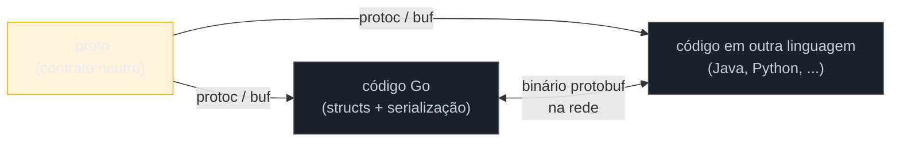

# Protocol Buffers

> [!abstract] TL;DR
> **Protocol Buffers** (protobuf) é a linguagem de definição de esquema que descreve, num arquivo `.proto`, as mensagens que um serviço gRPC troca — nomes de campos, tipos e, principalmente, **números de campo** (`= 1`, `= 2`...), que são o que de fato viaja na serialização binária, não os nomes. `message Pessoa { string nome = 1; int32 idade = 2; }` define uma struct portável entre linguagens. `enum` define conjuntos fechados de valores nomeados, também numerados. O arquivo `.proto` é compilado por `protoc` (ou pela ferramenta mais moderna `buf`) em código Go — a próxima nota deste galho — mas o `.proto` em si não tem nada de Go: é neutro de linguagem, é o contrato. Evoluir esse contrato sem quebrar quem já o consome é a razão de existir dos números de campo e das regras de compatibilidade que esta nota estabelece.

## O problema que motiva um esquema

Imagine dois serviços em produção, escritos por times diferentes, que precisam trocar um pedido de compra. Se cada time serializa como JSON solto — `{"nome": "Ana", "idade": 30}` — nada garante que os dois lados concordam sobre o que "idade" significa, se é obrigatório, ou se um dia vira string em vez de número. JSON não impõe contrato nenhum: é só texto que *parece* estruturado. Erros de integração desse tipo costumam aparecer em produção, não em compilação — o pior lugar possível para descobrir que um campo mudou de tipo.

A trilha [[03-Dominios/Engenharia/Comunicação entre Sistemas/index|Comunicação entre Sistemas]] já cobriu esse problema em abstrato: contratos explícitos, versionados, verificáveis antes do deploy. Protobuf é a resposta concreta que o mundo gRPC dá a esse problema — um arquivo `.proto` que qualquer linguagem consegue ler, gerar código a partir dele, e validar em tempo de compilação que os dois lados concordam sobre a forma dos dados.

## Anatomia de um `.proto`

Um arquivo mínimo:

```protobuf
syntax = "proto3";

package catalogo.v1;

option go_package = "github.com/exemplo/catalogo/gen/catalogov1";

message Produto {
  string id = 1;
  string nome = 2;
  int32 preco_centavos = 3;
  bool disponivel = 4;
}
```

Cada linha carrega uma decisão:

- `syntax = "proto3";` — declara a versão da linguagem protobuf. Proto3 é o padrão atual; proto2 ainda existe em bases legadas, mas todo `.proto` novo usa proto3.
- `package catalogo.v1;` — namespace lógico do protobuf, evita colisão de nomes de mensagem entre arquivos diferentes. O `v1` aqui é convenção de versionamento de API, não sintaxe obrigatória — mas é tão comum que vale adotar desde a primeira nota.
- `option go_package = "...";` — instrução específica para o gerador Go: em que pacote/módulo o código gerado deve viver. Sem essa linha, `protoc`/`buf` não sabem que import path usar no `.go` gerado.
- `message Produto { ... }` — a definição em si: um tipo estruturado com campos nomeados e tipados.



O `.proto` é a única fonte de verdade. Go e qualquer outra linguagem geram código a partir *dele* — nunca o inverso. Isso é o que torna gRPC poliglota por padrão: um serviço em Go e um cliente em Python conversam porque ambos compilaram o mesmo `.proto`, não porque alguém escreveu um adaptador à mão.

## Números de campo: o que realmente viaja na rede

Aqui está o detalhe que mais surpreende quem vem de JSON: **o nome do campo (`nome`, `preco_centavos`) nunca é serializado**. O que vai no binário é só o **número do campo** e o valor. `string nome = 2;` significa "o campo de número 2 é uma string chamada `nome` no código gerado" — mas na rede, o número 2 é a única coisa que identifica esse campo.

Essa escolha de design é o que torna protobuf compacto (sem repetir nomes de chave em cada mensagem, como JSON faz) e, mais importante, o que possibilita evolução de esquema sem quebrar compatibilidade: você pode **renomear** um campo no `.proto` (mudar `nome` para `nome_completo`) sem quebrar nada, porque o número `2` continua o mesmo e é ele que importa na serialização. O que você **nunca** pode fazer é reaproveitar um número de campo removido para outro propósito — um consumidor antigo, que ainda espera o significado velho do número `2`, vai decodificar lixo.

```protobuf
message Produto {
  string id = 1;
  string nome_completo = 2; // renomeado; número 2 preservado — seguro
  int32 preco_centavos = 3;
  bool disponivel = 4;
  reserved 5;                // campo removido; número nunca reutilizado
  reserved "descricao_antiga"; // nome antigo também reservado, por clareza
}
```

> [!warning] Nunca reutilize um número de campo removido
> Se um campo `int32 quantidade = 5;` for removido, marque o número com `reserved 5;` (e opcionalmente `reserved "quantidade";` para o nome). Sem isso, é fácil um colega adicionar um campo novo com número `5` meses depois — e qualquer cliente que ainda rodava a versão antiga do `.proto` vai interpretar o valor errado, silenciosamente, sem erro de compilação nem de runtime. É o tipo de bug que só aparece em produção, tarde.

## Tipos escalares

Proto3 tem um conjunto fixo de tipos escalares, cada um mapeando para um tipo Go específico depois da geração de código:

| Tipo proto | Tipo Go gerado | Observação |
|---|---|---|
| `string` | `string` | UTF-8 sempre |
| `bool` | `bool` | |
| `int32`, `int64` | `int32`, `int64` | inteiros com sinal, codificação variável |
| `uint32`, `uint64` | `uint32`, `uint64` | sem sinal |
| `sint32`, `sint64` | `int32`, `int64` | codificação otimizada para números negativos |
| `fixed32`, `fixed64` | `uint32`, `uint64` | tamanho fixo, melhor para valores grandes/aleatórios |
| `float`, `double` | `float32`, `float64` | ponto flutuante |
| `bytes` | `[]byte` | dados binários crus |

> [!question]- Por que existem três variações de inteiro (`int32`, `sint32`, `fixed32`) em vez de uma só?
> Cada uma otimiza a codificação binária (*varint*) para um padrão de dados diferente. `int32`/`int64` usam varint puro — eficientes para números pequenos e positivos, mas ineficientes para negativos (um `int32` negativo ocupa 10 bytes em varint puro, por causa de como o complemento de dois é representado). `sint32`/`sint64` aplicam um truque de codificação (*zigzag encoding*) que torna negativos pequenos tão baratos quanto positivos pequenos. `fixed32`/`fixed64` abandonam varint e usam largura fixa — pior para números pequenos, melhor quando os valores costumam ser grandes ou aleatórios (hashes, por exemplo), porque varint não ganha nada codificando um número que já usa todos os bits. Na prática, a maioria do código usa `int32`/`int64`/`string`/`bool` sem pensar muito nisso — a escolha fina só importa em sistemas sensíveis a payload, tipicamente descoberto via profiling, nunca adivinhado a priori.

Um detalhe de proto3 que quebra a intuição de quem vem de structs tipadas: campos escalares **não distinguem "zero" de "não definido"**. `int32 idade = 2;` não setado chega como `0` no lado que recebe — não há `null`/`None` nativo para escalares em proto3 puro. Quando a distinção "campo ausente" vs. "campo é literalmente zero" importa, a solução é envolver o tipo num `message` (padrão *wrapper types*, como `google.protobuf.Int32Value`) ou usar a keyword `optional`, disponível desde proto3 recente — assunto que a próxima nota, ao mostrar o código gerado, torna concreto.

## Enums

Um `enum` protobuf declara um conjunto fechado de valores nomeados, cada um com seu próprio número:

```protobuf
enum Status {
  STATUS_UNSPECIFIED = 0;
  STATUS_ATIVO = 1;
  STATUS_PAUSADO = 2;
  STATUS_ENCERRADO = 3;
}

message Produto {
  string id = 1;
  Status status = 5;
}
```

Duas regras não-opcionais em proto3:

1. **O primeiro valor precisa ser `0`.** É o valor padrão de qualquer campo enum não setado — o mesmo raciocínio de "zero value" que Go já aplica a `int`, `string` e `bool`. Convenção da comunidade: nomear esse zero como `..._UNSPECIFIED` ou `..._UNKNOWN`, deixando explícito que é um estado de "não escolhido", não uma opção de negócio válida.
2. **Números de enum seguem a mesma regra de estabilidade dos campos de mensagem.** Depois de publicado, o número associado a `STATUS_ATIVO` nunca muda — só o nome pode, se necessário.

> [!warning] Prefixar valores de enum evita colisão de nome
> Protobuf não dá escopo de namespace a valores de enum dentro do arquivo inteiro — dois enums diferentes no mesmo `package` não podem ter um valor chamado `ATIVO` cada um, porque colide. Por isso a convenção `STATUS_ATIVO` em vez de só `ATIVO`: o prefixo do nome do enum evita a colisão. É uma convenção da comunidade, não imposta pelo compilador, mas seguida quase universalmente — inclusive nos exemplos oficiais do Google.

## Compilando: `protoc` vs. `buf`

O `.proto` sozinho não roda nada — precisa ser compilado em código-fonte da linguagem alvo. Duas ferramentas fazem isso:

**`protoc`**, o compilador oficial do Google, mais os plugins Go (`protoc-gen-go` e `protoc-gen-go-grpc`):

```bash
protoc \
  --go_out=. --go_opt=paths=source_relative \
  --go-grpc_out=. --go-grpc_opt=paths=source_relative \
  proto/produto.proto
```

**`buf`**, ferramenta mais recente da comunidade, que substitui a linha de comando do `protoc` por um arquivo de configuração declarativo (`buf.gen.yaml`) e adiciona lint e checagem de compatibilidade *breaking-change* embutidos:

```yaml
# buf.gen.yaml
version: v2
plugins:
  - local: protoc-gen-go
    out: gen
    opt: paths=source_relative
  - local: protoc-gen-go-grpc
    out: gen
    opt: paths=source_relative
```

```bash
buf generate
```

A diferença prática: `protoc` é a ferramenta de baixo nível, sempre disponível, presente em qualquer tutorial oficial. `buf` empacota a mesma geração de código com uma experiência mais confortável — versionamento de módulos `.proto`, `buf lint` (aplica boas práticas de estilo automaticamente) e `buf breaking` (compara o `.proto` atual contra uma versão anterior e falha o CI se algo incompatível mudou, como um número de campo reaproveitado). Times que gerenciam múltiplos serviços gRPC tendem a migrar para `buf` justamente por esse detector automático de breaking change — ele pega exatamente a classe de erro descrita na seção anterior, antes que chegue a produção.

Nesta nota, o foco é o `.proto` em si — como escrevê-lo bem, não como rodar o gerador. A próxima nota deste galho entra no comando completo e no código Go que sai do outro lado.

## Por que schema versionado importa

Voltando ao problema de abertura: dois times, dois serviços, um contrato. O que o `.proto` garante — e JSON solto não garante — é que **mudar o contrato de forma incompatível vira erro detectável antes do deploy**, não um bug silencioso em produção. As regras que esta nota estabeleceu (números de campo estáveis, `reserved` em vez de reaproveitar, `enum` começando em `0`) existem todas para sustentar essa garantia: qualquer serviço rodando uma versão mais antiga do `.proto` continua decodificando mensagens novas corretamente, porque campos desconhecidos são simplesmente ignorados, e campos conhecidos nunca mudam de significado.

Esse é o mesmo princípio de compatibilidade retro/para-frente (*backward/forward compatibility*) que a trilha [[03-Dominios/Engenharia/Comunicação entre Sistemas/index|Comunicação entre Sistemas]] trata em abstrato para qualquer contrato de API — protobuf só torna esse princípio mecanicamente verificável, em vez de depender de disciplina de time.

## Casos práticos

**1. Mensagem aninhada** — um `message` pode conter outro `message` como tipo de campo, e listas usam `repeated`:

```protobuf
message Endereco {
  string rua = 1;
  string cidade = 2;
  string cep = 3;
}

message Pedido {
  string id = 1;
  repeated string itens = 2;
  Endereco entrega = 3;
}
```

`repeated string itens = 2;` gera, no lado Go, um `[]string` — a próxima nota mostra o código gerado exato.

**2. Enum com evolução segura** — adicionando um novo status sem quebrar quem já consome a versão antiga:

```protobuf
enum Status {
  STATUS_UNSPECIFIED = 0;
  STATUS_ATIVO = 1;
  STATUS_PAUSADO = 2;
  STATUS_ENCERRADO = 3;
  STATUS_EM_REVISAO = 4; // adicionado depois — número novo, nada quebra
}
```

Clientes antigos que não conhecem `STATUS_EM_REVISAO` simplesmente não têm esse valor no enum gerado deles — se receberem o número `4` de um serviço mais novo, decodificam como o valor numérico bruto, sem crashar.

**3. `oneof` — campos mutuamente exclusivos**, útil quando uma mensagem representa "um destes tipos, nunca mais de um":

```protobuf
message Notificacao {
  string id = 1;
  oneof canal {
    string email = 2;
    string telefone = 3;
    string webhook_url = 4;
  }
}
```

Só um dos três campos dentro do `oneof` pode estar setado por vez — o código Go gerado modela isso com uma interface e tipos concretos por opção, mecanismo que a próxima nota destrincha.

**4. `map` para dicionários** — quando a forma dos dados é chave/valor em vez de lista, `map<K, V>` evita o rodeio de modelar isso como `repeated` de um `message` par-chave-valor:

```protobuf
message Configuracao {
  string id = 1;
  map<string, string> parametros = 2;
}
```

`map<string, string>` gera, no Go, um `map[string]string` direto — sem `message` intermediário para representar a entrada. A restrição da especificação é que a chave (`K`) só pode ser um tipo escalar (nunca `float`, `double` ou outro `message`) — o valor (`V`) pode ser qualquer tipo, inclusive outro `message` aninhado.

## Armadilhas comuns

> [!warning] `snake_case` no `.proto`, `PascalCase`/`camelCase` no Go gerado
> A convenção protobuf pede nomes de campo em `snake_case` (`preco_centavos`, `nome_completo`) — mas o gerador Go converte automaticamente para `PascalCase` nos structs (`PrecoCentavos`, `NomeCompleto`). Isso surpreende quem espera nome idêntico entre `.proto` e código gerado. Não é uma opção configurável no fluxo padrão — é o comportamento de `protoc-gen-go`, alinhado à convenção de exportação de campos do próprio Go (campo exportado = maiúscula inicial).

> [!warning] Adicionar campo `required` não existe em proto3
> Proto2 tinha `required`/`optional`/`repeated` como modificadores explícitos de obrigatoriedade. Proto3 removeu `required` de propósito — todo campo escalar é opcional por padrão, com zero value quando ausente. Se sua modelagem depende de "este campo é sempre obrigatório", a validação precisa acontecer em código Go (ou numa camada de validação separada), não no `.proto`. É uma escolha deliberada dos mantenedores: `required` provou, na prática do Google, ser fonte de dor em evolução de esquema — remover um campo `required` quebra qualquer cliente antigo de forma irreversível.

> [!warning] Não confie na ordem de declaração dos campos
> `int32 idade = 2;` antes de `string nome = 1;` no arquivo `.proto` produz exatamente o mesmo comportamento de serialização que a ordem inversa — o que importa é o número (`= 1`, `= 2`), não a posição no arquivo. É seguro reordenar campos no `.proto` por legibilidade, desde que os números não mudem.

## Como explicar em inglês

> A `.proto` file defines the wire contract for gRPC: `message` blocks describe structured data, and every field carries an explicit field number (`string name = 1;`) — that number, not the field name, is what actually travels in the binary encoding. This is what makes safe schema evolution possible: you can rename a field freely, but you can never reuse a removed field's number, which is why deprecated fields get marked `reserved`. `enum` types work the same way, with the added rule that the first value must be `0` and serves as the implicit default. Compiling a `.proto` into Go code — and into any other target language — is done with `protoc` plus its Go plugins, or increasingly with `buf`, which adds built-in linting and breaking-change detection across schema versions. The `.proto` itself is language-neutral; it's the single source of truth that every service, regardless of implementation language, generates code from.

| Termo PT | Termo EN |
|---|---|
| esquema | schema |
| número de campo | field number |
| campo reservado | reserved field |
| valor padrão / zero value | default value / zero value |
| compatibilidade retro/para-frente | backward/forward compatibility |
| mudança incompatível | breaking change |
| contrato de API | API contract |
| geração de código | code generation |

## O que vem a seguir

Este `.proto` ainda é só texto — nenhuma linha de Go foi escrita. A [[03 - Gerando código Go|nota 03]] pega exatamente o arquivo `Produto`/`Status`/`Pedido` construído aqui, roda `protoc`/`buf` de verdade, e mostra o struct Go, os métodos `Marshal`/`Unmarshal` e o stub de serviço que saem do outro lado — a ponte entre o contrato neutro desta nota e o código Go que a [[04 - Servidor e cliente gRPC|nota 04]] usa para implementar um servidor de verdade.

## Veja também

- [[01 - Por que gRPC e onde Go brilha]] — o problema que gRPC/protobuf resolve e por que Go é um bom lugar pra isso
- [[03 - Gerando código Go]] — próxima nota: `protoc`/`buf` rodando de fato, código Go gerado
- [[04 - Servidor e cliente gRPC]] — onde o código gerado desta nota vira um serviço rodando
- [[03-Dominios/Engenharia/Comunicação entre Sistemas/index|Trilha Comunicação entre Sistemas]] — contratos de API, versionamento e compatibilidade em abstrato
- [[03-Dominios/Tecnologia/Go/index|Trilha Go]]

## Fontes

- Protocol Buffers. *Language Guide (proto3)*. protobuf.dev. https://protobuf.dev/programming-guides/proto3/ (acessado em 2026-07-18)
- Protocol Buffers. *Field Presence*. protobuf.dev. https://protobuf.dev/programming-guides/field_presence/ (acessado em 2026-07-18)
- Protocol Buffers. *Proto Best Practices*. protobuf.dev. https://protobuf.dev/best-practices/dos-donts/ (acessado em 2026-07-18)
- gRPC Authors. *Basics tutorial — Go*. grpc.io. https://grpc.io/docs/languages/go/basics/ (acessado em 2026-07-18)
- Buf. *buf generate*. buf.build. https://buf.build/docs/generate/overview/ (acessado em 2026-07-18)
- Buf. *buf breaking*. buf.build. https://buf.build/docs/breaking/overview/ (acessado em 2026-07-18)
