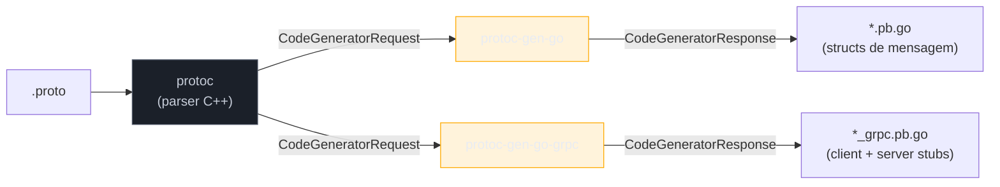
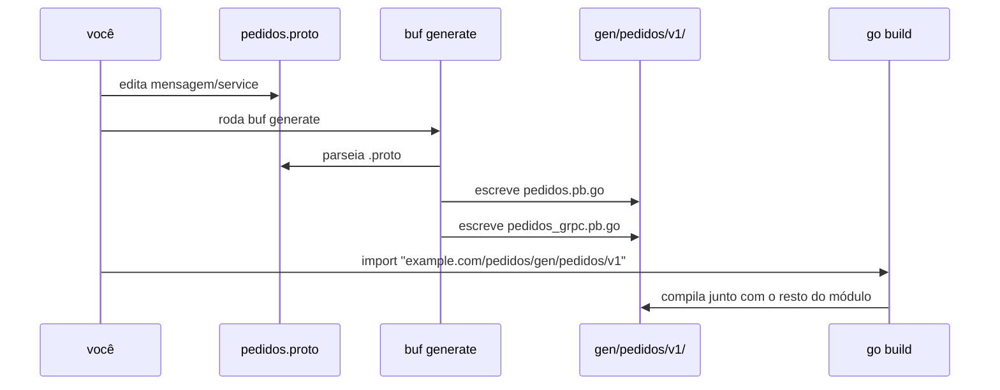

# Gerando código Go

> [!abstract] TL;DR
> Um arquivo `.proto` não roda sozinho — ele é **entrada de compilador**, e a saída é código Go real: structs para as mensagens e stubs de cliente/servidor para os services. O `protoc` (compilador C++ do Protocol Buffers) faz a análise sintática do `.proto`; **plugins** — `protoc-gen-go` (mensagens) e `protoc-gen-go-grpc` (services) — decidem o que sai em Go. `buf` é a ferramenta moderna que substitui a linha de comando gigante do `protoc` por um `buf.yaml`/`buf.gen.yaml` declarativo, com lint e breaking-change detection embutidos. O resultado do build é sempre um par de arquivos `.pb.go` e `_grpc.pb.go` por `.proto` — código que você **nunca edita à mão**, só regenera.

## O problema: um `.proto` não compila para binário nenhum

Na nota anterior, você escreveu um `.proto` com uma mensagem e um service:

```proto
syntax = "proto3";
package pedidos.v1;
option go_package = "example.com/pedidos/gen/pedidos/v1;pedidosv1";

message Pedido {
  string id = 1;
  double total = 2;
}

service PedidoService {
  rpc BuscarPedido(BuscarPedidoRequest) returns (Pedido);
}

message BuscarPedidoRequest {
  string id = 1;
}
```

Agora tente importar isso num programa Go. Não dá — `.proto` não é Go, o compilador `go build` nem sabe que esse arquivo existe. É como ter a planta de uma casa e esperar morar nela: a planta descreve a estrutura, mas alguém — um construtor — precisa transformar linhas no papel em paredes de verdade. O "construtor", aqui, é uma cadeia de ferramentas: `protoc` lê a planta, e **plugins** decidem em que linguagem e com que forma construir.

Essa separação entre "ler o `.proto`" e "gerar código" não é acidente de implementação — é o design central do Protocol Buffers. O mesmo `.proto` gera Go, Java, Python, TypeScript, C++, sem reescrever nada: o `protoc` sempre faz o mesmo parsing; troca-se só o plugin de saída.

## protoc e o modelo de plugin

`protoc` é o compilador oficial de Protocol Buffers, escrito em C++, mantido pelo Google. Sozinho, ele não sabe gerar Go — sabe **parsear** `.proto` em uma representação interna (uma árvore de descritores) e depois **delegar** a geração de código para um plugin externo, um binário separado que o `protoc` invoca via `stdin`/`stdout` usando o mesmo protobuf como formato de comunicação (meta o suficiente para ser engraçado: o compilador de protobuf fala com seus plugins... em protobuf).



Cada linguagem tem seu próprio plugin, identificado por convenção de nome: `protoc-gen-go` é o plugin oficial que gera as structs Go das mensagens; `protoc-gen-go-grpc` é um segundo plugin, separado, que gera os stubs de cliente e servidor gRPC. `protoc` acha esses binários procurando `protoc-gen-<nome>` no `PATH` — é por isso que instalar os dois com `go install` e garantir que `$GOBIN` (ou `$GOPATH/bin`) esteja no `PATH` é pré-requisito, não detalhe:

```bash
go install google.golang.org/protobuf/cmd/protoc-gen-go@latest
go install google.golang.org/grpc/cmd/protoc-gen-go-grpc@latest
```

> [!question]- Por que dois plugins e não um só?
> Porque mensagens e services são conceitos ortogonais. `protoc-gen-go` sabe gerar structs Go a partir de `message` — e é usado por qualquer `.proto` que só tem dados, sem RPC nenhum (serialização protobuf pura, sem gRPC). `protoc-gen-go-grpc` sabe gerar os stubs de `service` — e depende do que `protoc-gen-go` já gerou (os tipos de request/response). Separar os dois deixa protobuf-sem-gRPC (por exemplo, serializar mensagens para um arquivo, ou para uma fila) usável sem carregar o runtime inteiro de gRPC.

A invocação crua, sem `buf`, é uma linha de comando densa:

```bash
protoc \
  --go_out=. --go_opt=paths=source_relative \
  --go-grpc_out=. --go-grpc_opt=paths=source_relative \
  pedidos.proto
```

`--go_out` diz onde escrever o código de mensagens; `--go-grpc_out`, onde escrever os stubs de service; `paths=source_relative` faz o arquivo gerado ficar ao lado do `.proto` de origem, em vez de replicar o `go_package` inteiro como estrutura de pastas. Funciona — mas em um projeto com dezenas de `.proto` importando uns aos outros, essa linha vira um script de build inteiro só para montar as flags certas. É exatamente o problema que `buf` resolve.

## buf: a toolchain declarativa

`buf` (da Buf Technologies) não substitui `protoc` — ele **empacota** um `protoc` compatível e organiza a configuração em arquivos declarativos, do jeito que `go.mod` organiza dependências em vez de flags de `go build` na mão. Dois arquivos fazem o trabalho:

**`buf.yaml`** — configuração do módulo (equivalente a um `go.mod` para `.proto`):

```yaml
version: v2
lint:
  use:
    - STANDARD
breaking:
  use:
    - FILE
```

**`buf.gen.yaml`** — configuração de geração, dizendo quais plugins rodar e onde escrever a saída:

```yaml
version: v2
plugins:
  - local: protoc-gen-go
    out: gen
    opt: paths=source_relative
  - local: protoc-gen-go-grpc
    out: gen
    opt: paths=source_relative
```

Com os dois arquivos na raiz do projeto, o build inteiro vira um comando:

```bash
buf generate
```

`buf` acha todos os `.proto` do projeto (não precisa listar cada um), resolve `import` entre eles, invoca `protoc-gen-go` e `protoc-gen-go-grpc` na ordem certa, e escreve tudo em `gen/`. Além disso, `buf lint` valida estilo (nomes de campo em `snake_case`, `package` versionado, etc.) e `buf breaking` detecta mudanças que quebrariam compatibilidade binária entre versões do `.proto` — checagem que não existe rodando `protoc` cru. Times gRPC de produção hoje, majoritariamente, usam `buf` em vez de `protoc` direto — é a ferramenta recomendada pela própria documentação do `protocol-buffers` para projetos Go.

> [!info] `buf` não precisa de `protoc` instalado
> `buf generate` embute seu próprio parser de `.proto`, compatível com o do `protoc` oficial — você só precisa ter os plugins Go (`protoc-gen-go`, `protoc-gen-go-grpc`) no `PATH`, não o `protoc` C++ em si. Isso simplifica CI: uma imagem Docker só com Go e `buf` já compila `.proto`.

## O que sai do outro lado: `.pb.go` e `_grpc.pb.go`

Rodando `buf generate` (ou o `protoc` cru) sobre o `.proto` do início, aparecem dois arquivos gerados por `.proto` de entrada:

**`pedidos.pb.go`** — as structs, uma por `message`:

```go
// Código gerado por protoc-gen-go. NÃO EDITE.

type Pedido struct {
    state         protoimpl.MessageState
    sizeCache     protoimpl.SizeCache
    unknownFields protoimpl.UnknownFields

    Id    string  `protobuf:"bytes,1,opt,name=id,proto3" json:"id,omitempty"`
    Total float64 `protobuf:"fixed64,2,opt,name=total,proto3" json:"total,omitempty"`
}

func (x *Pedido) GetId() string {
    if x != nil {
        return x.Id
    }
    return ""
}

func (x *Pedido) GetTotal() float64 {
    if x != nil {
        return x.Total
    }
    return 0
}
```

Cada campo do `.proto` vira um campo Go exportado, com **struct tag** `protobuf:"..."` — o mesmo mecanismo de reflection sobre tags que você já viu na nota de *struct tags* do Galho 2, aqui usado pelo runtime do protobuf para serializar/deserializar sem gerar código de codec por tipo. Repare também nos getters (`GetId()`, `GetTotal()`): são gerados para permitir chamar `pedido.GetId()` mesmo quando `pedido` é `nil` — retornam o zero value em vez de entrar em pânico, um detalhe que evita `nil pointer dereference` em código que navega mensagens aninhadas opcionais.

**`pedidos_grpc.pb.go`** — os stubs de cliente e servidor, um por `service`:

```go
// Código gerado por protoc-gen-go-grpc. NÃO EDITE.

type PedidoServiceClient interface {
    BuscarPedido(ctx context.Context, in *BuscarPedidoRequest, opts ...grpc.CallOption) (*Pedido, error)
}

type PedidoServiceServer interface {
    BuscarPedido(context.Context, *BuscarPedidoRequest) (*Pedido, error)
    mustEmbedUnimplementedPedidoServiceServer()
}

type UnimplementedPedidoServiceServer struct{}

func (UnimplementedPedidoServiceServer) BuscarPedido(context.Context, *BuscarPedidoRequest) (*Pedido, error) {
    return nil, status.Errorf(codes.Unimplemented, "method BuscarPedido not implemented")
}
```

Duas interfaces — `PedidoServiceClient` e `PedidoServiceServer` — mais um tipo `UnimplementedPedidoServiceServer` que implementa todos os métodos retornando `codes.Unimplemented`. Esse último é o mecanismo de **evolução com compatibilidade**: se você embedar `UnimplementedPedidoServiceServer` na sua implementação real do servidor, adicionar um novo RPC ao `.proto` no futuro não quebra o build do seu código — o método novo já existe (via embedding, promovido do tipo embutido) retornando "não implementado" até você sobrescrevê-lo de verdade. É o mesmo mecanismo de *embedding e promoção de métodos* do Galho 2, aplicado aqui como estratégia deliberada de forward-compatibility.

A implementação concreta do servidor — que você escreve à mão, não gerada — e o uso do client gerado são o assunto da próxima nota; aqui o ponto é só reconhecer a forma do que sai do gerador.

## O fluxo de build completo



O `.proto` nunca é compilado diretamente pelo `go build` — ele é uma etapa **anterior**, tipicamente rodada uma vez por alteração de contrato, com o resultado (`gen/`) commitado no repositório ou regenerado em CI antes do build. As duas convenções coexistem na comunidade: times pequenos costumam commitar `gen/` (menos fricção — clonar e já compila); times maiores frequentemente regeneram em CI e ignoram `gen/` no `.gitignore`, tratando o código gerado como artefato de build, não como fonte. Nenhuma das duas é "a certa" — é decisão de projeto, geralmente movida por quão caro é rodar `buf generate` no pipeline.

> [!warning] Nunca edite `.pb.go` ou `_grpc.pb.go` à mão
> O cabeçalho `// Code generated ... DO NOT EDIT.` não é sugestão — é contrato. Qualquer edição manual desaparece na próxima execução de `buf generate`, sem aviso. Se o código gerado não faz o que você precisa, o ajuste é no `.proto` (mudar a mensagem, adicionar um campo, mudar o `go_package`) ou nas *opções* de geração — nunca no arquivo `.pb.go` diretamente.

> [!warning] `go_package` precisa bater com o import path real, ou o `go build` falha
> A opção `option go_package = "example.com/pedidos/gen/pedidos/v1;pedidosv1"` no `.proto` determina tanto o caminho de import Go quanto o nome do pacote (a parte depois do `;`). Se esse valor não corresponder à posição real do arquivo gerado dentro do seu módulo (comparado ao `module` declarado no `go.mod`), o `go build` reclama de pacote não encontrado — um erro que parece de configuração do Go, mas nasce no `.proto`.

> [!warning] Versão do plugin desalinhada com a versão do runtime gera erro só em tempo de execução
> `protoc-gen-go` e `protoc-gen-go-grpc` são instalados via `go install ...@latest` — mas o código gerado depende, em runtime, dos módulos `google.golang.org/protobuf` e `google.golang.org/grpc` do seu `go.mod`. Se o plugin instalado é muito mais novo que o runtime no `go.mod`, o build às vezes passa mas o comportamento em runtime diverge (campos novos ignorados, painc em reflection). Trave a versão do plugin junto com a do módulo — não deixe `@latest` implícito em pipeline de CI sem pin.

## Vindo de outras linguagens

| Origem | Equivalente ao par `protoc-gen-go` + `protoc-gen-go-grpc` |
|---|---|
| Java | `protobuf-maven-plugin` ou `protoc-gen-grpc-java`, gerando `.java` a partir do mesmo `.proto` — mesma dualidade mensagem/service, dois artefatos |
| Python | `grpcio-tools` (`python -m grpc_tools.protoc`), que gera `_pb2.py` (mensagens) e `_pb2_grpc.py` (services) — nomenclatura quase espelhada em Go |
| Node/TypeScript | `ts-proto` ou `@grpc/grpc-js` com `protoc-gen-grpc-web`/`protoc-gen-ts` — ecossistema mais fragmentado em plugins de terceiros que o de Go |

O padrão é o mesmo em todo lugar: `protoc` (ou `buf`) faz o parsing uma vez, plugins específicos de linguagem decidem a forma do código gerado. Quem já gerou stubs gRPC em Java ou Python reconhece a estrutura de imediato — só trocam os nomes dos arquivos e a sintaxe de dentro.

## Como explicar em inglês

> A `.proto` file isn't executable on its own — it's compiler input. `protoc` parses the file into an internal descriptor; language-specific **plugins**, invoked by naming convention (`protoc-gen-go`, `protoc-gen-go-grpc`), turn that descriptor into actual code. In Go, `protoc-gen-go` generates message structs with `protobuf` struct tags; `protoc-gen-go-grpc` generates client and server interfaces plus an `UnimplementedXxxServer` type for forward-compatible service evolution. `buf` is the modern toolchain that replaces `protoc`'s long flag-heavy command line with a declarative `buf.yaml` / `buf.gen.yaml`, and adds linting and breaking-change detection on top. Generated files are always marked `DO NOT EDIT` — never hand-edit them; the fix always lives in the `.proto` source.

| Termo PT | Termo EN |
|---|---|
| compilador de protobuf | protobuf compiler |
| plugin de geração | codegen plugin |
| código gerado | generated code |
| stub de cliente/servidor | client/server stub |
| detecção de mudança quebrável | breaking-change detection |
| caminho de import | import path |
| compatibilidade retroativa | forward/backward compatibility |

## O que vem a seguir

O código gerado nesta nota — `PedidoServiceClient`, `PedidoServiceServer`, `UnimplementedPedidoServiceServer` — é só o esqueleto. A [[04 - Servidor e cliente gRPC|nota 04]] entra na parte que você de fato escreve: implementar `PedidoServiceServer` com lógica real, registrar o serviço num `grpc.Server`, abrir a porta com `net.Listen`, e escrever um cliente que usa `grpc.NewClient` para chamar `BuscarPedido` do outro lado da rede.

## Veja também

- [[02 - Protocol Buffers|02 — Protocol Buffers]] — a sintaxe do `.proto` que esta nota compila
- [[04 - Servidor e cliente gRPC|04 — Servidor e cliente gRPC]] — próxima nota do galho
- [[03-Dominios/Tecnologia/Go/02 - Tipos, structs e métodos/07 - Struct tags e reflection básica|Galho 2, nota 07]] — struct tags, o mecanismo por trás de `protobuf:"..."`
- [[03-Dominios/Tecnologia/Go/02 - Tipos, structs e métodos/05 - Composição por embedding|Galho 2, nota 05]] — embedding, usado por `UnimplementedXxxServer` para forward-compatibility
- [[03-Dominios/Tecnologia/Go/index|Trilha Go]]

## Fontes

- The Go Authors. *Protocol Buffers — Go Generated Code*. protobuf.dev. https://protobuf.dev/reference/go/go-generated/ (acessado em 2026-07-18)
- gRPC Authors. *gRPC Basics — Go (Generating client and server code)*. grpc.io. https://grpc.io/docs/languages/go/basics/ (acessado em 2026-07-18)
- gRPC Authors. *Quick start — Go*. grpc.io. https://grpc.io/docs/languages/go/quickstart/ (acessado em 2026-07-18)
- Buf Technologies. *Generate code (buf generate)*. buf.build. https://buf.build/docs/generate/overview/ (acessado em 2026-07-18)
- Buf Technologies. *buf.gen.yaml reference*. buf.build. https://buf.build/docs/configuration/v2/buf-gen-yaml/ (acessado em 2026-07-18)
- The Go Authors. *pkg.go.dev — google.golang.org/protobuf/cmd/protoc-gen-go*. pkg.go.dev. https://pkg.go.dev/google.golang.org/protobuf/cmd/protoc-gen-go (acessado em 2026-07-18)
