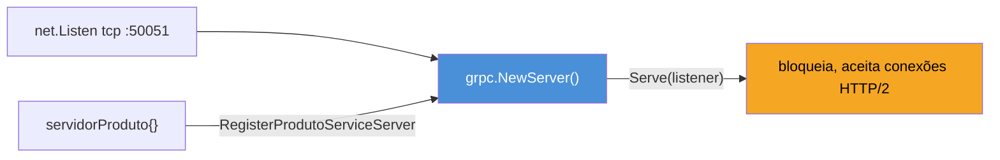
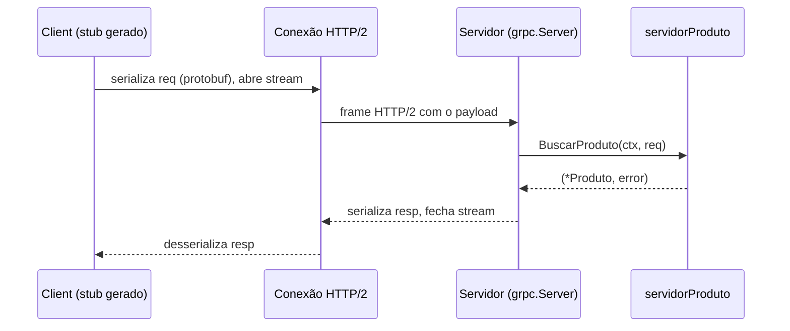

# Servidor e cliente gRPC

> [!abstract] TL;DR
> A nota anterior gerou `.pb.go` (mensagens) e `_grpc.pb.go` (interface `Server` + client stub) a partir do `.proto`. Agora esse código gerado ganha vida: no servidor, você implementa a interface — um `struct` com um método por RPC — e registra a implementação num `grpc.Server` com `RegisterXxxServer`, que por sua vez escuta um `net.Listener` TCP comum. No cliente, `grpc.NewClient` abre uma conexão (`*grpc.ClientConn`) e `NewXxxClient` embrulha essa conexão num stub tipado — chamar `client.Metodo(ctx, req)` parece uma chamada de função local, mas viaja pela rede via HTTP/2 e volta serializada em protobuf. Erros não usam `error` genérico: usam **status codes** (`codes.NotFound`, `codes.InvalidArgument`, ...) empacotados num `status.Status`, o equivalente gRPC dos códigos HTTP.

## Do arquivo gerado ao serviço rodando

Você já tem o `.pb.go` e o `_grpc.pb.go` — código gerado, que ninguém edita à mão. Só que código gerado sozinho não faz nada: é andaime. Falta a parte que só você pode escrever, porque só você sabe a regra de negócio — o que o serviço *faz* quando alguém chama `BuscarProduto`.

Pense na analogia de um contrato de trabalho. O `.proto` é a descrição da vaga — "este cargo recebe um pedido assim, devolve uma resposta assim". `protoc` gera a interface do cargo (`ProdutoServiceServer`) e o formulário padrão de candidatura (o client stub). Mas ninguém contrata a *interface* — alguém precisa efetivamente **assumir o cargo**, implementando cada método com um corpo de verdade. É exatamente isso que este capítulo cobre: implementar a interface gerada, registrar essa implementação num servidor que escuta a rede, e do outro lado, escrever um cliente que chama esses métodos como se fossem locais.

Considere um `.proto` mínimo, já compilado na nota anterior:

```protobuf
service ProdutoService {
  rpc BuscarProduto(BuscarProdutoRequest) returns (Produto);
}

message BuscarProdutoRequest {
  string id = 1;
}

message Produto {
  string id = 1;
  string nome = 2;
  double preco = 3;
}
```

`protoc` com o plugin `protoc-gen-go-grpc` gera, entre outras coisas, esta interface em `produto_grpc.pb.go`:

```go
type ProdutoServiceServer interface {
    BuscarProduto(context.Context, *BuscarProdutoRequest) (*Produto, error)
    mustEmbedUnimplementedProdutoServiceServer()
}
```

Um método por RPC declarado no `.proto`, cada um recebendo um `context.Context` e o ponteiro da mensagem de request, devolvendo o ponteiro da mensagem de response e um `error`. Isso já deveria soar familiar: é a mesma forma de qualquer handler HTTP em Go, só que tipado ponta a ponta em vez de `[]byte` cru — assunto que a [[03-Dominios/Tecnologia/Go/10 - HTTP e frameworks web/index|trilha de HTTP]] já cobriu para REST.

> [!info] `mustEmbedUnimplementedProdutoServiceServer` — compatibilidade futura forçada pelo compilador
> Toda interface de serviço gerada (desde as versões modernas do plugin) carrega esse método extra não-exportável. Ele existe para forçar você a embedar `UnimplementedProdutoServiceServer` no seu struct — um tipo gerado com stubs de todos os métodos, cada um retornando `codes.Unimplemented`. Se o `.proto` ganhar um novo RPC amanhã, seu serviço continua compilando (o stub embutido cobre o método novo) em vez de quebrar o build de todo mundo que ainda não implementou o método novo. Sem esse embedding, o compilador recusa seu struct como implementação válida da interface.

## Implementando a interface

A implementação é um struct comum, sem mágica: embeda o `Unimplemented...` e declara um método com a assinatura exata que a interface pede.

```go
package main

import (
    "context"
    "errors"

    pb "meuprojeto/proto/produto"
)

type servidorProduto struct {
    pb.UnimplementedProdutoServiceServer
    produtos map[string]*pb.Produto // stand-in para um repositório de verdade
}

func (s *servidorProduto) BuscarProduto(
    ctx context.Context,
    req *pb.BuscarProdutoRequest,
) (*pb.Produto, error) {
    produto, ok := s.produtos[req.GetId()]
    if !ok {
        return nil, errors.New("produto não encontrado")
    }
    return produto, nil
}
```

Repare em `req.GetId()` em vez de `req.Id`. Os dois funcionam — mas o getter gerado é o idiomático em protobuf-Go: ele lida com `req == nil` sem entrar em pânico (devolve o zero value), o que importa porque mensagens protobuf podem chegar como ponteiro nulo em alguns caminhos de erro. `req.Id` direto funciona igual quando `req` não é nulo, mas não tem essa rede de segurança.

O `errors.New` ali em cima está errado de propósito — é a versão "ingênua" que a seção de status codes corrige adiante. Guarde essa pergunta.

## Registrando e subindo o servidor

Um `*grpc.Server` é, por baixo, um multiplexador HTTP/2 que sabe rotear frames para o método certo do serviço certo. Ele precisa de duas coisas: uma instância registrada da sua implementação, e um `net.Listener` TCP para aceitar conexões.



```go
func main() {
    lis, err := net.Listen("tcp", ":50051")
    if err != nil {
        log.Fatalf("falha ao escutar: %v", err)
    }

    grpcServer := grpc.NewServer()
    pb.RegisterProdutoServiceServer(grpcServer, &servidorProduto{
        produtos: map[string]*pb.Produto{
            "1": {Id: "1", Nome: "Teclado", Preco: 199.90},
        },
    })

    log.Println("servidor gRPC ouvindo em :50051")
    if err := grpcServer.Serve(lis); err != nil {
        log.Fatalf("erro ao servir: %v", err)
    }
}
```

`net.Listen("tcp", ":50051")` é puro pacote `net` da standard library — gRPC não inventa transporte próprio, usa o que Go já tem, exatamente como a [[03-Dominios/Tecnologia/Go/01 - Fundamentos e sintaxe/index|trilha de fundamentos]] já viu em sockets crus. `grpc.NewServer()` cria o servidor propriamente dito — ainda sem serviço nenhum registrado, um multiplexador vazio. `RegisterProdutoServiceServer(grpcServer, &servidorProduto{...})` é a função gerada (uma por serviço no `.proto`) que ensina o multiplexador a rotear chamadas de `ProdutoService` para essa instância específica. `Serve(lis)` bloqueia a goroutine atual, aceitando conexões até o processo morrer ou alguém chamar `GracefulStop()`.

> [!warning] `grpcServer.Serve` é bloqueante — não retorna em operação normal
> Se você rodar isso como a última linha de `main()`, ele não vai "terminar e seguir para a próxima linha" — vai ficar ali indefinidamente. Isso é o comportamento correto para um servidor de produção. O erro comum é achar que travou; na verdade está fazendo exatamente o trabalho dele.

## Conectando: `grpc.Dial` e `grpc.NewClient`

> [!info] `grpc.Dial` está deprecated desde grpc-go v1.63 (2024) — use `grpc.NewClient`
> Versões mais antigas de tutoriais em português e inglês ainda mostram `grpc.Dial(endereço, opts...)`. Continua funcionando, mas o time do grpc-go recomenda `grpc.NewClient` desde meados de 2024: a diferença mais relevante é que `Dial` fazia resolução de DNS e conexão TCP imediatamente (comportamento "eager"), enquanto `NewClient` é preguiçoso — a conexão real só acontece na primeira chamada RPC, ou explicitamente via `conn.Connect()`. Novo código deveria usar `NewClient`.

```go
conn, err := grpc.NewClient(
    "localhost:50051",
    grpc.WithTransportCredentials(insecure.NewCredentials()),
)
if err != nil {
    log.Fatalf("falha ao criar client: %v", err)
}
defer conn.Close()

client := pb.NewProdutoServiceClient(conn)
```

`grpc.WithTransportCredentials(insecure.NewCredentials())` desliga TLS — aceitável em desenvolvimento local ou dentro de uma malha de serviço que já criptografa no nível da infra (mTLS via service mesh, por exemplo), mas nunca em produção falando com a rede externa sem essa proteção. TLS de verdade — certificados, mTLS entre serviços — é assunto da nota de produção mais adiante neste galho.

`pb.NewProdutoServiceClient(conn)` — também função gerada — embrulha a conexão bruta num stub tipado: `client` agora tem um método `BuscarProduto` com a mesma assinatura que você implementou no servidor, só que do lado de quem chama.

## Chamando um RPC unário

```go
ctx, cancel := context.WithTimeout(context.Background(), 3*time.Second)
defer cancel()

resp, err := client.BuscarProduto(ctx, &pb.BuscarProdutoRequest{Id: "1"})
if err != nil {
    log.Fatalf("erro na chamada: %v", err)
}

fmt.Printf("produto: %s — R$%.2f\n", resp.GetNome(), resp.GetPreco())
```

À primeira vista, `client.BuscarProduto(ctx, req)` parece uma chamada de função local qualquer — e essa é literalmente a proposta de valor histórica do RPC (*Remote Procedure Call*): esconder a rede atrás de uma assinatura que parece uma chamada in-process. Por baixo, porém, aconteceu bastante coisa: `req` foi serializado em protobuf binário, viajou como corpo de uma requisição HTTP/2 (um stream dedicado, multiplexado com outras chamadas na mesma conexão TCP), o servidor desserializou, rodou seu método, serializou a resposta, e ela voltou pelo mesmo stream.



O `context.Context` que você passa em `client.BuscarProduto(ctx, req)` não é decoração — é o mecanismo que propaga timeout e cancelamento pela rede. Se o `ctx` expirar, o gRPC cancela a chamada dos dois lados, algo que a [[03-Dominios/Tecnologia/Go/09 - Sincronização e context/index|trilha de context]] já preparou o terreno para entender.

## Erros: status codes, não `error` cru

Aqui está a correção prometida lá em cima. `errors.New("produto não encontrado")` funciona — compila, satisfaz a assinatura `error` — mas do lado do cliente, tudo que chega é uma string opaca: `rpc error: code = Unknown desc = produto não encontrado`. `code = Unknown` é o problema: o cliente não tem como distinguir programaticamente "não encontrado" de "banco de dados caiu" de "argumento inválido". Cada um desses merece um tratamento diferente (retry faz sentido para uns, não para outros), e string-matching na mensagem de erro é exatamente o tipo de acoplamento frágil que gRPC existe para evitar.

A correção é usar o pacote `google.golang.org/grpc/status`, que empacota um código estruturado — o `codes.Code`, o equivalente gRPC dos status HTTP (`404`, `400`, `500`) — junto da mensagem:

```go
import (
    "google.golang.org/grpc/codes"
    "google.golang.org/grpc/status"
)

func (s *servidorProduto) BuscarProduto(
    ctx context.Context,
    req *pb.BuscarProdutoRequest,
) (*pb.Produto, error) {
    if req.GetId() == "" {
        return nil, status.Error(codes.InvalidArgument, "id é obrigatório")
    }

    produto, ok := s.produtos[req.GetId()]
    if !ok {
        return nil, status.Errorf(codes.NotFound, "produto %q não encontrado", req.GetId())
    }

    return produto, nil
}
```

`status.Error(codes.NotFound, msg)` devolve um `error` comum — continua satisfazendo a assinatura da interface — mas um `error` que carrega, internamente, o código estruturado. Do lado do cliente, você extrai esse código de volta com `status.FromError`:

```go
resp, err := client.BuscarProduto(ctx, &pb.BuscarProdutoRequest{Id: "999"})
if err != nil {
    st, ok := status.FromError(err)
    if ok && st.Code() == codes.NotFound {
        fmt.Println("produto não existe, seguindo com fallback")
    } else {
        log.Fatalf("erro inesperado: %v", err)
    }
    return
}
```

| Código | Uso típico | Análogo HTTP |
|---|---|---|
| `codes.OK` | sucesso (implícito quando `err == nil`) | 200 |
| `codes.InvalidArgument` | request malformado, campo obrigatório ausente | 400 |
| `codes.NotFound` | recurso não existe | 404 |
| `codes.AlreadyExists` | violação de unicidade | 409 |
| `codes.PermissionDenied` | autenticado, mas sem permissão | 403 |
| `codes.Unauthenticated` | credencial ausente ou inválida | 401 |
| `codes.DeadlineExceeded` | `ctx` expirou antes da resposta | 504 |
| `codes.Unavailable` | servidor fora do ar, retry costuma fazer sentido | 503 |
| `codes.Internal` | bug/falha interna não classificada | 500 |

> [!warning] Retornar `error` cru some com o código — sempre vira `codes.Unknown`
> Se o método devolver `errors.New(...)`, `fmt.Errorf(...)` ou qualquer `error` que não seja construído via `status.Error`/`status.Errorf`, o runtime gRPC embrulha automaticamente em `codes.Unknown` na hora de serializar para o cliente. Não há como o cliente recuperar semântica nenhuma daí — `Unknown` é, por definição, "sem informação útil". A disciplina de sempre usar `status.Error` nos métodos de serviço evita essa perda silenciosa.

> [!warning] `codes.OK` nunca deve ser usado explicitamente em `status.Error`
> `codes.OK` significa sucesso — usá-lo dentro de `status.Error(codes.OK, ...)` é contraditório e o comportamento é indefinido/inconsistente entre implementações. Sucesso se expressa devolvendo `nil` como `error`, ponto.

## Uma conexão, muitas chamadas

Um erro comum de quem chega do mundo REST — onde é natural abrir uma conexão HTTP por requisição, ou confiar num pool de conexões escondido dentro do cliente — é tratar `grpc.NewClient` como algo para chamar a cada RPC. Não é. `*grpc.ClientConn` já é, por dentro, um pool: multiplexa múltiplas chamadas concorrentes na mesma conexão HTTP/2 (streams diferentes, mesma conexão TCP), reconecta sozinho se cair, e faz *load balancing* entre múltiplos endereços se o resolver DNS devolver mais de um IP. O padrão idiomático é abrir a conexão **uma vez**, guardar o `client` derivado dela, e reutilizar por toda a vida do processo:

```go
type app struct {
    produtoClient pb.ProdutoServiceClient
}

func newApp(endereco string) (*app, func() error, error) {
    conn, err := grpc.NewClient(
        endereco,
        grpc.WithTransportCredentials(insecure.NewCredentials()),
    )
    if err != nil {
        return nil, nil, err
    }
    return &app{produtoClient: pb.NewProdutoServiceClient(conn)}, conn.Close, nil
}

func main() {
    a, closeConn, err := newApp("localhost:50051")
    if err != nil {
        log.Fatal(err)
    }
    defer closeConn()

    // a.produtoClient é reutilizado em quantas chamadas forem necessárias,
    // inclusive concorrentemente a partir de goroutines diferentes.
    resp, err := a.produtoClient.BuscarProduto(context.Background(), &pb.BuscarProdutoRequest{Id: "1"})
    _ = resp
    _ = err
}
```

`*grpc.ClientConn` é seguro para uso concorrente — múltiplas goroutines podem chamar métodos do mesmo `client` ao mesmo tempo sem coordenação extra, exatamente como `*http.Client` na standard library.

> [!warning] Recriar `grpc.NewClient` a cada requisição desperdiça o trabalho de conexão
> Se o seu handler HTTP (ou qualquer código de request) chama `grpc.NewClient` toda vez que precisa falar com outro serviço, você paga o custo de estabelecer conexão (e, com `NewClient`, ainda adia isso para a primeira chamada real) repetidamente, além de vazar conexões se esquecer o `Close()` correspondente. A conexão deveria nascer na inicialização do processo — ou em algum ponto de injeção de dependência — e viver até o processo encerrar.

## Lente cross-stack

| Vindo de... | Em gRPC-Go |
|---|---|
| Java (gRPC-Java, classe `*ImplBase` abstrata) | Struct comum embedando `Unimplemented...Server` — mesmo papel, sem herança de classe |
| Node.js (`@grpc/grpc-js`, callback `(call, callback) => {...}`) | Método síncrono que retorna `(*Resposta, error)` — sem callback, o `context.Context` já cobre cancelamento |
| Python (`grpcio`, classe herdando de `XxxServicer`) | Mesmo padrão de "implementar interface gerada", mas via embedding de struct, não herança |
| REST/HTTP status codes | `codes.Code` — `codes.NotFound` ≈ `404`, `codes.InvalidArgument` ≈ `400`, propagados via `status.Error`, não via `w.WriteHeader` |

## Como explicar em inglês

> Implementing a gRPC service in Go means writing a plain struct that embeds the generated `Unimplemented...Server` type and satisfies the service interface — one method per RPC, each taking a `context.Context` and a request pointer, returning a response pointer and an `error`. You register that implementation with `RegisterXxxServer` on a `*grpc.Server`, which serves over a standard `net.Listener`. On the client side, `grpc.NewClient` (the modern replacement for the deprecated `grpc.Dial`) opens a connection lazily, and `NewXxxClient` wraps it in a typed stub — calling `client.Method(ctx, req)` looks like a local function call but travels over HTTP/2 as serialized protobuf. Errors are never plain `error` values in practice — they're built with `status.Error(codes.NotFound, msg)` so the client can programmatically branch on the `codes.Code`, gRPC's equivalent of HTTP status codes; an unadorned `error` gets silently downgraded to `codes.Unknown` on the wire.

| Termo PT | Termo EN |
|---|---|
| chamada unária | unary call |
| stub do cliente | client stub |
| ouvinte de rede | listener |
| código de status | status code |
| desserializar / serializar | unmarshal / marshal |
| conexão preguiçosa | lazy connection |
| implementação de serviço | service implementation |

## O que vem a seguir

RPC unário — um request, uma response, ida e volta simples — cobre boa parte dos casos, mas não todos. E se o servidor precisa mandar mil resultados sem carregar tudo na memória de uma vez? E se o cliente precisa fazer upload de um arquivo grande em pedaços? A [[05 - Streaming|nota 05]] entra nos outros três modos que o HTTP/2 por baixo do gRPC habilita: server streaming, client streaming e streaming bidirecional — e no formato do código Go muda quando `resp` deixa de ser um valor único e vira um canal de mensagens.

## Veja também

- [[03 - Gerando código Go|03 — Gerando código Go]] — como os arquivos `.pb.go` e `_grpc.pb.go` usados aqui foram gerados
- [[05 - Streaming|05 — Streaming]] — próxima nota do galho
- [[06 - Interceptors, metadata e erros|06 — Interceptors, metadata e erros]] — tratamento de erro mais sofisticado, cross-cutting via interceptor
- [[03-Dominios/Tecnologia/Go/09 - Sincronização e context/index|Galho 9, Sincronização e context]] — `context.Context` e cancelamento, pré-requisito para entender timeout aqui
- [[03-Dominios/Tecnologia/Go/index|Trilha Go]]

## Fontes

- The gRPC Authors. *Basics tutorial: Go*. grpc.io. https://grpc.io/docs/languages/go/basics/ (acessado em 2026-07-18)
- The gRPC Authors. *Quick start: Go*. grpc.io. https://grpc.io/docs/languages/go/quickstart/ (acessado em 2026-07-18)
- pkg.go.dev. *Package grpc*. https://pkg.go.dev/google.golang.org/grpc (acessado em 2026-07-18)
- pkg.go.dev. *Package status*. https://pkg.go.dev/google.golang.org/grpc/status (acessado em 2026-07-18)
- pkg.go.dev. *Package codes*. https://pkg.go.dev/google.golang.org/grpc/codes (acessado em 2026-07-18)
- The gRPC Authors. *Error handling*. grpc.io. https://grpc.io/docs/guides/error/ (acessado em 2026-07-18)
