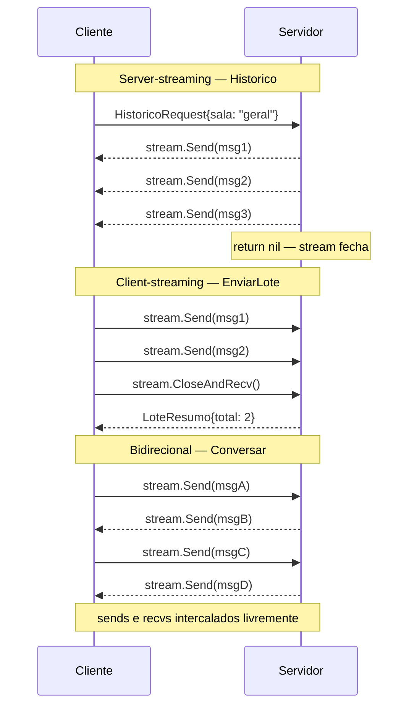

# Streaming

> [!abstract] TL;DR
> gRPC tem quatro formas de RPC, e a nota anterior só usou a mais simples: **unário**, um request e uma response, ponto final. As outras três abrem mão dessa simetria: **server-streaming** (`stream Mensagem`) devolve muitas mensagens para um único request; **client-streaming** (`rpc(stream Mensagem)`) recebe muitas mensagens antes de devolver uma resposta; **bidirecional** (`rpc(stream Mensagem) returns (stream Mensagem)`) abre dois streams independentes, que não precisam nem estar sincronizados um com o outro. Nos três casos, o gRPC-Go entrega o stream como um objeto com `Send`/`Recv` — e por baixo, cada RPC roda na sua própria goroutine, com uma regra de ouro que surpreende quem chega de outra stack: é seguro chamar `Send` e `Recv` **concorrentemente entre si**, mas nunca `Send` de duas goroutines ao mesmo tempo, nem `Recv` de duas goroutines ao mesmo tempo. Streaming bidirecional, na prática, é sempre "uma goroutine que só envia, uma goroutine que só recebe, um `channel` ou `WaitGroup` para não fechar a conexão cedo demais".

## O problema que streaming resolve

A nota anterior definiu um serviço `Historico` que devolve, de uma vez só, a lista inteira de mensagens de uma sala de chat:

```protobuf
rpc Historico(HistoricoRequest) returns (HistoricoResponse);

message HistoricoResponse {
  repeated Mensagem mensagens = 1;
}
```

Funciona bem para uma sala com 50 mensagens. Mas e para uma sala com 500 mil? O servidor precisa montar a `HistoricoResponse` inteira em memória, serializar o pacote todo, e só então começar a mandar um único byte pela rede — o cliente fica esperando o pacote completo chegar antes de processar a primeira mensagem. É o mesmo problema de carregar um arquivo inteiro em memória antes de escrevê-lo em disco, quando dava para simplesmente transmitir em pedaços.

O caso inverso aparece do outro lado: um cliente que quer subir um arquivo grande, ou uma sequência de eventos de telemetria, não quer (nem sempre consegue) montar tudo num único request gigante antes de mandar. Ele quer mandar pedaço a pedaço, à medida que os dados ficam prontos.

E existe um terceiro caso, mais raro mas real: dois lados que precisam trocar mensagens ao vivo, sem que um espere o outro terminar — um chat de verdade, ou uma sessão de jogo, onde cliente e servidor mandam e recebem mensagens de forma independente, no seu próprio ritmo.

RPC unário resolve nenhum dos três. É aí que entram os outros três tipos de RPC do gRPC.

## As quatro formas de RPC

A palavra-chave `stream` no `.proto`, colocada antes do tipo do request e/ou da response, é o que muda o contrato:

```protobuf
syntax = "proto3";

package chat;

option go_package = "example.com/chat/chatpb";

service ChatService {
  // Unário — nota anterior
  rpc Enviar(Mensagem) returns (Confirmacao);

  // Server-streaming: 1 request, N responses
  rpc Historico(HistoricoRequest) returns (stream Mensagem);

  // Client-streaming: N requests, 1 response
  rpc EnviarLote(stream Mensagem) returns (LoteResumo);

  // Bidirecional: N requests, N responses, independentes
  rpc Conversar(stream Mensagem) returns (stream Mensagem);
}

message HistoricoRequest {
  string sala = 1;
}

message Mensagem {
  string autor = 1;
  string texto = 2;
  int64  ts    = 3;
}

message Confirmacao {
  bool ok = 1;
}

message LoteResumo {
  int32 total = 1;
}
```

| Tipo | Assinatura `.proto` | Quando usar |
|---|---|---|
| Unário | `rpc Foo(Req) returns (Resp)` | Requisição/resposta clássica — a maioria dos endpoints |
| Server-streaming | `rpc Foo(Req) returns (stream Resp)` | Resposta grande demais (ou infinita) para caber num pacote — histórico, feed de eventos, resultado de busca paginado sem paginação manual |
| Client-streaming | `rpc Foo(stream Req) returns (Resp)` | Envio grande demais para um request — upload em pedaços, agregação de métricas coletadas aos poucos |
| Bidirecional | `rpc Foo(stream Req) returns (stream Resp)` | Interação ao vivo, sem ordem fixa entre pergunta e resposta — chat, jogo em tempo real, negociação incremental |

Todos os quatro tipos rodam sobre a mesma conexão HTTP/2 subjacente — o que muda é só quantos frames de dados cada lado troca antes de considerar aquela chamada encerrada. A [documentação oficial do gRPC](https://grpc.io/docs/what-is-grpc/core-concepts/#rpc-life-cycle) descreve esse ciclo de vida em detalhe; aqui o foco é como ele aparece no código Go gerado.

## Anatomia de um stream



Repare que no diagrama bidirecional não existe uma amarração 1-para-1 entre o que o cliente manda e o que o servidor responde — os dois lados leem e escrevem no seu próprio ritmo, e é exatamente isso que torna esse modo útil (e mais trabalhoso de programar) em relação aos outros dois.

## Server-streaming na prática

No código gerado pelo `protoc-gen-go-grpc` (nota anterior deste galho cobriu a geração), o método do servidor ganha um segundo parâmetro — um objeto de stream com `Send`, em vez de um retorno comum:

```go
// chatpb/chat_grpc.pb.go (gerado) declara:
//   type ChatService_HistoricoServer interface {
//       Send(*Mensagem) error
//       grpc.ServerStream
//   }

type servidorChat struct {
    chatpb.UnimplementedChatServiceServer
    mensagens map[string][]*chatpb.Mensagem
}

func (s *servidorChat) Historico(req *chatpb.HistoricoRequest, stream chatpb.ChatService_HistoricoServer) error {
    for _, m := range s.mensagens[req.Sala] {
        if err := stream.Send(m); err != nil {
            return err // cliente desconectou, contexto cancelado, etc.
        }
    }
    return nil // return nil fecha o stream com sucesso
}
```

Do lado do cliente, o `Send` do servidor vira uma sequência de `Recv` num loop:

```go
stream, err := client.Historico(ctx, &chatpb.HistoricoRequest{Sala: "geral"})
if err != nil {
    log.Fatalf("abrir stream: %v", err)
}

for {
    msg, err := stream.Recv()
    if err == io.EOF {
        break // servidor deu return nil — fim normal do stream
    }
    if err != nil {
        log.Fatalf("recv: %v", err)
    }
    fmt.Printf("%s: %s\n", msg.Autor, msg.Texto)
}
```

`io.EOF` aqui não é acidente de nomenclatura — o gRPC-Go reaproveita deliberadamente o mesmo sentinel do pacote `io` que qualquer dev Go já reconhece de `io.Reader`: "acabou os dados, sem erro". Qualquer outro valor não-nil em `err` é falha de verdade.

## Client-streaming na prática

Aqui a assinatura se inverte: o servidor recebe o stream e devolve **uma** resposta, chamada explicitamente no fim:

```go
// ChatService_EnviarLoteServer tem Recv() (*Mensagem, error)
// e SendAndClose(*LoteResumo) error

func (s *servidorChat) EnviarLote(stream chatpb.ChatService_EnviarLoteServer) error {
    total := 0
    for {
        msg, err := stream.Recv()
        if err == io.EOF {
            // cliente terminou de enviar — hora de responder
            return stream.SendAndClose(&chatpb.LoteResumo{Total: int32(total)})
        }
        if err != nil {
            return err
        }
        s.mensagens[msg.Autor] = append(s.mensagens[msg.Autor], msg)
        total++
    }
}
```

O cliente abre o stream, manda quantas mensagens quiser, e fecha o envio com `CloseAndRecv` — que bloqueia até a resposta única chegar:

```go
stream, err := client.EnviarLote(ctx)
if err != nil {
    log.Fatalf("abrir stream: %v", err)
}

for _, m := range mensagensParaEnviar {
    if err := stream.Send(m); err != nil {
        log.Fatalf("send: %v", err)
    }
}

resumo, err := stream.CloseAndRecv()
if err != nil {
    log.Fatalf("close and recv: %v", err)
}
fmt.Println("total enviado:", resumo.Total)
```

`CloseAndRecv` faz duas coisas numa chamada só: sinaliza ao servidor "não vou mandar mais nada" (o que dispara o `io.EOF` do lado dele) e bloqueia esperando a resposta. Esquecer de chamá-lo — e simplesmente sair da função depois do loop de `Send` — deixa o stream aberto e o servidor preso esperando um `Recv` que nunca chega a `io.EOF`.

## Bidirecional na prática: o caso que exige duas goroutines

Streaming bidirecional é onde a simetria do diagrama anterior vira código real — e onde o modelo de concorrência do Go finalmente entra em cena de forma inevitável. O servidor recebe um único stream com `Send` e `Recv` ao mesmo tempo:

```go
func (s *servidorChat) Conversar(stream chatpb.ChatService_ConversarServer) error {
    for {
        msg, err := stream.Recv()
        if err == io.EOF {
            return nil
        }
        if err != nil {
            return err
        }

        // eco simplificado: responde a cada mensagem recebida
        resposta := &chatpb.Mensagem{
            Autor: "servidor",
            Texto: "recebido: " + msg.Texto,
        }
        if err := stream.Send(resposta); err != nil {
            return err
        }
    }
}
```

Esse servidor consegue ficar num único loop porque ele responde de forma síncrona a cada mensagem recebida — `Recv`, `Send`, `Recv`, `Send`. Mas o cliente típico de um bidirecional **não** quer esperar mandar tudo antes de começar a ouvir; ele quer enviar e receber ao mesmo tempo, de forma independente. É aqui que uma única goroutine não basta:

```go
stream, err := client.Conversar(ctx)
if err != nil {
    log.Fatalf("abrir stream: %v", err)
}

done := make(chan struct{})

// goroutine dedicada a RECEBER
go func() {
    defer close(done)
    for {
        msg, err := stream.Recv()
        if err == io.EOF {
            return
        }
        if err != nil {
            log.Printf("recv: %v", err)
            return
        }
        fmt.Printf("%s: %s\n", msg.Autor, msg.Texto)
    }
}()

// goroutine principal cuida de ENVIAR
for _, m := range mensagensParaEnviar {
    if err := stream.Send(m); err != nil {
        log.Fatalf("send: %v", err)
    }
    time.Sleep(200 * time.Millisecond) // simula digitação
}
stream.CloseSend() // sinaliza fim do envio; recv continua até io.EOF

<-done // espera a goroutine de recv drenar o resto do stream
```

## O modelo de concorrência: streams sobre goroutines e channels

O gRPC-Go dá ao servidor, por baixo dos panos, uma goroutine dedicada por RPC ativo — é por isso que um `Historico` de uma sala lenta não trava o `Conversar` de outra sala; cada handler roda isolado, exatamente como cada `http.Handler` do pacote `net/http` roda na sua própria goroutine em Go idiomático. Isso já é familiar de qualquer código Go que atenda conexões concorrentes.

A parte nova é a regra de acesso ao *stream em si*, documentada explicitamente pela [equipe do gRPC-Go](https://pkg.go.dev/google.golang.org/grpc#ClientConn):

- É seguro chamar `SendMsg` (o `Send` por trás de `Send`) e `RecvMsg` **concorrentemente**, uma de cada, em goroutines diferentes — é exatamente o padrão do exemplo do cliente acima: uma goroutine só envia, a goroutine principal só recebe.
- **Não** é seguro chamar `Send` de duas goroutines ao mesmo tempo, nem `Recv` de duas goroutines ao mesmo tempo. Streams gRPC não são thread-safe para múltiplos escritores ou múltiplos leitores simultâneos — só para um escritor e um leitor coexistindo.

```mermaid
flowchart LR
    subgraph Cliente["Cliente — 2 goroutines"]
        GS["goroutine\nSend loop"] -->|escreve no stream| STStream HTTP/2
        ST -->|entrega ao| GR["goroutine\nRecv loop"]
    end
    GR -.->|"close(done)\nao ver io.EOF"| DONE(["channel done"])

    style GS fill:#4A90D9,color:#fff
    style GR fill:#F5A623,color:#000
    style ST fill:#7ED321,color:#000
```

Esse padrão — uma goroutine emissora, uma goroutine receptora, um `channel` (`done`, no exemplo) só para sinalizar "a leitura acabou" — não é um truque específico de gRPC. É o mesmo padrão produtor/consumidor que qualquer código Go concorrente usa para coordenar duas goroutines que precisam correr em paralelo sem compartilhar estado mutável diretamente: o `channel` substitui um mutex, porque a única coisa que precisa ser comunicada é "terminei".

> [!info] `context` cancela o stream inteiro
> Assim como no RPC unário, o `ctx` passado para `client.Conversar(ctx)` propaga cancelamento para o stream inteiro — se o contexto expira ou é cancelado, tanto `Send` quanto `Recv` retornam erro imediatamente, e o servidor recebe o mesmo cancelamento do outro lado. É o mecanismo padrão de `context.Context` (Galho 1) reaproveitado sem nenhuma API nova — vantagem de o cancelamento já ser parte da linguagem antes do gRPC entrar em cena.

## Armadilhas comuns

> [!warning] `Send` (ou `Recv`) chamado de duas goroutines ao mesmo tempo corrompe o stream
> Não é um erro que o compilador pega, nem sempre um erro que aparece de cara em teste — é uma *data race* sobre o framing do HTTP/2 por baixo. Se duas goroutines chamarem `stream.Send` simultaneamente, os frames podem se intercalar de forma inválida. A defesa é estrutural: nunca ter mais de uma goroutine chamando `Send` no mesmo stream, nunca mais de uma chamando `Recv`. Se várias goroutines precisam mandar mensagens, elas mandam para um `channel` interno, e uma única goroutine "dona do stream" drena esse `channel` e chama `Send`.

> [!warning] Esquecer `io.EOF` deixa o loop de `Recv` girando em erro
> Tratar `io.EOF` como "só mais um erro qualquer" (por exemplo, logando e tentando de novo) trava o programa num loop de erro infinito, porque `io.EOF` de um stream fechado com sucesso não desaparece na próxima chamada — o stream continua encerrado. O padrão correto é sempre checar `err == io.EOF` primeiro, como fim normal, antes de tratar qualquer outro valor de `err` como falha real.

> [!warning] `CloseSend` não fecha o stream inteiro — só a metade de envio
> Em client-streaming e bidirecional, `stream.CloseSend()` (ou `CloseAndRecv`, que já inclui isso) avisa "não vou mandar mais nada", mas não interrompe a leitura. Num bidirecional, chamar `CloseSend` e sair da função sem drenar o `Recv` até `io.EOF` — como faz o `<-done` do exemplo acima — deixa a goroutine de leitura órfã, sem ninguém esperando por ela, o que tende a vazar goroutine se o processo não terminar logo em seguida.

> [!warning] Backpressure é real: `Send` bloqueia se o outro lado não estiver lendo
> Streams HTTP/2 têm controle de fluxo embutido no protocolo. Se o servidor manda mensagens mais rápido do que o cliente consegue processar (ou vice-versa), `Send` eventualmente **bloqueia** até o outro lado liberar espaço na janela de fluxo — não derruba a conexão, não descarta mensagem, só segura a goroutine chamadora. É proteção automática contra um produtor rápido afogar um consumidor lento, mas também significa que um `Send` "travado" pode ser sintoma normal de backpressure, não necessariamente bug.

## Vindo de outra stack

| Vindo de... | Em Go é assim |
|---|---|
| Java (`grpc-java`) — `StreamObserver<T>` com `onNext`/`onCompleted`/`onError`, callback-based | `Send`/`Recv` explícitos, chamados dentro de loops comuns — sem callback, sem `Observer` a implementar |
| Node.js (`@grpc/grpc-js`) — stream é um `EventEmitter`/`Duplex` do Node, com `.on('data', ...)` | `Recv()` é chamada síncrona bloqueante dentro de um `for`, não um evento assíncrono — mais parecido com iterar um `io.Reader` |
| Python (`grpcio`) — server-streaming é um generator (`yield` a cada mensagem) | O equivalente ao `yield` é a chamada explícita `stream.Send(msg)` dentro do loop — não existe geração implícita de sequência |

O ponto comum entre as três: nenhuma delas expõe, tão explicitamente quanto Go, a regra "uma goroutine só envia, uma goroutine só recebe". Em Java e Node, o runtime de eventos já serializa as chamadas para você por baixo; em Go, como concorrência é explícita em toda a linguagem (Galho 5), a responsabilidade de não violar a regra de acesso ao stream cai para quem escreve o código — reforço direto do que já apareceu em `sync`/`channel` em outras trilhas.

## Como explicar em inglês

> gRPC has four RPC shapes: unary (one request, one response — the default), server-streaming (`stream Response`), client-streaming (`stream Request`), and bidirectional streaming (both sides stream). Generated Go code turns the stream into an object with `Send`/`Recv` methods; a closed stream on the receiving end surfaces as `io.EOF`, the same sentinel Go developers already know from `io.Reader`. Under the hood, gRPC-Go runs each RPC on its own goroutine, and it's safe to call `Send` and `Recv` concurrently — one goroutine sending, one goroutine receiving — but never safe to call `Send` from two goroutines at once, or `Recv` from two goroutines at once. Bidirectional streaming in practice always means spawning a dedicated receive goroutine alongside the main send loop, synchronized with a plain Go channel to signal when the stream has fully drained.

| Termo PT | Termo EN |
|---|---|
| streaming do servidor | server-streaming |
| streaming do cliente | client-streaming |
| streaming bidirecional | bidirectional streaming |
| fluxo / stream | stream |
| controle de fluxo | flow control |
| pressão de retorno | backpressure |
| encerrar o envio | close send |
| goroutine emissora / receptora | sending / receiving goroutine |

## O que vem a seguir

Todo o código desta nota assumiu um mundo feliz: sem autenticação, sem metadados de request, sem um jeito padronizado de devolver erros ricos (só `error` do Go, convertido cruamente para um status gRPC genérico). A [[06 - Interceptors, metadata e erros|nota 06]] fecha essas lacunas — como interceptar toda chamada (unária ou streaming) para logging/auth centralizados, como propagar metadata como um `context.Context` fora de banda, e como devolver códigos de erro gRPC estruturados em vez de um `error` opaco.

## Veja também

- [[01 - Por que gRPC e onde Go brilha|01 — Por que gRPC e onde Go brilha]] — motivação geral do galho
- [[02 - Protocol Buffers|02 — Protocol Buffers]] — a sintaxe `.proto` retomada aqui, incluindo a palavra-chave `stream`
- [[03 - Gerando código Go|03 — Gerando código Go]] — de onde vêm os tipos `ChatService_HistoricoServer` etc. usados nesta nota
- [[04 - Servidor e cliente gRPC|04 — Servidor e cliente gRPC]] — RPC unário, base sobre a qual esta nota constrói os três modos de streaming
- [[06 - Interceptors, metadata e erros|06 — Interceptors, metadata e erros]] — próxima nota do galho
- [[03-Dominios/Tecnologia/Go/index|Trilha Go]]

## Fontes

- gRPC Authors. *Core concepts, architecture and lifecycle*. grpc.io. https://grpc.io/docs/what-is-grpc/core-concepts/ (acessado em 2026-07-18)
- gRPC Authors. *Basics tutorial — Go*. grpc.io. https://grpc.io/docs/languages/go/basics/ (acessado em 2026-07-18)
- Google. *package grpc — ClientConn, ClientStream, ServerStream*. pkg.go.dev. https://pkg.go.dev/google.golang.org/grpc (acessado em 2026-07-18)
- The Go Authors. *Package io — io.EOF*. pkg.go.dev. https://pkg.go.dev/io#pkg-variables (acessado em 2026-07-18)
- The Go Authors. *A Tour of Go — Concurrency, Channels*. go.dev. https://go.dev/tour/concurrency/2 (acessado em 2026-07-18)
