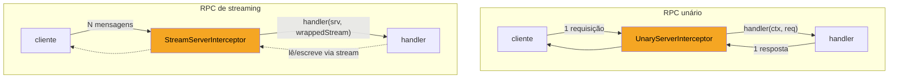
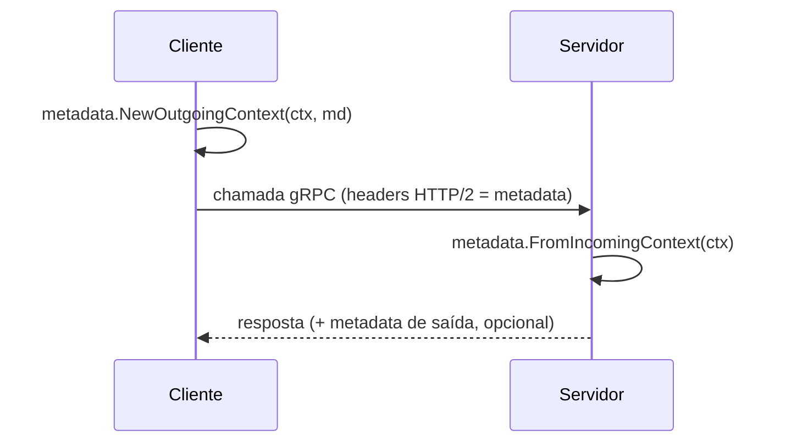
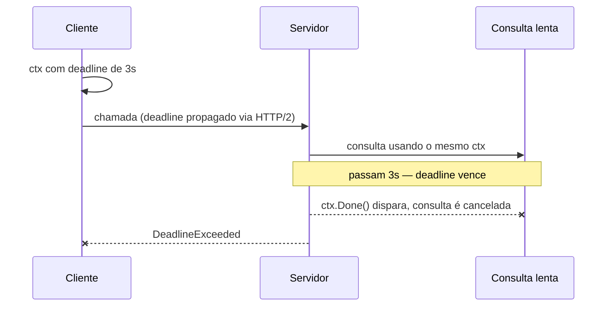

# Interceptors, metadata e erros

> [!abstract] TL;DR
> **Interceptors** são o middleware do gRPC: funções que envolvem toda chamada unária ou de streaming, dando um ponto único para logging, auth, métricas e recovery de panic — sem duplicar esse código em cada handler. **Metadata** é o análogo dos headers HTTP: pares chave-valor viajando fora do corpo da mensagem, acessíveis via `context.Context` com `metadata.FromIncomingContext`. **Erros** em gRPC não são `error` genérico — são um `status.Status` com um `codes.Code` de um conjunto fechado (`NotFound`, `InvalidArgument`, `Unauthenticated`...) mais uma mensagem, construído com `status.Error` e desconstruído com `status.FromError`. E **deadlines** propagam pelo `context.Context` do cliente ao servidor, cruzando a rede — cancelar o contexto do lado que chama cancela o trabalho do lado que serve, mesmo remotamente.

Volte à nota anterior por um segundo. Você já tem um servidor rodando um `StreamServer` funcional, e um handler que atende requisições. Agora imagine que esse handler precisa: logar toda chamada com o tempo que levou, rejeitar quem não mandou um token de autenticação, e devolver um erro específico — "usuário não encontrado", não um genérico "algo deu errado" — quando a busca falha.

A tentação óbvia é colar tudo isso dentro do handler:

```go
func (s *server) GetUser(ctx context.Context, req *pb.GetUserRequest) (*pb.GetUserResponse, error) {
    start := time.Now()
    log.Printf("chamada recebida: GetUser")

    token := extractTokenSomehow() // como, exatamente?
    if token == "" {
        return nil, errors.New("sem autenticação")
    }

    user, err := s.db.FindUser(req.Id)
    if err != nil {
        return nil, err // o cliente recebe... o quê, exatamente?
    }

    log.Printf("GetUser levou %v", time.Since(start))
    return &pb.GetUserResponse{User: user}, nil
}
```

Três problemas nessa versão, e cada um aponta para um mecanismo desta nota. Primeiro: esse bloco de logging e timing precisa ser copiado em **todo** handler do serviço — RPC unário, streaming, não importa. Segundo: "como extraio o token" não tem resposta óbvia, porque o token não é um campo da mensagem protobuf — ele viaja em outro canal. Terceiro: `errors.New("sem autenticação")` vira, do lado do cliente, um erro gRPC genérico com código `Unknown` — nenhuma forma programática de distinguir "não autenticado" de "usuário não existe" de "banco caiu".

## Interceptors: o middleware do gRPC

Um interceptor é uma função que o gRPC chama **antes** (e, para streams, também durante) de invocar o handler de verdade — exatamente o papel que middleware ocupa em qualquer framework HTTP (o `net/http` idiomático encadeia `http.Handler`s da mesma forma; Express faz o mesmo com `app.use`). A diferença gRPC é que existem **duas assinaturas distintas**, porque unário e streaming têm formas de interação diferentes:



**`UnaryServerInterceptor`** recebe o contexto, a requisição, informação sobre o método chamado, e uma função `handler` que — quando chamada — executa o handler de negócio de verdade (ou o próximo interceptor da cadeia):

```go
func LoggingInterceptor(
    ctx context.Context,
    req any,
    info *grpc.UnaryServerInfo,
    handler grpc.UnaryHandler,
) (any, error) {
    start := time.Now()

    resp, err := handler(ctx, req) // chama o handler real (ou o próximo interceptor)

    log.Printf("%s levou %v (erro: %v)", info.FullMethod, time.Since(start), err)
    return resp, err
}
```

Repare na forma: o interceptor recebe `handler` como parâmetro e decide **quando** — e **se** — chamá-lo. É exatamente o padrão *chain of responsibility* que qualquer middleware HTTP usa (`next()` em Express, `next.ServeHTTP` em `net/http`), só que sem um framework terceiro impondo a interface — está no próprio pacote `google.golang.org/grpc`.

**`StreamServerInterceptor`** tem assinatura diferente, porque streaming não tem "uma requisição, uma resposta" — tem uma conexão de longa duração:

```go
func LoggingStreamInterceptor(
    srv any,
    ss grpc.ServerStream,
    info *grpc.StreamServerInfo,
    handler grpc.StreamHandler,
) error {
    start := time.Now()
    err := handler(srv, ss)
    log.Printf("%s (stream) levou %v (erro: %v)", info.FullMethod, time.Since(start), err)
    return err
}
```

Aqui não há `req`/`resp` — o interceptor recebe o próprio `grpc.ServerStream` e pode envolvê-lo (a técnica de *wrapping* que a próxima seção usa para injetar comportamento em cada `Send`/`Recv`).

Registrar interceptors acontece na criação do servidor, com `grpc.ChainUnaryInterceptor` e `grpc.ChainStreamInterceptor` — cada um aceita **múltiplos** interceptors, executados na ordem dada, formando uma cadeia:

```go
srv := grpc.NewServer(
    grpc.ChainUnaryInterceptor(
        RecoveryInterceptor,  // primeiro: captura panics de tudo abaixo
        LoggingInterceptor,   // segundo: loga, incluindo erros vindos de auth
        AuthInterceptor,      // terceiro: mais perto do handler de negócio
    ),
    grpc.ChainStreamInterceptor(
        LoggingStreamInterceptor,
    ),
)
```

> [!info] `ChainUnaryInterceptor`/`ChainStreamInterceptor` — API estável desde grpc-go 1.28 (2020)
> Versões antigas de tutoriais mostram `grpc.UnaryInterceptor` (singular, aceita só **um** interceptor). Se você precisa de mais de um — logging + auth + recovery, o caso comum — use as variantes `Chain*`, que compõem quantos forem passados, na ordem em que aparecem na lista.

O lado cliente tem o espelho exato: `grpc.WithChainUnaryInterceptor` e `grpc.WithChainStreamInterceptor`, passados como `DialOption` em `grpc.NewClient`. Um interceptor de cliente típico injeta metadata de saída (o token de auth, por exemplo) antes de toda chamada — o assunto da próxima seção.

> [!warning] Interceptor de stream não intercepta mensagem por mensagem, intercepta a conexão inteira
> `StreamServerInterceptor` roda **uma vez**, ao abrir o stream — não uma vez por mensagem trafegada. Se você precisa de lógica por-mensagem (contar quantas mensagens passaram, por exemplo), precisa envolver o `grpc.ServerStream` recebido com um wrapper que sobrescreve `SendMsg`/`RecvMsg`, e passar esse wrapper para `handler`. Bibliotecas como `grpc-ecosystem/go-grpc-middleware` já trazem esse wrapper pronto (`WrappedServerStream`) — reescrever do zero raramente compensa.

## Metadata: os headers do gRPC

De onde vem o token de autenticação, então, se não é um campo da mensagem protobuf? Vem de **metadata** — o pacote `google.golang.org/grpc/metadata` — que é, na prática, os headers HTTP/2 que o gRPC usa por baixo, expostos como uma API Go de pares chave-valor.

Do lado do **cliente**, metadata de saída entra no `context.Context` antes da chamada:

```go
import "google.golang.org/grpc/metadata"

md := metadata.Pairs("authorization", "Bearer "+token)
ctx := metadata.NewOutgoingContext(context.Background(), md)

resp, err := client.GetUser(ctx, &pb.GetUserRequest{Id: 42})
```

Do lado do **servidor**, o mesmo `context.Context` que já chega em todo handler carrega essa metadata — só que como *incoming*, não *outgoing*:

```go
func (s *server) GetUser(ctx context.Context, req *pb.GetUserRequest) (*pb.GetUserResponse, error) {
    md, ok := metadata.FromIncomingContext(ctx)
    if !ok {
        return nil, status.Error(codes.Unauthenticated, "sem metadata")
    }

    tokens := md.Get("authorization") // []string — chave sempre em minúsculas
    if len(tokens) == 0 {
        return nil, status.Error(codes.Unauthenticated, "authorization ausente")
    }

    // validar tokens[0]...
    return &pb.GetUserResponse{User: /* ... */}, nil
}
```



Duas armadilhas de nome que vale nomear direto:

> [!warning] `NewOutgoingContext` no cliente, `FromIncomingContext` no servidor — nunca o inverso
> É comum, escrevendo às pressas, chamar `metadata.FromIncomingContext` no cliente por engano — copiado do handler do servidor. Não funciona: o cliente **produz** metadata de saída (`NewOutgoingContext`), o servidor **lê** metadata de entrada (`FromIncomingContext`). Confundir os dois retorna `ok == false` silenciosamente, sem panic — o bug se manifesta como "autenticação nunca funciona", sem pista direta do motivo.

> [!warning] Chaves de metadata são normalizadas para minúsculas
> HTTP/2 exige nomes de header em minúsculas, e o gRPC segue a regra: `metadata.Pairs("Authorization", token)` funciona na escrita, mas `md.Get("Authorization")` (com maiúscula) na leitura **não encontra nada** — internamente a chave já virou `authorization`. Use minúsculas nos dois lados para evitar essa pegadinha.

Metadata também pode viajar do **servidor para o cliente** — `grpc.SendHeader`/`grpc.SetTrailer` no servidor, lidos via `grpc.Header`/`grpc.Trailer` como opções de chamada no cliente — útil para devolver, por exemplo, um novo token renovado junto da resposta. É o caso menos comum; a direção cliente→servidor (autenticação, tracing, tenant ID) domina o uso prático.

## Status codes: erros que o cliente pode decidir sobre

Voltando ao terceiro problema do handler de abertura: `errors.New("usuário não encontrado")` é opaco para o cliente. gRPC resolve isso com um conjunto **fechado** de códigos de erro — o pacote `google.golang.org/grpc/codes` — que espelha, em espírito, os status codes HTTP, mas desenhado para RPC, não para navegação web:

| Código | Quando usar | Aproximação HTTP |
|---|---|---|
| `codes.OK` | sucesso (nunca usado explicitamente com `status.Error`) | 200 |
| `codes.InvalidArgument` | requisição malformada (campo obrigatório ausente, formato errado) | 400 |
| `codes.Unauthenticated` | credencial ausente ou inválida | 401 |
| `codes.PermissionDenied` | autenticado, mas sem permissão para essa ação | 403 |
| `codes.NotFound` | recurso não existe | 404 |
| `codes.AlreadyExists` | tentativa de criar algo que já existe | 409 |
| `codes.DeadlineExceeded` | o `context` expirou antes de terminar | 504 |
| `codes.Unavailable` | serviço fora do ar, cliente deve tentar de novo | 503 |
| `codes.Internal` | erro interno não classificado — bug, não input do cliente | 500 |

Construir um erro gRPC usa `status.Error(code, mensagem)` — do pacote `google.golang.org/grpc/status`:

```go
import (
    "google.golang.org/grpc/codes"
    "google.golang.org/grpc/status"
)

func (s *server) GetUser(ctx context.Context, req *pb.GetUserRequest) (*pb.GetUserResponse, error) {
    user, err := s.db.FindUser(req.Id)
    if errors.Is(err, sql.ErrNoRows) {
        return nil, status.Errorf(codes.NotFound, "usuário %d não encontrado", req.Id)
    }
    if err != nil {
        return nil, status.Error(codes.Internal, "erro ao consultar usuário")
    }
    return &pb.GetUserResponse{User: user}, nil
}
```

`status.Errorf` é a variante com `fmt.Sprintf` embutido — o par exato de `errors.New`/`fmt.Errorf` da biblioteca padrão, só que produzindo um `error` que carrega um `codes.Code` junto da mensagem.

Do lado do **cliente**, desconstruir esse erro usa `status.FromError`:

```go
resp, err := client.GetUser(ctx, &pb.GetUserRequest{Id: 42})
if err != nil {
    st, ok := status.FromError(err)
    if !ok {
        // err não veio de status.Error — provavelmente erro de rede/transporte
        log.Fatal("erro de transporte:", err)
    }
    switch st.Code() {
    case codes.NotFound:
        fmt.Println("usuário não existe:", st.Message())
    case codes.Unauthenticated:
        fmt.Println("faça login de novo")
    default:
        fmt.Println("erro inesperado:", st.Code(), st.Message())
    }
}
```

`status.FromError` devolve `ok == false` quando o erro **não** veio de `status.Error`/`status.Errorf` — por exemplo, uma falha de conexão TCP antes mesmo de chegar ao servidor. Tratar esse caso é o que separa "erro de negócio" (o servidor respondeu, e disse não) de "erro de infraestrutura" (a chamada nem completou).

> [!info] `status.Code(err)` como atalho para o caso comum
> Quando você só quer o código, sem checar o `ok` de `FromError`, `status.Code(err)` devolve `codes.OK` para `err == nil` e `codes.Unknown` para qualquer `error` que não seja um status gRPC — sem o segundo valor de retorno. Prático em `switch status.Code(err) { case codes.NotFound: ... }` quando você não precisa distinguir "sem erro" de "erro não classificado".

> [!warning] `errors.New`/`fmt.Errorf` cru vira sempre `codes.Unknown` no cliente
> Se um handler retornar `errors.New("algo deu errado")` em vez de `status.Error(...)`, o gRPC não descarta o erro — mas empacota tudo sob `codes.Unknown`, com a mensagem original preservada em texto. O cliente ainda recebe *algo*, só que sem capacidade de decidir programaticamente o que fazer — de volta ao problema de abertura desta nota. A disciplina prática: **todo** `return nil, err` de um handler gRPC deveria ser um `status.Error` explícito, nunca um `error` genérico da biblioteca padrão.

## Deadlines: o context atravessa a rede

O quarto mecanismo desta nota não aparece explicitamente no handler de abertura, mas está sempre presente: todo `context.Context` de servidor gRPC carrega — quando o cliente define um — um **deadline**. É o mesmo `context.WithTimeout`/`context.WithDeadline` que qualquer código Go usa para I/O local, só que aqui o prazo **cruza a rede**.

```go
ctx, cancel := context.WithTimeout(context.Background(), 3*time.Second)
defer cancel()

resp, err := client.GetUser(ctx, &pb.GetUserRequest{Id: 42})
if status.Code(err) == codes.DeadlineExceeded {
    fmt.Println("o servidor não respondeu a tempo")
}
```



O gRPC codifica o tempo restante do deadline num header HTTP/2 (`grpc-timeout`) em toda chamada — o servidor recebe um `context.Context` **já com esse deadline aplicado**, sem código extra nenhum de sua parte. Se o handler passar esse mesmo `ctx` adiante — para uma consulta de banco, uma chamada HTTP, outro RPC gRPC — o cancelamento se propaga em cascata: quando o cliente desiste (deadline vence, ou chama `cancel()` manualmente), todo trabalho em andamento no servidor que respeita `ctx.Done()` é interrompido, não só a resposta é descartada.

Isso só funciona, porém, se o handler **de fato** passar `ctx` adiante — a mesma disciplina que qualquer função Go bem-comportada segue com `context.Context` como primeiro parâmetro (a convenção estabelecida na nota de contexto de concorrência do galho de Go 1). Um handler que ignora `ctx` e faz `db.Query(sql)` sem variante `QueryContext` continua rodando até terminar sozinho, mesmo depois do cliente ter cancelado — o servidor gasta trabalho por nada, e o cliente já foi embora.

> [!warning] Deadline vencido não interrompe automaticamente uma goroutine em execução
> `context.WithTimeout` fecha o canal `ctx.Done()` quando o prazo vence — mas isso não pausa nem mata nenhuma goroutine sozinho. Se o código dentro do handler não checa `ctx.Done()` (ou usa uma API que já checa, como `*sql.DB.QueryContext` ou `http.NewRequestWithContext`), o trabalho continua rodando até o fim, ignorando o deadline vencido. O símbolo de "resposta cancelada" que o cliente vê não significa "trabalho parado" — só significa "resposta descartada".

## Compondo os três num interceptor real

Encaixando interceptor, metadata e status code num único exemplo compilável — um interceptor de autenticação que lê um token da metadata e retorna `Unauthenticated` quando falta:

```go
package main

import (
    "context"
    "strings"

    "google.golang.org/grpc"
    "google.golang.org/grpc/codes"
    "google.golang.org/grpc/metadata"
    "google.golang.org/grpc/status"
)

func AuthInterceptor(
    ctx context.Context,
    req any,
    info *grpc.UnaryServerInfo,
    handler grpc.UnaryHandler,
) (any, error) {
    md, ok := metadata.FromIncomingContext(ctx)
    if !ok {
        return nil, status.Error(codes.Unauthenticated, "metadata ausente")
    }

    tokens := md.Get("authorization")
    if len(tokens) == 0 || !strings.HasPrefix(tokens[0], "Bearer ") {
        return nil, status.Error(codes.Unauthenticated, "token Bearer ausente")
    }

    token := strings.TrimPrefix(tokens[0], "Bearer ")
    userID, err := validarToken(token) // sua lógica de validação
    if err != nil {
        return nil, status.Error(codes.Unauthenticated, "token inválido")
    }

    // injeta o userID de volta no context, para o handler usar
    ctx = context.WithValue(ctx, userIDKey{}, userID)
    return handler(ctx, req)
}

type userIDKey struct{}

func validarToken(token string) (int64, error) {
    if token == "" {
        return 0, status.Error(codes.Unauthenticated, "token vazio")
    }
    return 42, nil // stub
}

func main() {
    srv := grpc.NewServer(
        grpc.ChainUnaryInterceptor(AuthInterceptor),
    )
    _ = srv
}
```

Repare que `AuthInterceptor` faz as três coisas desta nota trabalhando juntas: lê metadata (`FromIncomingContext`), devolve um erro classificado (`status.Error(codes.Unauthenticated, ...)`) quando a validação falha, e — quando passa — chama `handler(ctx, req)` com um `ctx` **enriquecido** (`context.WithValue`), que o handler de negócio recebe já carregando o `userID` validado. Esse encadeamento — interceptor decide, handler confia — é o padrão que sustenta praticamente toda autenticação/autorização em serviços gRPC de produção.

## Um interceptor de recovery, para fechar a cadeia

A cadeia de exemplo lá em cima começava com `RecoveryInterceptor`, citado mas nunca mostrado — vale fechar essa ponta solta, porque é provavelmente o interceptor mais universalmente útil de qualquer serviço gRPC em produção. Sem ele, um `panic` dentro de um handler — um `nil` pointer inesperado, um índice fora da faixa — derruba a **goroutine que atende aquela chamada**, mas o `grpc.Server` por padrão não recupera esse panic: a conexão HTTP/2 subjacente quebra de um jeito feio, e o cliente recebe um erro de transporte genérico em vez de um `codes.Internal` limpo.

```go
func RecoveryInterceptor(
    ctx context.Context,
    req any,
    info *grpc.UnaryServerInfo,
    handler grpc.UnaryHandler,
) (resp any, err error) {
    defer func() {
        if r := recover(); r != nil {
            log.Printf("panic recuperado em %s: %v\n%s", info.FullMethod, r, debug.Stack())
            err = status.Errorf(codes.Internal, "erro interno inesperado")
        }
    }()
    return handler(ctx, req)
}
```

O `defer`/`recover` aqui é o mesmo par que qualquer código Go usa para capturar panic — nada específico de gRPC. O que é específico é o que acontece **depois** da recuperação: em vez de deixar o panic vazar como uma falha de transporte opaca, o interceptor converte para um `status.Error(codes.Internal, ...)` comum, que o cliente processa exatamente como qualquer outro erro de negócio — via `status.FromError`, sem tratamento especial. É por isso que `RecoveryInterceptor` precisa ser o **primeiro** da cadeia (mais externo): se algum interceptor depois dele — `LoggingInterceptor`, `AuthInterceptor` — entrar em panic, ainda assim é capturado, porque todos rodam "dentro" do `defer` do primeiro.

> [!warning] Sem recovery, um panic num handler pode derrubar chamadas concorrentes, não só a atual
> Cada RPC gRPC roda na sua própria goroutine, então um panic não derruba o processo inteiro — mas se o panic acontecer segurando um lock, um mutex compartilhado pode ficar travado para sempre, afetando toda chamada futura que dependa dele. `RecoveryInterceptor` não resolve esse caso (o lock continua travado), mas garante que ao menos a chamada corrente devolve um erro limpo em vez de derrubar a conexão HTTP/2 — o problema do lock preso é sintoma de outro bug, não deste mecanismo.

## Vindo de outro ecossistema

| Vindo de | Interceptor gRPC é como... |
|---|---|
| Java/Spring | um `ServerInterceptor` do próprio grpc-java, ou um `HandlerInterceptor` do Spring MVC — mesmo papel de "envolver a chamada", API por framework |
| Node/Express | `app.use(middleware)` — mas com duas assinaturas (unário/stream) em vez de uma só |
| Python/FastAPI | um *dependency* com `Depends()`, ou um middleware ASGI — a diferença é que gRPC não tem injeção de dependência embutida, o interceptor é só uma função |

A metadata, por sua vez, mapeia quase 1:1 para headers HTTP em qualquer um desses ecossistemas — a diferença prática é só a API Go específica (`metadata.Pairs`, `FromIncomingContext`) para ler e escrever.

## Como explicar em inglês

> Interceptors are gRPC's middleware: a `UnaryServerInterceptor` wraps every unary call, a `StreamServerInterceptor` wraps every streaming call, and both receive a `handler` function they call (or don't) to reach the actual RPC handler — the same chain-of-responsibility pattern any HTTP middleware uses, but with two distinct signatures because unary and streaming calls interact differently. Metadata is gRPC's answer to HTTP headers: key-value pairs riding alongside the message, written with `metadata.NewOutgoingContext` on the client and read with `metadata.FromIncomingContext` on the server — mixing those two up is a common, silent bug. Errors aren't plain `error` values; they're a `status.Status` carrying a `codes.Code` from a closed set (`NotFound`, `Unauthenticated`, `DeadlineExceeded`...) plus a message, built with `status.Error` and unpacked on the client with `status.FromError`. And deadlines set via `context.WithTimeout` on the client travel across the wire as a `grpc-timeout` header, arriving on the server as an already-armed `context.Context` — as long as the handler keeps passing that same `ctx` down to every downstream call, cancellation cascades automatically when the client gives up.

| Termo PT | Termo EN |
|---|---|
| interceptor | interceptor |
| interceptor unário / de stream | unary / stream interceptor |
| cadeia de interceptors | interceptor chain |
| metadata de entrada/saída | incoming/outgoing metadata |
| código de status | status code |
| prazo / deadline | deadline |
| cancelamento em cascata | cascading cancellation |
| autenticação por token | token authentication |

## O que vem a seguir

Interceptors, metadata, status codes e deadlines são os blocos de construção — mas nenhum deles, sozinho, resolve as perguntas que aparecem quando esse serviço vai para produção de verdade: como configurar TLS, como o cliente descobre e balanceia entre múltiplas instâncias do servidor, como aplicar retry com backoff sem duplicar tentativas, e como health checks e graceful shutdown se encaixam nesse mundo. A [[07 - gRPC em produção|próxima nota]] fecha o galho com exatamente essas questões operacionais.

## Veja também

- [[04 - Servidor e cliente gRPC|04 — Servidor e cliente gRPC]] — o handler básico que esta nota envolve com interceptors
- [[05 - Streaming|05 — Streaming]] — `grpc.ServerStream`, o tipo que `StreamServerInterceptor` recebe e pode envolver
- [[07 - gRPC em produção|07 — gRPC em produção]] — próxima nota do galho
- [[03-Dominios/Tecnologia/Go/index|Trilha Go]]

## Fontes

- gRPC Authors. *Interceptors — grpc-go*. github.com/grpc/grpc-go. https://github.com/grpc/grpc-go/blob/master/Documentation/grpc-metadata.md (acessado em 2026-07-18)
- gRPC Authors. *Status codes and their use in gRPC*. grpc.io. https://grpc.io/docs/guides/status-codes/ (acessado em 2026-07-18)
- gRPC Authors. *gRPC Metadata*. grpc.io. https://grpc.io/docs/guides/metadata/ (acessado em 2026-07-18)
- gRPC Authors. *Deadlines*. grpc.io. https://grpc.io/docs/guides/deadlines/ (acessado em 2026-07-18)
- pkg.go.dev. *Package status*. pkg.go.dev/google.golang.org/grpc/status. https://pkg.go.dev/google.golang.org/grpc/status (acessado em 2026-07-18)
- pkg.go.dev. *Package metadata*. pkg.go.dev/google.golang.org/grpc/metadata. https://pkg.go.dev/google.golang.org/grpc/metadata (acessado em 2026-07-18)
