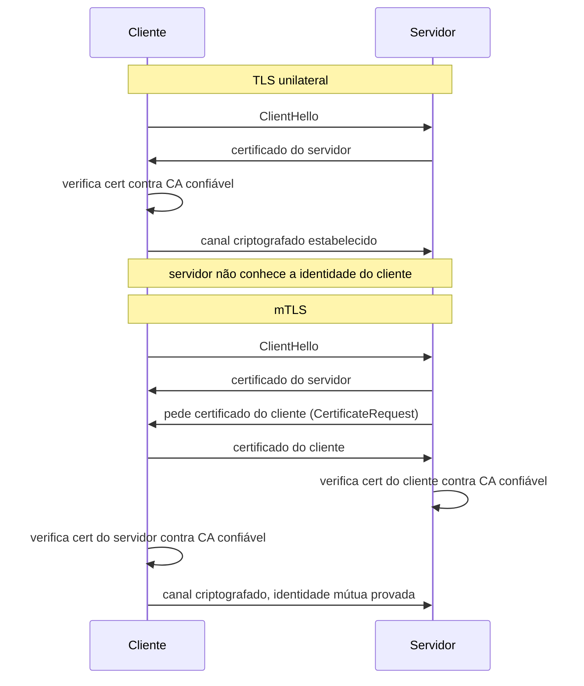
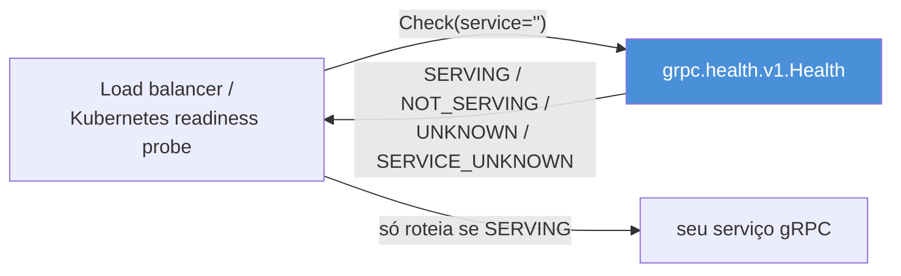
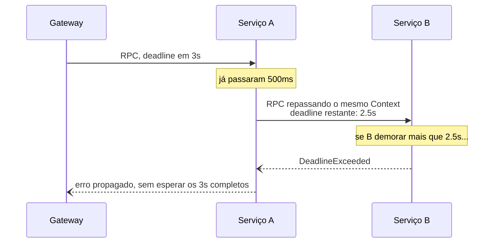
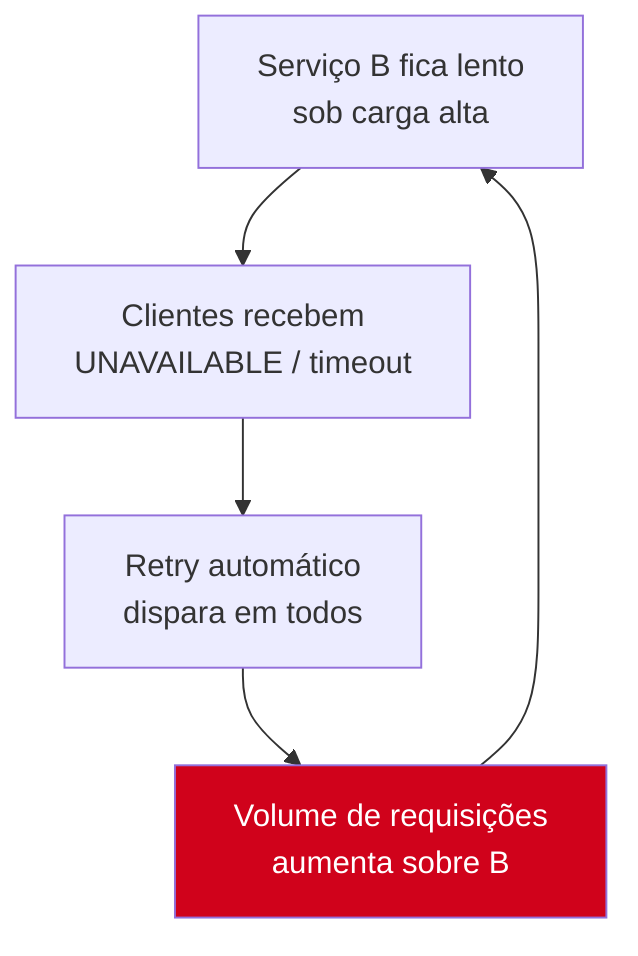
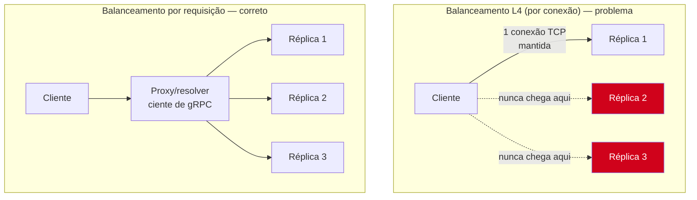

# gRPC em produção

> [!abstract] TL;DR
> Um serviço gRPC que "funciona no `go run main.go`" e um serviço gRPC pronto pra produção diferem em cinco eixos: **TLS/mTLS** (canal criptografado e, entre serviços internos, identidade mútua), **health checking** (o balanceador precisa saber se a instância está viva sem adivinhar), **reflection** (permitir ou proibir introspecção do schema em runtime), **deadlines e retries** (todo `Context` propaga um prazo, e retry sem cuidado vira *retry storm*), e **load balancing** (gRPC multiplexa várias RPCs numa única conexão HTTP/2 — balancear por conexão não é o mesmo que balancear por requisição). Nenhum desses cinco é opcional em produção: eles são a diferença entre um serviço que aguenta um deploy rolling, um cliente lento, ou um vizinho barulhento, e um que não aguenta. A fronteira: contratos, versionamento e RPC como conceito ficam com a trilha Comunicação entre Sistemas — aqui é gRPC em Go, concreto, rodando.

## O cenário: passou no teste local, caiu em produção

Você escreveu um servidor gRPC seguindo as notas anteriores deste galho — protobuf definido, código gerado, servidor e cliente conversando, interceptors cuidando de auth e logging. Roda liso na sua máquina: `go run server.go`, `go run client.go`, resposta em milissegundos.

Agora esse serviço vai para um cluster Kubernetes com 5 réplicas atrás de um load balancer, falando com outros 3 serviços internos, exposto (indiretamente) à internet via um gateway. No dia seguinte ao deploy, alguém reporta: um cliente trava 30 segundos numa chamada que deveria levar 50ms; um pod reiniciando derruba conexões de outros 4 clientes que não sabiam que ele tinha saído do ar; um scanner de segurança encontra que qualquer pessoa consegue listar todos os métodos do seu serviço só apontando `grpcurl` pra ele; e o tráfego entre réplicas está indo, sem TLS nenhum, em texto claro pela rede interna.

Nada disso é bug no código de negócio. É a lacuna entre "gRPC funciona" e "gRPC em produção" — e ela tem nome: TLS, health checking, reflection, deadlines/retries e load balancing. Cada um resolve uma pergunta que o ambiente de produção faz e que o `localhost` nunca fez.

## TLS e mTLS: quem pode ler o canal, e quem pode falar nele

gRPC roda sobre HTTP/2. Por padrão, as notas anteriores deste galho usaram `insecure.NewCredentials()` — conexão em texto claro, aceitável só em `localhost` ou testes. Em produção, a primeira pergunta é: **o canal está criptografado?**

TLS unilateral (o padrão HTTPS) resolve isso: o cliente verifica o certificado do servidor, o canal fica criptografado, mas o servidor não sabe *quem* é o cliente além do que a aplicação decidir enviar em metadata. Isso já é obrigatório para qualquer gRPC exposto fora de uma rede totalmente confiável.

**mTLS** (mutual TLS) vai além: o servidor também exige e verifica um certificado do cliente. Os dois lados provam identidade um ao outro antes de trocar um byte de aplicação. É o padrão de fato para comunicação **serviço-a-serviço** dentro de uma malha interna — não porque a rede interna seja hostil por padrão, mas porque "rede interna" deixou de significar "perímetro confiável" desde que clusters Kubernetes viraram multi-tenant e *zero trust* virou a postura padrão.



No lado do servidor, `credentials.NewTLS` recebe um `*tls.Config` padrão da biblioteca `crypto/tls` — gRPC não reinventa TLS, usa exatamente o mesmo stack que qualquer servidor HTTPS em Go:

```go
package main

import (
    "crypto/tls"
    "crypto/x509"
    "log"
    "net"
    "os"

    "google.golang.org/grpc"
    "google.golang.org/grpc/credentials"
)

func loadServerTLS(certFile, keyFile, clientCAFile string) (credentials.TransportCredentials, error) {
    cert, err := tls.LoadX509KeyPair(certFile, keyFile)
    if err != nil {
        return nil, err
    }

    clientCAPool := x509.NewCertPool()
    caBytes, err := os.ReadFile(clientCAFile)
    if err != nil {
        return nil, err
    }
    clientCAPool.AppendCertsFromPEM(caBytes)

    tlsConfig := &tls.Config{
        Certificates: []tls.Certificate{cert},
        ClientAuth:   tls.RequireAndVerifyClientCert, // isto é o "m" de mTLS
        ClientCAs:    clientCAPool,
        MinVersion:   tls.VersionTLS13,
    }

    return credentials.NewTLS(tlsConfig), nil
}

func main() {
    creds, err := loadServerTLS("server.crt", "server.key", "client-ca.crt")
    if err != nil {
        log.Fatalf("carregando TLS: %v", err)
    }

    lis, err := net.Listen("tcp", ":50051")
    if err != nil {
        log.Fatalf("escutando: %v", err)
    }

    srv := grpc.NewServer(grpc.Creds(creds))
    // RegisterPedidoServiceServer(srv, &servidor{})
    log.Println("servidor gRPC com mTLS em :50051")
    if err := srv.Serve(lis); err != nil {
        log.Fatalf("servindo: %v", err)
    }
}
```

A linha que faz a diferença entre TLS simples e mTLS é `ClientAuth: tls.RequireAndVerifyClientCert` — sem ela, o servidor aceita conexões TLS de qualquer cliente sem checar identidade nenhuma. No cliente, o par simétrico:

```go
func dialWithMTLS(addr, certFile, keyFile, serverCAFile string) (*grpc.ClientConn, error) {
    cert, err := tls.LoadX509KeyPair(certFile, keyFile)
    if err != nil {
        return nil, err
    }

    serverCAPool := x509.NewCertPool()
    caBytes, err := os.ReadFile(serverCAFile)
    if err != nil {
        return nil, err
    }
    serverCAPool.AppendCertsFromPEM(caBytes)

    tlsConfig := &tls.Config{
        Certificates: []tls.Certificate{cert},
        RootCAs:      serverCAPool,
        MinVersion:   tls.VersionTLS13,
    }

    return grpc.NewClient(addr, grpc.WithTransportCredentials(credentials.NewTLS(tlsConfig)))
}
```

> [!info] `grpc.NewClient` substitui `grpc.Dial`
> Desde grpc-go v1.63 (2026), `grpc.NewClient` é a API recomendada para criar conexões — ela não bloqueia esperando a primeira conexão de rede (diferente de `grpc.Dial` com `WithBlock`), resolvendo endereços de forma lazy na primeira chamada RPC. `grpc.Dial` segue funcionando, mas está em rota de deprecação suave; código novo deve preferir `grpc.NewClient`.

> [!warning] Rotação de certificados não é opcional em produção
> Certificados de curta duração (dias, não anos) são a norma em malhas de serviço modernas — reduzem a janela de exposição se uma chave vazar. Isso significa que `tls.Config` não pode ser um valor estático carregado uma vez no boot: usar `GetCertificate` (servidor) e `GetClientCertificate` (cliente) como *callbacks* que recarregam do disco, em vez de carregar o certificado direto no `tls.Config`, é o padrão para sobreviver à rotação sem reiniciar o processo.

## Health checking: o balanceador precisa saber se você está vivo

Um Kubernetes Service, um Envoy, ou qualquer load balancer que fala gRPC precisa de uma resposta objetiva pra "essa instância está pronta pra receber tráfego?" — sem essa resposta, ele só descobre que uma réplica está morta quando uma RPC falha, o que já é tarde demais para o cliente que fez essa chamada.

gRPC define um **protocolo de health checking padronizado**, especificado como um serviço protobuf (`grpc.health.v1.Health`) que qualquer servidor gRPC pode implementar. O pacote oficial `google.golang.org/grpc/health` já traz a implementação pronta — você não escreve o `.proto` nem o handler à mão, só registra:

```go
package main

import (
    "log"
    "net"

    "google.golang.org/grpc"
    "google.golang.org/grpc/health"
    healthpb "google.golang.org/grpc/health/grpc_health_v1"
)

func main() {
    lis, err := net.Listen("tcp", ":50051")
    if err != nil {
        log.Fatalf("escutando: %v", err)
    }

    srv := grpc.NewServer()

    healthServer := health.NewServer()
    healthpb.RegisterHealthServer(srv, healthServer)
    // RegisterPedidoServiceServer(srv, &servidor{})

    // no boot, ou assim que as dependências (DB, cache) estiverem prontas:
    healthServer.SetServingStatus("", healthpb.HealthCheckResponse_SERVING)
    healthServer.SetServingStatus("pedido.PedidoService", healthpb.HealthCheckResponse_SERVING)

    if err := srv.Serve(lis); err != nil {
        log.Fatalf("servindo: %v", err)
    }
}
```

`SetServingStatus` aceita um nome de serviço vazio (`""`) para o status **geral** do processo, e nomes específicos para cada serviço gRPC registrado — útil quando um processo expõe vários serviços e só um deles depende de uma dependência externa que caiu. Se o banco de dados ficar indisponível, o handler de negócio pode chamar `healthServer.SetServingStatus("pedido.PedidoService", healthpb.HealthCheckResponse_NOT_SERVING)` e o load balancer para de rotear tráfego pra essa réplica — sem que ninguém precise reiniciar o pod.



Kubernetes, a partir da 1.24, suporta health checks gRPC nativamente na definição do probe (`grpc: { port: 50051 }`), falando o mesmo protocolo — sem precisar de um sidecar HTTP só pra `/healthz`. Antes disso, era comum expor um endpoint HTTP `/healthz` em paralelo ao gRPC só para o probe do Kubernetes conseguir checar; hoje isso é redundante.

> [!warning] `SetServingStatus` não é automático — alguém precisa chamá-lo
> Registrar `health.NewServer()` sem nunca chamar `SetServingStatus` deixa todo serviço em `UNKNOWN` para sempre — o que, dependendo do cliente de health check, pode ser tratado como "não saudável" por padrão. É comum esquecer essa linha e passar a impressão de que "o health check não funciona", quando na verdade ele nunca foi ligado.

## Reflection: introspecção do schema em runtime

O pacote `google.golang.org/grpc/reflection` permite que um servidor gRPC **exponha seu próprio schema** (quais serviços, métodos e tipos de mensagem existem) via uma API gRPC própria — é o que faz ferramentas como `grpcurl` e `evans` funcionarem sem que você precise fornecer o `.proto` na mão:

```go
import "google.golang.org/grpc/reflection"

func main() {
    srv := grpc.NewServer()
    // RegisterPedidoServiceServer(srv, &servidor{})
    reflection.Register(srv) // uma linha — expõe o schema inteiro
    // srv.Serve(lis)
}
```

Com reflection ligado:

```bash
grpcurl -plaintext localhost:50051 list
grpcurl -plaintext localhost:50051 describe pedido.PedidoService
grpcurl -plaintext localhost:50051 pedido.PedidoService/BuscarPedido -d '{"id": "123"}'
```

Reflection é ótimo em desenvolvimento e debugging — mas em produção, especialmente em serviços expostos além de uma rede totalmente confiável, ele entrega de graça exatamente o mapa que um atacante quer: todos os métodos, todos os campos, toda a estrutura de mensagens, sem precisar do `.proto` nem de engenharia reversa. É informação que ajuda quem está atacando muito mais do que ajuda um cliente legítimo (que já deveria ter o `.proto` via seu pipeline de build).

> [!warning] Reflection ligado em produção é vazamento de superfície de ataque
> A prática comum: `reflection.Register(srv)` condicionado a uma flag de ambiente (`if os.Getenv("ENV") != "production" { reflection.Register(srv) }`), ou ligado só atrás de uma rede administrativa isolada, nunca exposto ao público. Não é uma vulnerabilidade "crítica" isoladamente — mas é reconhecimento gratuito, e reconhecimento é sempre o primeiro passo de qualquer ataque direcionado.

## Deadlines: todo Context carrega um prazo, ou deveria

Toda chamada gRPC em Go recebe um `context.Context` como primeiro parâmetro — não por convenção estética, mas porque é o mecanismo pelo qual **deadlines e cancelamento propagam pela rede**, não só dentro de um processo. Um `context.WithTimeout` no cliente vira metadata `grpc-timeout` no HTTP/2, e o servidor recebe um `Context` que já carrega esse prazo — se o servidor por sua vez chama outro serviço gRPC repassando o mesmo `Context` (ou um derivado), o prazo continua encolhendo através de toda a cadeia de chamadas.

```go
func buscarPedido(ctx context.Context, client pedidopb.PedidoServiceClient, id string) (*pedidopb.Pedido, error) {
    ctx, cancel := context.WithTimeout(ctx, 2*time.Second)
    defer cancel()

    resp, err := client.BuscarPedido(ctx, &pedidopb.BuscarPedidoRequest{Id: id})
    if err != nil {
        st, ok := status.FromError(err)
        if ok && st.Code() == codes.DeadlineExceeded {
            log.Printf("busca de pedido %s estourou o deadline de 2s", id)
        }
        return nil, err
    }
    return resp, nil
}
```



O ponto crucial: **sem um deadline explícito, um `Context.Background()` nunca expira** — a chamada gRPC fica esperando indefinidamente se o servidor travar ou a rede engasgar. É o equivalente gRPC de esquecer um timeout num `http.Client` — só que mais fácil de esquecer, porque `ctx` já está "ali", passando por todo lugar, e é tentador simplesmente repassar um `context.Background()` sem nunca aplicar `WithTimeout`.

> [!warning] `context.Background()` sem timeout em produção é uma fila de espera invisível
> Se o cliente nunca aplica `WithTimeout` (nem herda um deadline de um `Context` upstream), uma dependência lenta ou travada prende a goroutine chamadora indefinidamente. Sob carga, isso vira esgotamento de goroutines e memória — o sintoma clássico de "o serviço ficou lento e depois caiu inteiro" sem nenhum erro óbvio nos logs até ser tarde demais.

## Retries: cuidado com o *retry storm*

Retry automático em gRPC pode ser configurado via **service config** — um JSON que descreve, por método, quantas tentativas fazer, com que backoff, e para quais códigos de erro:

```go
const retryPolicy = `{
  "methodConfig": [{
    "name": [{"service": "pedido.PedidoService"}],
    "retryPolicy": {
      "maxAttempts": 3,
      "initialBackoff": "0.1s",
      "maxBackoff": "1s",
      "backoffMultiplier": 2.0,
      "retryableStatusCodes": ["UNAVAILABLE"]
    }
  }]
}`

conn, err := grpc.NewClient(addr,
    grpc.WithTransportCredentials(creds),
    grpc.WithDefaultServiceConfig(retryPolicy),
)
```

Só `UNAVAILABLE` (e outros códigos claramente transitórios, dependendo do caso) deveria ser retentável — nunca `INVALID_ARGUMENT` (o pedido está errado, tentar de novo não conserta) e nunca, sem cuidado extra, operações não-idempotentes como "criar pedido" (retry duplicaria o pedido, a menos que a operação seja idempotente por design, com uma chave de idempotência).

O perigo do retry mal configurado tem nome: **retry storm**. Se um serviço downstream está sobrecarregado e começa a responder devagar ou com `UNAVAILABLE`, e todos os clientes retentam agressivamente ao mesmo tempo, o volume de tentativas *aumenta* exatamente quando o serviço já estava afundando — um mecanismo pensado pra resiliência vira o que derruba o serviço de vez.



`backoffMultiplier` (backoff exponencial) e `maxAttempts` limitado mitigam isso, mas a defesa mais robusta é combinar retry com um **circuit breaker** no lado do cliente — parar de tentar de vez, por um tempo, quando a taxa de falha passa de um limiar, em vez de continuar martelando. gRPC-go não traz circuit breaker embutido; isso é território de bibliotecas complementares ou de um *service mesh* (Istio, Linkerd) operando na camada de rede.

> [!info] `grpc.WithDefaultServiceConfig` é a via programática
> Historicamente, service config também podia vir de um registro DNS TXT resolvido em runtime — hoje, na prática, configurar via `grpc.WithDefaultServiceConfig` no código, ou via um resolver customizado que busca de um sistema de configuração central, é o caminho comum em produção.

## Load balancing: uma conexão HTTP/2, várias RPCs concorrentes

Aqui mora a armadilha estrutural mais sutil de gRPC em produção. HTTP/2 multiplexa várias *streams* numa única conexão TCP — então, ao contrário de HTTP/1.1 (onde cada requisição frequentemente abre ou reusa uma conexão do pool), um cliente gRPC tende a manter **poucas conexões de longa duração**, cada uma carregando muitas RPCs concorrentes.

Isso quebra o pressuposto de load balancers L4 (nível de conexão/TCP) tradicionais: se um balanceador L4 distribui por *conexão* e o cliente abre uma conexão só e a mantém, **todo o tráfego daquele cliente vai sempre para a mesma réplica** — mesmo que existam 10 réplicas saudáveis esperando tráfego. Balancear gRPC de verdade exige balancear no nível de **requisição/stream HTTP/2**, não de conexão TCP.



Duas soluções práticas, e é comum combinar as duas:

**1. Client-side load balancing**, onde o próprio cliente gRPC resolve múltiplos endereços (via DNS, ou um resolver customizado) e distribui as chamadas entre eles:

```go
conn, err := grpc.NewClient(
    "dns:///pedido-service.default.svc.cluster.local:50051",
    grpc.WithTransportCredentials(creds),
    grpc.WithDefaultServiceConfig(`{"loadBalancingConfig": [{"round_robin":{}}]}`),
)
```

O scheme `dns:///` faz o resolver DNS do grpc-go buscar **todos** os IPs que o registro A/AAAA retorna (não só o primeiro), e `round_robin` distribui as chamadas entre eles — cada RPC pode ir para uma réplica diferente, mesmo dentro da mesma conexão lógica gerenciada pelo cliente.

**2. Proxy ciente de gRPC**, onde um proxy L7 como Envoy (base do Istio) ou o próprio ingress controller entende HTTP/2 e distribui por stream, e não por conexão. É a solução dominante em ambientes de service mesh, porque centraliza a lógica de balanceamento fora de cada cliente individual — inclusive habilitando políticas mais sofisticadas (peso, afinidade, circuit breaking) sem recompilar nenhum serviço.

Um Kubernetes `Service` do tipo `ClusterIP` padrão faz balanceamento L4 via `kube-proxy` — e sozinho **não resolve** esse problema para gRPC. É por isso que serviços gRPC em Kubernetes tipicamente usam ou DNS-based client-side balancing (apontando para um *headless service*, que retorna todos os IPs de pod em vez de um IP virtual único) ou um proxy/mesh na frente.

> [!warning] `ClusterIP` comum + gRPC = tráfego desbalanceado silencioso
> Esse é um dos erros de produção mais comuns e mais difíceis de perceber sem métricas por-pod: tudo parece funcionar (as respostas voltam corretas), mas uma réplica processa 80% do tráfego enquanto as outras ficam ociosas, porque o balanceamento é por conexão persistente, não por requisição. Sintoma: CPU desigual entre pods do mesmo Deployment, sem nenhum erro nos logs.

## Vindo de outro ecossistema

Quem já operou gRPC em Java (`grpc-java`) ou Node (`@grpc/grpc-js`) reconhece os cinco eixos deste capítulo — são conceitos do protocolo, não de uma linguagem específica. O que muda é o vocabulário e onde a configuração mora:

| Preocupação | Java (`grpc-java`) | Node (`@grpc/grpc-js`) | Go (`grpc-go`) |
|---|---|---|---|
| TLS/mTLS | `NettyServerBuilder.sslContext(...)`, geralmente via `SslContextBuilder` do Netty | `grpc.ServerCredentials.createSsl(...)`, chaves lidas como `Buffer` | `credentials.NewTLS(&tls.Config{...})`, cima da `crypto/tls` padrão da stdlib |
| Health check | `io.grpc:grpc-services`, classe `HealthStatusManager` | pacote `grpc-health-check` (não embutido no core) | `google.golang.org/grpc/health`, embutido no ecossistema oficial |
| Reflection | `io.grpc:grpc-services`, `ProtoReflectionService` | pacote `@grpc/reflection` separado | `google.golang.org/grpc/reflection`, uma chamada |
| Deadline | `Context.current().withDeadlineAfter(...)`, próprio de `grpc-java`, não é o `Context` da linguagem | `deadline` passado como opção da chamada, `Date` ou milissegundos | `context.WithTimeout` — o **mesmo** `Context` idiomático usado em toda a stdlib Go, não algo específico de gRPC |
| Retry | Service config JSON, igual em espírito | Service config JSON, igual em espírito | Service config JSON via `grpc.WithDefaultServiceConfig` |

A diferença mais estrutural é o deadline: em Java e Node, o `Context`/`deadline` de gRPC é um conceito próprio da biblioteca, sem relação direta com concorrência da linguagem em si. Em Go, `context.Context` é **o** mecanismo unificado de cancelamento e prazo usado em toda parte — HTTP handlers, chamadas de banco de dados, goroutines — e gRPC simplesmente participa dele. Isso é consistente com o resto da linguagem, mas surpreende quem espera uma API isolada só para RPC.

## A fronteira com Comunicação entre Sistemas

Este galho tratou gRPC como mecanismo — como um serviço Go concreto fala com outro. Mas por trás de cada decisão aqui (que campos vão no protobuf, como versionar um serviço sem quebrar clientes existentes, quando RPC síncrono é a escolha certa versus mensageria assíncrona) existem princípios que não são específicos de Go nem de gRPC: são da disciplina de **design de comunicação entre sistemas** — contratos, compatibilidade retroativa, o espectro síncrono/assíncrono, RPC versus REST versus eventos. Esses princípios vivem na trilha Comunicação entre Sistemas, no domínio Engenharia deste grimório, e valem a pena revisitar de lá pra cá: eles explicam o *porquê* por trás de escolhas que este galho tratou como dado (por exemplo, por que protobuf favorece adicionar campos opcionais em vez de remover ou renumerar — assunto da nota 02 deste galho — é, na raiz, uma instância do princípio geral de compatibilidade de contratos).

## Como explicar em inglês

> Running gRPC in production means closing five gaps that `localhost` never exposes. **TLS** encrypts the channel; **mTLS** additionally proves the client's identity to the server, which is the norm for service-to-service traffic inside a zero-trust internal network. The standard **gRPC health checking protocol** (`grpc.health.v1.Health`) lets load balancers and Kubernetes readiness probes know whether an instance is actually ready — without it, a load balancer only learns a replica is dead after a request fails against it. **Reflection** exposes your service's schema at runtime for tools like `grpcurl`; invaluable in development, but free reconnaissance for an attacker if left on in production. Every gRPC call should carry a **deadline** through `context.WithTimeout` — without one, a stuck dependency blocks the calling goroutine forever. **Retries** need careful scoping (only truly transient status codes, bounded attempts, exponential backoff) to avoid a retry storm, where automatic retries amplify load on an already-struggling downstream service. And because gRPC multiplexes many RPCs over few long-lived HTTP/2 connections, naive L4 (connection-level) load balancing sends all of a client's traffic to a single replica — real gRPC load balancing needs to happen per-request, either client-side via a DNS resolver plus round-robin, or through an HTTP/2-aware proxy like Envoy.

| Termo PT | Termo EN |
|---|---|
| verificação de saúde | health checking |
| introspecção de schema | reflection |
| prazo / deadline | deadline |
| tentativa automática | retry |
| tempestade de retentativas | retry storm |
| disjuntor | circuit breaker |
| balanceamento de carga | load balancing |
| balanceamento por conexão | connection-level (L4) load balancing |
| balanceamento por requisição | request-level (L7) load balancing |
| identidade mútua | mutual authentication |
| rotação de certificados | certificate rotation |

## O que vem a seguir

Este era o último elo da corrente gRPC: dos fundamentos e protobuf, passando por geração de código, servidor/cliente, streaming e interceptors, até rodar de verdade em produção com TLS, health check, deadlines, retries e balanceamento corretos. Mas gRPC — mesmo em suas variantes de streaming — continua sendo, na essência, **RPC síncrono**: o cliente chama, e (na maioria dos casos) espera uma resposta dentro de um prazo. Existe uma categoria de problema inteira onde essa espera é o problema — onde produtor e consumidor não deveriam estar acoplados no tempo, onde um pico de carga não deveria propagar direto pra um serviço downstream, onde "e se o consumidor estiver fora do ar por uma hora?" precisa de uma resposta melhor que "a chamada falha". O Galho 13 — Mensageria entra nesse território: filas, tópicos, entrega garantida, e o desacoplamento assíncrono que RPC, por design, não oferece.

## Veja também

- [[06 - Interceptors, metadata e erros|06 — Interceptors, metadata e erros]] — mecanismo de interceptor que muitas vezes hospeda a lógica de auth por mTLS e logging que este capítulo pressupõe
- [[04 - Servidor e cliente gRPC|04 — Servidor e cliente gRPC]] — `grpc.NewServer`/`grpc.NewClient` na forma básica, antes de TLS e service config entrarem
- [[02 - Protocol Buffers|02 — Protocol Buffers]] — evolução de schema e compatibilidade retroativa, pré-requisito conceitual para versionar serviços em produção
- [[01 - Por que gRPC e onde Go brilha|01 — Por que gRPC e onde Go brilha]] — motivação original do galho, retomada aqui sob a ótica de operação
- [[03-Dominios/Tecnologia/Go/index|Trilha Go]]

## Fontes

- The gRPC Authors. *gRPC Authentication*. grpc.io. https://grpc.io/docs/guides/auth/ (acessado em 2026-07-18)
- The gRPC Authors. *Health checking*. grpc.io. https://grpc.io/docs/guides/health-checking/ (acessado em 2026-07-18)
- The gRPC Authors. *Server Reflection Protocol*. github.com/grpc. https://github.com/grpc/grpc/blob/master/doc/server-reflection.md (acessado em 2026-07-18)
- The gRPC Authors. *Deadlines*. grpc.io. https://grpc.io/docs/guides/deadlines/ (acessado em 2026-07-18)
- The gRPC Authors. *gRPC Retry Design*. github.com/grpc. https://github.com/grpc/proposal/blob/master/A6-client-retries.md (acessado em 2026-07-18)
- The gRPC Authors. *Load Balancing in gRPC*. grpc.io. https://grpc.io/blog/grpc-load-balancing/ (acessado em 2026-07-18)
- pkg.go.dev. *Package credentials*. pkg.go.dev. https://pkg.go.dev/google.golang.org/grpc/credentials (acessado em 2026-07-18)
