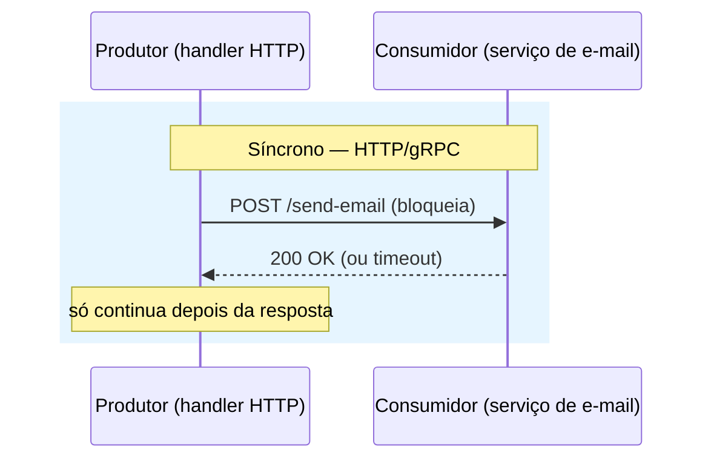
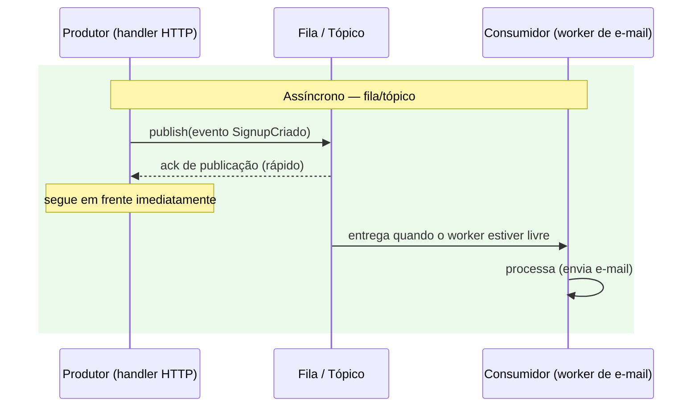
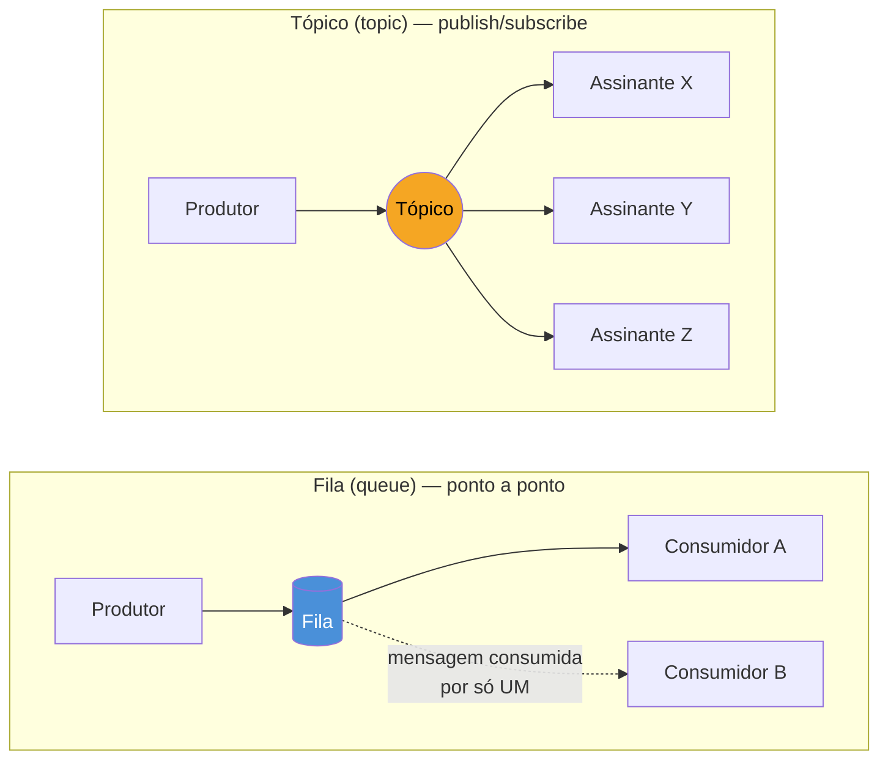

# Por que mensageria — desacoplamento

> [!abstract] TL;DR
> Numa chamada síncrona (HTTP, gRPC), o produtor bloqueia esperando o consumidor responder — os dois precisam estar de pé, ao mesmo tempo, e o produtor herda a lentidão e a instabilidade do consumidor. Mensageria assíncrona quebra esse acoplamento temporal: o produtor publica numa **fila** ou **tópico** e segue em frente sem esperar; um ou mais consumidores processam quando (e na velocidade que) puderem. O ganho não é "mais rápido" — é **resiliência a picos, independência de deploy e tolerância a consumidor fora do ar**. O custo é abrir mão de resposta imediata e aceitar consistência eventual. A decisão de desacoplar produtor de consumidor é arquitetural, não técnica: cabe quando o produtor não precisa do resultado do consumidor *agora* para responder ao seu próprio chamador.

## Um cenário que trava a intuição

Imagine um endpoint de cadastro de usuário. Ele precisa, na mesma requisição: salvar o usuário no banco, enviar um e-mail de boas-vindas, registrar um evento de analytics e notificar o time de fraude para uma checagem assíncrona. A versão ingênua faz tudo isso em sequência, dentro do mesmo handler HTTP:

```go
func handleSignup(w http.ResponseWriter, r *http.Request) {
    user, err := saveUser(r.Context(), parseSignup(r))
    if err != nil {
        http.Error(w, err.Error(), http.StatusInternalServerError)
        return
    }

    if err := sendWelcomeEmail(user); err != nil { // chamada HTTP pro provedor de e-mail
        http.Error(w, err.Error(), http.StatusInternalServerError)
        return
    }
    if err := trackSignupEvent(user); err != nil { // chamada HTTP pro serviço de analytics
        http.Error(w, err.Error(), http.StatusInternalServerError)
        return
    }
    if err := notifyFraudCheck(user); err != nil { // chamada gRPC pro serviço de fraude
        http.Error(w, err.Error(), http.StatusInternalServerError)
        return
    }

    w.WriteHeader(http.StatusCreated)
}
```

Funciona — até o provedor de e-mail ficar lento. Agora `handleSignup` demora 8 segundos porque `sendWelcomeEmail` está esperando um timeout. Ou pior: o serviço de analytics cai de vez, `trackSignupEvent` retorna erro, e o cadastro inteiro falha — o usuário não consegue criar conta porque **um sistema de analytics está fora do ar**. O usuário nem sabe que analytics existe, mas paga o preço.

Esse é o sintoma clássico de acoplamento síncrono demais: cada `http.Client` ou `grpc.ClientConn` a mais no handler é mais uma dependência que precisa estar de pé, respondendo dentro do tempo, para a requisição inteira ter sucesso. A disponibilidade do sistema vira o produto das disponibilidades de todo mundo que ele chama de forma síncrona — quatro serviços com 99.9% de uptime cada, encadeados assim, já não somam 99.9% juntos.

## Sync vs async: duas perguntas diferentes

Vale separar duas perguntas que a decisão embaralha: **"o produtor precisa da resposta agora?"** e **"o produtor precisa saber se o consumidor teve sucesso?"**. HTTP e gRPC respondem sim às duas por padrão — é uma chamada, você espera, recebe retorno ou erro. Mensageria permite responder não às duas.





No segundo diagrama, `handleSignup` só espera o **broker** confirmar que recebeu a mensagem — algo da ordem de milissegundos, local, sem depender do provedor de e-mail estar de pé. O envio de fato acontece depois, num processo separado (o *worker*), no ritmo que ele suportar. Se o provedor de e-mail cair por uma hora, a fila acumula mensagens e o worker as processa quando ele voltar — o cadastro do usuário nunca soube que houve problema.

> [!info] Broker, ordering, at-least-once — não redefinidos aqui
> Os conceitos de *broker*, garantias de entrega e ordenação de mensagens já têm tratamento próprio na trilha de Comunicação entre Sistemas. Esta nota assume esse vocabulário e foca no que muda especificamente ao escrever Go — a decisão de desacoplar, e o modelo mental de fila/tópico que orienta o resto do galho.

## Quando desacoplar produtor de consumidor

A pergunta certa não é "fila é melhor que HTTP?" — é "este chamador precisa do resultado do consumidor para formar sua própria resposta?". Três sinais indicam que sim, vale desacoplar:

1. **O resultado do consumidor não afeta a resposta ao chamador original.** Enviar e-mail de boas-vindas não muda o que o handler de signup responde ao navegador — o cadastro já foi salvo, sucesso ou fracasso do e-mail é irrelevante para aquela resposta HTTP.
2. **O produtor não pode (ou não deve) ficar refém da disponibilidade do consumidor.** Se o serviço de fraude está fazendo manutenção, isso não deveria impedir ninguém de se cadastrar.
3. **Existe risco real de pico de carga desproporcional entre produtor e consumidor.** Um evento de "pedido criado" pode disparar cálculo de frete, atualização de estoque, e-mail transacional e atualização de um data warehouse — processos com velocidades de processamento bem diferentes. Uma fila absorve o pico e deixa cada consumidor processar no próprio ritmo, em vez de forçar o mais lento a definir a latência de todos.

Quando nenhum desses três se aplica — por exemplo, um endpoint de login que precisa validar a senha e devolver um token *imediatamente*, ou uma consulta de saldo bancário que o usuário está olhando na tela — mensageria não ajuda, só adiciona uma camada de indireção sem ganho nenhum. A regra prática: **se o chamador vai ficar olhando pra tela esperando aquele dado específico, é síncrono; se é "dispare e o resto do sistema reage quando puder", é candidato a assíncrono.**

> [!warning] Mensageria não é "mais rápido" — é mais resiliente a custo de consistência eventual
> É tentador vender fila como otimização de performance. Não é: publicar numa fila tem overhead próprio (serialização, round-trip até o broker, ack). O ganho real é **desacoplar disponibilidade e ritmo** entre produtor e consumidor — o produtor para de herdar a lentidão/indisponibilidade do consumidor, e o sistema absorve picos sem cair. Em troca, você aceita que o efeito do lado do consumidor acontece *depois*, não na mesma transação lógica — é consistência eventual, com todas as implicações que isso traz (a nota 05 do galho trata entrega e idempotência a fundo).

## O modelo mental de fila e tópico

Duas formas de organizar a comunicação assíncrona, e a diferença entre elas orienta praticamente toda decisão de design de mensageria daqui pra frente:



- **Fila (queue)** — cada mensagem é entregue a **um único consumidor** dentro de um grupo de consumidores que competem pelo trabalho. É o modelo certo para *distribuir trabalho*: dez workers lendo da mesma fila, cada mensagem processada uma vez, throughput escalando com o número de workers. Pensar nela como uma lista de tarefas que qualquer worker livre pode pegar ajuda mais do que pensar nela como um "cano" — não existe garantia de que o worker que pegou a mensagem 1 pegue também a mensagem 2.
- **Tópico (topic)** — a mesma mensagem é entregue a **todos os assinantes interessados**, cada um recebendo a cópia inteira e processando de forma independente. É o modelo certo para *notificar múltiplos interessados do mesmo evento*: `SignupCriado` publicado uma vez, e o serviço de e-mail, o de analytics e o de fraude assinam o mesmo tópico, cada um fazendo sua parte sem saber da existência dos outros.

A confusão mais comum de quem chega em mensageria vindo de filas de trabalho tradicionais (tipo uma fila de jobs simples) é tratar tudo como fila — um consumidor só, uma responsabilidade só. Isso funciona até aparecer o segundo interessado no mesmo evento, e a tentação é fazer o primeiro consumidor republicar ou chamar o segundo diretamente — reintroduzindo o acoplamento síncrono que a fila deveria ter eliminado. Sistemas reais de mensageria (Kafka, NATS, RabbitMQ) misturam os dois modelos: Kafka trata *topics* com *consumer groups*, onde dentro de um grupo o comportamento é de fila (um consumidor por partição) mas entre grupos diferentes o comportamento é de tópico (cada grupo recebe tudo). As próximas duas notas do galho — Kafka e NATS em Go — mostram como cada ferramenta materializa essa distinção na prática.

## Onde entra o Go especificamente

Nada até aqui é específico de Go — é modelo de arquitetura, válido em qualquer linguagem. O que muda ao implementar em Go é que o **consumo** de uma fila ou tópico quase sempre vira um *worker* rodando em sua própria goroutine, lendo de um canal interno alimentado por um cliente de biblioteca (o SDK do Kafka, do NATS etc.), e não um `for` bloqueante lendo requisição HTTP:

> [!info] Concorrência aqui é usada, não reexplicada
> Este trecho pressupõe goroutines e channels como já vistos nos Galhos 8 e 9 — o objetivo aqui é só situar onde mensageria encaixa no vocabulário de concorrência que você já tem, não reensinar o mecanismo.

```go
func startEmailWorker(ctx context.Context, messages <-chan SignupEvent) {
    for {
        select {
        case <-ctx.Done():
            return
        case evt := <-messages:
            if err := sendWelcomeEmail(evt.User); err != nil {
                log.Printf("falha ao enviar e-mail para %s: %v", evt.User.Email, err)
                // decisão de retry/DLQ fica pra nota 06
            }
        }
    }
}
```

O handler HTTP de signup, nesse desenho, não chama `sendWelcomeEmail` diretamente — ele publica um `SignupEvent` na fila (ou manda pro canal interno, se a mensageria for só um passo intermediário antes de existir um broker de verdade) e devolve `201 Created` na hora. `startEmailWorker` roda em segundo plano, numa goroutine própria, consumindo na sua própria velocidade. É esse desenho — produtor rápido e desligado, consumidor separado e independente — que as próximas notas do galho instanciam com bibliotecas reais.

## Como explicar em inglês

> Synchronous calls (HTTP, gRPC) make the caller block until the callee responds — both sides must be up at the same time, and the caller inherits the callee's latency and downtime. Asynchronous messaging breaks that coupling: a producer publishes to a **queue** or **topic** and moves on without waiting; one or more consumers process the message whenever they're able to. The benefit isn't raw speed — it's resilience to load spikes, independent deployability, and tolerance for a consumer being temporarily unavailable. The tradeoff is giving up an immediate result and accepting eventual consistency. Queues deliver each message to exactly one consumer in a competing group — the right model for distributing work. Topics deliver the same message to every subscriber — the right model for notifying multiple independent interested parties about the same event. Deciding whether to decouple is an architectural call, not a technical one: it hinges on whether the caller actually needs the consumer's result to form its own response right now.

| Termo PT | Termo EN |
|---|---|
| desacoplamento | decoupling |
| fila | queue |
| tópico | topic |
| produtor | producer |
| consumidor | consumer |
| assinante | subscriber |
| corretor / broker | broker |
| consistência eventual | eventual consistency |
| disparar e esquecer | fire and forget |
| trabalhador / worker | worker |

## O que vem a seguir

Esta nota ficou no nível conceitual — quando desacoplar e o modelo mental de fila/tópico, sem amarrar a nenhuma biblioteca específica. A [[02 - Kafka em Go|nota 02]] pega esse modelo mental e materializa num broker real: como um produtor Go publica em um tópico Kafka, como consumer groups implementam a divisão de trabalho descrita aqui, e o que muda na prática ao trocar o canal interno de goroutines por um broker de verdade, com partições e offsets persistidos.

## Veja também

- [[02 - Kafka em Go|02 — Kafka em Go]] — próxima nota do galho
- [[03 - NATS em Go|03 — NATS em Go]] — alternativa mais leve a Kafka, mesmo modelo de fila/tópico
- [[04 - Consumers e workers|04 — Consumers e workers]] — como estruturar o lado consumidor em produção
- [[05 - Entrega e idempotência|05 — Entrega e idempotência]] — consequências da consistência eventual mencionada aqui
- [[03-Dominios/Tecnologia/Go/index|Trilha Go]]

## Fontes

- The Go Authors. *A Tour of Go — Concurrency*. go.dev. https://go.dev/tour/concurrency/1 (acessado em 2026-07-18)
- The Go Authors. *Effective Go — Concurrency*. go.dev. https://go.dev/doc/effective_go#concurrency (acessado em 2026-07-18)
- Go by Example. *Worker Pools*. gobyexample.com. https://gobyexample.com/worker-pools (acessado em 2026-07-18)
- Go by Example. *Channels*. gobyexample.com. https://gobyexample.com/channels (acessado em 2026-07-18)
- The Go Blog. *Share Memory By Communicating*. go.dev. https://go.dev/blog/codelab-share (acessado em 2026-07-18)
