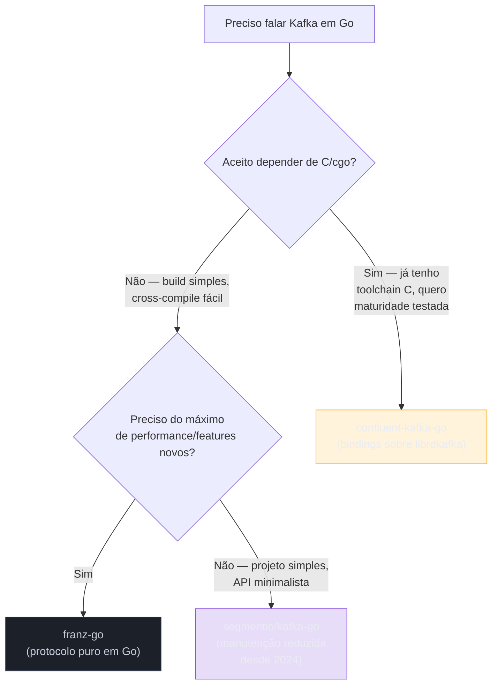
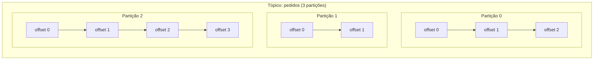

# Kafka em Go

> [!abstract] TL;DR
> Go não tem cliente Kafka oficial — a comunidade escolhe entre três bibliotecas com trade-offs bem diferentes: **franz-go** (implementação pura em Go do protocolo, sem dependência de C, mais rápida e mais nova), **segmentio/kafka-go** (também pura Go, API mais simples, porém em modo manutenção desde 2024) e **confluent-kafka-go** (bindings cgo sobre a `librdkafka` em C, madura e completa, mas exige toolchain C). Produzir é publicar um `[]byte` de chave e valor num tópico, deixando o particionador decidir a partição por hash da chave (ou você escolhe explicitamente). Consumir é ler de uma ou mais partições a partir de um **offset** — um contador monotônico por partição que é a única forma de "posição de leitura" que o Kafka entende. Esta nota cobre o básico funcional: publicar, ler, e entender partição/offset o suficiente para escrever um produtor e um consumidor Go que funcionam de verdade.

## O problema que Kafka resolve — e por que Go entra pela porta client

Imagina um sistema de e-commerce onde o serviço de pedidos precisa avisar três outros serviços — estoque, faturamento, notificação — toda vez que um pedido é criado. A tentação óbvia é fazer três chamadas HTTP síncronas. Mas isso significa: se o serviço de notificação estiver fora do ar, o pedido falha inteiro. Se um dos três estiver lento, a resposta ao cliente demora o tempo do mais lento. E se amanhã aparecer um quarto serviço interessado no evento "pedido criado", alguém precisa lembrar de adicionar mais uma chamada HTTP no código do serviço de pedidos.

A nota anterior já cobriu esse desacoplamento em termos conceituais — publish/subscribe, broker como intermediário durável. Esta nota entra na parte prática: como um processo Go conversa com um cluster Kafka de verdade, usando qual biblioteca, para produzir e consumir mensagens.

Kafka, diferente de RabbitMQ ou NATS, não tem um protocolo simples o bastante para reimplementar em uma tarde — é um protocolo binário próprio, com controle fino sobre partições, replicação, compressão e semântica de commit de offset. Go, sem cliente oficial mantido pela Apache Software Foundation, depende inteiramente de bibliotecas de terceiros para falar esse protocolo.

## As três bibliotecas — e por que a escolha importa



**franz-go** (`github.com/twmb/franz-go`) reimplementa o protocolo Kafka do zero, em Go puro — sem cgo, sem dependência de `librdkafka`. É o cliente mais recente dos três e, por design, o que mais se aproxima do desempenho da `librdkafka` em benchmarks, além de suportar as features mais novas do protocolo (KIP-848 consumer group protocol, transações, compressão zstd) sem esperar um wrapper de terceiros. Por não depender de C, compila e faz cross-compile com a mesma simplicidade de qualquer binário Go — sem `CGO_ENABLED=1`, sem toolchain C na imagem Docker.

**segmentio/kafka-go** (`github.com/segmentio/kafka-go`) também é Go puro, e por anos foi a escolha default para quem queria simplicidade — API pequena, `Writer`/`Reader` fáceis de entender. O ponto de atenção, e é honesto dizer isso: o projeto está em **modo de manutenção reduzida** desde que o time original na Segment/Twilio diminuiu o investimento em 2024 — issues e PRs se acumulam com resposta mais lenta que antes. Ainda funciona bem para casos simples, mas quem está começando um projeto novo hoje tende a considerar franz-go primeiro.

**confluent-kafka-go** (`github.com/confluentinc/confluent-kafka-go`) é uma camada de bindings cgo sobre a `librdkafka`, a biblioteca C mantida pela Confluent (a empresa fundada pelos criadores do Kafka) que também serve de base para os clientes Python, C/C++ e Node.js oficiais da Confluent. É a mais madura e testada em produção em escala — mas o preço é depender de cgo: build mais lento, cross-compile mais chato (precisa da `librdkafka` compilada para o SO/arquitetura alvo), e binários maiores.

> [!info] Panorama, não benchmark
> Os números de performance mudam a cada release das três bibliotecas — não vale fixar "X é Y% mais rápido" aqui. O que é estável o suficiente para guiar a escolha é a arquitetura: cgo vs. Go puro, e o estado de manutenção de cada projeto. Esta nota usa **franz-go** nos exemplos de código por ser Go puro e ativamente mantido — mas a API de segmentio/kafka-go é parecida o bastante para o leitor adaptar sem esforço.

## Partição e offset — o vocabulário mínimo para produzir e consumir

Antes do código, dois conceitos que aparecem em toda chamada de API dos três clientes.

Um **tópico** Kafka não é uma fila única — é dividido em uma ou mais **partições**, cada uma um log **ordenado e imutável** de mensagens. Cada mensagem publicada numa partição recebe um **offset**: um inteiro sequencial, começando em zero, que é a posição dessa mensagem dentro daquela partição especificamente (não do tópico inteiro — cada partição tem sua própria sequência de offsets independente).



Por que partições existem: paralelismo. Um único log ordenado, se fosse o tópico inteiro, limitaria a taxa de leitura/escrita à capacidade de uma única máquina. Dividir em partições permite que partições diferentes fiquem em brokers diferentes do cluster, e que consumidores diferentes leiam partições diferentes em paralelo — é o mecanismo de escala horizontal do Kafka.

Quando você produz uma mensagem sem especificar partição, o cliente aplica um **particionador**: por padrão, calcula um hash da **chave** (`key`) da mensagem e usa esse hash para escolher a partição — de forma determinística, então toda mensagem com a mesma chave sempre vai para a mesma partição, preservando ordem relativa entre mensagens daquela chave. Mensagens sem chave (`key` vazia) costumam ser distribuídas em round-robin ou por hash de um valor aleatório, dependendo do cliente.

O **offset**, por sua vez, é a única noção de "posição de leitura" que o Kafka mantém — não existe "marcar como lida" no sentido de fila tradicional (como um `ack` que remove a mensagem). O consumidor lê a partir de um offset, processa, e **commita** esse offset (grava, num tópico interno especial `__consumer_offsets`, até onde já leu) — a mensagem continua no log, disponível para ser relida por outro consumidor ou pelo mesmo consumidor depois de um reprocessamento.

> [!info] Offset não é como ack de fila
> Quem vem de RabbitMQ ou SQS estranha isso: lá, um `ack` remove (ou marca como consumida) a mensagem individual. No Kafka, commitar offset 42 diz "já processei tudo até 42 nesta partição" — é uma marca de posição, não uma remoção. A mensagem permanece no log até a política de retenção do tópico (por tempo ou tamanho) apagá-la, independente de ter sido lida ou não.

## Produzindo com franz-go

```go
package main

import (
	"context"
	"log/slog"

	"github.com/twmb/franz-go/pkg/kgo"
)

func main() {
	cl, err := kgo.NewClient(
		kgo.SeedBrokers("localhost:9092"),
	)
	if err != nil {
		slog.Error("falha ao criar client", "erro", err)
		return
	}
	defer cl.Close()

	ctx := context.Background()

	record := &kgo.Record{
		Topic: "pedidos",
		Key:   []byte("pedido-123"),
		Value: []byte(`{"id":"pedido-123","total":89.90}`),
	}

	// Produce é assíncrono por padrão — o callback roda quando
	// o broker confirma (ou rejeita) a escrita.
	cl.Produce(ctx, record, func(r *kgo.Record, err error) {
		if err != nil {
			slog.Error("falha ao produzir", "erro", err, "topico", r.Topic)
			return
		}
		slog.Info("mensagem produzida",
			"topico", r.Topic,
			"particao", r.Partition,
			"offset", r.Offset,
		)
	})

	// Garante que o produce assíncrono acima terminou antes de sair.
	if err := cl.Flush(ctx); err != nil {
		slog.Error("flush falhou", "erro", err)
	}
}
```

> [!info] `log/slog` (Go 1.21+)
> Os exemplos usam `log/slog`, o pacote de logging estruturado que entrou na stdlib no Go 1.21. Em sistemas de mensageria, log estruturado (campos como `topico`, `particao`, `offset` pesquisáveis, não interpolados em string) é praticamente obrigatório para depurar problemas de produção — "por que essa mensagem específica sumiu" exige filtrar por offset exato, algo que `fmt.Printf("erro: %v\n", err)` não entrega.

Repare em três decisões deliberadas nesse produtor: a `Key` é o `id` do pedido — isso garante que todas as mensagens sobre o mesmo pedido caem na mesma partição, preservando ordem; `cl.Produce` é assíncrono (não bloqueia esperando o broker confirmar) com um callback que roda quando a confirmação chega; e `cl.Flush` no fim garante que o programa não termine (nem feche o client) antes de todo produce pendente ser de fato entregue ou falhar.

Produzir de forma **síncrona** — bloqueando até a confirmação — é simples com `ProduceSync`, útil quando o fluxo de negócio depende de saber que a mensagem foi mesmo escrita antes de continuar:

```go
results := cl.ProduceSync(ctx, record)
if err := results.FirstErr(); err != nil {
	slog.Error("produce síncrono falhou", "erro", err)
}
```

## Consumindo com franz-go

```go
package main

import (
	"context"
	"log/slog"

	"github.com/twmb/franz-go/pkg/kgo"
)

func main() {
	cl, err := kgo.NewClient(
		kgo.SeedBrokers("localhost:9092"),
		kgo.ConsumerGroup("faturamento-service"),
		kgo.ConsumeTopics("pedidos"),
		// AutoCommitInterval controla de quanto em quanto tempo os
		// offsets processados são commitados automaticamente.
	)
	if err != nil {
		slog.Error("falha ao criar client", "erro", err)
		return
	}
	defer cl.Close()

	ctx := context.Background()

	for {
		fetches := cl.PollFetches(ctx)
		if errs := fetches.Errors(); len(errs) > 0 {
			for _, e := range errs {
				slog.Error("erro no fetch", "topico", e.Topic, "particao", e.Partition, "erro", e.Err)
			}
			continue
		}

		fetches.EachRecord(func(r *kgo.Record) {
			slog.Info("mensagem recebida",
				"topico", r.Topic,
				"particao", r.Partition,
				"offset", r.Offset,
				"chave", string(r.Key),
			)
			processarPedido(r.Value)
		})
	}
}

func processarPedido(payload []byte) {
	// lógica de negócio real entraria aqui
}
```

`kgo.ConsumerGroup("faturamento-service")` inscreve o client num **grupo de consumidores** — mecanismo que permite escalar horizontalmente: se você subir três instâncias desse mesmo binário com o mesmo nome de grupo, o Kafka distribui as partições do tópico `pedidos` entre as três, cada partição sendo lida por exatamente uma instância do grupo por vez. É o mecanismo nativo de balanceamento de carga do Kafka — sem precisar de fila externa ou coordenação manual.

Por padrão, o franz-go faz **auto-commit** dos offsets em intervalos regulares — o cliente marca "processado até aqui" periodicamente, sem exigir chamada explícita a cada mensagem. Isso é conveniente, mas tem uma implicação séria de confiabilidade: se o processo cair entre o auto-commit e o processamento real de uma mensagem, ela pode ser perdida (commit aconteceu, mas o processamento não terminou) — a nota 05 deste galho (Entrega e idempotência) trata desse trade-off com profundidade, incluindo commit manual e as garantias *at-least-once* vs. *at-most-once* vs. *exactly-once*.

## Casos práticos com segmentio/kafka-go

Vale ver a mesma tarefa na API alternativa, porque é a biblioteca que aparece com frequência em código legado e tutoriais mais antigos:

```go
package main

import (
	"context"
	"log/slog"

	"github.com/segmentio/kafka-go"
)

func produzir(ctx context.Context) error {
	w := &kafka.Writer{
		Addr:     kafka.TCP("localhost:9092"),
		Topic:    "pedidos",
		Balancer: &kafka.Hash{}, // particiona por hash da chave
	}
	defer w.Close()

	return w.WriteMessages(ctx, kafka.Message{
		Key:   []byte("pedido-123"),
		Value: []byte(`{"id":"pedido-123","total":89.90}`),
	})
}

func consumir(ctx context.Context) {
	r := kafka.NewReader(kafka.ReaderConfig{
		Brokers: []string{"localhost:9092"},
		Topic:   "pedidos",
		GroupID: "faturamento-service",
	})
	defer r.Close()

	for {
		msg, err := r.ReadMessage(ctx)
		if err != nil {
			slog.Error("erro ao ler mensagem", "erro", err)
			return
		}
		slog.Info("mensagem recebida",
			"particao", msg.Partition,
			"offset", msg.Offset,
			"chave", string(msg.Key),
		)
	}
}
```

A API de kafka-go é deliberadamente mais próxima de "io.Reader/io.Writer" — `ReadMessage` bloqueia até a próxima mensagem, sem o padrão de polling em lote que o franz-go usa via `PollFetches`. É mais simples de ler para quem está chegando, ao custo de menos controle fino sobre batching e performance.

## Configuração que muda o comportamento na prática

Os exemplos acima usam os defaults das bibliotecas — funcionam, mas duas opções valem entender antes de rodar em produção, porque mudam a semântica de confiabilidade e não só performance.

**`acks`** controla quantas réplicas do broker precisam confirmar a escrita antes do produtor considerar a mensagem entregue. `acks=0` não espera confirmação nenhuma (mais rápido, risco real de perda silenciosa); `acks=1` espera só o líder da partição confirmar (padrão razoável para a maioria dos casos); `acks=all` (ou `-1`) espera todas as réplicas em sincronia confirmarem — mais lento, mas é o único valor que garante que a mensagem sobrevive à queda do broker líder. No franz-go, isso se configura na criação do client:

```go
cl, err := kgo.NewClient(
	kgo.SeedBrokers("localhost:9092"),
	kgo.RequiredAcks(kgo.AllISRAcks()), // equivalente a acks=all
)
```

**Compressão** (`kgo.ProducerBatchCompression`, aceitando `snappy`, `lz4`, `zstd`, entre outros) reduz o tráfego de rede e o espaço em disco no broker, ao custo de CPU no produtor e no consumidor. Para volumes altos, ativar compressão (zstd costuma ter a melhor relação custo/benefício nas versões recentes do protocolo) é quase sempre vantajoso — a diferença de latência de CPU é pequena comparada à economia de I/O de rede e disco.

```go
cl, err := kgo.NewClient(
	kgo.SeedBrokers("localhost:9092"),
	kgo.ProducerBatchCompression(kgo.ZstdCompression()),
)
```

Nenhuma dessas duas opções muda a **lógica** do produtor ou consumidor — só a confiabilidade e o custo de operação. É por isso que valem uma menção aqui, mesmo numa nota de "básico funcional": o código que compila com os defaults é o mesmo código, ajustado só na configuração do client, que roda com garantias de produção.

## Armadilhas comuns

> [!warning] Esquecer `Flush`/`Close` e perder mensagens em produce assíncrono
> `cl.Produce` do franz-go (e o equivalente assíncrono em outras libs) enfileira a mensagem e retorna na hora — se o programa terminar (ou `cl.Close()` for chamado) antes do callback confirmar a entrega, mensagens em trânsito podem se perder silenciosamente. Sempre `Flush` antes de encerrar, e trate o `err` do callback — não assuma que "não travou" significa "foi entregue".

> [!warning] Confundir "número de partições" com "nível de paralelismo do consumidor"
> Um grupo de consumidores nunca tem mais consumidores *ativos por partição* que o número de partições do tópico — subir uma quarta instância de um consumer group quando o tópico tem 3 partições deixa a quarta instância ociosa, sem partição para ler. O paralelismo máximo de um tópico é fixado no momento da criação (embora seja possível aumentar partições depois — nunca diminuir).

> [!warning] Trocar chave sem pensar na ordem
> Mudar a chave de produção "porque parecia mais natural" (por exemplo, trocar `pedido-id` por `cliente-id`) muda silenciosamente o particionamento — mensagens que antes ficavam garantidamente na mesma partição (e, portanto, na mesma ordem relativa) passam a se espalhar diferente. Se a ordem de eventos do mesmo pedido importa para quem consome, a chave de partição precisa continuar sendo o identificador cuja ordem você quer preservar.

## Vindo de outras linguagens

| Vindo de | Cliente equivalente | Diferença que mais pega |
|---|---|---|
| Java/Kotlin | `kafka-clients` (oficial Apache) | Java tem cliente oficial mantido pela própria Apache; em Go, a "oficialidade" não existe — a escolha de biblioteca é uma decisão de arquitetura, não um default óbvio |
| Python | `confluent-kafka-python` (também sobre `librdkafka`) ou `aiokafka` | Python tende a convergir para os bindings da Confluent (mesma base C do confluent-kafka-go); Go tem a opção extra de ficar 100% livre de cgo com franz-go |
| Node.js | `kafkajs` | kafkajs também é implementação pura na linguagem hospedeira (sem depender de C), postura mais parecida com franz-go que com os bindings Confluent |

## Como explicar em inglês

> Go has no official Kafka client, so the ecosystem splits across three libraries with real trade-offs: **franz-go** implements the Kafka wire protocol natively in Go — no cgo, fast, actively maintained, and first to support new protocol features. **segmentio/kafka-go** is also pure Go, with a simpler `Writer`/`Reader` API, but has been in reduced maintenance since 2024. **confluent-kafka-go** wraps `librdkafka` via cgo — mature and battle-tested, at the cost of a C toolchain dependency and slower cross-compilation. Producing means publishing a key/value byte pair to a topic; the partitioner hashes the key to pick a partition deterministically, so messages sharing a key land in the same partition and keep their relative order. Consuming means reading from an assigned partition starting at an **offset** — a per-partition monotonic counter that is the only notion of "read position" Kafka has. Committing an offset marks progress; it does not delete the message, which is a common surprise for anyone coming from queue-based systems like RabbitMQ or SQS.

| Termo PT | Termo EN |
|---|---|
| tópico | topic |
| partição | partition |
| offset | offset |
| grupo de consumidores | consumer group |
| chave de partição | partition key |
| particionador | partitioner |
| commit de offset | offset commit |
| produtor / consumidor | producer / consumer |
| entrega assíncrona | asynchronous delivery |

## O que vem a seguir

Kafka não é a única peça de mensageria que aparece em sistemas Go — muitos times combinam Kafka (para eventos duráveis, replay, streams de alto volume) com um broker mais leve para comunicação request/reply ou pub/sub de latência baixa dentro do próprio cluster. A [[03 - NATS em Go|nota 03]] cobre exatamente esse segundo perfil: como o cliente Go de NATS difere do de Kafka, e quando escolher um em vez do outro — ou os dois juntos.

## Veja também

- [[01 - Por que mensageria — desacoplamento|01 — Por que mensageria — desacoplamento]] — o porquê conceitual antes deste como
- [[03 - NATS em Go|03 — NATS em Go]] — próxima nota do galho
- [[04 - Consumers e workers|04 — Consumers e workers]] — como estruturar um processo consumidor de produção, com graceful shutdown
- [[05 - Entrega e idempotência|05 — Entrega e idempotência]] — commit manual de offset e as garantias at-least-once / at-most-once / exactly-once
- [[03-Dominios/Tecnologia/Go/index|Trilha Go]]

## Fontes

- twmb. *franz-go — a complete Apache Kafka client written in Go*. GitHub. https://github.com/twmb/franz-go (acessado em 2026-07-18)
- Segment. *kafka-go — Kafka library in Go*. GitHub. https://github.com/segmentio/kafka-go (acessado em 2026-07-18)
- Confluent Inc. *confluent-kafka-go — Confluent's Kafka client for Golang*. GitHub. https://github.com/confluentinc/confluent-kafka-go (acessado em 2026-07-18)
- Apache Software Foundation. *Apache Kafka Documentation — Design: Log*. kafka.apache.org. https://kafka.apache.org/documentation/#design_filesystem (acessado em 2026-07-18)
- The Go Authors. *log/slog package documentation*. pkg.go.dev. https://pkg.go.dev/log/slog (acessado em 2026-07-18)
