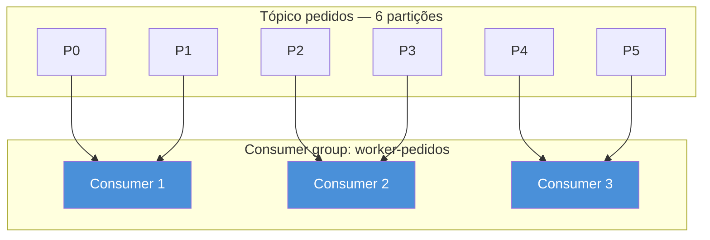
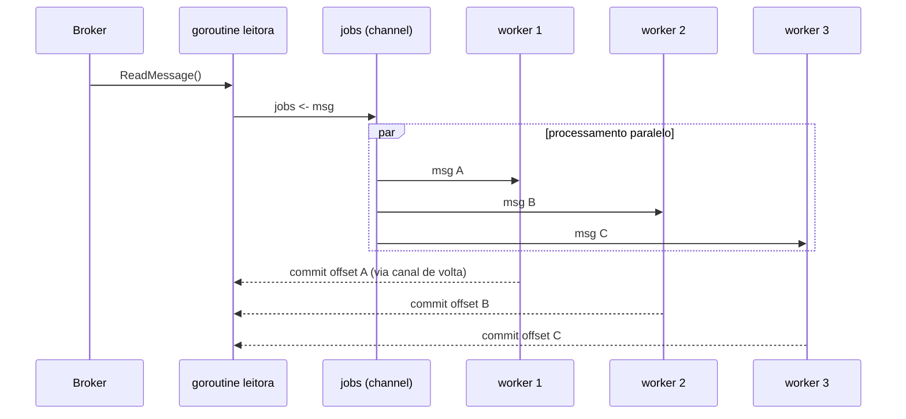
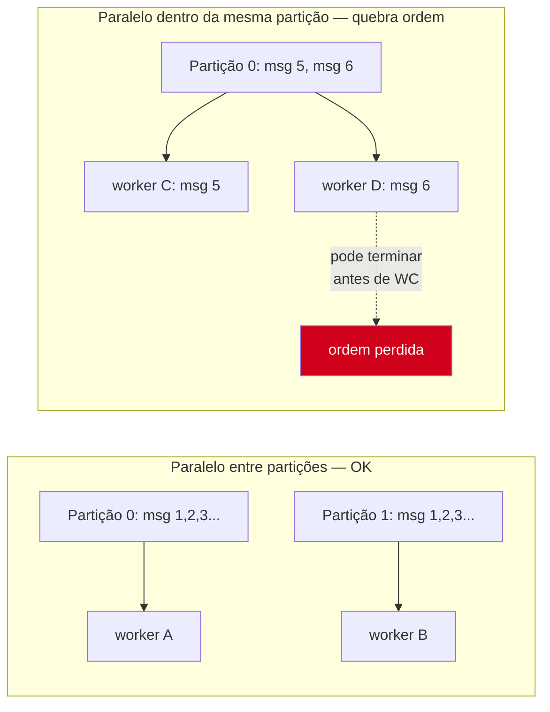

# Consumers e workers

> [!abstract] TL;DR
> Ler mensagens de um tópico e processá-las são dois trabalhos diferentes, com velocidades diferentes — e um **consumer group** já resolve metade do problema distribuindo partições entre processos. O que sobra é dentro de cada processo: um `Read()` (Kafka) ou `Subscribe()` (NATS) devolve mensagens uma a uma, mas processá-las uma a uma é jogar fora todos os núcleos da máquina. A saída é o **worker pool** do Galho 8/9 — um pool fixo de goroutines lendo de um channel de trabalho — aplicado com uma regra que não é opcional: nunca fazer `commit`/`Ack` antes do processamento terminar de verdade, e nunca paralelizar dentro de uma partição sem antes entender por que ela existe. Esta nota amarra as duas notas anteriores (protocolo Kafka/NATS) ao Galho 8 (goroutines) e ao Galho 9 (sincronização), sem reexplicar nenhum dos dois.
>
> Fica de fora: garantias de entrega e idempotência (nota 05) e retry/DLQ/backpressure (nota 06) — aqui o processamento em si é tratado como uma caixa-preta que "dá certo ou dá erro", sem entrar em *como* recuperar do erro.

## O problema: um consumer lento é um consumer inútil

Retome o `Reader` do Kafka da [[02 - Kafka em Go|nota 02]]:

```go
r := kafka.NewReader(kafka.ReaderConfig{
    Brokers: []string{"localhost:9092"},
    Topic:   "pedidos",
    GroupID: "worker-pedidos",
})

for {
    m, err := r.ReadMessage(ctx)
    if err != nil {
        break
    }
    processar(m) // e se processar() levar 200ms?
}
```

`ReadMessage` devolve uma mensagem por vez, num loop sequencial. Se `processar` leva 200ms — uma chamada HTTP a outro serviço, uma escrita em banco, um cálculo pesado — o consumer processa no máximo 5 mensagens por segundo, *por partição atribuída a ele*, não importa quantos núcleos a máquina tenha. Um produtor publicando 500 msg/s nessa partição faz o lag crescer sem parar: a fila entre "mensagem chegou no broker" e "mensagem foi processada" só aumenta.

A pergunta que este problema levanta tem duas respostas empilhadas, e é fácil confundir uma com a outra:

1. **Entre processos**: como dividir o trabalho de um tópico com várias partições entre várias instâncias do consumer? — resposta: **consumer group**, mecanismo do próprio broker.
2. **Dentro de um processo**: como usar os N núcleos disponíveis para não ficar preso a processar uma mensagem de cada vez? — resposta: **worker pool**, mecanismo da aplicação, com goroutines e channels.

As duas respostas são independentes e se combinam. Um consumer group com 3 instâncias, cada uma rodando um worker pool de 8 goroutines, processa em paralelo em duas dimensões ao mesmo tempo — entre processos e dentro de cada processo.

## Consumer group: dividir partições entre processos

A [[02 - Kafka em Go|nota 02]] já mencionou `GroupID` de passagem; aqui é o mecanismo por trás dele. Um **consumer group** é um conjunto de consumers que compartilham o mesmo `GroupID` e leem o mesmo tópico. O broker garante uma invariante simples: **cada partição é atribuída a no máximo um consumer do grupo por vez**. Se o tópico `pedidos` tem 6 partições e o grupo `worker-pedidos` tem 3 instâncias rodando, o broker distribui 2 partições para cada uma — automaticamente, sem nenhuma coordenação manual no código da aplicação.



Isso é o que dá **escalabilidade horizontal por partição**: para processar mais rápido, você sobe mais instâncias do consumer — até o limite do número de partições. A sétima instância de `worker-pedidos`, num tópico de 6 partições, fica **ociosa**: não há partição sobrando para atribuir a ela. É por isso que o número de partições de um tópico Kafka é uma decisão de capacidade tomada na criação do tópico, não algo ajustado depois sem custo (repartição é possível, mas não trivial e fora do escopo aqui).

Quando uma instância cai (crash, deploy, scale-down), o broker detecta via heartbeat e dispara um **rebalance**: as partições órfãs são redistribuídas entre os consumers vivos. É automático, mas não é gratuito — durante o rebalance, o grupo inteiro pausa o consumo por um instante enquanto as atribuições são renegociadas. Bibliotecas cliente diferentes lidam com isso de formas ligeiramente diferentes; o `segmentio/kafka-go` (usado nesta trilha) abstrai boa parte disso dentro de `Reader.ReadMessage`.

> [!info] NATS JetStream usa "consumer" com escopo diferente
> No NATS clássico (nota 03), não há partições nem consumer group — todo subscriber de uma fila (`queue group`) compete pela mesma mensagem, sem conceito de atribuição fixa. No **JetStream** (a camada persistente do NATS), um `Consumer` é uma entidade nomeada e durável associada a um stream, mais parecida em espírito com um consumer group Kafka — mas sem partições explícitas, o balanceamento é por mensagem, não por partição fixa. Não assuma que os dois mecanismos são intercambiáveis.

## Dentro do processo: o worker pool não é opcional em produção

Consumer group resolve "várias instâncias dividindo partições". Mas dentro de *uma* instância, o padrão ingênuo — ler e processar no mesmo loop — ainda deixa os núcleos ociosos. A solução já foi construída no Galho 8: um **worker pool**, revisitado da [[03-Dominios/Tecnologia/Go/08 - Channels e select/07 - Worker pools|nota 07 do Galho 8]] — um número fixo de goroutines consumindo de um channel de trabalho, para não disparar uma goroutine sem limite por mensagem (o que estourari­a memória e conexões sob um pico de tráfego).



Uma goroutine dedicada faz só a leitura — `ReadMessage` em loop — e empurra cada mensagem para um channel `jobs`. Um pool fixo de `N` goroutines workers lê desse channel e processa. `N` é tipicamente `runtime.NumCPU()` para trabalho limitado por CPU, ou um número maior (dezenas a centenas) para trabalho limitado por I/O — chamadas de rede, banco de dados — porque as goroutines ficam bloqueadas esperando resposta, não competindo por núcleo.

```go
func run(ctx context.Context, r *kafka.Reader, workers int) error {
    jobs := make(chan kafka.Message, workers*2) // buffer pequeno absorve rajadas
    var wg sync.WaitGroup

    for i := 0; i < workers; i++ {
        wg.Add(1)
        go func(id int) {
            defer wg.Done()
            for m := range jobs {
                if err := processar(ctx, m); err != nil {
                    slog.Error("falha ao processar", "worker", id, "erro", err)
                    continue // nota 06 trata retry/DLQ; aqui só loga e segue
                }
                if err := r.CommitMessages(ctx, m); err != nil {
                    slog.Error("falha ao commitar offset", "erro", err)
                }
            }
        }(i)
    }

    for {
        m, err := r.FetchMessage(ctx)
        if err != nil {
            close(jobs)
            wg.Wait()
            return err
        }
        jobs <- m
    }
}
```

> [!info] `slog` — structured logging desde Go 1.21
> `log/slog`, usado acima, é o pacote de logging estruturado da standard library desde Go 1.21 — chaves e valores tipados (`"worker", id`), em vez de strings formatadas manualmente. Antes dele, era comum recorrer a bibliotecas de terceiros (`zap`, `zerolog`) para o mesmo resultado.

Repare em algo deliberado nesse código: a leitura usa `FetchMessage`, não `ReadMessage`. É a diferença que sustenta a próxima seção.

## Commit de offset: `ReadMessage` vs `FetchMessage`+`CommitMessages`

A [[02 - Kafka em Go|nota 02]] usou `ReadMessage`, que faz auto-commit do offset **assim que a mensagem é entregue à aplicação** — antes de qualquer processamento acontecer. Isso é adequado para exemplos simples, mas é uma armadilha real num worker pool: se `ReadMessage` já commitou o offset e o worker crasha no meio do `processar(m)`, a mensagem está marcada como "consumida" no broker, mas nunca foi de fato processada. Ela se perde — silenciosamente.

`kafka-go` separa as duas responsabilidades justamente para evitar isso:

- **`FetchMessage(ctx)`** — busca a próxima mensagem, sem tocar no offset commitado.
- **`CommitMessages(ctx, m)`** — commita o offset de `m`, chamado só *depois* que `processar` retornou sem erro.

```go
m, err := r.FetchMessage(ctx) // não avança o offset commitado
if err != nil {
    return err
}

if err := processar(ctx, m); err != nil {
    // não chama CommitMessages — a mensagem será relida
    // na próxima vez que este consumer (ou outro do grupo) pegar a partição
    return err
}

r.CommitMessages(ctx, m) // só agora o offset avança
```

Esse padrão — processar primeiro, commitar depois — é o que garante **at-least-once**: na pior hipótese (crash entre `processar` e `CommitMessages`), a mensagem é reprocessada, nunca perdida. A garantia oposta (perder mensagem, nunca reprocessar) é o que `ReadMessage` com auto-commit arrisca sob falha. A nota 05 aprofunda o espectro completo de garantias (at-most-once, at-least-once, exactly-once) e o que fazer com reprocessamento — aqui o ponto é só mecânico: **qual chamada movimenta o offset, e quando**.

> [!warning] Commit de offset não é transacional com o processamento
> `processar(ctx, m)` e `r.CommitMessages(ctx, m)` são duas operações separadas, sem atomicidade entre elas. Não existe "commitar o offset e persistir o resultado do processamento como uma única operação atômica" usando só essas duas chamadas — se você precisa dessa garantia mais forte (ex.: gravar num banco *e* avançar o offset de forma consistente), o padrão é o **outbox** ou transações do Kafka (`exactly-once semantics`, EOS), fora do escopo desta nota.

## Paralelismo por partição: o limite real da concorrência

Aqui mora a armadilha mais sutil do capítulo, porque ela não aparece no código acima — aparece só quando você tenta ir além dele.

Dentro de **uma única partição**, o Kafka garante ordem: a mensagem 5 sempre é lida antes da mensagem 6. Essa garantia é o que torna partição uma unidade útil para casos como "todos os eventos do pedido X devem ser processados em ordem" (a chave de particionamento da nota 02 existe exatamente para isso). Mas o worker pool do código anterior processa mensagens de **várias partições diferentes** em paralelo — não há problema nisso, porque a ordem só é garantida *dentro* de uma partição, nunca *entre* partições.

O erro sutil é achar que dá para paralelizar **dentro** da mesma partição sem perder a ordem. Se dois workers pegam a mensagem 5 e a mensagem 6 da mesma partição ao mesmo tempo, nada impede que o worker da mensagem 6 termine primeiro — e aí a ordem que a chave de particionamento existia para garantir já foi quebrada silenciosamente.



A regra prática, portanto: o `jobs` channel do worker pool pode misturar mensagens de partições diferentes livremente — isso é paralelismo saudável, é literalmente para isso que consumer group divide partições entre instâncias. O que não deve acontecer, a menos que a aplicação explicitamente não se importe com ordem, é ter **duas goroutines processando mensagens consecutivas da mesma partição ao mesmo tempo**. Uma forma comum de garantir isso num worker pool que precisa de mais paralelismo do que "uma goroutine por partição" é fazer *hashing* da chave da mensagem para um worker fixo — a mesma chave sempre cai no mesmo worker, preservando ordem por chave sem serializar o processo inteiro:

```go
func workerParaChave(chave []byte, n int) int {
    h := fnv.New32a()
    h.Write(chave)
    return int(h.Sum32()) % n
}
```

Com isso, `jobs` deixa de ser um único channel compartilhado e vira `n` channels, um por worker — cada mensagem roteada pela hash da sua chave, garantindo que mensagens da mesma chave (logo, tipicamente da mesma entidade de negócio) sempre passam pelo mesmo worker, na ordem em que chegaram.

> [!warning] `context.Context` do worker precisa respeitar cancelamento, não só timeout
> O `ctx` passado a `processar` deve vir de um `context.Context` cancelável — revisitando o [[03-Dominios/Tecnologia/Go/09 - Sincronização e context/06 - context.Context — deadline, cancel, values|Galho 9, nota 06]] — para que um `SIGTERM` de shutdown do container consiga interromper workers presos, em vez de o processo travar esperando `wg.Wait()` para sempre. Um worker pool de consumer sem *graceful shutdown* ligado ao `ctx` do processo é uma causa comum de containers que demoram minutos para desligar em produção.

## Casos práticos

**1. Consumer com worker pool completo**, reunindo consumer group, `FetchMessage`/`CommitMessages` e shutdown gracioso:

```go
package main

import (
    "context"
    "log/slog"
    "os"
    "os/signal"
    "sync"
    "syscall"

    "github.com/segmentio/kafka-go"
)

func main() {
    ctx, stop := signal.NotifyContext(context.Background(), syscall.SIGINT, syscall.SIGTERM)
    defer stop()

    r := kafka.NewReader(kafka.ReaderConfig{
        Brokers: []string{"localhost:9092"},
        Topic:   "pedidos",
        GroupID: "worker-pedidos",
    })
    defer r.Close()

    if err := run(ctx, r, 8); err != nil {
        slog.Error("consumer encerrado com erro", "erro", err)
        os.Exit(1)
    }
}

func run(ctx context.Context, r *kafka.Reader, workers int) error {
    jobs := make(chan kafka.Message, workers*2)
    var wg sync.WaitGroup

    for i := 0; i < workers; i++ {
        wg.Add(1)
        go func(id int) {
            defer wg.Done()
            for m := range jobs {
                if err := processar(ctx, m); err != nil {
                    slog.Error("falha ao processar", "worker", id, "offset", m.Offset, "erro", err)
                    continue
                }
                if err := r.CommitMessages(ctx, m); err != nil {
                    slog.Error("falha ao commitar", "offset", m.Offset, "erro", err)
                }
            }
        }(i)
    }

    for {
        m, err := r.FetchMessage(ctx)
        if err != nil {
            close(jobs)
            wg.Wait()
            return err
        }
        select {
        case jobs <- m:
        case <-ctx.Done():
            close(jobs)
            wg.Wait()
            return ctx.Err()
        }
    }
}

func processar(ctx context.Context, m kafka.Message) error {
    slog.Info("processando", "chave", string(m.Key), "offset", m.Offset)
    return nil
}
```

> [!info] Loop var por iteração desde Go 1.22
> O `go func(id int) { ... }(i)` acima passa `i` explicitamente como argumento — hábito ainda comum e inofensivo. Desde **Go 1.22**, cada iteração de `for` já cria uma variável nova por rodada, então `go func() { ... usa i ... }()` sem o argumento explícito também seria seguro; em código anterior a 1.22, omitir o argumento era uma armadilha clássica de captura de variável compartilhada.

**2. Roteamento por chave**, preservando ordem por entidade sem serializar todo o consumer:

```go
func runComRoteamento(ctx context.Context, r *kafka.Reader, n int) error {
    filas := make([]chan kafka.Message, n)
    var wg sync.WaitGroup

    for i := range filas {
        filas[i] = make(chan kafka.Message, 16)
        wg.Add(1)
        go func(id int, fila <-chan kafka.Message) {
            defer wg.Done()
            for m := range fila {
                if err := processar(ctx, m); err == nil {
                    r.CommitMessages(ctx, m)
                }
            }
        }(i, filas[i])
    }

    for {
        m, err := r.FetchMessage(ctx)
        if err != nil {
            for _, f := range filas {
                close(f)
            }
            wg.Wait()
            return err
        }
        filas[workerParaChave(m.Key, n)] <- m
    }
}
```

## Armadilhas comuns

> [!warning] `ReadMessage` num worker pool commita cedo demais
> Trocar `ReadMessage` por `FetchMessage` + `CommitMessages` explícito é a diferença entre "posso perder mensagem sob crash" e "no pior caso, reprocesso uma mensagem". Em qualquer worker pool sério, use o par explícito.

> [!warning] Número de workers maior que o número de partições atribuídas não aumenta o throughput por si só
> Se um consumer tem 2 partições atribuídas, ter 50 workers não ajuda além de um certo ponto — o gargalo passa a ser a taxa de leitura de `FetchMessage`, que segue a taxa de produção naquelas 2 partições. O paralelismo real do sistema todo é limitado por `min(partições do tópico, instâncias do consumer group) × workers por instância`, mas só até onde a leitura consegue alimentar os workers.

> [!warning] Worker pool sem buffer no channel de jobs serializa a leitura
> Um `jobs := make(chan kafka.Message)` sem buffer bloqueia `FetchMessage` a cada mensagem até um worker estar livre — o que anula boa parte do paralelismo. Um buffer pequeno (`workers*2`, como no exemplo) permite a leitora seguir buscando enquanto os workers terminam o lote anterior, sem acumular um backlog gigante em memória.

## Vindo de outra stack

| Conceito | Java (Kafka Streams / Spring Kafka) | Node.js (KafkaJS) | Go (kafka-go) |
|---|---|---|---|
| Consumer group | `group.id` + `@KafkaListener` | `consumer.subscribe` + `groupId` | `ReaderConfig.GroupID` |
| Processar em paralelo | pool de threads gerenciado pelo container (`concurrency` no listener) | `eachBatch` manual ou múltiplos consumers | worker pool explícito com goroutines + channel |
| Commit manual de offset | `ackMode: MANUAL` + `Acknowledgment.acknowledge()` | `autoCommit: false` + `consumer.commitOffsets()` | `FetchMessage` + `CommitMessages` |
| Ordem por chave | garantida por partição, como no Kafka nativo | garantida por partição | garantida por partição; roteamento manual se paralelizar dentro dela |

O mecanismo de fundo (partições, consumer group, offset) é do Kafka, não da linguagem — o que muda é só quem gerencia o paralelismo dentro do processo. Java costuma esconder isso atrás de um container gerenciado (Spring); Go deixa o worker pool explícito no seu código, coerente com a filosofia "concorrência é primitiva da linguagem, não framework" que já apareceu no Galho 8.

## Como explicar em inglês

> A **consumer group** lets Kafka divide a topic's partitions across multiple consumer instances automatically — each partition assigned to exactly one consumer at a time, rebalanced when instances join or leave. That solves cross-process parallelism; within a single process, a fixed-size **worker pool** of goroutines reading from a jobs channel is what actually uses multiple cores, instead of processing messages one at a time in the read loop. The commit strategy matters as much as the pool: `FetchMessage` plus an explicit `CommitMessages` call *after* successful processing gives at-least-once delivery, whereas auto-commit on read risks silently losing a message if the worker crashes mid-processing. The one hard constraint underneath all of this: ordering is only guaranteed within a single partition, so parallelizing across partitions is always safe, but parallelizing within the same partition breaks that ordering unless you explicitly route by key to a fixed worker.

| Termo PT | Termo EN |
|---|---|
| grupo de consumidores | consumer group |
| rebalanceamento | rebalance |
| pool de workers | worker pool |
| commit de offset | offset commit |
| entrega pelo menos uma vez | at-least-once delivery |
| processamento paralelo por partição | per-partition parallelism |
| roteamento por chave | key-based routing |
| desligamento gracioso | graceful shutdown |

## O que vem a seguir

Esta nota tratou o "processar deu certo ou deu errado" como uma caixa-preta — um `if err != nil { continue }` que só loga e segue. Mas o que fazer de verdade quando dá errado — quantas vezes tentar de novo, quando desistir e mandar para uma fila morta, e como garantir que reprocessar uma mensagem não duplique um efeito colateral (cobrar um cartão duas vezes, por exemplo) — é o assunto da [[05 - Entrega e idempotência|próxima nota]], que entra na diferença entre at-most-once, at-least-once e exactly-once, e no que "idempotência" significa na prática de um consumer Go.

## Veja também

- [[02 - Kafka em Go|02 — Kafka em Go]] — `Reader`, `GroupID` e chave de particionamento, retomados aqui
- [[03 - NATS em Go|03 — NATS em Go]] — queue groups e JetStream Consumer, contraste com consumer group Kafka
- [[05 - Entrega e idempotência|05 — Entrega e idempotência]] — próxima nota: o que fazer quando `processar` falha de verdade
- [[06 - Retry, DLQ e backpressure|06 — Retry, DLQ e backpressure]] — aprofunda o `continue` desta nota
- [[03-Dominios/Tecnologia/Go/08 - Channels e select/07 - Worker pools|Galho 8, nota 07 — Worker pools]] — o padrão de goroutines + channel usado aqui, sem reexplicação
- [[03-Dominios/Tecnologia/Go/09 - Sincronização e context/06 - context.Context — deadline, cancel, values|Galho 9, nota 06 — context.Context]] — cancelamento e graceful shutdown do worker pool
- [[03-Dominios/Tecnologia/Go/index|Trilha Go]]

## Fontes

- The Go Authors. *Loop variable semantics changes (Go 1.22 release notes)*. go.dev. https://go.dev/blog/loopvar-preview (acessado em 2026-07-18)
- The Go Authors. *log/slog package documentation*. pkg.go.dev. https://pkg.go.dev/log/slog (acessado em 2026-07-18)
- Segment. *kafka-go — Reader and Consumer Groups*. GitHub. https://github.com/segmentio/kafka-go#reader (acessado em 2026-07-18)
- Apache Kafka. *Consumer Groups*. kafka.apache.org. https://kafka.apache.org/documentation/#intro_consumers (acessado em 2026-07-18)
- The Go Authors. *A Tour of Go — Worker pools pattern (context)*. gobyexample.com. https://gobyexample.com/worker-pools (acessado em 2026-07-18)
