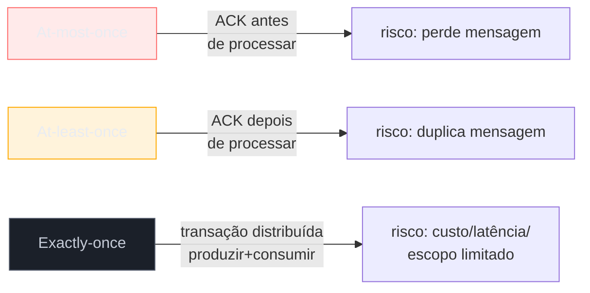
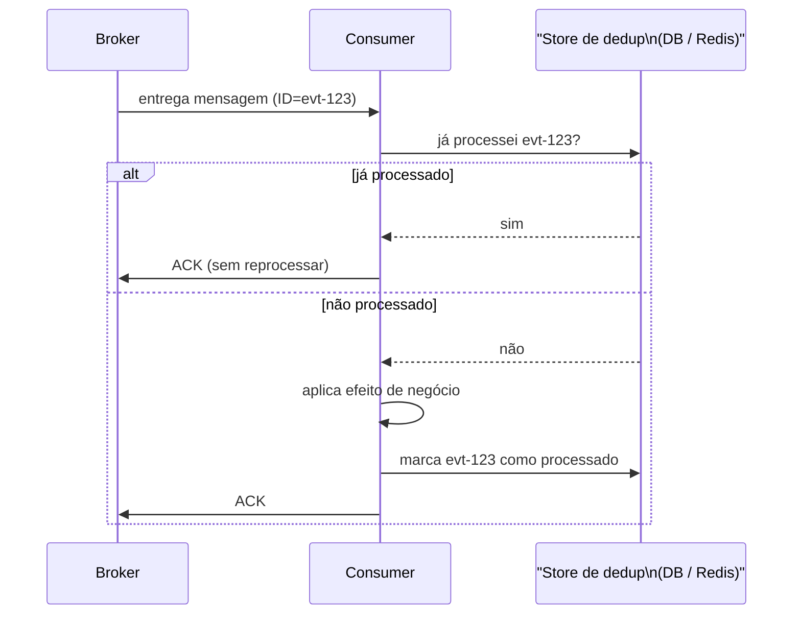
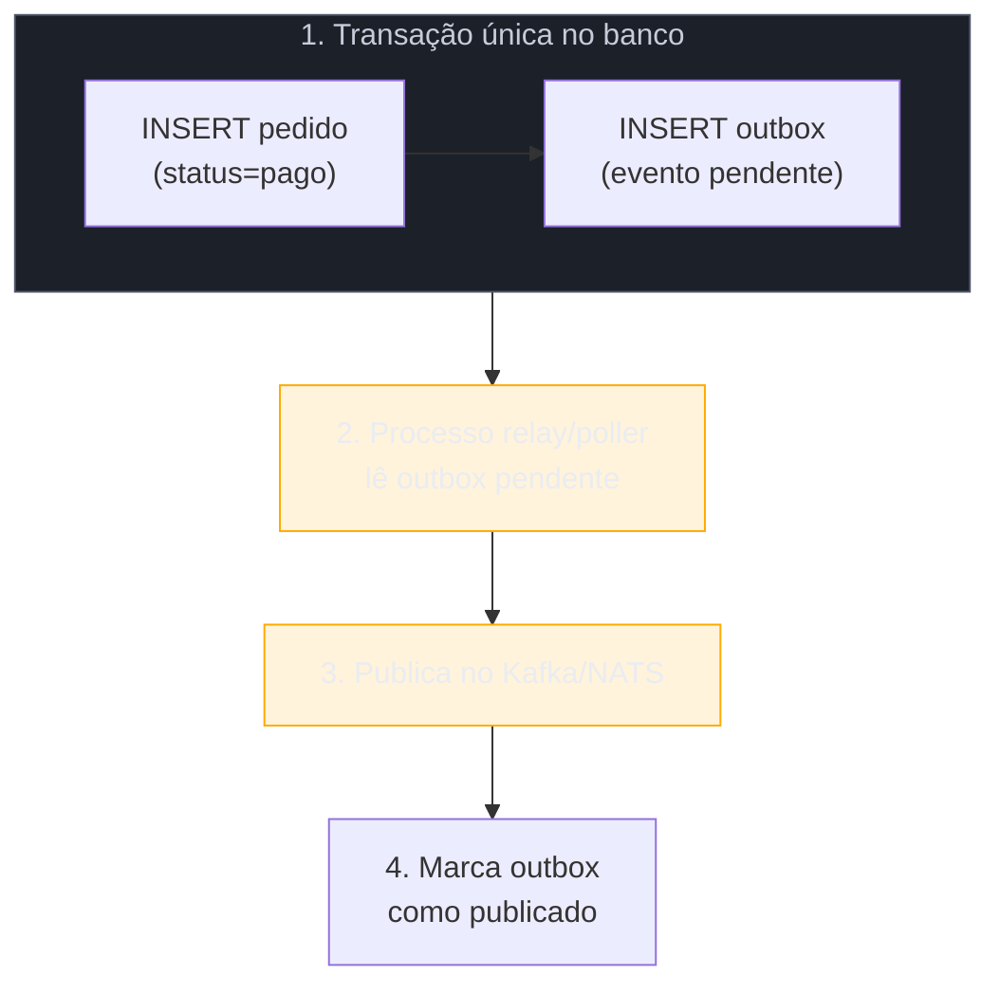

# Entrega e idempotência

> [!abstract] TL;DR
> Sistemas de mensageria distribuídos garantem, na prática, **at-least-once**: toda mensagem chega **pelo menos uma vez**, mas pode chegar mais de uma. Exactly-once de ponta a ponta é caro demais para exigir na maioria dos casos — a saída idiomática é aceitar duplicatas na rede e neutralizá-las na aplicação, tornando o consumidor **idempotente** (processar a mesma mensagem N vezes produz o mesmo efeito de processá-la uma vez). Duas técnicas resolvem isso na prática: **deduplicação** por chave de idempotência (memória, banco, ou `SETNX` no Redis) e o **padrão outbox** — gravar o evento na mesma transação de banco que grava o estado de negócio, eliminando o gap entre "salvei no banco" e "publiquei no broker" que produz duplicatas e mensagens perdidas.

## O problema: por que "enviei uma vez" não significa "chegou uma vez"

Imagine um serviço de pedidos que, ao confirmar um pagamento, publica um evento `PagamentoConfirmado` num tópico Kafka para o serviço de fulfillment consumir. O fluxo parece trivial:

```go
processarPagamento(pedido)
publisher.Publish(ctx, "pagamentos", eventoPagamentoConfirmado(pedido))
```

Agora pergunte: o que acontece se a rede cair **entre** o ACK do broker e a confirmação chegar ao seu processo? Você não sabe se a mensagem foi publicada ou não. As opções são:

1. **Não republicar** — arrisca perder o evento (o fulfillment nunca sabe que o pagamento foi confirmado).
2. **Republicar por segurança** — arrisca duplicar (o fulfillment despacha o pedido duas vezes).

Todo cliente de mensageria digno do nome (Kafka producer com `acks=all` e `retries`, NATS JetStream com ACK explícito) escolhe a opção 2: prefere duplicar a perder. Essa escolha tem nome — **at-least-once delivery** — e não é um detalhe de configuração que dá para desligar; é a garantia mais forte que um sistema distribuído consegue oferecer sem pagar o preço de exactly-once (mais adiante). O corolário é direto: **se o transporte garante "pelo menos uma vez", o consumidor precisa aguentar "mais de uma vez" sem quebrar**.

Isso não é peculiaridade de Kafka ou NATS — é a mesma physics que a [[03-Dominios/Tecnologia/Go/13 - Mensageria/01 - Por que mensageria — desacoplamento|nota 01]] descreveu ao falar de desacoplamento: uma vez que produtor e consumidor não compartilham uma transação, alguém no meio do caminho (rede, broker, o próprio consumidor reiniciando no meio do processamento) pode causar reentrega. A pergunta certa nunca é "como eliminar duplicatas na rede" — é "como tornar duplicatas inofensivas".

> [!question]- Por que não simplesmente configurar o broker para nunca duplicar?
> Porque duplicar é o preço de não perder. Considere o cenário mais comum de duplicata: o consumidor processa a mensagem, mas o crash acontece **entre** terminar o processamento e enviar o ACK ao broker (`sess.MarkMessage` no Kafka, `msg.Ack()` no NATS). O broker, sem ACK, reentrega — corretamente, porque da perspectiva dele a mensagem pode não ter sido processada. Eliminar esse tipo de duplicata exigiria ACK **antes** do processamento — o que trocaria "posso duplicar" por "posso perder", a troca oposta e pior.

## As três garantias de entrega — e por que exactly-once é caro



- **At-most-once**: o produtor envia e não confirma (fire-and-forget), ou o consumidor faz ACK antes de processar. Zero duplicatas, mas mensagens somem sempre que algo falha no meio. Raramente é a escolha certa fora de métricas/telemetria onde perder amostras é tolerável.
- **At-least-once**: a escolha padrão de Kafka e NATS JetStream configurados corretamente. Nada se perde, mas duplicatas acontecem — e o consumidor precisa saber lidar com isso. É o assunto central desta nota.
- **Exactly-once**: cada mensagem processada exatamente uma vez, ponto final. O Kafka oferece uma aproximação real disso via *transactional producer* e *EOS* (Exactly-Once Semantics, desde o KIP-98) — mas só dentro do próprio ecossistema Kafka, coordenando produtor, broker e consumer offset numa transação. No momento em que o efeito colateral sai do Kafka (grava num banco Postgres, chama uma API HTTP, escreve num arquivo), a garantia se rompe: não existe transação distribuída de propósito geral que amarre "commitei o offset" a "gravei no banco" a custo baixo. Sistemas que anunciam exactly-once fim a fim, na prática, ou restringem o efeito a dentro do próprio broker, ou pagam com **duas fases de commit** — latência e complexidade que a maioria dos times não quer carregar.

A conclusão prática, adotada por praticamente todo sistema de mensageria em produção: **desista de exactly-once no transporte e conquiste exactly-once no efeito**, via idempotência. É mais barato, mais simples de raciocinar, e funciona com qualquer broker — não amarra sua arquitetura a uma feature específica do Kafka.

## Idempotência: a defesa do lado do consumidor

Um consumidor **idempotente** produz o mesmo resultado final seja qual for o número de vezes que a mesma mensagem for processada: uma vez, duas vezes, dez vezes — o estado do sistema termina igual. A técnica central é uma **chave de idempotência**: um identificador único da mensagem (o `ID` do evento, um UUID gerado no produtor, ou uma combinação de campos que identifique unicamente a operação), verificado **antes** de aplicar o efeito.



O ponto crítico de correção: a checagem "já processei?" e a marcação "processei agora" precisam ser **atômicas** em relação ao efeito de negócio, ou você reintroduz a mesma janela de corrida que estava tentando fechar. Em Go, a forma mais robusta é amarrar dedup e efeito na mesma transação de banco, quando o efeito já é uma escrita em banco:

```go
type Dedup struct {
    db *sql.DB
}

// ErrJaProcessado sinaliza que a mensagem é duplicata — não é erro de negócio.
var ErrJaProcessado = errors.New("mensagem já processada")

func (d *Dedup) ProcessarComDedup(ctx context.Context, eventoID string, efeito func(tx *sql.Tx) error) error {
    tx, err := d.db.BeginTx(ctx, nil)
    if err != nil {
        return fmt.Errorf("iniciar tx: %w", err)
    }
    defer tx.Rollback() // no-op se Commit já rodou

    // chave única em (evento_id) garante que a segunda tentativa falhe aqui
    _, err = tx.ExecContext(ctx,
        `INSERT INTO eventos_processados (evento_id, processado_em) VALUES ($1, now())`,
        eventoID,
    )
    if isViolacaoChaveUnica(err) {
        return ErrJaProcessado // duplicata: nada a fazer, ACK segue normal
    }
    if err != nil {
        return fmt.Errorf("registrar dedup: %w", err)
    }

    if err := efeito(tx); err != nil {
        return fmt.Errorf("aplicar efeito: %w", err)
    }

    return tx.Commit()
}
```

> [!info] `errors.Is` e wrapping com `%w` — Go 1.13+
> `ErrJaProcessado` é retornado sem wrapping para que o chamador use `errors.Is(err, ErrJaProcessado)` e trate a duplicata como caminho normal (ACK sem log de erro), não como falha. Ver [[03-Dominios/Tecnologia/Go/04 - Erros como valor/index|Galho 4, Erros como valor]] para o mecanismo completo de wrapping.

Quando o efeito **não** é uma escrita em banco (chamar uma API externa, por exemplo), a transação SQL não ajuda — a alternativa comum é um store de dedup separado com TTL, como Redis via `SET eventoID valor NX EX 86400` (`NX` = só grava se a chave não existir, atômico por natureza do comando): se o `SET` retornar "já existia", é duplicata.

> [!warning] Dedup em memória (mapa, `sync.Map`) não sobrevive a restart nem a múltiplas réplicas
> Um `map[string]bool` guardando IDs processados parece resolver o problema, mas só protege contra duplicatas *dentro do mesmo processo* — perde tudo num restart, e não compartilha estado entre réplicas do mesmo consumer group. Para dedup real em produção, o store precisa ser compartilhado e persistente: banco relacional, Redis, ou (no caso de exatamente uma operação idempotente por natureza, como um `UPDATE ... WHERE status != 'confirmado'`) a própria idempotência natural da operação, sem store nenhum.

Nem toda operação precisa de um store de dedup explícito — algumas são **naturalmente idempotentes** pela forma como são escritas. `UPDATE saldo = 100 WHERE conta_id = 42` é idempotente por construção: rodar duas vezes produz o mesmo `100`. Já `UPDATE saldo = saldo + 10 WHERE conta_id = 42` não é — cada execução soma de novo. Preferir a primeira forma (set absoluto em vez de incremento relativo) sempre que o domínio permitir é a técnica de idempotência mais barata que existe, porque elimina a necessidade de qualquer store.

## O padrão outbox: fechando o gap entre banco e broker

O cenário de abertura desta nota — publicar um evento depois de processar um pagamento — tem um problema estrutural que dedup sozinho não resolve: **duas escritas em dois sistemas diferentes não são atômicas**. Considere:

```go
// Versão ingênua — dual write
tx.Commit()                                    // 1. grava no banco
publisher.Publish(ctx, "pagamentos", evento)   // 2. publica no broker
```

Entre os passos 1 e 2 existe uma janela onde o processo pode morrer. Se morrer depois do commit e antes do publish, o pagamento foi confirmado no banco mas o evento **nunca é publicado** — o fulfillment nunca sabe do pagamento. Não existe transação que amarre um `COMMIT` de Postgres a um `Publish` de Kafka — são dois sistemas diferentes, sem coordenador de transação distribuída em comum.

O **padrão outbox** resolve isso trocando a segunda escrita, arriscada, por uma escrita **na mesma transação** da primeira:



A ideia: em vez de publicar direto no broker dentro do fluxo de request, grave o evento numa tabela `outbox` **na mesma transação** que grava o estado de negócio. Como é a mesma transação, ou os dois `INSERT`s commitam juntos, ou nenhum commita — sem janela de inconsistência. Um processo separado (o *relay* ou *poller*, às vezes implementado via CDC — Change Data Capture, com Debezium lendo o WAL do Postgres) lê a tabela outbox e publica no broker de fato, marcando cada linha como publicada depois do ACK.

```go
type PedidoRepo struct {
    db *sql.DB
}

func (r *PedidoRepo) ConfirmarPagamento(ctx context.Context, pedidoID string) error {
    tx, err := r.db.BeginTx(ctx, nil)
    if err != nil {
        return fmt.Errorf("iniciar tx: %w", err)
    }
    defer tx.Rollback()

    if _, err := tx.ExecContext(ctx,
        `UPDATE pedidos SET status = 'pago' WHERE id = $1`, pedidoID,
    ); err != nil {
        return fmt.Errorf("atualizar pedido: %w", err)
    }

    payload, err := json.Marshal(map[string]string{"pedido_id": pedidoID})
    if err != nil {
        return fmt.Errorf("serializar payload: %w", err)
    }

    // Mesma transação: evento só existe se o pedido também foi atualizado.
    if _, err := tx.ExecContext(ctx,
        `INSERT INTO outbox (id, topico, payload, publicado) VALUES ($1, $2, $3, false)`,
        uuid.NewString(), "pagamentos.confirmado", payload,
    ); err != nil {
        return fmt.Errorf("gravar outbox: %w", err)
    }

    return tx.Commit()
}
```

O relay roda em processo (ou goroutine) separado, com polling ou LISTEN/NOTIFY do Postgres:

```go
func (r *OutboxRelay) Run(ctx context.Context, publisher Publisher) {
    ticker := time.NewTicker(500 * time.Millisecond)
    defer ticker.Stop()

    for {
        select {
        case <-ctx.Done():
            return
        case <-ticker.C:
            r.publicarPendentes(ctx, publisher)
        }
    }
}

func (r *OutboxRelay) publicarPendentes(ctx context.Context, publisher Publisher) {
    rows, err := r.db.QueryContext(ctx,
        `SELECT id, topico, payload FROM outbox WHERE publicado = false ORDER BY criado_em LIMIT 100`,
    )
    if err != nil {
        slog.Error("consultar outbox", "erro", err)
        return
    }
    defer rows.Close()

    for rows.Next() {
        var id, topico string
        var payload []byte
        if err := rows.Scan(&id, &topico, &payload); err != nil {
            slog.Error("ler linha outbox", "erro", err)
            continue
        }

        if err := publisher.Publish(ctx, topico, payload); err != nil {
            slog.Error("publicar evento outbox", "id", id, "erro", err)
            continue // tenta de novo no próximo tick — publicação não confirmada
        }

        if _, err := r.db.ExecContext(ctx,
            `UPDATE outbox SET publicado = true WHERE id = $1`, id,
        ); err != nil {
            slog.Error("marcar outbox publicado", "id", id, "erro", err)
            // aqui existe risco real de duplicata: publicou mas não marcou.
            // É exatamente por isso que o CONSUMIDOR do evento também precisa
            // ser idempotente — outbox reduz a janela, não a elimina.
        }
    }
}
```

> [!info] `log/slog` — biblioteca padrão desde Go 1.21
> O relay usa `slog.Error` com pares chave-valor estruturados em vez de `log.Printf` — mais fácil de filtrar e agregar em produção. Ver [[03-Dominios/Tecnologia/Go/09 - Sincronização e context/index|Galho 9]] para o padrão de propagar `context.Context` em loops de longa duração como este.

> [!warning] Outbox reduz o problema, não o elimina — o consumidor ainda precisa de idempotência
> Repare no comentário dentro de `publicarPendentes`: se o processo morrer entre `Publish` e `UPDATE ... publicado = true`, o relay vai republicar essa linha no próximo ciclo — duplicata de novo, só que numa janela bem menor e mais rara que o dual write ingênuo. Outbox garante que o evento **eventualmente** é publicado (não se perde); não garante que é publicado **exatamente uma vez**. As duas técnicas desta nota trabalham juntas: outbox do lado do produtor elimina a perda, dedup/idempotência do lado do consumidor elimina o efeito da duplicata que sobra.

## Casos práticos

**1. Chave de idempotência natural, sem store separado** — atualização absoluta em vez de incremento:

```go
func AtualizarStatusPedido(ctx context.Context, db *sql.DB, pedidoID, novoStatus string) error {
    // Idempotente por construção: rodar N vezes com o mesmo argumento
    // produz sempre o mesmo estado final.
    _, err := db.ExecContext(ctx,
        `UPDATE pedidos SET status = $1 WHERE id = $2`, novoStatus, pedidoID,
    )
    return err
}
```

**2. Dedup via Redis com TTL**, útil quando o efeito não é uma escrita em banco relacional:

```go
func processarComDedupRedis(ctx context.Context, rdb *redis.Client, eventoID string, efeito func() error) error {
    // NX: só grava se a chave não existir — operação atômica no Redis.
    ok, err := rdb.SetNX(ctx, "dedup:"+eventoID, "1", 24*time.Hour).Result()
    if err != nil {
        return fmt.Errorf("checar dedup: %w", err)
    }
    if !ok {
        return ErrJaProcessado // chave já existia: duplicata
    }
    return efeito()
}
```

**3. Consumer Kafka com dedup e ACK manual**, amarrando as duas técnicas desta nota (dedup do lado do consumo, complementando outbox do lado da produção):

```go
func (h *ConsumerHandler) ConsumeClaim(sess sarama.ConsumerGroupSession, claim sarama.ConsumerGroupClaim) error {
    for msg := range claim.Messages() {
        var evento EventoPagamento
        if err := json.Unmarshal(msg.Value, &evento); err != nil {
            slog.Error("decodificar mensagem", "erro", err)
            sess.MarkMessage(msg, "") // mensagem malformada: ACK e descarta (não vale reprocessar)
            continue
        }

        err := h.dedup.ProcessarComDedup(sess.Context(), evento.ID, func(tx *sql.Tx) error {
            return h.fulfillment.Despachar(tx, evento.PedidoID)
        })
        if err != nil && !errors.Is(err, ErrJaProcessado) {
            slog.Error("processar evento", "evento_id", evento.ID, "erro", err)
            continue // sem ACK: broker reentrega
        }

        sess.MarkMessage(msg, "") // ACK — seja processado agora, seja duplicata já tratada
    }
    return nil
}
```

## Armadilhas comuns

> [!warning] ACK antes de processar transforma at-least-once em at-most-once por acidente
> É tentador dar ACK assim que a mensagem chega, para "liberar" o broker rápido, e processar depois numa goroutine. Se o processo morrer entre o ACK e o processamento de fato, a mensagem já foi confirmada ao broker — ele não vai reentregar, e o efeito nunca acontece. ACK **sempre** depois do efeito estar seguro (persistido, ou pelo menos em fila durável local) — nunca antes.

> [!warning] Confundir "consumer idempotente" com "operação idempotente por HTTP"
> Quem vem de REST está acostumado a idempotência como propriedade do **verbo** (`PUT`/`DELETE` são idempotentes por definição do protocolo; `POST` não é). Em mensageria, idempotência não vem de graça de nenhum verbo — é uma propriedade que **você** constrói no handler, via chave de idempotência ou operação naturalmente idempotente. Assumir que "é só um evento, não uma escrita HTTP" e pular a checagem é a causa mais comum de despacho duplicado, cobrança duplicada, e-mail duplicado em produção.

> [!warning] Store de dedup sem TTL cresce sem limite
> Gravar todo `eventoID` processado numa tabela sem expiração eventualmente torna a tabela (e o índice) enorme, degradando a própria checagem que deveria ser rápida. Defina uma janela de retenção compatível com o pior caso de atraso de reentrega do seu broker (Kafka: normalmente minutos a poucas horas; se o SLA de reprocessamento manual for maior, ajuste a janela) — TTL no Redis ou job de limpeza periódico no banco.

## Lente cross-stack: quem já resolveu isso antes

| Vindo de... | Equivalente / analogia |
|---|---|
| Java (Spring, JMS) | `@JmsListener` com `SESSION_TRANSACTED` + tabela de idempotência manual — o Spring não resolve dedup por você; `spring-kafka` oferece `KafkaTemplate` transacional similar ao outbox via `@Transactional` + `ChainedKafkaTransactionManager` |
| Node.js | Bibliotecas como `node-rdkafka` ou `kafkajs` exigem o mesmo dedup manual; outbox é comum via Prisma/TypeORM `$transaction` gravando numa tabela `outbox_events`, com um worker separado (ou Debezium) fazendo o relay |
| Python (Celery, Kafka) | Idempotência costuma vir de `task_id` único + `django-celery-results` guardando resultado por ID; outbox é o mesmo padrão, geralmente com `django.db.transaction.atomic()` envolvendo o `INSERT` de negócio e o `INSERT` na tabela outbox |

O padrão em si — dedup por chave + outbox — não é invenção de Go; é solução de arquitetura distribuída, documentada por Chris Richardson no catálogo de padrões de microservices. Go só entrega o ferramental mais explícito (transações via `database/sql`, contexto de cancelamento, `sarama`/`nats.go` com ACK manual) para implementá-lo sem framework escondendo a mecânica.

## Como explicar em inglês

> Distributed messaging systems give you **at-least-once delivery** in practice — a message is guaranteed to arrive, but may arrive more than once, because acknowledging delivery and processing the message can never be made perfectly atomic across a network boundary. Rather than chase expensive **exactly-once** semantics end-to-end (which only really holds within a single broker's transactional boundary, like Kafka's EOS), idiomatic systems make the consumer **idempotent**: processing the same message N times yields the same result as processing it once, typically via a deduplication key checked and recorded atomically before the side effect runs. On the producer side, the **outbox pattern** closes the classic dual-write gap — instead of writing to the database and then publishing to the broker as two separate operations that can fail independently, you write the event to an outbox table in the *same* database transaction as the business state change, and a separate relay process publishes it afterward. The two techniques are complementary: outbox guarantees the event is never lost; consumer-side idempotency guarantees the duplicates that outbox can still produce are harmless.

| Termo PT | Termo EN |
|---|---|
| entrega pelo menos uma vez | at-least-once delivery |
| entrega no máximo uma vez | at-most-once delivery |
| entrega exatamente uma vez | exactly-once delivery / semantics |
| idempotência | idempotency |
| consumidor idempotente | idempotent consumer |
| chave de idempotência | idempotency key |
| deduplicação | deduplication (dedup) |
| padrão outbox | outbox pattern |
| escrita dupla / gravação dupla | dual write |
| relay / poller de outbox | outbox relay / poller |
| captura de mudanças de dados | Change Data Capture (CDC) |

## O que vem a seguir

Idempotência resolve o efeito de processar a mesma mensagem mais de uma vez — mas não resolve o que fazer quando o processamento **falha de verdade**, não por duplicata, mas por erro real (payload inválido, dependência fora do ar, timeout). Quantas vezes tentar de novo? Onde a mensagem vai parar se falhar sempre? E o que acontece se o consumidor não conseguir acompanhar o ritmo do produtor? A [[06 - Retry, DLQ e backpressure|próxima nota]] entra nesses três mecanismos — retry com backoff, dead letter queue, e backpressure — como o outro lado da mesma moeda de confiabilidade.

## Veja também

- [[01 - Por que mensageria — desacoplamento|01 — Por que mensageria — desacoplamento]] — por que produtor e consumidor não compartilham transação, raiz do problema desta nota
- [[02 - Kafka em Go|02 — Kafka em Go]] — cliente `sarama`, ACK manual e consumer groups usados nos exemplos
- [[04 - Consumers e workers|04 — Consumers e workers]] — o loop de consumo onde a dedup desta nota se encaixa
- [[06 - Retry, DLQ e backpressure|06 — Retry, DLQ e backpressure]] — próxima nota do galho
- [[03-Dominios/Tecnologia/Go/index|Trilha Go]]

## Fontes

- The Go Authors. *log/slog package documentation*. pkg.go.dev. https://pkg.go.dev/log/slog (acessado em 2026-07-18)
- The Go Authors. *database/sql package documentation*. pkg.go.dev. https://pkg.go.dev/database/sql (acessado em 2026-07-18)
- The Go Authors. *Effective Go — Errors*. go.dev. https://go.dev/doc/effective_go#errors (acessado em 2026-07-18)
- Go by Example. *Errors*. gobyexample.com. https://gobyexample.com/errors (acessado em 2026-07-18)
- The Go Authors. *A Tour of Go — Errors*. go.dev. https://go.dev/tour/methods/19 (acessado em 2026-07-18)
