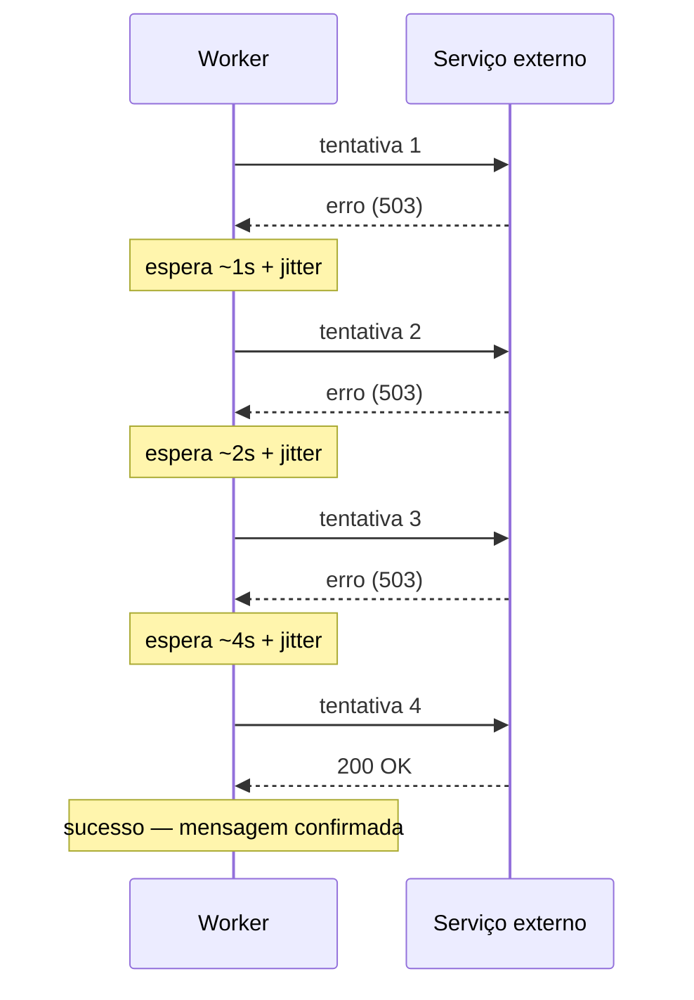
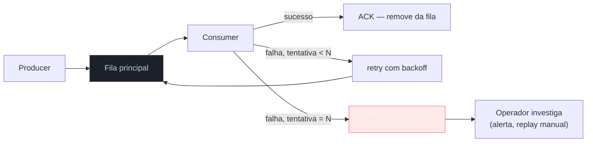
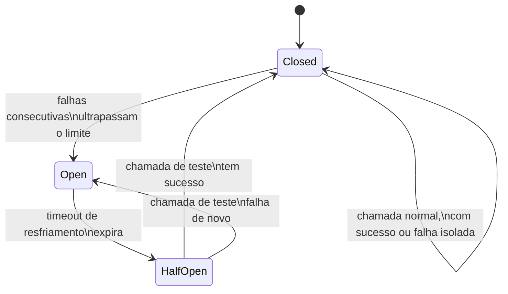
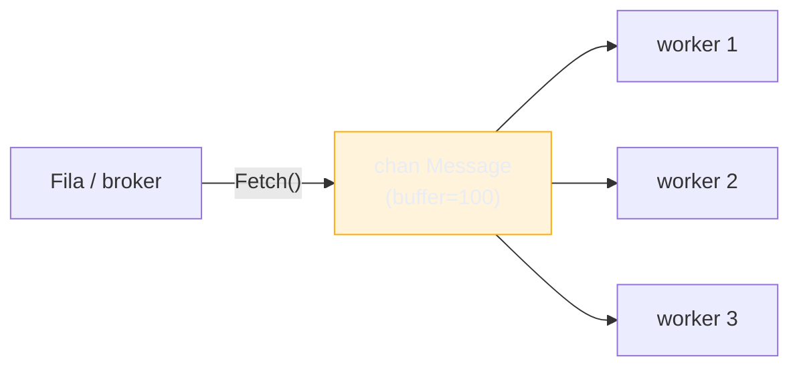

# Retry, DLQ e backpressure

> [!abstract] TL;DR
> Três problemas distintos, três respostas distintas. **Retry com backoff exponencial** lida com falha transiente — reprocessa a mesma mensagem, espaçando as tentativas para não martelar um serviço já combalido. **Dead letter queue (DLQ)** lida com falha permanente — depois de N tentativas, a mensagem sai da fila principal e vai para um lugar de quarentena, sem travar as mensagens boas atrás dela. **Circuit breaker** lida com dependência inteira fora do ar — corta as tentativas por um tempo em vez de gastar retry em algo que sabidamente vai falhar. **Backpressure** lida com o consumidor sendo mais lento que o produtor — sinaliza "pare" antes que a fila estoure a memória ou o consumidor afogue. Os quatro mecanismos se combinam: retry decide *se* tenta de novo, backoff decide *quando*, circuit breaker decide *se vale a pena tentar*, DLQ decide *quando desistir*, e backpressure decide *quanto aceitar*.

## O cenário que expõe o problema

Um worker consome mensagens de uma fila e chama uma API de pagamento para cada uma. Na maior parte do tempo, tudo funciona. Mas às 3 da manhã, a API de pagamento fica instável por 90 segundos — timeouts intermitentes, um erro 503 aqui, outro ali.

A pergunta ingênua é: "o worker deveria descartar a mensagem que falhou?" Não — descartar significa perder um pagamento. A segunda pergunta ingênua é: "então o worker deveria tentar de novo imediatamente, em loop, até dar certo?" Também não — e é aqui que a maioria dos sistemas de mensageria mal desenhados quebra. Retry imediato e sem limite, contra um serviço já sob estresse, é o padrão clássico de **retry storm**: cada falha gera uma nova tentativa instantânea, que soma-se às tentativas de todas as outras mensagens na fila, que aumenta a carga sobre o serviço já combalido, que gera mais falhas, que gera mais retries. O worker que devia *ajudar* o sistema a se recuperar acaba sendo o motivo dele nunca se recuperar.

Esta nota resolve isso em quatro camadas, cada uma respondendo a uma pergunta diferente:

1. Vale a pena tentar de novo? (**retry**)
2. Se sim, quando? (**backoff**)
3. Depois de quantas tentativas eu desisto — e o que faço com a mensagem? (**DLQ**)
4. E se a dependência inteira estiver fora do ar, não é melhor nem tentar por um tempo? (**circuit breaker**)
5. E se o problema não for a dependência externa, mas o próprio consumidor não dar conta do volume? (**backpressure**)

## Retry com backoff exponencial

A ideia central do backoff exponencial é simples: cada tentativa subsequente espera mais tempo que a anterior, multiplicando o intervalo por um fator fixo. Tentativa 1 falha, espera 1s. Tentativa 2 falha, espera 2s. Tentativa 3 falha, espera 4s. E assim por diante, até um teto.



Um detalhe que separa backoff exponencial correto de backoff exponencial ingênuo: **jitter**. Se cem workers falham ao mesmo tempo (porque o serviço externo caiu ao mesmo tempo para todos), backoff puro faz todos esperarem exatamente 1s, depois exatamente 2s, depois exatamente 4s — e tentarem de novo *sincronizados*, recriando o mesmo pico de carga a cada rodada. Jitter — um componente aleatório somado ao intervalo — espalha essas tentativas no tempo, quebrando a sincronização. É o problema descrito no clássico post da AWS Architecture Blog, "Exponential Backoff And Jitter": backoff sozinho resolve o crescimento do intervalo, mas só jitter resolve a correlação entre workers.

```go
package retry

import (
	"context"
	"errors"
	"fmt"
	"math"
	"math/rand/v2"
	"time"
)

// ErrPermanent sinaliza que a falha não deve ser reprocessada —
// deixa a decisão "vale a pena tentar de novo?" explícita na assinatura de erro.
var ErrPermanent = errors.New("falha permanente, não reprocessar")

type Config struct {
	MaxTentativas int
	Base          time.Duration // intervalo da primeira espera
	Teto          time.Duration // intervalo máximo, não importa quantas tentativas
}

// Do executa fn com backoff exponencial e jitter, respeitando ctx.
func Do(ctx context.Context, cfg Config, fn func() error) error {
	var ultimoErr error

	for tentativa := 0; tentativa < cfg.MaxTentativas; tentativa++ {
		if err := fn(); err != nil {
			if errors.Is(err, ErrPermanent) {
				return err // sem retry — não adianta tentar de novo
			}
			ultimoErr = err

			espera := backoffComJitter(tentativa, cfg.Base, cfg.Teto)
			select {
			case <-time.After(espera):
				continue
			case <-ctx.Done():
				return ctx.Err()
			}
		}
		return nil // sucesso
	}

	return fmt.Errorf("esgotadas %d tentativas: %w", cfg.MaxTentativas, ultimoErr)
}

func backoffComJitter(tentativa int, base, teto time.Duration) time.Duration {
	exp := float64(base) * math.Pow(2, float64(tentativa))
	if exp > float64(teto) {
		exp = float64(teto)
	}
	// full jitter: sorteia qualquer valor entre 0 e o teto exponencial da rodada
	return time.Duration(rand.Float64() * exp)
}
```

> [!info] `math/rand/v2` (Go 1.22+)
> O pacote `math/rand/v2`, estabilizado no Go 1.22, substitui `math/rand` com uma API mais enxuta e geradores mais rápidos por padrão — `rand.Float64()` não exige mais uma fonte (`Source`) semeada manualmente para ter comportamento seguro entre goroutines. Para código novo, prefira `math/rand/v2` a `math/rand`.

A escolha de `errors.Is(err, ErrPermanent)` acima não é acidental: ela separa, na própria árvore de erros do Go 1.13+ (`errors.Is`/`errors.As`, [[03-Dominios/Tecnologia/Go/13 - Mensageria/05 - Entrega e idempotência|nota 05]] já trabalhou processamento idempotente, mas não a árvore de erros em si), falha que **vale** reprocessar de falha que **não vale**. Um erro de validação — payload malformado, campo obrigatório ausente — nunca vai ter sucesso na tentativa 2, não importa quanto tempo você espere. Retry cego, sem essa distinção, desperdiça tentativas (e atrasa a ida para a DLQ) em mensagens que já estavam condenadas na primeira tentativa.

> [!warning] Nem todo erro merece retry
> Confundir erro transiente com erro permanente é a armadilha mais cara desta seção. Um `500` de um serviço sobrecarregado é candidato a retry. Um `400` porque o payload está errado não é — reprocessar não conserta payload errado, só queima tentativas e atrasa a mensagem chegar na DLQ, onde alguém finalmente vai olhar o problema de verdade. Trate o código de erro (ou o tipo do erro em Go) como parte do contrato do consumer: decida explicitamente, caso a caso, o que é transiente.

## Dead letter queue (DLQ)

Depois de `MaxTentativas` falhas, insistir não é mais resiliência — é ruído. A mensagem provavelmente tem um problema estrutural (payload inválido, referência a um recurso que não existe, bug no consumer) que retry nenhum resolve. Nesse ponto, a mensagem precisa sair do caminho das mensagens saudáveis.

É aqui que entra a **dead letter queue**: uma fila (ou tópico) separada, de "quarentena", para onde vão as mensagens que esgotaram as tentativas. A ideia central é simples e poderosa: **isolar o veneno sem parar a linha de produção**. Sem DLQ, uma mensagem permanentemente inválida no início da fila trava (ou é reprocessada em loop) enquanto centenas de mensagens boas ficam paradas atrás dela — o cenário chamado *head-of-line blocking*.



Kafka e NATS JetStream oferecem esse mecanismo de formas distintas, e a diferença vale entender porque muda o que o consumer precisa fazer manualmente:

- **Kafka** não tem DLQ nativa embutida no broker — é um padrão que a aplicação implementa: o consumer contabiliza tentativas (num header da mensagem, ou numa tabela externa) e, ao esgotar, produz a mensagem original para um tópico `pedidos.dlq`, separado do tópico principal. A [[03-Dominios/Tecnologia/Go/13 - Mensageria/02 - Kafka em Go|nota 02]] já cobriu produção e consumo — o padrão DLQ aqui é só "produzir de volta, num tópico diferente, quando desistir".
- **NATS JetStream** tem suporte mais direto: um consumer pode configurar `MaxDeliver` (quantas vezes uma mensagem é redesignada antes de parar) e, combinado com uma *stream* de destino, redirecionar automaticamente a mensagem que excedeu o limite — sem a aplicação precisar reimplementar a contagem manualmente.

```go
package worker

import (
	"context"
	"log/slog"
)

type Publisher interface {
	Publish(ctx context.Context, topic string, payload []byte) error
}

const maxTentativasAntesDLQ = 5

// processar tenta processar a mensagem com retry; ao esgotar, manda para a DLQ.
func processar(ctx context.Context, pub Publisher, msg []byte, tentativa int) error {
	err := processarPagamento(ctx, msg)
	if err == nil {
		return nil
	}

	if tentativa >= maxTentativasAntesDLQ {
		slog.Warn("mensagem esgotou tentativas, enviando para DLQ",
			"tentativa", tentativa,
			"erro", err,
		)
		return pub.Publish(ctx, "pagamentos.dlq", msg)
	}

	return err // sinaliza pro loop de consumo tentar de novo, com backoff
}
```

> [!info] `log/slog` (Go 1.21+)
> `log/slog`, na stdlib desde o Go 1.21, é a escolha padrão para log estruturado — pares chave-valor (`"tentativa", tentativa`) em vez de strings formatadas manualmente, o que importa especialmente aqui: uma DLQ sem log estruturado do *motivo* da falha é uma fila de mensagens misteriosas que ninguém sabe por que estão lá.

> [!warning] DLQ sem alerta é um cemitério, não uma ferramenta
> A armadilha mais comum com DLQ: implementá-la, ver que funciona (mensagens ruins param de travar a fila principal) e parar por aí. Sem um alerta de "a DLQ cresceu" e sem um processo — manual ou automatizado — de reprocessar (*replay*) mensagens da DLQ depois de corrigido o bug, a DLQ vira um buraco negro que acumula silenciosamente pagamentos perdidos. DLQ é o começo de um processo operacional, não o fim dele.

## Circuit breaker no consumo

Retry com backoff resolve falha transiente de uma mensagem individual. Mas e quando o problema não é "essa mensagem específica falhou", e sim "a API de pagamento está fora do ar inteira, há 3 minutos, e vai continuar assim por mais 10"? Nesse cenário, cada mensagem que o worker tenta processar ainda vai gastar o tempo cheio de retry — 1s, 2s, 4s, 8s — só para falhar de novo no final, porque o serviço nem respondeu de verdade. Multiplicado por centenas de mensagens na fila, isso desperdiça tempo de worker e ainda martela um serviço que já sabemos que está fora do ar.

O **circuit breaker** resolve isso adicionando um estado de curto-circuito: depois de um número de falhas consecutivas, o breaker "abre" e passa a rejeitar chamadas imediatamente — sem sequer tentar — por um período de resfriamento. Depois desse período, ele deixa passar uma chamada de teste (*half-open*); se ela tiver sucesso, o breaker fecha de novo e o tráfego normal volta.



Este mecanismo é o mesmo circuit breaker usado em chamadas HTTP/gRPC síncronas entre serviços — não é exclusivo de mensageria. A diferença aqui é só onde ele se encaixa: em vez de proteger uma chamada de API feita a partir de um handler HTTP, ele protege a chamada que o **consumer** faz para uma dependência externa a cada mensagem processada.

```go
package worker

import (
	"context"
	"fmt"
	"time"

	"github.com/sony/gobreaker/v2"
)

var cb = gobreaker.NewCircuitBreaker[error](gobreaker.Settings{
	Name:        "api-pagamento",
	MaxRequests: 3,                // chamadas permitidas em half-open, antes de fechar de vez
	Interval:    10 * time.Second, // janela de contagem de falhas em closed
	Timeout:     30 * time.Second, // tempo em open antes de tentar half-open
	ReadyToTrip: func(counts gobreaker.Counts) bool {
		return counts.ConsecutiveFailures > 5
	},
})

func processarComBreaker(ctx context.Context, msg []byte) error {
	_, err := cb.Execute(func() (error, error) {
		return nil, processarPagamento(ctx, msg)
	})
	if err != nil {
		if err == gobreaker.ErrOpenState {
			// breaker aberto: nem tentou. Volta a mensagem pra fila
			// (ou vai direto pro caminho de retry com backoff maior).
			return fmt.Errorf("dependência indisponível, breaker aberto: %w", err)
		}
		return err
	}
	return nil
}
```

> [!question]- Circuit breaker substitui retry, ou os dois coexistem?
> Coexistem, em camadas diferentes. Retry com backoff decide o que fazer com **uma mensagem** que falhou — espera e tenta de novo. Circuit breaker decide o que fazer com **a dependência inteira** — se ela já mostrou falha consecutiva demais, nem vale a pena gastar o ciclo de retry, porque a resposta já é previsível. Na prática, o breaker fica "por fora": cada tentativa de retry passa pelo breaker: se ele estiver aberto, a tentativa nem sai do worker; se estiver fechado, segue o fluxo normal de retry e backoff.

## Backpressure: e se o consumidor é que não aguenta?

Os três mecanismos anteriores respondem a "a dependência externa falhou". Backpressure responde a um problema diferente: **o produtor está publicando mais rápido do que o consumidor consegue processar** — sem falha nenhuma, só descompasso de velocidade. Um pico de tráfego, uma campanha de marketing, um batch noturno que despeja um milhão de mensagens de uma vez.

Sem controle, esse descompasso se manifesta de duas formas ruins: a fila cresce sem limite (até estourar a memória do broker ou o disco), ou — pior — o consumidor tenta processar tudo ao mesmo tempo, abrindo goroutines sem limite até esgotar conexões de banco, file descriptors, ou memória do próprio processo. Backpressure é o mecanismo que diz "pare de me mandar mais até eu terminar o que já tenho".

Em Go, a ferramenta mais direta para backpressure dentro do processo é o **worker pool com canal bufferizado**, já apresentado nos galhos anteriores de concorrência — [[03-Dominios/Tecnologia/Go/09 - Sincronização e context/index|Galho 9]] cobriu o padrão worker pool a fundo; aqui o ponto é aplicá-lo especificamente ao consumo de mensageria:



```go
package worker

import (
	"context"
	"log/slog"
	"sync"
)

// consumirComBackpressure lê mensagens do broker e as distribui entre
// N workers via canal bufferizado. O tamanho do buffer é o limite de
// quanto trabalho "em voo" o processo aceita antes de parar de buscar mais.
func consumirComBackpressure(ctx context.Context, fetch func(ctx context.Context) ([]byte, error), nWorkers, bufferSize int) {
	fila := make(chan []byte, bufferSize)

	var wg sync.WaitGroup
	for i := 0; i < nWorkers; i++ {
		wg.Add(1)
		go func() {
			defer wg.Done()
			for msg := range fila {
				if err := processarPagamento(ctx, msg); err != nil {
					slog.Error("falha ao processar", "erro", err)
				}
			}
		}()
	}

	// Produtor interno: busca do broker e empurra pro canal.
	// Quando o canal estiver cheio, este Send BLOQUEIA — é aqui
	// que o backpressure de fato acontece: o worker pool cheio
	// freia a taxa de busca de novas mensagens no broker.
	go func() {
		defer close(fila)
		for {
			select {
			case <-ctx.Done():
				return
			default:
				msg, err := fetch(ctx)
				if err != nil {
					continue
				}
				fila <- msg // bloqueia se o buffer estiver cheio
			}
		}
	}()

	wg.Wait()
}
```

O ponto central deste código não é o worker pool em si — é a linha `fila <- msg`. Um canal bufferizado em Go é, por construção, um mecanismo de backpressure: escrever num canal cheio **bloqueia** até que algum worker libere espaço lendo. Isso propaga a lentidão do consumidor de volta para o loop que busca mensagens do broker, sem nenhuma lógica extra de "checar se está sobrecarregado" — é a semântica normal de `chan` fazendo o trabalho.

Kafka e NATS JetStream também têm mecanismos de backpressure no próprio protocolo — o consumer só confirma (`commit`/`ack`) o que já processou, e brokers modernos evitam empurrar mais dados do que o consumer sinalizou capacidade de receber. Mas depender só disso não basta: um worker pool sem limite, mesmo lendo do Kafka de forma "correta", ainda pode abrir goroutines sem controle internamente. O canal bufferizado fecha essa lacuna dentro do próprio processo Go.

> [!warning] Buffer grande demais só adia o problema
> Aumentar o `bufferSize` para "resolver" backpressure é como aumentar o limite do cartão de crédito para "resolver" dívida — só empurra o estouro pra frente, com juros. Um buffer grande absorve picos curtos, mas se o consumidor for estruturalmente mais lento que o produtor (não um pico, uma taxa sustentada), o buffer só atrasa quando a memória estoura. A solução real é escalar o número de consumers, otimizar o processamento, ou — quando nada disso for suficiente — aceitar que a fila principal deve crescer, e monitorar isso explicitamente (métrica de *consumer lag*) em vez de esconder o sintoma atrás de um buffer maior.

## Caso prático: as quatro peças num único worker

O exemplo a seguir junta retry, circuit breaker e DLQ num único ponto de entrada — o tipo de função que, na prática, fica no centro de um consumer de produção. O worker pool com canal bufferizado (backpressure) fica de fora deste trecho porque já foi mostrado inteiro na seção anterior; aqui o foco é como as outras três peças se compõem *dentro* do processamento de uma mensagem individual.

```go
package worker

import (
	"context"
	"errors"
	"fmt"
	"log/slog"

	"github.com/sony/gobreaker/v2"
)

type Handler struct {
	breaker    *gobreaker.CircuitBreaker[error]
	publisher  Publisher
	maxRetries int
}

// Processar é o ponto único por onde toda mensagem passa: breaker por fora,
// retry por dentro do breaker, DLQ como saída final quando tudo falha.
func (h *Handler) Processar(ctx context.Context, msg []byte, tentativa int) error {
	_, err := h.breaker.Execute(func() (error, error) {
		return nil, processarPagamento(ctx, msg)
	})

	switch {
	case err == nil:
		return nil // sucesso — ACK na camada de consumo

	case errors.Is(err, gobreaker.ErrOpenState):
		// Breaker aberto: nem tentou de verdade. Devolve a mensagem pra fila
		// (NACK) sem contar como uma "tentativa" real de processamento —
		// o problema é a dependência, não esta mensagem específica.
		slog.Warn("breaker aberto, mensagem devolvida à fila", "msg_id", idDe(msg))
		return fmt.Errorf("dependência indisponível: %w", err)

	case errors.Is(err, ErrPermanent):
		// Falha que retry nenhum resolve: direto pra DLQ, sem gastar tentativas.
		return h.publisher.Publish(ctx, "pagamentos.dlq", msg)

	case tentativa >= h.maxRetries:
		// Falha transiente, mas as tentativas se esgotaram.
		slog.Error("tentativas esgotadas, enviando para DLQ",
			"msg_id", idDe(msg), "tentativas", tentativa, "erro", err)
		return h.publisher.Publish(ctx, "pagamentos.dlq", msg)

	default:
		// Falha transiente, ainda há tentativas — o loop de consumo
		// (nota 04) reagenda com backoff, incrementando `tentativa`.
		return err
	}
}
```

O `switch` deixa visível, num único lugar, a árvore de decisão inteira: breaker aberto não conta como tentativa gasta; erro marcado como permanente pula direto pra DLQ; erro transiente com tentativas esgotadas também vai pra DLQ, mas só depois de gastar o orçamento de retry; e o caso comum — falha transiente com tentativas sobrando — devolve o erro para o loop de consumo decidir o backoff, do jeito visto na primeira seção desta nota.

> [!question]- Quem reprocessa a DLQ depois que o bug é corrigido?
> Normalmente, um script ou job separado — nunca o mesmo consumer que alimenta a DLQ, porque misturar os dois caminhos reintroduz o mesmo risco de head-of-line blocking que a DLQ existe para evitar. O padrão comum é: um processo de replay lê da DLQ, publica de volta no tópico principal (ou chama o mesmo handler diretamente, fora do fluxo automático), e só remove da DLQ depois de confirmar sucesso. Esse processo é deliberadamente manual ou semi-automatizado — mensagens na DLQ, por definição, já falharam da forma "automática" possível; reintroduzi-las sem revisão corre o risco de recriar o mesmo retry storm que os outros mecanismos desta nota existem para evitar.

## Como as quatro peças se encaixam

| Mecanismo | Pergunta que responde | Escopo |
|---|---|---|
| Retry + backoff | "Vale tentar de novo essa mensagem, e quando?" | uma mensagem |
| DLQ | "Quando desisto, e onde guardo o que não deu certo?" | uma mensagem, depois de N falhas |
| Circuit breaker | "A dependência inteira está fora do ar — vale nem tentar?" | uma dependência externa |
| Backpressure | "O consumidor está afogando — quanto aceito por vez?" | o fluxo inteiro |

Um worker de produção real normalmente usa os quatro ao mesmo tempo: o circuit breaker envolve a chamada à dependência externa; se o breaker deixar passar, retry com backoff cobre falhas transientes dessa chamada específica; se as tentativas se esgotarem, a mensagem vai para a DLQ; e o worker pool com canal bufferizado, por trás de tudo isso, garante que o processo nunca aceita mais trabalho simultâneo do que consegue sustentar.

## Vindo de outras linguagens

| Origem | Equivalente / diferença em Go |
|---|---|
| Java (Resilience4j) | `Retry`, `CircuitBreaker` e `Bulkhead` do Resilience4j têm papel quase idêntico a `retry.Do` + `gobreaker` + canal bufferizado aqui — a diferença é que em Go isso raramente vem de um framework único; cada peça é uma lib pequena (ou stdlib) combinada manualmente. |
| Node.js (BullMQ) | BullMQ oferece retry com backoff e "failed queue" (equivalente a DLQ) configurados declarativamente na definição do job. Em Go, com Kafka/NATS puro, esse comportamento é código explícito — não vem embutido no cliente. |
| Python (Celery) | Celery tem `retry(countdown=..., max_retries=...)` embutido na task e uma "dead letter" de fato pouco padronizada (depende do broker). O circuit breaker geralmente vem de uma lib à parte, como `pybreaker` — análogo ao `gobreaker` usado aqui. |

## Como explicar em inglês

> Four distinct problems get four distinct answers. **Retry with exponential backoff** handles a single message failing transiently — wait longer between each attempt, and add jitter so retries from many workers don't resynchronize into a new spike. **Dead letter queue (DLQ)** handles a message that keeps failing permanently — after N attempts, move it out of the main queue into quarantine, so it stops blocking healthy messages behind it (head-of-line blocking). **Circuit breaker** handles the case where the whole dependency is down, not just one call — after enough consecutive failures it "trips" and rejects calls immediately for a cooldown period, instead of wasting a full retry cycle on something known to fail. **Backpressure** handles a consumer that's structurally slower than the producer — a buffered channel in Go is itself a backpressure mechanism, since writing to a full channel blocks until a worker frees space, which naturally propagates slowness back to the fetch loop. In production, all four typically compose: circuit breaker wraps the external call, retry with backoff covers transient failures inside it, DLQ catches what retry gives up on, and a bounded worker pool caps how much work is in flight at once.

| Termo PT | Termo EN |
|---|---|
| retry com backoff exponencial | retry with exponential backoff |
| jitter | jitter |
| erro transiente | transient error |
| erro permanente | permanent error |
| dead letter queue (DLQ) | dead letter queue (DLQ) |
| bloqueio de cabeça de fila | head-of-line blocking |
| reprocessamento manual | replay |
| disjuntor / circuit breaker | circuit breaker |
| estado semiaberto | half-open state |
| contrapressão | backpressure |
| canal bufferizado | buffered channel |
| atraso do consumidor | consumer lag |

## O que vem a seguir

Retry, DLQ, circuit breaker e backpressure resolvem os problemas de **robustez** de um consumer individual — como não perder mensagens e não afogar sob pressão. Mas eles ainda tratam cada mensagem isoladamente. A [[07 - Padrões de processamento|nota 07]], última do galho, muda de escala: como estruturar o processamento em si — fan-out para paralelizar, agregação em janelas, e o padrão saga para transações que atravessam múltiplos serviços via mensageria.

## Veja também

- [[04 - Consumers e workers|04 — Consumers e workers]] — a estrutura de consumo (poll loop, ack/nack, worker pool) sobre a qual retry, DLQ e backpressure se apoiam
- [[05 - Entrega e idempotência|05 — Entrega e idempotência]] — at-least-once e idempotência, pré-requisito para entender por que retry pode reprocessar a mesma mensagem com segurança
- [[07 - Padrões de processamento|07 — Padrões de processamento]] — próxima nota do galho
- [[03-Dominios/Tecnologia/Go/09 - Sincronização e context/index|Galho 9 — Concorrência avançada e padrões]] — worker pool e canais bufferizados usados aqui como mecanismo de backpressure
- [[03-Dominios/Tecnologia/Go/index|Trilha Go]]

## Fontes

- The Go Authors. *math/rand/v2*. pkg.go.dev. https://pkg.go.dev/math/rand/v2 (acessado em 2026-07-18)
- The Go Authors. *log/slog*. pkg.go.dev. https://pkg.go.dev/log/slog (acessado em 2026-07-18)
- Brooker, Marc. *Exponential Backoff And Jitter*. AWS Architecture Blog. https://aws.amazon.com/blogs/architecture/exponential-backoff-and-jitter/ (acessado em 2026-07-18)
- Sony. *gobreaker — circuit breaker pattern implementation in Go*. GitHub. https://github.com/sony/gobreaker (acessado em 2026-07-18)
- Confluent. *Kafka Consumer Configurations for Dead Letter Queues*. confluent.io. https://www.confluent.io/blog/kafka-connect-deep-dive-error-handling-dead-letter-queues/ (acessado em 2026-07-18)
- NATS. *JetStream — Redelivery and Dead Letter*. docs.nats.io. https://docs.nats.io/nats-concepts/jetstream/consumers (acessado em 2026-07-18)
