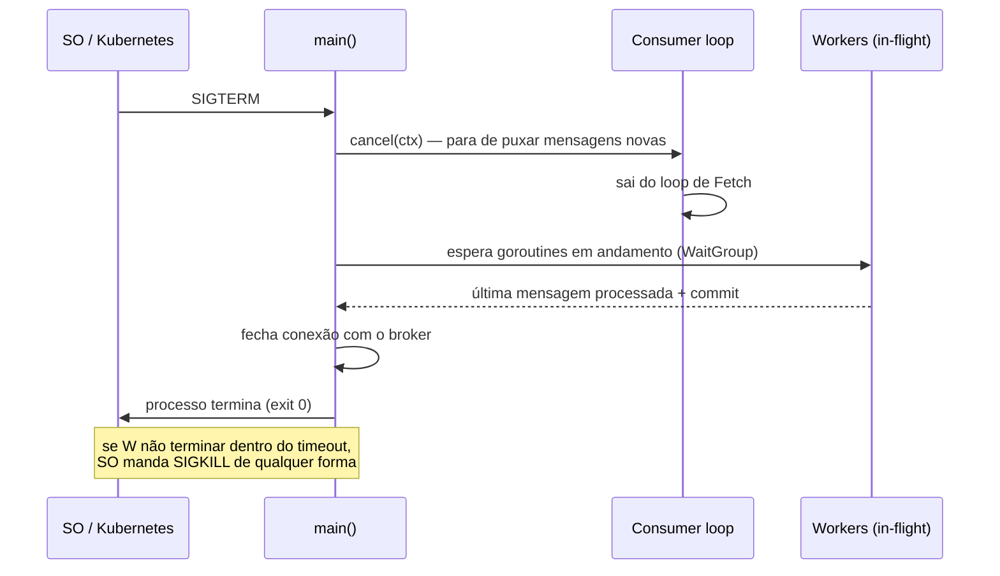
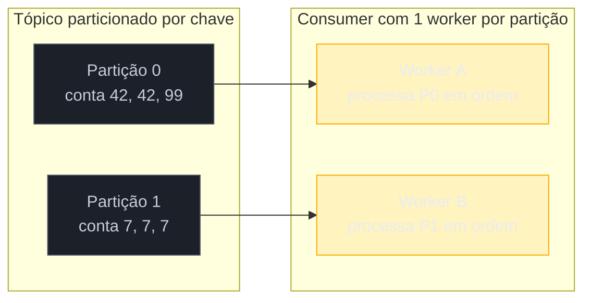
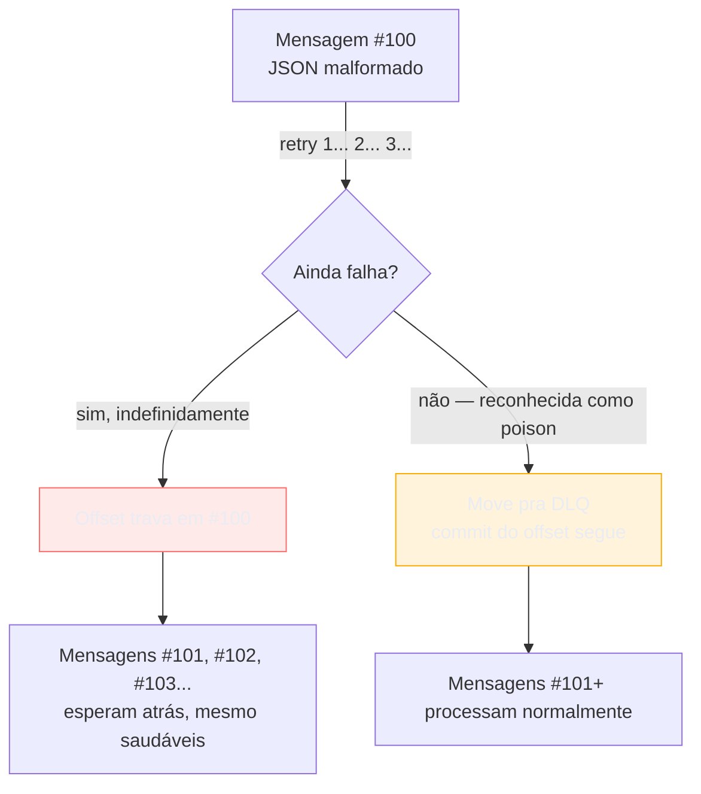
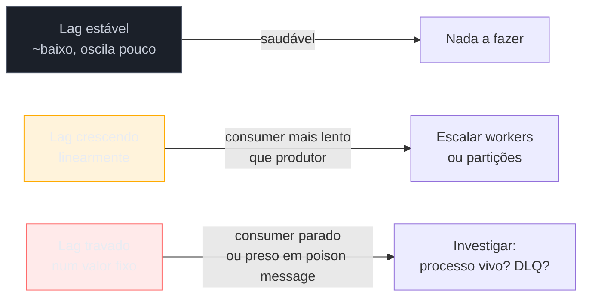

# Padrões de processamento

> [!abstract] TL;DR
> Fechar um consumer não é `os.Exit(0)` — é drenar o *in-flight* antes de morrer, ou você perde exatamente as mensagens que estava processando no momento do deploy. Ordering por chave (mensagens da mesma entidade sempre no mesmo worker, na ordem de chegada) resolve corridas que idempotência sozinha não resolve. Poison messages (payload que nunca processa com sucesso, não importa quantas vezes) travam uma partição inteira se você não isolar e seguir em frente. E lag de consumer — quantas mensagens estão esperando processamento — é o sinal vital que decide se o problema é "está lento" ou "está morto", mas essa nota só planta a métrica; instrumentá-la de verdade é assunto do Galho 16 (Observabilidade). As três primeiras peças completam o consumer de produção que as notas 04-06 construíram: agora ele desliga com dignidade, respeita ordem quando importa, e não trava para sempre num payload podre.

## Um deploy às 3 da tarde

Seu time sobe uma nova versão do consumer de pedidos. O Kubernetes manda `SIGTERM` pro pod antigo, espera um tempinho, e manda `SIGKILL` se ele não sair sozinho. No meio disso, o consumer estava com cinco mensagens **puxadas do Kafka mas ainda não processadas** — no meio de gravar no banco, no meio de chamar um serviço externo.

Se o processo simplesmente morre no `SIGKILL`, essas cinco mensagens não foram commitadas — ótimo, elas voltam pro tópico e outro consumer as pega depois. Mas e as que já foram *parcialmente* processadas? Uma delas já gravou no banco mas não chegou a fazer o commit do offset. Se o restart reprocessar essa mensagem do zero, você depende inteiramente da idempotência da nota 05 para não duplicar o efeito. E se o handler não é idempotente — porque ninguém pensou nisso na hora de escrever aquele endpoint específico — o cliente recebe dois e-mails de confirmação, ou é cobrado duas vezes.

O problema de fundo: **matar um consumer no meio do trabalho é sempre arriscado**, mesmo com toda a rede de segurança das notas anteriores. A saída não é eliminar o risco — é reduzi-lo ao mínimo, dando ao consumer uma janela para terminar o que já começou antes de morrer. Isso se chama *graceful shutdown*, e é o primeiro padrão desta nota.

## Graceful shutdown: dar tempo para o in-flight terminar

A ideia central é simples de enunciar e fácil de fazer errado: quando o sinal de desligar chega, o consumer **para de puxar mensagens novas**, mas **espera as que já estão em processamento terminarem**, e só então sai. Nada de puxar mensagem nova nesse meio tempo, nada de matar o processo no meio de um handler.



O mecanismo em Go usa exatamente as peças que os galhos 8 e 9 já cravaram: `context.Context` para sinalizar "pare de puxar", e `sync.WaitGroup` para saber quando o *in-flight* zerou. Nenhuma peça nova — é composição do que você já tem:

```go
func run(ctx context.Context, reader *kafka.Reader, handle func(context.Context, kafka.Message) error) error {
    ctx, stop := signal.NotifyContext(ctx, os.Interrupt, syscall.SIGTERM)
    defer stop()

    var wg sync.WaitGroup

    for {
        // Fetch, não ReadMessage: Fetch não avança o offset sozinho — dá controle
        // explícito de quando commitar, essencial pra drenar sem perder mensagem.
        msg, err := reader.FetchMessage(ctx)
        if err != nil {
            if errors.Is(err, context.Canceled) {
                break // ctx cancelado: para de puxar mensagens novas
            }
            return fmt.Errorf("fetch: %w", err)
        }

        wg.Add(1)
        go func(m kafka.Message) {
            defer wg.Done()

            // processamento usa contexto próprio, SEM cancelamento do sinal de
            // shutdown: a mensagem já foi puxada, ela termina de processar.
            processCtx, cancel := context.WithTimeout(context.Background(), 30*time.Second)
            defer cancel()

            if err := handle(processCtx, m); err != nil {
                slog.Error("falha ao processar mensagem", "erro", err, "offset", m.Offset)
                return
            }
            if err := reader.CommitMessages(context.Background(), m); err != nil {
                slog.Error("falha ao commitar offset", "erro", err, "offset", m.Offset)
            }
        }(msg)
    }

    slog.Info("shutdown: aguardando in-flight terminar")
    done := make(chan struct{})
    go func() {
        wg.Wait()
        close(done)
    }()

    select {
    case <-done:
        slog.Info("shutdown: in-flight drenado, encerrando")
    case <-time.After(20 * time.Second):
        slog.Warn("shutdown: timeout de drenagem, encerrando à força")
    }

    return reader.Close()
}
```

> [!info] `signal.NotifyContext` (Go 1.16+)
> Converte sinais do SO (`SIGTERM`, `SIGINT`) direto num `context.Context` cancelado — sem canal manual de `os/signal.Notify` nem `select` cru pra traduzir sinal em cancelamento. É a forma idiomática de plugar sinais no modelo de contexto desde que apareceu na stdlib.

Três decisões deste código merecem destaque porque cada uma resolve um jeito diferente de fazer graceful shutdown errado:

1. **O contexto do sinal cancela o *fetch*, não o *processamento*.** Se você passasse o mesmo `ctx` (cancelado no `SIGTERM`) para o `handle`, o processamento em andamento morreria no meio — exatamente o que se queria evitar. Por isso o handler recebe um `context.Background()` com timeout próprio, desligado do ciclo de vida do sinal.
2. **`FetchMessage` + `CommitMessages` manual**, não `ReadMessage` (que já commita sozinho). Sem esse controle explícito, não dá para garantir que o commit só acontece depois do processamento ter de fato terminado com sucesso.
3. **Timeout de drenagem** (`time.After(20 * time.Second)`) é obrigatório. Sem ele, uma goroutine travada — presa esperando um serviço externo que nunca responde — segura o `wg.Wait()` para sempre, e o Kubernetes acaba mandando `SIGKILL` de qualquer jeito, só que mais tarde e sem log nenhum explicando por quê. O timeout de drenagem precisa ser **menor** que o `terminationGracePeriodSeconds` do Kubernetes (ou equivalente do orquestrador), ou a força bruta chega primeiro.

> [!warning] `SIGKILL` não tem graceful shutdown nenhum — planeje para isso, não só contra isso
> `SIGTERM` pode ser capturado e tratado; `SIGKILL` não pode, nunca, em nenhuma linguagem. Todo o código acima assume que o orquestrador manda `SIGTERM` primeiro e só escala para `SIGKILL` depois de um tempo — configurável no Kubernetes via `terminationGracePeriodSeconds` (default 30s). Se esse tempo for curto demais para o seu tempo médio de processamento, ajuste o grace period — não tente fazer o handler "mais rápido" artificialmente. E não importa quão bem escrito seja o shutdown: idempotência (nota 05) continua sendo a rede de segurança final, porque `SIGKILL` sempre pode acontecer.

## Ordering por chave: quando a ordem importa mais que o paralelismo

A nota 04 mostrou consumers com múltiplos workers processando mensagens em paralelo, para ganhar throughput. Mas paralelismo sem cuidado quebra qualquer fluxo em que a **ordem entre mensagens da mesma entidade** importa.

Pense num tópico de eventos de conta bancária: `SaldoDebitado(conta=42, valor=100)` seguido de `SaldoCreditado(conta=42, valor=50)`. Se dois workers pegam essas duas mensagens ao mesmo tempo e o segundo termina antes do primeiro — pura questão de agendamento de goroutine, sem nenhum bug óbvio — o saldo final da conta 42 fica errado, porque o crédito foi aplicado antes do débito. Idempotência (nota 05) não ajuda aqui: cada mensagem processando exatamente uma vez, na ordem errada, ainda produz o resultado errado.

A saída não é abrir mão de paralelismo — é garantir paralelismo **entre entidades diferentes**, com serialização **dentro da mesma entidade**. Kafka já dá metade disso de graça: mensagens com a mesma chave (`Key`) vão sempre para a mesma partição, e dentro de uma partição a ordem de chegada é preservada. O que falta é o consumer não embaralhar essa ordem ao distribuir para workers.



A regra prática, direto do que a nota 02 já estabeleceu sobre particionamento: **escolha uma chave que agrupe tudo que precisa de ordem relativa** (aqui, o ID da conta) e **um worker por partição, nunca um pool compartilhado consumindo múltiplas partições em paralelo sem essa disciplina**. Se o seu consumer usa `kafka-go` com um `Reader` por partição — ou `segmentio/kafka-go` com `GroupBalancer` que atribui partições inteiras a consumers — a ordem já vem de graça da infraestrutura; o erro comum é, dentro de UM consumer que recebe UMA partição, ainda assim distribuir as mensagens dela para um pool de workers concorrentes, destruindo a ordem que o broker preservou com tanto cuidado.

```go
// Errado: pool de workers processando a MESMA partição em paralelo — destrói ordem
func consumeErrado(ctx context.Context, reader *kafka.Reader) {
    sem := make(chan struct{}, 10) // 10 workers concorrentes
    for {
        msg, _ := reader.FetchMessage(ctx)
        sem <- struct{}{}
        go func(m kafka.Message) {
            defer func() { <-sem }()
            handle(m) // mensagens da mesma conta podem terminar fora de ordem
        }(msg)
    }
}

// Certo: processamento sequencial dentro da partição — ordem preservada
func consumeCorreto(ctx context.Context, reader *kafka.Reader) {
    for {
        msg, err := reader.FetchMessage(ctx)
        if err != nil {
            return
        }
        if err := handle(msg); err != nil { // sequencial: espera terminar antes do próximo Fetch
            slog.Error("falha ao processar", "erro", err, "key", string(msg.Key))
            continue
        }
        reader.CommitMessages(ctx, msg)
    }
}
```

O paralelismo real, nesse desenho, não desaparece — ele se move para o **número de partições**: mais partições, mais workers rodando em paralelo, cada um serializado dentro da sua fatia. É o mesmo trade-off que a nota 02 já descreveu ao escolher quantas partições um tópico deve ter — essa nota só volta a ele pela lente de "quanto paralelismo você abre mão para garantir ordem".

> [!question]- E se eu preciso de paralelismo alto E ordem por entidade, mas o número de entidades excede o número de partições que fazem sentido operacionalmente?
> É um padrão real chamado **sharding lógico**: dentro de um consumer que recebe uma partição inteira, você mantém uma goroutine (ou fila) dedicada por chave — não por mensagem — usando um hash da chave para rotear cada mensagem sempre para a mesma goroutine. Isso preserva ordem por chave sem exigir uma partição física por entidade. É mais código (um roteador interno, canais por shard, cuidado para não vazar goroutine) e vale a complexidade só quando o número de entidades realmente excede o que é razoável particionar no broker.

## Poison messages: quando a mensagem em si é o problema

Retry com backoff (nota 06) assume que uma falha é **transitória** — o banco estava sobrecarregado, a rede piscou, tenta de novo e passa. Mas existe uma categoria de falha diferente: a mensagem **nunca** vai processar com sucesso, porque o problema está nela mesma. Um JSON malformado. Um campo obrigatório ausente porque um produtor antigo, de uma versão anterior do schema, ainda está publicando no formato velho. Um valor que viola uma invariante de negócio que o handler nunca soube tratar.

Essa mensagem é uma **poison message** — e o efeito colateral dela, sem tratamento, é pior do que uma falha isolada: ela **trava a partição inteira**. Se o consumer só avança o offset depois de processar com sucesso (o padrão correto, para não perder mensagem), e essa mensagem nunca processa com sucesso, o offset nunca avança — e toda mensagem *depois* dela na mesma partição fica esperando atrás de uma fila que nunca anda.



A nota 06 já introduziu a DLQ (*dead-letter queue*) como destino de mensagens que esgotaram as tentativas de retry — o mecanismo de poison message é literalmente esse mesmo circuito, com um detalhe extra: **classificar** a falha antes de decidir se vale retry ou se é caso perdido de saída. Um erro de rede vale retry; um erro de deserialização de JSON não vale retentar dez vezes — a estrutura não muda entre uma tentativa e a próxima.

```go
type ErroFatal struct {
    Motivo string
}

func (e *ErroFatal) Error() string { return e.Motivo }

func handle(ctx context.Context, msg kafka.Message) error {
    var pedido Pedido
    if err := json.Unmarshal(msg.Value, &pedido); err != nil {
        // erro de parsing não melhora numa segunda tentativa — é fatal, direto pra DLQ
        return &ErroFatal{Motivo: fmt.Sprintf("payload inválido: %v", err)}
    }

    if err := processarPedido(ctx, pedido); err != nil {
        return fmt.Errorf("processar pedido: %w", err) // pode ser transitório — elegível a retry
    }
    return nil
}

func consumeComPoisonHandling(ctx context.Context, reader, dlqWriter *kafka.Writer, msg kafka.Message) {
    err := retryComBackoff(ctx, 3, func() error { return handle(ctx, msg) })

    var fatal *ErroFatal
    if errors.As(err, &fatal) || (err != nil && esgotouRetries(err)) {
        slog.Warn("mensagem envenenada, movendo para DLQ",
            "offset", msg.Offset, "key", string(msg.Key), "erro", err)
        dlqWriter.WriteMessages(ctx, kafka.Message{
            Key:   msg.Key,
            Value: msg.Value,
            Headers: append(msg.Headers, kafka.Header{
                Key: "x-dlq-reason", Value: []byte(err.Error()),
            }),
        })
    }
    // commit sempre acontece depois — sucesso OU envio pra DLQ — nunca trava a partição
    reader.CommitMessages(ctx, msg)
}
```

A peça que faz o padrão funcionar é a **distinção explícita entre erro transitório e erro fatal** — um `errors.As` para um tipo de erro dedicado (`*ErroFatal`), não um `if err != nil` genérico que trata tudo do mesmo jeito. Sem essa distinção, ou você retenta erros que nunca vão passar (desperdiçando tempo e possivelmente amplificando carga em cima de um payload podre), ou manda pra DLQ erros transitórios que teriam passado na segunda tentativa.

> [!warning] DLQ cheia de poison messages sem alarme é um cemitério, não uma rede de segurança
> Mover a mensagem pra DLQ resolve o travamento da partição, mas não resolve o problema de negócio — em algum lugar, um pedido não foi processado. Sem alarme e sem processo humano revisando a DLQ periodicamente, ela vira um buraco negro onde falhas desaparecem sem ninguém perceber. O mínimo viável: uma métrica de contagem de mensagens na DLQ, com alerta quando o número sobe — a mesma disciplina de observabilidade que a próxima seção introduz para lag.

### O mesmo padrão do lado do NATS

Os três padrões desta nota não são exclusividade de Kafka — eles se aplicam a qualquer broker, só mudando o vocabulário. A nota 03 já apresentou NATS/JetStream; vale fechar o paralelo explicitamente, porque os nomes divergem o suficiente para confundir quem só conhece um dos dois:

| Conceito | Kafka | NATS JetStream |
|---|---|---|
| Drenar antes de sair | fechar `Reader` depois do `wg.Wait()` | `nc.Drain()` — para de entregar mensagens novas e espera acks pendentes, função nativa do cliente |
| Ordering | mensagens com a mesma `Key` vão para a mesma partição; ordem preservada dentro dela | subject + `ConsumerConfig{AckPolicy: AckExplicit}` com um único consumer *pull* processando sequencialmente; sem partição, a ordem depende de não paralelizar dentro do mesmo subject |
| Poison message | mover para tópico de DLQ manualmente, como no exemplo acima | `MaxDeliver` no `ConsumerConfig` — depois de N tentativas, JetStream move automaticamente pra fila de mensagens não entregáveis, sem código de retry manual |

A diferença mais prática: JetStream tem `MaxDeliver` como configuração declarativa — o broker conta as tentativas de entrega e desiste sozinho, sem o consumer precisar implementar contador de retry à mão como no exemplo Kafka acima. Kafka deixa esse controle inteiramente na aplicação, porque o broker não tem conceito nativo de "tentativa de entrega" — só de offset commitado ou não.

## Lag de consumer: o sinal vital que diferencia "lento" de "morto"

*Consumer lag* é a distância, em número de mensagens, entre o que já foi publicado no tópico e o que o consumer já processou (commitou). Se o produtor publicou até o offset 10.000 e o consumer commitou até o 9.950, o lag é 50 — o consumer está 50 mensagens atrás do que existe pra processar.

Lag baixo e estável é saudável — o consumer processa aproximadamente na mesma velocidade que mensagens chegam. Lag que **cresce sem parar** é o sintoma mais direto de que existe algum problema, e a causa raiz pode ser qualquer coisa que essa nota e as anteriores já trataram: um poison message travando a partição (lag congela, não cresce mais — sintoma diferente), um consumer morto que nenhum health check pegou, ou throughput genuinamente insuficiente para o volume que chega.



Sem observar lag, você só descobre que um consumer parou de processar quando um humano do lado de negócio reclama que um pedido de três dias atrás nunca chegou — tarde demais para ser um incidente tratado com calma. Com lag exposto como métrica, é um alerta automático muito antes disso.

Esta nota não vai fundo na mecânica de expor essa métrica — Prometheus, `client_golang`, dashboards, e a disciplina completa de observabilidade (os quatro sinais de ouro, RED, USE) são o assunto do **Galho 16**. O que fica registrado aqui é o gancho conceitual: **todo consumer de produção precisa expor lag como métrica**, nem que seja um contador simples incrementado a cada `CommitMessages` comparado contra o offset mais recente do tópico (exposto pelo próprio broker — no Kafka, via `kafka-consumer-groups.sh --describe` ou a API equivalente que ferramentas como Prometheus JMX Exporter e Kafka Exporter já encapsulam). O padrão de processamento fica incompleto sem esse sinal — é ele que transforma "o consumer parou" de um mistério em um alerta.

## Casos práticos

**1. Consumer completo com graceful shutdown, ordering por partição e poison handling combinados:**

```go
func main() {
    reader := kafka.NewReader(kafka.ReaderConfig{
        Brokers: []string{"localhost:9092"},
        Topic:   "pedidos",
        GroupID: "processador-pedidos",
    })
    dlqWriter := &kafka.Writer{
        Addr:  kafka.TCP("localhost:9092"),
        Topic: "pedidos-dlq",
    }
    defer reader.Close()
    defer dlqWriter.Close()

    ctx, stop := signal.NotifyContext(context.Background(), os.Interrupt, syscall.SIGTERM)
    defer stop()

    for {
        msg, err := reader.FetchMessage(ctx)
        if err != nil {
            if errors.Is(err, context.Canceled) {
                break
            }
            slog.Error("fetch falhou", "erro", err)
            continue
        }

        // sequencial dentro da partição: ordem por chave preservada (kafka-go
        // já entrega uma partição por vez a este loop com GroupID configurado)
        consumeComPoisonHandling(context.Background(), reader, dlqWriter, msg)
    }

    slog.Info("shutdown limpo: última mensagem in-flight foi a última processada")
}
```

**2. Métrica mínima de lag, sem depender ainda do Galho 16 — só o contador que alimenta o alerta depois:**

```go
var lagAtual atomic.Int64 // exposto depois via Prometheus (Galho 16)

func atualizarLag(ctx context.Context, reader *kafka.Reader) {
    stats := reader.Stats()
    lagAtual.Store(stats.Lag)
}

// chamado periodicamente, por exemplo a cada commit ou num ticker próprio:
func consumeComLag(ctx context.Context, reader *kafka.Reader) {
    ticker := time.NewTicker(10 * time.Second)
    defer ticker.Stop()
    go func() {
        for range ticker.C {
            atualizarLag(ctx, reader)
        }
    }()
    // ... loop de FetchMessage normal, como nos casos anteriores
}
```

> [!info] `kafka.Reader.Stats()` já traz `Lag` pronto
> O driver `segmentio/kafka-go` calcula o lag da partição atual sem você precisar consultar offsets manualmente — `reader.Stats().Lag` retorna a diferença entre o offset mais recente disponível e o que o reader já consumiu. É o dado cru; o trabalho do Galho 16 é expor esse número como série temporal observável, com alerta configurado em cima dele.

## Armadilhas comuns

> [!warning] Cancelar o contexto de processamento junto com o de shutdown
> Se o `ctx` que cancela no `SIGTERM` for o mesmo passado para `handle()`, todo processamento em andamento é abortado no meio — exatamente o cenário que graceful shutdown existe para evitar. Sempre separe: um contexto para "parar de puxar mensagem nova" (o cancelado pelo sinal), outro para "esta mensagem específica, que já começou, tem até X segundos para terminar" (independente do sinal).

> [!warning] Pool de workers compartilhado destruindo ordem dentro de uma partição
> É tentador jogar toda mensagem recebida — de qualquer partição, de qualquer chave — num `sync.WaitGroup` genérico com N goroutines para "aumentar o throughput". Se ordem por entidade importa, isso quebra silenciosamente: não há erro, não há painic, só resultados errados esporádicos que parecem corrida de dados porque são exatamente isso. Paralelismo tem que respeitar o limite de partição/chave, não ser aplicado cegamente sobre qualquer stream de mensagens.

> [!warning] DLQ sem classificação de erro vira lixeira de tudo
> Mandar qualquer falha para a DLQ depois de N retries, sem distinguir "isso é fatal, nunca vai passar" de "isso é transitório, talvez passe na próxima", mistura dois problemas completamente diferentes na mesma fila — e dificulta saber, ao revisar a DLQ depois, se o volume ali é sintoma de um bug de deserialização (corrige o código) ou de uma dependência instável (aumenta timeout/retry). Classifique o erro antes de decidir o destino.

## Lente cross-stack

| Vindo de... | Em Go, o equivalente é |
|---|---|
| Java: `@KafkaListener` com `ackMode` manual + `ConsumerAwareRebalanceListener` para drenar antes de rebalance | `signal.NotifyContext` + `sync.WaitGroup`, escrito à mão — Go não tem um container de listener gerenciando o ciclo de vida por trás |
| Node.js: `consumer.disconnect()` do `kafkajs`, que já espera handlers pendentes por padrão | mesma ideia, mas explícita: você escreve o `WaitGroup` e o timeout, não vem de graça do driver |
| Python: Celery com `worker_prefetch_multiplier` e `--max-tasks-per-child`, DLQ via `task_routes` | conceitualmente igual (isolar mensagem podre, não deixar travar a fila), mas em Go o roteamento pra DLQ é código explícito no handler, não configuração declarativa do framework |

## Como explicar em inglês

> Production consumers need to handle three failure modes graceful shutdown alone doesn't cover. First, draining in-flight work on `SIGTERM`: stop fetching new messages, let goroutines already processing finish (bounded by a timeout, since `SIGKILL` is coming regardless), then exit. Second, ordering by key: parallelism has to stay within entity boundaries — one worker per partition, sequential within it — or messages from the same entity can commit out of order even when each one individually processes exactly once. Third, poison messages: payloads that fail deterministically, not transiently, need to be classified as fatal and routed straight to a dead-letter queue instead of retried forever, or they stall the whole partition behind them. All three failure modes share one detection signal — consumer lag, the gap between the latest published offset and what's been committed — which is the metric every production consumer needs to expose, even before wiring up full observability tooling.

| Termo PT | Termo EN |
|---|---|
| desligamento gracioso | graceful shutdown |
| em processamento / em voo | in-flight |
| drenar | drain |
| ordenação por chave | ordering by key |
| mensagem envenenada | poison message |
| fila de mensagens mortas | dead-letter queue (DLQ) |
| atraso do consumer | consumer lag |
| corrida de dados | data race |

## O que vem a seguir

Esta nota fecha o Galho 13: você agora tem um consumer que entrega pelo menos uma vez (nota 05), sobrevive a falha transitória sem virar backpressure descontrolado (nota 06), e desliga, ordena e isola falha de forma disciplinada (esta nota). O que falta é a pergunta de nível acima — não "como este consumer se comporta sozinho", mas "como múltiplos serviços, cada um com seus próprios consumers e producers, se organizam como sistema". O **Galho 14 — Microservices e arquitetura** entra nessa camada: como decompor um sistema em serviços, como coordenar transações que cruzam serviços (saga, retomando entrega e idempotência desta trilha), gRPC entre serviços internos (Galho 12 já deu a base), e circuit breaker — o padrão de isolar falha de dependência síncrona que é o primo conceitual do poison-message handling desta nota, só que para chamadas HTTP/gRPC em vez de mensagens de fila.

## Veja também

- [[04 - Consumers e workers|04 — Consumers e workers]] — a base do consumer que esta nota estende com shutdown, ordering e poison handling
- [[05 - Entrega e idempotência|05 — Entrega e idempotência]] — idempotência continua sendo a rede de segurança final contra `SIGKILL` e reprocessamento
- [[06 - Retry, DLQ e backpressure|06 — Retry, DLQ e backpressure]] — a DLQ e o backoff que o tratamento de poison message reaproveita
- [[02 - Kafka em Go|02 — Kafka em Go]] — particionamento e chave de mensagem, retomados aqui pela lente de ordering
- [[03-Dominios/Tecnologia/Go/index|Trilha Go]]

## Fontes

- The Go Authors. *context package — Package context*. pkg.go.dev. https://pkg.go.dev/context (acessado em 2026-07-18)
- The Go Authors. *os/signal package — NotifyContext*. pkg.go.dev. https://pkg.go.dev/os/signal#NotifyContext (acessado em 2026-07-18)
- The Go Authors. *sync package — WaitGroup*. pkg.go.dev. https://pkg.go.dev/sync#WaitGroup (acessado em 2026-07-18)
- segmentio. *kafka-go — Reader.Stats and consumer group documentation*. pkg.go.dev. https://pkg.go.dev/github.com/segmentio/kafka-go (acessado em 2026-07-18)
- Apache Kafka. *Consumer Configs — ordering and partition assignment*. kafka.apache.org. https://kafka.apache.org/documentation/#consumerconfigs (acessado em 2026-07-18)
- Kubernetes. *Pod Lifecycle — Termination of Pods*. kubernetes.io. https://kubernetes.io/docs/concepts/workloads/pods/pod-lifecycle/#pod-termination (acessado em 2026-07-18)
