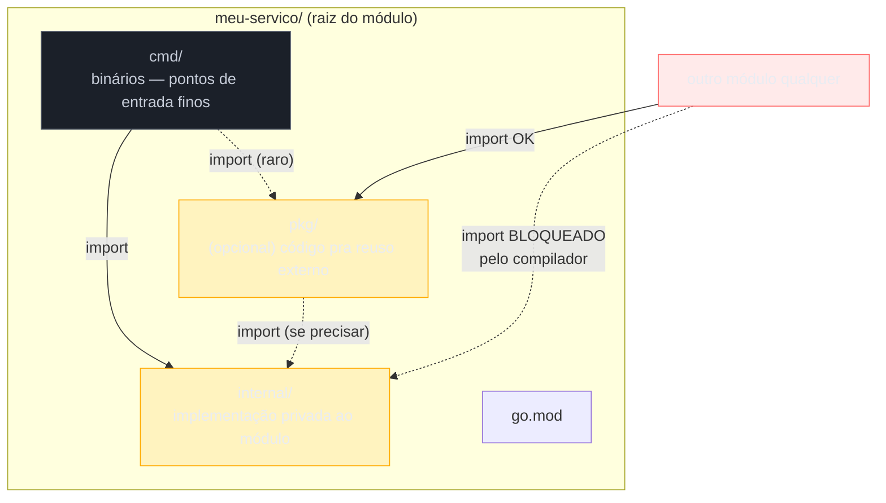

# Project layout — cmd, internal, pkg

> [!abstract] TL;DR
> Go não impõe estrutura de pastas — o compilador não liga se o código está em `src/`, `app/` ou tudo solto na raiz. Mas a comunidade convergiu para um layout de fato-padrão: `cmd/<binário>/main.go` para pontos de entrada finos, `internal/` para todo o código que só o próprio módulo pode importar, e `pkg/` (opcional, e cada vez mais contestado) para código pensado para ser reaproveitado por fora. A peça que realmente importa — porque o **compilador** a impõe, não convenção nenhuma — é `internal/`: qualquer pacote sob um diretório chamado `internal` só pode ser importado por código que vive na árvore acima desse `internal`. Não é gentleza de linter; é `go build` recusando compilar. Esse mecanismo é a base de qualquer arquitetura de microservice em Go: ele é o jeito de dizer "isto é implementação, não API" sem precisar de `private`/`public` no sentido de outras linguagens.

## O problema que aparece no segundo serviço

Seu primeiro serviço em Go começa simples: um `main.go` na raiz, um handler HTTP, pronto. Funciona. Mas o segundo serviço da empresa também precisa de um client HTTP retryable, de um logger configurado do mesmo jeito, de um parser de config idêntico. A tentação óbvia — vindo de qualquer linguagem com pacotes públicos por padrão (uma classe `public` em Java, um módulo Python sem `_` na frente) — é simplesmente importar o pacote do primeiro serviço no segundo. Go, por padrão, deixa: se o pacote não está em `internal/`, qualquer módulo que consiga localizá-lo no filesystem ou num repositório Git pode importá-lo.

O problema aparece seis meses depois. O pacote de config do serviço A, pensado para as necessidades específicas de A, agora tem três `if strings.Contains(serviceName, ...)` espalhados porque B, C e D importaram e foram colando exceções. Não existe mais um dono claro do pacote — existe um emaranhado de serviços acoplados a detalhes internos uns dos outros, sem que nenhum deles tenha *pedido* essa API publicamente. Ninguém decidiu "isto agora é uma API pública, estável, versionada" — simplesmente aconteceu, porque nada impedia o import.

É exatamente esse problema que o layout `cmd` / `internal` / `pkg` — e, mais especificamente, o mecanismo de `internal` — resolve. Não com convenção de nomes ou revisão de código, mas com uma regra que o próprio `go build` aplica.

## As três pastas, uma de cada vez



### `cmd/` — os pontos de entrada

`cmd/` guarda um subdiretório por **binário** que o módulo produz — cada um com seu próprio `main.go`. Um serviço pode expor mais de um binário: o servidor HTTP em si, uma ferramenta de migração, um worker de fila:

```
meu-servico/
├── go.mod
├── cmd/
│   ├── api/
│   │   └── main.go       // servidor HTTP
│   ├── worker/
│   │   └── main.go       // consumidor de fila
│   └── migrate/
│       └── main.go       // ferramenta de migração de schema
├── internal/
│   └── ...
└── pkg/
    └── ...
```

A convenção — reforçada pela própria comunidade Go, incluindo discussões no [golang-standards/project-layout](https://github.com/golang-standards/project-layout), o repositório não-oficial mas amplamente citado sobre o assunto — é manter `main.go` **magro**: parsing de flags/env, wiring de dependências, chamada para `internal/`, e pouco mais. Toda lógica de negócio de verdade mora em `internal/`, nunca em `cmd/`.

```go
// cmd/api/main.go
package main

import (
    "log"
    "net/http"

    "example.com/meu-servico/internal/server"
)

func main() {
    srv := server.New()
    if err := http.ListenAndServe(":8080", srv); err != nil {
        log.Fatal(err)
    }
}
```

Por que separar assim, se `cmd/api/main.go` poderia simplesmente conter tudo? Porque `main.go` **não pode ser importado por ninguém** — `package main` é terminal, não um pacote reutilizável. Qualquer lógica que more só ali fica presa a esse binário específico, sem chance de reaproveitamento nem de teste isolado fora do processo inteiro do servidor. Empurrar a lógica para `internal/server` a torna testável com `go test` normal, sem subir um servidor HTTP de verdade.

> [!question]- Todo projeto Go precisa de `cmd/`? Um `main.go` na raiz não resolve?
> Para um script pequeno ou uma CLI de um binário só, `main.go` na raiz é perfeitamente aceitável e comum — muitas ferramentas populares fazem assim. `cmd/` ganha valor quando o módulo produz **mais de um binário**, ou quando o time quer deixar explícito, já na estrutura de pastas, que "isto aqui é ponto de entrada, o resto é implementação". Para um microservice único e simples, `cmd/<nome-do-serviço>/main.go` ainda é a escolha mais comum, porque deixa a porta aberta para crescer sem reestruturar depois.

## `internal/` — a única regra que o compilador aplica

Esta é a peça central do capítulo. Qualquer diretório chamado `internal`, em qualquer nível da árvore, cria uma fronteira de visibilidade: pacotes dentro dele só podem ser importados por código que esteja **na árvore de diretórios acima desse `internal`** (o pai de `internal` e tudo abaixo dele, exceto o próprio `internal`, obviamente incluso).

```
meu-servico/
├── internal/
│   ├── server/          // importável só de dentro de meu-servico/
│   ├── billing/
│   └── auth/
```

Qualquer arquivo `.go` dentro da árvore `meu-servico/` pode importar `example.com/meu-servico/internal/server`. Um módulo completamente diferente — digamos, `example.com/outro-servico` — **não consegue**, mesmo que o repositório seja público e o pacote esteja exportado (`package server`, com identificadores maiúsculos e tudo):

```go
// Em example.com/outro-servico, tentando importar:
import "example.com/meu-servico/internal/server"
```

```
go: example.com/meu-servico/internal/server is not in std
    (or) use of internal package example.com/meu-servico/internal/server not allowed
```

O erro não é de lint, não é de convenção de time — é o próprio `go build`/`go vet` recusando a compilação. A regra está formalizada na [documentação de `go/build`](https://pkg.go.dev/go/build#hdr-Internal_Directories) e a decisão de design tem sua própria issue de discussão no repositório do Go, [golang/go#4028](https://github.com/golang/go/issues/4028), de quando o mecanismo foi proposto e implementado.

> [!info] `internal` funciona em qualquer profundidade
> A regra não se limita à raiz do módulo. `internal/billing/internal/ledger` cria uma fronteira ainda mais estreita: `ledger` só é importável de dentro de `internal/billing/` — nem o resto do módulo `meu-servico` enxerga esse pacote. Times grandes usam isso para criar sub-domínios com sua própria API interna, escondendo detalhes até de outras partes do mesmo serviço.

### `internal/` estruturado por domínio, não por camada técnica

Um erro comum de quem chega de arquiteturas em camadas (`controllers/`, `services/`, `repositories/` espalhados na raiz) é replicar essa divisão dentro de `internal/` inteiro:

```
// Evitar — organização por camada técnica no nível macro
internal/
├── handlers/
├── services/
├── repositories/
```

O problema: para entender "tudo sobre billing", você precisa abrir três pastas diferentes e caçar o arquivo certo em cada uma. A alternativa mais comum em serviços Go maduros é organizar por **domínio/feature primeiro**, com a divisão técnica só dentro de cada domínio, se fizer sentido:

```
internal/
├── billing/
│   ├── handler.go
│   ├── service.go
│   └── repository.go
├── auth/
│   ├── handler.go
│   ├── service.go
│   └── repository.go
```

Essa não é uma regra imposta pelo compilador — é convenção, e a próxima nota do galho ([[02 - Organizando um serviço]]) entra a fundo em como estruturar o que vai dentro de `internal/`. O que importa aqui é: `internal/` é o **contêiner**; como organizar o que está dentro dele é decisão de arquitetura, não sintaxe da linguagem.

## `pkg/` — reuso deliberado, e cada vez mais contestado

`pkg/` é a convenção para código que o time **decide explicitamente** expor para reuso — por outros módulos, por outros serviços, por uma biblioteca cliente publicada separadamente. Ao contrário de `internal/`, não há mecanismo de compilador nenhum aqui: `pkg/` é só um nome de pasta, e qualquer coisa dentro dela é importável por qualquer módulo que consiga alcançá-la, exatamente como qualquer outro pacote Go.

```
meu-servico/
├── cmd/
├── internal/
└── pkg/
    └── apiclient/
        └── client.go   // SDK que outros times podem importar
```

```go
// pkg/apiclient/client.go — pensado desde o início pra ser importado de fora
package apiclient

type Client struct {
    baseURL string
}

func New(baseURL string) *Client {
    return &Client{baseURL: baseURL}
}
```

> [!warning] `pkg/` é uma das decisões mais debatidas do ecossistema Go
> Diferente de `cmd/` e `internal/`, `pkg/` não tem consenso. O mantenedor Russ Cox e outros desenvolvedores da equipe Go já se manifestaram publicamente questionando o valor do nome — o argumento central é que **tudo** num repositório Go já é, por padrão, um pacote (`pkg`), então nomear uma pasta "pkg" não comunica nada que o restante do código já não comunique. Times que rejeitam `pkg/` simplesmente deixam pacotes de reuso na raiz do módulo, ao lado de `cmd/` e `internal/`, sem pasta guarda-chuva. Se você adotar `pkg/`, faça-o como sinalização deliberada ("isto aqui é fronteira pública, cuidado ao quebrar") — não porque "é o padrão", já que não é unânime.

Uma regra prática que sobrevive ao debate: **comece sem `pkg/`**. Só crie a pasta no dia em que efetivamente existir algo que outro módulo vai importar de verdade. Puxar código para `pkg/` "por precaução", achando que algum dia alguém vai reusar, é o mesmo erro de fazer tudo público numa linguagem orientada a objetos "só por garantia" — na prática, você perde a proteção do compilador que `internal/` te dá de graça, sem ganhar reuso nenhum em troca.

## Um layout completo, junto

```
meu-servico/
├── go.mod
├── go.sum
├── cmd/
│   └── api/
│       └── main.go
├── internal/
│   ├── billing/
│   │   ├── handler.go
│   │   ├── service.go
│   │   └── repository.go
│   ├── auth/
│   │   └── ...
│   └── platform/
│       ├── config/
│       └── logger/
└── pkg/                    // só se algo aqui for de fato reusado fora
    └── apiclient/
```

`internal/platform/` (ou `internal/pkg/`, outra variação comum) é onde costuma morar infraestrutura compartilhada *dentro* do serviço — config, logger, conexão de banco — coisas usadas por vários domínios internos, mas que continuam sendo detalhe de implementação daquele serviço específico, então seguem protegidas por `internal/`.

## Casos práticos

**1. Serviço com dois binários compartilhando lógica interna:**

```go
// internal/billing/service.go
package billing

type Service struct {
    // ...
}

func (s *Service) ProcessInvoice(id string) error {
    // lógica de negócio real
    return nil
}
```

```go
// cmd/api/main.go — expõe via HTTP
package main

import "example.com/meu-servico/internal/billing"

func main() {
    svc := &billing.Service{}
    svc.ProcessInvoice("inv-123")
    // ... wiring HTTP
}
```

```go
// cmd/worker/main.go — mesma lógica, disparada por fila
package main

import "example.com/meu-servico/internal/billing"

func main() {
    svc := &billing.Service{}
    svc.ProcessInvoice("inv-456")
    // ... wiring de consumo de fila
}
```

Os dois binários reusam `internal/billing` sem duplicar nada, e nenhum outro módulo consegue importar essa lógica por acidente.

**2. Verificando a fronteira de `internal/` na prática**, com um módulo de teste local:

```bash
# dentro de meu-servico/, compila normalmente:
go build ./...

# de um módulo irmão, fora da árvore de meu-servico/:
go build .
# go: example.com/meu-servico/internal/billing is not in std
#     (or) use of internal package not allowed
```

Não é preciso escrever teste nenhum para essa garantia — ela é estrutural, do jeito que um `private` em Java garante encapsulamento sem que ninguém precise testar "será que alguém acessou o campo privado".

## Armadilhas comuns

> [!warning] Colocar tudo em `internal/` e nunca revisitar `pkg/`
> Não é errado — é o padrão mais seguro, de fato. Mas se seu serviço realmente vai virar uma biblioteca cliente pública (um SDK Go para outros times consumirem sua API), deixar esse código dentro de `internal/` obriga quem quiser usá-lo a copiar e colar, porque o compilador bloqueia o import. Nesses casos raros, `pkg/` (ou a raiz do módulo, se você seguir a linha "sem `pkg/`") é a saída certa — mas só quando o reuso é real, não hipotético.

> [!warning] Achar que `internal/` é "privado" no sentido de encapsulamento de classe
> `internal/` protege na fronteira de **módulo**, não de pacote. Dentro do mesmo `internal/`, dois pacotes irmãos (`internal/billing` e `internal/auth`) continuam podendo importar um ao outro livremente, e identificadores exportados (maiúsculos) dentro de cada pacote continuam visíveis para quem importa aquele pacote específico. `internal/` não substitui a disciplina normal de "o que exportar de cada pacote" — só define quem, de fora, pode alcançar qualquer coisa lá dentro.

> [!warning] `internal` funciona pelo nome literal da pasta, não por convenção documentada em README
> Não existe flag nem configuração — o compilador reconhece qualquer diretório chamado exatamente `internal`, em qualquer posição da árvore. Renomear para `private/` ou `impl/` não tem efeito nenhum sobre a checagem do compilador; vira só um nome de pasta comum, importável por qualquer módulo que o alcance.

## Lente cross-stack

| Vindo de... | Em Go é assim |
|---|---|
| Java: `public`/`private`/pacote sem modificador | Go tem só maiúscula/minúscula por identificador (exportado ou não) **dentro** do pacote; `internal/` resolve a visibilidade **entre módulos**, um problema que o Java resolve com módulos JPMS (Java 9+) ou, mais comumente, com convenção de nomes de pacote |
| Node/npm: pastas `src/` sem regra especial, controle de reuso via `package.json` `exports`/publicação no npm | Go não tem registry central por padrão — qualquer repositório Git acessível é "publicável" via `go get`; `internal/` é o mecanismo que substitui não ter um `exports` field controlando o que sai do pacote |
| Python: `_prefixo` por convenção (nada impede o import de fora) | Go também tem convenção de maiúscula/minúscula por identificador, mas `internal/` vai além: é a linguagem, não um linter, barrando o import entre módulos |

## Como explicar em inglês

> Go doesn't enforce a project structure — the compiler doesn't care whether your code lives in `src/` or `app/` or the repo root. But the community converged on a de facto standard: `cmd/<binary>/main.go` for thin entry points, `internal/` for implementation code that only your own module can import, and an optional (and increasingly debated) `pkg/` for code deliberately meant for external reuse. The one piece the **compiler itself** enforces is `internal/`: any package under a directory literally named `internal` can only be imported by code living in the tree above that `internal` directory — attempting to import it from another module fails at `go build`, not at code review. That single mechanism is what makes it safe to keep implementation details genuinely private in a language with no `private`/`public` keyword at the package level.

| Termo PT | Termo EN |
|---|---|
| ponto de entrada | entry point |
| fronteira de visibilidade | visibility boundary |
| pacote exportado | exported package |
| reuso deliberado | deliberate reuse |
| implementação privada | private implementation |
| layout de projeto | project layout |
| wiring de dependências | dependency wiring |

## O que vem a seguir

Este capítulo estabeleceu o **contêiner**: onde ficam os binários, onde fica o que é privado ao módulo, onde fica (se existir) o que é público. Mas não entrou em como organizar o que vai *dentro* de `internal/` — como dividir um serviço em camadas ou domínios, onde colocar handlers HTTP, onde colocar a lógica de negócio, como evitar que tudo vire um pacote `internal/util` genérico com 40 arquivos sem relação entre si. É exatamente esse o assunto da [[02 - Organizando um serviço|próxima nota]].

## Veja também

- [[02 - Organizando um serviço]] — como estruturar o conteúdo de `internal/` por domínio
- [[03 - Dependency injection]] — wiring de dependências que normalmente acontece em `cmd/*/main.go`
- [[05 - Arquitetura hexagonal e clean em Go]] — layout físico encontra fronteiras arquiteturais explícitas
- [[03-Dominios/Tecnologia/Go/index|Trilha Go]]

## Fontes

- The Go Authors. *Internal Directories — go/build package documentation*. pkg.go.dev. https://pkg.go.dev/go/build#hdr-Internal_Directories (acessado em 2026-07-18)
- The Go Authors. *proposal: allow internal packages to be nested (design discussion)*. golang/go issue #4028. github.com. https://github.com/golang/go/issues/4028 (acessado em 2026-07-18)
- golang-standards. *Standard Go Project Layout*. github.com. https://github.com/golang-standards/project-layout (acessado em 2026-07-18)
- The Go Authors. *How to Write Go Code*. go.dev. https://go.dev/doc/code (acessado em 2026-07-18)
- The Go Authors. *Organizing a Go module*. go.dev. https://go.dev/doc/modules/layout (acessado em 2026-07-18)
