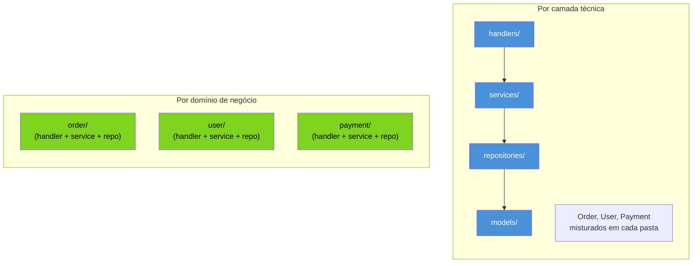

# Organizando um serviço

> [!abstract] TL;DR
> A pergunta errada é "em que camada isso entra — handler, service ou repository?". A pergunta certa é "de que **domínio** isso faz parte — `order`, `payment`, `catalog`?". Go recompensa organizar pacotes por **domínio de negócio** (coesão alta, um pacote muda por um motivo) e pune organizar por **camada técnica** (`handlers/`, `services/`, `models/` — pacotes que só crescem juntos, nunca sozinhos, e viram um emaranhado de imports circulares). Um package em Go não é uma pasta neutra: seu **nome vira prefixo de toda API pública** que ele exporta (`order.Service`, não `services.OrderService`), então nomear mal um pacote é nomear mal a API inteira. E o pacote `utils`/`common`/`helpers` — universal em outras linguagens — é o primeiro sintoma de um domínio que ainda não foi identificado.

## O instinto errado, primeiro

Se você vem de Spring Boot, Express ou Django, seu primeiro instinto ao criar um serviço novo é provavelmente este:

```
myservice/
├── handlers/
│   ├── order_handler.go
│   ├── user_handler.go
│   └── payment_handler.go
├── services/
│   ├── order_service.go
│   ├── user_service.go
│   └── payment_service.go
├── repositories/
│   ├── order_repository.go
│   ├── user_repository.go
│   └── payment_repository.go
└── models/
    ├── order.go
    ├── user.go
    └── payment.go
```

Faz sentido de cara: é o layout MVC que qualquer framework empurra por convenção, e o nome de cada pasta já diz "aqui mora HTTP", "aqui mora regra de negócio", "aqui mora SQL". Mas experimente responder a uma pergunta simples: **quero adicionar `Order`, mexer só nele, sem tocar em `User` nem `Payment`.** Nesse layout, você abre quatro pastas diferentes — `handlers/order_handler.go`, `services/order_service.go`, `repositories/order_repository.go`, `models/order.go` — e cada uma delas import a de baixo. O código de `Order` está espalhado; o código que está *junto* em cada pasta é código de domínios *diferentes* que só têm em comum a camada técnica.

Isso é o oposto de coesão. E em Go, onde o pacote — não a classe, não o arquivo — é a unidade de encapsulamento e de nome público, o preço desse design aparece rápido.

## Coesão: o que muda junto, mora junto

Coesão é uma palavra manjada, mas em Go ela tem um teste bem concreto: **um pacote é coeso quando os motivos para modificá-lo são um só**. Se você mexe em `order.go` porque a regra de desconto mudou, e no mesmo commit precisa tocar `handlers/order_handler.go`, `services/order_service.go` e `repositories/order_repository.go` — quatro arquivos em quatro pacotes diferentes — isso é o sintoma clássico do *shotgun surgery*: uma mudança de negócio, espalhada em munição de pacotes técnicos.

A alternativa é organizar por **domínio**: um pacote `order` que contém tudo que sabe sobre pedidos — o tipo, a regra de negócio, o acesso a dados, o handler HTTP (ou pelo menos a fatia do handler específica de `order`). Rob Pike resumiu essa ideia numa frase que virou referência no ecossistema Go: *"Package by what it provides, not what it contains"* — pense no que o pacote **oferece** para quem o importa, não numa lista solta do que ele guarda por dentro.



Repare que a organização por camada técnica *parece* ter uma vantagem — "todo handler HTTP está num lugar só, fácil de achar". Mas essa vantagem é de **busca** ("onde está o código de handlers?"), não de **mudança** ("o que preciso tocar para adicionar um campo a `Order`?"). Editores modernos resolvem busca com um `Ctrl+P`; nenhum editor resolve, sozinho, o acoplamento estrutural de quatro pacotes que sempre mudam juntos.

## Organizando por domínio, na prática

Reorganizando o mesmo serviço por domínio:

```
myservice/
├── cmd/
│   └── server/
│       └── main.go
└── internal/
    ├── order/
    │   ├── order.go       // tipo Order + regras de negócio
    │   ├── service.go     // orquestração de casos de uso
    │   ├── repository.go  // interface de persistência
    │   └── handler.go     // HTTP handlers específicos de order
    ├── user/
    │   ├── user.go
    │   ├── service.go
    │   ├── repository.go
    │   └── handler.go
    └── payment/
        ├── payment.go
        ├── service.go
        ├── repository.go
        └── handler.go
```

> [!info] `cmd/` e `internal/` já foram cobertos
> A convenção `cmd/<binário>/main.go` + `internal/` como fronteira de visibilidade é assunto da [[01 - Project layout — cmd, internal, pkg|nota 01]] deste galho. Esta nota assume esse esqueleto pronto e foca no que entra *dentro* de `internal/`.

Cada pasta sob `internal/` agora é um pacote Go — `order`, `user`, `payment` — e cada um comporta a fatia inteira de um domínio. Isso não significa "zero separação interna": `order.go`, `service.go`, `repository.go` e `handler.go` continuam existindo como arquivos distintos, para legibilidade. A diferença é que a *fronteira que o compilador enxerga* — o pacote — corta por domínio, não por camada. Arquivos dentro do mesmo pacote podem se referenciar livremente, sem `import`; pacotes diferentes precisam de import explícito, e é aí que Go força você a declarar dependência de verdade.

O ganho fica óbvio quando `Order` muda: você abre uma pasta, `internal/order/`, e o raio de blast da mudança é visível de cara. Quer saber se alterar `Order` afeta `Payment`? Olhe se `payment` importa `order` — se não importar, a resposta é não, garantida pelo compilador, não por convenção de nomenclatura de arquivo.

## Nome de package é parte da API pública

Aqui está o detalhe que quem vem de Java costuma escorregar: em Go, o nome do pacote **não é um detalhe interno** — ele é o prefixo com que todo mundo de fora vai se referir aos símbolos exportados dali. Compare:

```go
// pacote services, arquivo order_service.go
package services

type OrderService struct { /* ... */ }

func NewOrderService() *OrderService { /* ... */ }
```

```go
// pacote order, arquivo service.go
package order

type Service struct { /* ... */ }

func NewService() *Service { /* ... */ }
```

Do lado de quem importa, a diferença aparece na hora de usar:

```go
import "myservice/internal/services"

svc := services.NewOrderService() // "OrderService" — o nome repete o pacote
```

```go
import "myservice/internal/order"

svc := order.NewService() // "order.Service" — sem repetição, lê como prosa
```

`order.Service` já diz tudo que precisa dizer: um `Service` do domínio `order`. `services.OrderService` está pagando duas vezes pela mesma informação — o pacote já é `services`, mas o tipo repete `Order` no nome porque, dentro de um pacote fôrma-neutra como `services`, não dava pra confiar só no nome curto (existem `UserService`, `PaymentService` ali do lado, competindo por clareza). O [Effective Go](https://go.dev/doc/effective_go#package-names) e o guia [Go Code Review Comments](https://go.dev/wiki/CodeReviewComments#package-names) são explícitos sobre isso: nomes de pacote devem ser curtos, em minúsculas, sem underscore, e o *chamador* — não o pacote — é responsável por qualificar com o nome do pacote quando precisar. Prefixar o próprio tipo com o nome do domínio (`order.OrderService`) é redundância que o compilador já resolve para você.

> [!warning] Import cíclico é o teste de fumaça de um corte de domínio errado
> Se `order` precisa importar `payment` e `payment` precisa importar `order`, o compilador recusa — Go não permite ciclos de import, ponto final. Isso costuma ser recebido como um obstáculo técnico chato, mas geralmente é o compilador avisando que o corte de domínio está errado: ou existe um terceiro conceito compartilhado que devia virar seu próprio pacote (ex.: `internal/money` para o tipo `Amount` usado por ambos), ou a comunicação devia passar por uma interface pequena definida no pacote consumidor, não por acoplamento direto entre os dois domínios. [[03 - Dependency injection|A próxima nota]] mostra o padrão que resolve isso — interfaces pequenas, definidas onde são usadas.

## O pacote `utils`: onde a coesão vai morrer

Quase todo projeto acumula, cedo ou tarde, um pacote chamado `utils`, `common`, `helpers` ou `shared`. É o lugar para onde qualquer função que "não sabe bem onde morar" é jogada — um `FormatCurrency`, um `ValidateEmail`, um `RetryWithBackoff`. O problema não é a existência de funções auxiliares — é que `utils` não tem **coesão nenhuma por definição**: seu único critério de agrupamento é "não coube em outro lugar", o que significa que o pacote muda por N motivos diferentes e não-relacionados, um a cada nova função que ninguém quis pensar direito onde encaixar.

Na prática, `utils` também vira um ímã de import: como qualquer pacote pode precisar de "alguma coisinha" de lá, `utils` acaba importado de todo canto — e, por consequência, qualquer mudança em `utils` tem raio de impacto imprevisível no serviço inteiro. É o inverso exato do que a seção anterior buscava: em vez de um domínio isolado com raio de blast visível, você tem um hub central que ninguém consegue prever o efeito de tocar.

A alternativa idiomática, segundo o próprio [Go Wiki de convenções de review](https://go.dev/wiki/CodeReviewComments#package-names), é simples de enunciar e um pouco mais trabalhosa de praticar: **pergunte de que domínio aquela função é, de verdade**. `ValidateEmail` provavelmente pertence a `user` (é lá que emails são validados no contexto de negócio). `FormatCurrency` provavelmente pertence a um pacote `money`, se currency formatting for conceito recorrente o bastante para merecer o próprio tipo. `RetryWithBackoff`, que não pertence a domínio nenhum de negócio — é infraestrutura genérica de verdade —, ganha um nome próprio e específico: `retry`, não `utils`. Um pacote chamado pelo que ele **é** (`retry`, `money`, `pagination`) sempre bate melhor do que um pacote chamado pelo que ele **não é** (`utils` = "não é nada específico").

```go
// Ruim: import genérico, nome que não diz nada sobre o conteúdo
import "myservice/internal/utils"

utils.FormatCurrency(1099)
utils.ValidateEmail(addr)
utils.RetryWithBackoff(fn, 3)
```

```go
// Melhor: cada função mora onde seu domínio (ou sua especialidade) sugere
import (
    "myservice/internal/money"
    "myservice/internal/user"
    "myservice/internal/retry"
)

money.Format(1099)
user.ValidateEmail(addr)
retry.WithBackoff(fn, 3)
```

> [!question]- E se a função é genuinamente genérica — tipo uma função de string que não pertence a domínio nenhum?
> Aí o nome do pacote deve descrever a **especialidade técnica**, não virar um `utils` disfarçado. Uma função de paginação genérica mora em `pagination`; uma de retry mora em `retry`; uma de formatação de datas mora em `dateutil` (nome ainda meio genérico, mas ao menos escopado a datas — é o padrão usado pela própria stdlib em pacotes como `path/filepath`). A régua é: um leitor que só vê o nome do pacote já devia adivinhar, com razoável precisão, o que tem lá dentro. `utils` falha esse teste; `retry` passa.

## Casos práticos

**1. Um domínio completo, pacote único**, do jeito que a seção "na prática" propôs — aqui o conteúdo real de `internal/order/order.go` e `internal/order/service.go`:

```go
// internal/order/order.go
package order

import "time"

type Status string

const (
    StatusPending   Status = "pending"
    StatusConfirmed Status = "confirmed"
    StatusCancelled Status = "cancelled"
)

type Order struct {
    ID        string
    UserID    string
    Total     int64 // centavos
    Status    Status
    CreatedAt time.Time
}

func (o Order) IsCancellable() bool {
    return o.Status == StatusPending
}
```

```go
// internal/order/service.go
package order

import (
    "context"
    "fmt"
)

type Repository interface {
    Save(ctx context.Context, o Order) error
    FindByID(ctx context.Context, id string) (Order, error)
}

type Service struct {
    repo Repository
}

func NewService(repo Repository) *Service {
    return &Service{repo: repo}
}

func (s *Service) Cancel(ctx context.Context, id string) error {
    o, err := s.repo.FindByID(ctx, id)
    if err != nil {
        return fmt.Errorf("buscar pedido: %w", err)
    }
    if !o.IsCancellable() {
        return fmt.Errorf("pedido %s não pode ser cancelado no status %s", id, o.Status)
    }
    o.Status = StatusCancelled
    return s.repo.Save(ctx, o)
}
```

Do lado de fora, o uso lê como prosa — `order.Service`, `order.Repository`, `order.NewService(repo)` — sem nenhum tipo repetindo o nome do domínio no próprio nome.

**2. `main.go` amarrando os domínios**, mostrando que um pacote raiz não precisa (e não deveria) saber os detalhes internos de cada domínio, só a fachada pública de cada um:

```go
// cmd/server/main.go
package main

import (
    "log"
    "net/http"

    "myservice/internal/order"
    "myservice/internal/payment"
    "myservice/internal/user"
)

func main() {
    orderSvc := order.NewService(order.NewPostgresRepository())
    userSvc := user.NewService(user.NewPostgresRepository())
    paymentSvc := payment.NewService(payment.NewStripeGateway())

    mux := http.NewServeMux()
    order.RegisterRoutes(mux, orderSvc)
    user.RegisterRoutes(mux, userSvc)
    payment.RegisterRoutes(mux, paymentSvc)

    log.Fatal(http.ListenAndServe(":8080", mux))
}
```

> [!info] `http.NewServeMux` com roteamento por método e padrão — Go 1.22+
> Desde a versão 1.22, `http.ServeMux` aceita padrões com método HTTP e wildcards (`mux.HandleFunc("POST /orders/{id}/cancel", handler)`), o que elimina boa parte da necessidade de um router de terceiros para casos simples. Cada domínio pode registrar suas próprias rotas via uma função `RegisterRoutes(mux *http.ServeMux, svc *Service)` exportada, mantendo o `main.go` como puro cabo de ligação — ele nunca sabe o *caminho* das rotas de `order`, só que `order` sabe se registrar sozinho.

**3. Detectando um corte errado pelo import cíclico** — imagine que `payment.Service` precisa emitir eventos que `order` também precisa consumir. A tentação inicial:

```go
// internal/payment/service.go
package payment

import "myservice/internal/order" // payment → order

func (s *Service) Confirm(orderID string) error {
    o, _ := order.Lookup(orderID) // ...
    // ...
}
```

Se `order` também precisar de algo de `payment` (comum — "mostrar status do pagamento no pedido"), o compilador recusa o ciclo. A correção idiomática é extrair a dependência compartilhada para uma interface pequena, definida no pacote que a **usa**:

```go
// internal/payment/service.go
package payment

// OrderLookup é só o que payment precisa saber sobre order —
// definida aqui, não em order, para evitar o import de volta.
type OrderLookup interface {
    Total(orderID string) (int64, error)
}

type Service struct {
    orders OrderLookup
}
```

`order.Service` satisfaz `payment.OrderLookup` implicitamente, sem que `payment` precise importar `order` — só o `main.go` (que já importa os dois) precisa saber que um implementa o outro, na hora de ligar os fios. Esse padrão — interface pequena, definida no consumidor — é o assunto central da [[03 - Dependency injection|próxima nota]].

## Armadilhas comuns

> [!warning] "Vou organizar por domínio, mas manter um `models/` central para todos os structs"
> É a meia-medida mais comum — e ela reintroduz o mesmo problema pela porta dos fundos. Se `Order`, `User` e `Payment` moram todos em `models/`, qualquer domínio que precisa do tipo de outro já está acoplado a um pacote compartilhado gigante, e uma mudança em `models/user.go` volta a ter raio de impacto imprevisível. O tipo `Order` deve morar dentro do pacote `order`, junto com o comportamento que opera sobre ele — não separado num `models/` genérico.

> [!warning] Domínio bem cortado não é sinônimo de pasta plana única
> Um domínio grande o suficiente (ex.: `order` num e-commerce complexo) pode legitimamente crescer sub-pacotes próprios (`order/pricing`, `order/fulfillment`) — o critério continua sendo coesão, não "nunca ter sub-pastas". O erro não é ter estrutura interna; é deixar a estrutura de **topo** ser definida por camada técnica em vez de domínio.

> [!warning] Nome de pacote não deve vazar o tipo de conteúdo (`orderpkg`, `ordertypes`, `impl`)
> É tentador, ao evitar colisão de nome entre um pacote `order` e uma variável ou parâmetro chamado `order`, sufixar o pacote com algo como `orderpkg`. O Go Wiki desaconselha isso: prefira renomear a variável local (`ord`, `o`) a poluir o nome do pacote. O nome do pacote é parte pública e permanente da API; o nome da variável é local e descartável.

## Lente cross-stack

| Vindo de | Convenção usual | Em Go |
|---|---|---|
| Java (Spring) | pacotes por camada (`com.acme.controller`, `com.acme.service`, `com.acme.repository`) — reforçado pela convenção do próprio Spring MVC | pacote por domínio de negócio; a "camada" vira arquivo dentro do pacote, não pacote separado |
| Python (Django) | apps por feature (já parecido!) mas `utils.py`/`helpers.py` por app é comum e tolerado | mesmo instinto de app-por-feature funciona bem; `utils` continua sendo cheiro, não recurso |
| Node/Express | pastas `routes/`, `controllers/`, `models/` por convenção de framework | mesmo problema do Java — camada técnica no topo em vez de domínio |
| C# (.NET) | namespaces por camada (`Acme.Services`, `Acme.Repositories`) espelhando pastas | pacote por domínio; namespace-por-camada do C# tem o mesmo cheiro de import circular quando a base cresce |

O padrão "por domínio, não por camada" não é exclusividade de Go — é o mesmo argumento por trás de *screaming architecture* e de bounded contexts em DDD. A diferença é que em Go o **compilador aplica a fronteira**: import cíclico entre pacotes não compila, então um corte errado dói cedo, no build, em vez de doer tarde, num diagrama de arquitetura que ninguém mais lê.

## Como explicar em inglês

> In Go, package layout is a design decision with real consequences, not a cosmetic folder structure. Organizing by technical layer (`handlers/`, `services/`, `repositories/`) scatters every business concept — `Order`, `User`, `Payment` — across four packages that always change together, which is the opposite of cohesion. Organizing by business domain instead — a single `order` package holding the type, the business rules, the repository interface, and the HTTP handler — keeps changes localized and makes the blast radius of any edit visible from the folder alone. This matters more in Go than in most languages because a package name is part of the public API: callers write `order.Service`, not `services.OrderService`, so a well-named package eliminates redundant prefixing in every exported type. A `utils`/`common` package is usually a sign that a function's real domain was never identified — pick a name that says what the package *is* (`retry`, `money`, `pagination`), not what it *isn't*. And when two domain packages need each other, Go's compiler refuses the import cycle outright, forcing you to extract a small interface at the consumer rather than papering over tight coupling.

| Termo PT | Termo EN |
|---|---|
| pacote por domínio | package by domain |
| pacote por camada | package by layer |
| coesão | cohesion |
| raio de impacto / raio de blast | blast radius |
| import cíclico | import cycle |
| pacote fachada / hub | god package / hub package |
| nome do pacote como API | package name as API |
| interface pequena no consumidor | consumer-defined interface |

## O que vem a seguir

Cortar pacotes por domínio resolve coesão, mas levanta uma pergunta imediata: como `order.Service` recebe seu `Repository` sem `order` precisar saber se é Postgres, um mock em memória, ou outra coisa qualquer? Esta nota já usou o padrão de passagem por construtor (`NewService(repo Repository)`) sem nomeá-lo — a [[03 - Dependency injection|próxima nota]] entra nesse mecanismo a fundo: por que Go prefere injeção manual via construtor a um container de DI, como interfaces pequenas definidas no pacote consumidor resolvem o caso do import cíclico visto aqui, e onde a linha entre "simples o bastante" e "precisa de um wire" realmente fica.

## Veja também

- [[01 - Project layout — cmd, internal, pkg|01 — Project layout — cmd, internal, pkg]] — o esqueleto `cmd/`/`internal/` que esta nota assume como ponto de partida
- [[03 - Dependency injection|03 — Dependency injection]] — como ligar os domínios sem acoplamento direto, incluindo a solução completa do import cíclico introduzido aqui
- [[04 - Configuração|04 — Configuração]] — onde a configuração de cada domínio (strings de conexão, chaves de API) entra nesse layout
- [[05 - Arquitetura hexagonal e clean em Go|05 — Arquitetura hexagonal e clean em Go]] — formaliza o padrão "interface no consumidor" visto aqui num framework arquitetural completo
- [[03-Dominios/Tecnologia/Go/index|Trilha Go]]

## Fontes

- The Go Authors. *Effective Go — Package names*. go.dev. https://go.dev/doc/effective_go#package-names (acessado em 2026-07-18)
- The Go Authors. *Go Code Review Comments — Package Names*. go.dev/wiki. https://go.dev/wiki/CodeReviewComments#package-names (acessado em 2026-07-18)
- The Go Authors. *Organizing a Go module*. go.dev/doc. https://go.dev/doc/modules/layout (acessado em 2026-07-18)
- The Go Blog. *Package names*. go.dev/blog. https://go.dev/blog/package-names (acessado em 2026-07-18)
- Go by Example. *HTTP Servers*. gobyexample.com. https://gobyexample.com/http-servers (acessado em 2026-07-18)
