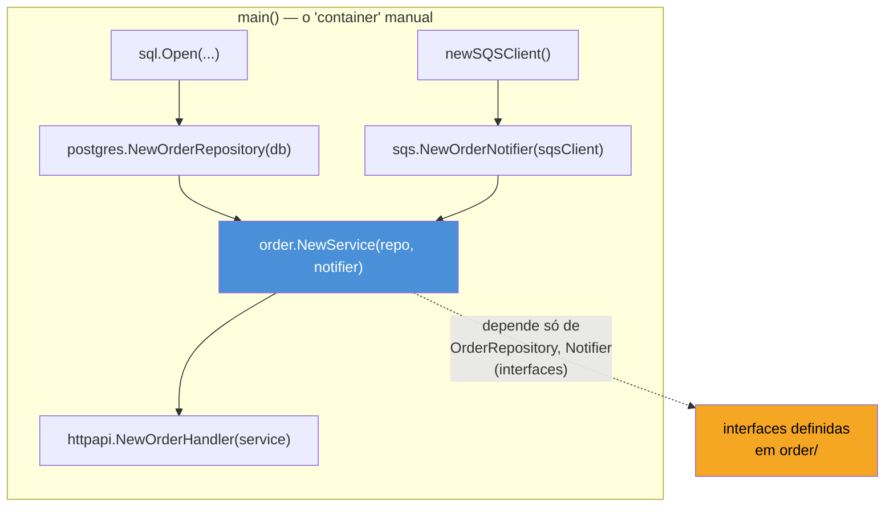
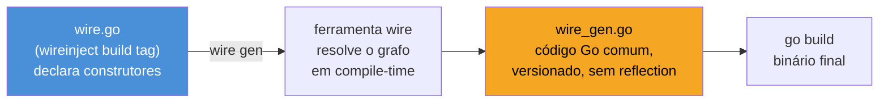

# Dependency injection

> [!abstract] TL;DR
> Em Go, **dependency injection é, na maioria dos serviços, apenas passar interfaces pelo construtor** — `func NewOrderService(repo OrderRepository, notifier Notifier) *OrderService`. Não existe (e a comunidade não sente falta de) um container de DI mágico com anotações e resolução em runtime, como Spring ou NestJS. `main()` monta o grafo de dependências à mão, em ordem topológica explícita, e cada camada recebe interfaces pequenas, definidas do lado de quem consome. Quando esse `main()` cresce demais em serviços grandes, [Wire](https://github.com/google/wire) automatiza a fiação por **geração de código em tempo de compilação** — sem reflection, sem runtime, sem "container" nenhum: ele lê funções construtoras e gera um `main()` equivalente ao que você escreveria manualmente. A resistência de Go a containers de DI não é falta de sofisticação — é escolha deliberada: explicit is better than magic.

## O problema: quem cria o quê, e em que ordem?

Imagine um serviço de pedidos com três camadas: um handler HTTP, um `OrderService` com a regra de negócio, e um `OrderRepository` que fala com o banco. O handler precisa do service; o service precisa do repository; o repository precisa de uma conexão de banco. Em algum lugar, alguém precisa montar essa cadeia:

```go
db := sql.Open(...)
repo := NewPostgresOrderRepo(db)
service := NewOrderService(repo)
handler := NewOrderHandler(service)
```

Trivial, para três peças. Mas em um serviço real, o grafo cresce: o `OrderService` também precisa de um `PaymentClient`, de um `Notifier`, de um `Logger`, de um `MetricsCollector` — e cada um desses tem as próprias dependências. Quem monta esse grafo? Em que ordem? E como testar `OrderService` sem precisar de um banco Postgres de verdade rodando?

Quem vem de Spring está acostumado a delegar essa pergunta para o framework: anota a classe com `@Service`, marca o construtor com `@Autowired` (ou usa injeção por construtor implícita), e o container resolve o grafo inteiro em runtime, via reflection, escaneando o classpath. Em NestJS, a história é parecida — decoradores (`@Injectable()`, `@Inject()`) mais um container que resolve tudo na inicialização.

Go não tem esse framework central — e a resposta idiomática cabe em uma frase: **você mesmo monta o grafo, em `main()`, passando valores concretos como argumentos de função**. Isso não é uma limitação da linguagem; é o padrão que a comunidade convergiu depois de tentar (e largar) várias tentativas de containers de DI ao estilo Java. A seção sobre containers, mais adiante, explica por quê.

## Mecanismo: construtor recebendo interface

A peça central é sempre a mesma: o `OrderService` não conhece a implementação concreta do repositório — só conhece uma **interface pequena**, definida do lado de quem consome (o padrão "accept interfaces, return structs" que a nota 01 deste galho já usou para `internal/`):

```go
package order

// OrderRepository é definida aqui, no pacote que a CONSOME —
// não no pacote que implementa (postgres, mongo, etc.).
type OrderRepository interface {
    Save(ctx context.Context, o Order) error
    FindByID(ctx context.Context, id string) (Order, error)
}

type Notifier interface {
    NotifyOrderCreated(ctx context.Context, o Order) error
}

type Service struct {
    repo     OrderRepository
    notifier Notifier
}

// NewService é o "ponto de injeção": quem chama decide QUAL
// implementação concreta entra em cada campo.
func NewService(repo OrderRepository, notifier Notifier) *Service {
    return &Service{repo: repo, notifier: notifier}
}

func (s *Service) Create(ctx context.Context, o Order) error {
    if err := s.repo.Save(ctx, o); err != nil {
        return fmt.Errorf("saving order: %w", err)
    }
    return s.notifier.NotifyOrderCreated(ctx, o)
}
```

`Service` nunca importa `postgres`, `sqs` ou qualquer pacote de infraestrutura concreta — só as interfaces `OrderRepository` e `Notifier`, que ele mesmo declara. Isso é injeção de dependência no sentido pleno do termo (inversão de controle: quem decide a implementação é quem monta o grafo, não quem usa a dependência) — só que sem nenhum framework por trás. O "container" é o próprio `main()`:

```go
func main() {
    db := mustOpenDB(os.Getenv("DATABASE_URL"))
    sqsClient := mustNewSQSClient()

    repo := postgres.NewOrderRepository(db)
    notifier := sqs.NewOrderNotifier(sqsClient)
    service := order.NewService(repo, notifier)
    handler := httpapi.NewOrderHandler(service)

    http.ListenAndServe(":8080", handler)
}
```



Repare no que esse diagrama revela: as setas de construção (`main()` chamando `New*`) apontam numa direção; a dependência de tipo (`Service` dependendo de `OrderRepository`) aponta para uma interface local, não para `postgres`. É exatamente a **inversão de dependência** — o pacote de alto nível (`order`) não depende do pacote de baixo nível (`postgres`); os dois dependem de uma abstração que `order` possui. `main()` é o único lugar do programa que conhece ambos os lados concretos e faz a ponte.

Para testar `Service`, não é preciso banco nenhum — só uma implementação fake da interface, no próprio pacote de teste:

```go
type fakeRepo struct {
    saved []Order
}

func (f *fakeRepo) Save(ctx context.Context, o Order) error {
    f.saved = append(f.saved, o)
    return nil
}

func (f *fakeRepo) FindByID(ctx context.Context, id string) (Order, error) {
    for _, o := range f.saved {
        if o.ID == id {
            return o, nil
        }
    }
    return Order{}, errors.New("not found")
}

func TestService_Create(t *testing.T) {
    repo := &fakeRepo{}
    notifier := &fakeNotifier{}
    svc := NewService(repo, notifier)

    err := svc.Create(context.Background(), Order{ID: "1"})

    if err != nil {
        t.Fatalf("Create() error = %v", err)
    }
    if len(repo.saved) != 1 {
        t.Errorf("expected 1 saved order, got %d", len(repo.saved))
    }
}
```

Esse teste não importa `testify/mock`, não configura um container de teste, não usa reflection nenhuma — é um struct comum implementando uma interface comum. A "injeção" inteira é passar `repo` e `notifier` como argumentos de `NewService`.

## Quando o grafo cresce: Wire

DI manual funciona bem enquanto `main()` monta um punhado de dependências. Mas em um serviço com quinze construtores, cada um dependendo de três ou quatro outros, o `main()` vira uma parede de código repetitivo — e fácil de errar (esquecer de passar um argumento, passar na ordem errada, um erro que só o compilador pega depois de muita rolagem de tela).

[Wire](https://github.com/google/wire), mantido pelo próprio time do Google, resolve isso sem introduzir runtime nenhum: você escreve um arquivo `wire.go` descrevendo **quais construtores existem** (um `wire.NewSet` agrupando as funções `New*`), e a ferramenta `wire` gera, em tempo de build, um arquivo `wire_gen.go` com o `main()` equivalente ao que você escreveria à mão — só que gerado, revisável, e sem reflection.

```go
//go:build wireinject
// +build wireinject

package main

import "github.com/google/wire"

func InitializeApp(dbURL string) (*App, error) {
    wire.Build(
        newDB,
        postgres.NewOrderRepository,
        sqs.NewOrderNotifier,
        order.NewService,
        httpapi.NewOrderHandler,
        NewApp,
    )
    return nil, nil // nunca executado — wire só lê a assinatura
}
```

> [!info] Wire é geração de código, não runtime
> Rodar `wire` (ou `go generate` com a diretiva apontando para ele) produz um arquivo `.go` de verdade, versionado no repositório, que qualquer dev pode ler e depurar como código comum — dá para colocar breakpoint dentro dele. Não há reflection acontecendo quando o programa roda: o binário final chama as funções construtoras diretamente, na ordem que o `wire` calculou olhando os tipos de entrada e saída de cada uma. É a antítese de Spring: a "mágica" acontece uma vez, em build-time, e o resultado é código explícito.

O arquivo gerado (`wire_gen.go`) se parece exatamente com o `main()` manual de antes — só que escrito pela ferramenta:

```go
// Code generated by Wire. DO NOT EDIT.

func InitializeApp(dbURL string) (*App, error) {
    db, err := newDB(dbURL)
    if err != nil {
        return nil, err
    }
    repo := postgres.NewOrderRepository(db)
    notifier := sqs.NewOrderNotifier()
    service := order.NewService(repo, notifier)
    handler := httpapi.NewOrderHandler(service)
    return NewApp(handler), nil
}
```



A vantagem sobre DI manual pura não é poder fazer algo novo — é **eliminar o trabalho mecânico** de encadear dezenas de construtores à mão, mantendo os mesmos erros de tipo detectáveis em tempo de compilação (se `NewService` mudar de assinatura, `wire gen` falha imediatamente, com uma mensagem apontando exatamente qual dependência falta). Vale a pena introduzir Wire quando o `main()` manual passa de umas 30-40 linhas de fiação repetitiva — não antes. Para serviços pequenos e médios, DI manual continua sendo o padrão mais lido pela comunidade: menos uma dependência de build, menos um arquivo `wireinject` para os novatos entenderem.

## Por que Go evita containers de DI em runtime

A pergunta que sobra é por que Go nunca desenvolveu (nem adotou em peso) um equivalente direto ao Spring Container ou ao NestJS `@Injectable`: um sistema que escaneia o código em runtime, descobre dependências via reflection e anotações, e resolve o grafo automaticamente sem que ninguém escreva `main()` nenhum.

Existem bibliotecas desse estilo em Go — [`uber-go/dig`](https://github.com/uber-go/dig) é a mais conhecida, resolvendo o grafo via reflection em runtime, parecido com um container Spring. Mas ela é minoritária, e o padrão dominante segue sendo DI manual (com ou sem Wire). Algumas razões concretas, não só preferência estética:

- **Erros em runtime vs. em compile-time.** Um container que resolve dependências via reflection só descobre um construtor faltando, um tipo incompatível ou uma dependência circular quando o programa *roda* — geralmente na inicialização, na pior das hipóteses só sob uma condição específica de produção. DI manual (com ou sem Wire) transforma esses erros em **erros de compilação**: se `NewService` espera um `OrderRepository` e você passa algo que não implementa a interface, o `go build` falha ali, com uma mensagem específica, antes de qualquer deploy.
- **"Ir para a definição" continua funcionando.** Em `main()`, `Ctrl+clique` (ou `gd` no editor) em `NewService(repo, notifier)` leva direto para a implementação de `NewService`. Num container de DI com resolução por reflection e string de nome de bean, essa navegação se perde — o IDE não sabe qual implementação concreta será injetada até o programa rodar. Go prioriza *explicit is better than implicit* (eco do [Zen do Python](https://peps.python.org/pep-0020/), mas com Go levando a sério de um jeito que Python muitas vezes não leva) — e um `main()` legível de cima a baixo é, para a comunidade, mais valioso que a economia de digitação de um container automático.
- **Reflection tem custo e reduz a superfície de segurança de tipos.** `reflect` em Go é deliberadamente verboso e lento comparado a código estático — não é acidente, é o design da linguagem sinalizando "use isso como último recurso". Um container de DI baseado em reflection paga esse custo na inicialização (geralmente aceitável) mas também abre mão de boa parte da verificação estática que o compilador Go oferece de graça em qualquer outro código.
- **A cultura de Go valoriza programas pequenos, sem framework central.** Diferente do ecossistema Java, onde Spring virou quase sinônimo de "aplicação empresarial", a comunidade Go historicamente resiste a frameworks que tomam conta do `main()` do programa (o mesmo instinto que explica por que `net/http` continua sendo suficiente para boa parte dos serviços, sem um Express/NestJS equivalente dominante). Um container de DI é, por definição, esse tipo de framework — e boa parte da comunidade prefere pagar um pouco mais de verbosidade manual em troca de nunca precisar entender "o que o container está fazendo por baixo".

Isso não significa que containers de DI sejam proibidos ou ruins — `dig` tem uso legítimo em bases muito grandes, com times acostumados ao padrão vindo de outras linguagens. Mas a expectativa por padrão, ao ler um código-fonte Go novo, é: **se você não vê um container em `go.mod`, é porque a DI está em `main()`, à mão** — e essa é a leitura correta na maioria esmagadora dos serviços Go em produção.

## Casos práticos

**1. DI manual com múltiplas dependências**, incluindo um `Logger` e uma configuração:

```go
type Service struct {
    repo     OrderRepository
    notifier Notifier
    logger   *slog.Logger
}

func NewService(repo OrderRepository, notifier Notifier, logger *slog.Logger) *Service {
    return &Service{repo: repo, notifier: notifier, logger: logger}
}

func main() {
    logger := slog.New(slog.NewJSONHandler(os.Stdout, nil))

    db := mustOpenDB(os.Getenv("DATABASE_URL"))
    repo := postgres.NewOrderRepository(db)
    notifier := sqs.NewOrderNotifier(mustNewSQSClient())

    service := NewService(repo, notifier, logger)

    logger.Info("service initialized")
    // ... registra handlers, sobe o servidor
}
```

> [!info] `log/slog` (Go 1.21+)
> `slog.Logger` é a biblioteca de logging estruturado da standard library desde a 1.21 — antes disso, DI de logger em Go geralmente injetava uma interface própria ou uma dependência externa como `zap`/`zerolog`. Hoje, `*slog.Logger` é frequentemente injetado diretamente, sem interface intermediária, porque já É uma abstração (métodos como `Info`, `With`, `Handler`) mantida pela própria linguagem.

**2. Interface pequena definida no consumidor**, não no pacote que implementa — o detalhe que faz DI em Go funcionar sem acoplamento:

```go
// Em package order (o consumidor):
type Clock interface {
    Now() time.Time
}

// Implementação real, em produção:
type realClock struct{}

func (realClock) Now() time.Time { return time.Now() }

// Implementação fake, em teste — sem depender de time.Now() real:
type fixedClock struct{ t time.Time }

func (f fixedClock) Now() time.Time { return f.t }

func NewService(repo OrderRepository, clock Clock) *Service {
    return &Service{repo: repo, clock: clock}
}
```

Injetar até um `Clock` — algo que em outras linguagens raramente vira dependência explícita — é comum em Go porque torna testes de lógica sensível a tempo (expiração, agendamento, TTL) totalmente determinísticos, sem `sleep` nem mocking de biblioteca de tempo.

**3. Composição de múltiplos serviços no `main()`**, mostrando a ordem topológica explícita para um caso com mais de uma camada:

```go
func main() {
    cfg := mustLoadConfig()

    db := mustOpenDB(cfg.DatabaseURL)
    cache := redis.NewClient(cfg.RedisAddr)

    userRepo := postgres.NewUserRepository(db)
    orderRepo := postgres.NewOrderRepository(db)

    userSvc := user.NewService(userRepo, cache)
    orderSvc := order.NewService(orderRepo, sqs.NewOrderNotifier(cfg.QueueURL))

    api := httpapi.NewRouter(userSvc, orderSvc)

    log.Fatal(http.ListenAndServe(cfg.Addr, api))
}
```

Cada linha lê de cima para baixo como uma receita: primeiro a infraestrutura (`db`, `cache`), depois os repositórios que dependem dela, depois os serviços que dependem dos repositórios, por fim o router que amarra tudo. Não há mágica escondida — é exatamente a ordem em que as coisas precisam existir para compilar.

## Armadilhas comuns

> [!warning] Interface grande demais mata o propósito da DI
> Definir `type Repository interface { ... 15 métodos ... }` no consumidor recria o mesmo acoplamento que a DI deveria evitar: qualquer fake de teste precisa implementar os 15 métodos, mesmo que o teste use só dois. A prática idiomática — reforçada no [Go Proverb](https://go-proverbs.github.io/) "the bigger the interface, the weaker the abstraction" — é manter interfaces pequenas, às vezes com um único método, e compor várias interfaces pequenas quando necessário, em vez de uma interface grande "genérica".

> [!warning] Injetar `*sql.DB` direto no service, sem interface, acopla a camada de negócio ao banco
> Passar `*sql.DB` (ou `*gorm.DB`) diretamente para `OrderService`, pulando a interface `OrderRepository`, parece economizar uma camada — mas amarra a regra de negócio à implementação SQL específica, e torna teste unitário do service impossível sem banco real (ou um mock pesado de driver SQL). O padrão repository — interface no consumidor, implementação concreta em outro pacote — existe justamente para evitar esse acoplamento.

> [!warning] Wire não substitui entender o grafo — só automatiza a fiação
> É tentador tratar `wire.Build(...)` como uma caixa preta que "resolve tudo". Mas se duas dependências no set produzem o mesmo tipo (por exemplo, dois `*sql.DB` diferentes para bancos distintos), `wire gen` falha com um erro de ambiguidade que só faz sentido para quem já entende o grafo manualmente. Wire poupa digitação, não poupa o raciocínio sobre quem depende de quem.

> [!warning] Sem lifecycle hooks automáticos — feche recursos você mesmo
> Containers de DI em outras linguagens costumam gerenciar o ciclo de vida de dependências (`@PreDestroy` em Spring, por exemplo) — fechar conexões automaticamente no shutdown. Nem DI manual nem Wire fazem isso por padrão: fechar um `*sql.DB` ou um client de mensageria continua sendo responsabilidade explícita de `main()`, tipicamente via `defer db.Close()` ou um shutdown coordenado — assunto que volta com mais peso quando o galho tratar de graceful shutdown em produção.

## Lente cross-stack

| Vindo de... | Em Go é assim |
|---|---|
| Java/Spring (`@Autowired`, container IoC) | Sem container. `main()` monta o grafo chamando construtores diretamente; Wire automatiza a fiação em compile-time, sem reflection |
| Node/NestJS (`@Injectable()`, decoradores) | Sem decorador nem metadata reflection. A "injeção" é passar argumento de função — o TypeScript `constructor(private repo: Repo)` vira `func NewService(repo Repo) *Service` |
| Python (Flask-Injector, `dependency-injector`) | Mesma filosofia manual; bibliotecas de container existem mas são minoritárias, assim como `dig` em Go |
| C# (.NET `IServiceCollection`, DI nativa do ASP.NET) | .NET tem DI embutida no framework web; Go não tem framework web "oficial" nesse sentido — `net/http` não resolve dependência nenhuma, então a montagem manual em `main()` é o próprio "container" |

## Como explicar em inglês

> In Go, dependency injection almost always means **constructor injection with interfaces** — `func NewOrderService(repo OrderRepository, notifier Notifier) *OrderService` — with no framework resolving the graph at runtime. `main()` is the composition root: it builds every concrete dependency and wires them together explicitly, in topological order, so a missing or mistyped dependency is a compile error, not a runtime surprise. When that wiring grows large, [Wire](https://github.com/google/wire) generates the equivalent `main()` at build time by reading constructor signatures — no reflection, no container, just ordinary generated Go code you can read and debug. Go deliberately avoids Spring-style or NestJS-style DI containers: reflection-based resolution trades away compile-time type safety and "jump to definition" navigability, and the language's culture favors explicit composition over framework magic.

| Termo PT | Termo EN |
|---|---|
| injeção de dependência | dependency injection |
| construtor | constructor |
| interface pequena | small interface |
| raiz de composição | composition root |
| inversão de dependência | dependency inversion |
| geração de código | code generation |
| grafo de dependências | dependency graph |
| container de DI | DI container |

## O que vem a seguir

DI manual resolve *como* montar o grafo de dependências — mas boa parte desse grafo depende de valores que mudam por ambiente: URL do banco, endereço da fila, timeouts, feature flags. A [[04 - Configuração|próxima nota]] trata exatamente disso: como carregar configuração de forma idiomática em Go (variáveis de ambiente, arquivos, flags), sem reinventar um Spring `application.yml` nem depender de um container de configuração mágico — o mesmo espírito de explicitação que guiou esta nota.

## Veja também

- [[01 - Project layout — cmd, internal, pkg|01 — Project layout — cmd, internal, pkg]] — onde vive `main()`, a raiz de composição deste galho
- [[02 - Organizando um serviço|02 — Organizando um serviço]] — como as camadas que a DI conecta (handler, service, repository) se organizam em pacotes
- [[04 - Configuração|04 — Configuração]] — próxima nota: de onde vêm os valores concretos que `main()` passa para os construtores
- [[05 - Arquitetura hexagonal e clean em Go|05 — Arquitetura hexagonal e clean em Go]] — leva "interface no consumidor" ao extremo arquitetural (ports and adapters)
- [[03-Dominios/Tecnologia/Go/index|Trilha Go]]

## Fontes

- Google. *Wire — Automated Initialization in Go*. GitHub. https://github.com/google/wire (acessado em 2026-07-18)
- Google. *Wire User Guide*. GitHub. https://github.com/google/wire/blob/main/docs/guide.md (acessado em 2026-07-18)
- The Go Authors. *Effective Go — Interfaces*. go.dev. https://go.dev/doc/effective_go#interfaces (acessado em 2026-07-18)
- Uber. *dig — A reflection based dependency injection toolkit for Go*. GitHub. https://github.com/uber-go/dig (acessado em 2026-07-18)
- Rob Pike. *Go Proverbs*. go-proverbs.github.io. https://go-proverbs.github.io/ (acessado em 2026-07-18)
- The Go Authors. *log/slog package documentation*. pkg.go.dev. https://pkg.go.dev/log/slog (acessado em 2026-07-18)
