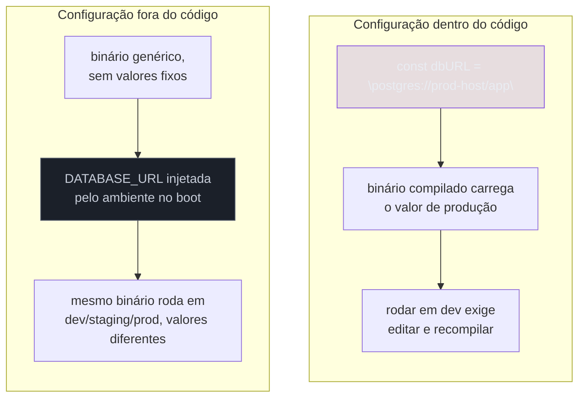
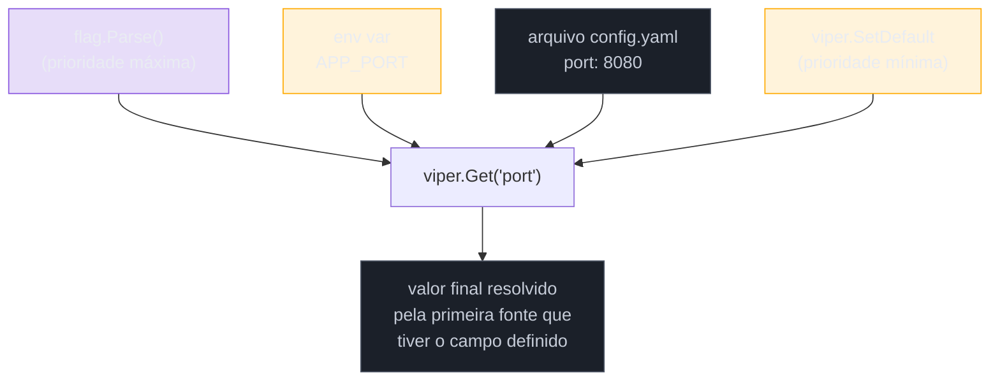
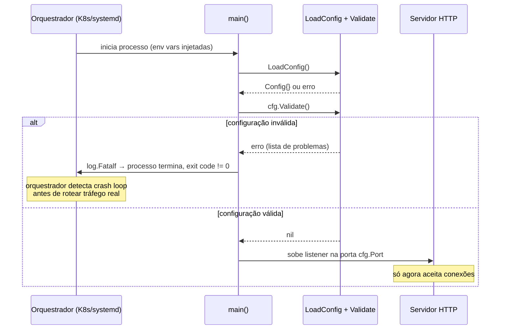

# Configuração

> [!abstract] TL;DR
> Configuração é qualquer valor que muda entre ambientes sem o código mudar — URL do banco, porta HTTP, chave de API, feature flag. A [metodologia 12-factor](https://12factor.net/config) manda guardar isso em **variáveis de ambiente**, nunca em constantes hardcoded no binário. Go lê env vars com `os.Getenv`, flags de linha de comando com o pacote `flag`, e arquivos (`.yaml`, `.toml`, `.env`) com bibliotecas como [Viper](https://pkg.go.dev/github.com/spf13/viper) — que também resolve a **precedência** entre as três fontes (flag > env var > arquivo > default) numa API só. A regra de ouro é **validar tudo no boot**: um `Config` que falha em `main()` por falta de `DATABASE_URL` é infinitamente melhor que um serviço que sobe, aceita tráfego, e só explode na primeira query. E segredos — senha de banco, chave privada, token de API — **nunca vão no código nem no arquivo de config versionado**; ficam fora do repositório, injetados em runtime (teaser do Galho 19, Segurança).

## O incidente que toda equipe já viveu

Sexta-feira, 17h. Alguém sobe uma versão nova do serviço para produção. Funcionou perfeitamente em dev, nos testes, no staging. Em produção, cai na primeira requisição:

```
panic: runtime error: invalid memory address or nil pointer dereference
```

Investigação de 40 minutos depois: o código tinha `dbURL := "postgres://localhost:5432/app"` — um valor hardcoded que funcionava no laptop do dev, mas que produção não usa (produção tem seu próprio banco, em outro host, com outra senha). Alguém tinha "esquecido" de trocar a string antes do deploy. Ou pior: trocou, mas só no arquivo `config.go` de um dos três serviços que precisavam da mudança.

Esse é o sintoma clássico de tratar configuração como **parte do código** em vez de tratá-la como **entrada externa** ao código. A pergunta que este capítulo responde não é "como ler uma env var em Go" — isso é uma linha (`os.Getenv("PORT")`). A pergunta é: onde a configuração deve morar, como ela chega ao processo, e como garantir que o processo nunca rode com configuração incompleta ou errada.

## O princípio: config é ambiente, não código

O [manifesto 12-factor](https://12factor.net/config), escrito pela equipe da Heroku a partir de observar centenas de apps rodando em produção, cravou uma regra que hoje é consenso em toda a indústria de backend — não é peculiaridade de Go:

> Config varia substancialmente entre deploys (staging, produção, ambientes de dev de cada desenvolvedor). [...] Uma métrica litmus test para saber se um app tem toda a config corretamente fatorada para fora do código: o codebase poderia ser open-sourced a qualquer momento, sem comprometer nenhuma credencial.

Em outras palavras: se alguém rodar `grep -r "postgres://" .` no seu repositório e encontrar uma string de conexão real, a configuração está no lugar errado. O código deve ser **idêntico** entre dev, staging e produção — só a configuração muda, e ela muda **de fora**, sem recompilar nem editar arquivo versionado.



Três fontes cobrem praticamente todo caso prático em Go: **variáveis de ambiente** (a fonte primária, segundo 12-factor), **flags de linha de comando** (bons para overrides pontuais, ex.: `--port=9000` num teste local) e **arquivos** (`.yaml`/`.toml`, úteis para configuração estrutural extensa que não faz sentido como dezenas de env vars soltas). A seção seguinte percorre as três, na ordem em que a biblioteca padrão as oferece — antes de chegar em Viper, que unifica tudo.

## Env vars com a biblioteca padrão

`os.Getenv` é a forma mais crua de ler configuração — sem dependência externa, disponível desde sempre:

```go
package main

import (
    "fmt"
    "os"
)

func main() {
    port := os.Getenv("PORT")
    if port == "" {
        port = "8080" // default
    }
    fmt.Println("servindo na porta", port)
}
```

O problema já aparece nessa versão de quatro linhas: `os.Getenv` retorna string vazia tanto quando a variável não existe quanto quando ela existe e foi setada como vazia — não há como distinguir os dois casos. Para isso, a biblioteca padrão oferece `os.LookupEnv`, que devolve um segundo valor booleano:

```go
port, ok := os.LookupEnv("PORT")
if !ok {
    port = "8080"
}
```

Para tipos que não são string — porta como `int`, timeout como `time.Duration`, feature flag como `bool` — a conversão fica por sua conta, com `strconv`:

```go
timeoutStr := os.Getenv("HTTP_TIMEOUT_SECONDS")
timeout := 30 // default em segundos
if timeoutStr != "" {
    parsed, err := strconv.Atoi(timeoutStr)
    if err != nil {
        log.Fatalf("HTTP_TIMEOUT_SECONDS inválido: %q: %v", timeoutStr, err)
    }
    timeout = parsed
}
```

Isso funciona, mas escala mal: um serviço real facilmente tem 15-30 variáveis de configuração, e repetir esse padrão `Getenv` + `if vazio` + `strconv` + `if err` para cada uma produz um `main.go` de centenas de linhas só de boilerplate de parsing. É exatamente o problema que Viper resolve — mas antes de chegar lá, vale ver a segunda fonte: flags.

## Flags de linha de comando

O pacote `flag` da biblioteca padrão declara e faz o parsing de argumentos de linha de comando:

```go
package main

import (
    "flag"
    "fmt"
)

func main() {
    port := flag.Int("port", 8080, "porta HTTP do servidor")
    dbURL := flag.String("db-url", "", "URL de conexão com o banco")
    verbose := flag.Bool("verbose", false, "ativa logs detalhados")

    flag.Parse()

    fmt.Printf("porta=%d db-url=%q verbose=%v\n", *port, *dbURL, *verbose)
}
```

`flag.Int`, `flag.String` e `flag.Bool` retornam **ponteiros** — o valor só é preenchido depois que `flag.Parse()` roda, lendo `os.Args`. Executar `go run main.go --port=9000 --verbose` sobrescreve os defaults declarados no código.

Flags são ótimas para overrides pontuais e ferramentas de linha de comando (CLIs), mas têm uma limitação séria para microservices: elas precisam ser passadas **explicitamente** em todo `docker run` ou manifesto de deploy — não há um jeito natural de "flag padrão do ambiente de produção" sem reescrever o comando de start em algum lugar. Env vars, por contraste, já são o mecanismo nativo de todo orquestrador (Docker, Kubernetes, systemd) para injetar configuração num processo. Por isso a maioria dos serviços Go usa flags como **complemento** — override local, útil em dev — e env vars como fonte primária, exatamente como 12-factor recomenda.

## Arquivos de configuração

A terceira fonte é o arquivo — `.yaml`, `.toml`, `.json` — útil quando a configuração tem estrutura aninhada (ex.: configuração de múltiplos endpoints, listas, mapas) que não cabe bem em uma env var achatada. A biblioteca padrão não tem parser de YAML embutido (só `encoding/json`); então mesmo o caso mais simples de "ler um arquivo de config" já costuma puxar uma dependência externa (`gopkg.in/yaml.v3`, por exemplo) ou usar Viper, que resolve arquivo, env var e flag na mesma API.

> [!warning] Arquivo de config no repositório nunca leva segredo
> É comum ter um `config.yaml` versionado com valores **não sensíveis** (nome do serviço, nível de log default, timeouts) — isso é aceitável e até desejável, porque documenta a forma esperada da configuração. O que nunca pode estar nesse arquivo, versionado, é senha, chave de API ou qualquer segredo. A seção final deste capítulo detalha onde segredos devem morar.

## Viper: unificando as três fontes com precedência

[Viper](https://pkg.go.dev/github.com/spf13/viper) é a biblioteca de configuração mais usada do ecossistema Go — mantida pela mesma equipe do Cobra (framework de CLI usado por `kubectl`, `docker`, `hugo`). Ela resolve o problema real: ler de arquivo, env var e flag **com uma prioridade definida**, sem você reescrever essa lógica de precedência manualmente para cada variável.



A ordem de precedência do Viper, da mais alta para a mais baixa, é: flag explícita > env var > arquivo de config > default. Um exemplo mínimo:

```go
package main

import (
    "errors"
    "fmt"
    "log"

    "github.com/spf13/viper"
)

func main() {
    viper.SetDefault("port", 8080)
    viper.SetDefault("log_level", "info")

    viper.SetConfigName("config") // procura config.yaml, config.toml, etc
    viper.SetConfigType("yaml")
    viper.AddConfigPath(".")

    if err := viper.ReadInConfig(); err != nil {
        var notFound viper.ConfigFileNotFoundError
        if !errors.As(err, &notFound) {
            log.Fatalf("erro lendo config: %v", err)
        }
        // arquivo ausente é tolerável — env vars e defaults cobrem
    }

    viper.SetEnvPrefix("app") // APP_PORT, APP_LOG_LEVEL
    viper.AutomaticEnv()

    fmt.Println("porta:", viper.GetInt("port"))
    fmt.Println("log level:", viper.GetString("log_level"))
}
```

`viper.AutomaticEnv()` faz o Viper checar automaticamente, para cada chamada de `Get`, se existe uma env var correspondente (com o prefixo configurado por `SetEnvPrefix`) antes de olhar o arquivo. Isso significa que `APP_PORT=9000 go run main.go` sobrescreve o `port: 8080` do `config.yaml` sem nenhuma linha adicional de código — a precedência já está embutida na chamada `viper.GetInt("port")`.

> [!info] `errors.As` para checar tipo de erro (Go 1.13+)
> `viper.ConfigFileNotFoundError` é um tipo de erro específico do Viper. `errors.As` (não `errors.Is`, que compara *valores* sentinela) é a forma idiomática de checar se um erro **é de um tipo concreto** e, em caso positivo, extrair esse valor tipado — útil aqui para diferenciar "arquivo não existe" (tolerável) de qualquer outro erro de parsing (fatal).

## Structs tipados: a forma que realmente escala

Ler campo a campo com `viper.GetString("port")`, `viper.GetInt("timeout")` etc. funciona para poucos valores, mas sofre do mesmo problema do `os.Getenv` solto: nenhuma garantia de que os nomes de chave estão certos, nenhum lugar central que documente "isto é toda a configuração deste serviço". A prática recomendada é um `Config` struct único, populado de uma vez com `viper.Unmarshal`:

```go
type Config struct {
    Port        int           `mapstructure:"port"`
    DatabaseURL string        `mapstructure:"database_url"`
    LogLevel    string        `mapstructure:"log_level"`
    HTTPTimeout time.Duration `mapstructure:"http_timeout"`
}

func LoadConfig() (Config, error) {
    viper.SetDefault("port", 8080)
    viper.SetDefault("log_level", "info")
    viper.SetDefault("http_timeout", 30*time.Second)

    viper.SetEnvPrefix("app")
    viper.AutomaticEnv()

    var cfg Config
    if err := viper.Unmarshal(&cfg); err != nil {
        return Config{}, fmt.Errorf("erro fazendo unmarshal da config: %w", err)
    }
    return cfg, nil
}
```

A tag `mapstructure` (não `json`) é como o Viper mapeia chaves de configuração para campos do struct — porque, por baixo, o `Unmarshal` do Viper usa a biblioteca `mapstructure`, não `encoding/json`. Isso volta ao que a nota de struct tags e reflection do Galho 2 já cobriu: são metadados lidos via reflection, aqui por uma biblioteca de terceiros em vez do `encoding/json` da stdlib.

## Validar no boot: fail fast

Um `Config` que faz `Unmarshal` sem erro **não** significa que a configuração está correta — só significa que os tipos bateram. `DatabaseURL` vazia é um `Config` "válido" do ponto de vista do Viper, mas um serviço que sobe com `DatabaseURL: ""` vai falhar na primeira query, silenciosamente, minutos ou horas depois do deploy — exatamente o incidente de sexta-feira da abertura deste capítulo.

A prática correta é dar ao `Config` um método `Validate()` chamado explicitamente em `main()`, **antes** de qualquer goroutine subir ou qualquer listener abrir porta:

```go
func (c Config) Validate() error {
    var problemas []string

    if c.DatabaseURL == "" {
        problemas = append(problemas, "DATABASE_URL é obrigatória")
    }
    if c.Port <= 0 || c.Port > 65535 {
        problemas = append(problemas, fmt.Sprintf("porta inválida: %d", c.Port))
    }
    if c.HTTPTimeout <= 0 {
        problemas = append(problemas, "HTTP_TIMEOUT deve ser positivo")
    }

    if len(problemas) > 0 {
        return fmt.Errorf("configuração inválida: %s", strings.Join(problemas, "; "))
    }
    return nil
}

func main() {
    cfg, err := LoadConfig()
    if err != nil {
        log.Fatalf("erro carregando configuração: %v", err)
    }
    if err := cfg.Validate(); err != nil {
        log.Fatalf("configuração rejeitada no boot: %v", err)
    }

    logger := slog.New(slog.NewJSONHandler(os.Stdout, nil))
    logger.Info("serviço iniciando", "port", cfg.Port, "log_level", cfg.LogLevel)

    // só a partir daqui o serviço começa a aceitar conexões
}
```

> [!info] `log/slog` para logging estruturado (Go 1.21+)
> `slog`, na biblioteca padrão desde a 1.21, substitui a combinação de `log` + biblioteca externa (`zap`, `logrus`) que dominava projetos Go antes disso. `slog.NewJSONHandler` produz logs em JSON, prontos para qualquer coletor (Loki, Elasticsearch, CloudWatch) — assunto que volta com mais profundidade no Galho 16, Observabilidade.

O ganho de acumular **todos** os problemas em `problemas` (em vez de retornar no primeiro `if`) é diagnóstico: um deploy com três variáveis de ambiente faltando mostra as três de uma vez no log de boot, em vez de forçar o operador a corrigir uma, redeploy, ver o próximo erro, corrigir outra — um ciclo de três deploys quando um só bastaria.



Esse padrão — falhar alto e cedo, no boot, em vez de degradar silenciosamente em produção — é o mesmo princípio que orienta `panic` em inicialização de pacote (visto no Galho 4, Erros como valor) e é decisivo para qualquer orquestrador: um processo que sai com código de erro diferente de zero antes de abrir a porta nunca chega a receber tráfego real, e ferramentas como Kubernetes detectam o *crash loop* e alertam — contra um processo que sobe "com sucesso" e falha de forma aleatória minutos depois, que é muito mais difícil de diagnosticar.

## Segredos: fora do código, fora do arquivo versionado

Tudo até aqui tratou configuração de forma genérica — mas há uma categoria que merece uma regra à parte: **segredos** (senha de banco, chave privada, token de API de terceiro, connection string com credencial embutida). A diferença entre "configuração normal" e "segredo" não é técnica — `DATABASE_URL` é lida do mesmo jeito que `LOG_LEVEL` — é de **onde o valor pode aparecer**.

> [!warning] `.env` no repositório é o vazamento de segredo mais comum que existe
> É rotina de dev copiar um `.env.example` para `.env`, preencher com credenciais reais de um ambiente de teste, e — por engano, ou porque o `.gitignore` não cobria o padrão certo — commitar o `.env` real. Uma vez no histórico do Git, o segredo está comprometido mesmo que o commit seja revertido depois: qualquer clone do repositório, mesmo antigo, ainda tem o segredo no histórico. `.env` deve estar sempre no `.gitignore`, e só `.env.example` (com placeholders, nunca valores reais) deve ser versionado.

A prática madura, além de nunca commitar segredo, é **nunca deixar segredo passar por arquivo em texto plano em produção**, sequer temporariamente. Env vars já resolvem boa parte disso: o orquestrador injeta o valor diretamente no processo, sem tocar disco. Mas em produção real, a fonte de verdade do segredo tipicamente não é uma env var digitada manualmente — é um **gerenciador de segredos** dedicado (HashiCorp Vault, AWS Secrets Manager, Kubernetes Secrets com criptografia em repouso, Google Secret Manager), que:

- centraliza rotação de credenciais sem redeploy do serviço;
- audita quem acessou qual segredo e quando;
- nunca expõe o valor em texto plano em manifesto de deploy versionado.

Esse é o momento certo para um teaser, não uma explicação completa: gestão de segredos, autenticação de serviço a serviço e o modelo de ameaças completo por trás disso são o assunto do **Galho 19, Segurança** — este capítulo cobre só o suficiente para você saber que `DATABASE_PASSWORD` nunca deveria estar no `config.yaml` do repositório, e que "env var" já é um passo melhor que hardcoded, mas ainda não é o estado da arte de um ambiente de produção maduro.

## Armadilhas comuns

> [!warning] Erro de parsing silenciado vira zero-value silencioso
> `strconv.Atoi` retornando erro e o código ignorando esse erro (`timeout, _ := strconv.Atoi(os.Getenv("TIMEOUT"))`) produz `timeout == 0` sempre que a env var está ausente ou mal formatada — sem nenhum aviso. Um timeout de zero segundos costuma significar "sem timeout" em algumas APIs e "falha instantânea" em outras; qualquer uma das duas é surpresa perigosa em produção. Trate todo erro de parsing de configuração como fatal no boot, nunca como valor descartável.

> [!warning] `viper.AutomaticEnv()` sem `SetEnvPrefix` colide com o ambiente do sistema
> Sem um prefixo, `viper.AutomaticEnv()` procura env vars com o nome exato da chave — `PATH`, `HOME`, `USER` são candidatos reais de colisão em alguns setups. `SetEnvPrefix("app")` transforma a busca em `APP_PATH`, `APP_PORT` etc., isolando a configuração do serviço do resto do ambiente do processo.

> [!warning] Validar tipo não é validar semântica
> `Port int` sem erro de unmarshal não garante que `Port` seja uma porta válida — `Port: -1` ou `Port: 99999` passam pelo parsing sem problema. `Validate()` precisa checar regras de negócio (faixa válida, formato de URL, presença de campos obrigatórios), não só que os tipos Go bateram.

## Vindo de outras linguagens

| Linguagem/framework | Mecanismo equivalente |
|---|---|
| Java + Spring Boot | `application.yml` + profiles (`application-prod.yml`) + `@ConfigurationProperties`; Spring Cloud Config para centralizar entre serviços |
| Node.js | pacote `dotenv` lendo `.env`; `process.env.PORT` direto, sem tipagem nativa |
| Python | `pydantic-settings` ou `python-decouple`, lendo env vars com validação declarativa via type hints |

O paralelo mais próximo de Viper + struct tipado + `Validate()` é `@ConfigurationProperties` do Spring (que também faz binding de YAML/env para um objeto tipado, com validação via Bean Validation) ou `pydantic-settings` do Python (que também valida tipos e regras no momento da instanciação). A diferença estrutural é que em Go não existe *dependency injection container* fazendo esse binding "por mágica" na inicialização de um framework — o `LoadConfig()` + `Validate()` explícitos em `main()` são o equivalente manual, e deliberado, dessa engrenagem.

## Como explicar em inglês

> Configuration is anything that varies between environments without the code changing — database URLs, ports, API keys, feature flags. Following the [12-factor app](https://12factor.net/config) methodology, Go services read config primarily from **environment variables**, with command-line flags (the standard `flag` package) as local overrides and config files for structured, non-sensitive settings. [Viper](https://pkg.go.dev/github.com/spf13/viper) is the de facto standard library for unifying all three sources with a defined precedence — flag over env var over file over default — and unmarshaling everything into a single typed `Config` struct via `mapstructure` tags. The critical discipline is **validating configuration at boot**, before the service opens any listener: a `Config.Validate()` method that fails fast with `log.Fatalf` when `DATABASE_URL` is missing turns a 3am production incident into an immediate, loud deploy failure. Secrets — passwords, private keys, API tokens — never belong in versioned config files or in the codebase at all; in mature production setups they come from a dedicated secrets manager (Vault, AWS Secrets Manager, Kubernetes Secrets), a topic this note only teases.

| Termo PT | Termo EN |
|---|---|
| variável de ambiente | environment variable |
| configuração | configuration / config |
| segredo | secret |
| precedência | precedence |
| validar no boot | validate at boot / fail fast |
| gerenciador de segredos | secrets manager |
| arquivo de configuração | config file |
| falhar cedo | fail fast |

## O que vem a seguir

Com um `Config` validado no boot, o próximo passo natural é decidir **como o resto do serviço depende dele** — se `Config` (e as conexões que ele constrói, como o pool de banco) deve ser passado explicitamente por parâmetro em cada camada, ou injetado por algum mecanismo central. Isso já foi resolvido na [[03 - Dependency injection|nota 03]] deste galho, que este capítulo pressupõe. A [[05 - Arquitetura hexagonal e clean em Go|próxima nota]] dá um passo além: como organizar as camadas do serviço (domínio, aplicação, infraestrutura) de um jeito que `Config` e as dependências que ele resolve fiquem isoladas nas bordas, sem vazar para dentro do núcleo de regras de negócio.

## Veja também

- [[01 - Project layout — cmd, internal, pkg|01 — Project layout]] — onde `LoadConfig()` costuma morar dentro da estrutura `cmd`/`internal`
- [[03 - Dependency injection|03 — Dependency injection]] — como o `Config` validado é propagado para o resto do serviço
- [[05 - Arquitetura hexagonal e clean em Go|05 — Arquitetura hexagonal e clean em Go]] — próxima nota do galho
- [[03-Dominios/Tecnologia/Go/index|Trilha Go]]

## Fontes

- Wiggins, Adam. *The Twelve-Factor App — III. Config*. 12factor.net. https://12factor.net/config (acessado em 2026-07-18)
- The Go Authors. *Package flag*. pkg.go.dev. https://pkg.go.dev/flag (acessado em 2026-07-18)
- The Go Authors. *Package os — LookupEnv, Getenv*. pkg.go.dev. https://pkg.go.dev/os#LookupEnv (acessado em 2026-07-18)
- The Go Authors. *Package log/slog*. pkg.go.dev. https://pkg.go.dev/log/slog (acessado em 2026-07-18)
- spf13. *Package viper*. pkg.go.dev. https://pkg.go.dev/github.com/spf13/viper (acessado em 2026-07-18)
- The Go Authors. *Package errors — As*. pkg.go.dev. https://pkg.go.dev/errors#As (acessado em 2026-07-18)

