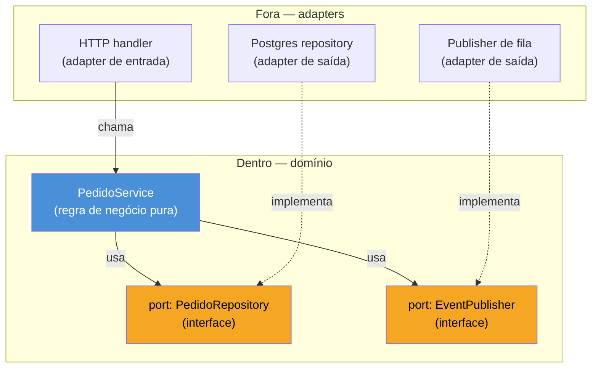
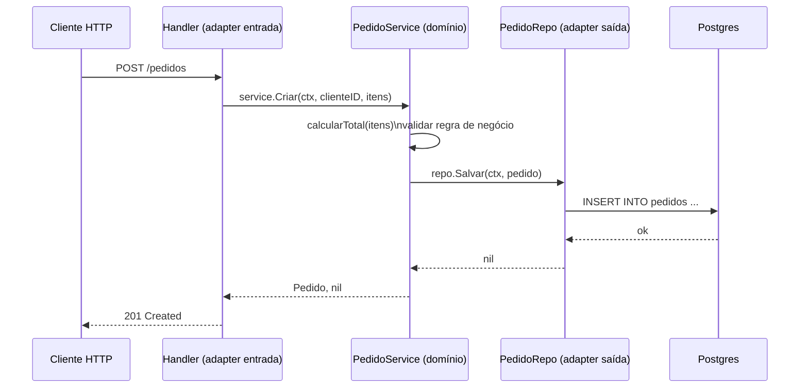

# Arquitetura hexagonal e clean em Go

> [!abstract] TL;DR
> Arquitetura hexagonal (*ports & adapters*) separa o **domínio** — regras de negócio puras — da **infraestrutura** — banco, HTTP, fila, qualquer coisa externa — através de **interfaces (ports)** que o domínio declara e a infraestrutura implementa (*adapters*). Em Go, esse padrão não é imposição de framework: é a consequência natural de **interfaces implícitas definidas do lado do consumidor**. O pacote de domínio declara `type Repository interface { Salvar(...) error }` sem saber nada sobre Postgres, e o pacote de infraestrutura implementa essa interface sem sequer importar o domínio — só o `struct` concreto satisfaz o contrato por acaso de assinatura. O resultado: domínio testável com mocks triviais, troca de banco sem tocar regra de negócio, e uma dependência que sempre aponta pra dentro.

## O problema: regra de negócio grudada no banco

Imagine um serviço de pedidos. A primeira versão, escrita sob pressão de prazo, parece inofensiva:

```go
func CriarPedido(db *sql.DB, clienteID string, itens []Item) error {
    total := calcularTotal(itens)
    if total <= 0 {
        return errors.New("pedido sem itens válidos")
    }

    _, err := db.Exec(
        "INSERT INTO pedidos (cliente_id, total, status) VALUES ($1, $2, $3)",
        clienteID, total, "pendente",
    )
    return err
}
```

Funciona. Mas repare no que aconteceu: a regra de negócio — "pedido sem itens válidos é erro" — está no mesmo corpo de função que o `INSERT` em Postgres. Testar essa regra exige um banco de verdade (ou um banco em memória compatível o bastante), mesmo que o teste não tenha absolutamente nada a ver com SQL. Trocar Postgres por DynamoDB significa reescrever a função inteira, regra de negócio incluída. E se amanhã `CriarPedido` também precisar publicar um evento numa fila, o corpo da função cresce mais uma dependência externa, mais um motivo pra mockar coisa demais num teste que devia ser trivial.

O sintoma tem nome: a regra de negócio depende da infraestrutura. Toda vez que o banco muda, a regra de negócio corre risco de quebrar — não porque a regra mudou, mas porque ela nunca devia ter sabido que Postgres existe.

## O mecanismo: domínio no centro, ports na borda

A ideia central — batizada de *arquitetura hexagonal* por Alistair Cockburn e popularizada sob o nome *clean architecture* por Robert C. Martin, com variações de nomenclatura mas a mesma espinha dorsal — é inverter a direção da dependência. Em vez do domínio conhecer o banco, o domínio declara **o que precisa** através de uma interface, e é a infraestrutura quem depende do domínio, implementando esse contrato.



Duas categorias de *adapter* aparecem no diagrama, e vale nomeá-las porque a distinção evita confusão:

- **Adapters de entrada** (*driving adapters*) — quem chama o domínio de fora pra dentro: um handler HTTP, um consumer de fila, um comando CLI. Eles traduzem "requisição HTTP" pra "chamada de método Go" e chamam o serviço.
- **Adapters de saída** (*driven adapters*) — quem o domínio chama de dentro pra fora: repositório de banco, cliente de fila, cliente HTTP pra outro serviço. Eles implementam as interfaces (*ports*) que o domínio declarou.

A seta que importa no diagrama é a pontilhada: `PG -.->|implementa| PORT1`. Ela aponta do adapter concreto **para dentro**, na direção do port abstrato — nunca o contrário. `PedidoService` nunca importa `PG`. Essa é a regra de dependência da clean architecture, resumida numa frase: **dependências de código sempre apontam para dentro, em direção ao domínio — nunca do domínio para fora.**

## Por que Go encaixa isso naturalmente

Em Java ou C#, aplicar esse padrão costuma exigir disciplina extra: você declara uma interface `PedidoRepository` no módulo de domínio, e o adapter concreto — em outro módulo, ou pelo menos outro pacote — precisa declarar explicitamente `class PostgresPedidoRepository implements PedidoRepository`. O vínculo é sintático e nomeado; esquecer o `implements` é erro de compilação.

Go dispensa esse passo porque suas interfaces são **implícitas** — qualquer tipo que tenha os métodos certos satisfaz a interface, sem cláusula de declaração nenhuma. E mais: a convenção idiomática (reforçada pela [Go Code Review Comments](https://go.dev/wiki/CodeReviewComments#interfaces) da própria equipe Go) é declarar a interface **no pacote que a consome**, não no pacote que a implementa. Essa é a peça que faz o hexágono acontecer quase de graça:

```go
// domain/pedido.go — pacote de domínio, não importa NADA de infra
package domain

type Item struct {
    Nome  string
    Preco float64
    Qtd   int
}

// PedidoRepository é o port — declarado aqui, do lado de quem consome.
type PedidoRepository interface {
    Salvar(ctx context.Context, p Pedido) error
    BuscarPorID(ctx context.Context, id string) (Pedido, error)
}

type Pedido struct {
    ID        string
    ClienteID string
    Itens     []Item
    Total     float64
    Status    string
}

type PedidoService struct {
    repo PedidoRepository
}

func NewPedidoService(repo PedidoRepository) *PedidoService {
    return &PedidoService{repo: repo}
}

func (s *PedidoService) Criar(ctx context.Context, clienteID string, itens []Item) (Pedido, error) {
    total := calcularTotal(itens)
    if total <= 0 {
        return Pedido{}, errors.New("pedido sem itens válidos")
    }

    p := Pedido{
        ID:        uuid.NewString(),
        ClienteID: clienteID,
        Itens:     itens,
        Total:     total,
        Status:    "pendente",
    }

    if err := s.repo.Salvar(ctx, p); err != nil {
        return Pedido{}, fmt.Errorf("salvar pedido: %w", err)
    }
    return p, nil
}

func calcularTotal(itens []Item) float64 {
    var total float64
    for _, i := range itens {
        total += i.Preco * float64(i.Qtd)
    }
    return total
}
```

```go
// infra/postgres/pedido_repo.go — pacote de infra, importa domain,
// mas domain NUNCA importa este pacote de volta.
package postgres

import (
    "context"
    "database/sql"

    "meuservico/domain"
)

type PedidoRepo struct {
    db *sql.DB
}

func NewPedidoRepo(db *sql.DB) *PedidoRepo {
    return &PedidoRepo{db: db}
}

// Salvar satisfaz domain.PedidoRepository — sem "implements" nenhum,
// só por ter a assinatura certa.
func (r *PedidoRepo) Salvar(ctx context.Context, p domain.Pedido) error {
    _, err := r.db.ExecContext(ctx,
        "INSERT INTO pedidos (id, cliente_id, total, status) VALUES ($1, $2, $3, $4)",
        p.ID, p.ClienteID, p.Total, p.Status,
    )
    return err
}

func (r *PedidoRepo) BuscarPorID(ctx context.Context, id string) (domain.Pedido, error) {
    var p domain.Pedido
    err := r.db.QueryRowContext(ctx,
        "SELECT id, cliente_id, total, status FROM pedidos WHERE id = $1", id,
    ).Scan(&p.ID, &p.ClienteID, &p.Total, &p.Status)
    return p, err
}
```

Note a direção dos `import`: `postgres` importa `domain`. `domain` não importa `postgres` — nem sabe que esse pacote existe. `PedidoRepo` satisfaz `domain.PedidoRepository` só porque tem `Salvar` e `BuscarPorID` com a assinatura exata que a interface pede. Isso é a mesma satisfação implícita de interface do Galho 3 aplicada em escala arquitetural: o compilador confere a assinatura no ponto de uso (`NewPedidoService(postgres.NewPedidoRepo(db))`), não no ponto de declaração.

> [!info] Interface no consumidor, não no produtor
> A regra "interface pequena, declarada onde é usada" é enfatizada nas [Go Code Review Comments](https://go.dev/wiki/CodeReviewComments#interfaces): "Go interfaces generally belong in the package that uses values of the interface type, not the package that implements those values." É o oposto do hábito Java de colocar a interface junto da implementação (`PedidoRepository.java` ao lado de `PostgresPedidoRepository.java` no mesmo pacote `repository`). Em Go, a interface migra pra dentro do domínio — e isso, sozinho, já entrega metade da arquitetura hexagonal sem nenhum framework de DI.

## Fio de execução, ponta a ponta

Vale ver como as camadas se encaixam numa chamada real — do HTTP handler até o banco e de volta:



`PedidoService` nunca vê SQL. `PedidoRepo` nunca vê `net/http`. Cada camada conhece só a interface da camada imediatamente mais interna — o handler conhece `PedidoService`, `PedidoService` conhece o `port` `PedidoRepository`, e é só na função `main` (ou num container de DI, assunto da [[03 - Dependency injection|nota 03]] deste galho) que as peças concretas se encontram:

```go
func main() {
    db, _ := sql.Open("postgres", dsn)
    repo := postgres.NewPedidoRepo(db)
    service := domain.NewPedidoService(repo)
    handler := http.NewPedidoHandler(service)

    mux := http.NewServeMux()
    mux.HandleFunc("POST /pedidos", handler.Criar)
    http.ListenAndServe(":8080", mux)
}
```

> [!info] `net/http.ServeMux` com padrões de método (Go 1.22+)
> `mux.HandleFunc("POST /pedidos", ...)` usa a sintaxe de roteamento por método e wildcard introduzida na revisão do `ServeMux` no Go 1.22 — antes disso, o roteamento por verbo HTTP exigia checar `r.Method` manualmente dentro do handler ou recorrer a um router de terceiros.

## Testando o domínio sem banco nenhum

A recompensa mais direta do padrão aparece no teste: como `PedidoService` só conhece a interface `PedidoRepository`, um teste unitário não precisa de Postgres — só de um `struct` que satisfaça a interface com dados em memória:

```go
type repoFake struct {
    salvos map[string]domain.Pedido
}

func (r *repoFake) Salvar(ctx context.Context, p domain.Pedido) error {
    r.salvos[p.ID] = p
    return nil
}

func (r *repoFake) BuscarPorID(ctx context.Context, id string) (domain.Pedido, error) {
    p, ok := r.salvos[id]
    if !ok {
        return domain.Pedido{}, errors.New("não encontrado")
    }
    return p, nil
}

func TestCriarPedido_RejeitaListaVazia(t *testing.T) {
    repo := &repoFake{salvos: map[string]domain.Pedido{}}
    service := domain.NewPedidoService(repo)

    _, err := service.Criar(context.Background(), "cliente-1", nil)

    if err == nil {
        t.Fatal("esperava erro para pedido sem itens")
    }
}
```

Nenhum container de banco, nenhum `testcontainers`, nenhuma latência de rede — o teste roda em microssegundos porque a regra de negócio, isolada atrás de um port, nunca precisou saber que um banco existe.

## Armadilhas comuns

> [!warning] Interface gorda do lado errado
> Declarar `type Repository interface { Salvar; Buscar; Atualizar; Deletar; ListarComPaginacao; ContarTotal; ... }` — um port genérico gigante — recria o acoplamento que a arquitetura tentava evitar: agora todo consumidor precisa de um mock com seis métodos pra testar uma chamada que usa um só. A convenção Go de "interfaces pequenas, definidas no consumidor" pede o oposto: cada `use case` declara só o pedaço mínimo do repositório de que precisa. É comum — e idiomático — ter várias interfaces pequenas e sobrepostas (`Salvador`, `Buscador`) em vez de uma `Repository` monolítica.

> [!warning] Domínio importando `struct` de banco por atalho
> É tentador, sob prazo, deixar o domínio devolver direto o `struct` que o driver de banco populou (`*sql.Rows`, um tipo do `pgx`, um modelo gerado por ORM). No instante em que isso acontece, a dependência inverteu de novo: o domínio agora precisa da tag `db:"..."` ou do tipo específico do driver pra compilar. O port deve devolver **tipos do próprio domínio** (`domain.Pedido`), e é trabalho do adapter fazer a tradução — `sql.Rows` vira `domain.Pedido` dentro de `postgres.PedidoRepo`, nunca do lado de fora dele.

> [!warning] Hexágono para CRUD trivial é overengineering
> Se o serviço inteiro é "receber JSON, gravar linha, devolver JSON" sem regra de negócio nenhuma, os ports e adapters adicionam uma camada de indireção que não paga aluguel — três arquivos e duas interfaces pra proteger uma regra que não existe. O padrão vale a complexidade quando há lógica de domínio real pra proteger de mudança de infraestrutura; para CRUD puro, um handler chamando o banco direto é honesto e mais barato de manter.

## Vindo de outras linguagens

| Linguagem | Como o vínculo interface↔implementação é declarado |
|---|---|
| Java / C# | Explícito: `class PostgresRepo implements Repository` — o compilador exige a cláusula |
| Python (com `abc`/`Protocol`) | `Protocol` (desde 3.8) permite duck typing estrutural parecido com Go; `ABC` tradicional exige herança explícita |
| Go | Implícito e estrutural: qualquer tipo com os métodos certos satisfaz a interface, sem `implements`, sem herança |

A diferença prática: em Go, o pacote de infraestrutura pode nem saber que está implementando um port específico — ele só expõe os métodos certos, e a satisfação é checada no ponto de uso. Isso reduz o cerimonial de DI (nem sempre é preciso um framework de injeção de dependência — construtores simples, como visto na [[03 - Dependency injection|nota 03]] deste galho, bastam) mas exige disciplina de equipe pra não vazar tipos de infra pro domínio por atalho, já que o compilador não vai reclamar de um `import` "errado" — só de assinatura incompatível.

## Como explicar em inglês

> Hexagonal architecture — also known as ports and adapters, or clean architecture in Robert Martin's formulation — keeps business logic isolated from infrastructure by having the domain declare interfaces (ports) that outer layers (adapters) implement. In Go, this pattern falls out almost naturally from two idioms working together: interfaces are satisfied implicitly (no `implements` keyword), and the idiomatic convention is to declare the interface in the consuming package rather than alongside its implementation. A `domain` package can declare `type PedidoRepository interface { Salvar(...) error }` without importing anything from infrastructure, and a `postgres` package implements it by simply having the right method signatures — the dependency always points inward, from adapter to domain, never the reverse. The payoff is testability: a domain service can be unit-tested against an in-memory fake that satisfies the port, with zero database setup.

| Termo PT | Termo EN |
|---|---|
| arquitetura hexagonal | hexagonal architecture |
| porta (contrato) | port |
| adaptador | adapter |
| adaptador de entrada | driving adapter |
| adaptador de saída | driven adapter |
| domínio | domain |
| regra de dependência | dependency rule |
| interface implícita | implicit interface |
| satisfazer uma interface | satisfy an interface |
| duplo fake / dublê de teste | test double |

## O que vem a seguir

Domínio isolado atrás de ports resolve acoplamento com infraestrutura — mas não resolve o que acontece quando essa infraestrutura **falha**: um banco lento, uma chamada HTTP que trava, um serviço downstream fora do ar. A [[06 - Resiliência — circuit breaker, retry, timeout|próxima nota]] entra no lado defensivo da arquitetura: como os adapters (que agora concentram toda comunicação externa, graças ao isolamento visto aqui) se protegem de falhas de rede sem propagar essas falhas pro domínio.

## Veja também

- [[02 - Organizando um serviço|02 — Organizando um serviço]] — organização de pastas que já antecipa a separação domínio/infra explorada aqui
- [[03 - Dependency injection|03 — Dependency injection]] — como as peças concretas (adapters) chegam até o domínio via construtor
- [[04 - Configuração|04 — Configuração]] — de onde vêm os parâmetros (DSN, timeouts) que os adapters concretos usam
- [[06 - Resiliência — circuit breaker, retry, timeout|06 — Resiliência]] — próxima nota do galho
- [[03-Dominios/Tecnologia/Go/index|Trilha Go]]

## Fontes

- The Go Authors. *Go Code Review Comments — Interfaces*. go.dev wiki. https://go.dev/wiki/CodeReviewComments#interfaces (acessado em 2026-07-18)
- The Go Authors. *Effective Go — Interfaces and other types*. go.dev. https://go.dev/doc/effective_go#interfaces_and_types (acessado em 2026-07-18)
- The Go Authors. *The Go Programming Language Specification — Interface types*. go.dev. https://go.dev/ref/spec#Interface_types (acessado em 2026-07-18)
- The Go Blog. *Routing Enhancements for Go 1.22*. go.dev. https://go.dev/blog/routing-enhancements (acessado em 2026-07-18)
- Go by Example. *Interfaces*. gobyexample.com. https://gobyexample.com/interfaces (acessado em 2026-07-18)
