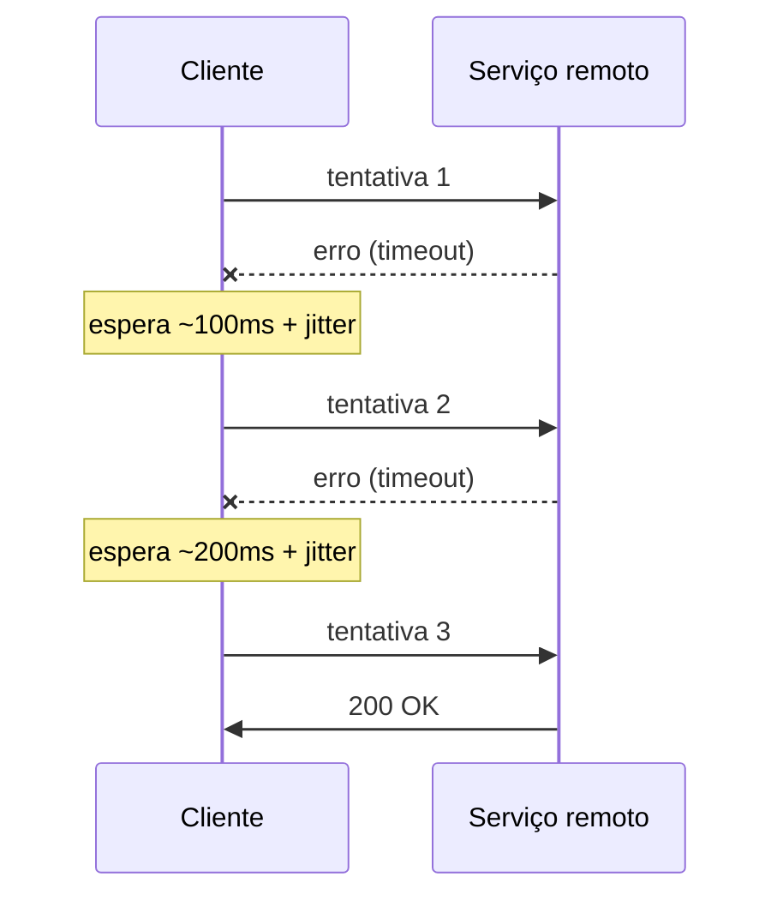
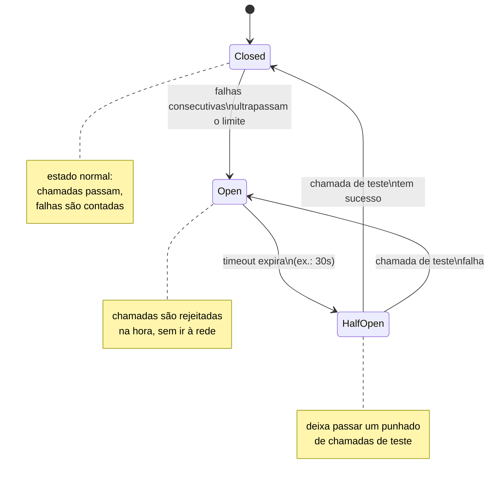
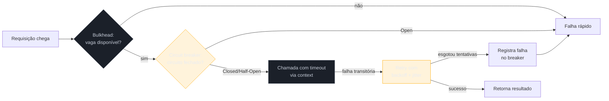

# Resiliência — circuit breaker, retry, timeout

> [!abstract] TL;DR
> Num sistema distribuído, toda chamada de rede pode falhar — e a forma como seu serviço reage à falha do vizinho decide se um problema local vira um incêndio em cascata. Quatro padrões cobrem a maior parte do terreno: **timeout** via `context.WithTimeout` (nunca espere para sempre), **retry com backoff exponencial + jitter** (tente de novo, mas sem martelar o serviço já combalido), **circuit breaker** com [gobreaker](https://github.com/sony/gobreaker) (pare de tentar quando já sabe que vai falhar) e **bulkhead** (isole recursos para que uma dependência lenta não sufoque as outras). Nenhum desses padrões substitui os outros — eles se combinam em camadas, do mais interno (timeout) ao mais externo (circuit breaker). A regra geral: **falhar rápido é melhor que falhar devagar**.

## O cenário: uma chamada que trava tudo

Imagine um serviço de pedidos que, a cada requisição, chama um serviço de pagamento via HTTP. Em condições normais, a chamada volta em 50ms. Um dia, o serviço de pagamento começa a demorar 30 segundos para responder — não caiu, só ficou lento, talvez por uma migration de banco travando locks.

Sem nenhuma proteção, o que acontece? Cada requisição de pedido que chega abre uma goroutine, essa goroutine chama o pagamento, e fica **bloqueada 30 segundos** esperando resposta. Se seu serviço recebe 100 requisições por segundo, em 10 segundos você já tem 1000 goroutines penduradas, cada uma segurando uma conexão HTTP, um slot de pool de conexões, memória de stack. O serviço de pedidos — que não tem *nenhum* problema técnico próprio — fica sem recursos e cai junto. Isso é uma **falha em cascata**: um serviço lento derruba um serviço saudável, que por sua vez pode derrubar quem depende dele.

É o efeito dominó que a indústria batizou de forma quase didática no livro *Release It!*, de Michael Nygard — a obra que popularizou boa parte do vocabulário que esta nota usa (circuit breaker, bulkhead). A pergunta que guia tudo aqui não é "como evito que o pagamento fique lento" (você não controla isso) — é "como faço meu serviço se proteger quando o vizinho fica lento".

## Timeout: a base de tudo

Antes de qualquer padrão mais sofisticado, existe uma regra não negociável: **nenhuma chamada de rede deve rodar sem prazo**. Em Go, o mecanismo é o pacote `context` — toda função que faz I/O deveria aceitar um `context.Context` como primeiro parâmetro e respeitá-lo.

```go
func chamarPagamento(ctx context.Context, pedido Pedido) (*Recibo, error) {
    ctx, cancel := context.WithTimeout(ctx, 2*time.Second)
    defer cancel()

    req, err := http.NewRequestWithContext(ctx, http.MethodPost, urlPagamento, corpo(pedido))
    if err != nil {
        return nil, fmt.Errorf("montar requisição: %w", err)
    }

    resp, err := http.DefaultClient.Do(req)
    if err != nil {
        // ctx.Err() é context.DeadlineExceeded se foi o timeout que disparou
        return nil, fmt.Errorf("chamar pagamento: %w", err)
    }
    defer resp.Body.Close()

    // ... decodificar resp.Body
    return &Recibo{}, nil
}
```

`context.WithTimeout` cria um contexto-filho que se auto-cancela depois do prazo. `http.NewRequestWithContext` amarra esse contexto à requisição — se o timeout estourar, o cliente HTTP interrompe a chamada e retorna erro imediatamente, mesmo que o servidor remoto ainda não tenha respondido. O `defer cancel()` é obrigatório: mesmo quando a chamada termina antes do prazo, `cancel()` libera os recursos internos do timer associado ao contexto — esquecê-lo é um vazamento pequeno, mas real, em código de alto tráfego.

> [!warning] Timeout sem `context` propagado não protege nada
> `http.Client{Timeout: 2 * time.Second}` (o timeout no nível do client, não do contexto) também funciona — mas só limita aquela chamada isolada. Se sua função chama três serviços em sequência, cada um com timeout de 2s no client, o pior caso é 6 segundos. Com `context.WithTimeout` propagado desde o handler HTTP de entrada, o prazo é **compartilhado**: se o cliente original já esperou 1.5s dos 2s permitidos, a chamada seguinte já nasce com só 500ms de orçamento. É a diferença entre timeout por chamada e timeout por requisição de ponta a ponta — a segunda é a que efetivamente protege o sistema.

## Retry com backoff exponencial e jitter

Nem toda falha é permanente. Um pacote de rede perdido, um deploy rolling que momentaneamente tirou uma réplica do ar, um GC pause de 200ms no servidor remoto — nesses casos, tentar de novo, alguns milissegundos depois, costuma resolver. A pergunta é **quanto tempo esperar entre tentativas**.

A resposta ingênua — tentar de novo imediatamente, ou em intervalo fixo — tem um problema sério em escala: se 1000 clientes falharam ao mesmo tempo (porque o servidor caiu por um segundo) e todos re-tentam no mesmo instante, o servidor recebe um pico sincronizado de tráfego bem na hora em que está mais fragilizado — o chamado *thundering herd*. A solução com duas partes:

- **Backoff exponencial**: cada tentativa espera o dobro da anterior (100ms, 200ms, 400ms, 800ms...) — dá tempo para o problema transitório passar sem martelar o servidor.
- **Jitter**: soma-se um componente aleatório ao tempo de espera, para que clientes diferentes não re-tentem no mesmo milissegundo exato.



> [!info] `math/rand/v2` é o gerador recomendado desde o Go 1.22
> A partir do Go 1.22, `math/rand/v2` oferece uma API mais moderna e já vem com uma fonte pseudoaleatória seedada automaticamente — dispensa o antigo `rand.Seed(time.Now().UnixNano())` que era hábito em código pré-1.20.

```go
func chamarComRetry(ctx context.Context, tentativas int, f func(context.Context) error) error {
    var ultimoErro error

    for tentativa := 0; tentativa < tentativas; tentativa++ {
        if tentativa > 0 {
            base := time.Duration(1<<uint(tentativa-1)) * 100 * time.Millisecond // 100ms, 200ms, 400ms...
            jitter := time.Duration(rand.Int64N(int64(base) / 2))
            espera := base + jitter

            select {
            case <-time.After(espera):
            case <-ctx.Done():
                return ctx.Err()
            }
        }

        ultimoErro = f(ctx)
        if ultimoErro == nil {
            return nil
        }

        if !ehErroRetentavel(ultimoErro) {
            return ultimoErro // erro permanente — retry não ajuda, ex.: 400 Bad Request
        }
    }

    return fmt.Errorf("esgotadas %d tentativas: %w", tentativas, ultimoErro)
}

func ehErroRetentavel(err error) bool {
    // erros de timeout/conexão são candidatos a retry;
    // um 4xx do servidor remoto, normalmente não é
    return errors.Is(err, context.DeadlineExceeded) || errors.Is(err, syscall.ECONNREFUSED)
}
```

Repare em duas decisões deliberadas nesse código: o `select` com `ctx.Done()` durante a espera garante que o retry respeita o timeout geral da requisição (não adianta re-tentar se o cliente original já desistiu); e `ehErroRetentavel` distingue erro **transitório** (vale re-tentar) de erro **permanente** (um `400 Bad Request` continuará sendo `400` na próxima tentativa — re-tentar só desperdiça tempo e recursos).

> [!warning] Nem todo erro merece retry
> Re-tentar cegamente qualquer erro é um antipadrão comum. Erros de validação (4xx), erros de autenticação, ou qualquer erro que o próprio domínio marca como definitivo não devem disparar retry — na melhor das hipóteses é desperdício, na pior é um `DELETE` ou `POST` não-idempotente executado duas vezes contra a mesma dependência. Antes de aplicar retry, pergunte: essa operação é *idempotente*? Esse erro é *transitório*?

## Idempotência: o pré-requisito silencioso do retry

Antes de configurar qualquer retry, existe uma pergunta que precisa vir primeiro: **se essa chamada for executada duas vezes, o que acontece?** Um `GET /pedidos/42` é seguro de repetir — ler duas vezes o mesmo recurso não muda nada. Já um `POST /pagamentos` sem cuidado extra pode cobrar o cliente duas vezes se a primeira tentativa teve sucesso no servidor remoto, mas a resposta se perdeu na rede antes de voltar — o cliente, sem saber que o pagamento já foi processado, re-tenta achando que a primeira tentativa falhou.

Essa é a razão pela qual APIs de pagamento sérias (Stripe é o exemplo mais citado) exigem uma **chave de idempotência**: um identificador único gerado pelo cliente, enviado em todo retry da mesma operação lógica, que o servidor usa para detectar "já processei isso, aqui está o resultado da primeira vez" em vez de processar de novo.

```go
func (c *ClientePagamento) cobrarComIdempotencia(ctx context.Context, pedido Pedido) (*Recibo, error) {
    // a chave nasce uma única vez por pedido — não a cada tentativa de retry
    chaveIdempotencia := "pedido-" + pedido.ID

    req, _ := http.NewRequestWithContext(ctx, http.MethodPost, urlPagamento, corpo(pedido))
    req.Header.Set("Idempotency-Key", chaveIdempotencia)

    return c.httpClient.Do(req)
}
```

O detalhe que importa: a chave é gerada **antes** do loop de retry e reaproveitada em todas as tentativas daquela mesma operação lógica — nunca uma chave nova a cada tentativa, senão o mecanismo perde o sentido. Do lado do serviço que você está chamando, é responsabilidade dele (não sua) honrar a chave; do seu lado, o que você controla é gerar uma chave estável e sempre mandá-la.

> [!warning] Retry sem chave de idempotência em operação de escrita é risco de produção
> Se a API remota não suporta `Idempotency-Key` (ou equivalente) e a operação não é naturalmente idempotente (como um `PUT` que sobrescreve o estado inteiro), aplicar retry automático é assumir o risco de duplicar efeitos colaterais — cobrar duas vezes, enviar dois e-mails, criar dois pedidos. Nesses casos, ou a operação precisa de um design que a torne idempotente (um `PUT /pedidos/{id}` com o estado final desejado, em vez de um `POST` que sempre cria algo novo), ou o retry automático simplesmente não é seguro — só retry manual, com humano no circuito.

## Circuit breaker: pare de tentar quando já sabe que vai falhar

Retry resolve falhas pontuais. Mas e quando o serviço remoto está **realmente fora do ar**, não apenas lento por um instante? Re-tentar nessas condições é pior que inútil — cada tentativa consome tempo, thread, conexão, e ainda **atrasa a resposta de erro** para o chamador, que já poderia ter recebido um "não disponível" imediato.

O circuit breaker resolve isso copiando a metáfora do disjuntor elétrico: depois de um número de falhas consecutivas, o "circuito abre" e passa a rejeitar chamadas **imediatamente**, sem sequer tentar a rede — até que um temporizador permita testar se o serviço remoto voltou.



Três estados, três comportamentos:

- **Closed** (fechado): estado normal. Chamadas passam livremente para o serviço remoto; o breaker só conta falhas por trás dos panos.
- **Open** (aberto): depois que as falhas ultrapassam o limiar configurado, o breaker "abre o circuito" — toda chamada subsequente falha na hora, com um erro próprio do breaker (`gobreaker.ErrOpenState`), sem nem tentar a rede. Isso é o que faz *fail fast* de verdade: em vez de esperar 2 segundos de timeout a cada chamada, você recebe erro em microssegundos.
- **Half-Open** (meio aberto): depois de um tempo (`Timeout`, na configuração), o breaker deixa passar um número limitado de chamadas de teste. Se elas tiverem sucesso, o circuito fecha de novo (o serviço remoto se recuperou); se falharem, volta a abrir.

Em Go, a biblioteca de referência para esse padrão é a [gobreaker da Sony](https://github.com/sony/gobreaker) — leve, sem dependências externas, e amplamente usada em produção:

```go
import "github.com/sony/gobreaker/v2"

var cbPagamento = gobreaker.NewCircuitBreaker[*Recibo](gobreaker.Settings{
    Name:        "servico-pagamento",
    MaxRequests: 3,                // nº de chamadas de teste permitidas em Half-Open
    Interval:    10 * time.Second, // janela em que as contagens de Closed são zeradas
    Timeout:     30 * time.Second, // tempo em Open antes de tentar Half-Open
    ReadyToTrip: func(counts gobreaker.Counts) bool {
        return counts.ConsecutiveFailures > 5
    },
    OnStateChange: func(name string, from, to gobreaker.State) {
        slog.Warn("circuit breaker mudou de estado",
            "breaker", name, "de", from.String(), "para", to.String())
    },
})

func chamarPagamento(ctx context.Context, pedido Pedido) (*Recibo, error) {
    return cbPagamento.Execute(func() (*Recibo, error) {
        return chamarPagamentoHTTP(ctx, pedido)
    })
}
```

> [!info] gobreaker/v2 usa generics (Go 1.18+)
> A versão 2 da biblioteca (`github.com/sony/gobreaker/v2`) tipa o `CircuitBreaker` com generics — `gobreaker.NewCircuitBreaker[*Recibo](...)` retorna um breaker que já sabe que `Execute` produz um `*Recibo`, sem o `interface{}`/`any` e o *type assertion* manual que a v1 exigia. Se você encontrar exemplos com `result.(*Recibo)` depois de `cb.Execute`, é código escrito contra a v1 — ainda funciona, mas é a versão pré-generics.

`ReadyToTrip` é o coração da configuração: você decide a regra de quando abrir (aqui, mais de 5 falhas consecutivas — mas dá para usar taxa de falha sobre uma janela, `counts.TotalFailures / counts.Requests`, se preferir tolerar picos isolados). `OnStateChange` é o gancho para observabilidade — logar (ou emitir métrica) toda vez que o breaker muda de estado é o tipo de sinal que entra num dashboard de saúde do sistema, tema que a nota de observabilidade do Galho 16 aprofunda.

> [!warning] Circuit breaker é por dependência, não global
> Um erro comum é criar **um** breaker para o serviço inteiro, compartilhado entre chamadas a serviços diferentes. Isso significa que uma falha no serviço de pagamento pode abrir o circuito e bloquear chamadas ao serviço de estoque, que não tem nada a ver com o problema. A prática correta é um breaker **por dependência externa** — um para pagamento, outro para estoque, outro para o banco de dados — cada um com seu próprio estado e configuração.

## Bulkhead: isolar recursos para que uma dependência lenta não afunde as outras

Circuit breaker resolve "pare de chamar quem está quebrado". Mas existe um problema anterior: mesmo com timeout e retry, enquanto uma dependência está lenta (mas ainda dentro do limiar que abriria o breaker), as chamadas para ela consomem recursos — goroutines, conexões, memória — que são **compartilhados** com chamadas para outras dependências saudáveis.

O nome vem de arquitetura naval: um navio é dividido em compartimentos estanques (*bulkheads*) para que uma avaria no casco inunde só um compartimento, não o navio inteiro. Aplicado a software: você isola o *pool* de recursos usado para cada dependência, para que uma lenta não sufoque as outras.

Em Go, a forma mais direta de implementar bulkhead sem trazer biblioteca nova é limitar a **concorrência por dependência** com um canal usado como semáforo:

```go
type ClientePagamento struct {
    httpClient *http.Client
    semaforo   chan struct{} // capacidade = concorrência máxima permitida
}

func NovoClientePagamento(maxConcorrente int) *ClientePagamento {
    return &ClientePagamento{
        httpClient: &http.Client{Timeout: 2 * time.Second},
        semaforo:   make(chan struct{}, maxConcorrente),
    }
}

func (c *ClientePagamento) Chamar(ctx context.Context, pedido Pedido) (*Recibo, error) {
    select {
    case c.semaforo <- struct{}{}: // ocupa uma vaga do compartimento
        defer func() { <-c.semaforo }() // libera a vaga ao terminar
    case <-ctx.Done():
        return nil, ctx.Err()
    default:
        // compartimento cheio: falha rápido em vez de enfileirar sem limite
        return nil, errors.New("pagamento: limite de concorrência atingido")
    }

    resp, err := c.httpClient.Post(urlPagamento, "application/json", corpo(pedido))
    if err != nil {
        return nil, fmt.Errorf("chamar pagamento: %w", err)
    }
    defer resp.Body.Close()

    var recibo Recibo
    if err := json.NewDecoder(resp.Body).Decode(&recibo); err != nil {
        return nil, fmt.Errorf("decodificar resposta: %w", err)
    }
    return &recibo, nil
}
```

O `semaforo` limita quantas chamadas simultâneas ao serviço de pagamento seu processo permite — digamos, 20. Se o pool inteiro de conexões HTTP para pagamento (e as goroutines penduradas nele) tiver um teto, uma lentidão no pagamento nunca consome mais que essa fatia fixa de recursos — sobra capacidade de sobra para as chamadas a estoque, a notificação, ao banco de dados. É o mesmo princípio de *connection pool* por dependência que times de infraestrutura já aplicam a bancos de dados, só que estendido a qualquer chamada de rede.

> [!question]- Bulkhead por goroutine é a única forma de isolar recursos em Go?
> Não — é a mais comum e a mais barata de implementar (um canal-semáforo é poucas linhas). Times maiores também isolam por processo inteiro (um serviço dedicado só para a integração de pagamento, com seu próprio limite de CPU/memória via cgroups — tema que volta com força no Galho 18, de deploy/Kubernetes) ou por pool de conexões dedicado no nível do `http.Transport` (`MaxConnsPerHost`). O canal-semáforo aqui isola no nível mais barato — dentro do mesmo processo — e já resolve o caso comum.

## Combinando os quatro padrões

Nenhum padrão sozinho é suficiente. A ordem natural de composição, do mais interno para o mais externo, é: **bulkhead** limita quantas chamadas concorrentes cabem → **timeout** garante que cada chamada individual não trava para sempre → **retry** absorve falhas transitórias dentro do orçamento de tempo → **circuit breaker** desiste de chamar de vez quando o padrão de falhas indica que insistir não ajuda.



Na prática, um cliente de dependência externa bem construído combina os quatro numa única função. Retomando o `ClientePagamento` da seção de bulkhead, eis a versão completa — o semáforo controla concorrência, o timeout entra dentro da chamada individual, o retry envolve a chamada com backoff, e o circuit breaker envolve o retry inteiro:

```go
type ClientePagamento struct {
    httpClient *http.Client
    semaforo   chan struct{}
    breaker    *gobreaker.CircuitBreaker[*Recibo]
}

func NovoClientePagamento(maxConcorrente int) *ClientePagamento {
    return &ClientePagamento{
        httpClient: &http.Client{},
        semaforo:   make(chan struct{}, maxConcorrente),
        breaker: gobreaker.NewCircuitBreaker[*Recibo](gobreaker.Settings{
            Name:        "servico-pagamento",
            MaxRequests: 3,
            Timeout:     30 * time.Second,
            ReadyToTrip: func(c gobreaker.Counts) bool {
                return c.ConsecutiveFailures > 5
            },
        }),
    }
}

// Cobrar é o único ponto de entrada público — quem chama não precisa saber
// que por trás existem quatro camadas de proteção.
func (c *ClientePagamento) Cobrar(ctx context.Context, pedido Pedido) (*Recibo, error) {
    // camada 4 (mais externa): circuit breaker
    return c.breaker.Execute(func() (*Recibo, error) {
        // camada 3: bulkhead — só entra se houver vaga
        select {
        case c.semaforo <- struct{}{}:
            defer func() { <-c.semaforo }()
        case <-ctx.Done():
            return nil, ctx.Err()
        default:
            return nil, errors.New("pagamento: limite de concorrência atingido")
        }

        var recibo *Recibo
        // camada 2: retry com backoff + jitter
        err := chamarComRetry(ctx, 3, func(ctx context.Context) error {
            // camada 1 (mais interna): timeout por tentativa
            ctxChamada, cancel := context.WithTimeout(ctx, 2*time.Second)
            defer cancel()

            r, err := chamarPagamentoHTTP(ctxChamada, c.httpClient, pedido)
            if err != nil {
                return err
            }
            recibo = r
            return nil
        })
        return recibo, err
    })
}
```

Vale ler essa função de fora para dentro: `Cobrar` é a única API que o resto do serviço enxerga — quem chama `clientePagamento.Cobrar(ctx, pedido)` não precisa saber que, por baixo, uma requisição pode nunca sair da máquina (bulkhead cheio ou circuito aberto), pode falhar rápido em 2 segundos (timeout), pode ser tentada até três vezes com espera crescente (retry), e todo esse histórico de falhas alimenta uma decisão maior sobre desistir de chamar por completo (breaker). Cada camada resolve exatamente um problema e nenhuma delas sabe da existência das outras — é composição, não uma máquina de estados monolítica.

É verboso escrever isso à mão para cada dependência — por isso bibliotecas mais completas, como [go-resiliency](https://github.com/eapache/go-resiliency) ou os *interceptors* de resiliência do gRPC (nota anterior deste galho aborda comunicação entre serviços), oferecem os quatro padrões prontos para compor, reduzindo o boilerplate sem mudar a ideia central.

## Testando resiliência com `httptest`

Um padrão de resiliência que nunca foi testado sob falha simulada é, na prática, código de fé — funciona no caminho feliz e ninguém sabe o que acontece quando a rede se comporta mal. O pacote `net/http/httptest` da stdlib permite simular exatamente isso, sem depender de infraestrutura real:

```go
func TestChamarComRetry_RecuperaAposFalhasTransitorias(t *testing.T) {
    var tentativas int32

    servidor := httptest.NewServer(http.HandlerFunc(func(w http.ResponseWriter, r *http.Request) {
        n := atomic.AddInt32(&tentativas, 1)
        if n < 3 {
            // as duas primeiras chamadas falham — simula instabilidade transitória
            w.WriteHeader(http.StatusServiceUnavailable)
            return
        }
        w.WriteHeader(http.StatusOK)
    }))
    defer servidor.Close()

    ctx := context.Background()
    err := chamarComRetry(ctx, 5, func(ctx context.Context) error {
        resp, err := http.Get(servidor.URL)
        if err != nil {
            return err
        }
        defer resp.Body.Close()
        if resp.StatusCode != http.StatusOK {
            return fmt.Errorf("status inesperado: %d", resp.StatusCode)
        }
        return nil
    })

    if err != nil {
        t.Fatalf("esperava sucesso após retry, obteve erro: %v", err)
    }
    if atomic.LoadInt32(&tentativas) != 3 {
        t.Errorf("esperava exatamente 3 tentativas, obteve %d", tentativas)
    }
}
```

`httptest.NewServer` sobe um servidor HTTP real, escutando numa porta local — não é um mock que intercepta chamadas, é uma requisição de rede de verdade, só que contra `localhost`. O contador atômico (`atomic.AddInt32`) simula um serviço que falha nas duas primeiras tentativas e se recupera na terceira, exatamente o cenário que o retry com backoff foi desenhado para absorver. O mesmo padrão serve para testar o circuit breaker — configure o servidor de teste para falhar sempre, chame o cliente resiliente mais vezes que `ReadyToTrip` permite, e verifique que `cb.State()` retorna `gobreaker.StateOpen` depois disso.

> [!info] `httptest.NewServer` vs `httptest.NewTLSServer`
> Para simular também o comportamento sob TLS (certificados, handshake), a stdlib oferece `httptest.NewTLSServer`, que sobe o mesmo servidor de teste com um certificado autoassinado — útil quando o cliente sob teste precisa lidar com `https://`, não só `http://`.

## Vindo de outra stack

| Conceito | Java | Node.js | Go (esta nota) |
|---|---|---|---|
| Circuit breaker | Resilience4j `CircuitBreaker`, Hystrix (legado) | `opossum`, `cockatiel` | gobreaker |
| Retry | Resilience4j `Retry`, Spring Retry | `p-retry`, `async-retry` | função própria (poucas linhas) ou go-resiliency |
| Timeout | `CompletableFuture.orTimeout`, cliente HTTP com timeout | `AbortController` + `setTimeout` | `context.WithTimeout` |
| Bulkhead | Resilience4j `Bulkhead`, thread pools dedicados | limitar concorrência com filas (`p-limit`) | canal como semáforo |

A diferença estrutural que mais chama atenção vindo do ecossistema Java: Resilience4j oferece os quatro padrões como *aspectos* combináveis por anotação ou builder (`Retry.decorateSupplier(retry, CircuitBreaker.decorateSupplier(cb, chamada))`), quase como middleware empilhado. Em Go, a composição costuma ser explícita e manual — você vê exatamente onde o timeout entra, onde o retry envolve a chamada, onde o breaker fica por fora — o que é mais verboso, mas também mais fácil de ler sem precisar conhecer a ordem de aplicação de uma cadeia de decorators.

## Armadilhas comuns

> [!warning] Retry dentro de retry multiplica tentativas sem ninguém perceber
> Se seu cliente HTTP já tem retry configurado (algumas bibliotecas de terceiros fazem isso por padrão) e você adiciona outro retry por cima, uma falha simples pode virar dezenas de tentativas reais contra o serviço remoto — exatamente o tipo de comportamento que agrava um incidente em vez de mitigar. Audite se já existe retry em alguma camada (client HTTP, service mesh, proxy) antes de adicionar o seu.

> [!warning] Circuit breaker com `ReadyToTrip` baseado só em contagem absoluta ignora volume
> `counts.ConsecutiveFailures > 5` abre o circuito da mesma forma com 5 falhas em 1000 requisições (0.5% de taxa de erro, provavelmente ruído) ou 5 falhas em 5 requisições (100% de taxa de erro, serviço realmente fora do ar). Em serviços de alto tráfego, prefira uma regra baseada em **taxa** sobre uma janela mínima de volume: `counts.Requests >= 20 && float64(counts.TotalFailures)/float64(counts.Requests) >= 0.5`.

> [!warning] Esquecer `defer cancel()` do `context.WithTimeout` vaza recursos
> Todo `context.WithTimeout` (e `WithCancel`, `WithDeadline`) devolve uma função `cancel` que precisa ser chamada — mesmo quando o timeout nunca dispara. Sem o `defer cancel()`, o contexto e seu timer interno ficam vivos até o timeout expirar sozinho, consumindo memória desnecessariamente em código de alto volume de chamadas.

## Como explicar em inglês

> Cascading failures are the core risk in distributed systems: a slow downstream service can exhaust the caller's resources — goroutines, connections, memory — and take down a perfectly healthy service with it. Four patterns defend against this, applied in layers. **Timeouts**, via `context.WithTimeout`, guarantee no call blocks forever. **Retry with exponential backoff and jitter** absorbs transient failures without hammering an already-struggling server — jitter specifically prevents the *thundering herd* problem where many clients retry in lockstep. A **circuit breaker** (in Go, typically the `gobreaker` library) tracks consecutive failures and, once a threshold is crossed, trips to an Open state that fails calls instantly instead of waiting out another timeout — it periodically allows a Half-Open probe to check if the dependency recovered. **Bulkheads** cap concurrency per dependency, usually with a buffered channel used as a semaphore, so a slow dependency can only consume its own fixed slice of resources, never the whole pool. None of these patterns is a substitute for the others; production-grade clients compose all four, and the guiding principle throughout is: fail fast, don't fail slow.

| Termo PT | Termo EN |
|---|---|
| falha em cascata | cascading failure |
| tentar de novo | retry |
| espera exponencial | exponential backoff |
| ruído aleatório na espera | jitter |
| disjuntor de circuito | circuit breaker |
| circuito fechado/aberto/meio-aberto | closed/open/half-open circuit |
| falhar rápido | fail fast |
| compartimento estanque (isolamento de recursos) | bulkhead |
| erro transitório | transient error |
| efeito manada | thundering herd |

## O que vem a seguir

Resiliência protege chamadas individuais entre serviços — mas não decide **como** esses serviços conversam em primeiro lugar: síncrono via HTTP/gRPC, assíncrono via fila, ou uma combinação dos dois conforme o caso de uso. A [[07 - Comunicação entre serviços|próxima nota]] entra nesse território, retomando os protocolos já vistos em galhos anteriores (HTTP, gRPC, mensageria) sob a lente específica de arquitetura de microservices: quando escolher cada estilo, e como eles se combinam com os padrões de resiliência vistos aqui.

## Veja também

- [[05 - Arquitetura hexagonal e clean em Go|05 — Arquitetura hexagonal e clean em Go]] — onde clientes resilientes como o `ClientePagamento` desta nota se encaixam (adapter de saída, atrás de uma porta)
- [[07 - Comunicação entre serviços|07 — Comunicação entre serviços]] — próxima nota do galho
- [[08 - Um serviço bem estruturado|08 — Um serviço bem estruturado]] — capstone do galho, onde os padrões desta nota aparecem compostos num serviço real
- [[03-Dominios/Tecnologia/Go/index|Trilha Go]]

## Fontes

- Sony. *gobreaker — Circuit Breaker pattern implementation in Go*. GitHub. https://github.com/sony/gobreaker (acessado em 2026-07-18)
- The Go Authors. *Package context*. pkg.go.dev. https://pkg.go.dev/context (acessado em 2026-07-18)
- The Go Authors. *Package math/rand/v2*. pkg.go.dev. https://pkg.go.dev/math/rand/v2 (acessado em 2026-07-18)
- The Go Authors. *Go 1.22 Release Notes*. go.dev. https://go.dev/doc/go1.22 (acessado em 2026-07-18)
- Go by Example. *Timeouts*. gobyexample.com. https://gobyexample.com/timeouts (acessado em 2026-07-18)
- Eapache. *go-resiliency — Resiliency patterns for Go*. GitHub. https://github.com/eapache/go-resiliency (acessado em 2026-07-18)
