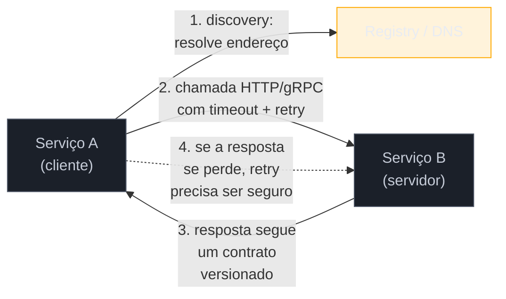
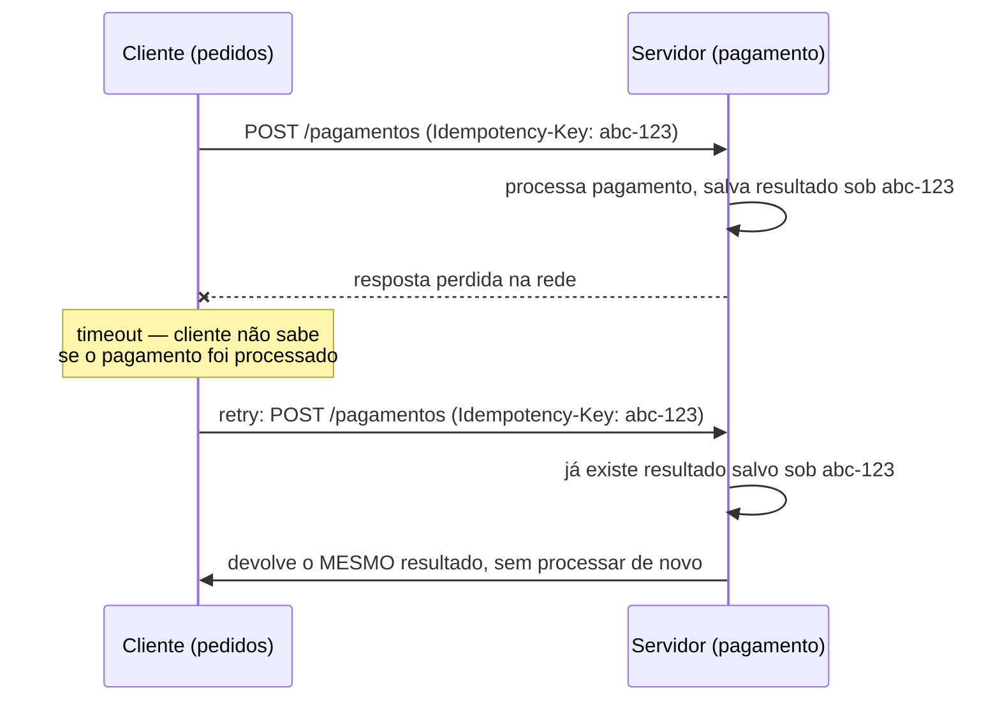

# Comunicação entre serviços

> [!abstract] TL;DR
> Um cliente HTTP ou gRPC criado com valor zero (`http.Client{}`, `grpc.Dial` sem opções) não tem timeout, não reusa conexões direito e não sabe o que fazer quando o destino simplesmente sumiu do ar. Comunicação entre serviços em Go é, na prática, três decisões empilhadas: **como o cliente encontra o endereço** do serviço alvo (service discovery — DNS, registry, ou service mesh cuidando disso por fora), **o que as duas pontas concordam em trocar** (o contrato — schema HTTP versionado ou `.proto` gerado), e **o que acontece quando a chamada falha no meio do caminho** (idempotência — repetir com segurança ou não). Esta nota monta um `http.Client` e uma conexão gRPC de produção, explica a fronteira que separa "meu serviço" do "serviço deles", e mostra por que todo cliente que faz retry precisa que o lado servidor seja idempotente — senão o retry vira o próprio bug.

## O cliente que "funciona" até não funcionar

Um serviço de pedidos precisa consultar o serviço de estoque antes de confirmar uma venda. A versão mais rápida de escrever é esta:

```go
resp, err := http.Get("http://estoque-service/produtos/42")
```

Compila, roda, funciona no notebook. Em produção, com o serviço de estoque sob carga ou atrás de um load balancer lento, essa linha trava o goroutine que a chamou **indefinidamente** — `http.Get` usa `http.DefaultClient`, que não define timeout nenhum. Se o estoque nunca responder, o pedido nunca é confirmado nem rejeitado: fica pendurado. Multiplique isso por mil requisições simultâneas e o serviço de pedidos esgota suas próprias goroutines e conexões só esperando uma resposta que não vem.

Esse é o primeiro instinto que precisa morrer ao escrever comunicação entre serviços em Go: o cliente HTTP zero-value do pacote padrão é conveniente para um script de linha de comando, não para uma chamada de serviço a serviço. A nota anterior, [[06 - Resiliência — circuit breaker, retry, timeout|06]], já tratou timeout, retry e circuit breaker como padrões — esta nota assume esses padrões e foca no que fica **em volta** deles: como o cliente é construído, como ele acha o endereço certo, o que as duas pontas concordam em falar, e por que repetir uma chamada às vezes é seguro e às vezes corrompe dado.

## Anatomia de uma chamada entre serviços



Quatro peças, quatro seções desta nota: descoberta do endereço, cliente bem configurado, contrato entre as pontas, e o que fazer quando a chamada falha no meio.

## Cliente HTTP configurado para produção

`http.DefaultClient` é um valor zero de `http.Client` — sem timeout, com o `http.DefaultTransport` compartilhado globalmente. Para chamadas entre serviços, três ajustes resolvem os problemas mais comuns:

```go
package estoque

import (
    "context"
    "encoding/json"
    "fmt"
    "net"
    "net/http"
    "time"
)

// NewClient constrói um http.Client pronto para chamar outro serviço:
// timeout no client inteiro, transport com pool de conexões dimensionado
// e keep-alive configurado explicitamente.
func NewClient() *http.Client {
    transport := &http.Transport{
        MaxIdleConns:        100,
        MaxIdleConnsPerHost:  20, // default do Go é 2 — baixo demais para tráfego serviço-a-serviço
        IdleConnTimeout:      90 * time.Second,
        DialContext: (&net.Dialer{
            Timeout:   5 * time.Second,
            KeepAlive: 30 * time.Second,
        }).DialContext,
    }

    return &http.Client{
        Transport: transport,
        Timeout:   3 * time.Second, // timeout do request inteiro: conexão + envio + resposta
    }
}

type EstoqueClient struct {
    baseURL string
    http    *http.Client
}

func (c *EstoqueClient) ConsultarProduto(ctx context.Context, id int) (*Produto, error) {
    url := fmt.Sprintf("%s/produtos/%d", c.baseURL, id)
    req, err := http.NewRequestWithContext(ctx, http.MethodGet, url, nil)
    if err != nil {
        return nil, fmt.Errorf("montar requisição: %w", err)
    }

    resp, err := c.http.Do(req)
    if err != nil {
        return nil, fmt.Errorf("chamar estoque-service: %w", err)
    }
    defer resp.Body.Close()

    if resp.StatusCode != http.StatusOK {
        return nil, fmt.Errorf("estoque-service respondeu %d", resp.StatusCode)
    }

    var produto Produto
    if err := json.NewDecoder(resp.Body).Decode(&produto); err != nil {
        return nil, fmt.Errorf("decodificar resposta: %w", err)
    }
    return &produto, nil
}
```

Dois detalhes carregam o peso real deste código:

1. **`http.NewRequestWithContext`, nunca `http.NewRequest`.** Passar o `context.Context` do chamador significa que, se o request original (por exemplo, uma requisição HTTP que chegou no serviço de pedidos) for cancelado ou expirar, a chamada ao estoque é cancelada junto — sem isso, o goroutine continua esperando uma resposta que ninguém mais vai usar.
2. **`MaxIdleConnsPerHost` explícito.** O default do `http.Transport` é `2` — adequado para um cliente que fala com dezenas de hosts diferentes, péssimo para um serviço que faz centenas de chamadas por segundo a um único host vizinho. Sem ajustar isso, o cliente reabre conexão TCP+TLS a cada poucas requisições em vez de reusar um pool, e a latência de handshake vira gargalo silencioso.

> [!info] `http.NewRequestWithContext` existe desde Go 1.13 — antes disso, o padrão era `http.NewRequest` seguido de `req = req.WithContext(ctx)` em duas linhas. Hoje não há razão para não usar a versão de uma linha.

## Cliente gRPC configurado para produção

O equivalente gRPC tem a mesma lição — valor zero não serve — só que os parâmetros ficam em `grpc.DialOption`:

```go
package estoque

import (
    "context"
    "time"

    "google.golang.org/grpc"
    "google.golang.org/grpc/credentials/insecure"
    "google.golang.org/grpc/keepalive"
)

func NewEstoqueGRPCClient(endereco string) (EstoqueServiceClient, func() error, error) {
    conn, err := grpc.NewClient(endereco,
        grpc.WithTransportCredentials(insecure.NewCredentials()), // TLS real em produção
        grpc.WithKeepaliveParams(keepalive.ClientParameters{
            Time:                20 * time.Second, // ping se ficar 20s sem atividade
            Timeout:             5 * time.Second,  // espera 5s pela resposta do ping
            PermitWithoutStream: true,
        }),
    )
    if err != nil {
        return nil, nil, err
    }

    client := NewEstoqueServiceClient(conn)
    return client, conn.Close, nil
}

func consultarComTimeout(ctx context.Context, client EstoqueServiceClient, id int32) (*ProdutoResponse, error) {
    ctx, cancel := context.WithTimeout(ctx, 3*time.Second)
    defer cancel()

    return client.ConsultarProduto(ctx, &ProdutoRequest{Id: id})
}
```

> [!info] `grpc.NewClient` substitui `grpc.Dial` desde `google.golang.org/grpc` v1.63 (2024). A diferença que importa: `Dial` tentava conectar de forma preguiçosa mas ainda fazia alguma resolução na chamada; `NewClient` é totalmente lazy — a conexão real só acontece na primeira RPC — e é o caminho recomendado daqui para frente. `Dial` continua funcionando, mas está em modo de manutenção.

`keepalive.ClientParameters` resolve um problema específico de gRPC sobre HTTP/2: conexões ociosas atrás de load balancers e NATs corporativos podem ser derrubadas silenciosamente sem que o cliente perceba. O keepalive envia pings periódicos para manter a conexão viva e detectar quedas cedo — sem isso, a primeira RPC depois de um período ocioso pode falhar com um erro de conexão confuso, sem relação óbvia com o código de negócio.

O timeout por chamada, tanto em HTTP quanto em gRPC, é deliberadamente **menor** que o timeout do circuit breaker que envolve a chamada (nota 06) — o circuit breaker decide se vale a pena continuar tentando; o timeout decide quanto tempo cada tentativa individual espera.

## Service discovery: como o cliente acha o endereço

As duas seções anteriores assumiram um `baseURL` ou `endereco` prontos. Como esse endereço chega até o cliente? Três estratégias cobrem a maioria dos casos, em ordem de complexidade crescente:

```mermaid
flowchart TB
    subgraph DNS["DNS-based (mais comum em Kubernetes)"]
        A1["Cliente resolve\nestoque-service.namespace.svc.cluster.local"] --> A2["kube-dns / CoreDNS\nretorna IP do Service"]
        A2 --> A3["kube-proxy roteia\npara um Pod saudável"]
    end
    subgraph Registry["Client-side discovery\n(registry explícito)"]
        B1["Serviço registra-se\nno Consul/etcd ao subir"] --> B2["Cliente consulta o\nregistry antes de chamar"]
        B2 --> B3["Cliente escolhe uma\ninstância e chama direto"]
    end
    subgraph Mesh["Service mesh\n(sidecar cuida de tudo)"]
        C1["Cliente chama\nlocalhost:sidecar"] --> C2["Sidecar (Envoy) resolve,\nbalanceia, faz retry/mTLS"]
        C2 --> C3["Tráfego sai do sidecar\npara o serviço destino"]
    end
```



**DNS-based** é o padrão de fato em Kubernetes: cada `Service` ganha um nome DNS interno (`estoque-service.default.svc.cluster.local`), e o `kube-proxy` — ou o CNI, dependendo do modo — cuida de rotear para um Pod saudável por trás desse nome. Do ponto de vista do código Go, isso significa que **não há discovery explícito no cliente**: `http.Get("http://estoque-service/...")` já funciona, porque a resolução de nome e o balanceamento acontecem em camadas de infraestrutura abaixo da aplicação. Essa é a razão pela qual a maioria dos serviços Go em produção não tem nenhuma biblioteca de service discovery no código — o cluster já resolve isso.

**Client-side discovery** com um registry explícito (Consul, etcd, ZooKeeper) é necessário quando não há orquestrador cuidando disso — deploys em VMs puras, por exemplo. O serviço se registra ao subir (`consul services register`) e se desregistra ao cair; o cliente consulta o registry, recebe uma lista de instâncias saudáveis e escolhe uma (round-robin, aleatório, ou por métrica de carga). Isso é mais código no cliente, mas dá controle fino sobre a política de balanceamento.

**Service mesh** (Istio, Linkerd) resolve discovery, balanceamento, retry e até mTLS **fora** do código da aplicação, injetando um proxy sidecar (tipicamente Envoy) ao lado de cada Pod. O código Go chama `localhost` e o sidecar decide para onde o tráfego vai de verdade. É a opção que menos exige do código Go — e também a de maior custo operacional, porque exige operar o mesh em si.

> [!warning] Deploy e operação do cluster (Kubernetes, service mesh como infraestrutura a administrar) são assunto do galho 18, mais à frente na trilha — esta nota trata apenas de como o **código do cliente** se relaciona com discovery, não de como configurar o cluster que o viabiliza.

Para o código desta nota, o que importa reter é: a escolha de discovery muda **onde** o endereço vem de (`baseURL` fixo vs. consulta a um registry vs. `localhost` de sidecar), mas não muda nada da configuração de timeout, pool de conexões ou keepalive das seções anteriores — essas continuam necessárias independente de como o endereço foi resolvido.

## O contrato: o que as duas pontas concordam em trocar

Discovery resolve *onde* está o serviço. O contrato resolve *o que* ele aceita e devolve — e é aqui que a fronteira entre dois times, dois deploys, dois ciclos de release, fica concreta.

Com **HTTP + JSON**, o contrato normalmente vive em um documento OpenAPI ou, no mínimo, em structs Go compartilhadas via um módulo comum:

```go
// Produto é o contrato entre estoque-service e qualquer cliente.
// Mudança de campo aqui é mudança de contrato — precisa ser
// aditiva (novo campo opcional) ou versionada (nova rota /v2/produtos).
type Produto struct {
    ID       int     `json:"id"`
    Nome     string  `json:"nome"`
    Preco    float64 `json:"preco"`
    EstoqueQ int     `json:"estoque_quantidade"`
}
```

Com **gRPC**, o contrato é o arquivo `.proto` — já tratado na nota 02 do galho de [[03-Dominios/Tecnologia/Go/12 - gRPC e protobuf/02 - Protocol Buffers|gRPC e protobuf]] — e a geração de código garante que cliente e servidor concordam em tipos na hora da compilação, não em runtime. Isso é uma vantagem real do gRPC sobre JSON solto: um campo renomeado no `.proto` quebra a compilação do cliente **antes** de chegar em produção; um campo renomeado num JSON solto só aparece como bug em runtime, quando o campo esperado vem `nil` ou zero-value.

A regra prática, independente do protocolo: **mudanças de contrato são aditivas por padrão**. Adicionar um campo novo (opcional em JSON, com número de campo novo em protobuf) não quebra clientes existentes. Remover ou renomear um campo quebra — e exige coordenar deploy dos dois lados, ou manter as duas versões (`/v1/produtos` e `/v2/produtos`) durante uma janela de transição.

> [!question]- Por que não simplesmente compartilhar o struct Go inteiro entre os dois serviços, num módulo comum, e evitar esse cuidado todo?
> Porque isso acopla o deploy dos dois serviços ao mesmo ritmo de versionamento do módulo compartilhado — exatamente o que microservices tentam evitar. Um módulo Go compartilhado *pode* ser usado só para o contrato (os tipos de request/response), desde que o time trate esse módulo com a mesma disciplina de versionamento semântico de uma API pública: mudança que quebra compatibilidade sobe major version, e cada serviço decide quando migrar. Compartilhar o módulo inteiro do serviço (incluindo lógica interna) é o antipadrão que a arquitetura hexagonal da [[05 - Arquitetura hexagonal e clean em Go|nota 05]] existe para evitar — a fronteira entre serviços precisa ficar tão clara quanto a fronteira entre domínio e infraestrutura dentro de um serviço.

## Idempotência: o que acontece quando o retry acontece

A nota 06 já estabeleceu retry com backoff como padrão de resiliência. O que ela não cobriu — e que é o ponto mais fácil de esquecer — é: **retry só é seguro se a operação repetida não causar dano diferente de executá-la uma vez**. Essa propriedade tem nome: idempotência.

O cenário concreto: o serviço de pedidos chama `POST /pagamentos` no serviço de pagamento. A requisição chega, o pagamento é processado, o dinheiro sai da conta — mas a resposta se perde na rede antes de voltar (timeout, conexão derrubada, load balancer reiniciando). Do lado do cliente, tudo que se sabe é "não recebi resposta a tempo". O circuit breaker e o retry da nota 06 mandam tentar de novo. Sem cuidado nenhum do lado do servidor, essa segunda tentativa processa **um segundo pagamento** — o cliente foi cobrado duas vezes por uma falha de rede, não por dois pedidos reais.



A solução padrão é a **chave de idempotência**: o cliente gera um identificador único por *intenção* de operação (não por tentativa) e o envia em todo request, inclusive nos retries. O servidor guarda o resultado da primeira execução associado a essa chave; se a mesma chave chegar de novo, ele devolve o resultado salvo em vez de reprocessar.

```go
package pedidos

import (
    "context"
    "net/http"

    "github.com/google/uuid"
)

func (c *PagamentoClient) Processar(ctx context.Context, valor float64) (*Resultado, error) {
    // Gerada UMA vez, antes do primeiro envio — reusada em todos os retries
    // da mesma operação lógica.
    chave := uuid.NewString()
    return c.processarComChave(ctx, valor, chave)
}

func (c *PagamentoClient) processarComChave(ctx context.Context, valor float64, chave string) (*Resultado, error) {
    req, err := http.NewRequestWithContext(ctx, http.MethodPost, c.baseURL+"/pagamentos", corpoJSON(valor))
    if err != nil {
        return nil, err
    }
    req.Header.Set("Idempotency-Key", chave)

    resp, err := c.http.Do(req)
    // ... tratamento de resposta, chamado de novo com a MESMA chave
    // pelo retry do middleware da nota 06 se resp/err indicar retry
    return decodificarResultado(resp, err)
}
```

Do lado servidor, a persistência da chave costuma viver num cache com TTL (Redis, por exemplo) — não é preciso guardar para sempre, só pelo tempo em que um retry plausível ainda pode chegar (minutos, tipicamente).

Nem toda operação precisa desse mecanismo: um `GET` já é idempotente por natureza (chamar duas vezes não muda nada), e um `PUT` que sobrescreve um recurso inteiro pelo ID também costuma ser idempotente de graça (rodar duas vezes com o mesmo corpo produz o mesmo estado final). O problema concentra-se em `POST`s que **criam** algo novo ou **debitam/creditam** um valor — ali, sem chave de idempotência, cada retry é uma operação nova do ponto de vista do servidor.

> [!warning] Idempotência é contrato, não implementação de detalhe
> Se o serviço de pagamento não documenta e não implementa suporte a `Idempotency-Key`, nenhuma configuração de retry no cliente é segura para operações que criam ou debitam algo. A responsabilidade de garantir idempotência é do **servidor** — o cliente só pode gerar e reenviar a chave; quem decide não duplicar o efeito é quem processa a requisição.

## Casos práticos: fronteira entre serviços

O ponto que amarra as quatro seções anteriores: uma "fronteira entre serviços" bem desenhada em Go normalmente se materializa como uma **interface pequena e local**, definida do lado de quem consome — não do lado de quem provê:

```go
package pedidos

// EstoqueConsultor é a fronteira que o domínio de pedidos enxerga.
// Definida aqui, no consumidor — não importada do pacote estoque.
// Troca de HTTP para gRPC, ou de implementação real para fake em teste,
// não exige mudar uma linha do domínio.
type EstoqueConsultor interface {
    ConsultarProduto(ctx context.Context, id int) (*Produto, error)
}

type ProcessadorPedido struct {
    estoque EstoqueConsultor
}

func (p *ProcessadorPedido) Confirmar(ctx context.Context, produtoID int, qtd int) error {
    produto, err := p.estoque.ConsultarProduto(ctx, produtoID)
    if err != nil {
        return fmt.Errorf("consultar estoque: %w", err)
    }
    if produto.EstoqueQ < qtd {
        return ErrEstoqueInsuficiente
    }
    // ... resto da lógica de negócio, sem saber se estoque fala HTTP ou gRPC
    return nil
}
```

`EstoqueClient` (das seções de HTTP e gRPC acima) implementa `EstoqueConsultor` implicitamente — exatamente o mecanismo de satisfação de interface que o Galho 3 já estabeleceu. O ponto arquitetural: essa interface é o **porto de saída** da arquitetura hexagonal da nota 05, aplicado especificamente à comunicação entre serviços. O domínio de `pedidos` nunca importa o pacote `estoque` nem sabe que existe um `http.Client` configurado com pool de 20 conexões por host — ele só conhece `EstoqueConsultor.ConsultarProduto`.

## Armadilhas comuns

> [!warning] `http.DefaultClient` em produção
> Sem timeout configurado, uma única chamada travada pode esgotar goroutines e conexões do serviço inteiro. Sempre construa um `*http.Client` próprio com `Timeout` explícito — nunca dependa do zero-value.

> [!warning] `MaxIdleConnsPerHost` default (2) em tráfego serviço-a-serviço intenso
> Se o serviço faz muitas chamadas por segundo a um único host vizinho, o default do `http.Transport` reabre conexão constantemente. Ajuste explicitamente para um valor compatível com o volume real de chamadas concorrentes.

> [!warning] Retry sem chave de idempotência em operações que criam ou debitam
> Combinar o retry da nota 06 com um `POST /pagamentos` sem `Idempotency-Key` (ou mecanismo equivalente) transforma toda falha de rede em risco de duplicar o efeito da operação — cobrança dupla, pedido duplicado, e-mail duplicado.

> [!warning] Contrato sem versão de transição
> Renomear ou remover um campo de resposta sem manter a versão anterior por um período quebra qualquer cliente que ainda não foi atualizado — mesmo que o deploy do provedor tenha sido "só um refactor interno" na cabeça de quem fez a mudança.

## Vindo de outra stack

| Vindo de | Em Go, o equivalente é |
|---|---|
| Java (Feign, RestTemplate, `WebClient` do Spring) | `http.Client` configurado manualmente — sem *fluent builder* embutido; a interface do porto de saída (seção anterior) cumpre o papel do `@FeignClient` |
| Node.js (`axios` com `timeout`, `keep-alive: true`) | `http.Client{Timeout: ...}` + `http.Transport{MaxIdleConnsPerHost: ...}` — os mesmos dois ajustes, expressos em campos struct em vez de opções de config |
| Python (`requests` + `urllib3.Retry`, `httpx` com `limits`) | Mesma ideia: `http.Transport` cumpre o papel de `urllib3.PoolManager`; retry fica em cima, como middleware (nota 06), não embutido no client |

## Como explicar em inglês

> Communicating between services in Go means getting three things right: how the client finds the target address (service discovery — DNS in Kubernetes, an explicit registry like Consul, or a mesh sidecar handling it transparently), what shape of data the two sides agree to exchange (the contract — versioned JSON or a generated `.proto`), and what happens when a call fails partway through (idempotency). A zero-value `http.Client` has no timeout and a connection pool sized for casual use, not service-to-service traffic — always configure `Timeout` and `MaxIdleConnsPerHost` explicitly. For gRPC, `grpc.NewClient` (replacing `grpc.Dial` since v1.63) plus `keepalive.ClientParameters` avoids silently dropped idle connections. The subtlest piece is idempotency: retrying a `POST` that creates or debits something, without an idempotency key the server honors, turns a network timeout into a duplicated side effect — the fix is a client-generated key that the server uses to return the first result instead of reprocessing.

| Termo PT | Termo EN |
|---|---|
| descoberta de serviço | service discovery |
| contrato | contract |
| chave de idempotência | idempotency key |
| fronteira entre serviços | service boundary |
| pool de conexões | connection pool |
| porto de saída | outbound port |
| janela de transição (versionamento) | transition window |
| efeito colateral duplicado | duplicated side effect |

## O que vem a seguir

As sete notas anteriores deste galho tratam camadas isoladas: layout de projeto, DI, configuração, arquitetura hexagonal, resiliência, e agora comunicação entre serviços. A [[08 - Um serviço bem estruturado|nota 08]] fecha o galho juntando tudo — um serviço Go completo, do zero, aplicando cada decisão das notas anteriores num único exemplo coeso, para ver como as peças se encaixam na prática em vez de isoladas.

## Veja também

- [[05 - Arquitetura hexagonal e clean em Go|05 — Arquitetura hexagonal e clean em Go]] — o porto de saída que a interface `EstoqueConsultor` desta nota implementa
- [[06 - Resiliência — circuit breaker, retry, timeout|06 — Resiliência — circuit breaker, retry, timeout]] — o retry que exige idempotência do lado servidor
- [[08 - Um serviço bem estruturado|08 — Um serviço bem estruturado]] — próxima nota, capstone do galho
- [[03-Dominios/Tecnologia/Go/12 - gRPC e protobuf/02 - Protocol Buffers|gRPC e protobuf, nota 02]] — contrato `.proto` retomado aqui
- [[03-Dominios/Tecnologia/Go/index|Trilha Go]]

## Fontes

- The Go Authors. *Package net/http*. pkg.go.dev. https://pkg.go.dev/net/http (acessado em 2026-07-18)
- gRPC Authors. *Keepalive User Guide for gRPC Go*. github.com/grpc/grpc-go. https://github.com/grpc/grpc-go/blob/master/Documentation/keepalive.md (acessado em 2026-07-18)
- gRPC Authors. *Package grpc*. pkg.go.dev. https://pkg.go.dev/google.golang.org/grpc (acessado em 2026-07-18)
- Stripe. *Designing robust and predictable APIs with idempotency*. stripe.com/blog. https://stripe.com/blog/idempotency (acessado em 2026-07-18)
- Kubernetes Authors. *DNS for Services and Pods*. kubernetes.io. https://kubernetes.io/docs/concepts/services-networking/dns-pod-service/ (acessado em 2026-07-18)
