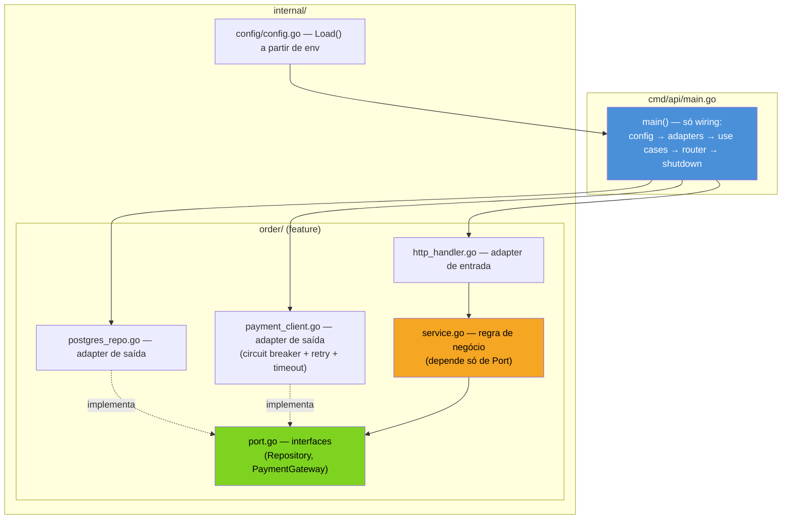

# Um serviço bem estruturado

> [!abstract] TL;DR
> Este capítulo não introduz nada novo — ele **monta** as sete notas anteriores do galho num único esqueleto de serviço, do jeito que um sênior realmente organiza um `cmd/api` em produção: `main.go` fino que só faz *wiring* (lê config, constrói adapters, injeta dependências por construtor, registra rotas, aciona graceful shutdown); portas e casos de uso em `internal/` sem import de framework; adapters HTTP/repositório atrás de interfaces pequenas; um client de saída embrulhado em timeout + retry + circuit breaker antes de qualquer chamada de rede. O produto final é um `service.go` de ~40 linhas que dá pra ler de cima a baixo e entender o serviço inteiro — e é literalmente o molde que o capstone do próximo galho vai encarnar em código completo, testado, rodando.

## O serviço que ninguém consegue ler

Imagine que você entra num serviço Go novo, terceiro dia de trabalho. Abre `main.go` para entender o que ele faz. 400 linhas: parsing de flags misturado com criação de rotas, uma função `setupDatabase()` que também configura logging, um handler HTTP que faz query SQL direto no `switch` do roteador, e um cliente HTTP para o serviço de pagamento chamado sem timeout, sem retry, sem nada — se aquele serviço engasgar, o seu trava junto.

Você não teria como saber disso lendo `main.go`. Teria que rodar em produção, esperar o serviço de pagamento cair uma vez, e ver o efeito dominó ao vivo.

Esse é o serviço que este galho inteiro existiu para evitar. Cada nota anterior deu uma peça:

- a **01** decidiu onde cada arquivo mora (`cmd/`, `internal/`, `pkg/`);
- a **02** decidiu como organizar pacotes dentro de `internal/` (por feature, não por camada técnica solta);
- a **03** decidiu como as dependências chegam a cada struct (injeção por construtor, sem container mágico);
- a **04** decidiu de onde vem a config (env vars, com `Load()` explícito e validação no boot);
- a **05** decidiu onde fica a fronteira entre regra de negócio e infraestrutura (portas e adapters);
- a **06** decidiu o que fazer quando uma dependência externa falha (circuit breaker, retry, timeout);
- a **07** decidiu como esse serviço fala com os outros (HTTP síncrono, gRPC, ou mensageria assíncrona).

Nenhuma dessas notas, isolada, produz um serviço. Esta nota junta as sete numa árvore de arquivos e num `main.go` que qualquer pessoa nova no time consegue ler em cinco minutos — porque cada peça está exatamente onde a convenção do galho diz que ela deveria estar.

## O esqueleto completo



Repare no fluxo de dependência: `main.go` é o único lugar do serviço que conhece **todas** as peças concretas — config, repositório Postgres, cliente HTTP de pagamento, roteador. Todo o resto só conhece interfaces (`Port`) ou é conhecido por elas. Isso não é acidente — é a [[05 - Arquitetura hexagonal e clean em Go|nota 05]] aplicada até o fim: `service.go` (o caso de uso) nunca importa `database/sql`, `net/http` como cliente de saída, nem o SDK de nenhum provedor externo.

## Anatomia de `cmd/api/main.go`

Este é o arquivo mais importante do serviço inteiro, e também o mais curto. Ele não implementa nada — só monta:

```go
// cmd/api/main.go
package main

import (
	"context"
	"log/slog"
	"net/http"
	"os"
	"os/signal"
	"syscall"
	"time"

	"example.com/orders/internal/config"
	"example.com/orders/internal/order"
	"example.com/orders/internal/platform/resilience"
)

func main() {
	logger := slog.New(slog.NewJSONHandler(os.Stdout, nil))

	cfg, err := config.Load()
	if err != nil {
		logger.Error("config inválida", "erro", err)
		os.Exit(1)
	}

	// --- adapters de saída (implementam as portas de order) ---
	db, err := config.OpenDB(cfg.DatabaseURL)
	if err != nil {
		logger.Error("falha ao conectar no banco", "erro", err)
		os.Exit(1)
	}
	defer db.Close()

	paymentClient := order.NewPaymentClient(
		cfg.PaymentServiceURL,
		resilience.NewBreaker("payment-service"),
	)
	repo := order.NewPostgresRepository(db)

	// --- caso de uso, injetado por construtor (nota 03) ---
	svc := order.NewService(repo, paymentClient, logger)

	// --- adapter de entrada ---
	mux := http.NewServeMux() // ServeMux com padrões de rota (Go 1.22+)
	order.RegisterRoutes(mux, svc, logger)

	srv := &http.Server{
		Addr:         cfg.HTTPAddr,
		Handler:      mux,
		ReadTimeout:  5 * time.Second,
		WriteTimeout: 10 * time.Second,
	}

	go func() {
		logger.Info("servidor no ar", "addr", cfg.HTTPAddr)
		if err := srv.ListenAndServe(); err != nil && err != http.ErrServerClosed {
			logger.Error("servidor caiu", "erro", err)
			os.Exit(1)
		}
	}()

	// --- graceful shutdown ---
	ctx, stop := signal.NotifyContext(context.Background(), os.Interrupt, syscall.SIGTERM)
	defer stop()
	<-ctx.Done()

	logger.Info("sinal de encerramento recebido, drenando conexões")
	shutdownCtx, cancel := context.WithTimeout(context.Background(), 10*time.Second)
	defer cancel()
	if err := srv.Shutdown(shutdownCtx); err != nil {
		logger.Error("shutdown forçado", "erro", err)
	}
}
```

> [!info] APIs recentes usadas aqui
> `http.NewServeMux()` ganhou padrões de rota com método e wildcard (`"GET /orders/{id}"`) no Go 1.22 — antes disso, roteamento por método exigia um framework de terceiros ou `switch r.Method`. `log/slog` é biblioteca padrão desde o Go 1.21 — antes, logging estruturado exigia `zap` ou `zerolog`. `signal.NotifyContext` (Go 1.16+) transforma sinais de SO num `context.Context` cancelável, eliminando o padrão antigo de canal + `select` manual para capturar `SIGTERM`.

Leia essas ~50 linhas de cima a baixo e você já sabe: de onde vem a config, quais dependências externas o serviço tem (banco + serviço de pagamento), que a chamada de pagamento passa por um circuit breaker, que rotas existem (delegado a `RegisterRoutes`), e que o processo desliga com folga de 10 segundos para terminar requisições em voo. Nenhuma lógica de negócio aparece aqui — só *wiring*.

## Dentro de `internal/order/`: as camadas se encontram

A pasta da feature reúne tudo que a **02** já havia estabelecido — organização por domínio, não por camada técnica solta (nada de `handlers/`, `repositories/`, `services/` genéricos espalhados pelo projeto inteiro). Dentro dela, porém, a separação por *responsabilidade* continua nítida, arquivo a arquivo:

```go
// internal/order/port.go — as interfaces que o domínio define e a infra implementa
package order

import "context"

type Repository interface {
	Save(ctx context.Context, o Order) error
	FindByID(ctx context.Context, id string) (Order, error)
}

type PaymentGateway interface {
	Charge(ctx context.Context, orderID string, amount int64) error
}
```

```go
// internal/order/service.go — o caso de uso, sem nenhum import de infra
package order

import (
	"context"
	"fmt"
	"log/slog"
)

type Service struct {
	repo    Repository
	payment PaymentGateway
	logger  *slog.Logger
}

func NewService(repo Repository, payment PaymentGateway, logger *slog.Logger) *Service {
	return &Service{repo: repo, payment: payment, logger: logger}
}

func (s *Service) Place(ctx context.Context, o Order) error {
	if err := s.payment.Charge(ctx, o.ID, o.TotalCents); err != nil {
		return fmt.Errorf("cobrança falhou: %w", err)
	}
	if err := s.repo.Save(ctx, o); err != nil {
		return fmt.Errorf("salvar pedido: %w", err)
	}
	s.logger.Info("pedido criado", "id", o.ID)
	return nil
}
```

`Service` não sabe se `Repository` é Postgres, DynamoDB ou um mapa em memória de teste. Não sabe se `PaymentGateway` fala HTTP, gRPC ou fila. Essa ignorância deliberada é o que a **05** chamou de porta — e é o que torna `Service` testável com um `FakeRepository` de dez linhas, sem subir banco nenhum.

## O adapter de entrada: onde a rota vira chamada de caso de uso

O diagrama mostrou `http_handler.go` ao lado de `service.go` — este é o outro lado da fronteira hexagonal, o adapter que traduz uma requisição HTTP em uma chamada ao caso de uso, e o retorno do caso de uso de volta em JSON:

```go
// internal/order/http_handler.go
package order

import (
	"encoding/json"
	"log/slog"
	"net/http"
)

func RegisterRoutes(mux *http.ServeMux, svc *Service, logger *slog.Logger) {
	mux.HandleFunc("POST /orders", handlePlace(svc, logger))
}

type placeRequest struct {
	ID         string `json:"id"`
	TotalCents int64  `json:"total_cents"`
}

func handlePlace(svc *Service, logger *slog.Logger) http.HandlerFunc {
	return func(w http.ResponseWriter, r *http.Request) {
		var req placeRequest
		if err := json.NewDecoder(r.Body).Decode(&req); err != nil {
			http.Error(w, "corpo inválido", http.StatusBadRequest)
			return
		}

		err := svc.Place(r.Context(), Order{ID: req.ID, TotalCents: req.TotalCents})
		if err != nil {
			logger.Error("falha ao criar pedido", "erro", err, "id", req.ID)
			http.Error(w, "não foi possível criar o pedido", http.StatusBadGateway)
			return
		}

		w.WriteHeader(http.StatusCreated)
	}
}
```

Repare no que **não** está aqui: nenhuma query SQL, nenhuma chamada HTTP de saída, nenhuma decisão de retry. O handler faz exatamente três coisas — decodifica a entrada, chama `svc.Place`, traduz o resultado em status HTTP. Toda a complexidade de negócio e de infraestrutura fica do outro lado da chamada.

## O adapter de saída que persiste: `postgres_repo.go`

O par de `paymentClient` no lado da persistência é mais simples porque não precisa de circuit breaker — falha de banco geralmente já propaga como timeout de query, e retentar uma escrita que pode ter parcialmente aplicado é perigoso sem idempotência explícita (fora do escopo deste capítulo). Mesmo assim, ele segue a mesma regra: implementa `Repository`, e é o único lugar do serviço que sabe que existe SQL:

```go
// internal/order/postgres_repo.go
package order

import (
	"context"
	"database/sql"
	"fmt"
)

type postgresRepository struct {
	db *sql.DB
}

func NewPostgresRepository(db *sql.DB) Repository {
	return &postgresRepository{db: db}
}

func (r *postgresRepository) Save(ctx context.Context, o Order) error {
	_, err := r.db.ExecContext(ctx,
		`INSERT INTO orders (id, total_cents) VALUES ($1, $2)`, o.ID, o.TotalCents)
	if err != nil {
		return fmt.Errorf("inserir pedido: %w", err)
	}
	return nil
}

func (r *postgresRepository) FindByID(ctx context.Context, id string) (Order, error) {
	var o Order
	err := r.db.QueryRowContext(ctx,
		`SELECT id, total_cents FROM orders WHERE id = $1`, id).Scan(&o.ID, &o.TotalCents)
	if err != nil {
		return Order{}, fmt.Errorf("buscar pedido %s: %w", id, err)
	}
	return o, nil
}
```

`NewPostgresRepository` retorna `Repository` — a interface, não o tipo concreto `*postgresRepository`. É um detalhe pequeno com efeito grande: `main.go` recebe algo que satisfaz a porta, e o pacote `order` nunca precisa expor `postgresRepository` como tipo exportado. Quem consome esse construtor não tem como, por engano, acoplar-se ao tipo concreto do Postgres.

## O adapter de saída que carrega a resiliência

Aqui é onde a **06** (circuit breaker, retry, timeout) e a **07** (comunicação entre serviços) se encontram fisicamente no código. O client de pagamento **é** um adapter — implementa `PaymentGateway` — e é ele, não o `Service`, que sabe que a chamada de rede pode falhar:

```go
// internal/order/payment_client.go
package order

import (
	"bytes"
	"context"
	"encoding/json"
	"fmt"
	"net/http"
	"time"

	"example.com/orders/internal/platform/resilience"
)

type paymentClient struct {
	baseURL string
	http    *http.Client
	breaker *resilience.Breaker
}

func NewPaymentClient(baseURL string, breaker *resilience.Breaker) PaymentGateway {
	return &paymentClient{
		baseURL: baseURL,
		http:    &http.Client{Timeout: 2 * time.Second},
		breaker: breaker,
	}
}

func (c *paymentClient) Charge(ctx context.Context, orderID string, amount int64) error {
	return c.breaker.Execute(func() error {
		body, _ := json.Marshal(map[string]any{"order_id": orderID, "amount_cents": amount})
		req, err := http.NewRequestWithContext(ctx, http.MethodPost,
			c.baseURL+"/charges", bytes.NewReader(body))
		if err != nil {
			return err
		}
		req.Header.Set("Content-Type", "application/json")

		resp, err := c.http.Do(req)
		if err != nil {
			return err
		}
		defer resp.Body.Close()

		if resp.StatusCode >= 500 {
			return fmt.Errorf("payment-service indisponível: status %d", resp.StatusCode)
		}
		if resp.StatusCode >= 400 {
			return fmt.Errorf("cobrança rejeitada: status %d", resp.StatusCode) // erro de negócio, não abre o breaker
		}
		return nil
	})
}
```

`resilience.Breaker` é o mesmo mecanismo detalhado na [[06 - Resiliência — circuit breaker, retry, timeout|nota 06]] — este arquivo só o **usa**, não o reimplementa. Note a decisão deliberada: erro 4xx (cobrança rejeitada por saldo insuficiente, por exemplo) não deveria contar como falha de disponibilidade para o breaker — só 5xx e erros de rede contam. Misturar os dois faz o breaker abrir por um problema de negócio do cliente, derrubando chamadas legítimas de outros pedidos.

> [!warning] Resiliência pertence ao adapter, não ao caso de uso
> Uma tentação comum é colocar `for tentativas := 0; tentativas < 3; tentativas++` dentro de `Service.Place`. Isso vaza uma decisão de infraestrutura (quantas vezes retentar uma chamada de rede) para dentro da regra de negócio — e torna `Service` impossível de testar sem esperar os retries de verdade. A retentativa, o timeout e o circuit breaker vivem no adapter (`paymentClient`), exatamente onde a chamada de rede acontece. `Service` só vê `error` — sabe que a cobrança falhou, não sabe (nem precisa saber) quantas vezes o adapter tentou por baixo.

## Configuração: um único ponto de verdade

A **04** já estabeleceu o padrão — `Load()` explícito, validação no boot, sem `os.Getenv` espalhado pelo código. Aqui está o `config.go` completo que `main.go` usa:

```go
// internal/config/config.go
package config

import (
	"database/sql"
	"fmt"
	"os"

	_ "github.com/lib/pq"
)

type Config struct {
	HTTPAddr          string
	DatabaseURL       string
	PaymentServiceURL string
}

func Load() (Config, error) {
	cfg := Config{
		HTTPAddr:          envOr("HTTP_ADDR", ":8080"),
		DatabaseURL:       os.Getenv("DATABASE_URL"),
		PaymentServiceURL: os.Getenv("PAYMENT_SERVICE_URL"),
	}
	if cfg.DatabaseURL == "" {
		return Config{}, fmt.Errorf("DATABASE_URL é obrigatória")
	}
	if cfg.PaymentServiceURL == "" {
		return Config{}, fmt.Errorf("PAYMENT_SERVICE_URL é obrigatória")
	}
	return cfg, nil
}

func envOr(key, fallback string) string {
	if v := os.Getenv(key); v != "" {
		return v
	}
	return fallback
}

func OpenDB(url string) (*sql.DB, error) {
	return sql.Open("postgres", url)
}
```

Repare que `os.Getenv` aparece **uma única vez por variável, num único arquivo**. Nenhum outro pacote do serviço chama `os.Getenv` diretamente — todos recebem a config já validada, via construtor, como parâmetro comum. Isso é o que torna o serviço testável sem variável de ambiente nenhuma: um teste de `Service` nunca precisa de `DATABASE_URL` setada, porque `Service` nunca a lê.

## Decisões de sênior: o que este esqueleto assume

Um serviço "bem estruturado" não é neutro — carrega escolhas. Vale nomear as que este esqueleto fez, porque um sênior defende essas escolhas em vez de aplicá-las por hábito:

**Injeção manual, sem container de DI.** A **03** já argumentou isso a fundo: `NewService(repo, payment, logger)` é rastreável com "ir para definição" em qualquer editor. Um container tipo `wire` ou `fx` adiciona uma camada de indireção que só compensa em grafos de dependência muito grandes — a maioria dos microsserviços não chega perto disso.

**Uma porta por dependência externa, não uma porta genérica de "repositório".** `Repository` e `PaymentGateway` são interfaces separadas, cada uma pequena (um a três métodos). Isso segue o princípio de segregação de interface do [Effective Go](https://go.dev/doc/effective_go#interfaces) — interfaces pequenas, definidas do lado de quem consome, não do lado de quem implementa.

**Resiliência no limite do processo, não espalhada.** Circuit breaker e retry aparecem exatamente uma vez por dependência de saída (o `paymentClient`), nunca dentro do caso de uso, nunca duplicados em múltiplos lugares que chamam o mesmo serviço externo.

**`main.go` nunca cresce.** Se `main.go` está prestes a passar de ~80-100 linhas, é sinal de que uma responsabilidade de *wiring* deveria virar uma função nomeada em outro arquivo (`buildRouter(cfg, svc)`, por exemplo) — não que `main.go` deveria "ser mais completo".

> [!question]- Isso não é over-engineering para um serviço pequeno?
> Depende do tamanho real do serviço, e é justo questionar. Para um serviço de verdade pequeno — um CRUD de duas rotas sem dependência externa — a porta `PaymentGateway` seria overhead sem retorno; um único arquivo `main.go` com handlers inline pode ser a escolha certa. O valor deste esqueleto aparece quando o serviço tem pelo menos **uma** dependência externa de rede (banco não conta — é quase universal) e **mais de um desenvolvedor** tocando o código: é aí que a fronteira entre regra de negócio e infraestrutura para de ser estética e começa a evitar bug de acoplamento. Regra prática: comece simples, promova a estrutura completa no momento em que o segundo adapter de saída aparecer.

## Lente cross-stack: o mesmo esqueleto, sotaques diferentes

| Peça | Java (Spring Boot) | Node (Express/NestJS) | Go (este capítulo) |
|---|---|---|---|
| Wiring de dependências | `@Autowired` / container do Spring | container do Nest, ou `new` manual no Express | construtor explícito em `main.go`, sem container |
| Fronteira domínio/infra | interfaces + `@Repository` | interfaces TypeScript + injeção do Nest | `port.go` com interfaces pequenas |
| Config | `application.yml` + `@ConfigurationProperties` | `.env` + `dotenv`/`@nestjs/config` | `Load()` a partir de env vars, validado no boot |
| Resiliência | Resilience4j (`@CircuitBreaker`) como aspecto/anotação | biblioteca tipo `opossum`, envolvendo a chamada | `Breaker.Execute()` explícito, chamado no adapter |
| Ponto de entrada | classe `Application` com `@SpringBootApplication` | `app.listen()` no `main.ts`/`index.js` | `func main()` — sem framework, sem magic |

A diferença mais marcante para quem vem do Spring: não existe anotação nenhuma decidindo o que é injetado onde. Toda a árvore de dependências está escrita, literalmente, em texto plano dentro de `main.go` — o preço é mais verbosidade; o ganho é zero mágica em tempo de execução para depurar.

## Armadilhas comuns

> [!warning] `main.go` que também é handler HTTP
> Se `main.go` tem `mux.HandleFunc("/orders", func(w http.ResponseWriter, r *http.Request) {...})` com lógica de negócio dentro da closure, a separação inteira do capítulo evaporou. Handler HTTP é adapter de entrada — pertence a `http_handler.go` dentro do pacote da feature, chamando `svc.Place(ctx, ...)`, nunca implementando a regra ele mesmo.

> [!warning] Interface grande demais definida do lado errado
> Uma `Repository` com quinze métodos (`Save`, `FindByID`, `FindByEmail`, `FindAll`, `Delete`, `Count`, `Exists`...) geralmente sinaliza que a interface foi copiada de um ORM em vez de desenhada pelo que o caso de uso realmente precisa. Prefira interfaces do tamanho exato do consumo real — Go recompensa interfaces pequenas, e um `Repository` de dois métodos é mais fácil de dublar em teste do que um de quinze.

> [!warning] Config lida em mais de um lugar
> Se `paymentClient` faz `os.Getenv("PAYMENT_SERVICE_URL")` por conta própria em vez de receber a URL como parâmetro do construtor, você tem duas fontes de verdade para a mesma configuração — uma delas vai ficar desatualizada ou inconsistente em algum ambiente, normalmente no pior momento possível.

## Como explicar em inglês

> A well-structured Go service is less about any single pattern and more about where each responsibility physically lives in the file tree. `main.go` stays thin — it only wires things together: load config, build outbound adapters, inject them into the use case via constructor, register routes, wait for a shutdown signal. The use case package never imports a database driver or an HTTP client for outbound calls; it only depends on small interfaces (ports) defined next to it. Resilience — circuit breaker, retry, timeout — belongs inside the adapter that makes the actual network call, never inside the use case itself, so business logic stays testable without waiting on real retries. Configuration is read from environment variables exactly once, in one file, validated at boot, and passed down as plain struct fields — no package reaches for `os.Getenv` on its own. None of this requires a DI container or a framework; it's achievable with constructors, interfaces, and discipline about which package is allowed to import what.

| Termo PT | Termo EN |
|---|---|
| esqueleto do serviço | service skeleton |
| wiring (montagem de dependências) | wiring |
| porta / adapter | port / adapter |
| construtor explícito | explicit constructor |
| ponto único de verdade | single source of truth |
| encerramento gracioso | graceful shutdown |
| adapter de entrada / saída | inbound / outbound adapter |

## O que vem a seguir

Este capítulo fechou o Galho 14 com um esqueleto — arquivos, interfaces, construtores, um `main.go` legível. Mas um esqueleto sem teste é só uma promessa: ele *parece* desacoplado, mas só um teste de verdade prova que `Service` roda sem banco, sem serviço de pagamento real, sem rede nenhuma. O Galho 15 — Testes entra exatamente aí: como testar cada camada deste esqueleto isoladamente (fakes para as portas, testes de integração para os adapters, contract tests para a comunicação entre serviços), e como esse hábito de teste é, ele mesmo, o que valida se a arquitetura hexagonal deste capítulo foi bem aplicada ou só decorativa.

## Veja também

- [[01 - Project layout — cmd, internal, pkg|01 — Project layout]] — onde cada arquivo deste esqueleto mora
- [[02 - Organizando um serviço|02 — Organizando um serviço]] — organização por feature, não por camada técnica
- [[03 - Dependency injection|03 — Dependency injection]] — o padrão de construtor usado em `NewService`, `NewPaymentClient`
- [[04 - Configuração|04 — Configuração]] — o `Load()` completo, com validação e precedência de fontes
- [[05 - Arquitetura hexagonal e clean em Go|05 — Arquitetura hexagonal e clean em Go]] — a fronteira porta/adapter aplicada aqui
- [[06 - Resiliência — circuit breaker, retry, timeout|06 — Resiliência]] — o `resilience.Breaker` usado em `paymentClient`
- [[07 - Comunicação entre serviços|07 — Comunicação entre serviços]] — o protocolo por trás da chamada HTTP de saída
- [[03-Dominios/Tecnologia/Go/index|Trilha Go]]

## Fontes

- The Go Authors. *Effective Go — Interfaces*. go.dev. https://go.dev/doc/effective_go#interfaces (acessado em 2026-07-18)
- The Go Authors. *Go 1.22 Release Notes — Enhanced routing patterns*. go.dev. https://go.dev/doc/go1.22#enhanced_routing_patterns (acessado em 2026-07-18)
- The Go Authors. *Go 1.21 Release Notes — log/slog*. go.dev. https://go.dev/doc/go1.21#log_slog (acessado em 2026-07-18)
- pkg.go.dev. *Package signal — NotifyContext*. pkg.go.dev. https://pkg.go.dev/os/signal#NotifyContext (acessado em 2026-07-18)
- pkg.go.dev. *Package http — Server.Shutdown*. pkg.go.dev. https://pkg.go.dev/net/http#Server.Shutdown (acessado em 2026-07-18)
- Go by Example. *Signals*. gobyexample.com. https://gobyexample.com/signals (acessado em 2026-07-18)
