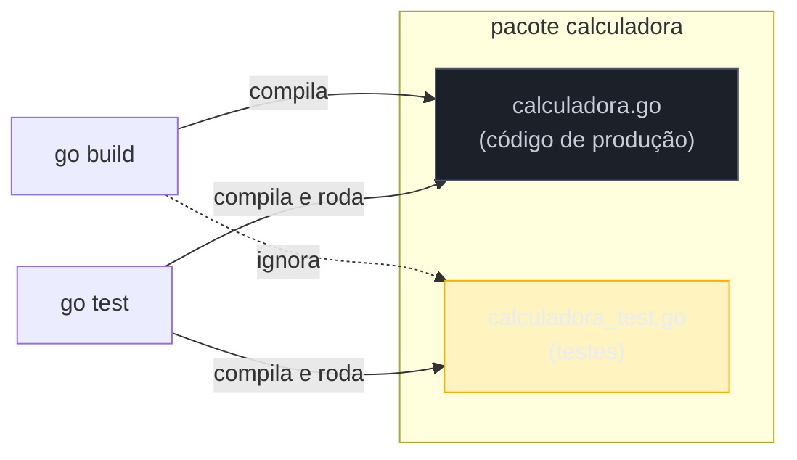
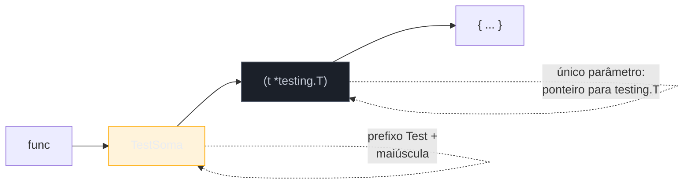

# go test e o primeiro teste

> [!abstract] TL;DR
> Go trata teste como **cidadão de primeira classe da toolchain**, não como biblioteca de terceiros: qualquer arquivo terminado em `_test.go` é automaticamente descoberto e excluído do binário de produção. Dentro dele, uma função `func TestXxx(t *testing.T)` — nome começando com `Test`, maiúscula logo depois, um único parâmetro `*testing.T` — é um teste. `go test ./...` compila e roda todos os testes do módulo, recursivamente, sem configuração prévia. Dentro do teste, `t.Error`/`t.Errorf` reportam falha e **continuam** executando; `t.Fatal`/`t.Fatalf` reportam falha e **abortam** aquela função de teste na hora. Não há framework para instalar, não há arquivo de config para escrever — `go test` já vem embutido no `go` que você instalou para compilar código.

## O problema que o Go resolveu antes de você perceber que tinha

Imagine chegar num projeto Java depois de anos escrevendo scripts em Python. Antes de rodar o primeiro teste, você precisa descobrir: é JUnit 4 ou 5? Tem Mockito na classpath? O build usa Maven ou Gradle, e qual plugin roda os testes (`surefire`? `failsafe`?)? Onde ficam as classes de teste — `src/test/java`, espelhando o pacote da classe testada? Cada resposta é uma decisão de arquitetura que alguém tomou antes de você chegar, e cada uma pode divergir do próximo projeto Java que você abrir.

Em Python a história se repete com outro sotaque: `unittest` da standard library, ou `pytest` (o de fato padrão da comunidade, mas ainda assim uma dependência externa que precisa entrar no `requirements.txt`), rodando via `python -m pytest` ou um `pytest.ini` de configuração.

Go faz uma aposta diferente: **não existe essa pergunta**. Não tem "qual framework de teste este projeto usa" — todo projeto Go usa o pacote `testing`, da standard library, invocado pelo comando `go test`, que já está instalado junto com o compilador. Sem `npm install --save-dev jest`, sem `pip install pytest`, sem escolher entre concorrentes. A ferramenta de teste é parte da definição da linguagem, no mesmo sentido em que `gofmt` formata código sem configuração: uma convenção única, imposta pela toolchain, que elimina uma classe inteira de bikeshedding.

## Onde o teste mora: o sufixo `_test.go`

A convenção começa no nome do arquivo. Um teste para o pacote `calculadora` mora em um arquivo terminado em `_test.go`, normalmente ao lado do código que testa:

```
calculadora/
├── calculadora.go
└── calculadora_test.go
```



O sufixo `_test.go` não é uma convenção de estilo que alguém poderia ignorar — é reconhecido pelo próprio comando `go build`, que **exclui** esses arquivos do binário final. Isso significa uma coisa concreta: o código de teste nunca engorda o artefato que vai para produção, mesmo morando no mesmo diretório, no mesmo pacote, importando os mesmos símbolos internos (não exportados) do código que testa. `go build` nunca vê `calculadora_test.go`; `go test` vê os dois.

> [!info] Go 1.24+: diretório `testdata` também é convenção reconhecida
> Um diretório chamado `testdata` dentro de um pacote é ignorado pelo `go build` e por ferramentas de análise de código-fonte — é o lugar convencional para arquivos fixture (JSON de exemplo, dados de entrada) que os testes leem. Não é sintaxe nova da linguagem, mas vale saber que a mesma lógica de "a toolchain reconhece convenções de teste sem configuração" se estende a dados auxiliares.

## Anatomia de `func TestXxx(t *testing.T)`

Uma função de teste em Go segue uma assinatura rígida, reconhecida pelo comando `go test` por convenção de nome — não por decorator, não por herdar de uma classe base:



Três exigências, todas verificadas pelo `go test` antes de considerar a função um teste:

1. **O nome começa com `Test`**, seguido de uma letra maiúscula (ou nenhuma letra) — `TestSoma` é teste, `Testsoma` **não é** (o `s` minúsculo quebra a convenção e o `go test` simplesmente ignora a função, sem erro).
2. **Um único parâmetro**, do tipo `*testing.T` — um ponteiro para a struct `testing.T`, que carrega todo o estado do teste em execução (se falhou, mensagens acumuladas, etc.) e expõe os métodos que você usa para reportar resultado.
3. **A função não retorna nada.** Reportar sucesso ou falha não acontece via `return`; acontece via chamadas de método em `t`.

```go
package calculadora

import "testing"

func TestSoma(t *testing.T) {
    resultado := Soma(2, 3)
    esperado := 5

    if resultado != esperado {
        t.Errorf("Soma(2, 3) = %d; esperado %d", resultado, esperado)
    }
}
```

Repare no que **não** existe aqui: nenhuma anotação `@Test`, nenhuma classe `CalculadoraTest extends TestCase`, nenhum `describe`/`it` aninhado. `TestSoma` é uma função solta no pacote, do mesmo jeito que qualquer outra função Go — a única coisa que a torna um teste é a assinatura e o nome. Quem vem de JUnit ou Jest sente falta, no primeiro contato, de alguma estrutura de agrupamento; a resposta de Go é: o agrupamento é o **pacote**, e dentro dele, a convenção de nome já basta.

## `t.Error` vs `t.Fatal`: continuar ou abortar

`testing.T` expõe dois pares de métodos para reportar falha, e a diferença entre eles é o primeiro detalhe que trava quem assume, por hábito de outras linguagens, que "toda falha para o teste na hora":

- **`t.Error(args...)` / `t.Errorf(formato, args...)`** — marca o teste como falho e registra a mensagem, mas **a função de teste continua executando** a partir da linha seguinte.
- **`t.Fatal(args...)` / `t.Fatalf(formato, args...)`** — marca o teste como falho, registra a mensagem, e **aborta imediatamente** aquela função de teste (via uma chamada interna a `runtime.Goexit`, não `panic` — a goroutine do teste termina, mas o processo `go test` continua rodando os outros testes normalmente).

```go
func TestValidacao(t *testing.T) {
    usuario, err := CarregarUsuario("123")
    if err != nil {
        t.Fatalf("CarregarUsuario falhou: %v", err) // aborta aqui — sem isso, a linha de baixo faria panic num usuario nil
    }

    if usuario.Nome == "" {
        t.Error("nome do usuário não deveria estar vazio") // reporta e continua
    }

    if usuario.Idade < 0 {
        t.Error("idade não deveria ser negativa") // reporta e continua — as duas checagens abaixo ainda rodam mesmo se esta falhar
    }
}
```

A escolha entre os dois não é estilística — é sobre **dependência lógica** entre as checagens. Se uma checagem posterior só faz sentido (ou só evita um `nil` pointer dereference) quando a anterior passou, use `t.Fatal`. Se as checagens são independentes — várias asserções sobre o mesmo objeto, cada uma informativa por si — use `t.Error`, porque um único `go test` que rode e reporte três falhas de uma vez economiza três rodadas de "corrige, roda de novo, corrige, roda de novo".

> [!warning] `t.Fatal` só funciona na goroutine principal do teste
> Chamar `t.Fatal` (ou `t.FailNow`, que ele usa por baixo) de dentro de uma goroutine lançada pelo próprio teste **não aborta o teste** como se espera — a documentação do pacote `testing` é explícita: `FailNow must be called from the goroutine running the test`. Se você disparar uma goroutine dentro de `TestXxx` e ela encontrar um erro fatal, a saída correta é sinalizar via canal ou `t.Error` (não fatal) e deixar a goroutine principal decidir o que fazer — chamar `t.Fatal` de dentro da goroutine secundária produz comportamento indefinido, não uma parada limpa.

## `go test ./...`: rodando tudo, recursivamente

Com um único arquivo `_test.go`, `go test` (sem argumento, dentro do diretório do pacote) já roda os testes daquele pacote. Mas projetos reais têm dezenas de pacotes, em subdiretórios — e é aí que `./...` entra:

```bash
go test ./...
```

O padrão `./...` é um *wildcard* reconhecido pela toolchain Go (não é sintaxe de shell — o `go` interpreta `...` internamente): significa "o pacote no diretório atual, mais **todos os subdiretórios**, recursivamente". Rodado na raiz de um módulo, `go test ./...` descobre e executa cada teste de cada pacote do projeto inteiro, sem precisar listar diretórios manualmente ou manter um arquivo de configuração dizendo onde os testes moram.

```bash
$ go test ./...
ok      exemplo.com/meuprojeto/calculadora    0.003s
ok      exemplo.com/meuprojeto/validacao      0.002s
FAIL    exemplo.com/meuprojeto/relatorio      0.004s
```

Cada linha corresponde a um **pacote**, não a um teste individual — `go test` roda todos os `TestXxx` daquele pacote e reporta `ok` se todos passaram, `FAIL` se qualquer um falhou (com o detalhe de qual teste e qual `t.Error`/`t.Fatal` disparou, impresso acima do resumo). Para ver o nome de cada teste individualmente, o flag `-v` (*verbose*) lista cada `TestXxx` com `PASS`/`FAIL` próprio:

```bash
go test -v ./...
```

> [!info] `go test` também aceita filtro por nome — `-run`
> `go test -run TestSoma ./...` roda só os testes cujo nome bate com a expressão regular `TestSoma` (casamento parcial, não exato) — útil durante desenvolvimento, quando você não quer esperar a suíte inteira rodar para checar um teste específico que está ajustando.

## Casos práticos

**1. Teste mínimo, verde desde o primeiro `go test`:**

```go
// soma.go
package matematica

func Soma(a, b int) int {
    return a + b
}
```

```go
// soma_test.go
package matematica

import "testing"

func TestSoma(t *testing.T) {
    resultado := Soma(2, 3)
    if resultado != 5 {
        t.Errorf("Soma(2, 3) = %d; esperado 5", resultado)
    }
}
```

```bash
$ go test ./...
ok      exemplo.com/matematica    0.002s
```

**2. Teste que falha — a leitura da saída padrão do `go test`:**

```go
func TestSomaComBug(t *testing.T) {
    resultado := Soma(2, 3)
    if resultado != 6 { // esperado errado de propósito
        t.Errorf("Soma(2, 3) = %d; esperado 6", resultado)
    }
}
```

```bash
$ go test ./...
--- FAIL: TestSomaComBug (0.00s)
    soma_test.go:9: Soma(2, 3) = 5; esperado 6
FAIL
exit status 1
FAIL    exemplo.com/matematica    0.003s
```

Repare que a mensagem de `t.Errorf` aparece com o arquivo e a linha exata (`soma_test.go:9`) de onde veio — o pacote `testing` captura isso automaticamente via `runtime.Caller`, sem você precisar informar nada.

**3. `t.Fatal` evitando um `nil` pointer dereference em cascata:**

```go
type Config struct {
    Timeout int
}

func CarregarConfig(caminho string) (*Config, error) {
    if caminho == "" {
        return nil, fmt.Errorf("caminho vazio")
    }
    return &Config{Timeout: 30}, nil
}

func TestCarregarConfig(t *testing.T) {
    cfg, err := CarregarConfig("config.json")
    if err != nil {
        t.Fatalf("CarregarConfig falhou: %v", err)
        // sem o Fatalf acima, a linha abaixo faria panic
        // caso err != nil e cfg fosse nil
    }

    if cfg.Timeout != 30 {
        t.Errorf("Timeout = %d; esperado 30", cfg.Timeout)
    }
}
```

## Armadilhas comuns

> [!warning] Esquecer o `t` na assinatura, ou trocar `*testing.T` por `testing.T`
> `func TestSoma(testing.T)` (sem nome de parâmetro, ou sem o `*`) não compila como teste válido — a assinatura exata é `func TestXxx(t *testing.T)`, com ponteiro. Um erro de digitação aqui não produz um teste "quebrado que falha" — produz uma função comum que `go test` **nunca descobre**, e o teste simplesmente não roda, silenciosamente, sem aviso de que foi ignorado.

> [!warning] Nome minúsculo depois de `Test` desativa o teste sem erro
> `func Testsoma(t *testing.T)` — sem maiúscula logo após `Test` — não é reconhecido como função de teste pelo `go test`. Não há erro de compilação, não há warning: a função existe, compila, mas nunca é chamada pela suíte. É o tipo de bug silencioso que só aparece quando alguém nota que a cobertura não bateu com o esperado.

> [!warning] `_test.go` sem sufixo correto (ex.: `soma-test.go`) não é reconhecido
> A convenção exige exatamente `_test.go` como sufixo do nome do arquivo — underscore, não hífen. `soma-test.go` é tratado como arquivo de produção comum (e, se tiver `import "testing"` sem uso em código de produção, provavelmente nem compila fora de um contexto de teste).

## Lente cross-stack

| Vindo de... | Em Go |
|---|---|
| JUnit (Java): `@Test`, classe `extends TestCase` ou anotação em classe qualquer | Função solta `func TestXxx(t *testing.T)`, sem classe, sem anotação — a convenção de nome basta |
| pytest (Python): `def test_soma():`, descoberto por prefixo `test_` em arquivo `test_*.py` | Mesmo princípio de descoberta por convenção, mas com sufixo `_test.go` no arquivo e prefixo `Test` + maiúscula na função |
| Jest (Node/JS): `describe`/`it`, precisa `npm install --save-dev jest` | `testing` é da standard library — nenhuma dependência externa para o mecanismo básico funcionar |
| `assertEquals` (JUnit) / `assert` (pytest) | Não existe assert embutido — você compara com `if` e chama `t.Error`/`t.Fatal` manualmente (a [[02 - Table-driven tests|próxima nota]] mostra o padrão idiomático para isso, e a nota 03 traz bibliotecas de asserção como Testify) |

## Como explicar em inglês

> Go treats testing as a first-class part of the toolchain rather than a bolt-on library. Any file ending in `_test.go` is automatically excluded from production builds and picked up by `go test`. Inside it, a function named `TestXxx` — capital letter right after `Test`, taking a single `*testing.T` parameter and returning nothing — is a test, discovered purely by naming convention, with no annotations, no base class, no registration step. `t.Error`/`t.Errorf` record a failure and let the test function keep running; `t.Fatal`/`t.Fatalf` record a failure and abort that test function immediately (but only the current test — the rest of the suite keeps going). Running `go test ./...` from a module's root compiles and runs every test in every package, recursively, with zero configuration files involved.

| Termo PT | Termo EN |
|---|---|
| arquivo de teste | test file |
| função de teste | test function |
| descoberta por convenção | convention-based discovery |
| reportar falha (sem abortar) | report a failure (non-fatal) |
| abortar o teste | abort the test |
| suíte de testes | test suite |
| cobertura de testes | test coverage |
| teste unitário | unit test |

## O que vem a seguir

Comparar `resultado != esperado` com `if` e escrever um `t.Errorf` para cada caso funciona — mas escala mal assim que você precisa testar `Soma` com dez pares de entrada diferentes, ou uma função de validação com meia dúzia de casos de borda. Copiar e colar o mesmo bloco `if`/`t.Errorf` dez vezes é o tipo de repetição que a comunidade Go resolveu com um padrão específico, não com um framework: **table-driven tests**, o assunto da [[02 - Table-driven tests|próxima nota]].

## Veja também

- [[02 - Table-driven tests|02 — Table-driven tests]] — próxima nota do galho
- [[03 - Testify e asserções|03 — Testify e asserções]] — bibliotecas de asserção para reduzir o `if`/`t.Errorf` manual
- [[04 - Test doubles — interfaces e mocks|04 — Test doubles — interfaces e mocks]] — como isolar dependências usando o mesmo sistema de interfaces do resto da linguagem
- [[03-Dominios/Tecnologia/Go/index|Trilha Go]]

## Fontes

- The Go Authors. *Package testing*. pkg.go.dev. https://pkg.go.dev/testing (acessado em 2026-07-18)
- The Go Authors. *Go Command — Test packages*. go.dev. https://go.dev/cmd/go/#hdr-Test_packages (acessado em 2026-07-18)
- The Go Authors. *How to Write Go Code — Testing*. go.dev. https://go.dev/doc/code#Testing (acessado em 2026-07-18)
- Go by Example. *Testing and Benchmarking*. gobyexample.com. https://gobyexample.com/testing-and-benchmarking (acessado em 2026-07-18)
- The Go Blog. *Using Subtests and Sub-benchmarks*. go.dev. https://go.dev/blog/subtests (acessado em 2026-07-18)
