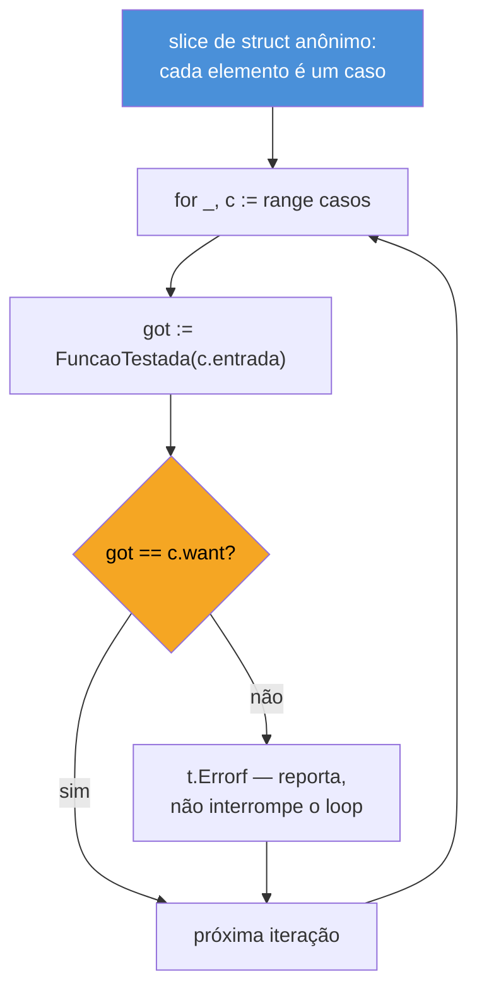
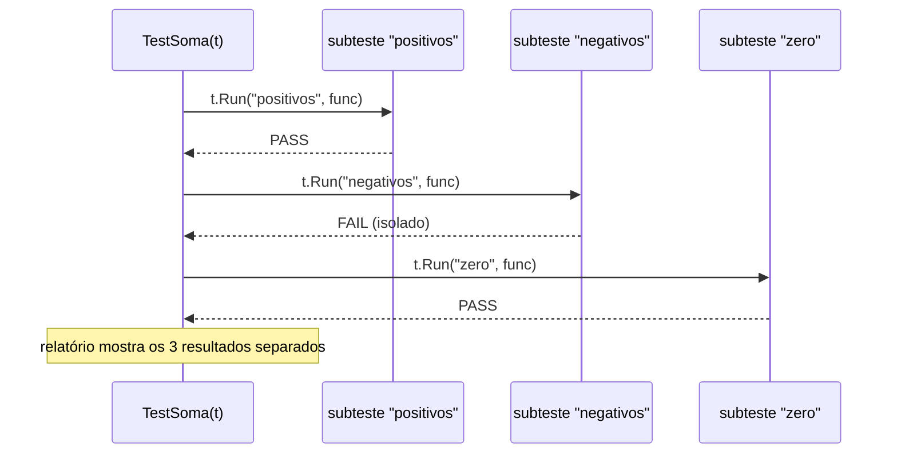

# Table-driven tests

> [!abstract] TL;DR
> **Table-driven test** é o idioma central de testes em Go: em vez de copiar e colar `TestX`, `TestY`, `TestZ` para cada variação de entrada, você declara um **slice de structs** — cada struct é um caso, com campos `input`/`want` (e opcionalmente `name`) — e itera sobre ele com um único `for range` que chama a função testada e compara o resultado. `t.Run(caso.name, func(t *testing.T) {...})` cria um **subteste nomeado** para cada iteração: cada linha da tabela vira uma entrada independente no relatório do `go test`, com falhas isoladas por nome (`TestSoma/negativos`) em vez de um bloco genérico que trava no primeiro erro. O resultado é adicionar um caso novo virando uma linha de dados, não escrever uma função nova — e é por isso que esse padrão domina a cultura de testes de Go a ponto de aparecer em quase todo pacote da standard library.

## O problema que motiva o padrão

Imagine que você acabou de escrever uma função `Soma` — a mesma da nota anterior — e quer testar mais do que um caso feliz. Números positivos, negativos, zero, um único argumento, nenhum argumento. A saída ingênua, escrevendo uma função `Test*` por cenário, é isto:

```go
func TestSomaPositivos(t *testing.T) {
    if got := Soma(2, 3); got != 5 {
        t.Errorf("Soma(2, 3) = %d; want 5", got)
    }
}

func TestSomaNegativos(t *testing.T) {
    if got := Soma(-2, -3); got != -5 {
        t.Errorf("Soma(-2, -3) = %d; want -5", got)
    }
}

func TestSomaZero(t *testing.T) {
    if got := Soma(0, 0); got != 0 {
        t.Errorf("Soma(0, 0) = %d; want 0", got)
    }
}
```

Funciona. Mas repare no que se repete em cada função: a chamada, a comparação, a mensagem de erro — só os números mudam. Cada caso novo significa copiar a função inteira, renomear, trocar os literais, e torcer para não errar a cópia. Em pacotes reais, com dez ou vinte variações de entrada por função testada, esse estilo vira uma parede de funções quase idênticas — o tipo de duplicação que qualquer dev experiente sente como cheiro de código, só que em testes, onde é fácil relaxar o padrão de qualidade porque "é só teste".

Go resolve isso invertendo a pergunta: em vez de "uma função por caso", pergunte "o que muda de caso para caso, e o que é sempre igual?". O que muda são os dados de entrada e o resultado esperado. O que é sempre igual é o mecanismo — chamar a função, comparar, reportar erro. Dados variáveis mais mecanismo fixo é exatamente a forma de um **slice de structs percorrido por um loop**.

## A tabela como slice de structs

```go
func TestSoma(t *testing.T) {
    casos := []struct {
        nome string
        a, b int
        want int
    }{
        {nome: "positivos", a: 2, b: 3, want: 5},
        {nome: "negativos", a: -2, b: -3, want: -5},
        {nome: "zero", a: 0, b: 0, want: 0},
        {nome: "misto", a: -5, b: 10, want: 5},
    }

    for _, c := range casos {
        got := Soma(c.a, c.b)
        if got != c.want {
            t.Errorf("Soma(%d, %d) = %d; want %d", c.a, c.b, got, c.want)
        }
    }
}
```

`casos` é um **struct anônimo** declarado inline dentro de um slice literal — não existe `type CasoDeTeste struct{...}` nomeado em lugar nenhum, porque o tipo só importa dentro desta função de teste. Cada linha do slice literal é um caso: um nome descritivo, as entradas (`a`, `b`) e o resultado esperado (`want`). O `for range` visita cada caso, chama `Soma`, compara com `want`, e reporta erro se divergir — exatamente o mecanismo que se repetia quatro vezes na versão ingênua, agora escrito **uma única vez**.

Adicionar um caso novo — testar `Soma(100, -100)`, por exemplo — vira uma linha nova no slice literal. Nenhuma função nova, nenhum código novo, nenhuma chance de copiar a lógica de comparação errado. É esse ganho — caso novo = dado novo, não código novo — que faz o padrão se espalhar tão rápido pela base de qualquer projeto Go.



Um detalhe que passa despercebido na primeira leitura: `t.Errorf` **não interrompe** o loop (diferente de `t.Fatalf`). Se o caso `"negativos"` falhar, o loop continua para `"zero"` e `"misto"` — o relatório final do `go test` mostra todas as falhas da tabela de uma vez, não só a primeira. Isso importa na prática: sem esse comportamento, corrigir um bug de tabela viraria um ciclo de "roda, corrige um erro, roda de novo, corrige o próximo" — em vez de ver o quadro completo já na primeira execução.

## `t.Run`: dando nome a cada linha da tabela

A tabela acima já resolve a duplicação de código, mas tem uma limitação de relatório: para o `go test`, ela inteira é **um único teste**, `TestSoma`. Se `"negativos"` falhar, a saída de `go test -v` mostra `--- FAIL: TestSoma`, e você só descobre qual caso quebrou lendo a mensagem de erro — não há como rodar `go test -run` filtrando só o caso que falhou, nem como o relatório distinguir "3 de 4 casos passaram" de "tudo falhou".

`t.Run` resolve isso transformando cada iteração em um **subteste** — uma unidade de teste própria, com nome e resultado individual:

```go
func TestSoma(t *testing.T) {
    casos := []struct {
        nome string
        a, b int
        want int
    }{
        {nome: "positivos", a: 2, b: 3, want: 5},
        {nome: "negativos", a: -2, b: -3, want: -5},
        {nome: "zero", a: 0, b: 0, want: 0},
        {nome: "misto", a: -5, b: 10, want: 5},
    }

    for _, c := range casos {
        t.Run(c.nome, func(t *testing.T) {
            got := Soma(c.a, c.b)
            if got != c.want {
                t.Errorf("Soma(%d, %d) = %d; want %d", c.a, c.b, got, c.want)
            }
        })
    }
}
```

`t.Run(nome, func(t *testing.T) {...})` recebe um nome de string e uma função de teste — a mesma assinatura `func(*testing.T)` de qualquer `Test*` de nível superior — e executa essa função como um subteste isolado. O `t` de dentro do closure é um `*testing.T` **próprio do subteste**, diferente do `t` externo: uma falha em `"negativos"` marca só aquele subteste como `FAIL`, sem afetar o relatório de `"positivos"`.



Rodando `go test -v`, cada subteste aparece com um nome composto — `TestSoma/positivos`, `TestSoma/negativos`, `TestSoma/zero`, `TestSoma/misto` — no formato `TestPai/nome_do_subteste` (o `testing` package normaliza espaços do nome para underscore automaticamente). Esse nome composto não é só cosmético: `go test -run TestSoma/negativos` roda **só aquele caso**, isolando exatamente o cenário que está quebrado sem esperar a suíte inteira — decisivo em pacotes com centenas de casos de tabela, onde reexecutar tudo a cada iteração de debug custa tempo real.

> [!warning] Capturar a variável do loop dentro do closure de `t.Run`
> Em versões de Go **anteriores à 1.22**, a variável de iteração do `for range` (`c`, no exemplo) era **reutilizada** a cada volta do loop — todas as closures fechadas sobre `c` acabavam enxergando o valor da *última* iteração, um bug clássico quando `t.Run` roda em paralelo com `t.Parallel()`. A correção era declarar uma cópia local dentro do loop: `c := c` antes de usar `c` no closure.
>
> > [!info] A partir do Go 1.22, cada iteração do `for` cria uma variável nova
> > O [Go 1.22 release notes](https://go.dev/doc/go1.22) mudou a semântica: cada iteração de `for` (inclusive `for range`) agora tem sua **própria** cópia da variável de controle. O código do exemplo acima, sem `c := c`, já é seguro em Go 1.22+. Ainda assim, vale reconhecer o padrão `c := c` (ou `caso := caso`) em código legado ou em bases que ainda travam em versão anterior a 1.22 — é uma cicatriz de linguagem, não um erro de quem escreveu.

## Casos práticos

**1. Tabela testando função com múltiplos tipos de entrada**, incluindo caso de erro esperado:

```go
func Dividir(a, b int) (int, error) {
    if b == 0 {
        return 0, errors.New("divisão por zero")
    }
    return a / b, nil
}

func TestDividir(t *testing.T) {
    casos := []struct {
        nome    string
        a, b    int
        want    int
        wantErr bool
    }{
        {nome: "divisão exata", a: 10, b: 2, want: 5, wantErr: false},
        {nome: "divisão com resto", a: 7, b: 2, want: 3, wantErr: false},
        {nome: "divisão por zero", a: 5, b: 0, want: 0, wantErr: true},
    }

    for _, c := range casos {
        t.Run(c.nome, func(t *testing.T) {
            got, err := Dividir(c.a, c.b)

            if c.wantErr {
                if err == nil {
                    t.Fatalf("Dividir(%d, %d): esperava erro, não obteve nenhum", c.a, c.b)
                }
                return
            }

            if err != nil {
                t.Fatalf("Dividir(%d, %d): erro inesperado: %v", c.a, c.b, err)
            }
            if got != c.want {
                t.Errorf("Dividir(%d, %d) = %d; want %d", c.a, c.b, got, c.want)
            }
        })
    }
}
```

O campo `wantErr bool` é um padrão tão comum em código Go que virou quase uma assinatura visual de teste idiomático — sinaliza, por linha da tabela, se aquele caso deveria produzir erro, sem precisar de uma segunda tabela separada só para os casos de falha.

**2. Tabela com entrada estruturada (struct dentro de struct)**, útil quando a função testada recebe mais do que valores escalares:

```go
type Pedido struct {
    Itens    int
    PrecoUn  float64
}

func Total(p Pedido) float64 {
    return float64(p.Itens) * p.PrecoUn
}

func TestTotal(t *testing.T) {
    casos := []struct {
        nome  string
        input Pedido
        want  float64
    }{
        {nome: "um item", input: Pedido{Itens: 1, PrecoUn: 10.0}, want: 10.0},
        {nome: "vários itens", input: Pedido{Itens: 3, PrecoUn: 2.5}, want: 7.5},
        {nome: "pedido vazio", input: Pedido{Itens: 0, PrecoUn: 99.0}, want: 0},
    }

    for _, c := range casos {
        t.Run(c.nome, func(t *testing.T) {
            got := Total(c.input)
            if got != c.want {
                t.Errorf("Total(%+v) = %.2f; want %.2f", c.input, got, c.want)
            }
        })
    }
}
```

`input Pedido` em vez de campos soltos (`itens int`, `precoUn float64`) simplifica a tabela quando a função testada já recebe um struct — evita achatar de volta em campos escalares só para caber no formato de tabela.

## Armadilhas comuns

> [!warning] Tabela sem `t.Run` perde granularidade de relatório e de filtro
> Um `for range` que só chama `t.Errorf` sem `t.Run` (a primeira versão desta nota) ainda funciona e ainda reporta todas as falhas — mas perde a capacidade de rodar `go test -run TestSoma/negativos` e a clareza do relatório `-v` por nome de caso. Em tabelas com mais de dois ou três casos, vale quase sempre pagar as poucas linhas extras de `t.Run`.

> [!warning] Nome de subteste com espaço ou caractere especial vira ilegível na linha de comando
> `t.Run` normaliza espaços do nome para underscore (`"divisão por zero"` vira `divisão_por_zero`), mas não escapa outros caracteres especiais do shell. Nomes curtos, sem acentuação pesada quando possível, e sem barras (`/`) — que colidem com o separador de hierarquia de subtestes — poupam trabalho na hora de copiar e colar o `-run` de um caso específico.

> [!warning] Tabela gigante sem categorização vira a mesma parede que ela deveria evitar
> Table-driven test resolve duplicação de código, não duplicação de *intenção*. Uma tabela com 40 casos misturando validação de formato, limites numéricos e regras de negócio distintas é tão difícil de manter quanto 40 funções soltas — só que agora comprimida numa única função enorme. Quando os casos de uma tabela começam a testar coisas conceitualmente diferentes, vale dividir em `TestX_Formato`, `TestX_Limites`, `TestX_Regras`, cada uma com sua própria tabela menor e coesa.

## Vindo de outra linguagem

Quem já testou em outras stacks reconhece a ideia — table-driven test é a versão idiomática de Go do que outras linguagens resolvem com ferramentas dedicadas:

| Linguagem | Mecanismo equivalente |
|---|---|
| Java (JUnit 5) | `@ParameterizedTest` + `@CsvSource`/`@MethodSource` |
| Python (pytest) | `@pytest.mark.parametrize` |
| JavaScript (Jest) | `test.each([...])` |
| Go | slice de struct + `for range` + `t.Run` |

A diferença estrutural importa: nas outras linguagens, parametrização é uma **feature do framework de testes**, com anotação ou API dedicada. Em Go, não existe API especial nenhuma — é só um slice comum, um `for range` comum e uma chamada de método (`t.Run`) da standard library. Não precisa de biblioteca externa, não precisa aprender sintaxe nova: é o mesmo `for range` que você já usa em qualquer outro código Go, aplicado a testes. Essa ausência de "mágica" de framework é parte do motivo do padrão ter virado consenso tão rápido na comunidade.

## Como explicar em inglês

> A **table-driven test** is Go's idiomatic pattern for testing multiple input/output combinations without duplicating test logic: you declare a slice of anonymous structs — one struct per case, typically with `name`, input fields, and a `want` field — and iterate over it with a single `for range` loop that calls the function under test and compares the result. Wrapping each iteration in `t.Run(c.name, func(t *testing.T) {...})` turns every row into a named **subtest**: failures are isolated and reported individually (`TestSum/negative_numbers`), and `go test -run TestSum/negative_numbers` can target exactly one case. Adding a new scenario means adding a data row, not writing a new function — which is why this pattern shows up in nearly every package of the standard library and dominates Go's testing culture more than any parametrization API in other languages.

| Termo PT | Termo EN |
|---|---|
| teste orientado a tabela | table-driven test |
| caso de teste | test case |
| subteste | subtest |
| struct anônimo | anonymous struct |
| variável de iteração do loop | loop variable |
| relatório de teste | test report |
| filtrar por nome | filter by name |

## O que vem a seguir

Table-driven tests resolvem a duplicação de código de teste, mas as comparações continuam sendo `if got != want { t.Errorf(...) }` escritas à mão — funcional, mas verboso, principalmente quando `want` é um struct inteiro ou um slice. A [[03 - Testify e asserções|nota 03]] introduz a biblioteca **testify**, que substitui esse `if` manual por chamadas de asserção (`assert.Equal`, `require.NoError`) e mostra como ela se encaixa — ou não — dentro do mesmo padrão de tabela que esta nota estabeleceu.

## Veja também

- [[01 - go test e o primeiro teste|01 — go test e o primeiro teste]] — mecânica básica de `go test`, `t.Errorf` e `t.Fatalf` retomada aqui
- [[03 - Testify e asserções|03 — Testify e asserções]] — próxima nota do galho
- [[04 - Test doubles — interfaces e mocks|04 — Test doubles — interfaces e mocks]] — tabelas de casos combinadas com dublês de interface
- [[03-Dominios/Tecnologia/Go/index|Trilha Go]]

## Fontes

- The Go Authors. *Go Wiki: Table-driven tests*. go.dev. https://go.dev/wiki/TableDrivenTests (acessado em 2026-07-18)
- The Go Authors. *Package testing*. pkg.go.dev. https://pkg.go.dev/testing (acessado em 2026-07-18)
- The Go Authors. *Go 1.22 Release Notes — Fixed for-loop variable semantics*. go.dev. https://go.dev/doc/go1.22 (acessado em 2026-07-18)
- Go by Example. *Testing and Benchmarking*. gobyexample.com. https://gobyexample.com/testing (acessado em 2026-07-18)
