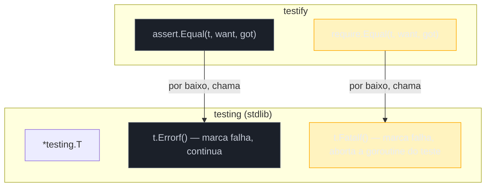

# Testify e asserções

> [!abstract] TL;DR
> A stdlib de Go não tem `assertEquals` — todo teste falha via `t.Errorf`/`t.Fatalf` com uma mensagem que você escreve à mão. Isso é decisão deliberada dos mantenedores, não lacuna esquecida. [Testify](https://github.com/stretchr/testify) preenche essa lacuna com dois pacotes: `assert` (registra a falha e **continua** o teste) e `require` (registra a falha e **aborta** o teste imediatamente, como um `t.Fatalf`). A regra prática: `require` para pré-condições cuja violação torna o resto do teste sem sentido (erro inesperado, ponteiro nil que seria desreferenciado a seguir); `assert` para verificações independentes onde vale reportar todas de uma vez. A comunidade Go se divide sobre usar testify ou stdlib pura — vale entender os dois lados antes de decidir pelo seu time.

## O teste que devolve uma mensagem inútil

Volte ao teste mais simples possível, testando uma função `Soma`:

```go
func TestSoma(t *testing.T) {
    got := Soma(2, 3)
    if got != 5 {
        t.Errorf("Soma(2, 3) = %d; esperado 5", got)
    }
}
```

Isso já é o padrão estabelecido nas notas 01 e 02 deste galho — funciona bem para um `int`. Agora troque o retorno por um struct:

```go
type Pedido struct {
    ID       int
    Total    float64
    Itens    []string
    Cliente  string
}

func TestProcessarPedido(t *testing.T) {
    got := ProcessarPedido(entrada)
    want := Pedido{ID: 1, Total: 42.5, Itens: []string{"caneta", "caderno"}, Cliente: "Ana"}

    if got.ID != want.ID {
        t.Errorf("ID = %d; esperado %d", got.ID, want.ID)
    }
    if got.Total != want.Total {
        t.Errorf("Total = %f; esperado %f", got.Total, want.Total)
    }
    if len(got.Itens) != len(want.Itens) {
        t.Errorf("Itens = %v; esperado %v", got.Itens, want.Itens)
    }
    // ... mais um if por campo, ou reflect.DeepEqual pra comparar tudo de uma vez,
    // mas aí a mensagem de erro vira "got != want" sem dizer QUAL campo diverge.
}
```

Duas saídas ruins: ou você escreve um `if`+`Errorf` por campo (repetitivo, e só o primeiro `Errorf` — se não usar `t.Errorf` continuado — aparece, dependendo de como você estrutura o corte), ou usa `reflect.DeepEqual(got, want)` num único `if` e perde a informação de *qual* campo diverge quando o teste falha. Quem vem de JUnit, Jest ou pytest estranha isso rápido: `assertEquals(want, got)` em Java já produz um diff formatado; `expect(got).toEqual(want)` em Jest também. Go, na stdlib, não tem equivalente — e essa ausência é o motivo de existir o testify.

## O que o testify realmente é

Testify não é um test runner alternativo — ele não substitui `go test` nem a struct `*testing.T`. É uma biblioteca de **helpers de asserção** que recebe `t` como primeiro argumento e decide, internamente, se chama `t.Errorf` ou `t.Fatalf` por baixo:



Cada chamada de `assert.X` ou `require.X` recebe `t` explicitamente — sem mágica de reflection encontrando o `*testing.T` do escopo, sem *global test context* como em alguns frameworks de outras linguagens. Isso é consistente com o resto de Go: nada implícito, tudo passado como valor.

## `assert` vs `require`: a diferença que decide o resto do teste

A diferença entre os dois pacotes é uma linha só, mas as consequências divergem bastante:

- **`assert.Equal(t, want, got)`** registra a falha (equivalente a `t.Errorf`) e **deixa o teste continuar** executando as linhas seguintes.
- **`require.Equal(t, want, got)`** registra a falha (equivalente a `t.Fatalf`) e **aborta o teste imediatamente**, chamando `runtime.Goexit()` na goroutine daquele teste.

```go
import (
    "testing"

    "github.com/stretchr/testify/assert"
    "github.com/stretchr/testify/require"
)

func TestProcessarPedido(t *testing.T) {
    got, err := ProcessarPedido(entrada)

    require.NoError(t, err) // se err != nil, aborta aqui — sem isso, a linha
                             // seguinte desreferencia got.Total num ponteiro nil
    require.NotNil(t, got)

    assert.Equal(t, 1, got.ID)
    assert.Equal(t, 42.5, got.Total)
    assert.Equal(t, []string{"caneta", "caderno"}, got.Itens)
    assert.Equal(t, "Ana", got.Cliente)
}
```

Repare na escolha deliberada: `require.NoError` e `require.NotNil` protegem uma pré-condição — se `ProcessarPedido` devolveu erro, ou devolveu um ponteiro nil, **nenhuma das quatro asserções seguintes faz sentido** e tentar rodá-las provavelmente causaria um panic por nil pointer dereference, que mascararia a causa real da falha atrás de um stack trace confuso. Já as quatro chamadas `assert.Equal` são **independentes** entre si: se `ID` estiver errado, ainda vale saber se `Total`, `Itens` e `Cliente` também estão — rodar `go test` uma vez e ver os quatro problemas de uma vez economiza três ciclos de "corrigir, rodar de novo, achar o próximo erro".

> [!warning] `require` fora da goroutine principal do teste não aborta o teste
> `require.X` chama `t.FailNow()` por baixo, que documenta explicitamente: só pode ser chamado pela goroutine que está rodando a função de teste ou benchmark. Se você chamar `require.Equal` dentro de uma goroutine lançada com `go func() {...}()` dentro do teste, o `FailNow` não aborta o teste — ele registra um comportamento indefinido e a [documentação da stdlib alerta para isso](https://pkg.go.dev/testing#T.FailNow). Nesses casos, colete o erro num canal e valide com `require` de volta na goroutine principal.

### Tabela de decisão rápida

| Situação | Use |
|---|---|
| Erro inesperado que invalidaria o resto do teste | `require.NoError` |
| Ponteiro/slice que será desreferenciado nas linhas seguintes | `require.NotNil` / `require.Len` |
| Verificações de campos independentes de um mesmo resultado | `assert.Equal` (várias, uma por campo) |
| Setup de teste (`TestMain`, helpers chamados no início) | `require` — falha de setup não deve mascarar erros a jusante |
| Loop de sub-testes onde uma falha não deve interromper as demais iterações | `assert` (dentro de cada `t.Run`) |

## Asserções mais usadas

O pacote `assert` (e o espelho `require`, com a mesma API) oferece bem mais que `Equal`:

```go
func TestAssercoesComuns(t *testing.T) {
    var err error
    var lista []int
    var m map[string]int

    assert.NoError(t, err)                      // err == nil
    assert.Error(t, errors.New("boom"))          // err != nil
    assert.True(t, 2+2 == 4)
    assert.False(t, 1 > 2)
    assert.Nil(t, lista)                         // lista == nil
    assert.Empty(t, m)                           // len(m) == 0 (ou nil)
    assert.Len(t, []int{1, 2, 3}, 3)
    assert.Contains(t, "hello world", "world")
    assert.ElementsMatch(t, []int{1, 2, 3}, []int{3, 1, 2}) // mesmos elementos, ordem livre
    assert.WithinDuration(t, time.Now(), time.Now(), time.Second)
    assert.Panics(t, func() { panic("boom") })
    assert.ErrorIs(t, fmt.Errorf("wrap: %w", ErrNaoEncontrado), ErrNaoEncontrado)
}
```

> [!info] `assert.ErrorIs` espelha `errors.Is` da stdlib (Go 1.13+)
> `assert.ErrorIs(t, err, target)` chama internamente `errors.Is` — o mesmo mecanismo de comparação de erros encadeados (*wrapping*) que a nota de erros do Galho 4 cobre em detalhe. Testify não reinventa a comparação de erros; delega pra stdlib e só formata a mensagem de falha.

`assert.Equal` merece uma nota à parte: por baixo, ele usa `ObjectsAreEqual`, que tenta `reflect.DeepEqual` e, para tipos que implementam `[]byte`, compara bytes diretamente. Isso significa que `assert.Equal(t, want, got)` funciona direto em structs, slices e maps aninhados — sem escrever comparação campo a campo — e, quando falha, imprime um **diff formatado** mostrando os dois valores lado a lado, algo que `reflect.DeepEqual` puro na stdlib não faz sozinho.

```go
type Pedido struct {
    ID    int
    Total float64
    Itens []string
}

func TestComparacaoDeStruct(t *testing.T) {
    got := Pedido{ID: 1, Total: 42.5, Itens: []string{"caneta", "caderno"}}
    want := Pedido{ID: 1, Total: 42.5, Itens: []string{"caneta", "lápis"}}

    assert.Equal(t, want, got)
    // saída ao falhar, aproximadamente:
    //   Error:      Not equal:
    //               expected: Pedido{ID:1, Total:42.5, Itens:[]string{"caneta", "lápis"}}
    //               actual  : Pedido{ID:1, Total:42.5, Itens:[]string{"caneta", "caderno"}}
    //
    //               Diff:
    //               --- Expected
    //               +++ Actual
    //               @@ -2,3 +2,3 @@
    //                Total: (float64) 42.5,
    //               -Itens: ([]string) (len=2) {"caneta", "lápis"},
    //               +Itens: ([]string) (len=2) {"caneta", "caderno"},
    }
}
```

É essa saída — apontando exatamente o campo `Itens` como divergente, sem você escrever um `if` por campo — que puxa a maioria dos times pra testify.

## `assert.EqualValues` vs `assert.Equal`: a armadilha do tipo

Uma diferença sutil entre `Equal` e `EqualValues` custa tempo de depuração a quem não a conhece:

```go
func TestEqualVsEqualValues(t *testing.T) {
    var got int32 = 5
    var want int = 5

    assert.Equal(t, want, got)       // FALHA: int(5) != int32(5), tipos diferentes
    assert.EqualValues(t, want, got) // PASSA: converte antes de comparar
}
```

`assert.Equal` usa `reflect.DeepEqual`-like, que considera o **tipo** parte da igualdade — `int(5)` e `int32(5)` são valores diferentes para `reflect.DeepEqual`, mesmo representando o "mesmo número". `assert.EqualValues` converte um dos dois pro tipo do outro antes de comparar. Isso é reflexo direto de como o próprio Go trata tipos — a mesma disciplina de tipos nomeados vista no [[03-Dominios/Tecnologia/Go/02 - Tipos, structs e métodos/02 - Tipos nomeados e definições de tipo|Galho 2]] se propaga até a asserção de teste.

> [!warning] `assert.Equal` com `float64` e ponto flutuante
> `assert.Equal(t, 0.1+0.2, 0.3)` falha, porque `0.1+0.2` não é exatamente `0.3` em ponto flutuante — o mesmo problema de qualquer linguagem com IEEE 754. Para comparações numéricas com tolerância, use `assert.InDelta(t, want, got, tolerancia)` ou `assert.InEpsilon`, nunca `Equal` cru em resultado de cálculo com `float64`.

## Quando a stdlib basta

Nem todo teste precisa de testify. Para comparações simples de valor escalar (`int`, `string`, `bool`), o `if`+`t.Errorf` da stdlib já é claro o suficiente e não adiciona dependência:

```go
func TestSoma(t *testing.T) {
    if got := Soma(2, 3); got != 5 {
        t.Errorf("Soma(2, 3) = %d; esperado 5", got)
    }
}
```

O ganho do testify aparece quando **um destes três fatores** entra em cena:

1. **Comparação de valores compostos** (structs, slices, maps) onde você quer saber qual campo diverge, não só "são diferentes".
2. **Muitas verificações independentes no mesmo teste**, onde `assert` deixa rodar todas e reportar de uma vez, em vez de parar na primeira.
3. **Vocabulário de intenção** — `assert.Contains`, `assert.Panics`, `assert.ErrorIs` deixam o teste mais legível que reescrever a lógica equivalente com `if` e `strings.Contains`/`recover()` manual toda vez.

Para um teste de uma linha comparando dois inteiros, testify é overhead de leitura sem ganho real — é aqui que entra o debate da próxima seção.

## O debate "sem framework" da comunidade Go

Testify é, disparado, a biblioteca de asserção mais usada no ecossistema Go — mas isso não significa consenso. Existe uma corrente vocal, com raízes no próprio time do Go, contra usar *qualquer* biblioteca de asserção, testify incluída.

O argumento mais citado é de Alan Donovan e Brian Kernighan, em *The Go Programming Language*, e ecoado por vários mantenedores da stdlib: um framework de asserção tende a **empobrecer a mensagem de falha**. Compare:

```go
// Com testify:
assert.Equal(t, want, got)
// Saída padrão: "Not equal: expected: ... actual: ..."
// — sempre o mesmo formato genérico, não importa o que está sendo testado.

// Com if + t.Errorf, mensagem escrita à mão:
if got != want {
    t.Errorf("ProcessarPedido(%v) = %v; esperado %v — cliente %q teve total incorreto",
        entrada, got, want, entrada.Cliente)
}
```

A versão manual permite embutir contexto de domínio na mensagem — "cliente teve total incorreto" — que uma asserção genérica não sabe produzir sozinha. Multiplicado por centenas de testes, a diferença entre "mensagem genérica de diff" e "mensagem que já aponta a causa provável" pesa na velocidade de debugar um CI vermelho.

Há também um argumento de **filosofia de linguagem**: Go evita deliberadamente açúcar sintático e "mágica" — é o mesmo espírito que rejeita herança, `try/except` genérico e sobrecarga de operadores. `assert`/`require`, com sua API fluente e reflection por baixo dos panos (`ObjectsAreEqual` usa `reflect.DeepEqual` e checagens de tipo em tempo de execução), soa a alguns mantenedores como um corpo estranho num ecossistema que preza por explicitude e por manter o `testing` package deliberadamente minimalista — decisão dos próprios criadores da linguagem, não acidente.

O contra-argumento, defendido pela maioria esmagadora de times em produção, é pragmático: escrever `if`+`Errorf` à mão para cada campo de cada struct testada é trabalho repetitivo que testify elimina, e a legibilidade ganha com `assert.Contains`/`assert.ElementsMatch` supera a perda pontual de mensagem customizada — principalmente porque testify já formata um diff decente por padrão. Na prática, boa parte dos times de médio/grande porte no ecossistema Go usa testify sem hesitar; o purismo "só stdlib" é mais forte em bibliotecas de baixo nível e na própria stdlib do Go, que naturalmente não depende de módulos externos.

> [!question]- Se testify é tão popular, por que a stdlib nunca ganhou `assert` embutido?
> Porque a filosofia de design do `testing` package é deliberada: Russ Cox e outros mantenedores documentaram publicamente a decisão de manter `testing` mínimo e deixar frameworks de asserção como escolha do ecossistema, não da linguagem — o mesmo padrão usado noutras partes da stdlib (ex.: não hà framework de mock oficial, não há builder de HTTP request "fluente" na stdlib). A proposta de padronizar sub-testes (`t.Run`) foi aceita porque resolvia um problema estrutural (agrupamento e execução seletiva); uma API de asserção resolve um problema estético — e conveniência estética historicamente perde pra "deixa o ecossistema decidir" nas decisões de design do Go.

Duas posições legítimas, sem "certo" absoluto — a decisão real costuma ser de time, não de linguagem. Um ponto de acordo entre as duas correntes: **nunca use `assert` do testify quando a semântica exigida é abortar o teste** — misturar as duas convenções (achar que `assert.NoError` interrompe o teste como `require.NoError` faria) é a fonte mais comum de teste que "passa" mesmo com um erro real, porque as linhas seguintes continuam rodando sobre um valor inválido e só o `assert` de mais embaixo (ou nenhum) capta o problema.

## Mensagem customizada: o `msgAndArgs` no fim da chamada

Toda função de `assert`/`require` aceita um último argumento variádico opcional — `msgAndArgs ...interface{}` — que funciona como um `fmt.Sprintf` anexado à mensagem padrão de falha, sem substituí-la:

```go
func TestComMensagemCustomizada(t *testing.T) {
    cliente := "Ana"
    got := CalcularDesconto(cliente, 100.0)
    want := 90.0

    assert.Equal(t, want, got, "desconto incorreto para cliente %q", cliente)
    // se falhar, a saída combina o diff padrão do testify
    // COM a mensagem customizada, uma embaixo da outra —
    // não é "ou um, ou outro": os dois aparecem juntos.
}
```

Isso responde, em parte, ao argumento de Donovan/Kernighan contra assertion libraries: dá para recuperar contexto de domínio na mensagem sem abrir mão do diff automático do testify. A diferença é que, com `if`+`t.Errorf`, o contexto é a **única** informação disponível; com testify, ele é um **complemento** ao diff que já vem de graça.

## Combinando `assert` com table-driven tests

O padrão mais comum em código Go de produção é `assert` (não `require`) dentro do laço de sub-testes visto na [[02 - Table-driven tests|nota 02]] — porque uma tabela com dez casos deve rodar os dez, mesmo que o terceiro falhe, para o relatório do CI mostrar todas as regressões de uma vez:

```go
func TestCalcularDesconto(t *testing.T) {
    casos := []struct {
        nome     string
        cliente  string
        valor    float64
        querido  float64
    }{
        {nome: "cliente vip", cliente: "Ana", valor: 100.0, querido: 90.0},
        {nome: "cliente comum", cliente: "Bob", valor: 100.0, querido: 100.0},
        {nome: "valor zero", cliente: "Ana", valor: 0.0, querido: 0.0},
    }

    for _, c := range casos {
        t.Run(c.nome, func(t *testing.T) {
            got := CalcularDesconto(c.cliente, c.valor)
            assert.Equal(t, c.querido, got, "caso %q", c.nome)
        })
    }
}
```

Se o segundo caso ("cliente comum") falhar, `t.Run` isola essa falha no seu próprio sub-teste — o terceiro caso ainda roda, e `go test -run TestCalcularDesconto/cliente_comum` continua funcionando para reexecutar só o caso quebrado, exatamente como a nota 02 descreve. Usar `require` aqui dentro faria sentido só se um caso específico precisasse de uma pré-condição (por exemplo, `require.NoError(t, err)` antes de comparar o resultado) — não para a comparação final do valor esperado.

## Lente cross-stack

| Vindo de | Equivalente aproximado |
|---|---|
| Java (JUnit + AssertJ/Hamcrest) | `assertThat(got).isEqualTo(want)` ≈ `assert.Equal(t, want, got)` — mesma ideia de assertion library plugada sobre o runner |
| Python (`pytest`) | `assert got == want` do próprio `pytest` já reescreve a mensagem de erro automaticamente (introspecção de AST); testify precisa da chamada explícita porque Go não reescreve source em tempo de teste |
| JavaScript/TypeScript (Jest/Vitest) | `expect(got).toEqual(want)` ≈ `assert.Equal`; `expect(got).toStrictEqual(want)` se aproxima mais de `assert.Equal` (tipo importa) do que `assert.EqualValues` |
| Node (Chai) | `expect(got).to.deep.equal(want)` — mesma família de "deep equal com diff formatado" que `assert.Equal` do testify oferece |

A diferença estrutural que sobrevive a qualquer comparação: nenhuma dessas linguagens força você a escolher explicitamente entre "continua o teste" e "aborta o teste" no nome da própria função de asserção — Go, via `assert`/`require`, torna essa escolha visível linha a linha, em vez de escondê-la numa flag ou config global do runner.

## Como explicar em inglês

> Go's standard library deliberately ships no assertion helpers — a failing check is always an `if` plus `t.Errorf` (report and continue) or `t.Fatalf` (report and abort), with a message you write by hand. Testify's `assert` package mirrors `t.Errorf` — it flags the failure and lets the test keep running — while `require` mirrors `t.Fatalf`, aborting immediately via `t.FailNow()`. The rule of thumb: use `require` for preconditions whose violation would make the rest of the test meaningless (an unexpected error, a nil pointer you're about to dereference), and `assert` for independent checks where seeing every failure in one run beats stopping at the first. There's a real debate in the Go community about whether to use an assertion library at all — some argue it produces generic failure messages compared to a hand-written `t.Errorf`, in keeping with Go's broader preference for explicitness over convenience — but most production teams adopt testify anyway for the readability and diff output it gives on composite values like structs and slices.

| Termo PT | Termo EN |
|---|---|
| asserção | assertion |
| abortar o teste | fail the test / abort the test |
| pré-condição | precondition |
| verificação independente | independent check |
| mensagem de falha | failure message |
| dublê de teste | test double |
| erro encadeado | wrapped error |

## O que vem a seguir

Testify tem um segundo pacote além de `assert`/`require`, ainda não tocado aqui: `mock`, que gera dublês de teste (*test doubles*) a partir de interfaces — o mecanismo que permite testar um `Service` sem bater no banco de dados real, substituindo a dependência por uma implementação controlada em teste. A [[04 - Test doubles — interfaces e mocks|próxima nota]] entra nesse território: por que interfaces em Go tornam mocking natural sem framework nenhum, quando vale a pena usar `testify/mock` (ou `gomock`) em vez de escrever o *fake* à mão, e onde a comunidade Go traça a linha entre teste unitário isolado e teste que prefere um dublê mais simples.

## Veja também

- [[01 - go test e o primeiro teste|01 — go test e o primeiro teste]] — `t.Errorf`/`t.Fatalf` puros da stdlib, base sobre a qual testify se apoia
- [[02 - Table-driven tests|02 — Table-driven tests]] — cenário onde `assert` dentro de `t.Run` evita que uma falha de caso interrompa os demais casos da tabela
- [[04 - Test doubles — interfaces e mocks|04 — Test doubles — interfaces e mocks]] — próxima nota do galho
- [[03-Dominios/Tecnologia/Go/index|Trilha Go]]

## Fontes

- Stretchr. *testify — README*. GitHub. https://github.com/stretchr/testify (acessado em 2026-07-18)
- The Go Authors. *testing package — T.FailNow*. pkg.go.dev. https://pkg.go.dev/testing#T.FailNow (acessado em 2026-07-18)
- The Go Authors. *errors package — errors.Is*. pkg.go.dev. https://pkg.go.dev/errors#Is (acessado em 2026-07-18)
- The Go Authors. *A Tour of Go — Testing*. go.dev. https://go.dev/tour/ (acessado em 2026-07-18)
- Stretchr. *testify/assert package documentation*. pkg.go.dev. https://pkg.go.dev/github.com/stretchr/testify/assert (acessado em 2026-07-18)
- Stretchr. *testify/require package documentation*. pkg.go.dev. https://pkg.go.dev/github.com/stretchr/testify/require (acessado em 2026-07-18)
