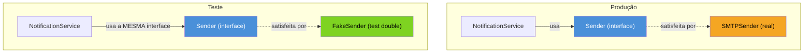
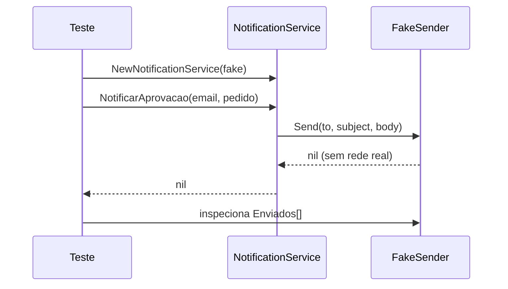

# Test doubles — interfaces e mocks

> [!abstract] TL;DR
> Testar código que depende de e-mail, banco ou API externa não deveria exigir enviar e-mail, subir banco ou chamar API de verdade. A saída em Go não é uma biblioteca de mocking mágica — é **desenhar a dependência como uma interface pequena** e, no teste, trocar a implementação real por um **fake** que satisfaz a mesma interface implicitamente (sem `implements`, sem anotação). `testify/mock` ajuda a escrever fakes com verificação de chamadas quando o esforço manual cresce; `gomock`/`mockery` geram esse código a partir da interface. O idioma central da comunidade Go é *"accept interfaces, return structs"*: quem **consome** a dependência declara a interface mínima de que precisa — não quem a fornece — e isso é exatamente o que torna qualquer struct testável sem reescrever produção.

## O problema: testar código que fala com o mundo

Imagine um `NotificationService` que avisa um usuário por e-mail quando um pedido é aprovado:

```go
package notify

import "net/smtp"

type NotificationService struct {
    smtpHost string
}

func (n *NotificationService) NotificarAprovacao(email, pedido string) error {
    msg := []byte("Subject: Pedido aprovado\n\nSeu pedido " + pedido + " foi aprovado.")
    return smtp.SendMail(n.smtpHost, nil, "pedidos@loja.com", []string{email}, msg)
}
```

Como testar `NotificarAprovacao` sem, de fato, mandar um e-mail a cada `go test`? A tentação inicial é subir um servidor SMTP de teste, ou apontar `smtpHost` para um sandbox — mas isso já é teste de integração (nota seguinte), lento e frágil por depender de rede disponível. Para um teste **unitário** rápido, a pergunta certa é outra: será que `NotificarAprovacao` *precisa* falar com um `smtp.Client` de verdade para provar que a lógica dela está correta? Quase sempre não — ela precisa provar que, dado um e-mail e um pedido, ela **chama o envio de e-mail com os parâmetros certos** e trata erro de envio corretamente. Quem realmente manda o byte pela rede é um detalhe substituível.

É aqui que interface entra — não como recurso de polimorfismo abstrato, mas como um **ponto de corte** deliberado entre "a lógica que quero testar" e "o efeito colateral que não quero pagar no teste".

## O mecanismo: interface como seam

Chame de *seam* (costura) o ponto onde você consegue trocar uma implementação por outra sem tocar no código que a usa. Em Go, esse ponto é sempre uma interface — e, por causa da satisfação implícita (Galho 3), **qualquer tipo que já tenha os métodos certos já satisfaz a interface**, sem precisar declarar isso em lugar nenhum.



Reescrevendo `NotificationService` para depender de uma interface, não do pacote `net/smtp` diretamente:

```go
package notify

// Sender é a interface mínima de que NotificationService precisa —
// definida AQUI, no pacote consumidor, não no pacote que envia e-mail de verdade.
type Sender interface {
    Send(to, subject, body string) error
}

type NotificationService struct {
    sender Sender
}

func NewNotificationService(s Sender) *NotificationService {
    return &NotificationService{sender: s}
}

func (n *NotificationService) NotificarAprovacao(email, pedido string) error {
    return n.sender.Send(email, "Pedido aprovado", "Seu pedido "+pedido+" foi aprovado.")
}
```

`NotificationService` não sabe, e não precisa saber, se `sender` é um cliente SMTP real, uma fila, ou — no teste — uma struct que só grava o que recebeu numa slice. Essa é a inversão central: **a dependência entra pelo construtor** (`NewNotificationService`), em vez de a struct criar a própria dependência internamente. Esse padrão tem nome — *dependency injection* — mas em Go ele raramente precisa de um framework de DI; um parâmetro de construtor já basta.

> [!question]- Por que a interface `Sender` fica no pacote `notify`, e não no pacote que implementa o envio real de e-mail?
> Porque é exatamente essa a diferença entre o idioma Go e o hábito comum em Java/C#, onde a interface costuma morar ao lado da implementação "canônica" (`IEmailSender` num pacote `email`). O [Go Wiki é explícito](https://github.com/golang/go/wiki/CodeReviewComments#interfaces) sobre isso: **"Go interfaces generally belong in the package that uses values of the interface type, not the package that implements those values."** Quem melhor sabe qual é o contrato mínimo necessário é quem consome — não quem fornece. Isso também evita que `notify` precise importar um pacote `email` inteiro (com todas as suas dependências de infraestrutura) só para enxergar uma interface; ele declara sozinho os poucos métodos que usa.

## Mock à mão: o caminho mais simples primeiro

Para uma interface de um ou dois métodos, escrever o fake na mão é o caminho mais direto — sem gerar código, sem biblioteca nova:

```go
package notify

import "testing"

type FakeSender struct {
    Enviados []string // grava cada "to" recebido
    ErroForcado error  // permite simular falha de envio
}

func (f *FakeSender) Send(to, subject, body string) error {
    if f.ErroForcado != nil {
        return f.ErroForcado
    }
    f.Enviados = append(f.Enviados, to)
    return nil
}

func TestNotificarAprovacao(t *testing.T) {
    fake := &FakeSender{}
    svc := NewNotificationService(fake)

    err := svc.NotificarAprovacao("cliente@exemplo.com", "PED-123")

    if err != nil {
        t.Fatalf("erro inesperado: %v", err)
    }
    if len(fake.Enviados) != 1 || fake.Enviados[0] != "cliente@exemplo.com" {
        t.Errorf("esperava envio para cliente@exemplo.com, recebeu %v", fake.Enviados)
    }
}

func TestNotificarAprovacao_ErroDeEnvio(t *testing.T) {
    fake := &FakeSender{ErroForcado: errUnavailable}
    svc := NewNotificationService(fake)

    err := svc.NotificarAprovacao("cliente@exemplo.com", "PED-123")

    if err == nil {
        t.Fatal("esperava erro, recebeu nil")
    }
}
```

`FakeSender` não precisa de nenhuma anotação dizendo "eu implemento `Sender`" — o compilador confirma isso silenciosamente no momento em que `NewNotificationService(fake)` é chamado com um `*FakeSender` onde se espera `Sender`. Se um método faltar ou tiver assinatura errada, o erro aparece ali, na chamada, como qualquer erro de tipo comum.

Repare que os dois testes acima já são **table-driven** em espírito — a nota 02 mostra como consolidá-los numa única tabela de casos quando o número de cenários cresce (sucesso, erro de envio, e-mail vazio, etc.), com `FakeSender` reconfigurado por caso.

> [!warning] Fake, stub, mock: os nomes não são intercambiáveis, mas o compilador Go não se importa
> A literatura de testes (Fowler, *xUnit Test Patterns*) distingue **stub** (retorna valores fixos, sem lógica), **fake** (implementação simplificada mas funcional, como um mapa em memória fazendo de "banco") e **mock** (verifica *como* foi chamado — quantas vezes, com quais argumentos, numa ordem específica). `FakeSender` acima é tecnicamente um híbrido: grava chamadas (traço de mock) mas não impõe expectativas antes da execução. Em Go, a linha entre essas categorias é mais fluida do que em ecossistemas com framework de mock dedicado, porque toda variação é só "mais um campo na struct fake" — não uma API de configuração separada.

## Quando o mock à mão começa a doer: gomock e mockery

Um fake manual para uma interface de um método é trivial. Para uma interface com dez métodos, ou quando você precisa de **expectativas ricas** — "este método deve ser chamado exatamente duas vezes, com este argumento, nesta ordem, e retornar isto na segunda chamada" — escrever isso à mão fica repetitivo e propenso a erro. Duas ferramentas geram esse código a partir da interface:

- **[gomock](https://pkg.go.dev/go.uber.org/mock/gomock)** (mantido pela Uber, sucessor do `golang/mock` arquivado) — gera mocks via `go generate` a partir de uma anotação `//go:generate`, com uma API de expectativas (`EXPECT()`) inspirada em frameworks como Mockito/EasyMock.
- **[mockery](https://vektra.github.io/mockery/)** — gera mocks compatíveis com `testify/mock` (nota 03), lidos por muitos times como mais idiomáticos por se apoiarem no `testify` já em uso.

Exemplo com `gomock`, gerando um mock para `Sender`:

```go
//go:generate go run go.uber.org/mock/mockgen -source=notify.go -destination=mocks_test.go -package=notify

func TestNotificarAprovacao_ComGomock(t *testing.T) {
    ctrl := gomock.NewController(t)
    mockSender := NewMockSender(ctrl) // tipo gerado por mockgen

    mockSender.EXPECT().
        Send("cliente@exemplo.com", "Pedido aprovado", gomock.Any()).
        Return(nil).
        Times(1)

    svc := NewNotificationService(mockSender)
    if err := svc.NotificarAprovacao("cliente@exemplo.com", "PED-123"); err != nil {
        t.Fatalf("erro inesperado: %v", err)
    }
    // ctrl.Finish() é chamado automaticamente via t.Cleanup desde gomock v1.5+
}
```

`ctrl.Finish()` — hoje registrado automaticamente como `t.Cleanup` na versão atual do gomock — falha o teste se `Send` **não** for chamado o número de vezes esperado. Essa é a diferença prática entre um fake manual (que só verifica *depois*, olhando o estado final) e um mock gerado com expectativas (que verifica o *padrão de chamadas* de forma declarativa).

> [!warning] Gerar mock para toda interface é over-engineering
> A tentação, ao instalar `mockgen` ou `mockery`, é gerar mock para tudo. Resista: para interfaces de um ou dois métodos — a maioria em Go idiomático, porque interfaces pequenas são o padrão — o fake manual é mais legível, mais fácil de debugar (é código Go comum, sem geração) e não adiciona dependência de build. Reserve as ferramentas de geração para interfaces genuinamente grandes (clientes de SDK de nuvem, por exemplo) onde escrever o fake à mão seria trabalho puro sem ganho de clareza.

## Injetando o fake: além do construtor simples

O exemplo de `NewNotificationService` injeta a dependência num campo de struct. Isso cobre a maioria dos casos, mas duas variações aparecem com frequência em código real:

**Injeção via campo exportado (para testes que precisam trocar em runtime)** — útil quando o "dono" do valor padrão é o próprio pacote, mas o teste precisa substituí-lo:

```go
type Clock interface {
    Now() time.Time
}

type realClock struct{}
func (realClock) Now() time.Time { return time.Now() }

type Sessao struct {
    Clock Clock // exportado; produção usa realClock{}, teste injeta um fake
}

func NovaSessao() *Sessao {
    return &Sessao{Clock: realClock{}}
}

func (s *Sessao) Expirou(criadaEm time.Time, ttl time.Duration) bool {
    return s.Clock.Now().Sub(criadaEm) > ttl
}
```

```go
type fakeClock struct{ agora time.Time }
func (f fakeClock) Now() time.Time { return f.agora }

func TestSessaoExpirou(t *testing.T) {
    sessao := NovaSessao()
    sessao.Clock = fakeClock{agora: time.Date(2026, 7, 18, 12, 0, 0, 0, time.UTC)}

    criadaEm := time.Date(2026, 7, 18, 10, 0, 0, 0, time.UTC)
    if !sessao.Expirou(criadaEm, time.Hour) {
        t.Error("esperava sessão expirada")
    }
}
```

Isso resolve um problema clássico de teste sem I/O: código que depende de `time.Now()` é normalmente **não determinístico** — rodar o teste em momentos diferentes dá resultados diferentes. Trocar `time.Now()` direto por uma interface `Clock` elimina esse não-determinismo sem tocar rede, disco ou nada externo — é I/O de tempo, não de rede, mas o princípio é idêntico: isole o efeito colateral atrás de uma interface pequena.

**Injeção via função, quando uma interface inteira seria excesso** — Go permite que um único método vire uma interface de um método usando um tipo função, padrão consagrado como `http.HandlerFunc`:

```go
type SendFunc func(to, subject, body string) error

func (f SendFunc) Send(to, subject, body string) error {
    return f(to, subject, body)
}

// No teste, sem struct nenhuma:
svc := NewNotificationService(SendFunc(func(to, subject, body string) error {
    return nil // "envio" sempre bem-sucedido
}))
```

`SendFunc` satisfaz `Sender` porque tem um método `Send` — que só delega para a função guardada. Para casos de teste triviais ("sempre retorna sucesso", "sempre retorna erro X"), isso poupa a declaração de uma struct fake inteira.

## Testando sem I/O real: o caso do repositório

O fio condutor de tudo acima é sempre o mesmo: identifique a fronteira de I/O (rede, disco, relógio, aleatoriedade), coloque uma interface pequena nessa fronteira, injete a implementação real em produção e um double no teste. Isso vale para banco de dados exatamente como valeu para envio de e-mail — só que aqui a tentação de vazar detalhe de infraestrutura na interface é ainda maior, porque `database/sql` tem uma API rica (`*sql.Rows`, `context.Context`, `sql.NullString`) que parece "natural" copiar para a interface.

```go
package pedidos

import (
    "context"
    "errors"
)

type Pedido struct {
    ID     string
    Status string
}

var ErrPedidoNaoEncontrado = errors.New("pedido não encontrado")

// Repositorio expõe só o que o serviço de negócio precisa —
// não os métodos de *sql.DB inteiros.
type Repositorio interface {
    BuscarPorID(ctx context.Context, id string) (Pedido, error)
    Aprovar(ctx context.Context, id string) error
}

type ServicoAprovacao struct {
    repo Repositorio
}

func NewServicoAprovacao(r Repositorio) *ServicoAprovacao {
    return &ServicoAprovacao{repo: r}
}

func (s *ServicoAprovacao) Aprovar(ctx context.Context, id string) error {
    pedido, err := s.repo.BuscarPorID(ctx, id)
    if err != nil {
        return err
    }
    if pedido.Status == "aprovado" {
        return errors.New("pedido já aprovado")
    }
    return s.repo.Aprovar(ctx, id)
}
```

Um fake em memória — sem qualquer `import` de `database/sql` — basta para testar toda a lógica de `Aprovar`:

```go
type RepositorioFake struct {
    Pedidos map[string]Pedido
}

func NovoRepositorioFake() *RepositorioFake {
    return &RepositorioFake{Pedidos: make(map[string]Pedido)}
}

func (r *RepositorioFake) BuscarPorID(ctx context.Context, id string) (Pedido, error) {
    p, ok := r.Pedidos[id]
    if !ok {
        return Pedido{}, ErrPedidoNaoEncontrado
    }
    return p, nil
}

func (r *RepositorioFake) Aprovar(ctx context.Context, id string) error {
    p := r.Pedidos[id]
    p.Status = "aprovado"
    r.Pedidos[id] = p
    return nil
}

func TestServicoAprovacao_Aprovar(t *testing.T) {
    repo := NovoRepositorioFake()
    repo.Pedidos["PED-1"] = Pedido{ID: "PED-1", Status: "pendente"}
    svc := NewServicoAprovacao(repo)

    if err := svc.Aprovar(context.Background(), "PED-1"); err != nil {
        t.Fatalf("erro inesperado: %v", err)
    }
    if repo.Pedidos["PED-1"].Status != "aprovado" {
        t.Errorf("esperava status aprovado, veio %q", repo.Pedidos["PED-1"].Status)
    }
}

func TestServicoAprovacao_JaAprovado(t *testing.T) {
    repo := NovoRepositorioFake()
    repo.Pedidos["PED-1"] = Pedido{ID: "PED-1", Status: "aprovado"}
    svc := NewServicoAprovacao(repo)

    err := svc.Aprovar(context.Background(), "PED-1")
    if err == nil {
        t.Fatal("esperava erro de pedido já aprovado")
    }
}
```

Nenhuma dessas duas execuções abre conexão, cria tabela ou depende de um Postgres rodando — o `RepositorioFake` é só um `map[string]Pedido` fingindo ser persistência. A regra de negócio ("não aprovar pedido já aprovado") é testada com a mesma confiança de um teste contra banco real, porque essa regra vive inteiramente em `ServicoAprovacao.Aprovar`, não no repositório. O que fica de fora — se o driver do Postgres de fato grava a linha, se o índice está certo, se a transação faz rollback direito — é justamente o que a próxima nota cobre com um banco real.

> [!info] `context.Context` no fake não precisa fazer nada
> Note que `RepositorioFake.BuscarPorID` recebe `ctx context.Context` só para satisfazer a assinatura da interface — ele nunca usa cancelamento ou timeout, porque não há I/O de verdade acontecendo. Isso é normal e esperado: o fake implementa o *contrato*, não o comportamento de infraestrutura por trás dele.



Nenhuma linha desse fluxo toca socket, arquivo ou relógio de parede — o teste inteiro roda em memória, em microssegundos, e continua passando num avião sem wi-fi. Isso é o que separa um teste **unitário** (este galho, notas 01-04) de um teste de **integração** (próxima nota): o unitário isola a lógica do sistema atrás de doubles; a integração aceita pagar I/O real justamente para provar que a peça real (driver de banco, cliente HTTP, fila) se comporta como o double prometeu.

## Armadilhas comuns

> [!warning] Mockar o pacote errado — interface grande demais
> Se `Sender` crescer para ter oito métodos porque "o cliente SMTP real tem oito métodos", o fake também precisa implementar oito métodos, e a maioria vira código morto no teste. O sintoma é sempre o mesmo: a interface foi copiada da implementação real, em vez de desenhada a partir do que o **consumidor** de fato chama. Releia a interface periodicamente e pergunte "quais desses métodos `NotificationService` realmente usa?" — a resposta quase sempre é bem menor que a superfície completa da dependência real.

> [!warning] Mock verificando implementação, não comportamento
> Um mock com expectativas rígidas demais (`Send` deve ser chamado exatamente nesta ordem, com este objeto exato) trava no primeiro refactor que reordena chamadas sem mudar o resultado observável. A regra prática: prefira asserção sobre **efeito** (`fake.Enviados` contém o e-mail certo) a asserção sobre **sequência de invocação**, a menos que a ordem seja, ela mesma, parte do contrato que você quer proteger.

> [!warning] Confundir "sem I/O real" com "sem lógica real"
> O double substitui a *dependência externa* (SMTP, banco, relógio) — nunca a lógica que está sob teste. Um `FakeSender` que sempre retorna `nil` sem checar nada é adequado para o caminho feliz, mas se `NotificarAprovacao` tem uma regra de negócio ("não notificar e-mails de teste terminados em `@example.com`"), essa regra continua rodando de verdade dentro de `NotificationService` — o double só remove o efeito colateral, nunca a decisão que o teste quer provar.

## Vindo de outra stack

| Vindo de... | Hábito comum | Em Go |
|---|---|---|
| Java (Mockito) | `@Mock` + `when(...).thenReturn(...)`, reflection sobre a classe real | Fake escrito à mão satisfaz a interface por estrutura; `gomock`/`mockery` cobrem o caso `when/thenReturn` quando vale o custo de gerar código |
| Python (`unittest.mock`) | `patch()` substitui um atributo/módulo em runtime, até em código que não foi desenhado para isso | Go não tem *monkey-patching* (Galho 2, nota 03) — a substituição só é possível porque a dependência já foi desenhada atrás de uma interface; não dá para "remendar" um `import` depois |
| JavaScript/Jest | `jest.mock('./modulo')` reescreve o módulo inteiro automaticamente | Não existe mock automático de pacote em Go; cada seam precisa ser desenhado explicitamente com uma interface — mais fricção inicial, menos mágica escondida no teste |

O padrão em comum, atravessando as três colunas: frameworks com reflection conseguem mockar *qualquer coisa*, até código que não previu ser mockado — e isso é conveniente até o dia em que o mock esconde um acoplamento real. Go força a mão: só é possível "mockar" o que já foi desenhado com uma interface no ponto de corte certo. É mais disciplina no design, mas o custo aparece cedo (na hora de escrever a struct), não tarde (na hora de debugar um mock que substituiu algo inesperado).

## Como explicar em inglês

> In Go, testing code that talks to the outside world doesn't rely on a mocking framework with reflection — it relies on designing the dependency as a **small interface** at the point where the side effect happens, then swapping the real implementation for a **test double** that satisfies the same interface implicitly. The core idiom is "accept interfaces, return structs, and let the consumer define the interface it needs" — the interface for `Sender` lives in the package that calls `Send`, not in the package that implements real email delivery. For a one- or two-method interface, hand-rolling a fake struct is usually clearer than generating one; `gomock` or `mockery` earn their keep once an interface is large enough, or once you need rich call expectations (exact call count, argument matching, ordering). Because Go has no monkey-patching, every seam has to be designed in — there's no way to substitute a dependency that wasn't already exposed behind an interface.

| Termo PT | Termo EN |
|---|---|
| dublê de teste | test double |
| substituto falso | fake |
| simulacro com expectativas | mock |
| ponto de corte / costura | seam |
| injeção de dependência | dependency injection |
| interface consumidora | consumer-defined interface |
| gerar código de mock | generate mock code |
| efeito colateral | side effect |

## O que vem a seguir

Test doubles resolvem o teste **unitário** — provar que `NotificationService` decide certo, sem pagar rede. Mas em algum ponto alguém precisa provar que o `SMTPSender` real, ou o `Repositorio` que fala com Postgres, também funciona de verdade — contra um servidor real, ainda que efêmero. A [[05 - Testes de integração|nota 05]] entra nesse território: quando vale a pena pagar I/O real, como isolar esse teste do resto da suíte (build tags, `testing.Short()`), e como usar containers descartáveis para não depender de infraestrutura externa persistente.

## Veja também

- [[02 - Table-driven tests|02 — Table-driven tests]] — a tabela de casos que costuma envolver cada teste com `FakeSender` reconfigurado por linha
- [[03 - Testify e asserções|03 — Testify e asserções]] — `testify/mock`, base sobre a qual `mockery` gera mocks compatíveis
- [[05 - Testes de integração|05 — Testes de integração]] — próxima nota: quando trocar o double pela dependência real
- [[03-Dominios/Tecnologia/Go/index|Trilha Go]]

## Fontes

- The Go Authors. *Go Wiki — Code Review Comments: Interfaces*. github.com. https://github.com/golang/go/wiki/CodeReviewComments#interfaces (acessado em 2026-07-18)
- The Go Authors. *A Tour of Go — Interfaces*. go.dev. https://go.dev/tour/methods/9 (acessado em 2026-07-18)
- Uber. *gomock — GoDoc*. pkg.go.dev. https://pkg.go.dev/go.uber.org/mock/gomock (acessado em 2026-07-18)
- Vektra. *mockery documentation*. vektra.github.io. https://vektra.github.io/mockery/ (acessado em 2026-07-18)
- The Go Blog. *Package names* (convenções de design de pacote e interface). go.dev. https://go.dev/blog/package-names (acessado em 2026-07-18)
- Go by Example. *Interfaces*. gobyexample.com. https://gobyexample.com/interfaces (acessado em 2026-07-18)
