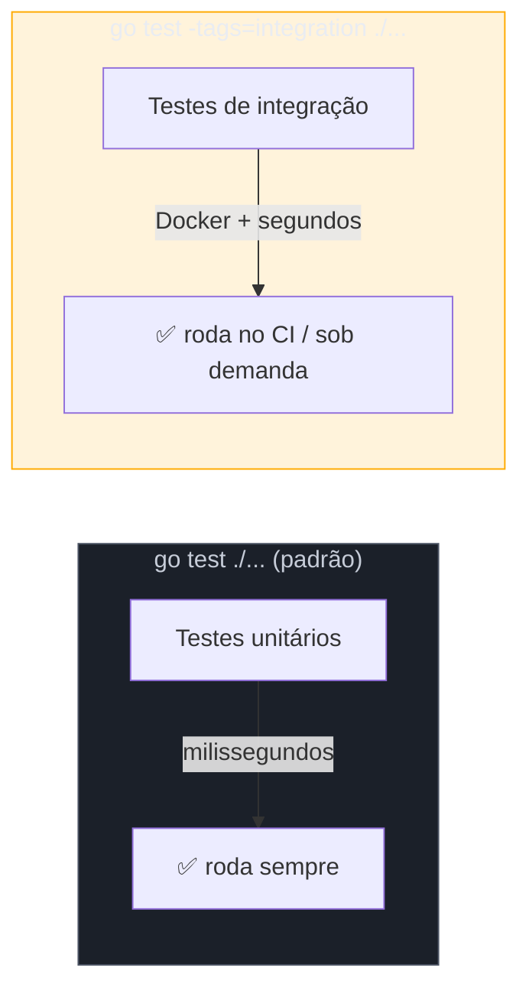
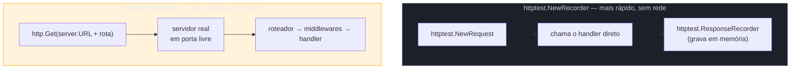
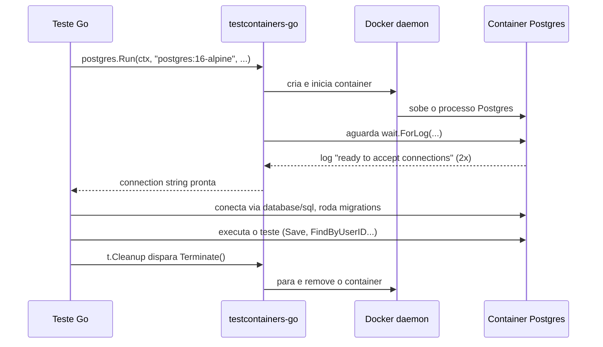

# Testes de integração

> [!abstract] TL;DR
> Testes de integração verificam que as peças **reais** conversam entre si — handler HTTP + roteador, repositório + banco de dados de verdade — em vez de dublês. Go dá dois blocos de construção: `net/http/httptest` sobe um servidor HTTP real (efêmero, em memória, sem porta fixa) para testar handlers ponta a ponta; **testcontainers-go** sobe um container Docker descartável (Postgres, Redis, o que for) para testar contra um banco real, não um mock de SQL. O problema seguinte é logístico: esses testes são lentos e exigem Docker rodando, então não podem correr no mesmo `go test ./...` rápido que os testes unitários. A solução idiomática é a **build tag** `//go:build integration`, que exclui o arquivo da compilação por padrão e só o inclui com `go test -tags=integration`.

## O problema: mock prova pouco

A nota anterior mostrou test doubles — uma interface `Store` com uma fake em memória, injetada num `OrderService`. Isso prova que `OrderService` usa a interface `Store` corretamente. Não prova que a implementação **real** de `Store` — a que fala SQL de verdade com um Postgres de verdade — funciona.

E é exatamente aí que bugs gostam de morar. A query `SELECT * FROM orders WHERE user_id = $1` compila, o mock nunca reclama, mas em produção a coluna se chama `customer_id` — ou o driver espera `?` em vez de `$1`, ou o índice que a query depende não existe, ou a transação vaza uma conexão do pool. Nenhuma dessas coisas aparece num teste que substitui o banco por um `map[int]Order` em memória.

Testes de integração fecham essa lacuna trocando o dublê pela coisa real — só que "real" custa caro: um Postgres leva segundos para subir, ocupa uma porta, exige limpeza entre testes. Se você misturar esse custo com os testes unitários que rodam em milissegundos, `go test ./...` vira um comando que ninguém quer rodar a cada `Ctrl+S`. A resposta de Go para esse dilema não é uma flag de runtime — é uma decisão tomada em **tempo de compilação**.



## Build tags: excluir arquivos da compilação por padrão

Uma **build tag** é um comentário especial, na primeira linha do arquivo (antes até do `package`), que diz ao compilador "só inclua este arquivo se a condição bater":

```go
//go:build integration

package repository

import (
    "context"
    "testing"
)

func TestOrderRepository_Save_Integration(t *testing.T) {
    // ... teste que precisa de um banco real
}
```

> [!info] Sintaxe atual vs legada (Go 1.17+)
> `//go:build integration` é a sintaxe moderna, oficial desde Go 1.17. Código mais antigo usa `// +build integration` (com espaço depois de `//`, sem `go:`) — ainda funciona, mas `gofmt` desde 1.17 insere automaticamente a linha `//go:build` equivalente acima da antiga por compatibilidade. Em código novo, use só `//go:build`.

Duas regras de sintaxe que travam gente na primeira tentativa: a build tag precisa estar na **primeira linha** do arquivo (nem um comentário de licença pode vir antes), e precisa ser seguida por **uma linha em branco** antes do `package`. Sem a linha em branco, o compilador não reconhece a tag como diretiva de build — só vira um comentário qualquer.

Com a tag no lugar, o arquivo `repository_integration_test.go` some do `go test ./...` comum:

```bash
go test ./...                    # não compila nem roda o arquivo com a build tag
go test -tags=integration ./...  # agora inclui o arquivo
```

O nome `integration` não é palavra reservada — é uma tag arbitrária que você inventa e depois referencia com `-tags=integration`. A convenção do ecossistema Go é exatamente essa palavra, mas poderia ser `slow`, `e2e`, qualquer identificador.

> [!warning] Sufixo `_test.go` sozinho não separa nada
> É tentador achar que nomear o arquivo `foo_integration_test.go` já basta. Não basta: o sufixo `_test.go` só diz ao Go "isto é código de teste, compile só durante `go test`" — continua rodando junto com todo o resto sempre que você rodar `go test ./...`, com ou sem sufixo "integration" no nome. Quem exclui o arquivo do build padrão é **exclusivamente** a build tag `//go:build integration` na primeira linha. Nome de arquivo é só uma convenção de leitura para humanos; a separação de fato é a tag.

Uma variação comum em projetos maiores: manter os testes de integração num **subpacote** ou pasta separada (`internal/repository/integrationtest/`), sem sequer precisar de build tag, porque `go test ./...` só entra em subpacotes explicitamente — mas isso não separa "rápido" de "lento" dentro do mesmo pacote, só organiza por localização. A build tag continua sendo a ferramenta certa quando o teste de integração precisa acessar identificadores não exportados do próprio pacote.

## `net/http/httptest`: servidor HTTP real, sem porta fixa

Para testar um handler HTTP, a integração que importa é: será que o roteador de fato despacha essa rota para este handler, com este método, e o handler de fato escreve o corpo e o status certos? Um teste que chama a função Go diretamente (`meuHandler(w, r)`) já cobre a lógica do handler — mas não cobre o roteamento, nem middlewares registrados na cadeia.

`net/http/httptest` resolve isso subindo um servidor HTTP de verdade, num processo real, numa porta livre escolhida pelo sistema operacional — sem você ter que gerenciar porta, nem preocupar com conflito entre testes rodando em paralelo:

```go
package api

import (
    "encoding/json"
    "net/http"
    "net/http/httptest"
    "testing"
)

func TestHealthHandler(t *testing.T) {
    mux := http.NewServeMux()
    mux.HandleFunc("GET /health", healthHandler)

    server := httptest.NewServer(mux)
    defer server.Close()

    resp, err := http.Get(server.URL + "/health")
    if err != nil {
        t.Fatalf("GET /health falhou: %v", err)
    }
    defer resp.Body.Close()

    if resp.StatusCode != http.StatusOK {
        t.Errorf("status = %d, want %d", resp.StatusCode, http.StatusOK)
    }

    var body map[string]string
    if err := json.NewDecoder(resp.Body).Decode(&body); err != nil {
        t.Fatalf("decode do corpo falhou: %v", err)
    }
    if body["status"] != "ok" {
        t.Errorf("status no corpo = %q, want %q", body["status"], "ok")
    }
}

func healthHandler(w http.ResponseWriter, r *http.Request) {
    w.Header().Set("Content-Type", "application/json")
    json.NewEncoder(w).Encode(map[string]string{"status": "ok"})
}
```

> [!info] `GET /health` como padrão de rota (Go 1.22+)
> Registrar `mux.HandleFunc("GET /health", ...)` com o método antes do caminho só funciona a partir do novo `http.ServeMux` da 1.22 — antes disso, `ServeMux` ignorava o método, e restringir por verbo HTTP exigia checagem manual (`if r.Method != http.MethodGet {...}`) dentro do handler. É um dos ganhos silenciosos da stdlib que passam despercebidos por quem aprendeu Go antes de 1.22.

`httptest.NewServer` sobe o servidor de fato — bind numa porta TCP real, `server.URL` já vem preenchido com algo como `http://127.0.0.1:54231`. O `defer server.Close()` é obrigatório: sem ele, a porta fica ocupada até o processo de teste terminar, e testes em paralelo começam a competir por recursos.

Para cenários onde você só quer testar **um** handler sem envolver roteamento nenhum — sem nem precisar de um servidor de verdade escutando em porta — existe uma segunda ferramenta, mais leve: `httptest.NewRecorder`, que grava a resposta em memória:

```go
func TestHealthHandler_SemServidor(t *testing.T) {
    req := httptest.NewRequest(http.MethodGet, "/health", nil)
    rec := httptest.NewRecorder()

    healthHandler(rec, req)

    if rec.Code != http.StatusOK {
        t.Errorf("status = %d, want %d", rec.Code, http.StatusOK)
    }
}
```



A diferença entre os dois é justamente o que se está testando: `NewRecorder` isola o handler (mais próximo de teste unitário — chama a função Go diretamente, sem rede real); `NewServer` testa a cadeia inteira, incluindo se a rota está registrada no lugar certo e se middlewares (autenticação, logging, CORS) participam como esperado. Ambos vivem no mesmo pacote `httptest` porque resolvem o mesmo problema geral em dois níveis de fidelidade — nenhum dos dois exige build tag por si só, já que ambos rodam rápido o suficiente para o `go test` comum. A build tag `integration` entra quando o teste depende de algo externo lento, como um banco real — o assunto da próxima seção.

## testcontainers-go: banco real, descartável, por teste

`httptest` resolve HTTP porque HTTP é fácil de simular em memória — não há disco, não há outro processo. Banco de dados é outra história: emular um Postgres inteiro em memória, com todas as suas peculiaridades de SQL, índices, constraints e comportamento transacional, é praticamente reimplementar o Postgres. A alternativa historicamente usada — SQLite em memória "porque tem SQL parecido" — engana: `NOT NULL`, tipos, `RETURNING`, comportamento de `LIMIT`/`OFFSET` e dezenas de detalhes divergem o suficiente para mascarar bugs reais.

**testcontainers-go** ataca o problema de frente: sobe o banco real — a mesma imagem Docker que roda em produção — como container descartável, só para a duração do teste:

```go
//go:build integration

package repository

import (
    "context"
    "testing"

    "github.com/testcontainers/testcontainers-go"
    "github.com/testcontainers/testcontainers-go/modules/postgres"
    "github.com/testcontainers/testcontainers-go/wait"
)

func setupPostgres(t *testing.T) string {
    t.Helper()
    ctx := context.Background()

    container, err := postgres.Run(ctx,
        "postgres:16-alpine",
        postgres.WithDatabase("testdb"),
        postgres.WithUsername("test"),
        postgres.WithPassword("test"),
        testcontainers.WithWaitStrategy(
            wait.ForLog("database system is ready to accept connections").
                WithOccurrence(2),
        ),
    )
    if err != nil {
        t.Fatalf("subir container do Postgres: %v", err)
    }
    t.Cleanup(func() {
        if err := container.Terminate(ctx); err != nil {
            t.Logf("terminar container: %v", err)
        }
    })

    connStr, err := container.ConnectionString(ctx, "sslmode=disable")
    if err != nil {
        t.Fatalf("obter connection string: %v", err)
    }
    return connStr
}
```

```go
func TestOrderRepository_Save_Integration(t *testing.T) {
    connStr := setupPostgres(t)

    db, err := sql.Open("pgx", connStr)
    if err != nil {
        t.Fatalf("conectar ao banco: %v", err)
    }
    defer db.Close()

    if err := runMigrations(db); err != nil {
        t.Fatalf("rodar migrations: %v", err)
    }

    repo := NewOrderRepository(db)
    order := Order{UserID: 42, Total: 99.90}

    if err := repo.Save(context.Background(), order); err != nil {
        t.Fatalf("Save() retornou erro: %v", err)
    }

    saved, err := repo.FindByUserID(context.Background(), 42)
    if err != nil {
        t.Fatalf("FindByUserID() retornou erro: %v", err)
    }
    if saved.Total != order.Total {
        t.Errorf("Total = %.2f, want %.2f", saved.Total, order.Total)
    }
}
```

Três peças merecem atenção deliberada:

1. **`t.Cleanup`**, não `defer` puro para o `Terminate` — a nota 01 já usou `t.Cleanup` para limpeza; aqui a razão para preferi-lo a `defer` é a mesma: `t.Cleanup` roda mesmo que um `t.Fatalf` no meio do teste interrompa a execução, e roda **antes** de subtestes pais terminarem, na ordem certa mesmo com `t.Parallel()`.
2. **`wait.ForLog(...).WithOccurrence(2)`** — a estratégia de espera. Um container "rodando" não significa "pronto para aceitar conexões"; o Postgres reinicia internamente uma vez durante o boot (daí `WithOccurrence(2)`, esperando a mensagem duas vezes), e testcontainers-go só libera o teste depois que a condição de prontidão bate. Sem isso, o teste tenta conectar cedo demais e falha de forma instável — flaky, não determinístico.
3. **Imagem pinada por tag** (`postgres:16-alpine`), nunca `latest` — testes de integração precisam ser reprodutíveis; uma tag `latest` que muda de versão silenciosamente é uma fonte clássica de "passava ontem, quebra hoje sem eu mudar nada".



Cada teste que chama `setupPostgres(t)` ganha o **próprio** container, isolado dos demais — sem estado vazando entre testes, sem precisar de `TRUNCATE` manual entre casos. O custo é tempo: subir um container leva de 1 a alguns segundos, contra microssegundos de um mock. É exatamente esse custo que justifica a build tag `integration` — ninguém quer pagar segundos a cada `go test` durante o ciclo de escrever-salvar-rodar de um teste unitário qualquer.

> [!warning] Docker precisa estar rodando — e o CI precisa saber disso
> testcontainers-go fala com o Docker daemon local (ou um Docker remoto configurado via `DOCKER_HOST`). Sem Docker disponível, o teste falha na criação do container, não na lógica de negócio — um erro fácil de confundir com bug real na primeira vez que acontece. Em CI, isso significa garantir que o runner tenha Docker-in-Docker ou acesso ao socket do Docker do host (GitHub Actions já vem com Docker pronto por padrão nos runners `ubuntu-latest`; outros provedores podem exigir configuração extra).

## Separando unit de integração no dia a dia

Juntando build tags, `httptest` e testcontainers-go, o fluxo de um projeto Go maduro geralmente fica assim:

```bash
# desenvolvimento local, ciclo rápido — só unitários
go test ./...

# antes de abrir PR, ou no CI — inclui integração
go test -tags=integration ./...

# só os testes de integração, com verbose, para depurar um específico
go test -tags=integration -run TestOrderRepository_Save_Integration -v ./...
```

No `Makefile` ou script de CI, é comum nomear os dois alvos explicitamente:

```makefile
.PHONY: test test-integration

test:
	go test ./...

test-integration:
	go test -tags=integration ./...
```

E no pipeline de CI, rodar `test` em todo push (rápido, dá feedback em segundos) e `test-integration` só em PRs contra a branch principal, ou numa etapa separada — aceitando que ela demora mais e depende de Docker estar disponível no runner.

> [!question]- E o race detector, `go test -race`? Entra em qual dos dois?
> `-race` (o assunto completo é do Galho 9, sobre concorrência) é ortogonal à separação unit/integração — é uma flag de instrumentação que detecta acesso concorrente não sincronizado, independente de o teste ser rápido ou lento. A prática comum é rodar `go test -race ./...` nos testes unitários (mais rápido, já dá cobertura de concorrência no dia a dia) e também `go test -race -tags=integration ./...` no CI antes de merge, já que bugs de race em código que fala com banco real — pool de conexões, por exemplo — só aparecem sob carga real. Não são a mesma decisão: build tag separa "precisa de infraestrutura externa"; `-race` separa "quero instrumentação de concorrência", e as duas podem coexistir na mesma chamada de `go test`.

## Vindo de outras stacks

| Vindo de... | Equivalente familiar | Diferença em Go |
|---|---|---|
| Java/Spring | `@SpringBootTest` + Testcontainers (JUnit) | Mesma biblioteca testcontainers, porta Go; separação unit/integração via Maven profiles ou tags JUnit vira build tag no compilador |
| Node/Jest | `jest.config.js` com `testPathIgnorePatterns` ou projetos separados | Em Go a separação é em tempo de **compilação**, não de runtime — o arquivo nem existe no binário de teste padrão |
| Python/pytest | `@pytest.mark.integration` + `pytest -m "not integration"` | Marker é metadado interpretado em runtime; build tag é resolvida antes de qualquer teste rodar |

A diferença de fundo, em todos os casos: build tags do Go excluem o **código-fonte** da compilação, não apenas pulam a execução de um teste já compilado. Isso significa zero overhead — nem o binário de teste padrão contém os símbolos dos testes de integração.

## Armadilhas comuns

> [!warning] Esquecer a linha em branco depois de `//go:build`
> `//go:build integration` colado direto em cima de `package foo`, sem linha vazia entre os dois, faz o Go tratar a diretiva como comentário comum — o arquivo passa a compilar **sempre**, quebrando a separação sem erro nenhum de compilação. `go vet` costuma pegar isso, mas vale checar visualmente.

> [!warning] Container que não sobe a tempo gera teste flaky, não erro claro
> Sem uma estratégia de espera adequada (`wait.ForLog`, `wait.ForListeningPort`, etc.), o teste pode tentar conectar antes do banco estar pronto — falha intermitente, difícil de reproduzir localmente porque a máquina do desenvolvedor costuma ser mais rápida (ou mais lenta) que o runner de CI. Sempre declare uma estratégia de espera explícita; nunca confie em "o container geralmente sobe rápido".

> [!warning] Testes de integração compartilhando estado entre si
> Se dois testes de integração usam o **mesmo** container (para economizar o custo de subir vários), qualquer dado inserido por um teste pode vazar para o outro, quebrando o isolamento e criando dependência de ordem de execução. A abordagem mais segura — a usada nos exemplos desta nota — é um container novo por teste via `t.Cleanup`; quando o custo disso for proibitivo, a alternativa é compartilhar o container mas isolar por transação com rollback, ou truncar tabelas explicitamente entre casos.

## Como explicar em inglês

> Go separates fast unit tests from slow integration tests using **build tags** — a `//go:build integration` directive on the first line of a file (followed by a blank line) that excludes the file from compilation unless you pass `-tags=integration` to `go test`. This is a compile-time exclusion, not a runtime skip: the integration test code isn't even part of the default test binary. For HTTP handlers, `net/http/httptest` spins up either an in-memory `ResponseRecorder` (fastest, tests just the handler function) or a real `httptest.Server` bound to an OS-assigned port (tests routing and middleware too). For database-dependent code, **testcontainers-go** launches the real database — the same Docker image running in production — as a disposable container scoped to a single test via `t.Cleanup`, avoiding the false confidence of an in-memory stand-in like SQLite that behaves differently enough to hide real bugs. The day-to-day workflow runs `go test ./...` during development and `go test -tags=integration ./...` in CI or before merging, accepting the extra seconds in exchange for testing against the real thing.

| Termo PT | Termo EN |
|---|---|
| build tag | build tag |
| tag de compilação | build constraint |
| teste de integração | integration test |
| container descartável | disposable container |
| estratégia de espera | wait strategy |
| estado vazando entre testes | test state leaking |
| isolamento de teste | test isolation |
| feedback rápido | fast feedback |

## O que vem a seguir

Com unit tests, table-driven tests, asserções via testify, dublês e agora integração cobertos, falta uma pergunta diferente: como Go mede **performance**, não correção? A [[06 - Benchmarks|nota 06]] introduz `func BenchmarkX(b *testing.B)`, a métrica `ns/op`, e como comparar duas implementações de forma estatisticamente honesta — o primeiro passo antes de otimizar qualquer coisa em código Go real.

## Veja também

- [[01 - go test e o primeiro teste|01 — go test e o primeiro teste]] — `t.Cleanup`, a base sobre a qual este capítulo constrói a limpeza de containers
- [[02 - Table-driven tests|02 — Table-driven tests]] — padrão de organização de casos, aplicável também dentro de testes de integração
- [[03 - Testify e asserções|03 — Testify e asserções]] — asserções mais expressivas, úteis também nos testes desta nota
- [[04 - Test doubles — interfaces e mocks|04 — Test doubles — interfaces e mocks]] — o contraponto: quando um dublê já basta, sem pagar o custo de um container
- [[06 - Benchmarks|06 — Benchmarks]] — próxima nota do galho
- [[03-Dominios/Tecnologia/Go/index|Trilha Go]]

## Fontes

- The Go Authors. *Build constraints*. pkg.go.dev/cmd/go. https://pkg.go.dev/cmd/go#hdr-Build_constraints (acessado em 2026-07-18)
- The Go Authors. *Package httptest*. pkg.go.dev. https://pkg.go.dev/net/http/httptest (acessado em 2026-07-18)
- Testcontainers. *Testcontainers for Go*. testcontainers.com. https://golang.testcontainers.org/ (acessado em 2026-07-18)
- Testcontainers. *Postgres module*. testcontainers.com. https://golang.testcontainers.org/modules/postgres/ (acessado em 2026-07-18)
- The Go Authors. *Go 1.22 Release Notes — Enhanced routing patterns*. go.dev. https://go.dev/doc/go1.22#enhanced_routing_patterns (acessado em 2026-07-18)
- The Go Authors. *Go 1.17 Release Notes — go:build lines*. go.dev. https://go.dev/doc/go1.17#build-lines (acessado em 2026-07-18)

