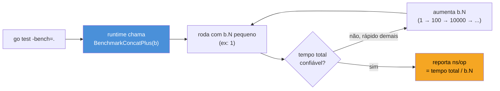

# Benchmarks

> [!abstract] TL;DR
> Um benchmark em Go é uma função `func BenchmarkXxx(b *testing.B)` que roda o código-alvo dentro de um laço `for i := 0; i < b.N; i++`. O runtime **ajusta `b.N` sozinho**, repetindo a execução até ter uma amostra estatisticamente estável, e reporta tempo por operação (`ns/op`), alocações (`allocs/op`) e bytes alocados (`B/op`). `go test -bench=.` roda os benchmarks; `-benchmem` acrescenta as métricas de alocação; `-count=N` gera N amostras para comparação estatística com `benchstat`. A regra de ouro, que este capítulo repete até doer: **nunca otimize sem medir antes e depois** — intuição sobre "o que é lento" em Go erra com frequência incômoda, e sem benchmark você não tem como provar que uma mudança ajudou (ou piorou).

## O problema que o benchmark resolve

Imagine que você tem duas formas de concatenar strings num laço — uma com `+=` e outra com `strings.Builder` — e alguém no code review pergunta: "isso não fica mais lento com `+=`?". A resposta intuitiva é "sim, óbvio, `string` é imutável em Go, cada `+=` realoca tudo". Mas *quanto* mais lento? Duas vezes? Cem vezes? Importa para o seu caso, com 10 itens, ou só importa com 10 milhões?

Sem número, essa conversa vira palpite contra palpite. E pior: às vezes a intuição está simplesmente errada — o compilador Go aplica otimizações (como inlining e escape analysis) que tornam certos códigos "obviamente lentos" tão rápidos quanto a alternativa "obviamente rápida". A única forma de sair do terreno do palpite é medir, com uma ferramenta que rode o mesmo código repetidas vezes, isolando o ruído de execução única (cache frio, scheduler do SO, garbage collector entrando no meio).

É exatamente esse instrumento que o `testing.B` do Go oferece — nativo, sem dependência externa, ao lado do `testing.T` que a [[01 - go test e o primeiro teste|nota 01]] já apresentou.

## Anatomia de um benchmark

A assinatura espelha a de um teste, trocando `*testing.T` por `*testing.B` e o prefixo `Test` por `Bench`:

```go
func BenchmarkConcatPlus(b *testing.B) {
    for i := 0; i < b.N; i++ {
        s := ""
        for j := 0; j < 100; j++ {
            s += "x"
        }
    }
}
```



O detalhe que costuma confundir quem lê `b.N` pela primeira vez: **você não escolhe o valor de `b.N`**. O framework de testing começa com um valor pequeno, mede quanto tempo o laço levou, e recalibra — dobrando `b.N` repetidamente — até que a execução total dure tempo suficiente (por padrão, cerca de 1 segundo) para produzir uma medida estável. Isso resolve um problema real de benchmarking manual: rodar o código uma vez só e cronometrar é ruído puro, porque overhead de startup, cache miss e scheduling dominam medições curtas. Rodar `b.N` vezes até acumular um segundo de execução dilui esse ruído.

O resultado, ao rodar `go test -bench=. -benchmem`, é uma linha assim:

```
BenchmarkConcatPlus-8      50000    23481 ns/op    4832 B/op    99 allocs/op
```

Da esquerda pra direita: nome do benchmark seguido do número de GOMAXPROCS (`-8`), quantas iterações `b.N` acabou usando (`50000`), tempo médio por iteração (`23481 ns/op`), bytes alocados por iteração (`4832 B/op`) e número de alocações por iteração (`99 allocs/op`) — as duas últimas só aparecem com a flag `-benchmem`.

> [!question]- Por que `ns/op` e não o tempo total?
> Porque o tempo total depende de `b.N`, que o framework escolheu sozinho e que varia entre execuções (máquina mais ou menos carregada, por exemplo). `ns/op` normaliza isso — é `tempo_total / b.N` — e por isso é a métrica comparável entre execuções diferentes, entre máquinas diferentes, e entre implementações diferentes do mesmo benchmark.

## Rodando benchmarks: `go test -bench`

Por padrão, `go test` **não roda benchmarks** — só testes. É preciso pedir explicitamente com a flag `-bench`, que recebe uma expressão regular casada contra o nome dos benchmarks:

```bash
go test -bench=.                    # roda todos os benchmarks do pacote
go test -bench=ConcatPlus           # só os que casam com "ConcatPlus"
go test -bench=. -benchmem          # + métricas de alocação
go test -bench=. -benchtime=3s      # roda cada benchmark por ~3s em vez de ~1s
go test -bench=. -run=^$            # roda só benchmarks, pula testes (-run não casa nada)
```

> [!warning] `-run=^$` evita que testes normais rodem junto
> Sem `-run=^$`, `go test -bench=.` roda **testes e benchmarks** no mesmo comando — o que normalmente é inofensivo, mas polui a saída e desperdiça tempo se você só quer o número do benchmark. `-run=^$` é uma expressão regular que não casa com nenhum nome de teste, então a fase de testes fica vazia e só os benchmarks executam.

Cada benchmark roda isoladamente do ponto de vista de calibração de `b.N`, mas todos compartilham o mesmo processo `go test` — então, se um benchmark aloca memória de forma persistente (por exemplo, escreve num slice de pacote), pode contaminar a medição do próximo. Isso raramente é um problema na prática, mas vale saber que o isolamento é por execução do laço, não por processo do SO.

## `b.ResetTimer`: separando setup de medição

Nem todo benchmark é só o código-alvo dentro do laço. Às vezes é preciso montar uma estrutura de dados antes de medir — e esse setup não deveria contar no tempo reportado:

```go
func BenchmarkBuscaEmMapa(b *testing.B) {
    m := make(map[int]string, 10000)
    for i := 0; i < 10000; i++ {
        m[i] = fmt.Sprintf("valor-%d", i)
    }

    b.ResetTimer() // zera o cronômetro: o setup acima não conta

    for i := 0; i < b.N; i++ {
        _ = m[5000]
    }
}
```

Sem `b.ResetTimer()`, o tempo de popular o `map` com 10 mil entradas entraria na primeira iteração do laço, distorcendo a média — especialmente se `b.N` acabar pequeno. `b.ResetTimer()` diz ao framework "esqueça o que já rodou, comece a contar daqui". Existe também `b.StopTimer()` / `b.StartTimer()` para pausar a medição no *meio* do laço, útil quando cada iteração precisa recriar algum estado caro antes da operação medida:

```go
func BenchmarkProcessarComReset(b *testing.B) {
    for i := 0; i < b.N; i++ {
        b.StopTimer()
        dados := prepararDadosCaros() // não deve contar
        b.StartTimer()

        Processar(dados)
    }
}
```

> [!warning] `StopTimer`/`StartTimer` dentro do laço tem custo próprio
> Pausar e retomar o cronômetro a cada iteração adiciona overhead de medição, que em benchmarks de operações muito rápidas (nanossegundos) pode distorcer o resultado mais do que o setup que você estava tentando excluir. Prefira `b.ResetTimer()` uma vez, antes do laço, sempre que o setup puder ser feito de uma vez só fora dele — é a forma mais barata e mais comum na prática.

## Sub-benchmarks e `b.Run`

Assim como testes ganham variações com `t.Run` na [[02 - Table-driven tests|nota 02]], benchmarks ganham `b.Run` — útil para comparar implementações lado a lado no mesmo arquivo, com nomes que aparecem hierarquicamente na saída:

```go
func BenchmarkConcat(b *testing.B) {
    b.Run("plus", func(b *testing.B) {
        for i := 0; i < b.N; i++ {
            s := ""
            for j := 0; j < 100; j++ {
                s += "x"
            }
        }
    })

    b.Run("builder", func(b *testing.B) {
        for i := 0; i < b.N; i++ {
            var sb strings.Builder
            for j := 0; j < 100; j++ {
                sb.WriteString("x")
            }
            _ = sb.String()
        }
    })
}
```

```
BenchmarkConcat/plus-8       50000    23481 ns/op    4832 B/op    99 allocs/op
BenchmarkConcat/builder-8   500000     2814 ns/op     248 B/op     5 allocs/op
```

O número fala por si: `strings.Builder` é quase 10× mais rápido e aloca 20× menos vezes, porque reutiliza um buffer interno em vez de realocar uma nova string a cada `+=`. Essa é exatamente a conversa de code review da abertura — resolvida com dado, não com opinião.

## Casos práticos

**1. Benchmark de função pura**, o caso mais simples — sem setup, sem estado externo:

```go
func Fibonacci(n int) int {
    if n < 2 {
        return n
    }
    a, b := 0, 1
    for i := 2; i <= n; i++ {
        a, b = b, a+b
    }
    return b
}

func BenchmarkFibonacci(b *testing.B) {
    for i := 0; i < b.N; i++ {
        Fibonacci(30)
    }
}
```

**2. Benchmark com setup e `ResetTimer`**, comparando busca em `map` contra busca linear em slice:

```go
func BenchmarkBuscaMap(b *testing.B) {
    m := make(map[int]bool, 1000)
    for i := 0; i < 1000; i++ {
        m[i] = true
    }
    b.ResetTimer()

    for i := 0; i < b.N; i++ {
        _ = m[500]
    }
}

func BenchmarkBuscaSlice(b *testing.B) {
    s := make([]int, 1000)
    for i := range s {
        s[i] = i
    }
    b.ResetTimer()

    for i := 0; i < b.N; i++ {
        for _, v := range s {
            if v == 500 {
                break
            }
        }
    }
}
```

**3. Benchmark parametrizado com `b.Run`**, medindo o efeito do tamanho da entrada — padrão comum para caracterizar complexidade real, não só teórica:

```go
func BenchmarkOrdenar(b *testing.B) {
    tamanhos := []int{100, 1000, 10000}

    for _, n := range tamanhos {
        b.Run(fmt.Sprintf("n=%d", n), func(b *testing.B) {
            dados := make([]int, n)
            for i := range dados {
                dados[i] = n - i
            }

            for i := 0; i < b.N; i++ {
                copia := make([]int, len(dados))
                copy(copia, dados)
                b.StartTimer()
                sort.Ints(copia)
                b.StopTimer()
            }
        })
    }
}
```

> [!info] `testing.B.Loop()` — Go 1.24+
> Go 1.24 introduziu `for b.Loop() { ... }` como alternativa a `for i := 0; i < b.N; i++`. `b.Loop()` chama `ResetTimer` automaticamente na primeira iteração (descartando o setup anterior) e evita que o compilador elimine por engano código considerado "morto" dentro do laço — um problema real de benchmarks mal escritos, onde o otimizador percebe que o resultado do laço nunca é usado e apaga o trabalho inteiro. Para código que roda em módulos travados numa versão anterior, `b.N` continua funcionando exatamente como descrito neste capítulo — não é obsoleto, só ficou com uma alternativa mais segura.

## Comparando amostras com `benchstat`

Um único número de `ns/op` tem ruído — variação de máquina, de scheduler, de estado do cache. Comparar "antes: 23481 ns/op" com "depois: 21900 ns/op" a olho nu não diz se a diferença é real ou só flutuação estatística. A ferramenta oficial para essa comparação é o [`benchstat`](https://pkg.go.dev/golang.org/x/perf/cmd/benchstat), que roda múltiplas amostras e reporta se a diferença é estatisticamente significativa:

```bash
go install golang.org/x/perf/cmd/benchstat@latest

# amostra "antes" (múltiplas execuções, -count reduz ruído)
go test -bench=BenchmarkConcat -benchmem -count=10 ./... > antes.txt

# faça a mudança no código, então amostra "depois"
go test -bench=BenchmarkConcat -benchmem -count=10 ./... > depois.txt

benchstat antes.txt depois.txt
```

Saída típica:

```
name              old time/op    new time/op    delta
Concat/plus-8       23.5µs ± 2%    23.4µs ± 3%   ~     (p=0.353 n=10+10)
Concat/builder-8    2.81µs ± 1%    1.95µs ± 2%  -30.6%  (p=0.000 n=10+10)
```

`delta` marcado com `~` significa "sem diferença estatisticamente significativa" — a variação observada é ruído. `-30.6%` com `p=0.000` significa "diferença real, com alta confiança". Esse `p-value` é o que separa "acho que melhorou" de "melhorou, e aqui está a evidência" — a mesma disciplina de qualquer experimento controlado, aplicada a performance de código.

> [!warning] `-count=1` (o padrão) não dá margem estatística nenhuma
> Rodar `go test -bench=.` sem `-count` produz **uma amostra por benchmark**. Isso é suficiente para uma checagem rápida de sanidade, mas insuficiente para alimentar `benchstat` de forma confiável — sem múltiplas amostras, não há como o `benchstat` calcular variância nem `p-value`. Para qualquer comparação que vá embasar uma decisão real ("essa PR melhora performance?"), use `-count=10` (ou mais) dos dois lados.

## Meça antes de otimizar

Este é o princípio que amarra o capítulo inteiro, e vale repetir porque a tentação de "otimizar de olho" é forte: **escreva o benchmark antes de mudar o código, não depois**. A sequência disciplinada é:

1. Identifique o hot path suspeito (via profiling — assunto do galho 16 — ou via relato real de lentidão, nunca só "acho que isso deve ser lento").
2. Escreva um benchmark que isola exatamente essa operação.
3. Rode com `-count=10`, guarde o resultado (`antes.txt`).
4. Aplique a otimização.
5. Rode de novo, compare com `benchstat`.
6. Se a diferença não for estatisticamente significativa, a "otimização" não otimizou nada — reverta, porque você só adicionou complexidade sem ganho medido.

> [!warning] Intuição sobre performance em Go erra mais do que se espera
> O compilador aplica escape analysis, inlining e outras otimizações que mudam completamente o comportamento esperado de código "obviamente lento". Um exemplo clássico: pré-alocar um slice com `make([]T, 0, n)` em vez de `var s []T` costuma ajudar — mas *quanto* ajuda depende de `n`, do tipo `T`, e às vezes o ganho é irrelevante perto de outros gargalos do programa. Sem medir, você está adivinhando às cegas — e otimização adivinhada tem o hábito de piorar legibilidade sem melhorar nada que importe no perfil real de uso.

Este capítulo cobre só a escrita e a comparação do benchmark. Descobrir *onde* olhar — qual função realmente domina o tempo de execução de um programa inteiro, com `pprof` e flame graphs — é o assunto do galho seguinte, sobre profiling e otimização.

## Vindo de outras linguagens

| Linguagem | Ferramenta de benchmark | Onde Go diverge |
|---|---|---|
| Java | JMH (Java Microbenchmark Harness) | JMH é biblioteca externa com forte proteção contra dead-code elimination via `Blackhole`; `testing.B` é builtin, mais simples, com proteção mais fraca (por isso `b.Loop()` foi criado no 1.24) |
| Python | `timeit`, `pytest-benchmark` | `timeit` roda no REPL/script, sem integração com o runner de testes; Go integra benchmark ao mesmo `go test` que roda testes, com o mesmo `go.mod` |
| Node.js | `benchmark.js`, `tinybench` | bibliotecas de terceiros, sem padrão builtin; Go tem `testing.B` na standard library desde sempre |

A mensagem para quem migra: se você já confiava em JMH ou `pytest-benchmark` para decisões de performance, o hábito de "sempre medir, nunca supor" se transporta direto — só a ferramenta muda, e para melhor no quesito integração (mesmo comando, mesmo arquivo `_test.go`, sem dependência extra para o caso básico).

## Como explicar em inglês

> A Go benchmark is a function `func BenchmarkXxx(b *testing.B)` that runs the code under test inside a loop up to `b.N` — a count the testing framework calibrates automatically, growing it until the total run lasts roughly a second, long enough to produce a stable measurement. Run benchmarks with `go test -bench=.` (they're skipped by default) and add `-benchmem` to report allocations per operation alongside time per operation. When setup work shouldn't count toward the measurement, call `b.ResetTimer()` before the loop. To compare two versions with statistical confidence rather than eyeballing a single number, take multiple samples with `-count=10` on both sides and diff them with `benchstat`, which reports whether a delta is real or just noise. The discipline that matters more than any flag: write the benchmark *before* changing the code, and treat any optimization that doesn't move the needle in `benchstat` output as unproven — Go's compiler optimizations make intuition about "what's slow" wrong often enough that guessing isn't a substitute for measuring.

| Termo PT | Termo EN |
|---|---|
| benchmark | benchmark |
| ponto de referência | baseline |
| tempo por operação | time per operation (ns/op) |
| alocações por operação | allocations per operation (allocs/op) |
| calibração automática | automatic calibration |
| amostra | sample |
| significância estatística | statistical significance |
| medir antes de otimizar | measure before optimizing |
| caminho quente | hot path |

## O que vem a seguir

Benchmark mede *quanto tempo* uma operação isolada leva — mas não diz nada sobre *entradas que você não pensou em testar*. A [[07 - Fuzzing|nota 07]] entra num tipo de teste bem diferente: em vez de você escolher os casos (como no table-driven da nota 02), o motor de fuzzing do Go gera entradas automaticamente, tentando ativamente quebrar a função com valores que um humano dificilmente pensaria em escrever — string vazia, bytes inválidos de UTF-8, números no limite de overflow.

## Veja também

- [[01 - go test e o primeiro teste|01 — go test e o primeiro teste]] — a base do `go test` sobre a qual `-bench` se apoia
- [[02 - Table-driven tests|02 — Table-driven tests]] — `t.Run` e o padrão de sub-testes que `b.Run` espelha para benchmarks
- [[05 - Testes de integração|05 — Testes de integração]] — nota anterior do galho, fase Adepto
- [[07 - Fuzzing|07 — Fuzzing]] — próxima nota do galho
- [[03-Dominios/Tecnologia/Go/index|Trilha Go]]

## Fontes

- The Go Authors. *Package testing*. pkg.go.dev. https://pkg.go.dev/testing (acessado em 2026-07-18)
- The Go Authors. *Go 1.24 Release Notes — testing.B.Loop*. go.dev. https://go.dev/doc/go1.24#testing (acessado em 2026-07-18)
- Go by Example. *Testing and Benchmarking*. gobyexample.com. https://gobyexample.com/testing-and-benchmarking (acessado em 2026-07-18)
- The Go Authors. *golang.org/x/perf/cmd/benchstat*. pkg.go.dev. https://pkg.go.dev/golang.org/x/perf/cmd/benchstat (acessado em 2026-07-18)
- Dave Cheney. *How to write benchmarks in Go*. dave.cheney.net. https://dave.cheney.net/2013/06/30/how-to-write-benchmarks-in-go (acessado em 2026-07-18)
