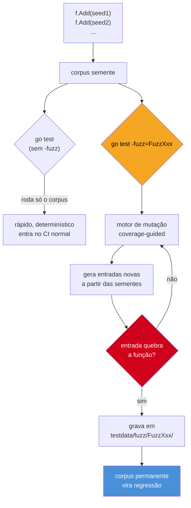

# Fuzzing

> [!abstract] TL;DR
> **Fuzzing** é testar uma função alimentando-a com entradas geradas automaticamente, em vez de só as que você lembrou de escrever. Desde a 1.18, Go tem suporte nativo: uma **fuzz function** — `func FuzzXxx(f *testing.F)` — declara um **corpus semente** com `f.Add(...)` e chama `f.Fuzz(func(t *testing.T, args...) {...})` com a lógica de verificação. `go test` roda só o corpus semente (rápido, determinístico, entra no CI normal); `go test -fuzz=FuzzXxx` liga o motor de mutação, que gera entradas novas a partir das sementes e agressivamente procura panics, falhas de asserção ou (com `-race`) data races. Toda entrada que quebra vira um arquivo em `testdata/fuzz/FuzzXxx/` — corpus permanente, versionado, que passa a rodar em todo `go test` daí em diante. Fuzzing paga onde entrada é hostil ou variada demais para você imaginar todos os casos: parsers, decoders, formatos serializados, qualquer função que trata bytes vindos de fora do seu controle.

## O teste que você não escreveria

Imagine uma função que decodifica um formato de mensagem simples — um cabeçalho de tamanho seguido do payload:

```go
func ParseMessage(data []byte) (string, error) {
    if len(data) < 4 {
        return "", errors.New("mensagem curta demais")
    }
    size := int(data[0])<<24 | int(data[1])<<16 | int(data[2])<<8 | int(data[3])
    payload := data[4 : 4+size] // e se size for maior que len(data)-4?
    return string(payload), nil
}
```

Um teste table-driven razoável cobre "mensagem vazia", "tamanho zero", "payload normal". Nenhum humano, escrevendo casos à mão, tropeça de propósito em `size = 2147483647` vindo de 4 bytes maliciosos — mas é exatamente isso que faz `data[4 : 4+size]` estourar com `slice bounds out of range`, um panic em produção sempre que alguém mandar um cabeçalho corrompido.

Esse é o buraco que table-driven tests não cobrem por construção: eles testam os casos que **você já pensou**. Fuzzing testa os que você não pensou — gerando entradas automaticamente, mutando bytes, e reportando qualquer uma que derrube a função. Não é adivinhação cega: o motor de fuzzing do Go usa *coverage-guided fuzzing* — ele instrumenta o código, observa quais caminhos cada entrada exercita, e prioriza mutações que descobrem caminho novo. Uma entrada que abre um `if` inédito é mais "interessante" que uma que repete o caminho de sempre, e o motor investe mais mutação nela.

## `func FuzzXxx(f *testing.F)`: anatomia

> [!info] Fuzzing nativo é Go 1.18+
> Antes da 1.18, fuzzing em Go exigia ferramentas externas (`go-fuzz`, entre outras) fora do toolchain padrão. Desde a 1.18, `go test` sabe reconhecer e rodar fuzz functions nativamente, sem dependência externa — parte do mesmo pacote `testing` usado por `go test` comum e por benchmarks.

Uma fuzz function segue uma convenção de nome própria — `FuzzXxx`, análoga a `TestXxx` e `BenchmarkXxx`, mas com assinatura diferente: recebe `*testing.F`, não `*testing.T`.

```go
package msgparser

import "testing"

func FuzzParseMessage(f *testing.F) {
    // corpus semente — casos que você já conhece
    f.Add([]byte{0, 0, 0, 0})
    f.Add([]byte{0, 0, 0, 3, 'a', 'b', 'c'})
    f.Add([]byte{})

    f.Fuzz(func(t *testing.T, data []byte) {
        // não checa o VALOR do resultado — checa que a função não quebra
        _, _ = ParseMessage(data)
    })
}
```

Duas partes distintas, cada uma com um papel:

1. **`f.Add(...)`** — declara o **corpus semente** (*seed corpus*). São entradas conhecidas, escritas por você, que servem de ponto de partida para as mutações. Tudo que você colocaria num teste table-driven cabe aqui como semente.
2. **`f.Fuzz(func(t *testing.T, args ...) {...})`** — a função alvo, chamada uma vez por entrada (seed ou mutada). Recebe `*testing.T` — dentro dela você usa `t.Fatal`, `t.Errorf`, tudo que já é familiar de teste comum.



O detalhe que costuma confundir: **o mesmo `FuzzXxx` roda em dois modos**, e o modo depende de como você invoca `go test`, não de nada escrito no código.

## Dois modos: `go test` normal vs `-fuzz`

Sem a flag `-fuzz`, `go test` trata `FuzzParseMessage` como um teste comum: executa `f.Fuzz(...)` uma vez para cada entrada do corpus semente (as que vieram de `f.Add`, mais qualquer arquivo já salvo em `testdata/fuzz/`), e para. Rápido, previsível, sem aleatoriedade — por isso é seguro deixar rodando em todo `go test ./...` do CI, junto dos testes normais.

```bash
go test ./...
# roda FuzzParseMessage só com o corpus semente — sem mutação
```

Com `-fuzz=FuzzParseMessage`, o motor liga de verdade: gera entradas mutadas continuamente, cada uma derivada do corpus (semente + achados anteriores), até encontrar uma falha ou até o tempo/execuções configurados esgotarem.

```bash
go test -fuzz=FuzzParseMessage -fuzztime=30s
# ou, sem -fuzztime, roda até Ctrl+C ou até achar uma falha
```

> [!warning] `-fuzz` roda um `FuzzXxx` por vez, e só localmente
> `go test -fuzz` exige o nome exato de uma fuzz function e não paraleliza contra outras fuzz functions do mesmo pacote — se o pacote tem `FuzzParseMessage` e `FuzzParseHeader`, cada `-fuzz` mira uma de cada vez. Além disso, o modo mutação normalmente **não roda no CI** (é longo, não-determinístico por natureza) — o padrão da comunidade Go é rodar `-fuzz` localmente ou em job dedicado de tempo limitado, e deixar o CI comum rodar só o corpus já descoberto via `go test` sem flag.

Quando o motor encontra uma entrada que derruba `f.Fuzz`, ele para, imprime a falha e grava a entrada em disco — automaticamente.

## O corpus: semente e achados

`testdata/fuzz/FuzzParseMessage/` é onde os achados do fuzzing viram arquivos permanentes. Depois de uma sessão de `-fuzz` que encontrou o bug do `size` malicioso, o diretório fica assim:

```
msgparser/
├── parse.go
├── parse_test.go
└── testdata/
    └── fuzz/
        └── FuzzParseMessage/
            └── a3f9e1c2b8d47e60
```

Cada arquivo é uma entrada individual, num formato de texto simples que codifica os argumentos da fuzz function:

```
go test fuzz v1
[]byte("\x00\x00\x00\x7f")
```

A partir daí, esse arquivo **entra no corpus permanente**: todo `go test` (mesmo sem `-fuzz`) passa a executá-lo, junto das sementes de `f.Add`. Isso transforma o achado em **teste de regressão automático** — o bug que o fuzzing descobriu ontem não pode voltar silenciosamente amanhã, porque agora há um arquivo versionado garantindo que aquela entrada específica seja testada para sempre.

> [!info] `testdata/fuzz/` deve ir para o controle de versão
> É tentador tratar `testdata/` como artefato descartável, mas o corpus de fuzzing é valioso: representa horas de busca automática já feitas. Comitar `testdata/fuzz/FuzzXxx/` no git preserva esse trabalho — quem clonar o repo herda o corpus, e o CI roda todos os achados anteriores sem precisar refazer o fuzzing do zero.

O corpus semente (`f.Add`) e o corpus de achados (`testdata/fuzz/`) se complementam: sementes guiam o motor para regiões interessantes do espaço de entrada logo de saída (sem elas, o motor começa de bytes aleatórios e demora mais para achar algo relevante); achados capturam o que o motor descobriu e o tornam parte permanente da suíte.

## Minimização automática da falha

Antes de gravar o arquivo em `testdata/fuzz/`, o motor faz algo a mais que só "salvar a primeira entrada que quebrou": ele tenta **minimizar** — encurtar e simplificar a entrada, testando variações menores, enquanto a falha continuar reproduzindo. Se `FuzzParseMessage` quebra com uma sequência de 400 bytes gerada por mutações sucessivas, o processo de minimização tenta cortar bytes, zerar campos, simplificar — até achar (dentro do orçamento de tempo configurado) a entrada mínima que ainda reproduz o mesmo crash.

O motivo prático: uma entrada de 400 bytes aleatórios diz pouco sobre *por que* a função quebrou; uma entrada de 4 bytes (`\x00\x00\x00\x7f` no exemplo de `ParseMessage`) aponta direto para a causa. `-fuzzminimizetime` controla o orçamento dedicado a esse encurtamento (padrão `60s`); `-fuzzminimizetime=0` desliga a minimização, útil só quando o objetivo é achar falhas rápido e a legibilidade do achado é secundária.

> [!question]- A minimização do Go é tão agressiva quanto o *shrinking* de Hypothesis/QuickCheck?
> Não — é mais simples. Hypothesis, por exemplo, usa uma estratégia estruturada de encolhimento ciente do tipo gerado (reduz uma lista removendo elementos, um inteiro aproximando de zero, uma string removendo caracteres, tudo com heurísticas específicas por tipo). O minimizador do Go trabalha sobre a representação em bytes, de forma mais genérica — funciona bem para achar *um* caso pequeno que reproduz, mas não garante o mesmo nível de "leitura elegante" que os shrinkers mais maduros de ferramentas de property-based testing dedicadas produzem.

## Tipos suportados em `f.Fuzz`

A assinatura de `f.Fuzz` aceita um conjunto limitado de tipos — não é genérico o suficiente para qualquer struct sua direto. Segundo a documentação do pacote `testing`, os tipos suportados são `string`, `[]byte`, `bool`, `byte`/`rune`, `float32`/`float64`, `int`/`int8`/`int16`/`int32`/`int64`, `uint`/`uint8`/`uint16`/`uint32`/`uint64`.

```go
func FuzzCompara(f *testing.F) {
    f.Add("abc", 3)
    f.Add("", 0)

    f.Fuzz(func(t *testing.T, s string, n int) {
        if n < 0 {
            return // t.Skip também funciona; entradas inválidas não são "falhas"
        }
        resultado := Repetir(s, n)
        if len(resultado) != len(s)*n {
            t.Errorf("Repetir(%q, %d) = %q, tamanho errado", s, n, resultado)
        }
    })
}
```

Para testar uma struct própria, o padrão é serializar dentro da fuzz function — por exemplo, receber `[]byte` e fazer `json.Unmarshal` dentro de `f.Fuzz`, ou receber múltiplos parâmetros primitivos e montar a struct manualmente. O motor de mutação nunca vê o tipo estruturado — só os bytes/primitivos que você declarou na assinatura.

## Caso prático: fuzzing encontrando um bug de UTF-8

Um exemplo clássico de por que fuzzing vale a pena: uma função ingênua de reverter string, que parece óbvia até você lembrar que Go trata `string` como sequência de bytes, não de caracteres.

```go
package strutil

// Reverse inverte uma string — versão ingênua, byte a byte.
func Reverse(s string) string {
    b := []byte(s)
    for i, j := 0, len(b)-1; i < j; i, j = i+1, j-1 {
        b[i], b[j] = b[j], b[i]
    }
    return string(b)
}
```

```go
package strutil

import (
    "testing"
    "unicode/utf8"
)

func FuzzReverse(f *testing.F) {
    f.Add("Go")
    f.Add("")
    f.Add("!12345")

    f.Fuzz(func(t *testing.T, orig string) {
        rev := Reverse(orig)
        doubleRev := Reverse(rev)

        if orig != doubleRev {
            t.Errorf("Reverse(Reverse(%q)) = %q, esperado %q", orig, doubleRev, orig)
        }

        if utf8.ValidString(orig) && !utf8.ValidString(rev) {
            t.Errorf("Reverse produziu string UTF-8 inválida a partir de entrada válida: %q -> %q", orig, rev)
        }
    })
}
```

Rodando `go test -fuzz=FuzzReverse`, o motor encontra em segundos uma entrada como `"泃"` (um caractere multi-byte em UTF-8): `Reverse` inverte os *bytes* individualmente, quebrando o encoding de um rune que ocupa mais de um byte — o resultado deixa de ser UTF-8 válido, e `Reverse(Reverse(...))` não volta ao original. Esse é exatamente o padrão de bug que fuzzing acha e testes manuais quase nunca cobrem: ninguém, escrevendo casos à mão, testa de propósito um caractere de 3 bytes numa função "óbvia" de inverter string — mas é precisamente aí que a suposição implícita ("string é uma sequência de bytes que dá pra tratar posição a posição") quebra.

> [!question]- Por que testar `Reverse(Reverse(s)) == s` em vez de comparar contra um resultado esperado?
> Porque não há como escrever um "resultado esperado" para uma entrada gerada automaticamente — você não sabe de antemão qual será a entrada. Esse é o padrão chamado **propriedade** (*property*): em vez de checar `f(x) == valor_fixo`, você checa uma invariante que deve valer para *qualquer* entrada válida — aqui, "reverter duas vezes volta ao original" e "entrada UTF-8 válida produz saída UTF-8 válida". Fuzzing em Go não impõe esse estilo (`f.Fuzz` aceita qualquer lógica de verificação, inclusive comparação com valor fixo quando ele existe), mas testar propriedades é o que faz fuzzing valer a pena quando não há um "gabarito" conhecido para cada entrada gerada.

## Segundo caso: round-trip de serialização

Fuzzing brilha especialmente em pares de operações que deveriam se cancelar — `Encode`/`Decode`, `Marshal`/`Unmarshal`, `Compress`/`Decompress`. Considere um decoder simples de configuração, que espera pares `chave=valor` separados por `;`:

```go
package config

import (
    "fmt"
    "strings"
)

// Parse decodifica "chave1=valor1;chave2=valor2" num map.
func Parse(s string) (map[string]string, error) {
    result := make(map[string]string)
    if s == "" {
        return result, nil
    }
    for _, par := range strings.Split(s, ";") {
        partes := strings.SplitN(par, "=", 2)
        if len(partes) != 2 {
            return nil, fmt.Errorf("par inválido: %q", par)
        }
        result[partes[0]] = partes[1]
    }
    return result, nil
}

// Encode faz o caminho inverso de Parse.
func Encode(m map[string]string) string {
    partes := make([]string, 0, len(m))
    for k, v := range m {
        partes = append(partes, k+"="+v)
    }
    return strings.Join(partes, ";")
}
```

A propriedade natural é round-trip: decodificar o que `Encode` produziu deveria devolver o mapa original.

```go
func FuzzParseEncode(f *testing.F) {
    f.Add("host=localhost;port=8080")
    f.Add("")

    f.Fuzz(func(t *testing.T, s string) {
        m, err := Parse(s)
        if err != nil {
            return // entrada malformada — não é falha do fuzzing, é o esperado
        }

        reencoded := Encode(m)
        m2, err := Parse(reencoded)
        if err != nil {
            t.Fatalf("Parse(Encode(m)) falhou, mas Encode partiu de um Parse válido: %v", err)
        }

        if len(m) != len(m2) {
            t.Errorf("round-trip perdeu entradas: %v -> %q -> %v", m, reencoded, m2)
        }
    })
}
```

O fuzzing aqui encontra rápido um caso que a implementação ingênua esconde: uma chave ou valor que já contenha `=` ou `;` (por exemplo, `Parse("nota=2=3;x=y")`) quebra a suposição implícita de que o delimitador nunca aparece dentro do dado — `SplitN` com limite 2 disfarça parte do problema, mas `Encode` de um valor que contenha `;` produz uma string que `Parse` volta a interpretar errado. É o mesmo padrão do bug de `Reverse`: uma suposição sobre o formato dos dados que só quebra com uma entrada que ninguém pensaria em escrever à mão.

## Onde fuzzing paga

Fuzzing não substitui table-driven tests — é complementar, e o custo (tempo de máquina rodando `-fuzz`, corpus para manter) só compensa em certos perfis de função:

- **Parsers e decoders** — qualquer função que transforma bytes/texto externo em estrutura interna (formatos de arquivo, protocolos de rede, parsers de configuração). Entrada vem de fora do seu controle; malformação é a regra, não a exceção.
- **Serialização/deserialização** — `encoding/json`, `encoding/xml`, formatos binários próprios. `Unmarshal` de dados adversariais é uma das superfícies de ataque mais comuns em software real.
- **Código que processa entrada do usuário sem validação prévia forte** — campos de formulário, query strings, headers HTTP antes de qualquer sanitização.
- **Funções com invariantes matemáticas/estruturais claras** — compressão/descompressão (`Decompress(Compress(x)) == x`), codificação/decodificação (`Decode(Encode(x)) == x`), qualquer par de operações inversas.
- **Qualquer função com histórico de panics em produção vindos de entrada inesperada** — se já aconteceu uma vez, fuzzing é a ferramenta certa para achar o próximo caso antes que ele aconteça de novo.

Onde fuzzing **não** paga: lógica de negócio sem formato de entrada bem definido (regras que dependem de estado externo, não só dos argumentos), funções com efeitos colaterais caros (chamada de rede, escrita em disco) que tornam milhares de execuções por segundo inviáveis, ou onde não existe invariante testável — só um gabarito fixo por caso, que é exatamente o que table-driven tests já cobrem bem.

A biblioteca padrão do próprio Go é o maior estudo de caso disponível: pacotes como `encoding/json`, `image/png`, `net/http` e `compress/*` — todos parsers ou codecs de formato externo — têm fuzz functions no repositório-fonte, e o time do Go integra parte desse fuzzing contínuo ao [OSS-Fuzz](https://google.github.io/oss-fuzz/) do Google, rodando 24/7 contra a árvore de desenvolvimento. É o mesmo padrão de "onde fuzzing paga" aplicado em escala: código que processa formato externo, sob ataque constante de entrada gerada.

## Fuzzing no pipeline de CI

Como o modo `-fuzz` é não-determinístico e potencialmente longo, o padrão que a comunidade Go converge não é rodar mutação irrestrita a cada `git push`. Duas camadas costumam coexistir:

1. **CI normal, todo commit** — `go test ./...` roda as fuzz functions **sem** `-fuzz`, ou seja, só o corpus (semente + achados salvos). Isso é rápido e determinístico, e garante que nenhum bug já encontrado volte a passar despercebido — puro teste de regressão, tratado como qualquer outro `TestXxx`.
2. **Job dedicado, periódico ou sob demanda** — um pipeline separado (nightly, ou disparado manualmente antes de um release) roda `go test -fuzz=FuzzXxx -fuzztime=5m` (ou mais) para cada fuzz target relevante, e falha o build se algo quebrar — commitando automaticamente o novo arquivo em `testdata/fuzz/` como parte da correção.

```bash
# CI de todo commit — rápido, só corpus:
go test ./...

# job dedicado — motor de mutação ligado, tempo limitado:
go test -fuzz=FuzzParseMessage -fuzztime=5m ./msgparser/
```

Essa separação existe porque misturar as duas coisas no mesmo pipeline de PR criaria dois problemas: builds lentos (minutos de mutação a cada commit) e resultados não-reprodutíveis (um PR pode "falhar" hoje por um achado aleatório e passar amanhã, sem nenhuma mudança de código) — o oposto do que se espera de um gate de CI.

## Armadilhas comuns

> [!warning] Fuzz function precisa ser determinística e sem efeito colateral externo
> O motor de mutação assume que a mesma entrada sempre produz o mesmo comportamento. Uma fuzz function que lê relógio, faz I/O de rede, ou depende de estado global mutável entre chamadas produz resultados que não reproduzem — e um achado que não reproduz é inútil para depurar. Mantenha `f.Fuzz` pura: só a entrada determina o comportamento.

> [!warning] `f.Fuzz` só pode ser chamado uma vez por fuzz function
> `f.Add` pode repetir quantas vezes forem necessárias, mas só existe uma chamada válida a `f.Fuzz(...)` por `FuzzXxx` — é ela que define a assinatura da entrada mutável. Chamar `f.Fuzz` duas vezes, ou tentar rodar setup pesado depois dela, não funciona como em `f.Add`.

> [!warning] `-fuzz` sem `-fuzztime` roda indefinidamente
> Sem limitar o tempo, `go test -fuzz=FuzzXxx` roda até encontrar uma falha ou até você interromper manualmente (Ctrl+C). Em máquina de desenvolvimento local isso é aceitável; em qualquer automação, sempre defina `-fuzztime` (ex.: `-fuzztime=1m`, `-fuzztime=1000x` para limitar por número de execuções) — senão o processo nunca termina sozinho.

> [!warning] Corpus achado sem `f.Add` correspondente ainda precisa da função existir
> Um arquivo em `testdata/fuzz/FuzzXxx/` só roda contra a fuzz function de mesmo nome. Renomear `FuzzParseMessage` para `FuzzParse` sem mover a pasta `testdata/fuzz/FuzzParseMessage/` junto faz o corpus antigo simplesmente parar de ser executado — sem erro, sem aviso, silenciosamente.

> [!warning] Combine com `-race` para achar data races, não só panics
> `go test -fuzz=FuzzXxx -race` faz o motor de mutação também acionar o *race detector* a cada execução — útil para fuzz targets que tocam estado compartilhado (raro, já que fuzz functions idealmente são puras, mas acontece em código que usa caches ou pools internos). O conceito de race detector em si — o que ele detecta e como — é assunto do galho 9 (Sincronização e context) desta mesma trilha; aqui o que importa é que ele se combina de graça com `-fuzz`, sem sintaxe adicional.

## Lente cross-stack: fuzzing é a versão Go de property-based testing

Quem vem de outras linguagens provavelmente já viu essa ideia com outro nome: **property-based testing**. A família mais famosa é o *QuickCheck* original de Haskell, com portes diretos em várias linguagens.

| Linguagem/ferramenta | Nome do mecanismo | Diferença chave |
|---|---|---|
| Go | `testing.F` / fuzzing nativo (1.18+) | *coverage-guided*: usa instrumentação para priorizar entradas que abrem caminho de código novo, não só aleatoriedade pura |
| Java | jqwik (JUnit 5), QuickTheories | gerador de dados anotado (`@Property`), sem guiar por cobertura por padrão |
| Python | Hypothesis | gera e "encolhe" (*shrinks*) o caso que falhou até o menor exemplo reproduzível |
| JavaScript/TypeScript | fast-check | integra com Jest/Mocha, também faz *shrinking* |
| Rust | `cargo fuzz` (libFuzzer) | coverage-guided como Go, mas linkado via LLVM, fora do `cargo test` padrão |

A diferença mais relevante na prática: o fuzzing nativo do Go é **coverage-guided** e integrado ao toolchain padrão — não é uma dependência externa, é `go test` com uma flag. Ferramentas como Hypothesis e jqwik também fazem *shrinking* automático (reduzir a entrada que falhou ao menor caso possível antes de reportar), algo que o fuzzing do Go faz de forma mais limitada — ele grava a entrada que falhou como achada, mas não minimiza tão agressivamente quanto Hypothesis costuma fazer. Na essência, porém, é a mesma ideia: testar propriedades contra entrada gerada, não só exemplos fixos escritos à mão.

## Como explicar em inglês

> Go's native fuzz testing (since 1.18) is coverage-guided: a fuzz function, `func FuzzXxx(f *testing.F)`, declares a seed corpus with `f.Add(...)` and a target with `f.Fuzz(func(t *testing.T, args ...) {...})`. Running `go test` without flags executes only the seed corpus — fast and deterministic, safe for CI. Running `go test -fuzz=FuzzXxx` engages the mutation engine, which instruments the code to track coverage and prioritizes inputs that exercise new paths. Any input that crashes the target gets saved as a file under `testdata/fuzz/FuzzXxx/`, becoming a permanent regression test that runs on every future `go test`. Fuzzing pays off where input is adversarial or too varied to enumerate by hand — parsers, decoders, serialization — and it's conceptually the same family as property-based testing tools like Hypothesis or QuickCheck, just coverage-guided and built into the standard toolchain instead of bolted on.

| Termo PT | Termo EN |
|---|---|
| fuzzing | fuzzing |
| função de fuzz | fuzz function |
| corpus semente | seed corpus |
| corpus de achados | corpus of findings / discovered corpus |
| motor de mutação | mutation engine |
| guiado por cobertura | coverage-guided |
| teste de propriedade | property-based test |
| reduzir o caso que falhou | shrinking |
| entrada adversarial | adversarial input |
| teste de regressão | regression test |

## O que vem a seguir

Fuzzing encontra bugs; a próxima pergunta é saber **o quanto do código essa suíte inteira — testes comuns, table-driven, mocks, integração, benchmarks e fuzz corpus — de fato exercita**. A [[08 - Cobertura e testes idiomáticos|nota 08]] fecha o galho com `go test -cover`, os limites reais de "100% de cobertura" como meta, e um resumo dos princípios idiomáticos de teste em Go que perpassam todo o galho.

## Veja também

- [[02 - Table-driven tests|02 — Table-driven tests]] — a base que o corpus semente do fuzzing complementa; sementes de `f.Add` são, na prática, casos table-driven
- [[05 - Testes de integração|05 — Testes de integração]] — outra forma de ampliar cobertura além do caso feliz, com trade-offs diferentes (custo de setup vs. geração automática)
- [[06 - Benchmarks|06 — Benchmarks]] — mede desempenho com `testing.B`; fuzzing mede robustez com `testing.F` — mecanismos irmãos no mesmo pacote `testing`
- [[08 - Cobertura e testes idiomáticos|08 — Cobertura e testes idiomáticos]] — próxima nota do galho
- [[03-Dominios/Tecnologia/Go/index|Trilha Go]]

## Fontes

- The Go Authors. *Tutorial: Getting started with fuzzing*. go.dev. https://go.dev/doc/tutorial/fuzz (acessado em 2026-07-18)
- The Go Authors. *Go Fuzzing*. go.dev/security/fuzz. https://go.dev/security/fuzz/ (acessado em 2026-07-18)
- The Go Authors. *pkg.go.dev — testing package (F, Fuzz)*. pkg.go.dev. https://pkg.go.dev/testing#F (acessado em 2026-07-18)
- Katie Hockman. *Fuzzing is beta ready*. The Go Blog. https://go.dev/blog/fuzz-beta (acessado em 2026-07-18)
- The Go Authors. *Go Wiki: Go Fuzzing*. go.dev/wiki. https://go.dev/wiki/Fuzzing (acessado em 2026-07-18)
