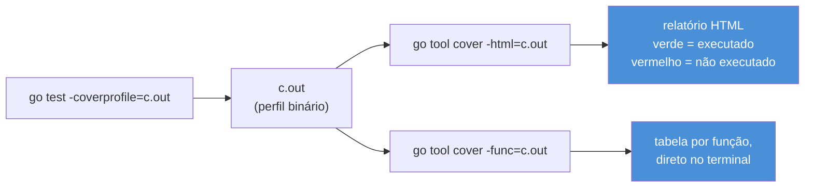
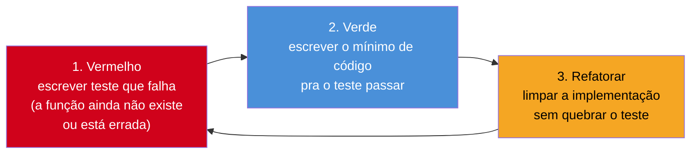

# Cobertura e testes idiomáticos

> [!abstract] TL;DR
> `go test -cover` mede quantas linhas do código de produção foram executadas por algum teste; `-coverprofile=c.out` grava o detalhe linha a linha, e `go tool cover -html=c.out` transforma isso num mapa visual verde/vermelho. Mas cobertura é uma métrica de **execução**, não de **verificação** — 100% de cobertura só prova que toda linha rodou, nunca que o resultado foi checado. Perseguir número redondo gera dois vícios: testar getters/setters triviais que nunca vão quebrar, e escrever testes que executam código sem `assert` nenhum só para pintar a linha de verde. A saída idiomática em Go é usar cobertura como bússola de exploração (onde falta teste?), TDD como disciplina de design (o teste nasce antes do código, e molda a API), e tratar os testes que sobram como **documentação executável** — a prova viva, sempre atualizada, de como a função deve ser chamada e o que ela promete devolver.

## O número que engana

Imagine um relatório de sprint: "cobertura de testes: 94%". Parece ótimo. Um colega novo entra no time, olha o número, sente confiança — "esse código está bem testado, posso mexer sem medo". Ele refatora uma função, os testes continuam verdes, ele faz o merge. Em produção, a função quebra silenciosamente: devolve `0` em vez de erro quando o input é inválido.

O que aconteceu? A função *tinha* teste. O teste *executava* a função inteira, inclusive o branch que devolvia `0` por engano. Só que o teste não tinha nenhum `if got != want { t.Errorf(...) }` depois da chamada — era só `MinhaFuncao(x)`, sem checar nada. A linha ficou verde no relatório de cobertura porque *rodou*. Cobertura mede execução, e só execução. Ela não sabe, e não tem como saber, se alguém checou o resultado.

Essa é a primeira lição desta nota, e a mais importante: cobertura alta é **necessária, mas não suficiente**. É um instrumento de navegação — mostra onde não há teste nenhum — nunca um veredito de qualidade. As seções seguintes mostram como usar a ferramenta sem cair na armadilha do número redondo, e como escrever testes que realmente valem a pena manter.

## Medindo cobertura: `-cover` e `-coverprofile`

`go test` já vem com suporte a cobertura embutido no toolchain — não é preciso instalar nada. A forma mais simples é a flag `-cover`:

```bash
go test -cover ./...
```

```
ok      exemplo/calculadora    0.003s  coverage: 87.5% of statements
```

O número — `87.5% of statements` — é a fração de *statements* (não linhas físicas, e não branches) do pacote que foram executados durante a suíte. É um resumo grosso: útil para um relance rápido, inútil para saber *quais* linhas ficaram de fora.

Para o detalhe, `-coverprofile` grava um arquivo de perfil que outra ferramenta consegue visualizar:

```bash
go test -coverprofile=coverage.out ./...
go tool cover -html=coverage.out
```

O segundo comando abre o navegador com o código-fonte colorido: verde para statements executados, vermelho para os que nunca rodaram. É a ferramenta certa para responder "onde exatamente falta teste?" — muito mais precisa do que o percentual isolado, porque mostra a linha exata, não uma média do pacote inteiro.



Existe uma terceira variante, mais adequada a rodar no terminal ou num pipeline de CI sem abrir navegador: `-func`, que resume a cobertura função a função.

```bash
go tool cover -func=coverage.out
```

```
exemplo/calculadora/calc.go:10:   Somar          100.0%
exemplo/calculadora/calc.go:15:   Dividir        60.0%
exemplo/calculadora/calc.go:25:   validarEntrada 0.0%
total:                            (statements)   87.5%
```

Essa tabela é o ponto de partida ideal para uma sessão de "caça ao buraco de cobertura": `validarEntrada` em `0.0%` é um sinal muito mais acionável do que "87.5% no pacote inteiro" — diz exatamente onde investir a próxima hora escrevendo teste.

> [!info] Cobertura por modo: `set`, `count`, `atomic`
> `-coverprofile` aceita `-covermode`, com três valores. `set` (padrão) só registra se o statement rodou ou não. `count` conta *quantas vezes* cada statement rodou — útil para achar código morto vs. código raramente exercitado. `atomic` é o `count` seguro para uso concorrente, obrigatório se a suíte roda com `-race` e testes paralelos tocam o mesmo código instrumentado. Para a maioria dos pacotes, `set` já responde "o que falta testar" — `count`/`atomic` entram quando a pergunta é sobre concorrência, não cobertura.

Cobertura cruzando pacotes (o teste do pacote `main` exercitando código do pacote `internal/calc`, por exemplo) precisa da flag `-coverpkg`:

```bash
go test -coverpkg=./... -coverprofile=coverage.out ./...
```

Sem isso, `go test ./...` mede a cobertura de cada pacote **apenas com seus próprios testes** — um pacote sem arquivo `_test.go` aparece como `0%` mesmo que outro pacote o exercite pesadamente através de testes de integração.

## O que NÃO testar

A pergunta simétrica a "onde falta teste?" é "onde um teste não vale o custo de manutenção?" — e ignorá-la é como perseguir 100% de cobertura sem parar para pensar no retorno de cada teste escrito.

O exemplo canônico é o getter trivial:

```go
type Pedido struct {
    ID     string
    Status string
}

func (p Pedido) GetID() string {
    return p.ID
}
```

Um teste para `GetID` teria a forma:

```go
func TestPedido_GetID(t *testing.T) {
    p := Pedido{ID: "abc123"}
    if p.GetID() != "abc123" {
        t.Errorf("GetID() = %v, want abc123", p.GetID())
    }
}
```

Esse teste passa sempre. Ele só pode quebrar se alguém reescrever `GetID` para devolver outra coisa que não `p.ID` — uma mudança tão perversa que o compilador, a revisão de código e o bom senso já barrariam antes do teste. O teste não protege contra nenhum bug plausível; só adiciona manutenção (se o campo `ID` for renomeado, o teste precisa acompanhar) sem comprar segurança real.

> [!warning] Em Go, "getter trivial" quase nem deveria existir
> Vale um parêntese: em Java, getters/setters existem por necessidade de encapsulamento (campos privados só acessíveis via método). Em Go, campos exportados (`ID`) já são acessados diretamente — `p.ID`, sem `p.GetID()`. Se você está escrevendo um getter que só faz `return p.campo`, provavelmente nem deveria existir: exporte o campo. A convenção em Go (reforçada pelo [Effective Go](https://go.dev/doc/effective_go#Getters)) é nem prefixar `Get` quando um getter é mesmo necessário — `Pedido.Nome()`, não `Pedido.GetNome()`. Menos código, menos teste inútil.

A regra prática que generaliza o exemplo: teste o que tem **lógica de decisão** — condicionais, laços, cálculos, tratamento de erro, conversões de formato. Não teste o que é só **repasse de dado** sem transformação — atribuição direta, campo público, wrapper de uma linha que só delega para outra função já testada. A tabela resume o critério:

| Vale testar | Não vale testar (isoladamente) |
|---|---|
| Função com `if`/`switch`/laço | Getter que só devolve um campo |
| Cálculo, parsing, validação | Setter que só atribui um campo |
| Tratamento de erro (`err != nil`) | Wrapper de uma linha sem lógica própria |
| Integração com dependência externa | Struct literal / construtor trivial sem validação |
| Código com histórico de bug real | Código gerado (`stringer`, protobuf) |

O último item da coluna direita merece nota: código gerado por ferramentas como `stringer` ou `protoc` não precisa de teste seu — a ferramenta geradora já tem a própria suíte, testar a saída dela é redundante. Se a sua função *usa* código gerado, teste o uso, não a geração.

> [!question]- E se um revisor exigir "100% de cobertura" como política de time?
> Vale discutir a política, não só cumpri-la cegamente. Uma alternativa comum e defensável: medir cobertura só do código com lógica real, excluindo explicitamente getters/setters/wrappers triviais e código gerado (via `//go:build !test` em arquivos gerados, ou filtrando o `coverage.out` antes do relatório). O objetivo de qualquer meta de cobertura é reduzir bugs em produção — se a meta vira "escrever teste vazio pra pintar linha de verde", ela já deixou de servir ao objetivo original e virou teatro de métrica.

## TDD em Go

*Test-Driven Development* — escrever o teste antes da implementação — não é exclusividade de nenhuma linguagem, mas encaixa particularmente bem no ciclo de feedback rápido de Go: `go test ./...` roda em milissegundos na maioria dos pacotes, sem servidor de build persistente nem *watch mode* configurado à parte.

O ciclo clássico é **vermelho → verde → refatorar**:



Um exemplo concreto: implementar uma função `Dividir` que precisa recusar divisão por zero. Em TDD, o teste vem primeiro — e nasce vazio, sem função nenhuma para chamar ainda:

```go
// calc_test.go — escrito ANTES de calc.go existir
package calc

import "testing"

func TestDividir(t *testing.T) {
    tests := []struct {
        nome    string
        a, b    float64
        want    float64
        wantErr bool
    }{
        {"divisão normal", 10, 2, 5, false},
        {"divisão por zero", 10, 0, 0, true},
    }

    for _, tt := range tests {
        t.Run(tt.nome, func(t *testing.T) {
            got, err := Dividir(tt.a, tt.b)
            if (err != nil) != tt.wantErr {
                t.Fatalf("Dividir(%v, %v) err = %v, wantErr %v", tt.a, tt.b, err, tt.wantErr)
            }
            if !tt.wantErr && got != tt.want {
                t.Errorf("Dividir(%v, %v) = %v, want %v", tt.a, tt.b, got, tt.want)
            }
        })
    }
}
```

Rodar `go test` neste ponto nem compila — `Dividir` não existe. Esse é o "vermelho" mais radical possível: falha de compilação. O próximo passo é escrever o mínimo que faz compilar e passar:

```go
// calc.go — escrito DEPOIS do teste, guiado por ele
package calc

import "errors"

func Dividir(a, b float64) (float64, error) {
    if b == 0 {
        return 0, errors.New("divisão por zero")
    }
    return a / b, nil
}
```

`go test` agora passa — "verde". A etapa de "refatorar" entraria se a implementação precisasse de limpeza (nomes melhores, extrair uma constante, simplificar uma condicional) — sempre com a rede de segurança do teste já escrito, que continua vermelho/verde a cada mudança.

O ganho de TDD não é só "ter teste garantido" — é o efeito colateral no **design da API**. Escrever o teste primeiro obriga a decidir, antes de qualquer implementação, como a função vai ser chamada: `Dividir(a, b float64) (float64, error)` — dois retornos, erro explícito, sem panic. Se a assinatura fosse desconfortável de testar (por exemplo, se `Dividir` só imprimisse o resultado em vez de devolvê-lo), o desconforto apareceria *antes* de qualquer linha de implementação existir, quando ainda é barato mudar de ideia.

> [!warning] TDD não é dogma — não force em todo código
> TDD compensa melhor onde a lógica é bem definida antes de escrever (parsers, validadores, cálculos, algoritmos com regras claras). Em exploração de UI, protótipos descartáveis, ou código que depende de decisões ainda incertas de design, escrever o teste primeiro pode travar mais do que ajudar — você acaba testando uma API que muda de qualquer jeito na próxima hora. A comunidade Go valoriza table-driven tests (nota 02 deste galho) como formato, mais do que TDD como processo obrigatório: use TDD onde o ciclo vermelho-verde-refatorar realmente acelera, não como ritual em toda função.

## Testes como documentação executável

Toda a discussão até aqui aponta para uma ideia central: um bom teste não serve só para pegar regressão — ele é a descrição mais confiável de como uma função deveria ser usada, porque, diferente de um comentário ou de um README, ele **quebra se ficar desatualizado**.

Compare os dois jeitos de documentar o comportamento de `Dividir`:

```go
// Dividir divide a por b.
// Retorna erro se b for zero.
func Dividir(a, b float64) (float64, error) { ... }
```

O comentário *diz* que erro acontece quando `b` é zero. Mas nada garante que ainda é verdade depois de três refatorações — comentário não roda, não falha, não avisa quando o código diverge da promessa escrita. O teste da seção anterior, por outro lado, **é** a especificação e a prova ao mesmo tempo: `{"divisão por zero", 10, 0, 0, true}` é ao mesmo tempo documentação legível ("com `b=0`, espera-se erro") e verificação automática (se alguém remover o `if b == 0` da implementação, o teste falha no próximo `go test`).

Essa dualidade é reforçada por dois recursos do próprio ecossistema Go:

- **Nomes de subteste como frase legível** — `t.Run("divisão por zero", ...)` produz, na saída de `go test -v`, uma linha `--- PASS: TestDividir/divisão_por_zero`. Alguém lendo o log de CI entende o comportamento coberto sem abrir o código.
- **Example functions** — `func ExampleDividir() { ... // Output: 5 }`, testadas pelo próprio `go test` e exibidas automaticamente pelo [pkg.go.dev](https://pkg.go.dev/) na documentação do pacote. É a forma mais literal de "documentação executável" que o toolchain Go oferece: se o exemplo desatualizar, o build quebra, então a doc nunca fica mentindo.

```go
func ExampleDividir() {
    resultado, _ := Dividir(10, 2)
    fmt.Println(resultado)
    // Output: 5
}
```

Esse padrão — `// Output: ...` como comentário mágico que `go test` verifica linha a linha contra o `stdout` real da função `Example*` — fecha o círculo do galho inteiro: da primeira nota (`go test` básico) até aqui, o fio condutor é sempre o mesmo — um teste em Go nunca é só "checagem que roda no CI e ninguém mais olha". É a fonte de verdade viva sobre o comportamento do código, obrigada por ferramenta (compilador + `go test`) a nunca mentir por muito tempo.

## Lente cross-stack

| Vindo de... | Equivalente a `-cover` | Diferença notável |
|---|---|---|
| Java (JaCoCo) | `mvn test jacoco:report` | JaCoCo mede branch coverage por padrão em relatórios completos; `go tool cover` padrão mede statement coverage — branch coverage exige instrumentação extra ou ferramentas terceiras |
| Python (`coverage.py`) | `coverage run -m pytest && coverage html` | Fluxo quase idêntico em espírito: rodar com instrumentação, gerar HTML. Go embute isso no toolchain padrão; Python depende de pacote externo |
| Node (`nyc`/`c8`) | `nyc mocha` ou `c8 node test` | Node historicamente depende de ferramenta externa envolvendo o runner; Go tem `-cover` nativo em `go test` desde o Go 1.2 |

A diferença mais relevante em espírito, não só em comando: nas três linguagens comparadas, cobertura tende a ser tratada como métrica de qualidade de produto (dashboard, gate de PR). Em Go, a cultura da comunidade — reforçada pelos próprios mantenedores da linguagem — trata cobertura sobretudo como ferramenta de **navegação durante o desenvolvimento**, não como métrica de vaidade para relatório gerencial. Isso não impede times Go de usar gate de cobertura em CI — só que o discurso idiomático prioriza "onde falta teste de verdade" sobre "qual número bateu a meta".

## Armadilhas comuns

> [!warning] Cobertura alta não implica testes bons
> Já discutido na abertura, mas vale repetir como armadilha nomeada: um teste sem `assert`/`if...t.Errorf` nenhum pode inflar cobertura sem verificar nada. Ao revisar PR, olhe o *corpo* do teste, não só o percentual final.

> [!warning] `go test -coverprofile` sem `-coverpkg` mente sobre pacotes sem `_test.go`
> Um pacote de infraestrutura interna, exercitado só por testes de integração de outro pacote, aparece com `0%` se você rodar `go test ./...` sem `-coverpkg=./...` — a métrica por pacote isolado esconde a cobertura real que vem de fora.

> [!warning] Perseguir 100% desloca esforço do lugar certo
> Tempo gasto testando um getter trivial para fechar os últimos 2% é tempo não gasto testando o branch de tratamento de erro que realmente falha em produção. Cobertura é meio, não fim — o fim é reduzir bugs reais, e nem toda linha de código carrega risco igual.

## Como explicar em inglês

> `go test -cover` reports what fraction of statements ran during the test suite; `-coverprofile` writes a detailed, line-by-line profile that `go tool cover -html` renders as a green/red source map. Coverage measures **execution**, never **verification** — a line can be green because it ran, even if the test never asserted anything about the result. The idiomatic Go stance treats coverage as a navigation tool (where is testing missing?) rather than a vanity metric to chase toward 100%: trivial getters, one-line delegating wrappers, and generated code rarely deserve dedicated tests, because they carry no decision logic that can silently break. Test-Driven Development — red, green, refactor — fits Go's fast feedback loop well, and its real payoff isn't just guaranteed coverage but better API design, since writing the test first forces you to decide the call shape before any implementation exists. The deepest idea tying the whole chapter together: a good Go test doubles as **executable documentation** — unlike a comment, it breaks the moment the code's real behavior drifts from what it promises, and `Example` functions with an `// Output:` comment make that guarantee literal, checked by `go test` itself and rendered on pkg.go.dev.

| Termo PT | Termo EN |
|---|---|
| cobertura de testes | test coverage |
| perfil de cobertura | coverage profile |
| statement (unidade de cobertura) | statement |
| getter trivial | trivial getter |
| desenvolvimento guiado por testes | test-driven development (TDD) |
| ciclo vermelho-verde-refatorar | red-green-refactor cycle |
| documentação executável | executable documentation |
| função de exemplo | example function |
| código gerado | generated code |

## O que vem a seguir

Este era o último capítulo do Galho 15 — testes deixam de ser assunto isolado a partir daqui e passam a operar em produção: o próximo passo é entender o que acontece quando o código já passou em todo teste possível e ainda assim se comporta mal em produção, sob carga real, com dependências reais. O **Galho 16 — Observabilidade** assume esse fio: logs estruturados, métricas e tracing são, em certo sentido, os "testes" que rodam contra o comportamento real do sistema em produção, quando não há mais como escrever um `t.Errorf` de antemão para todo cenário possível.

## Veja também

- [[01 - go test e o primeiro teste]] — fundamentos de `go test` retomados aqui em contexto de cobertura
- [[02 - Table-driven tests]] — formato usado no exemplo de TDD desta nota
- [[03 - Testify e asserções]] — assertividade explícita que separa teste-com-verificação de teste-que-só-executa
- [[05 - Testes de integração]] — onde a fronteira "o que não vale testar isoladamente" se resolve testando o conjunto
- [[06 - Benchmarks]] — outra métrica de `go test`, focada em performance em vez de cobertura
- [[03-Dominios/Tecnologia/Go/index|Trilha Go]]

## Fontes

- The Go Authors. *Testing package documentation*. pkg.go.dev. https://pkg.go.dev/testing (acessado em 2026-07-18)
- The Go Authors. *cover package documentation*. pkg.go.dev. https://pkg.go.dev/cmd/cover (acessado em 2026-07-18)
- The Go Blog. *The cover story*, por Rob Pike. go.dev. https://go.dev/blog/cover (acessado em 2026-07-18)
- The Go Authors. *Effective Go — Getters*. go.dev. https://go.dev/doc/effective_go#Getters (acessado em 2026-07-18)
- Go by Example. *Testing and Benchmarking*. gobyexample.com. https://gobyexample.com/testing-and-benchmarking (acessado em 2026-07-18)
