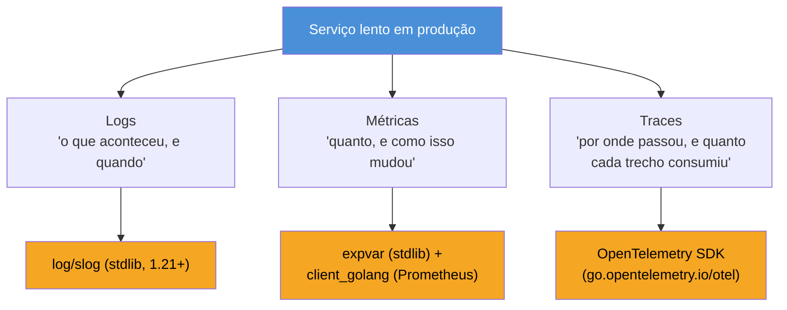
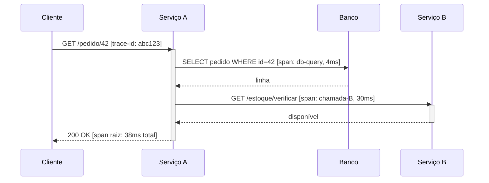

# Os três pilares em Go

> [!abstract] TL;DR
> Observabilidade tem três pilares — **logs** (eventos discretos, "o que aconteceu"), **métricas** (números agregados ao longo do tempo, "quanto/quantas vezes") e **traces** (o caminho de uma requisição através de múltiplos serviços, "por onde passou e quanto demorou cada trecho"). Em Go, os três são incomumente baratos de instrumentar: `log/slog` (logs estruturados) e `expvar`/`net/http/pprof` (métricas e profiling básico) já vêm na **standard library**, sem dependência externa. Prometheus e OpenTelemetry cobrem o resto sem fricção porque Go foi, desde o início, a linguagem nativa desses dois ecossistemas — Prometheus e o coletor de referência do OTel são escritos em Go. Esta nota é o panorama; as sete notas seguintes do galho aprofundam cada peça.

## O problema que "só logar" não resolve

Imagine um serviço em produção que, de repente, fica lento. Você abre os logs e vê linhas soltas: `"request received"`, `"db query executed"`, `"response sent"` — cada uma em um timestamp diferente, sem relação visível entre si. Perguntas óbvias ficam sem resposta:

- **Quanto tempo, em média, uma requisição está levando agora, comparado a ontem?** (log não agrega — teria que somar linha por linha)
- **Essa requisição lenta específica: gastou o tempo no banco, numa chamada HTTP externa, ou no seu próprio código?** (log não mostra causalidade entre etapas)
- **Isso é um pico isolado ou uma tendência que vai estourar SLO em uma hora?** (log não tem noção de série temporal)

Cada pergunta pede uma ferramenta diferente. É essa divisão do trabalho que a indústria de observabilidade convencionou chamar de **três pilares** — o conceito em si (por que três, como eles se combinam, o que é SLO/SLI) pertence à trilha de Operação/SRE deste vault, não a este galho; aqui o interesse é **o que Go oferece, nativamente, para cada pilar**.



## Pilar 1 — Logs: eventos discretos

Um log é um registro pontual: "às 14:32:07, a requisição X terminou com status 500". Útil para reconstruir uma sequência de eventos e para depurar um caso específico — péssimo para responder "quantas vezes isso aconteceu na última hora" sem processamento externo (grep, agregação em ferramenta de log).

Até a versão 1.20, Go não tinha uma resposta oficial para "log estruturado" (chave-valor, não texto livre) — o mercado usava `logrus`, `zap` ou `zerolog`. A 1.21 mudou isso:

> [!info] `log/slog` — stdlib desde Go 1.21 (2023)
> O pacote `log/slog` trouxe logging estruturado para a standard library — chaves tipadas, níveis (`Debug`/`Info`/`Warn`/`Error`), saída em texto ou JSON, sem dependência externa. Antes dele, todo projeto Go sério carregava uma lib de terceiros só para logar em JSON.

```go
package main

import "log/slog"

func main() {
    logger := slog.New(slog.NewJSONHandler(nil, nil)) // Writer/opções detalhados na próxima nota
    logger.Info("requisição processada",
        "method", "GET",
        "path", "/users/42",
        "status", 200,
        "duration_ms", 12,
    )
}
```

A saída não é uma string interpolada e sim um registro de campos — o que permite a qualquer sistema de agregação de logs (Loki, Elasticsearch, CloudWatch) filtrar por `status=500` sem parsing frágil de regex sobre texto livre. É o assunto inteiro da [[02 - Logging estruturado com slog|próxima nota]].

## Pilar 2 — Métricas: números agregados no tempo

Uma métrica não conta uma história — conta um número. "Contador de requisições: 48.213 desde o boot." "Histograma de latência: p50=8ms, p99=340ms." Métricas custam pouquíssimo para armazenar (um `int64` que só cresce é muito mais barato que uma linha de log por requisição) e são exatamente o que alimenta dashboards e alertas baseados em tendência.

Go tem dois níveis de suporte nativo:

**`expvar`** (stdlib, desde as primeiras versões) expõe variáveis de processo — contadores, mapas, valores customizados — via um endpoint HTTP em JSON, sem nenhuma dependência externa:

```go
package main

import (
    "expvar"
    "net/http"
)

var hits = expvar.NewInt("hits_total")

func handler(w http.ResponseWriter, r *http.Request) {
    hits.Add(1)
    w.Write([]byte("ok"))
}

func main() {
    http.HandleFunc("/", handler)
    http.ListenAndServe(":8080", nil) // /debug/vars expõe hits_total em JSON
}
```

`expvar` é rústico — não tem histogramas, não tem labels multidimensionais — mas está sempre disponível e é útil para um número rápido em produção sem adicionar dependência. Para métricas de verdade (contadores com labels, histogramas de latência, agregação por série temporal), o ecossistema convergiu para **Prometheus**, e aqui a relação com Go não é coincidência: Prometheus é escrito em Go, e a biblioteca cliente oficial (`client_golang`) é o padrão de fato para instrumentar serviços Go, mesmo não sendo stdlib. Essas duas peças — `expvar`/runtime metrics e Prometheus — ganham notas dedicadas mais à frente no galho.

## Pilar 3 — Traces: o caminho de uma requisição

Trace é o pilar que resolve exatamente a pergunta que log e métrica não respondem sozinhos: **dentro de uma única requisição, onde o tempo foi gasto?** Um trace é uma árvore de *spans* — cada span representa uma etapa (uma chamada HTTP, uma query SQL, uma chamada RPC para outro serviço) com início, fim e metadados. Em um sistema de microservices, o trace atravessa processos: o span do serviço A é pai do span do serviço B, que ele mesmo chamou.



Sem tracing, esse mesmo cenário aparece nos logs como quatro linhas soltas em serviços diferentes, sem `trace-id` comum ligando-as — reconstruir a árvore à mão é impraticável em produção. Go não tem tracing na standard library (é o único dos três pilares sem stdlib própria), mas tem algo quase tão bom: o **OpenTelemetry SDK para Go** (`go.opentelemetry.io/otel`) é um projeto de primeira classe do CNCF, com API estável desde 2023, e é a implementação de referência usada por boa parte da própria equipe de observabilidade do ecossistema Go.

> [!info] OpenTelemetry — API/SDK Go estáveis desde 2023
> O OpenTelemetry unificou o que antes eram dois padrões concorrentes (OpenTracing + OpenCensus). Em Go, a API de tracing atingiu 1.0 (estável) em 2023; a API de métricas seguiu logo depois. É hoje a via recomendada para instrumentar tracing e métricas de forma vendor-neutral — o mesmo código exporta para Jaeger, Tempo, Datadog ou qualquer backend compatível com OTLP. Aprofundado na [[07 - OpenTelemetry — tracing|nota 07]] deste galho.

## Por que observabilidade é barata em Go

Comparado a outras linguagens de backend, montar os três pilares em Go pede menos dependências, e a razão é estrutural, não coincidência de mercado:

- **Logs estruturados**: `log/slog` é stdlib desde 1.21 — zero dependência para o básico.
- **Métricas rudimentares**: `expvar` é stdlib desde sempre — zero dependência para um contador rápido.
- **Profiling de CPU/memória**: `net/http/pprof` é stdlib — um `import _ "net/http/pprof"` já expõe profiles via HTTP, sem instalar nada (aprofundado nas notas 03 e 04 deste galho).
- **Métricas de produção**: Prometheus e sua lib cliente são, eles mesmos, escritos em Go — a integração é de primeira classe, não um adaptador de terceiros tentando alcançar uma API estrangeira.
- **Tracing**: o SDK OpenTelemetry para Go tem o mesmo nível de investimento e maturidade que as SDKs de Java/Python/Node, sem lag de features.

O runtime do Go também ajuda por trás das cortinas: o coletor de garbage collector, o scheduler de goroutines e o próprio `net/http` já expõem hooks e contadores que essas ferramentas consomem sem instrumentação manual extra — assunto que volta com mais profundidade quando o galho 17 (runtime/GC) e a nota 06 (runtime metrics) deste galho se cruzarem.

> [!warning] "Stdlib" não é "grátis em runtime"
> `log/slog`, `expvar` e `net/http/pprof` não custam uma dependência externa para *compilar*, mas continuam custando CPU e memória em *runtime* — logar em nível `Debug` em produção, ou deixar `/debug/pprof` exposto sem autenticação, são armadilhas reais. Isso é aprofundado nota a nota à frente, não descartado por "é stdlib, então é de graça".

## Os três pilares combinados

Os três pilares não competem — eles se completam, e o fluxo típico de investigação de um incidente costuma passar pelos três em sequência. Um alerta de **métrica** (p99 de latência subiu de 40ms para 400ms) diz *que algo está errado* e *quando* começou. Um **trace** amostrado naquele intervalo mostra *qual span* específico, dentro de uma requisição real, concentrou o tempo — banco, chamada externa, seu próprio código. E o **log** daquele span, correlacionado por `trace-id`, entrega o detalhe fino — qual query, qual erro, qual payload.

```go
package main

import (
    "context"
    "log/slog"
)

// correlacionar log com trace: extrai o trace-id do contexto (produzido
// pelo SDK do OpenTelemetry, nota 07) e anexa como campo estruturado —
// assim, uma busca por trace-id no backend de logs encontra exatamente
// as linhas daquela requisição, e só delas.
func logComTrace(ctx context.Context, logger *slog.Logger, msg string) {
    traceID := traceIDDoContexto(ctx) // implementação real vem do SDK OTel
    logger.InfoContext(ctx, msg, "trace_id", traceID)
}

func traceIDDoContexto(ctx context.Context) string {
    return "abc123" // placeholder — a nota 07 mostra a extração real
}
```

`logger.InfoContext` (variante de `Info` que aceita `context.Context`, disponível desde a introdução do `slog`) é o gancho pensado exatamente para esse tipo de correlação — handlers customizados podem extrair `trace-id`/`span-id` do contexto automaticamente, sem que cada chamada de log precise repetir esse código à mão.

> [!warning] Amostrar traces, mas nunca amostrar métricas ou logs de erro
> Tracing completo (um span para cada requisição, em todo serviço da cadeia) fica caro rápido em alto volume — por isso é comum amostrar (gravar só 1% a 10% dos traces). Métricas, por serem agregadas, não sofrem esse problema (um contador soma todas as requisições, amostradas ou não). Logs de erro também não deveriam ser amostrados por padrão: perder justamente o log do erro que você precisa investigar é o pior cenário possível de uma política de amostragem mal calibrada.

## Lente cross-stack

| Vindo de | Logs | Métricas | Tracing |
|---|---|---|---|
| **Java** | SLF4J + Logback/Log4j2 (não-stdlib) | Micrometer + Prometheus | OpenTelemetry Java agent |
| **Node** | `pino`/`winston` (não-stdlib) | `prom-client` | OpenTelemetry JS |
| **Python** | `logging` (stdlib, mas sem structured logging nativo até recentemente) | `prometheus_client` | OpenTelemetry Python |
| **Go** | `log/slog` (**stdlib**, 1.21+) | `expvar` (**stdlib**) + `client_golang` | OpenTelemetry Go |

A diferença que salta aos olhos: Go é a única dessas quatro linguagens em que **dois dos três pilares têm solução na standard library**. Isso não torna as outras linguagens inferiores — Micrometer e `prometheus_client`, por exemplo, são maduros e amplamente adotados — mas explica por que times Go tendem a montar observabilidade básica sem debate sobre "qual lib de logging escolher": a resposta default já vem instalada.

## Como explicar em inglês

> Observability rests on three pillars — **logs** (discrete events, "what happened"), **metrics** (aggregated numbers over time, "how much / how often"), and **traces** (the path a single request takes across services, "where the time went"). Go makes all three unusually cheap to instrument: `log/slog` for structured logging and `expvar`/`net/http/pprof` for basic metrics and profiling ship in the standard library — no external dependency required for the basics. Prometheus and OpenTelemetry cover the rest with first-class support, because both projects are themselves written in Go (Prometheus) or treat Go as a tier-one SDK target (OpenTelemetry). That combination — stdlib basics plus native-quality ecosystem tooling — is why Go services tend to reach for observability defaults instead of debating which logging library to adopt.

| Termo PT | Termo EN |
|---|---|
| observabilidade | observability |
| três pilares | three pillars |
| logs estruturados | structured logging |
| métricas | metrics |
| rastreamento distribuído | distributed tracing |
| span | span |
| trace | trace |
| profiling | profiling |
| standard library | standard library |

## O que vem a seguir

Este panorama deixou claro que `log/slog` é a peça de logging da stdlib — mas só arranhou a superfície: níveis, handlers, contexto, `slog.Group`, e como plugar isso num pipeline de agregação de logs real ficaram de fora. A [[02 - Logging estruturado com slog|próxima nota]] entra a fundo nesse pacote, incluindo os detalhes que este panorama pulou de propósito (o `nil, nil` do exemplo acima, por exemplo, não é o jeito recomendado de configurar um handler em produção).

## Veja também

- [[02 - Logging estruturado com slog|02 — Logging estruturado com slog]] — próxima nota do galho
- [[03 - pprof — CPU e memória|03 — pprof — CPU e memória]] — profiling nativo via `net/http/pprof`
- [[05 - Métricas com Prometheus|05 — Métricas com Prometheus]] — a lib cliente oficial, `client_golang`
- [[06 - expvar e runtime metrics|06 — expvar e runtime metrics]] — aprofunda o `expvar` visto aqui
- [[07 - OpenTelemetry — tracing|07 — OpenTelemetry — tracing]] — o SDK apresentado nesta nota, a fundo
- [[03-Dominios/Tecnologia/Go/index|Trilha Go]]

## Fontes

- The Go Authors. *Package slog*. pkg.go.dev. https://pkg.go.dev/log/slog (acessado em 2026-07-18)
- The Go Authors. *Package expvar*. pkg.go.dev. https://pkg.go.dev/expvar (acessado em 2026-07-18)
- The Go Authors. *Package pprof*. pkg.go.dev. https://pkg.go.dev/net/http/pprof (acessado em 2026-07-18)
- The Go Blog. *Structured Logging with slog*. go.dev. https://go.dev/blog/slog (acessado em 2026-07-18)
- OpenTelemetry. *Getting Started — Go*. opentelemetry.io. https://opentelemetry.io/docs/languages/go/getting-started/ (acessado em 2026-07-18)
- Prometheus. *Instrumenting a Go application*. prometheus.io. https://prometheus.io/docs/guides/go-application/ (acessado em 2026-07-18)
