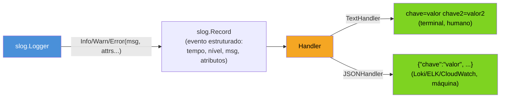

# Logging estruturado com slog

> [!abstract] TL;DR
> `log/slog`, na standard library desde Go 1.21, substitui o `log` cru por **logging estruturado**: em vez de uma linha de texto solto, cada chamada produz um evento com **atributos** (pares chave-valor) que uma máquina consegue parsear sem regex frágil. Um `Logger` combina um **handler** — `TextHandler` (linhas `chave=valor`, boas pra terminal) ou `JSONHandler` (um objeto JSON por linha, o formato que Loki, Elasticsearch e CloudWatch esperam) — com um **nível mínimo** (`Debug`/`Info`/`Warn`/`Error`) que filtra o que sai. A API oferece três formas de anexar atributos: variádica (`slog.Info("msg", "chave", valor)`), tipada (`slog.Int("chave", valor)`) e fixa por logger (`logger.With("request_id", id)`), esta última o jeito idiomático de carregar contexto por toda a vida de uma requisição.

## O log que não dá pra grepear

Imagine um serviço em produção que, numa madrugada de sexta, começa a devolver `500` pra um subconjunto de usuários. Você abre o painel de logs pra investigar e encontra isto:

```
2026-07-18 03:14:02 erro ao processar pedido 88231 para usuário 4471: timeout
2026-07-18 03:14:03 pedido 91002, usuario=9910: erro timeout na consulta
2026-07-18 03:14:05 timeout: pedido=77812 user_id:2201
```

Três linhas, três formatos diferentes de dizer a mesma coisa — porque cada `fmt.Println` ou `log.Printf` foi escrito por uma pessoa diferente, num dia diferente, sem contrato nenhum entre eles. Agora tente responder, sob pressão, a uma pergunta simples: "quantos pedidos deram timeout nos últimos 10 minutos, agrupados por usuário?" Com essas três linhas, a resposta é escrever uma expressão regular torta que tenta capturar `pedido` ou `pedido=` ou nada, `usuário`/`usuario`/`user_id`, e reza pra próxima linha não inventar uma quarta variação.

Esse é o problema que logging **não estruturado** empurra pro futuro: texto livre é ótimo pra um humano ler uma linha isolada, e péssimo pra uma máquina (ou pra você, com um `grep` desesperado às 3h) agregar milhares delas. `log/slog` — parte da standard library desde Go 1.21 — existe pra resolver exatamente isso: força cada evento de log a carregar seus dados como **atributos nomeados**, não como texto interpolado numa frase.

> [!info] `log/slog` é Go 1.21+
> Antes de 1.21, a standard library só oferecia o pacote `log`, que produz texto livre — sem estrutura, sem níveis, sem atributos. Bibliotecas de terceiros (`zap`, `zerolog`, `logrus`) preenchiam essa lacuna havia anos; `slog` chega como a resposta oficial, desenhada em parte para servir de **interface comum** que essas bibliotecas podem implementar por baixo. Se o seu `go.mod` diz `go 1.21` ou mais recente, `slog` já está disponível sem dependência externa nenhuma.

## Handler, Logger e Record: as três peças

`slog` separa três responsabilidades que o `log` tradicional misturava numa função só:



- **`Logger`** — o objeto que você chama (`logger.Info(...)`, `logger.Error(...)`). Não sabe formatar nada sozinho; monta um `Record` e repassa pro `Handler`.
- **`Record`** — a representação interna de um evento: timestamp, nível, mensagem e a lista de atributos. Você quase nunca constrói um `Record` à mão — é o `Logger` que faz isso pra você.
- **`Handler`** — a interface que decide **como** o evento vira texto (ou bytes) e **para onde** vai. A standard library traz dois prontos, `TextHandler` e `JSONHandler`; qualquer biblioteca (ou você mesmo) pode implementar a interface `slog.Handler` pra mandar eventos pra outro destino — um coletor de logs, um banco, o `stderr` com cores.

Essa separação é o que permite trocar o formato de saída — de texto legível em desenvolvimento pra JSON em produção — **sem tocar em uma linha sequer** das chamadas `logger.Info(...)` espalhadas pelo código. O código que loga não sabe, e não precisa saber, qual handler está por trás.

## TextHandler vs JSONHandler

Os dois handlers da standard library atacam públicos diferentes: um humano olhando um terminal, uma máquina agregando milhares de eventos por segundo.

```go
package main

import (
    "log/slog"
    "os"
)

func main() {
    textLogger := slog.New(slog.NewTextHandler(os.Stdout, nil))
    textLogger.Info("pedido processado", "pedido_id", 88231, "usuario_id", 4471, "duracao_ms", 42)

    jsonLogger := slog.New(slog.NewJSONHandler(os.Stdout, nil))
    jsonLogger.Info("pedido processado", "pedido_id", 88231, "usuario_id", 4471, "duracao_ms", 42)
}
```

Saída do `TextHandler` — uma linha, pares `chave=valor`, pensada pra leitura direta no terminal:

```
time=2026-07-18T03:14:02.123-03:00 level=INFO msg="pedido processado" pedido_id=88231 usuario_id=4471 duracao_ms=42
```

Saída do `JSONHandler` — um objeto JSON por linha, o formato que ferramentas de agregação (Loki, Elasticsearch, CloudWatch Logs Insights) sabem indexar e consultar por campo:

```json
{"time":"2026-07-18T03:14:02.123-03:00","level":"INFO","msg":"pedido processado","pedido_id":88231,"usuario_id":4471,"duracao_ms":42}
```

A regra prática que a comunidade Go convergiu: `TextHandler` em desenvolvimento local (é mais rápido de ler correndo o olho), `JSONHandler` em produção (é o que o resto do stack de observabilidade consome — a mesma fronteira que a [[01 - Os três pilares em Go|nota 01]] deste galho chamou de "logs que máquinas leem"). Nenhum dos dois exige biblioteca externa; ambos moram em `log/slog` desde 1.21.

## Níveis: filtrando o que sai

`slog` define quatro níveis embutidos, em ordem crescente de severidade: `Debug` (-4), `Info` (0), `Warn` (4), `Error` (8). Cada `Handler` tem um nível mínimo configurável — eventos abaixo dele nem chegam a ser formatados:

```go
handler := slog.NewJSONHandler(os.Stdout, &slog.HandlerOptions{
    Level: slog.LevelWarn, // só Warn e Error passam; Debug e Info são descartados
})
logger := slog.New(handler)

logger.Debug("entrando na função processarPedido") // descartado, nível abaixo do mínimo
logger.Info("pedido validado")                     // descartado
logger.Warn("estoque baixo", "produto_id", 552)    // sai
logger.Error("falha ao debitar cartão", "erro", "timeout") // sai
```

O ganho prático: em produção, você deixa o mínimo em `Info` ou `Warn` pra não afogar o sistema de logs em ruído de depuração — e, quando precisa investigar um incidente, sobe temporariamente o handler pra `Debug` sem recompilar nada, se a configuração do nível vier de variável de ambiente (padrão comum: `LOG_LEVEL=debug` lido na inicialização).

> [!info] `slog.LevelVar` para nível dinâmico
> Se o nível precisa mudar em runtime — por exemplo, um endpoint administrativo que liga `Debug` temporariamente sem reiniciar o processo — `slog.HandlerOptions.Level` aceita qualquer valor que implemente `slog.Leveler`, e `*slog.LevelVar` é a implementação pronta pra isso: um ponteiro que você muda a qualquer momento, e o handler passa a respeitar o novo valor na próxima chamada de log.

## Atributos: três formas de anexar dados

`slog` aceita atributos de três jeitos, do mais simples ao mais explícito:

**1. Variádico solto** — pares `chave, valor` alternados, o jeito mais rápido de escrever:

```go
logger.Info("usuário autenticado", "usuario_id", 4471, "metodo", "oauth")
```

**2. Construtores tipados** — `slog.Int`, `slog.String`, `slog.Bool`, `slog.Duration`, entre outros, retornam um `slog.Attr` explícito. Mais verboso, mas evita o custo de conversão via `any` no caminho quente, e falha em tempo de compilação se o tipo mudar:

```go
logger.Info("usuário autenticado",
    slog.Int("usuario_id", 4471),
    slog.String("metodo", "oauth"),
)
```

**3. `With` — atributos fixos por logger**, o jeito idiomático de carregar contexto que se repete em toda a vida de uma requisição (um `request_id`, um `user_id` de sessão), sem repetir esse atributo em cada chamada:

```go
func tratarPedido(base *slog.Logger, pedidoID int) {
    logger := base.With("pedido_id", pedidoID) // todo log daqui pra frente já carrega pedido_id

    logger.Info("iniciando processamento")
    // ... trabalho ...
    logger.Info("processamento concluído", "duracao_ms", 42)
}
```

Cada `logger.Info(...)` chamado a partir desse `logger` derivado já sai com `pedido_id=88231` embutido, sem que o corpo da função precise repetir esse atributo em toda linha de log. `With` retorna um **novo** `*slog.Logger` — o original não é alterado, então é seguro derivar loggers filhos por requisição a partir de um logger base compartilhado, sem loggers concorrentes pisando um no outro.

## Substituindo `log` por `slog`

Quem já tem código com o pacote `log` da standard library encontra uma migração direta — `slog` foi desenhado pra coexistir e, eventualmente, substituir esse uso:

```go
// Antes — log cru, texto livre:
import "log"

log.Printf("pedido %d processado para usuário %d em %dms", pedidoID, usuarioID, duracaoMs)
// saída: 2026/07/18 03:14:02 pedido 88231 processado para usuário 4471 em 42ms

// Depois — slog, estruturado:
import "log/slog"

slog.Info("pedido processado", "pedido_id", pedidoID, "usuario_id", usuarioID, "duracao_ms", duracaoMs)
// saída (texto): time=... level=INFO msg="pedido processado" pedido_id=88231 usuario_id=4471 duracao_ms=42
```

A diferença não é só estética. `log.Printf` produz uma **frase**: pra extrair `pedidoID` dessa frase depois, alguém precisa escrever um parser (regex, na prática) que quebra no dia em que a frase mudar uma vírgula de posição. `slog.Info` produz um **evento com campos nomeados**: `pedido_id` é sempre `pedido_id`, em qualquer ordem, em qualquer chamada, e qualquer sistema de agregação consegue indexar e filtrar por ele sem adivinhar formato.

`slog` também expõe `slog.SetDefault(logger)`, que substitui o logger global usado por `slog.Info`/`slog.Warn`/etc. no pacote inteiro — útil pra configurar handler e nível uma vez, na inicialização do programa, e usar as funções de pacote (`slog.Info(...)`, sem instanciar um `*Logger` em cada arquivo) no resto do código:

```go
func main() {
    logger := slog.New(slog.NewJSONHandler(os.Stdout, &slog.HandlerOptions{
        Level: slog.LevelInfo,
    }))
    slog.SetDefault(logger)

    slog.Info("serviço iniciado", "porta", 8080) // usa o logger default configurado acima
}
```

## Armadilhas comuns

> [!warning] Atributos ímpares viram um `!BADKEY`
> A forma variádica (`logger.Info("msg", "chave", valor)`) espera pares completos. Se você passar um número ímpar de argumentos soltos — esquecer um valor, ou concatenar listas de atributos errado — `slog` não gera erro de compilação (a assinatura é `...any`); em runtime, o atributo órfão vira `!BADKEY=<valor>` na saída, silenciosamente. Prefira os construtores tipados (`slog.Int`, `slog.String`) em código que monta atributos dinamicamente, porque erros de tipo ali aparecem em tempo de compilação.

> [!warning] Não logue segredos como atributo "por engano de nome"
> `slog.Info("login", "senha", senhaDigitada)` grava a senha em texto claro em qualquer `JSONHandler` — e, uma vez em produção, esse log provavelmente já foi replicado pra três sistemas de agregação antes de alguém perceber. `slog` não filtra nada por padrão; a disciplina de nunca colocar segredo, token ou dado sensível como valor de atributo é inteiramente sua. `HandlerOptions.ReplaceAttr` permite redigir ou remover atributos por nome antes de eles saírem — vale configurar isso uma vez, cedo, pra chaves conhecidas (`senha`, `token`, `cpf`).

> [!warning] `With` não é `WithGroup`, e strings de atributo não são graça de closure
> `logger.With(...)` fixa atributos achatados no logger derivado; `logger.WithGroup("nome")` aninha os atributos seguintes dentro de um objeto `"nome": {...}` na saída JSON — útil pra agrupar campos relacionados (`slog.Group("http", "method", "GET", "status", 200)`), mas fácil de confundir com `With` se você só leu a assinatura por cima. E, como `With` retorna um valor novo em vez de mutar o logger, `base.With("x", 1)` sem capturar o retorno não faz nada — o padrão é sempre `logger := base.With(...)`.

## Como explicar em inglês

> `log/slog`, part of the standard library since Go 1.21, replaces free-text logging with **structured logging**: every log call produces an event carrying named **attributes** instead of an interpolated sentence, so downstream tooling can query by field instead of parsing text. A `Logger` pairs with a **handler** — `TextHandler` for human-readable `key=value` lines, or `JSONHandler` for the one-JSON-object-per-line format that log aggregators like Loki or CloudWatch expect — and a minimum **level** (`Debug`/`Info`/`Warn`/`Error`) that filters what actually gets emitted. Attributes attach three ways: loose variadic pairs, typed constructors (`slog.Int`, `slog.String`), or `logger.With(...)`, which returns a derived logger that carries fixed attributes — the request ID, the user ID — through every subsequent call without repeating them.

| Termo PT | Termo EN |
|---|---|
| logging estruturado | structured logging |
| manipulador / handler | handler |
| nível de log | log level |
| atributo | attribute |
| registro / evento | record |
| logger derivado | derived logger |
| redigir (ocultar dado sensível) | redact |

## O que vem a seguir

Logs contam **o quê** aconteceu — um evento, com contexto. Mas quando a pergunta muda de "o que aconteceu" pra "por que esse handler está devorando 400MB de heap" ou "qual função está consumindo 80% da CPU", nenhum log resolve: é preciso um perfil de execução do próprio programa. A [[03 - pprof — CPU e memória|próxima nota]] entra no `net/http/pprof` e no pacote `runtime/pprof` — como capturar um profile de CPU ou memória de um serviço Go rodando, o segundo pilar da tríade de observabilidade desta trilha.

## Veja também

- [[01 - Os três pilares em Go|01 — Os três pilares em Go]] — onde logging estruturado se encaixa ao lado de métricas e tracing
- [[03 - pprof — CPU e memória|03 — pprof — CPU e memória]] — próxima nota do galho
- [[05 - Métricas com Prometheus|05 — Métricas com Prometheus]] — o pilar que agrega números em vez de eventos discretos
- [[03-Dominios/Tecnologia/Go/index|Trilha Go]]

## Fontes

- The Go Authors. *Package slog*. pkg.go.dev. https://pkg.go.dev/log/slog (acessado em 2026-07-18)
- Jonathan Amsterdam. *Structured Logging with slog*. go.dev/blog. https://go.dev/blog/slog (acessado em 2026-07-18)
- The Go Authors. *Go 1.21 Release Notes — log/slog*. go.dev. https://go.dev/doc/go1.21#slog (acessado em 2026-07-18)
- The Go Authors. *Package log*. pkg.go.dev. https://pkg.go.dev/log (acessado em 2026-07-18)
