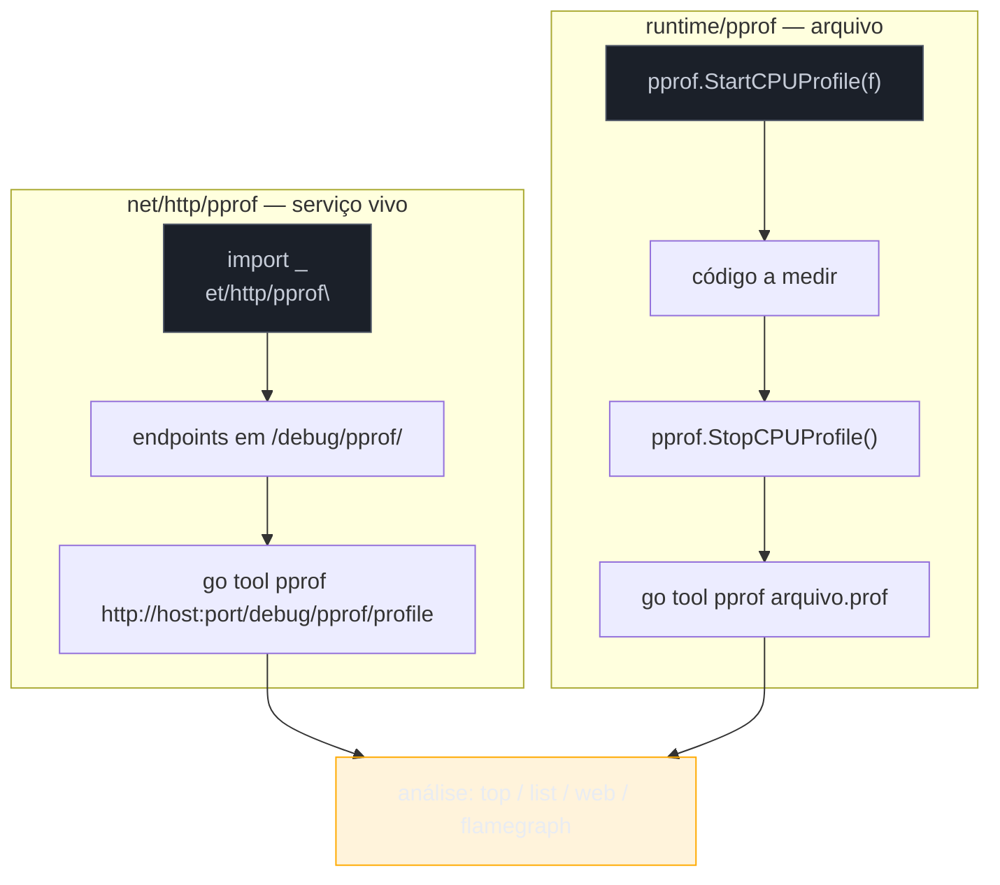
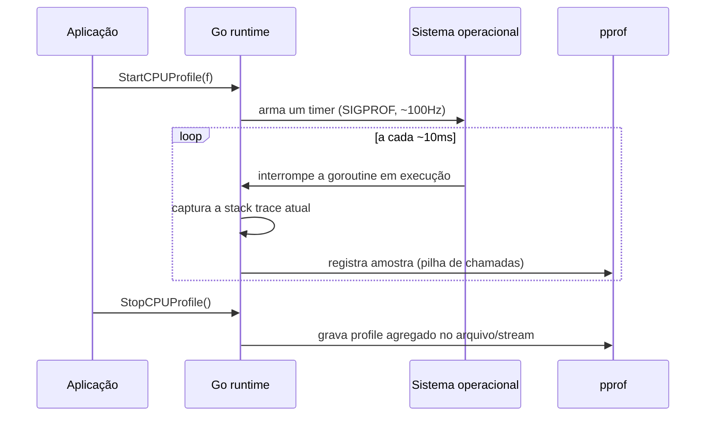

# pprof — CPU e memória

> [!abstract] TL;DR
> `pprof` é o profiler nativo de Go — mede CPU, heap, goroutines e contenção de mutex/bloqueio sem nenhuma ferramenta externa. Dois pacotes fazem o trabalho: `net/http/pprof` expõe profiles via HTTP num serviço já rodando (import por efeito colateral, `_ "net/http/pprof"`), e `runtime/pprof` grava profiles em arquivo — útil em CLIs, jobs em batch, ou testes de benchmark. Os dois alimentam a mesma ferramenta de análise, `go tool pprof`. A vantagem real sobre Java (VisualVM/JFR/async-profiler) ou Node (`--prof`/clinic.js) não é a técnica — é o custo de entrada: uma linha de import e o profiler já está lá, embutido no binário, sem agente externo, sem instrumentação de bytecode, sem instalar nada em produção.

## O problema que motiva profiling

Seu serviço está lento. Ou está consumindo memória demais. Ou o número de goroutines só sobe e nunca desce. Você pode adivinhar a causa — "deve ser aquela query", "acho que é aquele loop" — ou pode **medir**. Profiling é a diferença entre debugar por intuição e debugar por evidência: em vez de otimizar a função que *parece* lenta, você descobre qual função *é de fato* lenta, com números.

Em Java, isso significa ligar o VisualVM, ou anexar o JFR (Java Flight Recorder), ou instalar async-profiler — ferramentas poderosas, mas externas ao processo, que exigem configuração de agente e às vezes reiniciar a JVM com flags específicas. Em Node, é `node --prof` gerando um log que precisa ser processado por `--prof-process`, ou uma ferramenta como clinic.js instalada à parte.

Em Go, o profiler é **parte da stdlib**. Não é um add-on — é código que roda dentro do próprio runtime, medindo o próprio runtime, e que você liga importando um pacote. Essa proximidade com o runtime é o que torna profiling em Go barato o suficiente para rodar **em produção, o tempo todo**, não só quando algo já deu errado.

## Os dois caminhos: HTTP e arquivo



A escolha entre os dois não é sobre qual é "melhor" — é sobre **onde o código vive**. Um serviço HTTP de longa duração (uma API, um worker que fica no ar) usa `net/http/pprof`: você aponta o `go tool pprof` para uma URL, a qualquer momento, sem reiniciar nada. Um programa de vida curta — um script, um job batch, um teste de benchmark — usa `runtime/pprof`: você inicia e para a coleta explicitamente, em volta do trecho que quer medir, e o resultado vira um arquivo.

## net/http/pprof — profiling de um serviço vivo

O padrão mais comum em produção é este: um `import` por efeito colateral, sem usar nenhum símbolo do pacote diretamente.

```go
package main

import (
    "log"
    "net/http"
    _ "net/http/pprof" // registra os handlers em http.DefaultServeMux
)

func main() {
    // servidor de profiling, isolado numa porta interna
    go func() {
        log.Println(http.ListenAndServe("localhost:6060", nil))
    }()

    // servidor de aplicação, na porta pública
    mux := http.NewServeMux()
    mux.HandleFunc("/", handleIndex)
    log.Fatal(http.ListenAndServe(":8080", mux))
}
```

> [!warning] `_ "net/http/pprof"` registra os handlers no `http.DefaultServeMux` — nunca exponha isso publicamente
> O `init()` desse pacote faz `http.HandleFunc("/debug/pprof/...", ...)` diretamente no mux padrão do pacote `http`. Se o seu servidor de aplicação também usa `http.DefaultServeMux` (por exemplo, chamando `http.ListenAndServe(":8080", nil)`), os endpoints de profiling ficam expostos na **mesma porta pública** que atende tráfego real — qualquer um na internet pode baixar um heap dump do seu processo. O padrão seguro é o do exemplo acima: um `http.ServeMux` próprio para a aplicação, e o profiling isolado numa porta interna (`localhost:6060`, ou atrás de firewall/VPN) que nunca sai da rede interna.

Com o servidor no ar, os endpoints ficam disponíveis em `/debug/pprof/`:

| Endpoint | O que mede |
|---|---|
| `/debug/pprof/profile?seconds=30` | CPU — amostra por 30s (parâmetro `seconds`, default 30) |
| `/debug/pprof/heap` | Memória alocada no heap, no momento da chamada |
| `/debug/pprof/goroutine` | Todas as goroutines vivas e suas stack traces |
| `/debug/pprof/allocs` | Histórico de alocações (mesmo depois de coletadas pelo GC) |
| `/debug/pprof/mutex` | Contenção em `sync.Mutex` (requer `runtime.SetMutexProfileFraction`) |
| `/debug/pprof/block` | Goroutines bloqueadas esperando (canal, mutex, syscall) |
| `/debug/pprof/` (raiz) | Página HTML com índice de todos os profiles disponíveis |

O caso mais direto — descobrir por que a CPU está no talo:

```bash
go tool pprof http://localhost:6060/debug/pprof/profile?seconds=30
```

Isso bloqueia por 30 segundos coletando amostras, baixa o profile, e abre um shell interativo do `pprof`. De dentro dele:

```
(pprof) top
(pprof) top -cum        # ordenado por tempo acumulado (inclui chamadas filhas)
(pprof) list NomeDaFuncao
(pprof) web             # abre um grafo de chamadas no navegador (requer graphviz)
```

O caso de goroutine leak — sintoma clássico de memória crescendo devagar e sem parar, quase sempre por goroutine bloqueada para sempre num canal sem receiver, ou numa requisição HTTP sem timeout:

```bash
go tool pprof http://localhost:6060/debug/pprof/goroutine
```

```
(pprof) top
```

Se `top` mostra centenas de goroutines empilhadas na mesma função, é ali que uma delas está travando para sempre — cada nova chamada cria outra goroutine que nunca sai, e o total só cresce.

## runtime/pprof — capturando um profile em arquivo

Quando não há servidor HTTP no ar — um CLI, um job de batch, um script — `runtime/pprof` grava direto num `*os.File`, delimitando explicitamente onde a coleta começa e termina:

```go
package main

import (
    "os"
    "runtime/pprof"
)

func main() {
    // --- CPU profile ---
    cpuFile, err := os.Create("cpu.prof")
    if err != nil {
        panic(err)
    }
    defer cpuFile.Close()

    if err := pprof.StartCPUProfile(cpuFile); err != nil {
        panic(err)
    }
    defer pprof.StopCPUProfile()

    trabalhoPesado() // o que você quer medir fica entre Start e Stop

    // --- heap profile ---
    heapFile, err := os.Create("heap.prof")
    if err != nil {
        panic(err)
    }
    defer heapFile.Close()

    if err := pprof.WriteHeapProfile(heapFile); err != nil {
        panic(err)
    }
}

func trabalhoPesado() {
    // simula algo que consome CPU
    total := 0
    for i := 0; i < 100_000_000; i++ {
        total += i * i
    }
    _ = total
}
```

CPU profiling exige `Start`/`Stop` porque é uma coleta *contínua* — o runtime interrompe o programa periodicamente (por padrão, 100 vezes por segundo) e registra onde ele está. Heap profiling é diferente: `WriteHeapProfile` tira uma **fotografia** do estado atual do heap, num único instante, sem precisar delimitar início e fim.

Depois de gerado, o arquivo se analisa com o mesmo `go tool pprof`, agora apontando pro arquivo em vez de uma URL:

```bash
go tool pprof cpu.prof
go tool pprof heap.prof
```

> [!info] Go 1.19+: `GOMEMLIMIT` como complemento ao profiling de memória
> Profiling de heap mostra *onde* a memória está sendo alocada — mas não impede o processo de crescer até o OOM killer do sistema operacional intervir. Desde Go 1.19, a variável `GOMEMLIMIT` (ex.: `GOMEMLIMIT=512MiB`) dá ao garbage collector um teto soft de memória, fazendo-o coletar mais agressivamente perto do limite. É um complemento ao profiling, não substituto: o profile diz onde cortar; `GOMEMLIMIT` evita que o processo estoure enquanto você não corta.

## Como o CPU profile é coletado por baixo

Vale entender o mecanismo antes de confiar cegamente no número — porque ele explica tanto o overhead baixo quanto a imprecisão inerente do CPU profiling.



O runtime não instrumenta cada função com contadores — em vez disso, um timer de sistema interrompe o processo ~100 vezes por segundo e pergunta "em que pilha de chamadas você está agora?". Depois de milhares de amostras, funções que aparecem com frequência nas capturas são, estatisticamente, as que mais consomem CPU. É **amostragem estatística**, não instrumentação exaustiva — por isso o overhead fica na casa de poucos por cento, e por isso uma função que roda muito rápido mas é chamada raramente pode não aparecer em nenhuma amostra, mesmo sendo real.

## Casos práticos: os profiles mais usados no dia a dia

**1. CPU profile via HTTP, direto de produção**, sem precisar redeployar nada — o binário já tem o profiler embutido:

```go
import (
    "net/http"
    _ "net/http/pprof"
)

func main() {
    go http.ListenAndServe("localhost:6060", nil)
    // ... resto da aplicação
}
```

```bash
# terminal separado, com o serviço já rodando:
go tool pprof http://localhost:6060/debug/pprof/profile?seconds=15
(pprof) top10
```

**2. Snapshot de goroutines para investigar um leak**, comparando duas coletas no tempo — se o número não estabiliza, há vazamento:

```bash
curl -s http://localhost:6060/debug/pprof/goroutine?debug=2 > goroutines-antes.txt
# esperar alguns minutos sob carga
curl -s http://localhost:6060/debug/pprof/goroutine?debug=2 > goroutines-depois.txt
diff goroutines-antes.txt goroutines-depois.txt
```

O parâmetro `debug=2` pede o formato texto legível, com stack trace completa de cada goroutine — útil para diff manual sem passar pelo `go tool pprof`.

**3. Alocações de memória num benchmark**, integrado ao `go test`, sem precisar de nenhum import extra no código de produção:

```go
func BenchmarkParse(b *testing.B) {
    for i := 0; i < b.N; i++ {
        Parse(exemploJSON)
    }
}
```

```bash
go test -bench=BenchmarkParse -cpuprofile=cpu.prof -memprofile=mem.prof
go tool pprof cpu.prof
go tool pprof mem.prof
```

`go test` sabe gerar profiles nativamente via flags — nem precisa tocar em `runtime/pprof` no código, o `testing` faz isso por baixo.

## Armadilhas comuns

> [!warning] Expor `/debug/pprof/` na porta pública é vazamento de informação — e vetor de DoS
> Além do vazamento de dados (stack traces revelam nomes internos de função, estrutura do código, às vezes valores em memória), o endpoint `/debug/pprof/profile?seconds=30` **bloqueia por 30 segundos coletando amostras a 100Hz**. Um atacante disparando esse endpoint repetidamente consegue impor overhead real de CPU no processo. Isole sempre numa porta/rede interna.

> [!warning] CPU profiling tem overhead — não é grátis, mas é barato o bastante para produção
> Amostragem a 100Hz custa tipicamente 1-5% de overhead de CPU — baixo o suficiente para deixar ligado continuamente em muitos serviços de produção (é a base do "continuous profiling", como o Pyroscope ou o Cloud Profiler do Google). Ainda assim, não é zero: coletar profile de CPU sob pico de tráfego pode ser o empurrão que causa timeout numa requisição já no limite. Prefira coletar em janelas de carga normal, ou reduzir a taxa de amostragem se o overhead importar.

> [!warning] Heap profile mostra alocação, não uso corrente — `top` por padrão é `inuse_space`, mas há quatro visões
> `go tool pprof heap.prof` por padrão mostra `inuse_space` (memória em uso agora). Mas o mesmo profile carrega outras três visões: `inuse_objects` (contagem de objetos, não bytes), `alloc_space` (total já alocado, incluindo o que o GC já coletou) e `alloc_objects`. Confundir `alloc_space` com `inuse_space` leva a diagnosticar "vazamento" onde na verdade é só alocação temporária normal, já limpa pelo GC. Selecione explicitamente com `go tool pprof -sample_index=alloc_space heap.prof` quando quiser essa visão.

## Vindo de outra stack

| Linguagem | Ferramenta equivalente | Diferença principal |
|---|---|---|
| Java | VisualVM, JFR (Java Flight Recorder), async-profiler | Agente externo ou flags de JVM na inicialização; Go só precisa de um `import` |
| Node.js | `node --prof` + `--prof-process`, clinic.js | Log bruto do V8 exige pós-processamento; `pprof` já entrega o shell interativo |
| Python | cProfile, py-spy | py-spy chega perto (attach externo sem instrumentar código), mas não é built-in na stdlib |

O ponto que mais aparece em conversa técnica sobre Go em produção: **não é que profiling em Go seja tecnicamente superior** ao JFR ou ao async-profiler — é que o custo de ligar é tão baixo (um import, um endpoint HTTP) que times acabam medindo mais, e mais cedo, do que fariam com uma ferramenta que exige configuração de agente e reinício de processo.

## Como explicar em inglês

> Go ships its profiler in the standard library — `net/http/pprof` exposes CPU, heap, goroutine, and mutex-contention profiles as HTTP endpoints on a running service, while `runtime/pprof` writes profiles to a file for short-lived programs and benchmarks. Both feed the same `go tool pprof` analysis shell. The real advantage over Java's JFR or Node's `--prof` isn't profiling *capability* — it's the cost of turning it on: one side-effect import, no external agent, no bytecode instrumentation, no process restart. That low cost is why continuous profiling in production is realistic in Go in a way it rarely is elsewhere.

| Termo PT | Termo EN |
|---|---|
| profile de CPU | CPU profile |
| profile de heap | heap profile |
| vazamento de goroutine | goroutine leak |
| amostragem | sampling |
| contenção de mutex | mutex contention |
| perfilamento contínuo | continuous profiling |
| dump de goroutines | goroutine dump |
| sobrecarga (de instrumentação) | overhead |

## O que vem a seguir

Coletar um profile é só metade do trabalho — a outra metade é ler `top`, `list` e o flamegraph sem se perder no ruído, e saber distinguir "essa função aparece muito porque é lenta" de "essa função aparece muito porque é chamada o tempo todo". A [[04 - Analisando profiles|nota 04]] entra nessa leitura: como interpretar `flat` vs `cum`, como ler um flamegraph, e um caso completo de CPU profile do início ao diagnóstico.

## Veja também

- [[01 - Os três pilares em Go|01 — Os três pilares em Go]] — onde profiling se encaixa ao lado de logs, métricas e traces
- [[02 - Logging estruturado com slog|02 — Logging estruturado com slog]] — nota anterior do galho
- [[04 - Analisando profiles|04 — Analisando profiles]] — próxima nota: interpretando o que o pprof coletou aqui
- [[03-Dominios/Tecnologia/Go/index|Trilha Go]]

## Fontes

- The Go Authors. *Package pprof (net/http/pprof)*. pkg.go.dev. https://pkg.go.dev/net/http/pprof (acessado em 2026-07-18)
- The Go Authors. *Package pprof (runtime/pprof)*. pkg.go.dev. https://pkg.go.dev/runtime/pprof (acessado em 2026-07-18)
- The Go Blog. *Profiling Go Programs*. go.dev. https://go.dev/blog/pprof (acessado em 2026-07-18)
- The Go Blog. *A Guide to the Go Garbage Collector* (GOMEMLIMIT). go.dev. https://go.dev/doc/gc-guide (acessado em 2026-07-18)
- The Go Authors. *Diagnostics — Profiling*. go.dev. https://go.dev/doc/diagnostics#profiling (acessado em 2026-07-18)
