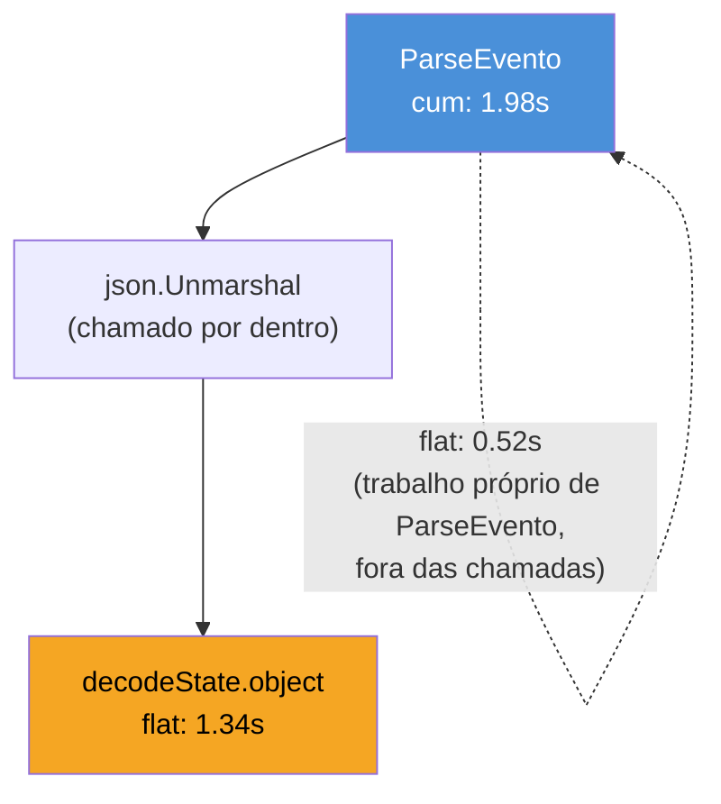
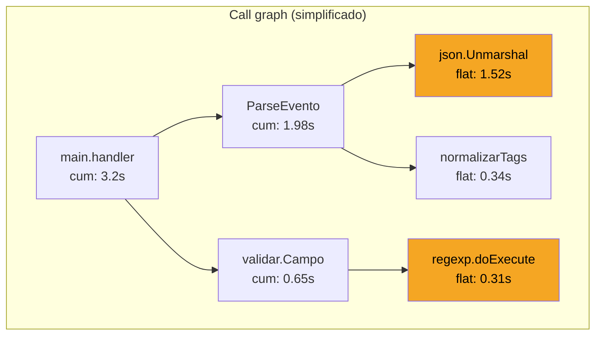

# Analisando profiles

> [!abstract] TL;DR
> A nota anterior ensinou a **gerar** um profile (`go tool pprof` recebendo um `.pprof` ou uma URL de `/debug/pprof/...`); esta ensina a **ler** um. `go tool pprof` abre um shell interativo com três comandos que resolvem 90% dos casos: `top` (quem consome mais, ordenado), `list <função>` (o profile linha a linha, sobreposto ao código-fonte) e `web`/`png` (o call graph visual, para quando `top` não deixa claro *quem chama quem*). Para vazamento de goroutine, a ferramenta muda: não é CPU nem heap, é o profile `goroutine` — uma contagem de quantas goroutines estão paradas em cada `select`/`chan receive`/`Mutex.Lock`, que cresce sem parar quando alguma goroutine nunca termina. Este capítulo lê um profile de verdade, do primeiro `top` até a linha exata do bug.

## O profile chegou. E agora?

Você rodou o que a nota anterior ensinou:

```bash
go tool pprof http://localhost:6060/debug/pprof/profile?seconds=30
```

Trinta segundos depois, o terminal muda de prompt:

```
Fetching profile over HTTP from http://localhost:6060/debug/pprof/profile?seconds=30
Saved profile in /home/dev/pprof/pprof.servico.samples.cpu.001.pb.gz
File: servico
Type: cpu
Duration: 30.09s, Total samples = 4.87s (16.19%)
Entering interactive mode (type "help" for commands)
(pprof)
```

E aqui a maioria trava. O arquivo `.pb.gz` foi salvo, o prompt `(pprof)` está esperando — mas esperando *o quê*? Isso não é um relatório pronto para ler de cima a baixo; é um banco de dados de amostras que você precisa **consultar**. `pprof` é, literalmente, um REPL com uma dúzia de comandos — e só três deles cobrem a esmagadora maioria dos diagnósticos do dia a dia. O resto desta nota é sobre esses três, na ordem em que você realmente os usa: primeiro pra saber *onde olhar*, depois pra ver *o código exato*, por último pra visualizar *como as chamadas se encadeiam*.

Antes de qualquer comando, repare na linha `Duration: 30.09s, Total samples = 4.87s (16.19%)`. Isso já é um primeiro diagnóstico grátis: o profile de CPU amostra a stack a cada 10ms *enquanto a CPU está de fato ocupada* — se o processo passou 30s rodando mas só 4.87s foram capturados como amostra de CPU ativa, o resto do tempo a goroutine estava bloqueada (I/O, `sync.Mutex`, canal, `time.Sleep`), não computando. 16% de utilização de CPU não é "profile ruim" — é informação: o gargalo desse serviço provavelmente não é CPU-bound.

## `top`: por onde começar sempre

```
(pprof) top
Showing nodes accounting for 3.92s, 80.49% of 4.87s total
Dropped 142 nodes (cum <= 0.02s)
Showing top 10 nodes out of 87
      flat  flat%   sum%        cum   cum%
     1.34s 27.52% 27.52%      1.34s 27.52%  encoding/json.(*decodeState).object
     0.81s 16.63% 44.15%      0.81s 16.63%  runtime.mallocgc
     0.52s 10.68% 54.83%      1.98s 40.66%  servico/internal/parser.ParseEvento
     0.44s  9.03% 63.86%      0.44s  9.03%  runtime.memmove
     0.31s  6.37% 70.23%      0.31s  6.37%  regexp.(*Regexp).doExecute
     0.21s  4.31% 74.54%      0.65s 13.35%  servico/internal/validar.Campo
     0.29s  5.96% 80.50%      0.29s  5.96%  ...
```

Duas colunas decidem tudo: **flat** e **cum** (cumulative). A diferença entre elas é o coração de como ler `top`, e é justamente onde quem chega do Chrome DevTools ou do `perf` costuma se confundir, porque cada ferramenta batiza essas colunas com nomes ligeiramente diferentes.

- **flat** — tempo gasto *dentro do próprio corpo* da função, sem contar o que ela chama. `encoding/json.(*decodeState).object` com `flat 1.34s` significa: o interpretador de JSON, na sua própria lógica (loops, comparações, alocações inline), consumiu 1.34s — não incluindo o tempo de funções que ele chama.
- **cum** — tempo gasto *dentro da função mais tudo que ela chama, transitivamente*. `ParseEvento` com `cum 1.98s` mas `flat` de só `0.52s` diz: a função em si é barata, mas o que ela chama (que inclui aquele `json.decodeState.object`) é caro. `cum` sempre é ≥ `flat`.



A regra prática: **ordenar por `flat`** (o padrão de `top`) responde "qual função específica é o hotspot?" — útil quando o gargalo é uma rotina isolada, tipo um regex mal otimizado. **Ordenar por `cum`** (`top -cum`) responde "qual *caminho* de chamada é o mais caro?" — útil quando o custo está espalhado por uma árvore de chamadas pequenas, nenhuma delas cara sozinha, mas juntas dominam o tempo. No exemplo acima, `flat` já entrega o vilão direto: `decodeState.object`, 27% do tempo total, é o `encoding/json` fazendo *reflection-based decoding* de structs grandes — candidato clássico a virar `encoding/json/v2` ou um decoder gerado (`easyjson`, `ffjson`), fora do escopo desta nota, mas é exatamente esse tipo de decisão que `top` habilita.

> [!question]- Por que `mallocgc` aparece no top, se o código nem chama `malloc` explicitamente?
> `runtime.mallocgc` é a função interna do runtime que aloca memória no heap — toda vez que seu código faz `make([]byte, n)`, `&Struct{}` escapando para o heap, ou `append` que precisa crescer o slice, é `mallocgc` quem executa por baixo. Ver `mallocgc` alto no profile de **CPU** (não de heap) é sinal de que alocação excessiva está consumindo tempo de processador — não é vazamento de memória, é *churn*: alocar e depois descartar rápido demais, forçando o GC a trabalhar mais. É um dos poucos casos em que profile de CPU e profile de memória apontam pro mesmo sintoma por ângulos diferentes.

## `list`: o profile sobreposto ao código

`top` disse *qual* função é o hotspot. `list` mostra *qual linha, dentro dela*:

```
(pprof) list ParseEvento
Total: 4.87s
ROUTINE ======================== servico/internal/parser.ParseEvento in /home/dev/servico/internal/parser/parser.go
     520ms      1.98s (flat, cum) 40.66% of Total
         .          .     12:func ParseEvento(raw []byte) (*Evento, error) {
         .          .     13:    var ev Evento
     180ms      1.52s     14:    if err := json.Unmarshal(raw, &ev); err != nil {
         .          .     15:        return nil, fmt.Errorf("parse: %w", err)
         .          .     16:    }
     340ms      340ms     17:    ev.Tags = normalizarTags(ev.Tags)
         .          .     18:    return &ev, nil
         .          .     19:}
```

Cada linha do código-fonte ganha duas colunas de tempo — `flat` e `cum`, mesmo significado de antes, mas agora por *linha* em vez de por *função*. A linha 14, o `json.Unmarshal`, tem `cum 1.52s` — quase todo o custo da função inteira está ali, confirmando o que `top` já sugeria. A linha 17 tem `flat 340ms` — `normalizarTags` é razoavelmente cara, mas por conta própria (sem chamadas caras dentro), então esse custo não vai aparecer explodido em outro lugar do profile.

Isso é o equivalente, em Go, ao que outras linguagens chamam de *line-level profiling* — só que aqui não é uma ferramenta separada, é o mesmo `pprof`, o mesmo arquivo de amostras, olhado com outra granularidade. O requisito para `list` funcionar é que o binário tenha sido compilado com **informação de debug** (o padrão do `go build`, sem `-ldflags="-s -w"` que a strippa) e que o código-fonte esteja acessível no caminho gravado no binário — normalmente automático em desenvolvimento, mas pode falhar em profiles coletados de um binário buildado em CI e rodado numa máquina sem o mesmo path.

`list` aceita regex, não só nome exato — `list parser\.` lista todas as funções do pacote `parser` de uma vez, útil quando o hotspot está espalhado entre 2-3 funções vizinhas em vez de concentrado numa só.

## `web` e o flame graph: quando `top` não basta

`top` e `list` respondem bem quando o custo está concentrado numa função ou numa cadeia curta. Mas às vezes o gargalo está espalhado por uma árvore de chamadas larga — dezenas de funções pequenas, nenhuma delas isoladamente no topo de `top`, mas que compartilham um padrão de chamada caro. Para isso, é melhor ver a **forma** da árvore, não a lista ordenada:

```bash
(pprof) web
```

Abre um SVG no navegador — um grafo de chamadas onde cada caixa é uma função, o **tamanho da caixa** é proporcional ao tempo (geralmente `flat`), e as **setas** mostram quem chama quem, com a espessura da seta proporcional ao tempo passado naquele caminho específico. `web` requer Graphviz instalado (`dot`) — sem ele, `pprof` recusa com um erro claro pedindo pra instalar. Se não quiser instalar Graphviz, `(pprof) png > profile.png` gera a mesma imagem como arquivo, sem abrir navegador — útil em servidor remoto sem GUI, você só copia o PNG de volta.



A alternativa mais popular hoje, e é bom saber que existe, é o **flame graph** interativo embutido:

```bash
go tool pprof -http=:8081 profile.pb.gz
```

`-http` sobe um servidor web local (não precisa mais do `(pprof)` REPL) com uma UI navegável: `top`, `graph` (o mesmo call graph de `web`, mas interativo), `flame graph` (pilhas empilhadas horizontalmente, largura = tempo, altura = profundidade de chamada — o formato popularizado por Brendan Gregg) e `source` (equivalente a `list`, mas clicável). Para exploração livre — sem saber ainda qual função procurar — a UI web geralmente ganha do REPL; para um diagnóstico pontual ("por que `ParseEvento` está lento?") o REPL com `list` é mais rápido de digitar.

> [!warning] `web`/`png` sem Graphviz falha silenciosamente feio
> A mensagem de erro (`exec: "dot": executable file not found in $PATH`) é clara, mas surpreende quem nunca precisou de Graphviz antes. Em Debian/Ubuntu, `sudo apt install graphviz`; em macOS, `brew install graphviz`. Não há como contornar sem instalar — `-http` também depende de `dot` para a aba de call graph (mas *não* para `top`, `source` ou flame graph, que funcionam sem Graphviz).

## Vazamento de goroutine: outro profile, outro raciocínio

CPU e memória (heap) respondem "o que está caro?". Uma pergunta diferente — e igualmente comum em produção — é "por que o número de goroutines só cresce?". Para essa, o profile certo não é `profile` (CPU) nem `heap`; é `goroutine`:

```bash
go tool pprof http://localhost:6060/debug/pprof/goroutine
```

```
(pprof) top
Showing nodes accounting for 4021, 99.31% of 4050 total
      flat  flat%   sum%        cum   cum%
      3998 98.72% 98.72%      3998 98.72%  runtime.gopark
         .     .   98.72%      3998 98.72%  servico/internal/worker.(*Pool).processar
         .     .   98.72%      3998 98.72%  runtime.chanrecv
```

O profile `goroutine` não mede tempo — mede **contagem**: quantas goroutines, agora mesmo, estão empilhadas em cada ponto do código. `runtime.gopark` é a função interna que qualquer goroutine bloqueada (em canal, mutex, `select`, `WaitGroup.Wait`) executa enquanto espera. Ver 3998 goroutines todas paradas em `chanrecv` dentro de `Pool.processar` é o sintoma clássico de vazamento: alguém está criando goroutines que leem de um canal que nunca mais recebe nada — o canal ficou órfão (produtor morreu, ou terminou sem fechar o canal, ou o `context` que deveria cancelar nunca foi cancelado).

O diagnóstico prático de vazamento de goroutine é comparativo, não pontual: um único snapshot de `goroutine` mostra *quantas* estão presas, mas não prova que o número está *crescendo*. Bata na rota duas vezes com alguns minutos de intervalo (ou monitore `runtime.NumGoroutine()` como métrica — assunto de [[06 - expvar e runtime metrics|nota 06]]) e compare a contagem total. Se ela sobe monotonicamente sem nunca cair, é vazamento; se oscila e volta, é só tráfego normal passando por aquele ponto.

```go
// Padrão clássico de vazamento: goroutine bloqueada num canal
// que nunca mais recebe valor nem é fechado.
func (p *Pool) processar(jobs <-chan Job) {
    for j := range jobs {
        go func(job Job) {
            resultado := executar(job)
            p.resultados <- resultado // se ninguém ler p.resultados, trava aqui pra sempre
        }(j)
    }
}
```

> [!info] `debug=2`: o dump de texto completo, sem passar pelo `pprof`
> Além da URL padrão (`/debug/pprof/goroutine`, formato binário para `pprof`), o handler aceita `?debug=2`: `curl http://localhost:6060/debug/pprof/goroutine?debug=2`. Isso devolve texto puro — a stack trace completa de *cada* goroutine, com números de linha, sem nenhum agrupamento. É mais verboso que `pprof top` (nada de agregação por função), mas é a ferramenta certa quando você precisa ver a stack **inteira** de uma goroutine específica presa num deadlock, não só um resumo agregado por função. Em produção com poucas centenas de goroutines, `?debug=2` direto no navegador ou `curl` costuma ser mais rápido que abrir o REPL do `pprof` para esse caso pontual.

## Casos práticos: os três comandos, em sequência

Fechando com o fluxo completo, do jeito que se usa de verdade — não os comandos isolados, mas a ordem em que um profile real costuma ser lido:

```bash
# 1. Coleta (nota anterior): 30s de CPU sob carga real
go tool pprof http://localhost:6060/debug/pprof/profile?seconds=30
```

```
# 2. top revela o hotspot
(pprof) top
      flat  flat%   sum%        cum   cum%
     1.34s 27.52% 27.52%      1.34s 27.52%  encoding/json.(*decodeState).object
     ...

# 3. list confirma a linha exata dentro da função que chama o hotspot
(pprof) list ParseEvento
     180ms      1.52s     14:    if err := json.Unmarshal(raw, &ev); err != nil {

# 4. web (ou -http) confirma que não há outro caminho de chamada
#    concorrendo pelo mesmo tempo — o hotspot é isolado, não espalhado
(pprof) web
```

```go
// 5. Ação concreta a partir do diagnóstico: reduzir o custo do
// encoding/json via reflection, evitando decodificar campos
// que o handler nem usa.
type EventoBruto struct {
    ID   string          `json:"id"`
    Tipo string          `json:"tipo"`
    Dados json.RawMessage `json:"dados"` // adia o parse do resto até ser preciso
}

func ParseEvento(raw []byte) (*EventoBruto, error) {
    var ev EventoBruto
    if err := json.Unmarshal(raw, &ev); err != nil {
        return nil, fmt.Errorf("parse: %w", err)
    }
    return &ev, nil
}
```

O ciclo completo — gerar profile (nota 03), ler com `top`/`list`/`web` (esta nota), mudar código, gerar profile de novo para confirmar que o `flat%` daquela função caiu — é o mesmo em qualquer profile de CPU ou memória; só a interpretação de `top` muda (para heap, as colunas viram bytes alocados/em uso em vez de tempo, mas a leitura de `flat` vs `cum` é idêntica).

## Armadilhas comuns

> [!warning] `list` não encontra a função — binário sem debug info
> `list minhaFuncao` respondendo `no matches found for regexp` quase sempre significa que o binário foi compilado com `-ldflags="-s -w"` (remove símbolos de debug, comum em builds de produção para reduzir tamanho) ou que o path do código-fonte gravado no binário não bate com o path atual da máquina onde `pprof` está rodando. Para profiling de verdade, mantenha um build sem strip disponível — ou rode `pprof` na mesma máquina/imagem que gerou o binário.

> [!warning] Comparar profiles de cargas diferentes é comparar maçã com laranja
> `top` mostra porcentagens relativas ao total daquele profile específico. Um hotspot de 30% num profile coletado com 10 requisições/s não é diretamente comparável a um hotspot de 30% coletado com 1000 requisições/s — a composição do tráfego (tamanho de payload, mix de endpoints) pode ser completamente diferente. Para comparar antes/depois de uma otimização, use `pprof -base` (`go tool pprof -base=antigo.pb.gz novo.pb.gz`), que subtrai um profile do outro e mostra só a *diferença* — muito mais confiável que comparar dois `top` lado a lado de cabeça.

> [!warning] Goroutine "presa" não é sempre vazamento
> Uma goroutine em `gopark`/`chanrecv` pode estar legitimamente esperando trabalho — um worker pool ocioso tem exatamente esse padrão, sem ser bug nenhum. O sinal de vazamento real é a **contagem crescendo sem limite** ao longo do tempo, não a mera presença de goroutines bloqueadas num instante. Sempre confirme com uma segunda amostra antes de declarar vazamento.

## Vindo de outra stack

| Vindo de | Em Go é assim |
|---|---|
| Java (`jstack`, VisualVM, JFR) | `go tool pprof goroutine` ≈ `jstack` (snapshot de todas as threads/goroutines); `pprof -http` com flame graph ≈ Java Flight Recorder + JMC; ambos exigem saber ler `flat` vs `cum` (Java chama de *self time* vs *total time*) |
| Python (`cProfile`, `py-spy`) | `list` em `pprof` é próximo do relatório por linha do `line_profiler`; `py-spy dump` para threads travadas é o equivalente direto de `?debug=2` em `/debug/pprof/goroutine` |
| Node.js (`--prof`, clinic.js flame) | O flame graph de `pprof -http` é visualmente idêntico ao do Node `--prof` processado por `clinic flame` ou pelo DevTools — mesma metáfora visual, dados coletados por amostragem estatística nos dois casos |

## Como explicar em inglês

> `go tool pprof` opens an interactive shell over a collected profile, and three commands cover most diagnostics. `top` ranks functions by **flat** time (work done inside the function itself) or **cum** time (flat plus everything it calls transitively) — flat finds an isolated hotspot, cum finds an expensive call chain. `list <function>` overlays the same per-sample timing onto the actual source lines, pinpointing exactly which statement is costly — it requires the binary to carry debug symbols (no `-ldflags="-s -w"`). `web` (needs Graphviz) or `go tool pprof -http=:PORT` renders the call graph or an interactive flame graph when the cost is spread across many small functions rather than concentrated in one. For goroutine leaks, switch profile type entirely: `/debug/pprof/goroutine` counts how many goroutines are currently parked at each blocking point (`gopark`, `chanrecv`); a growing, never-shrinking count over repeated snapshots — not a single high count — is the actual leak signal.

| Termo PT | Termo EN |
|---|---|
| tempo próprio | flat time |
| tempo cumulativo | cumulative time |
| gráfico de chamadas | call graph |
| flame graph / gráfico de chamas | flame graph |
| vazamento de goroutine | goroutine leak |
| goroutine presa/bloqueada | parked / blocked goroutine |
| amostra | sample |
| símbolos de depuração | debug symbols |

## O que vem a seguir

`pprof` é sob demanda — você olha um profile quando já suspeita de um problema. A próxima nota muda de registro: [[05 - Métricas com Prometheus|nota 05]] trata de **métricas contínuas**, expostas o tempo todo e coletadas em intervalos regulares, para você notar a degradação *antes* de precisar abrir um profile manual — o segundo dos três pilares da observabilidade, depois de logging (nota 02) e antes de tracing (nota 07).

## Veja também

- [[03 - pprof — CPU e memória|03 — pprof — CPU e memória]] — como gerar o profile que esta nota ensina a ler
- [[01 - Os três pilares em Go|01 — Os três pilares em Go]] — onde profiling se encaixa ao lado de logs, métricas e traces
- [[05 - Métricas com Prometheus|05 — Métricas com Prometheus]] — próxima nota do galho
- [[06 - expvar e runtime metrics|06 — expvar e runtime metrics]] — `runtime.NumGoroutine()` como métrica contínua, complemento ao dump manual de goroutines desta nota
- [[03-Dominios/Tecnologia/Go/index|Trilha Go]]

## Fontes

- The Go Authors. *Profiling Go Programs*. go.dev/blog. https://go.dev/blog/pprof (acessado em 2026-07-18)
- The Go Authors. *Package pprof*. pkg.go.dev. https://pkg.go.dev/runtime/pprof (acessado em 2026-07-18)
- The Go Authors. *Package pprof (net/http/pprof)*. pkg.go.dev. https://pkg.go.dev/net/http/pprof (acessado em 2026-07-18)
- Google. *pprof README — Options*. github.com/google/pprof. https://github.com/google/pprof/blob/main/doc/README.md (acessado em 2026-07-18)
- Diagnostics — Profiling. go.dev/doc/diagnostics. https://go.dev/doc/diagnostics#profiling (acessado em 2026-07-18)
