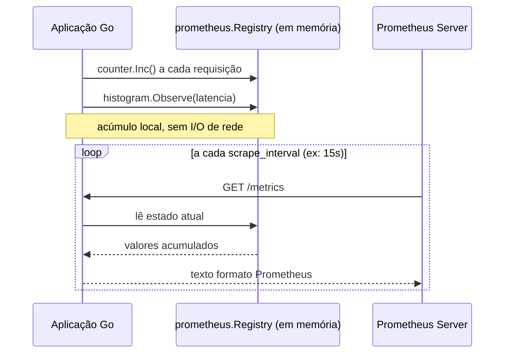
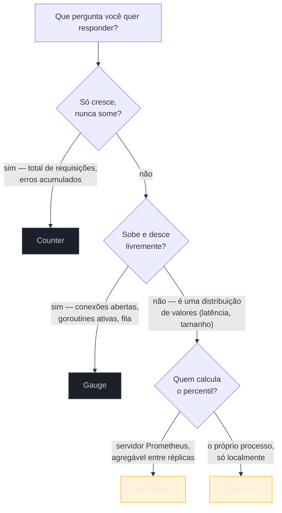
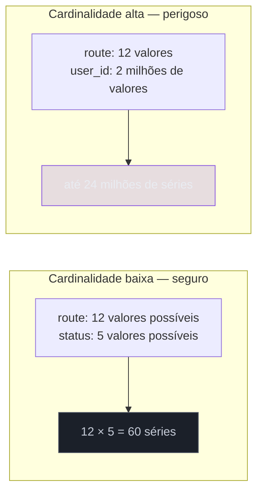

# Métricas com Prometheus

> [!abstract] TL;DR
> A biblioteca oficial `prometheus/client_golang` expõe métricas de um processo Go num endpoint HTTP (`/metrics`) em formato texto, que o servidor Prometheus **puxa** (pull) periodicamente — Go nunca empurra métrica pra fora. Existem quatro tipos: **Counter** (só sobe — requisições totais), **Gauge** (sobe e desce — conexões abertas), **Histogram** (distribuição em buckets fixos — latência com percentil aproximado calculável no servidor) e **Summary** (percentil calculado no próprio processo, sem agregação entre réplicas). A armadilha que mais derruba Prometheus em produção não é métrica errada — é **cardinalidade**: cada combinação distinta de valores de label vira uma série temporal própria, e um label com `user_id` ou `request_id` faz o número de séries explodir e derrubar o servidor de métricas inteiro.

## O problema que motiva isso

Você tem um serviço HTTP em produção. Ele está lento — mas "lento" quando? Sempre, ou só entre 14h e 15h? Só na rota `/checkout`, ou em tudo? Você olha os logs — mas logs contam a história de eventos individuais, um por um; ninguém lê 2 milhões de linhas de log pra perceber que a latência do p99 dobrou terça-feira à tarde.

O que você precisa não é de mais eventos — é de **números que se somam ao longo do tempo**: quantas requisições no total, quantas estão em voo agora, qual a distribuição de latência. Essa é a divisão de trabalho entre os três pilares da observabilidade (retomada em prosa aqui, aprofundada na trilha Operação/SRE): logs contam o que aconteceu num evento; métricas contam **quanto** e **com que frequência**, agregado; traces contam **o caminho** de uma requisição específica através do sistema.

Métricas são baratas de armazenar (um contador ocupa memória fixa, não cresce com o volume de tráfego) e baratas de consultar (somar/agregar números é rápido). É por isso que todo painel de "saúde do sistema" — o primeiro que você abre às 3h da manhã quando o pager toca — é feito de métricas, não de logs.

Prometheus virou o padrão de fato para métricas em sistemas Go porque o próprio Prometheus foi escrito em Go, e o ecossistema Kubernetes/cloud-native adotou o formato dele como língua franca — `client_golang` é a biblioteca oficial mantida pelo mesmo time.

## Pull, não push: o modelo mental que precisa mudar primeiro

Quem vem de StatsD, Graphite, ou de bibliotecas como Micrometer configuradas com um `push gateway` está acostumado a um modelo onde a **aplicação empurra** métricas periodicamente para um coletor externo. Prometheus inverte isso.



A aplicação nunca sabe que o Prometheus existe, nunca abre uma conexão de saída pra ele, nunca tem lógica de retry se o Prometheus estiver fora do ar. Ela só **acumula números em memória** (via `client_golang`) e expõe um endpoint HTTP passivo. É o Prometheus quem decide quando e com que frequência vir buscar (*scrape*) esses números — normalmente a cada 15 ou 30 segundos, configurado no lado do servidor.

Essa inversão tem uma consequência direta no código: instrumentar em Go nunca envolve escrever "enviar métrica pra fora agora" — envolve só declarar um objeto (`Counter`, `Gauge`, etc.) e chamar métodos nele (`Inc()`, `Set()`, `Observe()`). O transporte pela rede é responsabilidade de uma única linha, no `main`, que registra um `http.Handler` em `/metrics`.

## Os quatro tipos de métrica

`client_golang` oferece quatro tipos primitivos, cada um resolvendo uma pergunta diferente sobre o sistema:



### Counter — só sobe

Um `Counter` representa uma contagem cumulativa que **nunca decresce** dentro da vida do processo — só reseta a zero se o processo reiniciar. É o tipo certo para "total de requisições recebidas", "total de erros", "total de bytes processados".

```go
package main

import "github.com/prometheus/client_golang/prometheus"

var requestsTotal = prometheus.NewCounter(prometheus.CounterOpts{
    Name: "http_requests_total",
    Help: "Total de requisições HTTP recebidas",
})

func init() {
    prometheus.MustRegister(requestsTotal)
}

func handler() {
    requestsTotal.Inc() // +1
    // requestsTotal.Add(5) também existe, mas só aceita valores >= 0
}
```

A API impõe a semântica: `Counter` tem `Inc()` e `Add(float64)`, mas `Add` recusa (via `panic`) valores negativos — não há como um Counter "descer" por engano.

### Gauge — sobe e desce

Um `Gauge` é um valor que pode assumir qualquer número a qualquer momento — sobe, desce, é redefinido. É o tipo certo para "conexões abertas agora", "goroutines em execução", "tamanho atual da fila", "temperatura da CPU".

```go
var connectionsOpen = prometheus.NewGauge(prometheus.GaugeOpts{
    Name: "app_connections_open",
    Help: "Número de conexões abertas neste momento",
})

func init() {
    prometheus.MustRegister(connectionsOpen)
}

func onConnect()    { connectionsOpen.Inc() }
func onDisconnect()  { connectionsOpen.Dec() }
func setQueueSize(n int) { connectionsOpen.Set(float64(n)) }
```

`Gauge` tem `Inc()`, `Dec()`, `Add()`, `Sub()` e `Set()` — o espectro completo de operações que um contador simples proíbe.

### Histogram — distribuição em buckets, agregável no servidor

Um `Histogram` observa valores contínuos (latência, tamanho de payload) e os classifica em **buckets** — faixas cumulativas pré-definidas. Internamente, um `Histogram` do Prometheus é, na verdade, um conjunto de Counters: um por bucket, mais um `_sum` e um `_count`.

```go
var requestDuration = prometheus.NewHistogram(prometheus.HistogramOpts{
    Name:    "http_request_duration_seconds",
    Help:    "Distribuição da duração das requisições HTTP",
    Buckets: []float64{0.005, 0.01, 0.025, 0.05, 0.1, 0.25, 0.5, 1, 2.5, 5},
})

func init() {
    prometheus.MustRegister(requestDuration)
}

func handler() {
    start := time.Now()
    defer func() {
        requestDuration.Observe(time.Since(start).Seconds())
    }()
    // ... lógica do handler
}
```

A grande vantagem do Histogram sobre o Summary: os buckets brutos ficam expostos como séries próprias (`http_request_duration_seconds_bucket{le="0.1"}`), e é o **servidor** Prometheus quem calcula percentis a partir deles, na hora da consulta (`histogram_quantile(0.99, ...)`). Isso significa que dá pra somar buckets de múltiplas réplicas do serviço e calcular um p99 **agregado da frota inteira** — algo que o Summary não permite.

### Summary — percentil calculado localmente, sem agregação

Um `Summary` também observa valores contínuos, mas calcula os percentis **dentro do próprio processo**, usando uma janela deslizante configurável (`Objectives`), e expõe só os percentis prontos.

```go
var requestDurationSummary = prometheus.NewSummary(prometheus.SummaryOpts{
    Name: "http_request_duration_summary_seconds",
    Help: "Duração das requisições (percentis calculados localmente)",
    Objectives: map[float64]float64{
        0.5:  0.05,  // p50 com erro absoluto de 5%
        0.9:  0.01,  // p90 com erro absoluto de 1%
        0.99: 0.001, // p99 com erro absoluto de 0.1%
    },
})
```

O `Summary` custa mais CPU por observação (o cálculo de quantil é feito a cada `Observe`) e, crucialmente, **não é agregável entre instâncias**: o p99 da réplica A e o p99 da réplica B não podem ser combinados matematicamente num p99 "da frota" — cada um já é um resumo estatístico fechado. Por isso, a recomendação corrente da documentação oficial e da prática da comunidade é: **prefira Histogram por padrão**, e reserve Summary para os casos raros em que você precisa de um percentil preciso de uma única instância e não vai agregar entre réplicas.

| | Histogram | Summary |
|---|---|---|
| Onde o percentil é calculado | no servidor Prometheus, na hora da query | no processo Go, a cada `Observe` |
| Agregável entre réplicas | sim (soma buckets, depois calcula quantil) | não |
| Custo em runtime | baixo (incrementa um bucket) | mais alto (mantém estrutura de quantil) |
| Precisão do percentil | aproximada, depende dos buckets escolhidos | configurável via `Objectives` |
| Recomendação padrão | **sim, use por padrão** | só em casos específicos, sem agregação |

> [!info] `NewHistogramVec`/`NewCounterVec`/`NewGaugeVec` para métricas com labels
> Os exemplos acima criam métricas sem dimensão — um único valor. Na prática, quase toda métrica de produção precisa de **labels**: `method`, `route`, `status_code`. `client_golang` oferece as variantes `*Vec` (`NewCounterVec`, `NewGaugeVec`, `NewHistogramVec`, `NewSummaryVec`) para isso — assunto central da próxima seção, sobre cardinalidade.

## Expondo `/metrics`

O passo final é registrar um `http.Handler` que serializa o estado de todas as métricas registradas no formato texto do Prometheus, sempre que alguém fizer `GET /metrics`.

```go
package main

import (
    "log"
    "net/http"

    "github.com/prometheus/client_golang/prometheus/promhttp"
)

func main() {
    http.Handle("/metrics", promhttp.Handler())
    log.Fatal(http.ListenAndServe(":2112", nil))
}
```

`promhttp.Handler()` usa o registry global padrão (`prometheus.DefaultRegisterer`), o mesmo onde `prometheus.MustRegister` registrou os Counters e Gauges das seções anteriores. Um `curl localhost:2112/metrics` depois de algumas requisições produz algo como:

```
# HELP http_requests_total Total de requisições HTTP recebidas
# TYPE http_requests_total counter
http_requests_total 42

# HELP app_connections_open Número de conexões abertas neste momento
# TYPE app_connections_open gauge
app_connections_open 3

# HELP http_request_duration_seconds Distribuição da duração das requisições HTTP
# TYPE http_request_duration_seconds histogram
http_request_duration_seconds_bucket{le="0.005"} 10
http_request_duration_seconds_bucket{le="0.01"} 25
http_request_duration_seconds_bucket{le="0.025"} 40
http_request_duration_seconds_bucket{le="+Inf"} 42
http_request_duration_seconds_sum 3.14
http_request_duration_seconds_count 42
```

Cada métrica vem com um comentário `# HELP` (a `Help` string que você declarou) e `# TYPE` — esse texto plano, legível por humano e por máquina, é o formato de exposição do Prometheus (hoje também disponível em OpenMetrics, um formato irmão padronizado pela CNCF a partir do mesmo texto).

> [!info] `promhttp.InstrumentMetricHandler` para métricas sobre o próprio endpoint de métricas
> Se você quiser saber quantas vezes o próprio `/metrics` foi raspado (útil pra detectar scrape configurado errado, batendo com frequência excessiva), `promhttp.InstrumentMetricHandler(reg, promhttp.Handler())` envolve o handler com contadores próprios. Não é o caso comum — mencionado aqui só pra você saber que existe.

## Instrumentando um handler HTTP de verdade

Juntando os tipos e o registro, um handler instrumentado de ponta a ponta:

```go
package main

import (
    "log"
    "net/http"
    "strconv"
    "time"

    "github.com/prometheus/client_golang/prometheus"
    "github.com/prometheus/client_golang/prometheus/promhttp"
)

var (
    requestsTotal = prometheus.NewCounterVec(
        prometheus.CounterOpts{
            Name: "http_requests_total",
            Help: "Total de requisições HTTP, por rota e status",
        },
        []string{"route", "status"}, // labels — cuidado com cardinalidade
    )

    requestDuration = prometheus.NewHistogramVec(
        prometheus.HistogramOpts{
            Name:    "http_request_duration_seconds",
            Help:    "Duração das requisições HTTP, por rota",
            Buckets: prometheus.DefBuckets, // buckets padrão do client_golang
        },
        []string{"route"},
    )
)

func init() {
    prometheus.MustRegister(requestsTotal, requestDuration)
}

func instrumented(route string, next http.HandlerFunc) http.HandlerFunc {
    return func(w http.ResponseWriter, r *http.Request) {
        start := time.Now()
        rw := &statusRecorder{ResponseWriter: w, status: http.StatusOK}

        next(rw, r)

        requestDuration.WithLabelValues(route).Observe(time.Since(start).Seconds())
        requestsTotal.WithLabelValues(route, strconv.Itoa(rw.status)).Inc()
    }
}

type statusRecorder struct {
    http.ResponseWriter
    status int
}

func (r *statusRecorder) WriteHeader(code int) {
    r.status = code
    r.ResponseWriter.WriteHeader(code)
}

func checkoutHandler(w http.ResponseWriter, r *http.Request) {
    // lógica de negócio real aqui
    w.WriteHeader(http.StatusOK)
}

func main() {
    mux := http.NewServeMux()
    mux.HandleFunc("/checkout", instrumented("/checkout", checkoutHandler))
    mux.Handle("/metrics", promhttp.Handler())

    log.Fatal(http.ListenAndServe(":8080", mux))
}
```

> [!info] `net/http.ServeMux` com padrões de método e wildcard — Go 1.22
> Desde a versão 1.22 do Go, o `ServeMux` da biblioteca padrão aceita padrões como `"GET /checkout/{id}"`, com extração de parâmetro via `r.PathValue("id")` — antes disso, praticamente todo projeto Go precisava de um router de terceiros (`chi`, `gorilla/mux`) só pra isso. O exemplo acima usa a forma simples propositalmente; em produção, o `route` usado como label deveria vir do **padrão da rota** (`/checkout/{id}`), nunca do path literal (`/checkout/8827`) — motivo detalhado na próxima seção.

Repare no papel do `statusRecorder`: `http.ResponseWriter` não expõe o status code depois de escrito, então o wrapper intercepta `WriteHeader` pra capturar o valor antes de repassar pro `ResponseWriter` real. É um padrão comum em qualquer middleware Go que precise inspecionar a resposta.

## Cardinalidade: a armadilha que derruba servidores Prometheus

Aqui está o conceito que separa quem instrumenta métricas em produção de quem só copiou um exemplo do tutorial. Cada combinação **distinta** de valores de label numa métrica `*Vec` cria uma **série temporal nova**, armazenada e indexada separadamente pelo Prometheus.



`requestsTotal.WithLabelValues("/checkout", "200")` e `requestsTotal.WithLabelValues("/checkout", "500")` são duas séries diferentes dentro da mesma métrica `http_requests_total`. Isso é intencional e é o que torna Prometheus útil — você consegue somar, filtrar e agrupar por label depois, na query. O problema aparece quando um label carrega um valor de **alta cardinalidade**: um `user_id`, um `request_id`, um `session_token`, ou — o erro mais comum de todos — o **path literal** de uma URL com parâmetro (`/checkout/8827` em vez do padrão `/checkout/{id}`).

Cada `user_id` distinto que passa pelo sistema vira uma série nova, para sempre (Prometheus não some com séries antigas rapidamente — elas ficam retidas pelo período de retenção configurado). Um serviço com 2 milhões de usuários ativos, instrumentado com um label `user_id`, pode gerar dezenas de milhões de séries — e cada série consome memória no Prometheus. Esse é o cenário clássico de incidente onde o time de plataforma vê o próprio servidor Prometheus consumindo toda a RAM da máquina e caindo, sem nenhuma mudança de código na aplicação instrumentada — só tráfego orgânico crescendo com uma métrica mal desenhada.

> [!warning] Regra prática de cardinalidade
> Um label só deve carregar valores de um conjunto **pequeno e conhecido em tempo de compilação** (ou próximo disso): método HTTP, código de status, nome da rota (o padrão, não o path resolvido), nome do worker, região. Nunca IDs de usuário, IDs de requisição, timestamps, ou qualquer texto livre. Se você sentir vontade de colocar `error.Error()` como valor de label — não faça: mensagens de erro têm variação virtualmente ilimitada. Para detalhe de erro específico, isso é assunto de log ou trace, não de métrica.

> [!warning] `WithLabelValues` com a ordem errada não gera erro de compilação
> `requestsTotal.WithLabelValues(route, status)` depende da **posição** dos argumentos bater com a ordem declarada em `[]string{"route", "status"}` — o compilador não valida nomes de label, só a contagem de strings. Inverter a ordem (`WithLabelValues(status, route)`) compila normalmente e produz métricas com labels trocados silenciosamente, só descoberto quando alguém estranha um `route="200"` no painel. `With(prometheus.Labels{"route": route, "status": status})` é mais verboso, mas evita esse erro por depender do nome, não da posição — vale a troca em código que muda com frequência.

## Armadilhas comuns

> [!warning] Esquecer de registrar a métrica
> `prometheus.NewCounter(...)` só **cria** o objeto — ele fica invisível em `/metrics` até você chamar `prometheus.MustRegister(minhaMetrica)`. É um erro silencioso: o código compila, `Inc()` não gera panic nenhum, e a métrica simplesmente nunca aparece no scrape. `MustRegister` entra em pânico se você tentar registrar duas métricas com o mesmo nome — geralmente sinal de que o `init()` está rodando duas vezes ou de um nome duplicado por acidente.

> [!warning] Buckets de Histogram mal escolhidos mancham o percentil calculado
> Se todos os seus buckets terminam em `1` segundo mas a latência real do serviço varia entre `2ms` e `50ms`, todo valor cai no primeiro bucket — o histograma não tem resolução nenhuma pra distinguir p50 de p99 dentro dessa faixa. `prometheus.DefBuckets` (`.005` a `10` segundos, 11 buckets) é um ponto de partida razoável para APIs HTTP, mas vale ajustar aos SLOs reais do seu serviço — mencionado aqui, discutido a fundo na trilha Operação/SRE, onde SLI/SLO ganham nota própria.

> [!warning] Um `Gauge` chamado de `Counter` (ou vice-versa) engana quem consome o painel
> Nada no Go impede você de usar um `Gauge` para representar "total de requisições" — ele vai funcionar, subir junto com o tráfego. Mas quem monta um painel espera que `_total` só cresça (para calcular taxa com `rate()`) e que um `Gauge` reflita um valor instantâneo. Nomear e tipar errado não quebra o código — quebra a query de quem consome depois. A convenção de sufixo `_total` para Counter é [documentada oficialmente](https://prometheus.io/docs/practices/naming/) e vale seguir à risca.

## Vindo de outra stack

| Ecossistema | Biblioteca/mecanismo equivalente | Diferença que mais pega |
|---|---|---|
| Java (Spring Boot) | Micrometer + Actuator `/actuator/prometheus` | Micrometer abstrai múltiplos backends (Prometheus, Datadog, CloudWatch); `client_golang` é Prometheus-only por padrão |
| Node.js | `prom-client` | API quase idêntica em espírito (Counter/Gauge/Histogram/Summary); `client_golang` é mais explícito sobre registro manual |
| Python | `prometheus_client` | Mesmo modelo pull, mesmo formato de exposição — o design do Go influenciou diretamente o cliente Python |
| .NET | `prometheus-net` | Também precisa de registro explícito, mesma armadilha de cardinalidade |

A boa notícia de quem já mexeu com Micrometer ou `prom-client`: o modelo mental (pull, tipos primitivos, labels, cardinalidade) é o mesmo em toda a indústria, porque todos implementam o mesmo protocolo de exposição do Prometheus. O que muda entre linguagens é só a verbosidade da API — Go, fiel ao próprio estilo, exige `MustRegister` explícito onde outras bibliotecas às vezes registram sozinhas por convenção.

## Como explicar em inglês

> Prometheus instrumentation in Go, via `client_golang`, follows a **pull** model: the application accumulates metrics in memory using one of four primitive types — **Counter** (monotonically increasing), **Gauge** (goes up and down), **Histogram** (bucketed distribution, aggregatable server-side across replicas), or **Summary** (quantiles computed locally, not aggregatable) — and exposes them on an HTTP endpoint, typically `/metrics`, via `promhttp.Handler()`. The Prometheus server scrapes that endpoint on its own schedule; the application never pushes anything out. The single most dangerous mistake in production instrumentation is **cardinality**: every distinct combination of label values on a `*Vec` metric creates a brand-new time series, so a label carrying a `user_id` or a literal request path can generate millions of series and take down the Prometheus server's memory — labels should only ever carry values from a small, bounded set known in advance.

| Termo PT | Termo EN |
|---|---|
| contador | counter |
| medidor | gauge |
| histograma | histogram |
| resumo | summary |
| cardinalidade | cardinality |
| série temporal | time series |
| raspagem (coleta) | scrape |
| balde (faixa) | bucket |
| rótulo | label |
| registrador de métricas | registry |

## O que vem a seguir

`client_golang` cobre a instrumentação deliberada — métricas que você desenha e nomeia à mão, pensando em cardinalidade e em que pergunta cada série responde. Mas o runtime do próprio Go já carrega um conjunto rico de números — goroutines vivas, heap em uso, pausas de GC — sem que você escreva um `Counter` sequer. A [[06 - expvar e runtime metrics|nota 06]] mostra como expor esses dados internos via `expvar` (a forma leve, nativa da biblioteca padrão) e como o próprio `client_golang` já os publica automaticamente quando você registra o `Collector` padrão de runtime — o complemento natural às métricas de negócio vistas aqui.

## Veja também

- [[01 - Os três pilares em Go|01 — Os três pilares em Go]] — onde métricas se encaixam ao lado de logging e tracing
- [[02 - Logging estruturado com slog|02 — Logging estruturado com slog]] — o pilar irmão, para eventos individuais em vez de agregados
- [[06 - expvar e runtime metrics|06 — expvar e runtime metrics]] — próxima nota do galho
- [[07 - OpenTelemetry — tracing|07 — OpenTelemetry — tracing]] — o terceiro pilar, para rastrear uma requisição específica através do sistema
- [[03-Dominios/Tecnologia/Go/index|Trilha Go]]

## Fontes

- Prometheus Authors. *Client library documentation — Go*. prometheus.io. https://prometheus.io/docs/instrumenting/clientlibs/ (acessado em 2026-07-18)
- Prometheus Authors. *Metric and label naming*. prometheus.io. https://prometheus.io/docs/practices/naming/ (acessado em 2026-07-18)
- Prometheus Authors. *Histograms and summaries*. prometheus.io. https://prometheus.io/docs/practices/histograms/ (acessado em 2026-07-18)
- pkg.go.dev. *Package prometheus (client_golang)*. https://pkg.go.dev/github.com/prometheus/client_golang/prometheus (acessado em 2026-07-18)
- pkg.go.dev. *Package promhttp*. https://pkg.go.dev/github.com/prometheus/client_golang/prometheus/promhttp (acessado em 2026-07-18)
- The Go Authors. *Go 1.22 Release Notes — Enhanced routing patterns*. go.dev. https://go.dev/doc/go1.22#enhanced_routing_patterns (acessado em 2026-07-18)
