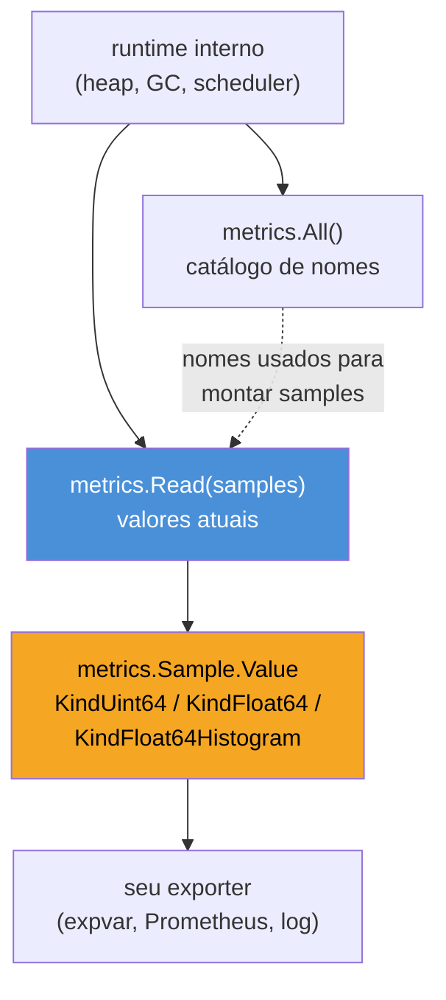

# expvar e runtime metrics

> [!abstract] TL;DR
> `expvar` é um pacote da standard library que expõe variáveis do processo — contadores, gauges, mapas — em `/debug/vars` como JSON, sem dependência externa nenhuma. `runtime/metrics` vai além: expõe **centenas de métricas internas do runtime Go** (heap, GC, goroutines, scheduler) por uma API estável e tipada, substituindo o antigo `runtime.ReadMemStats`. Nenhum dos dois é Prometheus — `expvar` não fala o formato de exposição do Prometheus, e `runtime/metrics` é uma fonte de dados, não um servidor HTTP. Na prática: use `runtime/metrics` (às vezes via um exporter pronto) para alimentar o painel de GC/heap que todo serviço Go deveria ter, e reserve `expvar` para debug rápido local ou serviços pequenos onde instalar Prometheus é exagero. Para produção séria, o galho já apontou pra `05 - Métricas com Prometheus` — esta nota cobre o que o runtime dá **de graça**, sem escrever uma métrica sequer.

## O problema: seu serviço já sabe o que você quer saber

Imagine que a nota 05 te convenceu: você instrumentou o serviço com Prometheus, tem contadores de requisição, histograma de latência. Mas em produção o serviço começa a ficar lento sob carga, e a pergunta que salta é outra: **é o meu código, ou é o GC brigando com o heap?** Quantas goroutines estão vivas agora? O heap está crescendo sem parar ou só oscilando com o ciclo de GC?

Nenhuma dessas perguntas exige que você escreva uma métrica nova. O runtime do Go já sabe as respostas — ele monitora o próprio heap, conta suas próprias goroutines, cronometra suas próprias pausas de GC, porque precisa disso para funcionar. A pergunta não é "como eu meço isso", é "como eu **leio** o que o runtime já mede". É exatamente aí que `expvar` e `runtime/metrics` entram: dois jeitos de puxar esse estado interno para fora, sem instrumentar nada manualmente.

São ferramentas complementares, não concorrentes. `expvar` é um mecanismo de **exposição** — publica valores (dos seus ou do runtime) num endpoint HTTP JSON. `runtime/metrics` é uma **fonte** de dados — só entrega números, cabe a você decidir onde publicá-los. Dá pra combinar os dois, como o próprio `expvar` já faz de fábrica.

## expvar: variáveis do processo em JSON

`expvar` existe desde as primeiras versões públicas do Go. A ideia é simples: você registra variáveis nomeadas — inteiros, floats, strings, mapas, ou qualquer coisa com `String() string` — e o pacote as serve automaticamente em `/debug/vars` como JSON, assim que você importa o pacote (ele registra o handler via `init()`).

```go
package main

import (
    "expvar"
    "log"
    "net/http"
)

var (
    requestCount = expvar.NewInt("request_count")
    activeUsers  = expvar.NewMap("active_users")
)

func handler(w http.ResponseWriter, r *http.Request) {
    requestCount.Add(1)
    activeUsers.Add(r.Header.Get("X-User-Region"), 1)
    w.Write([]byte("ok"))
}

func main() {
    http.HandleFunc("/", handler)
    log.Fatal(http.ListenAndServe(":8080", nil))
}
```

Só importar `"expvar"` já registra `/debug/vars` no `http.DefaultServeMux`. Abrindo `http://localhost:8080/debug/vars` no navegador (ou com `curl`), você vê algo como:

```json
{
  "active_users": {"br": 12, "us": 3},
  "cmdline": ["/tmp/go-build.../exe/main"],
  "memstats": {"Alloc": 1834520, "TotalAlloc": 1834520, "...": "..."},
  "request_count": 47
}
```

Repare em `cmdline` e `memstats`: eles aparecem sem você ter registrado nada — `expvar` publica automaticamente `os.Args` (via `cmdline`) e o resultado de `runtime.ReadMemStats` (via `memstats`). Isso já entrega, de graça, um retrato bruto do heap sem escrever uma linha de instrumentação — é o ponto de partida mais barato possível para "como está a memória do meu serviço agora".

```mermaid
flowchart LR
    A["expvar.NewInt / NewFloat / NewString / NewMap"] --> B["Var registrada\nno expvar.Map global"]
    C["import _ \"expvar\" (init automático)"] --> D["/debug/vars\nhttp.HandleFunc"]
    B --> D
    E["runtime.ReadMemStats\n(automático)"] --> D
    D --> F["Resposta JSON\n(cliente HTTP, curl, browser)"]

    style D fill:#4A90D9,color:#fff
    style F fill:#F5A623,color:#000
```

`expvar.NewInt`, `NewFloat`, `NewString` e `NewMap` retornam ponteiros para tipos que já são **thread-safe** — todos usam operações atômicas ou mutex internamente, então chamar `.Add()` de várias goroutines concorrentes é seguro sem lock extra do seu lado. Isso importa porque contadores de requisição normalmente são incrementados de handlers concorrentes.

> [!info] `expvar.Publish` para valores customizados
> Além dos tipos prontos, `expvar.Publish(name string, v Var)` aceita qualquer valor que implemente a interface `expvar.Var` — um único método, `String() string`, que deve retornar JSON válido. É assim que você expõe uma struct inteira, ou um valor calculado sob demanda (`expvar.Func`), em vez de só inteiros e mapas.

```go
var startTime = time.Now()

func init() {
    expvar.Publish("uptime_seconds", expvar.Func(func() any {
        return time.Since(startTime).Seconds()
    }))
}
```

`expvar.Func` é um adaptador — qualquer `func() any` vira uma `expvar.Var`, recalculada a cada leitura de `/debug/vars`. É o padrão usado para valores derivados (uptime, tamanho de uma fila, taxa calculada na hora) em vez de contadores acumulados manualmente.

## As limitações de expvar

`expvar` resolve debug rápido, mas não substitui um sistema de métricas de produção — e vale entender por quê antes de escolher onde usá-lo:

- **Formato JSON, não Prometheus.** `/debug/vars` não fala o formato de exposição `# HELP` / `# TYPE` que o Prometheus espera (visto na nota 05). Um scraper Prometheus não lê `expvar` direto — precisaria de um *exporter* que traduza JSON para o formato Prometheus.
- **Sem séries temporais nem agregação.** `expvar` mostra o valor **atual**. Não há histórico, não há `rate()`, não há dashboard — cada leitura é um snapshot isolado, útil pra "olhar agora", inútil pra "ver a tendência das últimas 2 horas".
- **Sem histograma nativo.** Só contadores, gauges, mapas e valores customizados via `String()`. Latência com percentis — o caso de uso mais comum em produção — não tem representação direta.

Por isso o desenho típico é: `expvar` para debug ad-hoc e serviços pequenos onde subir Prometheus é desproporcional ao tamanho do problema; Prometheus (ou outro sistema de métricas real) para produção com SLO, alertas e dashboards histórico — assunto que a trilha Operação cobre em profundidade sob a ótica de SRE.

> [!warning] `/debug/vars` no `DefaultServeMux` é uma superfície de exposição
> Assim como `net/http/pprof` (visto na nota 03 deste galho), importar `expvar` registra o handler automaticamente no `http.DefaultServeMux` — se seu serviço expõe esse mux publicamente, `/debug/vars` fica acessível para qualquer cliente. `memstats` sozinho já revela detalhes de operação (uso de heap, contagem de GC) que você pode não querer expor à internet aberta. Solução igual à do pprof: sirva `/debug/vars` num mux separado, numa porta interna, atrás de autenticação — nunca no listener público.

## runtime/metrics: o inventário oficial do runtime

`memstats`, exposto por `expvar` ou lido direto via `runtime.ReadMemStats`, tem um problema de fundo: é uma struct **congelada** desde as primeiras versões do Go. Cada campo novo que o runtime quisesse expor exigiria quebrar a API pública — na prática, o time do Go quase nunca adiciona campos, e o que existe já está datado frente ao que o runtime moderno (com GC generacional-ish, scheduler mais sofisticado) realmente rastreia internamente.

O pacote `runtime/metrics`, estável desde o **Go 1.16**, resolve isso com um desenho diferente: em vez de uma struct fixa, expõe um **catálogo de métricas nomeadas por string**, consultável em tempo de execução. Novas métricas podem ser adicionadas em releases futuras sem quebrar nada — seu código já lida com "métrica pode não existir nesta versão do Go" desde o primeiro dia.

```go
package main

import (
    "fmt"
    "runtime/metrics"
)

func main() {
    // Descobre todas as métricas disponíveis nesta versão do Go.
    descs := metrics.All()
    fmt.Println("total de métricas disponíveis:", len(descs))

    // Lê duas métricas específicas: heap em uso e número de goroutines.
    samples := []metrics.Sample{
        {Name: "/memory/classes/heap/objects:bytes"},
        {Name: "/sched/goroutines:goroutines"},
    }
    metrics.Read(samples)

    for _, s := range samples {
        switch s.Value.Kind() {
        case metrics.KindUint64:
            fmt.Printf("%s = %d\n", s.Name, s.Value.Uint64())
        case metrics.KindFloat64:
            fmt.Printf("%s = %f\n", s.Name, s.Value.Float64())
        }
    }
}
```

`metrics.All()` retorna a lista completa de nomes e descrições disponíveis na versão do Go em uso — no Go 1.23, são mais de 80 métricas. `metrics.Read` preenche um slice de `metrics.Sample` com os valores atuais, num único passe: é a mesma chamada interna que o runtime usa para consolidar `memstats`, só que exposta de forma extensível e mais granular.



Os nomes seguem um padrão hierárquico com unidade no sufixo — `/memory/classes/heap/objects:bytes`, `/sched/goroutines:goroutines`, `/gc/pauses:seconds` — o que torna o catálogo autodescritivo: dá pra saber o que uma métrica mede e em que unidade só pelo nome, sem consultar documentação externa.

### As métricas que mais importam no dia a dia

De mais de 80 disponíveis, um punhado cobre 90% dos diagnósticos reais de produção:

| Métrica | O que mede | Por que importa |
|---|---|---|
| `/memory/classes/heap/objects:bytes` | Heap ativo em uso por objetos vivos | Vazamento de memória aparece como esta métrica só crescendo, ciclo após ciclo de GC |
| `/gc/heap/goal:bytes` | Meta de tamanho de heap que o GC persegue | Compara com o heap real para saber se o GC está "correndo atrás" |
| `/sched/goroutines:goroutines` | Goroutines vivas agora | Vazamento de goroutine (uma delas nunca retorna) aparece como crescimento sem limite aqui |
| `/gc/pauses:seconds` (histograma) | Distribuição de duração das pausas de GC | Cauda longa nas pausas explica latência p99 ruim mesmo com CPU sobrando |
| `/cpu/classes/gc/total:cpu-seconds` | Tempo de CPU total gasto em GC | Se está alto, `GOGC`/`GOMEMLIMIT` (Galho 17) provavelmente precisam de ajuste |

> [!info] `GOGC` e `GOMEMLIMIT`
> `GOGC` controla a agressividade do garbage collector desde sempre; `GOMEMLIMIT`, desde o **Go 1.19**, define um teto absoluto de memória que o runtime respeita mesmo que isso signifique coletar mais vezes. As métricas desta nota (`/gc/heap/goal:bytes`, `/memory/classes/...`) são exatamente o que você observa para decidir se vale ajustar essas variáveis — o ajuste em si, e o funcionamento interno do GC, é assunto do Galho 17 (runtime e GC interno), não desta nota.

### De MemStats para runtime/metrics

Quem já usava `runtime.MemStats` reconhece os nomes antigos escondidos atrás da nova nomenclatura — a tabela abaixo ajuda a migrar:

| Campo em `runtime.MemStats` | Métrica equivalente em `runtime/metrics` |
|---|---|
| `HeapAlloc` | `/memory/classes/heap/objects:bytes` |
| `HeapSys` | `/memory/classes/heap/*` (soma das subclasses) |
| `NumGC` | `/gc/cycles/total:gc-cycles` |
| `PauseTotalNs` | soma de `/gc/pauses:seconds` (histograma) |
| `NumGoroutine` (função separada, `runtime.NumGoroutine()`) | `/sched/goroutines:goroutines` |

A diferença de fundo não é só cosmética: `MemStats` agrupa memória em poucas categorias amplas (`HeapSys`, `StackSys`, `MSpanSys`...); `runtime/metrics` fatia `/memory/classes/...` em dezenas de subclasses (objetos vivos, espaço livre, metadados do próprio GC, pilhas ociosas), permitindo perguntas mais específicas do tipo "quanto do meu heap é overhead do GC versus dados reais da aplicação" — pergunta que `MemStats` sozinho não responde.

### Histogramas nativos

Algumas métricas — como `/gc/pauses:seconds` — não são um número único, mas um **histograma**, do tipo `metrics.KindFloat64Histogram`. É a mesma ideia de histograma vista na nota 05 sobre Prometheus (buckets com contagem por faixa), só que já calculado pelo runtime:

```go
samples := []metrics.Sample{{Name: "/gc/pauses:seconds"}}
metrics.Read(samples)

hist := samples[0].Value.Float64Histogram()
for i, count := range hist.Counts {
    if count > 0 {
        fmt.Printf("[%v, %v): %d pausas\n", hist.Buckets[i], hist.Buckets[i+1], count)
    }
}
```

Não é preciso escrever lógica de bucketing — `runtime/metrics` já entrega a distribuição pronta. Isso é útil pra quem quer publicar a mesma distribuição como um histograma Prometheus real, em vez de reduzir tudo a uma média que esconde a cauda longa.

## Casos práticos: combinando os dois

**1. Servidor de debug local com `expvar` + `runtime/metrics`**, publicando métricas selecionadas do runtime junto com contadores da aplicação:

```go
package main

import (
    "expvar"
    "net/http"
    "runtime/metrics"
)

func init() {
    expvar.Publish("goroutines", expvar.Func(func() any {
        samples := []metrics.Sample{{Name: "/sched/goroutines:goroutines"}}
        metrics.Read(samples)
        return samples[0].Value.Uint64()
    }))

    expvar.Publish("heap_bytes", expvar.Func(func() any {
        samples := []metrics.Sample{{Name: "/memory/classes/heap/objects:bytes"}}
        metrics.Read(samples)
        return samples[0].Value.Uint64()
    }))
}

func main() {
    // /debug/vars agora expõe "goroutines" e "heap_bytes" com dados
    // de runtime/metrics, além de memstats e cmdline já automáticos.
    http.ListenAndServe("localhost:6060", nil)
}
```

Note o `localhost:6060` — não `0.0.0.0` — reforçando a advertência anterior sobre não expor `/debug/vars` publicamente.

**2. Alerta manual de vazamento de goroutine**, útil em testes de carga ou scripts de diagnóstico:

```go
package main

import (
    "fmt"
    "runtime/metrics"
    "time"
)

func monitorarGoroutines(limite uint64) {
    samples := []metrics.Sample{{Name: "/sched/goroutines:goroutines"}}
    for range time.Tick(10 * time.Second) {
        metrics.Read(samples)
        n := samples[0].Value.Uint64()
        if n > limite {
            fmt.Printf("ALERTA: %d goroutines vivas (limite %d)\n", n, limite)
        }
    }
}
```

**3. Exportando para Prometheus**, o caminho mais comum em produção — não é preciso escrever à mão: a biblioteca oficial `client_golang` já traz um coletor pronto que lê `runtime/metrics` e publica no formato Prometheus (`collectors.NewGoCollector()`), registrado automaticamente por padrão em qualquer `prometheus.NewRegistry()`. O trabalho manual mostrado acima serve para entender **o que** está por trás desse coletor — em produção, a nota 05 já cobre como registrar e servir métricas Prometheus completas.

**4. Checagem de vazamento de goroutine em teste**, um padrão comum em suítes de testes de bibliotecas concorrentes — comparar a contagem de goroutines antes e depois de exercitar o código sob teste:

```go
package fila_test

import (
    "runtime/metrics"
    "testing"
    "time"
)

func contarGoroutines() uint64 {
    samples := []metrics.Sample{{Name: "/sched/goroutines:goroutines"}}
    metrics.Read(samples)
    return samples[0].Value.Uint64()
}

func TestFilaNaoVazaGoroutine(t *testing.T) {
    antes := contarGoroutines()

    f := NovaFila()
    f.Processar(func() {})
    f.Fechar()

    // dá tempo do scheduler encerrar goroutines que ainda estão saindo
    time.Sleep(50 * time.Millisecond)
    depois := contarGoroutines()

    if depois > antes {
        t.Errorf("vazou goroutine: antes=%d depois=%d", antes, depois)
    }
}
```

Esse padrão é uma versão manual e simplificada do que o pacote `go.uber.org/goleak` faz de forma mais robusta (com retry e backoff para dar tempo do scheduler assentar) — mas o princípio de comparação é exatamente `/sched/goroutines:goroutines` lido duas vezes.

## Quando bastam expvar e runtime metrics — e quando não bastam

A pergunta prática, depois de ver os dois mecanismos: quando isso é **suficiente**, sem precisar de Prometheus, tracing distribuído ou dashboard nenhum?

- **Serviço pequeno, uso interno, um único processo** — um CLI de longa duração, uma ferramenta de time, um protótipo. `/debug/vars` aberto numa porta local já responde "está vazando memória?" sem infraestrutura nenhuma.
- **Debug pontual em produção**, quando você só precisa de um snapshot rápido — SSH na máquina, `curl localhost:6060/debug/vars`, olhar o número, sem esperar um scrape do Prometheus rodar.
- **Testes de carga e scripts de diagnóstico**, como o exemplo 2 acima — código descartável que lê `runtime/metrics` direto, sem justificar subir infraestrutura de métricas pra uma checagem única.

Não bastam quando você precisa de **histórico** (comparar agora com ontem), **alertas automáticos** (SLO violado, PagerDuty dispara), **correlação entre serviços** (esse pico de latência bate com esse pico de GC em qual serviço da cadeia?) ou **dashboard visual** para um time inteiro acompanhar. Nesse ponto, a resposta é a nota 05 — Prometheus com os pilares descritos na nota 01 deste galho.

> [!warning] `runtime.ReadMemStats` ainda existe, mas para de usá-lo em código novo
> `runtime.ReadMemStats(&stats)` continua funcionando — é o que `expvar` usa internamente para `memstats` — mas está efetivamente congelado desde antes de `runtime/metrics` existir. Código novo deveria preferir `runtime/metrics`: mais métricas, nomes autodescritivos, e uma API desenhada para crescer sem quebrar compatibilidade a cada versão do Go.

## Vindo de outras linguagens

| Vindo de... | Em Go é assim |
|---|---|
| JVM (JMX + `com.sun.management`) | `runtime/metrics` é o equivalente funcional — catálogo de métricas internas do runtime, só que sem servidor RMI embutido: você decide como expor |
| Node.js (`process.memoryUsage()`, `v8.getHeapStatistics()`) | Mesma ideia de "runtime já sabe, só peça" — `runtime/metrics` é mais granular e versionado que os poucos campos fixos do Node |
| Python (`tracemalloc`, `gc.get_stats()`) | Python expõe estatísticas do GC via módulos separados sob demanda; Go consolida tudo num catálogo único, lido de uma vez com `metrics.Read` |

Não é pré-requisito dominar nenhum desses — é só para ancorar a intuição: toda linguagem com runtime gerenciado (GC, scheduler) acaba expondo essa telemetria interna de algum jeito; a diferença é o formato e o quão fácil é puxar sem instrumentar nada.

## Como explicar em inglês

> `expvar` is a standard-library package that publishes named variables — counters, gauges, maps, or custom values — as JSON at `/debug/vars`, with zero external dependencies; it also auto-publishes `memstats` and `cmdline` the moment you import it. `runtime/metrics`, stable since Go 1.16, goes further: it exposes a versioned catalog of dozens of internal runtime metrics — heap classes, GC pause histograms, goroutine counts, scheduler stats — through a string-keyed API designed to grow without breaking compatibility, unlike the frozen `runtime.MemStats` struct. Neither one speaks the Prometheus exposition format or stores history; they're both point-in-time snapshots. The practical split: reach for `expvar` and `runtime/metrics` for local debugging, small internal tools, or one-off diagnostics, and reach for Prometheus — whose official client already wraps `runtime/metrics` via `collectors.NewGoCollector()` — once you need dashboards, alerting, or historical trends in production.

| Termo PT | Termo EN |
|---|---|
| variável exposta | exported variable |
| snapshot pontual | point-in-time snapshot |
| catálogo de métricas | metrics catalog |
| pausa de GC | GC pause |
| heap ativo | live heap |
| vazamento de goroutine | goroutine leak |
| coletor (Prometheus) | collector |
| meta de heap | heap goal |

## O que vem a seguir

`expvar` e `runtime/metrics` respondem "o que está acontecendo **dentro** deste processo, agora". Mas em produção, um pedido raramente vive dentro de um processo só — ele atravessa API gateway, dois ou três microsserviços, uma fila, um banco. A pergunta que essas métricas de processo não respondem é "onde exatamente, nessa cadeia inteira, o tempo foi gasto?". A [[07 - OpenTelemetry — tracing|próxima nota]] entra no terceiro pilar dos três apresentados na nota 01 — tracing distribuído — e no padrão de instrumentação com OpenTelemetry que se tornou o vocabulário comum entre linguagens para responder essa pergunta.

## Veja também

- [[01 - Os três pilares em Go|01 — Os três pilares em Go]] — logs, métricas e traces como categorias; onde runtime metrics se encaixa no pilar de métricas
- [[03 - pprof — CPU e memória|03 — pprof — CPU e memória]] — outra ferramenta de introspecção via `net/http/pprof`, mesma advertência sobre não expor publicamente
- [[05 - Métricas com Prometheus|05 — Métricas com Prometheus]] — o caminho de produção quando expvar/runtime metrics não bastam mais
- [[07 - OpenTelemetry — tracing|07 — OpenTelemetry — tracing]] — próxima nota do galho
- [[03-Dominios/Tecnologia/Go/index|Trilha Go]]

## Fontes

- The Go Authors. *Package expvar*. pkg.go.dev. https://pkg.go.dev/expvar (acessado em 2026-07-18)
- The Go Authors. *Package runtime/metrics*. pkg.go.dev. https://pkg.go.dev/runtime/metrics (acessado em 2026-07-18)
- The Go Authors. *Package runtime — func ReadMemStats*. pkg.go.dev. https://pkg.go.dev/runtime#ReadMemStats (acessado em 2026-07-18)
- The Go Blog. *Profiling Go Programs*. go.dev. https://go.dev/blog/pprof (acessado em 2026-07-18)
- Prometheus client_golang. *Package collectors — GoCollector*. pkg.go.dev. https://pkg.go.dev/github.com/prometheus/client_golang/prometheus/collectors (acessado em 2026-07-18)
