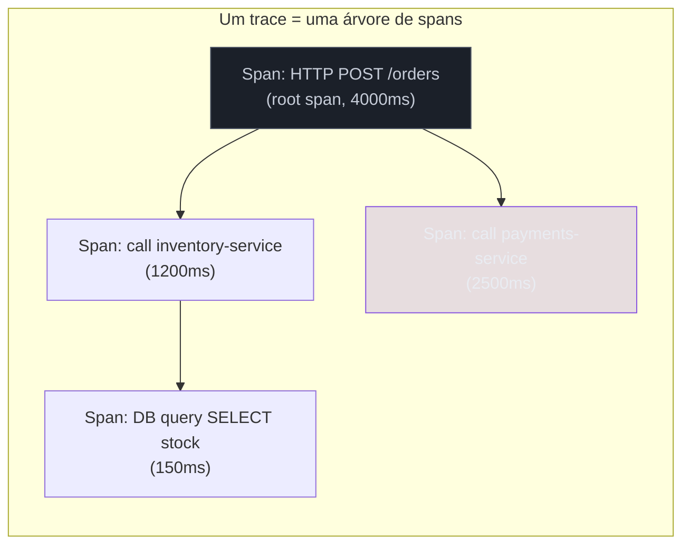
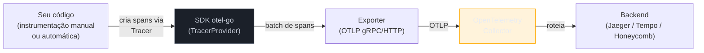
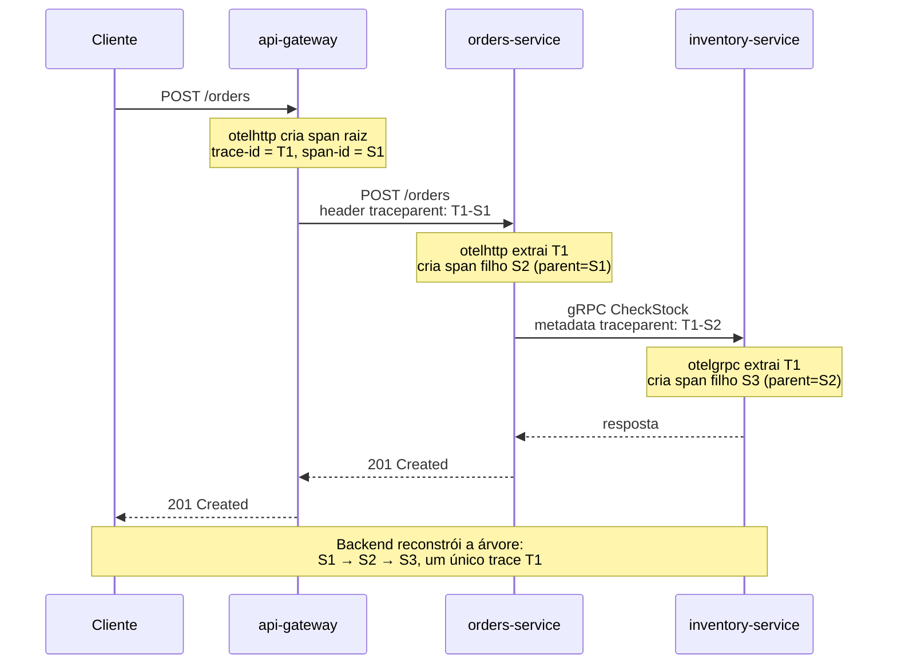

# OpenTelemetry — tracing

> [!abstract] TL;DR
> `log/slog` (nota 02) diz *o que* aconteceu num processo; métricas (notas 05-06) dizem *quanto* está acontecendo agregado; **tracing** diz *o caminho* que uma requisição percorreu através de vários processos, com timing exato de cada etapa. **OpenTelemetry (otel-go)** é o SDK padrão para instrumentar isso em Go: você cria **spans** (unidades de trabalho com início/fim), propaga o **trace context** via `context.Context` — o mesmo `context` que já carrega cancelamento e deadline —, e exporta tudo para um **collector** que roteia para um backend (Jaeger, Tempo, Honeycomb). O ganho real não é "mais um pilar bonito": é responder em segundos "por que essa requisição levou 800ms?" numa arquitetura com 6 serviços, em vez de correlacionar logs manualmente por `grep`.

## O problema que logs e métricas não resolvem

Imagine um pedido de e-commerce que passa por `api-gateway` → `orders-service` → `inventory-service` → `payments-service`. O cliente reclama: "meu pedido demorou 4 segundos". Você tem logs estruturados em cada serviço (nota 02) e métricas de latência agregada em cada um (nota 05). O que você **não** tem é a resposta direta para: nesses 4 segundos, quanto tempo cada serviço individual consumiu, e qual deles foi o gargalo *nessa requisição específica*?

Com logs, você teria que grepar por um ID de correlação em quatro conjuntos de logs diferentes, alinhar timestamps manualmente, e torcer para que ninguém tenha esquecido de logar o ID em algum ponto. Com métricas, você vê que `payments-service` está com p99 alto *em média* — mas não sabe se foi ele o culpado *nessa* requisição, porque métricas agregam, elas não guardam a história de uma chamada individual.

Tracing distribuído resolve exatamente essa lacuna: cada requisição carrega um **trace ID** único, que atravessa todos os serviços por onde ela passa. Cada etapa de trabalho (uma chamada HTTP, uma query SQL, uma chamada gRPC) vira um **span** — um intervalo de tempo com nome, timestamps e metadados — e todos os spans de uma mesma requisição se encaixam numa árvore, o **trace**. Reconstruir essa árvore é reconstruir, exatamente, o "raio-x" daquela requisição de 4 segundos.

## Spans e trace context: o vocabulário mínimo



Um **span** é a unidade atômica: tem um nome (`"POST /orders"`), um início e um fim, um **span ID** próprio, e um **trace ID** compartilhado por todos os spans da mesma requisição. Um span pode ter um **parent span ID**, formando a árvore acima — o span de `payments-service` é filho do span raiz, porque foi disparado durante o processamento dele.

O trio `trace ID + span ID + parent span ID` é o **trace context**. É esse contexto que precisa viajar: dentro do mesmo processo (de função em função) e entre processos (via cabeçalhos HTTP ou metadata gRPC). Em Go, o veículo dentro do processo já existe e você já usa: `context.Context`.

> [!info] otel-go usa `context.Context`, não uma variável global
> Se você já leu a nota de Go Backend sobre contexto (cancelamento e deadline), o mecanismo de propagação de trace é literalmente o mesmo objeto. `context.WithValue` é como o span ativo entra e sai do contexto — não existe uma variável global "span atual" nem thread-local, porque Go não tem thread-local no sentido de outras linguagens. Cada goroutine que recebe o `context.Context` correto sabe automaticamente "em qual span" ela está.

## Anatomia do SDK otel-go



Quatro peças, sempre na mesma ordem:

1. **`TracerProvider`** — a fábrica central, configurada uma vez no `main()`, com o exporter e o *resource* (metadados fixos: nome do serviço, versão, ambiente).
2. **`Tracer`** — obtido do provider, é quem cria spans. Normalmente um por pacote/componente lógico.
3. **`Exporter`** — serializa spans no formato **OTLP** (OpenTelemetry Protocol) e envia via gRPC ou HTTP.
4. **Collector** — um processo separado (não é sua aplicação) que recebe OTLP, pode filtrar/agregar/amostrar, e reexporta para um ou mais backends. Rodar contra o collector em vez de exportar direto pro backend é o padrão recomendado — desacopla sua aplicação da escolha de backend.

Instalando o SDK:

```bash
go get go.opentelemetry.io/otel
go get go.opentelemetry.io/otel/sdk
go get go.opentelemetry.io/otel/exporters/otlp/otlptrace/otlptracegrpc
go get go.opentelemetry.io/contrib/instrumentation/net/http/otelhttp
go get go.opentelemetry.io/contrib/instrumentation/google.golang.org/grpc/otelgrpc
```

## Configurando o TracerProvider

```go
package main

import (
	"context"
	"time"

	"go.opentelemetry.io/otel"
	"go.opentelemetry.io/otel/exporters/otlp/otlptrace/otlptracegrpc"
	"go.opentelemetry.io/otel/propagation"
	"go.opentelemetry.io/otel/sdk/resource"
	sdktrace "go.opentelemetry.io/otel/sdk/trace"
	semconv "go.opentelemetry.io/otel/semconv/v1.26.0"
	"google.golang.org/grpc"
	"google.golang.org/grpc/credentials/insecure"
)

func initTracer(ctx context.Context) (func(context.Context) error, error) {
	// Conexão gRPC com o collector (endereço típico em produção: sidecar ou DaemonSet)
	conn, err := grpc.NewClient("otel-collector:4317",
		grpc.WithTransportCredentials(insecure.NewCredentials()))
	if err != nil {
		return nil, err
	}

	exporter, err := otlptracegrpc.New(ctx, otlptracegrpc.WithGRPCConn(conn))
	if err != nil {
		return nil, err
	}

	res, err := resource.New(ctx,
		resource.WithAttributes(
			semconv.ServiceName("orders-service"),
			semconv.ServiceVersion("1.4.0"),
		),
	)
	if err != nil {
		return nil, err
	}

	tp := sdktrace.NewTracerProvider(
		sdktrace.WithBatcher(exporter, sdktrace.WithBatchTimeout(5*time.Second)),
		sdktrace.WithResource(res),
		sdktrace.WithSampler(sdktrace.ParentBased(sdktrace.TraceIDRatioBased(0.1))),
	)

	otel.SetTracerProvider(tp)
	// Sem isso, o trace context não atravessa a fronteira HTTP/gRPC:
	otel.SetTextMapPropagator(propagation.TraceContext{})

	return tp.Shutdown, nil
}
```

Duas escolhas nesse trecho merecem atenção:

- **`WithBatcher`**, não `WithSyncer`: spans são enfileirados e exportados em lote periodicamente, para não pagar uma chamada de rede por span. É o padrão de produção.
- **`WithSampler(... TraceIDRatioBased(0.1))`**: amostrar 10% dos traces. Em alto volume, exportar 100% dos traces satura o collector e o backend sem ganho proporcional de insight — assunto retomado na próxima nota, sobre observabilidade em produção.

`otel.SetTextMapPropagator(propagation.TraceContext{})` é fácil de esquecer e o efeito do esquecimento é sutil: os spans continuam sendo criados normalmente dentro de cada serviço, mas cada serviço vira a **raiz** do seu próprio trace — porque o trace context nunca atravessou o cabeçalho HTTP. O sintoma no backend de tracing é traces fragmentados, um por serviço, quando deveriam ser um só.

> [!question]- Criar um span custa caro? Vou desacelerar minha aplicação por instrumentar tudo?
> O custo de criar e finalizar um span é pequeno — poucas dezenas a poucas centenas de nanossegundos, dominado por alocações e pela lógica de amostragem — mas não é zero, e cresce com o número de atributos anexados a cada span. O gargalo real de produção quase nunca é "criar spans", é **exportar** demais: enviar 100% dos traces para o collector, ou anexar atributos de alta cardinalidade (um `user_id` distinto por span, por exemplo) que explodem o volume de dados armazenados no backend. É por isso que sampling (visto acima com `TraceIDRatioBased`) existe desde o desenho do protocolo — não é um ajuste de última hora, é parte do modelo. Instrumentar handlers HTTP e chamadas de rede é seguro por padrão; instrumentar todo laço interno de CPU já é over-engineering — para isso, pprof (notas 03-04) é a ferramenta certa.

## Criando spans manualmente

```go
package orders

import (
	"context"

	"go.opentelemetry.io/otel"
	"go.opentelemetry.io/otel/attribute"
	"go.opentelemetry.io/otel/codes"
	"go.opentelemetry.io/otel/trace"
)

var tracer = otel.Tracer("orders-service/orders")

func ProcessOrder(ctx context.Context, orderID string) error {
	ctx, span := tracer.Start(ctx, "ProcessOrder",
		trace.WithAttributes(attribute.String("order.id", orderID)))
	defer span.End()

	if err := reserveInventory(ctx, orderID); err != nil {
		span.RecordError(err)
		span.SetStatus(codes.Error, "falha ao reservar estoque")
		return err
	}

	span.SetAttributes(attribute.String("order.status", "reserved"))
	return nil
}
```

O padrão `ctx, span := tracer.Start(ctx, "nome")` seguido de `defer span.End()` é a assinatura de qualquer código que cria spans manualmente — igual ao padrão `mu.Lock(); defer mu.Unlock()` que já é reflexo em qualquer dev Go. O `ctx` retornado por `tracer.Start` é o que carrega o novo span como "ativo"; qualquer função chamada com esse `ctx` — e que também chame `tracer.Start(ctx, ...)` — cria automaticamente um span **filho**, sem precisar passar o span pai explicitamente por fora do contexto.

> [!warning] Passar o `ctx` errado quebra a árvore silenciosamente
> Se `reserveInventory` receber o `ctx` *original* (antes do `tracer.Start`) em vez do `ctx` retornado por ele, o span criado dentro de `reserveInventory` vira um span **órfão** ou raiz de outro trace — sem erro de compilação, sem panic, só uma árvore de spans incorreta no backend. É o erro mais comum de instrumentação manual: sempre use a variável `ctx` que saiu de `tracer.Start`, nunca a de fora.

```go
func reserveInventory(ctx context.Context, orderID string) error {
	ctx, span := tracer.Start(ctx, "reserveInventory")
	defer span.End()

	span.SetAttributes(attribute.String("order.id", orderID))
	// ... lógica real ...
	return nil
}
```

## Instrumentando HTTP: servidor e cliente

Instrumentar manualmente cada handler seria repetitivo — o pacote `otelhttp`, mantido no repositório `contrib` da OpenTelemetry, faz o trabalho de criar o span, extrair/injetar o trace context do cabeçalho, e registrar status/latência automaticamente.

**Servidor**, envolvendo o `http.Handler`:

```go
package main

import (
	"net/http"

	"go.opentelemetry.io/contrib/instrumentation/net/http/otelhttp"
)

func main() {
	mux := http.NewServeMux()
	mux.HandleFunc("POST /orders", handleCreateOrder)

	handler := otelhttp.NewHandler(mux, "orders-server")
	http.ListenAndServe(":8080", handler)
}

func handleCreateOrder(w http.ResponseWriter, r *http.Request) {
	ctx := r.Context() // já carrega o span criado por otelhttp.NewHandler
	if err := orders.ProcessOrder(ctx, extractOrderID(r)); err != nil {
		http.Error(w, err.Error(), http.StatusInternalServerError)
		return
	}
	w.WriteHeader(http.StatusCreated)
}
```

> [!info] `otelhttp.NewHandler` funciona com o novo `http.ServeMux` (Go 1.22+)
> O roteamento por método e padrão de path (`"POST /orders"`) é o `ServeMux` reforçado da nota 07 do Galho de HTTP; `otelhttp` funciona como *middleware* em torno dele sem nenhuma adaptação — recebe qualquer `http.Handler`, incluindo o `mux` novo.

**Cliente**, envolvendo o `http.Client` que faz a chamada para o próximo serviço:

```go
client := &http.Client{
	Transport: otelhttp.NewTransport(http.DefaultTransport),
}

req, _ := http.NewRequestWithContext(ctx, http.MethodGet,
	"http://inventory-service/stock", nil)
resp, err := client.Do(req)
```

O `ctx` passado a `http.NewRequestWithContext` é o que carrega o trace context atual; `otelhttp.NewTransport` injeta esse contexto nos cabeçalhos HTTP (`traceparent`, do padrão [W3C Trace Context](https://www.w3.org/TR/trace-context/)) antes de enviar a requisição. É essa injeção — e a extração espelhada do lado servidor — que faz o trace atravessar a fronteira de rede entre `orders-service` e `inventory-service`.

## Instrumentando gRPC

O equivalente para gRPC é o pacote `otelgrpc`, aplicado como *interceptor* — o conceito gRPC de middleware, que intercepta toda chamada antes/depois do handler real:

```go
package main

import (
	"go.opentelemetry.io/contrib/instrumentation/google.golang.org/grpc/otelgrpc"
	"google.golang.org/grpc"
	"google.golang.org/grpc/credentials/insecure"
)

// Servidor
func newGRPCServer() *grpc.Server {
	return grpc.NewServer(
		grpc.StatsHandler(otelgrpc.NewServerHandler()),
	)
}

// Cliente
func newGRPCClient(addr string) (*grpc.ClientConn, error) {
	return grpc.NewClient(addr,
		grpc.WithTransportCredentials(insecure.NewCredentials()),
		grpc.WithStatsHandler(otelgrpc.NewClientHandler()),
	)
}
```

O trace context viaja em gRPC do mesmo jeito conceitual que em HTTP — só que via **metadata** (o equivalente gRPC de cabeçalhos) em vez de headers HTTP. `otelgrpc.NewServerHandler()`/`NewClientHandler()` fazem a extração/injeção automaticamente, com o mesmo efeito prático de `otelhttp`: cada chamada gRPC vira um span filho do span que a originou, e o trace ID atravessa a chamada.

## Propagação ponta a ponta: o fluxo completo



Cada seta de rede carrega o mesmo `trace-id`; cada serviço, ao extrair esse trace-id do cabeçalho/metadata recebido, cria seu próprio span como filho — nunca como um trace novo. É essa continuidade, mantida automaticamente pelos pacotes `otelhttp`/`otelgrpc` desde que o propagador esteja configurado (`otel.SetTextMapPropagator`), que transforma quatro processos independentes numa única história reconstruível.

## Correlação: ligando trace, log e métrica

Tracing sozinho não substitui logs — ele os complementa. A técnica de **correlação** injeta o `trace_id` (e `span_id`) atual em cada linha de log, para que, ao investigar um trace lento no backend de tracing, você possa pular direto para os logs daquele request específico:

```go
import (
	"context"
	"log/slog"

	"go.opentelemetry.io/otel/trace"
)

func logComTrace(ctx context.Context, logger *slog.Logger, msg string) {
	span := trace.SpanFromContext(ctx)
	sc := span.SpanContext()

	logger.InfoContext(ctx, msg,
		slog.String("trace_id", sc.TraceID().String()),
		slog.String("span_id", sc.SpanID().String()),
	)
}
```

`trace.SpanFromContext(ctx)` recupera o span ativo — sem precisar carregá-lo manualmente por fora do `context.Context` que a função já recebe. Combinado com o `slog.Handler` estruturado da nota 02, cada linha de log ganha os IDs necessários para um backend de logs (Loki, Elasticsearch) filtrar exatamente as linhas daquele trace específico. É a peça que fecha o triângulo: métricas dizem *que algo está errado em agregado*, tracing diz *onde nessa requisição*, logs (correlacionados) dizem *o detalhe exato do que aconteceu ali*.

> [!info] O `Handler` do slog pode injetar trace_id automaticamente
> Em vez de chamar `logComTrace` manualmente em todo lugar, é comum escrever um `slog.Handler` customizado que injeta `trace_id`/`span_id` de qualquer `ctx` recebido — assunto que combina a nota 02 (handlers customizados de slog) com esta nota. Bibliotecas como `go.opentelemetry.io/contrib/bridges/otelslog` já oferecem essa ponte pronta.

## Nomeando atributos: semantic conventions

Um span com `attribute.String("order.id", orderID)` funciona, mas nomear atributos livremente — cada time inventando `order_id`, `orderId`, `OrderID` conforme o gosto — é o mesmo problema de métricas sem convenção de nome, visto na nota 05. A OpenTelemetry resolve isso com **semantic conventions**: um catálogo de nomes de atributos padronizados para conceitos comuns (HTTP, banco de dados, mensageria, RPC), publicado como pacote versionado:

```go
import semconv "go.opentelemetry.io/otel/semconv/v1.26.0"

span.SetAttributes(
	semconv.HTTPRequestMethodKey.String("POST"),
	semconv.HTTPResponseStatusCodeKey.Int(201),
	semconv.ServerAddress("inventory-service"),
)
```

`otelhttp` e `otelgrpc` já preenchem os atributos semânticos de HTTP/gRPC automaticamente (método, status code, endereço) — você só precisa de `semconv` diretamente quando adiciona atributos de **domínio do seu negócio** que não têm um nome padronizado (como `order.id` no exemplo anterior, que é razoável deixar como atributo customizado, prefixado pelo namespace da sua aplicação). A versão do pacote (`v1.26.0` aqui) precisa ser fixada explicitamente porque a especificação de semantic conventions evolui — atualizar a versão pode renomear atributos que dashboards e queries salvas já dependem.

## Testando instrumentação sem um collector real

Rodar um collector completo (mais Jaeger ou Tempo) só para verificar se seu código está criando os spans certos é peso demais para um teste unitário. O SDK oferece um exporter em memória — `tracetest.NewInMemoryExporter()` — feito exatamente para isso:

```go
package orders_test

import (
	"context"
	"testing"

	"go.opentelemetry.io/otel"
	sdktrace "go.opentelemetry.io/otel/sdk/trace"
	"go.opentelemetry.io/otel/sdk/trace/tracetest"
)

func TestProcessOrder_CriaSpanComAtributos(t *testing.T) {
	exporter := tracetest.NewInMemoryExporter()
	tp := sdktrace.NewTracerProvider(sdktrace.WithSyncer(exporter))
	otel.SetTracerProvider(tp)

	err := orders.ProcessOrder(context.Background(), "order-123")
	if err != nil {
		t.Fatalf("erro inesperado: %v", err)
	}

	spans := exporter.GetSpans()
	if len(spans) != 2 { // ProcessOrder + reserveInventory
		t.Fatalf("esperava 2 spans, veio %d", len(spans))
	}
	if spans[0].Name != "reserveInventory" {
		t.Errorf("nome do span filho errado: %s", spans[0].Name)
	}
}
```

`WithSyncer` (não `WithBatcher`) aqui é proposital: em teste, você quer o span exportado imediatamente, de forma síncrona, sem esperar o timeout de lote configurado em produção. `exporter.GetSpans()` devolve a lista de spans finalizados na ordem em que fecharam — dá para inspecionar nome, atributos, status de erro e até a relação pai/filho, sem precisar de nenhuma infraestrutura externa rodando.

## Armadilhas comuns

> [!warning] Esquecer `defer span.End()` vaza memória e nunca exporta o span
> Um span que nunca chama `End()` fica pendurado indefinidamente na memória do SDK, esperando ser fechado — e nunca aparece no backend, porque o exporter só processa spans finalizados. É o análogo direto de esquecer `resp.Body.Close()` numa chamada HTTP: o custo não aparece na hora, aparece em produção sob carga.

> [!warning] Criar `Tracer` novo a cada chamada em vez de reusar
> `otel.Tracer("nome")` é barato de chamar, mas ainda assim o padrão idiomático é obter o `Tracer` uma vez (variável de pacote, como no exemplo de `ProcessOrder`) e reutilizá-lo — não recriar dentro de cada handler. Reflete a mesma lição de reusar `*http.Client` da nota 07 do Galho de HTTP.

> [!warning] Sampling 100% em produção derruba o collector
> `AlwaysSample()` parece a escolha "mais completa", mas em serviços de alto volume gera um throughput de spans que satura o collector antes de saturar qualquer coisa útil. `TraceIDRatioBased` (amostragem por porcentagem) ou, melhor ainda, `ParentBased` combinado com decisões de sampling na borda do sistema é o padrão de produção — a próxima nota aprofunda essa escolha.

> [!warning] `context.Context` cancelado propagado para o span errado
> Se você reusa um `ctx` de uma requisição já finalizada para criar um span novo em processamento assíncrono (ex.: uma goroutine disparada em background depois do handler já ter respondido), o span nasce associado a um `ctx` que já foi cancelado ou está prestes a ser — o comportamento é inconsistente. Para trabalho assíncrono que sobrevive à requisição original, crie um `context.Background()` (ou `context.WithoutCancel`, Go 1.21+) e propague o trace context manualmente com `trace.ContextWithSpanContext`, em vez de simplesmente reaproveitar o `ctx` do handler.

## Lente cross-stack

| Vindo de... | Em Go é assim |
|---|---|
| Java (Spring Cloud Sleuth / Micrometer Tracing) | `Micrometer Tracing` faz auto-instrumentação via bytecode/AOP com pouquíssimo código explícito; em Go, sem reflection pesada nem AOP, a instrumentação é sempre mais visível — você chama `tracer.Start` ou envolve o `Handler`/interceptor manualmente. Mais verboso, mas nada de "mágica" escondida em um agente Java. |
| Node.js (`@opentelemetry/api` + auto-instrumentation) | Node também tem *auto-instrumentation* via monkey-patching de módulos (`require` hooks) — Go não tem equivalente, porque não existe "reabrir" um pacote (nota 03 do Galho 02 já cobriu essa restrição no contexto de métodos). Em Go, a instrumentação de bibliotecas de terceiros depende de o pacote em si expor um *middleware*/*interceptor* compatível com otel, como `otelhttp`/`otelgrpc`. |
| Python (`opentelemetry-instrumentation`) | Python também usa monkey-patching para instrumentação automática de Flask/Django/requests. A ausência desse mecanismo em Go é o mesmo motivo do item anterior — e por isso o ecossistema `contrib` de Go tem uma lista mais curta e mais explícita de integrações do que Python ou Node. |

## Como explicar em inglês

> Distributed tracing answers a question logs and metrics can't: which service, in a specific request that crossed several processes, was the bottleneck. OpenTelemetry's Go SDK (otel-go) creates **spans** — timed units of work with a name, a trace ID, and a parent span ID — and propagates that trace context through `context.Context`, the same context Go already uses for cancellation and deadlines. Crossing a network boundary means injecting the trace context into an HTTP header or gRPC metadata on the client side and extracting it on the server side; the `otelhttp` and `otelgrpc` packages from the `contrib` repository do this automatically as middleware/interceptors, so a chain of HTTP and gRPC calls reconstructs into one coherent trace tree in the backend. Because Go has no monkey-patching, there's no fully automatic instrumentation the way Python or Node offer — every library boundary needs an explicit wrapper. Spans are exported in batches, via OTLP, to a **Collector** process that decouples your application from the choice of tracing backend (Jaeger, Tempo, Honeycomb). Correlating trace IDs into structured logs closes the loop: metrics tell you something is wrong in aggregate, tracing tells you where in a specific request, and correlated logs tell you the exact detail of what happened there.

| Termo PT | Termo EN |
|---|---|
| rastreamento distribuído | distributed tracing |
| span | span |
| trace | trace |
| contexto de rastreamento | trace context |
| propagação | propagation |
| coletor | collector |
| exportador | exporter |
| amostragem | sampling |
| correlação | correlation |
| interceptor | interceptor |
| span raiz | root span |
| span filho | child span |

## O que vem a seguir

Esta nota mostrou como instrumentar e exportar spans corretamente — mas deixou em aberto decisões que só fazem sentido sob carga real: quanto amostrar, como lidar com cardinalidade alta de atributos, como orçar o custo do collector, e como juntar os três pilares (logs, métricas, tracing) numa estratégia coerente de operação. A [[08 - Observabilidade em produção|nota 08]] fecha o galho com exatamente essas decisões — a passagem de "sei instrumentar" para "sei operar observabilidade em produção".

## Veja também

- [[01 - Os três pilares em Go|01 — Os três pilares em Go]] — onde tracing se encaixa ao lado de logs e métricas
- [[02 - Logging estruturado com slog|02 — Logging estruturado com slog]] — `slog.Handler` e a base da correlação trace-log desta nota
- [[05 - Métricas com Prometheus|05 — Métricas com Prometheus]] — o pilar de agregação que tracing complementa, não substitui
- [[08 - Observabilidade em produção|08 — Observabilidade em produção]] — próxima nota do galho: sampling, custo e estratégia
- [[03-Dominios/Tecnologia/Go/index|Trilha Go]]

## Fontes

- OpenTelemetry Authors. *Getting Started — Go*. opentelemetry.io. https://opentelemetry.io/docs/languages/go/getting-started/ (acessado em 2026-07-18)
- OpenTelemetry Authors. *Instrumentation — Go*. opentelemetry.io. https://opentelemetry.io/docs/languages/go/instrumentation/ (acessado em 2026-07-18)
- OpenTelemetry Authors. *Exporters — Go*. opentelemetry.io. https://opentelemetry.io/docs/languages/go/exporters/ (acessado em 2026-07-18)
- pkg.go.dev. *go.opentelemetry.io/otel*. pkg.go.dev. https://pkg.go.dev/go.opentelemetry.io/otel (acessado em 2026-07-18)
- pkg.go.dev. *go.opentelemetry.io/contrib/instrumentation/net/http/otelhttp*. pkg.go.dev. https://pkg.go.dev/go.opentelemetry.io/contrib/instrumentation/net/http/otelhttp (acessado em 2026-07-18)
- W3C. *Trace Context*. w3.org. https://www.w3.org/TR/trace-context/ (acessado em 2026-07-18)
