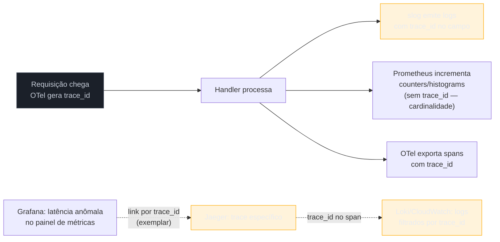
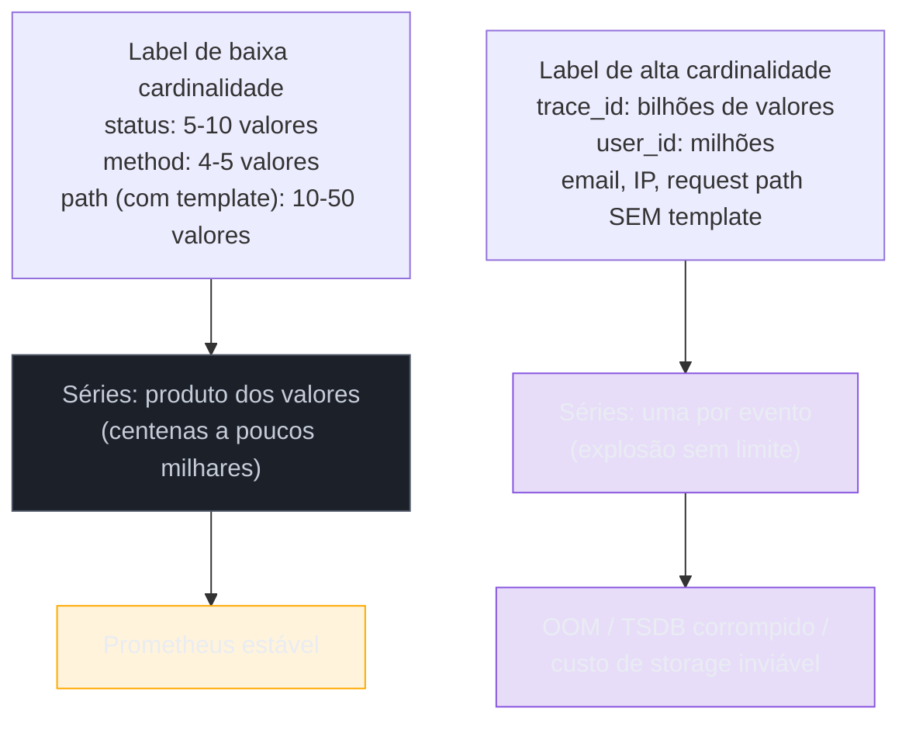

# Observabilidade em produção

> [!abstract] TL;DR
> As três notas anteriores deste galho ensinaram logs (`slog`), métricas (Prometheus) e traces (OpenTelemetry) como três ferramentas separadas. Em produção, elas só valem alguma coisa **correlacionadas** — um `trace_id` precisa aparecer em toda linha de log da requisição, para pular do dashboard de erro pro trace exato e dali pros logs exatos, em segundos, não em `grep` manual num painel de milhões de linhas. O segundo problema é orçamento: cada label de métrica multiplica a cardinalidade da série temporal, e um `user_id` ou `request_id` numa label pode explodir uma métrica de 10 séries pra 10 milhões, derrubando o Prometheus por exaustão de memória. A disciplina de produção não é "instrumentar tudo" — é decidir **o que** vira métrica (baixa cardinalidade, agregável), **o que** vira log (alta cardinalidade, um evento por vez) e **o que** vira trace (o caminho completo de uma requisição), e pagar o custo de armazenamento/rede só onde o sinal compensa.

## O incidente que não tem por onde começar

3h da manhã, o alerta dispara: `p99_latency_ms > 2000` no endpoint `/checkout`. Você abre o Grafana, vê o gráfico subindo — mas o gráfico não diz **qual** requisição ficou lenta, nem **onde** no código. Você abre os logs — milhões de linhas por minuto, todas com `level=info msg="request handled"`, nenhuma delas amarrada à requisição específica que estourou o SLO. Você abre o Jaeger — tem traces, mas não sabe qual trace corresponde ao pico de latência que o Grafana mostrou, porque não há nenhum campo em comum entre os três sistemas.

Esse é o cenário que a nota 01 deste galho descreveu como "os três pilares" — mas descrever os pilares separadamente esconde o problema real: eles são inúteis isolados. O que resolve o incidente às 3h da manhã não é ter logs, métricas e traces — é ter um **fio condutor** entre os três, de modo que uma métrica anômala leve direto ao trace da requisição, e o trace leve direto às linhas de log daquela requisição específica, sem `grep` às cegas.

Esse fio condutor, na prática quase universal da indústria, é um único campo: `trace_id`.

## O mecanismo: trace_id como chave de correlação

A ideia central é simples de enunciar e chata de implementar direito: **todo log emitido durante o processamento de uma requisição carrega o mesmo `trace_id`** que o OpenTelemetry já gerou pra essa requisição (nota 07 deste galho). Com isso, os três pilares passam a apontar uns pros outros:



Repare que a métrica em si **não carrega** `trace_id` — isso é intencional, e a próxima seção explica por quê. A ponte entre métrica e trace é feita por um recurso chamado **exemplar** (Prometheus 2.26+): um histogram pode anexar, a cada bucket, um `trace_id` de exemplo daquela faixa de latência, sem transformar o `trace_id` numa label da série. É o Grafana clicando num ponto do gráfico e abrindo o trace exato que gerou aquele ponto — sem multiplicar a cardinalidade da métrica.

O log, ao contrário da métrica, é feito sob medida pra carregar `trace_id` — cada linha é um evento único, então o custo de cardinalidade que preocupa a métrica não se aplica aqui.

### Propagando trace_id para o slog

Em Go, o span ativo mora no `context.Context` — a nota 07 já estabeleceu isso. Extrair o `trace_id` desse contexto e injetá-lo em toda chamada de log é o trabalho de um `slog.Handler` customizado, ou de passar o contexto explicitamente pra cada chamada com `slog.InfoContext`.

```go
package main

import (
	"context"
	"log/slog"

	"go.opentelemetry.io/otel/trace"
)

// TraceHandler envolve outro Handler e injeta trace_id/span_id
// extraídos do contexto em todo Record, se houver um span ativo.
type TraceHandler struct {
	slog.Handler
}

func (h TraceHandler) Handle(ctx context.Context, r slog.Record) error {
	if span := trace.SpanContextFromContext(ctx); span.IsValid() {
		r.AddAttrs(
			slog.String("trace_id", span.TraceID().String()),
			slog.String("span_id", span.SpanID().String()),
		)
	}
	return h.Handler.Handle(ctx, r)
}

func NewLogger() *slog.Logger {
	base := slog.NewJSONHandler(nil, nil) // writer/opts reais na prática
	return slog.New(TraceHandler{Handler: base})
}
```

> [!info] `log/slog` (Go 1.21+) e `slog.InfoContext`
> A família de métodos com sufixo `Context` (`InfoContext`, `ErrorContext`, `WarnContext`...) existe desde o lançamento do `log/slog` em 1.21 exatamente para casos como esse: passar o `context.Context` da requisição até o ponto de log, para que um `Handler` customizado — como o `TraceHandler` acima — tenha acesso ao span ativo. Chamar `slog.Info(...)` sem contexto (sem o sufixo `Context`) não aciona `Handle` com um `ctx` útil; o padrão de produção é sempre `logger.InfoContext(ctx, "mensagem", ...)`.

O handler acima é o padrão canônico documentado pelo próprio pacote `log/slog` — a [issue de design do slog](https://go.dev/blog/slog) prevê explicitamente handlers compostos (*handler chaining*) para casos assim, em vez de reimplementar formatação JSON do zero.

Com isso em produção, uma linha de log típica passa a ficar assim:

```json
{"time":"2026-07-18T03:14:07Z","level":"ERROR","msg":"payment gateway timeout","trace_id":"a1b2c3d4e5f6...","span_id":"1a2b3c4d","service":"checkout","order_id":"ord_9f81"}
```

Agora, do incidente de latência no Grafana, o exemplar leva ao trace no Jaeger; do trace, o `trace_id` vira o filtro exato no Loki/CloudWatch/Elasticsearch — sem `grep` cego em milhões de linhas.

## Cardinality budget: por que a métrica não pode ter trace_id

A pergunta óbvia depois da seção anterior é: "se `trace_id` ajuda tanto a correlacionar, por que não colocar `trace_id` como label em toda métrica também?". A resposta é o conceito mais caro — literalmente, em dinheiro e em memória — que qualquer engenheiro de observabilidade em produção precisa internalizar: **cardinalidade**.

Uma métrica Prometheus com labels não é um número — é uma **série temporal por combinação única de valores de label**. `http_requests_total{method="GET", path="/checkout", status="200"}` é uma série. Se `path` tiver 20 valores possíveis, `method` tiver 4, e `status` tiver 10, você tem no máximo 800 séries — gerenciável. Agora adicione `trace_id` como label: cada requisição tem um `trace_id` **único**, então cada requisição vira uma série nova, para sempre. Um serviço com 1000 req/s gera 1000 séries novas por segundo — o Prometheus, que mantém tudo em memória até o próximo flush pro disco (via TSDB), estoura RAM em minutos.



A regra prática que times de SRE convergiram, e que a própria documentação do Prometheus recomenda, chama-se **cardinality budget**: antes de adicionar uma label nova a uma métrica, pergunte "quantos valores distintos esse campo pode assumir, ao longo do tempo, em produção?". Um orçamento comum para produção é manter cada métrica abaixo de algumas centenas a poucos milhares de séries — nunca dezenas de milhões.

| Campo | Cardinalidade típica | Vira label de métrica? |
|---|---|---|
| `status` (200, 404, 500...) | ~10-20 valores | Sim |
| `method` (GET, POST...) | ~5-8 valores | Sim |
| `path` **com template** (`/users/:id`, não `/users/42`) | dezenas a centenas | Sim, com cuidado |
| `path` **sem template** (URL crua, com IDs) | ilimitada | Não |
| `user_id`, `order_id`, `session_id` | milhões | Não |
| `trace_id`, `request_id` | uma por evento | Nunca |
| `region`, `datacenter`, `pod_name` (pequeno cluster) | dezenas | Sim, com cautela |

```go
package main

import "github.com/prometheus/client_golang/prometheus"

// Errado: path cru vira label. Cada URL distinta (incluindo IDs) gera
// uma série nova — em pouco tempo, milhões de séries mortas.
var requestsRuim = prometheus.NewCounterVec(
	prometheus.CounterOpts{Name: "http_requests_total"},
	[]string{"path", "user_id"}, // cardinalidade sem limite — NÃO FAÇA ISSO
)

// Certo: path com template fixo do roteador, sem IDs; sem user_id.
var requestsBom = prometheus.NewCounterVec(
	prometheus.CounterOpts{Name: "http_requests_total"},
	[]string{"route", "method", "status"}, // "route" = "/users/:id", já normalizado
)

func handler(route, method, status string) {
	requestsBom.WithLabelValues(route, method, status).Inc()
}
```

> [!warning] O bug de cardinalidade não aparece no código que quebra — aparece três meses depois
> Uma label de alta cardinalidade não derruba nada no dia em que é adicionada. O Prometheus aceita a série nova silenciosamente. O problema aparece semanas ou meses depois, quando o volume acumulado de séries "mortas" (de `user_id`s que nunca mais vão aparecer, mas cujas séries continuam retidas até expirar) consome memória suficiente pra derrubar o servidor de métricas inteiro — geralmente durante um pico de tráfego, o pior momento possível. Revisar labels de métrica novas em code review é mais barato do que depurar um Prometheus OOM em produção.

> [!warning] Roteador sem template de rota vaza cardinalidade sozinho
> Se o handler HTTP usa o path bruto da requisição (`r.URL.Path`) como label em vez do **padrão de rota registrado** (`/users/{id}`), cada ID distinto na URL vira uma série nova — mesmo sem querer. O [novo `http.ServeMux`](https://pkg.go.dev/net/http#ServeMux) do Go 1.22, com padrões de rota (`"GET /users/{id}"`), facilita capturar o *padrão* em vez do valor via `r.Pattern` — prefira extrair a métrica a partir do padrão registrado, nunca do path resolvido.

## O que instrumentar: nem tudo, o que importa

Instrumentar "tudo" não é uma meta realista nem desejável — cada métrica, log e span tem custo de CPU (serialização), rede (exportação) e storage (retenção). A pergunta certa não é "o que dá pra medir?", é "que pergunta operacional essa métrica responde quando algo dá errado às 3h da manhã?".

Dois frameworks curtos, populares em times de SRE, ajudam a decidir onde investir o esforço de instrumentação sem reinventar a roda — o conceito de SLO/SLI que fundamenta essa escolha é aprofundado na trilha de Operação, não repetido aqui:

- **RED** (para serviços orientados a requisição — APIs, handlers HTTP, RPC): **R**ate (requisições por segundo), **E**rrors (taxa de erro), **D**uration (latência, idealmente em histogram pra permitir p50/p95/p99). Três métricas, cobrindo a maioria dos incidentes de serviço web.
- **USE** (para recursos — CPU, memória, disco, conexões de pool): **U**tilization, **S**aturation (fila de espera pelo recurso), **E**rrors.

Em Go, RED sai quase de graça com um `http.Handler` middleware:

```go
package main

import (
	"net/http"
	"time"

	"github.com/prometheus/client_golang/prometheus"
)

var (
	reqDuration = prometheus.NewHistogramVec(
		prometheus.HistogramOpts{
			Name:    "http_request_duration_seconds",
			Buckets: prometheus.DefBuckets,
		},
		[]string{"route", "method", "status"},
	)
)

func instrumented(route string, next http.HandlerFunc) http.HandlerFunc {
	return func(w http.ResponseWriter, r *http.Request) {
		start := time.Now()
		sw := &statusWriter{ResponseWriter: w, status: 200}

		next(sw, r)

		reqDuration.WithLabelValues(route, r.Method, statusClass(sw.status)).
			Observe(time.Since(start).Seconds())
	}
}

type statusWriter struct {
	http.ResponseWriter
	status int
}

func (w *statusWriter) WriteHeader(code int) {
	w.status = code
	w.ResponseWriter.WriteHeader(code)
}

// statusClass agrupa 200-299 em "2xx" etc — reduz cardinalidade
// em relação a usar o código exato (200, 201, 204... vira uma classe só).
func statusClass(code int) string {
	return string(rune('0'+code/100)) + "xx"
}
```

Repare em `statusClass`: agrupar `200`, `201`, `204` em `"2xx"` é outra decisão de cardinality budget — a maioria dos dashboards de operação nunca precisa distinguir `201` de `200`, só precisa saber "sucesso vs erro do cliente vs erro do servidor".

Para logs, a regra equivalente é: log de `INFO` em todo request bem-sucedido, em produção de alto tráfego, é ruído caro (custo de storage/rede) que raramente é lido. A prática comum é logar em `INFO` só eventos de negócio relevantes (pedido criado, pagamento processado) e reservar `WARN`/`ERROR` para o caminho de falha — com `trace_id` sempre presente, para que quando o erro acontecer, dê pra puxar o trace completo.

> [!info] Sampling de traces — não exportar 100% em alto tráfego
> A nota 07 mencionou tracing como se cada requisição gerasse um trace exportado. Em produção de alto volume, isso raramente acontece: o SDK do OpenTelemetry suporta *samplers* (`sdktrace.TraceIDRatioBased(0.1)`, por exemplo, exporta 10% dos traces) e, mais sofisticado, *tail sampling* — decidir se um trace vale a pena exportar **depois** de ver o trace inteiro, priorizando traces com erro ou latência alta sobre os "normais". Manter 100% dos traces de um serviço de alto tráfego é, de novo, uma decisão de custo: rede e storage do backend de tracing (Jaeger, Tempo, etc.) crescem linearmente com o volume exportado.

## Caso prático: um handler correlacionado de ponta a ponta

Juntando as três notas anteriores numa peça só — um handler HTTP que gera métrica RED, span de trace e log correlacionado, todos de uma vez:

```go
package main

import (
	"context"
	"log/slog"
	"net/http"
	"time"

	"github.com/prometheus/client_golang/prometheus"
	"go.opentelemetry.io/otel"
)

var (
	logger = slog.New(TraceHandler{Handler: slog.NewJSONHandler(nil, nil)})
	tracer = otel.Tracer("checkout-service")

	checkoutDuration = prometheus.NewHistogramVec(
		prometheus.HistogramOpts{
			Name:    "checkout_duration_seconds",
			Buckets: prometheus.DefBuckets,
		},
		[]string{"status"}, // baixa cardinalidade — nunca order_id aqui
	)
)

func handleCheckout(w http.ResponseWriter, r *http.Request) {
	ctx, span := tracer.Start(r.Context(), "handleCheckout")
	defer span.End()

	start := time.Now()
	orderID := r.URL.Query().Get("order_id") // ok em LOG, nunca em métrica

	logger.InfoContext(ctx, "checkout started", "order_id", orderID)

	if err := processPayment(ctx, orderID); err != nil {
		logger.ErrorContext(ctx, "payment failed", "order_id", orderID, "err", err)
		span.RecordError(err)
		checkoutDuration.WithLabelValues("error").Observe(time.Since(start).Seconds())
		http.Error(w, "payment failed", http.StatusPaymentRequired)
		return
	}

	checkoutDuration.WithLabelValues("success").Observe(time.Since(start).Seconds())
	logger.InfoContext(ctx, "checkout completed", "order_id", orderID)
	w.WriteHeader(http.StatusOK)
}

func processPayment(ctx context.Context, orderID string) error {
	_, span := tracer.Start(ctx, "processPayment")
	defer span.End()
	// chamada ao gateway de pagamento aqui
	return nil
}
```

Note a assimetria deliberada: `order_id` aparece em **todo log** (`slog.String`/atributo de campo, alta cardinalidade tolerada) e como **atributo de span** (`span.SetAttributes` seria o próximo passo natural), mas **nunca** como label de `checkoutDuration` — só `status` (`"success"`/`"error"`, duas séries). Se um cliente perguntar "por que o pedido `ord_9f81` demorou 4 segundos?", a resposta não vem da métrica — vem de pegar o `trace_id` daquele request (via log) e abrir o trace correspondente no Jaeger. A métrica só diz *que* algo está lento em agregado; o trace e o log dizem *qual* requisição e *por quê*.

## Log sampling: quando até o log de erro vira volume demais

Cardinalidade de métrica não é o único jeito de estourar custo. Um serviço com um bug recorrente pode gerar milhões de linhas `ERROR` idênticas em minutos — cada uma com `trace_id` distinto (correto), mas o **volume** de ingestão no backend de log (Loki, CloudWatch, Elasticsearch) que dispara o custo, não a cardinalidade de um campo específico.

A técnica correspondente, do lado de logs, é **log sampling**: manter 100% dos primeiros N eventos de um tipo de erro, e depois amostrar (1 em cada 100, por exemplo) enquanto o padrão persistir — sem nunca perder o primeiro sinal do problema, mas sem pagar para armazenar o milionésimo log idêntico.

```go
package main

import (
	"context"
	"log/slog"
	"sync/atomic"
)

// SamplingHandler deixa passar os primeiros `burst` registros de cada
// nível e, depois disso, só 1 em cada `every`. Não substitui um
// sampler de produção completo (ex.: zap tem um builtin) — ilustra o mecanismo.
type SamplingHandler struct {
	slog.Handler
	burst, every int64
	count        atomic.Int64
}

func (h *SamplingHandler) Handle(ctx context.Context, r slog.Record) error {
	n := h.count.Add(1)
	if n <= h.burst || n%h.every == 0 {
		return h.Handler.Handle(ctx, r)
	}
	return nil // descartado — mas o contador continua incrementando
}
```

> [!warning] Log sampling esconde o primeiro sintoma se aplicado cedo demais
> Amostrar `INFO` agressivamente quase nunca dói. Amostrar `ERROR`/`WARN` é perigoso: um bug raro, que só acontece uma vez em mil requisições, pode ser justamente o evento que o sampler descarta. A prática seguida por bibliotecas de produção (o *sampling core* do [Uber zap](https://pkg.go.dev/go.uber.org/zap), por exemplo) é deixar sempre passar um *burst* inicial de cada assinatura de log (mesma mensagem + mesmo nível) antes de começar a amostrar — garantindo que o primeiro sinal de um problema novo nunca é descartado, só a repetição em excesso depois.

## Custo vs sinal: a régua de decisão

Toda escolha deste capítulo — o que vira label, o que vira log, quanto sampling aplicar — se resume à mesma pergunta: **esse dado, quando o incidente acontecer, vai me levar mais rápido à causa, ou só vai encher o disco?**

| Sinal | Custo dominante | Cardinalidade permitida | Retenção típica |
|---|---|---|---|
| Métrica (Prometheus) | Memória do TSDB, proporcional a nº de séries | Baixa — dezenas a milhares de valores por label | Semanas a meses (com downsampling) |
| Log estruturado | Storage + rede de ingestão, proporcional a volume de eventos | Alta — cada evento pode ter `trace_id`/`user_id` únicos | Dias a poucas semanas (log quente); mais barato em frio |
| Trace (spans) | Storage + rede, proporcional a nº de traces exportados | Alta dentro do trace (atributos de span podem ter qualquer valor) | Dias, com sampling agressivo em alto tráfego |

Uma régua prática usada por times de plataforma: comece instrumentando RED/USE em métricas (barato, sempre ligado, 100% do tráfego), mantenha logs de `WARN`/`ERROR` sempre ligados com `trace_id` (caro por evento, mas eventos de erro são raros comparado ao volume total), e trate tracing como o recurso mais caro do trio — sampling agressivo por padrão, aumentando a taxa temporariamente durante uma investigação ativa de incidente.

> [!question]- Dá pra ter tudo, sem sampling, se o orçamento de infraestrutura permitir?
> Tecnicamente sim, e alguns times de alto orçamento fazem isso para serviços críticos específicos. Mas mesmo com dinheiro ilimitado para storage, cardinalidade descontrolada em métricas ainda quebra o **modelo de consulta** — um dashboard que precisa agregar dezenas de milhões de séries fica lento ou trava, independente de quanto disco você tem. Cardinality budget não é só sobre custo de armazenamento; é sobre manter o sistema de observabilidade **consultável** sob pressão, que é exatamente quando você mais precisa dele.

### O custo não é só storage — é também CPU no hot path

Até aqui, "custo" significou armazenamento e rede do backend de observabilidade. Existe um segundo custo, menos discutido: a instrumentação em si consome CPU e aloca memória **dentro** do processo que ela está observando. Um `slog.InfoContext` com atributos formatados numa struct grande, chamado em todo item de um loop apertado, ou um `span.SetAttributes` com dezenas de campos por chamada de função recursiva, competem por CPU com o próprio trabalho que o serviço existe para fazer.

Duas práticas reduzem esse custo sem abrir mão do sinal:

- **Checar o nível antes de montar o argumento caro.** Se construir o argumento de log envolve serialização não trivial (`fmt.Sprintf` de uma struct grande, por exemplo), envolva em `logger.Enabled(ctx, slog.LevelDebug)` antes de montar a string — evita o custo de formatação em produção, onde `DEBUG` normalmente está desligado.
- **Evitar span por iteração de loop.** Um span do OpenTelemetry para cada item de uma lista de 10 mil elementos processada em memória gera 10 mil spans que ninguém vai ler individualmente — span deve marcar unidades de trabalho que cruzam fronteira de serviço, I/O ou que, isoladas, já são interessantes o bastante para aparecer numa investigação (uma chamada de rede, uma query, não uma iteração de `for`).

```go
if logger.Enabled(ctx, slog.LevelDebug) {
	logger.DebugContext(ctx, "estado intermediário", "snapshot", expensiveSnapshot())
}
```

`expensiveSnapshot()` só executa se o nível `DEBUG` estiver realmente habilitado — sem essa checagem, o argumento seria avaliado (e descartado) em toda chamada, mesmo com o handler configurado para ignorar `DEBUG`.

## Vindo de outras linguagens

| Linguagem/stack | Correlação log-trace | Cuidado com cardinalidade |
|---|---|---|
| Java (Spring Boot + Micrometer + Sleuth/Tracing) | `traceId`/`spanId` injetados automaticamente no MDC (Mapped Diagnostic Context) por instrumentação — quase zero código manual | Micrometer já documenta "high cardinality tags" como anti-padrão; `@Timed` com tag de `userId` é erro comum de iniciante |
| Node.js (Pino/Winston + OTel) | Requer plugin (`pino` + `@opentelemetry/instrumentation-pino`) para injetar `trace_id` automaticamente; sem o plugin, é manual como em Go | Prometheus client para Node tem o mesmo problema de `label` sem controle — a disciplina é idêntica, não é peculiaridade de Go |
| Python (structlog/OTel) | `structlog` com processor customizado (equivalente ao `TraceHandler` desta nota) extrai `trace_id` do contexto do OTel | `prometheus_client` do Python sofre do mesmo risco de cardinalidade — `Counter(..., ['user_id'])` é o mesmo erro em qualquer stack |

O padrão de "handler/processor que injeta `trace_id` a partir do contexto" se repete em toda stack madura — Go não inventa nada aqui, só expõe o mecanismo de forma mais explícita (um `slog.Handler` escrito à mão, em vez de um plugin de terceiros fazendo mágica via bytecode instrumentation, como é comum em Java).

## Como explicar em inglês

> In production, logs, metrics, and traces are only useful when they're correlated — every log line emitted during a request should carry the same `trace_id` that OpenTelemetry generated for that request's span, so an anomaly in a metrics dashboard leads straight to the exact trace, and the trace leads straight to the exact log lines, without blind grepping through millions of entries. The other production discipline is a **cardinality budget**: a Prometheus label with unbounded distinct values — a `trace_id`, a `user_id`, a raw URL path — turns one metric into millions of time series, which exhausts memory and can crash the metrics backend, often weeks after the label was added. The fix is never putting high-cardinality fields on metric labels (they belong in logs and span attributes instead), templating routes before using them as labels, and applying sampling to traces once volume grows, since traces are the most expensive signal of the three to store at 100%.

| Termo PT | Termo EN |
|---|---|
| correlação de logs e traces | log-trace correlation |
| identificador de trace | trace ID |
| orçamento de cardinalidade | cardinality budget |
| série temporal | time series |
| exemplar (Prometheus) | exemplar |
| amostragem de traces | trace sampling / tail sampling |
| template de rota | route template / route pattern |
| explosão de cardinalidade | cardinality explosion |

## O que vem a seguir

Este galho encerra aqui, com os três pilares correlacionados e um orçamento de cardinalidade para não afogar o próprio sistema de observabilidade. A próxima parada da trilha Go olha para dentro — não mais para o que o programa expõe sobre si mesmo, mas para o que o **runtime** faz por baixo: o Galho 17 — Runtime interno entra no garbage collector, no scheduler de goroutines e no gerenciamento de memória que a nota 06 deste galho (`expvar` e runtime metrics) já espiou de fora, via `runtime.MemStats`. Entender o runtime por dentro é o que torna os números desse dashboard de métricas legíveis de verdade.

## Veja também

- [[01 - Os três pilares em Go]] — logs, métricas e traces apresentados separadamente; esta nota é onde eles se encontram
- [[02 - Logging estruturado com slog]] — base de `log/slog`, retomada aqui com `Handler` customizado e `trace_id`
- [[05 - Métricas com Prometheus]] — `CounterVec`/`HistogramVec` e labels, base do cardinality budget desta nota
- [[06 - expvar e runtime metrics]] — `runtime.MemStats`, ponte para o Galho 17 (Runtime interno)
- [[07 - OpenTelemetry — tracing]] — geração do `trace_id`/spans que esta nota propaga para logs e métricas
- [[03-Dominios/Tecnologia/Go/index|Trilha Go]]

## Fontes

- The Go Authors. *log/slog package documentation*. pkg.go.dev. https://pkg.go.dev/log/slog (acessado em 2026-07-18)
- The Go Authors. *Structured Logging with slog*. go.dev/blog. https://go.dev/blog/slog (acessado em 2026-07-18)
- Prometheus Authors. *Metric and label naming*. prometheus.io. https://prometheus.io/docs/practices/naming/ (acessado em 2026-07-18)
- Prometheus Authors. *Instrumentation best practices — cardinality*. prometheus.io. https://prometheus.io/docs/practices/instrumentation/ (acessado em 2026-07-18)
- OpenTelemetry Authors. *Sampling*. opentelemetry.io. https://opentelemetry.io/docs/concepts/sampling/ (acessado em 2026-07-18)
- The Go Authors. *net/http package documentation — ServeMux patterns*. pkg.go.dev. https://pkg.go.dev/net/http#ServeMux (acessado em 2026-07-18)
