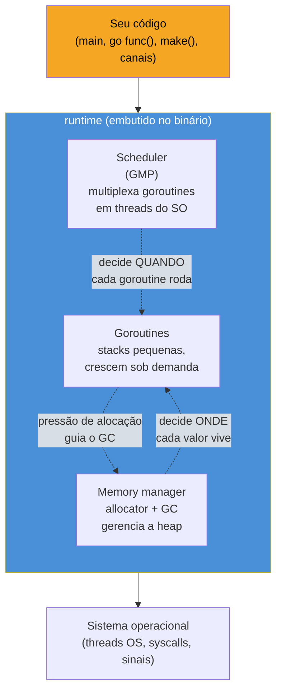

# O runtime Go por baixo

> [!abstract] TL;DR
> Todo binário Go carrega, embutido nele mesmo, um pedaço de software escrito em Go (com uma pitada de assembly) chamado **runtime**: é ele quem multiplexa milhares de goroutines em cima de um punhado de threads do SO (o **scheduler**), gerencia memória automaticamente (o **allocator** e o **garbage collector**), cresce e encolhe a stack de cada goroutine sob demanda, e trata sinais do sistema operacional. Não existe "chamar o runtime" — ele já está rodando antes da sua `main()` começar, e continua rodando por baixo de cada `go func()`, cada `make()`, cada `<-canal`. A diferença crucial para quem vem de Java ou de linguagens com VM: Go não interpreta bytecode nem faz JIT — compila para código de máquina nativo, e o runtime é só **mais código nesse mesmo binário**, sem processo separado, sem sandbox, sem "iniciar a JVM".

## O binário que já vem com tripulação

Compile um "Hello, world" em Go e rode `ls -lh`:

```bash
go build -o hello main.go
ls -lh hello
```

O executável tem, tipicamente, **1-2 MB** — para um programa que só imprime uma linha. Compare com o `.class` equivalente em Java, de poucos KB, que só roda porque existe uma JVM instalada separadamente no sistema. Onde foi parar esse megabyte a mais?

Foi para dentro do binário um runtime inteiro: o scheduler que sabe distribuir goroutines entre threads do SO, o garbage collector que varre a heap, o allocator que gerencia blocos de memória, o código que sabe fazer *stack growth*, o tratamento de sinais (`SIGSEGV`, `SIGINT`...), até uma pequena implementação de scheduling cooperativo que decide quando pausar uma goroutine para rodar outra. Nada disso é biblioteca externa linkada dinamicamente por padrão — é parte do próprio pacote `runtime`, compilado junto com o seu código.

Essa é a primeira coisa a desfazer na cabeça de quem chega em Go vindo de uma stack com máquina virtual: **não há "iniciar o runtime" como processo separado**. Não existe algo parecido com `java -jar app.jar`, onde a JVM é um programa que carrega e interpreta o seu bytecode. Em Go, `go build` produz um único binário nativo e autossuficiente — o runtime já está *dentro* dele, junto com o seu código de aplicação, prontos para rodar como uma coisa só assim que o sistema operacional executar o arquivo.

> [!question]- Então Go tem uma "máquina virtual" escondida, só que embutida no binário?
> Não — e a distinção importa. Uma VM (JVM, CLR, o interpretador do CPython) executa **bytecode**: uma representação intermediária que a VM interpreta instrução a instrução (ou compila em JIT, em tempo de execução). O compilador Go (`gc`, o compilador de referência) nunca gera bytecode — ele gera **código de máquina nativo** direto para a arquitetura alvo (amd64, arm64...), na hora do `go build`, ahead-of-time. O runtime não interpreta nada; ele é uma biblioteca de suporte — scheduler, GC, alocador — que o seu código de máquina chama diretamente, sem camada de interpretação no meio. É runtime de **suporte a linguagem**, não runtime de **execução de bytecode**. A analogia mais precisa não é com a JVM — é com a *libc* de um programa em C, só que muito mais ambiciosa: mais do que fornecer `malloc`, o runtime Go também decide quando suas milhares de goroutines rodam.

## Três responsabilidades, um único componente

O pacote `runtime` da biblioteca padrão não é um bloco monolítico — mas as três responsabilidades que ele cumpre estão profundamente entrelaçadas, porque a decisão de uma afeta as outras duas.



**Scheduler** — decide *quando* e *em qual thread do SO* cada goroutine roda. Um programa Go típico cria centenas ou milhares de goroutines (uma por requisição HTTP, por exemplo), mas o SO só entende threads — e criar uma thread do SO por goroutine seria proibitivamente caro (cada thread do SO custa MBs de stack e microssegundos de *context switch* gerenciado pelo kernel). O scheduler resolve isso com o **modelo GMP** (Goroutine, Machine, Processor): multiplexa muitas goroutines num número pequeno de threads do SO, com *context switches* medidos em dezenas de nanossegundos — porque acontecem inteiramente em espaço de usuário, sem passar pelo kernel. Este é o assunto completo da [[02 - O scheduler GMP a fundo|próxima nota]].

**Gerenciador de memória** — allocator (quem decide onde cada `make()`, cada struct, cada slice vai morar na heap) e garbage collector (quem descobre quando essa memória não é mais alcançável e a devolve). Diferente de C/C++, você nunca chama `free()`; diferente de Java, não existe um processo de GC rodando numa VM separada — o coletor de Go é *concurrent* e roda entrelaçado com as próprias goroutines da sua aplicação, no mesmo processo. As notas 05 e 06 do galho entram nisso a fundo.

**Goroutines e suas stacks** — cada goroutine começa com uma stack minúscula (2 KB, hoje) que **cresce e encolhe dinamicamente** conforme a profundidade de chamadas exige — outra decisão que só faz sentido porque o scheduler e o allocator cooperam: crescer uma stack é, por baixo, alocar um bloco maior e copiar o conteúdo, uma operação coordenada pelo runtime inteiro, não só por um componente isolado. Nota 03 detalha o mecanismo.

Essas três peças não são módulos independentes que por acaso compartilham binário — são um sistema. O scheduler precisa saber quando uma goroutine está bloqueada numa alocação para não desperdiçar uma thread do SO nela; o GC precisa pausar (ou coordenar com) goroutines em execução para varrer a heap com segurança; o crescimento de stack precisa acontecer em pontos que o scheduler já visita de qualquer forma (nos *preemption points*). É por isso que faz sentido tratar "o runtime" como um capítulo — não três capítulos separados que por coincidência vivem no mesmo pacote.

## Runtime não é VM: uma tabela de diferenças

A confusão mais comum de quem vem de Java, C#, Python ou Node é assumir que "runtime" em Go significa a mesma coisa que "runtime" nessas linguagens — um processo interpretador/JIT que hospeda a execução. Não é.

| | JVM (Java) / CLR (.NET) / CPython | Runtime Go |
|---|---|---|
| O que executa | Bytecode interpretado (ou JIT-compilado em tempo de execução) | Código de máquina nativo, compilado ahead-of-time por `go build` |
| Onde vive | Processo/binário separado, instalado no sistema (`java`, `python3`) | Linkado estaticamente dentro do seu próprio binário |
| Deploy | Precisa da VM instalada no ambiente alvo | Um único binário autossuficiente — `scp` e roda |
| Concorrência | Threads do SO 1:1 (Java clássico) ou green threads dedicadas (Virtual Threads, Loom) | Goroutines M:N sobre threads do SO, via scheduler GMP |
| GC | Processo/subsistema da VM, várias implementações trocáveis (G1, ZGC, Shenandoah...) | Um único GC concorrente, parte do próprio runtime, não trocável |
| Start-up | "Aquecer" a VM, JIT compila métodos quentes ao longo da execução | Já roda em código nativo desde a primeira instrução — sem fase de warm-up de JIT |

A implicação prática mais visível: **não existe "instalar o Go" no servidor de produção**. Um binário Go compilado para `linux/amd64` roda em qualquer máquina Linux amd64 — mesmo sem o toolchain do Go instalado — porque o runtime já está dentro dele. É por isso que imagens Docker `FROM scratch` ou `FROM distroless` funcionam bem para Go: não há VM externa para empacotar junto.

> [!warning] "Runtime" em Go não significa "código gerenciado" no sentido de C#/.NET
> Em .NET, "managed code" roda sob o CLR com verificação de tipos em tempo de execução, GC, e um verificador de bytecode (IL) antes da execução. Em Go, o compilador já fez toda a verificação de tipos estaticamente, em tempo de compilação — o "runtime" não reverifica nada disso depois. O que sobra para o runtime fazer em tempo de execução é bem mais restrito: escalonar goroutines, gerenciar memória, tratar sinais e panics, fazer reflection quando pedida explicitamente (pacote `reflect`). É um runtime de **suporte operacional**, não de verificação de tipos.

## Um exemplo mínimo que já usa o runtime inteiro

Este programa parece trivial, mas já aciona as três responsabilidades do runtime ao mesmo tempo:

```go
package main

import (
	"fmt"
	"sync"
)

func main() {
	var wg sync.WaitGroup
	resultados := make([]int, 5) // aloca no heap ou stack — decisão do escape analysis

	for i := range 5 { // range sobre int, Go 1.22+
		wg.Add(1)
		go func() { // scheduler cria uma nova goroutine
			defer wg.Done()
			resultados[i] = i * i // grava concorrentemente em posições distintas
		}()
	}

	wg.Wait() // scheduler pausa esta goroutine até as outras terminarem
	fmt.Println(resultados) // [0 1 4 9 16]
}
```

> [!info] `range 5` sobre inteiro é Go 1.22+
> Antes da 1.22, `range` só aceitava slices, maps, canais e strings — iterar `0..4` exigia `for i := 0; i < 5; i++`. A partir da 1.22, `for i := range 5` itera `0, 1, 2, 3, 4` diretamente. É açúcar sintático puro, sem relação com o runtime, mas aparece cada vez mais em código Go recente.

Cada `go func() {...}` não cria uma thread do SO — cria uma **goroutine**, uma unidade de trabalho leve que o scheduler decide como e quando executar em cima das threads reais que ele mantém. `make([]int, 5)` aciona o allocator, que por sua vez decide (via *escape analysis*, assunto da nota 04) se `resultados` vive na stack da `main` ou é promovido ao heap — decisão necessária porque as cinco goroutines filhas vão acessá-lo depois que, em teoria, `main` já teria "voltado". `wg.Wait()` bloqueia a goroutine de `main` sem bloquear a thread do SO inteira — o scheduler percebe o bloqueio e usa aquela thread para rodar outra goroutine enquanto espera.

Nada disso aparece explicitamente no código. Você não escreveu "escalone estas 5 goroutines nestas 2 threads" nem "aloque isto no heap" — o runtime tomou as duas decisões sozinho, observando o comportamento do programa. É esse tipo de decisão automática, invisível na superfície da linguagem, que faz o resto deste galho valer a pena — porque entender *como* o runtime decide muda a forma como você escreve código Go de produção.

## Vindo de outras linguagens: onde procurar o equivalente

| Linguagem | Onde mora o "runtime" | Diferença central com Go |
|---|---|---|
| Java | JVM — processo separado, instalado no sistema | JVM interpreta/JIT-compila bytecode; Go já compila nativo, sem JIT |
| Python (CPython) | Interpretador `python3`, com GIL global | CPython interpreta bytecode com um único lock global; Go compila nativo e escalona goroutines paralelamente em múltiplos cores, sem GIL |
| Node.js | libuv + V8, embutidos no binário `node` | Node também tem um event loop de thread única para JS; Go paraleliza de fato entre `GOMAXPROCS` threads do SO |
| C / C++ | Nenhum — só a *libc* (`malloc`/`free` manuais) | Go automatiza alocação e coleta; C exige gerenciamento manual de toda a memória |

O runtime Go ocupa um espaço particular nesse espectro: mais automatizado que C (memória gerenciada, concorrência escalonada automaticamente), mas sem a camada de interpretação/JIT que Java, Python e Node carregam. É essa combinação — compilação nativa **e** runtime com GC e scheduler embutidos — que torna a dupla "CPython internals / Go runtime internals" um par clássico de comparação em entrevistas de nível sênior: ambas as linguagens escondem um sistema de gerenciamento de recursos sofisticado atrás de uma sintaxe simples, mas resolvem o problema de formas opostas (interpretador com GIL vs. compilado com scheduler paralelo).

> [!warning] "Runtime pequeno" não é sinônimo de "sem trabalho de runtime"
> É tentador achar que, por não haver VM separada, Go "não tem runtime de verdade" — como se fosse parecido com C. Não é: o binário carrega um scheduler completo, um garbage collector concorrente, e gerenciamento dinâmico de stack. A diferença de C não é "ausência de runtime" — é que esse runtime está **compilado junto**, ao invés de rodar como processo hospedeiro separado. Ignorar isso leva a bugs de performance reais: alocação excessiva pressiona o GC do mesmo jeito que pressionaria um GC de Java, mesmo sem "processo de VM" visível no `ps aux`.

## Fronteiras deste galho

Este galho foca no funcionamento interno do runtime — scheduler, memória, stacks. Ele não cobre (de propósito) três assuntos vizinhos, tratados em outros lugares da trilha:

- **Como observar o scheduler e o GC em produção** (`pprof`, *flame graphs*, `GOMAXPROCS` tuning sob carga real) é assunto do [[03-Dominios/Tecnologia/Go/index|Galho 16]], sobre profiling e observabilidade.
- **Detectar *data races* entre goroutines** (`go run -race`, o *race detector*) é assunto do Galho 9, sobre concorrência — aqui tratamos o *mecanismo* que escalona goroutines, não como caçar bugs de acesso concorrente.
- **O modelo GMP visto de fora** — a diferença entre `G`, `M` e `P` como conceito de alto nível para quem só precisa entender concorrência prática — já apareceu de relance no Galho 7. Aqui, na próxima nota, entramos no mecanismo por dentro: filas de execução, *work stealing*, *preemption* assíncrona.

## Como explicar em inglês

> Every Go binary embeds its own **runtime** — Go (and a bit of assembly) code compiled directly into the executable, running before `main()` starts and underneath every `go func()`, `make()`, and channel operation. Unlike the JVM or CPython, there's no separate interpreter process: the Go compiler emits native machine code ahead of time, and the runtime is just supporting code linked into that same binary — a scheduler that multiplexes thousands of lightweight goroutines onto a handful of OS threads, a concurrent garbage collector, and a memory allocator that grows and shrinks each goroutine's stack on demand. That's why a Go binary is self-contained: no VM to install on the target machine, no JIT warm-up phase — it's native code from the very first instruction.

| Termo PT | Termo EN |
|---|---|
| runtime | runtime |
| escalonador | scheduler |
| coletor de lixo | garbage collector (GC) |
| alocador de memória | memory allocator |
| goroutine | goroutine |
| thread do sistema operacional | OS thread |
| troca de contexto | context switch |
| compilação nativa | native compilation |
| tempo de compilação / tempo de execução | compile time / runtime |
| crescimento de stack | stack growth |

## O que vem a seguir

Esta nota deu a visão panorâmica: três responsabilidades (escalonar, gerenciar memória, gerenciar stacks) embutidas num único binário nativo, sem VM separada. A [[02 - O scheduler GMP a fundo|próxima nota]] entra no coração do scheduler — o modelo **GMP** (Goroutine, Machine, Processor) por dentro: como as filas de execução funcionam, o que é *work stealing*, como o runtime consegue preemptar uma goroutine que está num loop apertado sem cooperação explícita dela, e por que `GOMAXPROCS` é o parâmetro mais importante que a maioria dos devs Go nunca ajusta.

## Veja também

- [[02 - O scheduler GMP a fundo|02 — O scheduler GMP a fundo]] — próxima nota do galho
- [[03 - A stack de uma goroutine|03 — A stack de uma goroutine]] — crescimento dinâmico de stack mencionado aqui
- [[04 - Escape analysis|04 — Escape analysis]] — a decisão stack-vs-heap tocada no exemplo do `make([]int, 5)`
- [[05 - O garbage collector|05 — O garbage collector]] — o coletor concorrente mencionado ao longo desta nota
- [[03-Dominios/Tecnologia/Go/index|Trilha Go]]

## Fontes

- The Go Authors. *A Tour of Go — Goroutines*. go.dev. https://go.dev/tour/concurrency/1 (acessado em 2026-07-18)
- The Go Authors. *Frequently Asked Questions (FAQ) — Implementation*. go.dev. https://go.dev/doc/faq#Implementation (acessado em 2026-07-18)
- The Go Authors. *The Go Memory Model*. go.dev. https://go.dev/ref/mem (acessado em 2026-07-18)
- Go Blog. *Getting to Go: The Journey of Go's Garbage Collector*. go.dev/blog. https://go.dev/blog/ismmkeynote (acessado em 2026-07-18)
- Go Blog. *Go 1.22 Release Notes*. go.dev/blog. https://go.dev/blog/go1.22 (acessado em 2026-07-18)
- pkg.go.dev. *Package runtime*. pkg.go.dev. https://pkg.go.dev/runtime (acessado em 2026-07-18)
