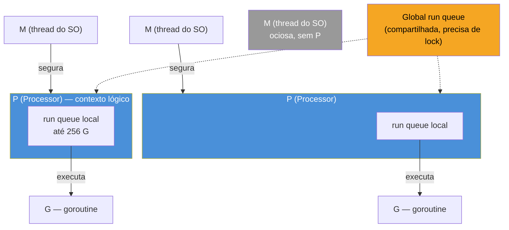
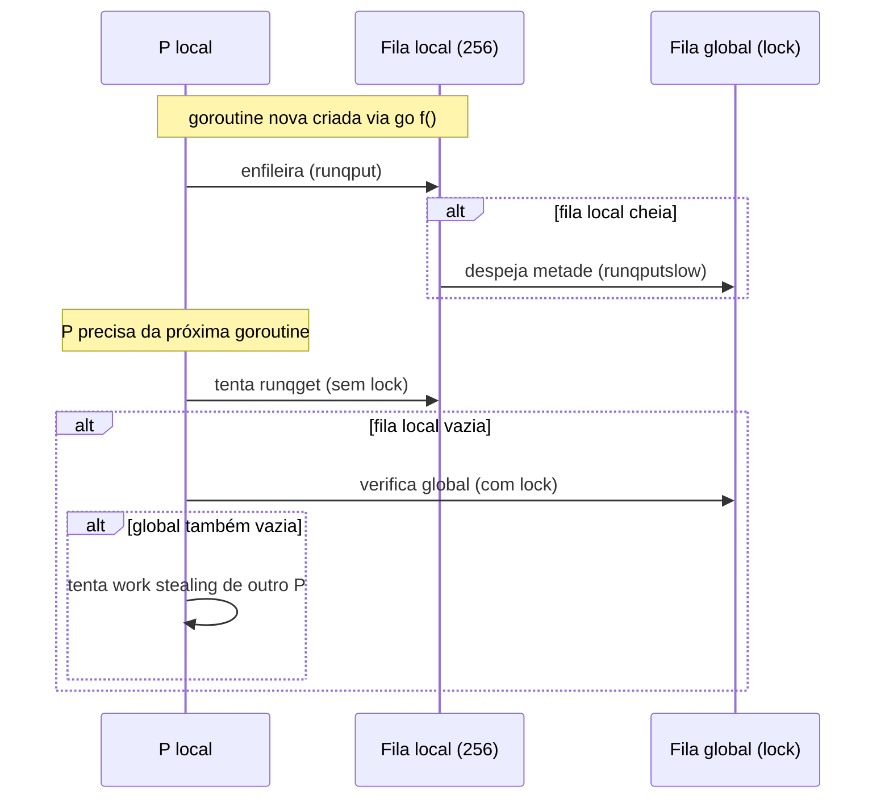
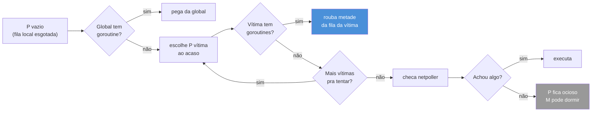
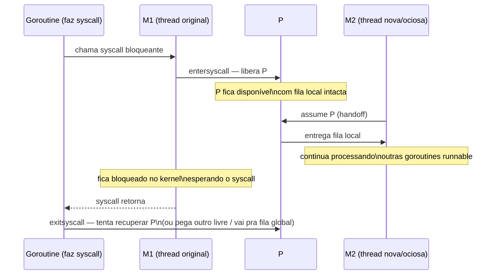
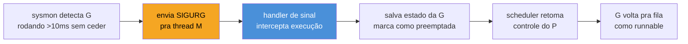

# O scheduler GMP a fundo

> [!abstract] TL;DR
> O scheduler do Go multiplexa **G**oroutines sobre **M**achine threads usando **P**rocessors como intermediário — cada P carrega uma fila local (run queue) de até 256 goroutines runnable, e só um M de cada vez pode "segurar" um P para executar Go code. Quando a fila local de um P esvazia, ele rouba (*work stealing*) metade da fila de outro P escolhido ao acaso; quando esgota tudo, olha a fila global e a rede (netpoller). Uma goroutine que entra em `syscall` bloqueante libera o P para outro M pegar — sem isso, uma chamada lenta ao SO travaria todas as outras goroutines daquele P. Desde o Go 1.14, o scheduler também sabe **preemptar assincronamente** uma goroutine em loop apertado sem `function call`, via sinal do SO — antes disso, um `for {}` sem chamada de função podia travar o processo inteiro.

## O problema que M:N resolve

Imagine que você tem 8 núcleos de CPU e seu programa Go dispara 100 mil goroutines — coisa comum num servidor que atende milhares de conexões concorrentes. Criar 100 mil *threads* do sistema operacional para isso seria um desastre: cada thread do SO custa megabytes de stack e microssegundos de troca de contexto via kernel. O SO simplesmente não foi desenhado para esse volume.

A saída do Go é multiplexar muitas goroutines sobre poucas threads reais — um modelo **M:N**, onde M goroutines rodam sobre N threads do SO, com N tipicamente igual ao número de núcleos. Isso não é novidade: Erlang faz algo parecido, green threads existiam antes. A parte interessante é *como* o Go decide qual goroutine roda em qual thread, quando, e o que acontece quando uma delas trava numa chamada de sistema — é aí que entra a peça central que dá nome a este capítulo: o modelo **GMP**.

> [!info] Pré-requisito
> Esta nota assume que você já passou pela visão de topo do GMP no [[03-Dominios/Engenharia/Comunicação entre Sistemas/index|galho 7]] (Comunicação entre Sistemas) ou já sabe o que são G, M e P em linhas gerais. Aqui a mesma sigla é revisitada, mas com o foco virado para dentro: filas, work stealing, handoff de syscall e preempção — o "como" por trás do "o quê".

## G, M, P — revisitado com profundidade

Três letras, três papéis bem separados:

- **G (Goroutine)** — a unidade de trabalho. Não é uma thread do SO: é uma struct (`runtime.g`) com sua própria stack pequena (a próxima nota, [[03 - A stack de uma goroutine]], entra em detalhe), um ponteiro para onde retomar a execução, e um estado (`_Grunnable`, `_Grunning`, `_Gwaiting`, `_Gsyscall`, entre outros).
- **M (Machine)** — uma thread real do sistema operacional (`runtime.m`), a única coisa que de fato executa instruções de CPU. Um processo Go pode ter dezenas de Ms, mas a maioria fica ociosa a maior parte do tempo.
- **P (Processor)** — o recurso que faltava nas primeiras versões do Go (pré-1.1) e que resolveu o gargalo de escalabilidade: um contexto de execução lógico (`runtime.p`), com sua própria fila local de goroutines runnable. Um M só executa Go code se estiver **segurando** um P — sem P, um M não tem de onde tirar trabalho.

A regra central do modelo: o número de Ps é fixo em `GOMAXPROCS` (default = número de núcleos lógicos, ajustável via `runtime.GOMAXPROCS(n)` ou variável de ambiente), mas o número de Ms é elástico — o runtime cria Ms novos sob demanda (e destrói alguns depois de ociosos) sempre que precisa de mais threads do SO rodando em paralelo, até um teto de segurança (10 mil, configurável via `debug.SetMaxThreads`).



Repare no que essa separação compra: sem P, cada M precisaria de um lock global toda vez que fosse buscar a próxima goroutine para rodar — contenção brutal com múltiplos núcleos. Com P, cada M busca goroutines primeiro na fila **local** do P que está segurando, sem lock nenhum na maioria dos casos. O lock global só entra quando a fila local esvazia — e mesmo aí, o scheduler prefere roubar de outro P antes de pagar o custo do lock na fila global.

> [!question]- Por que existe P se M já poderia ter sua própria fila?
> Porque P é o que torna o *handoff* de syscall possível sem perder a fila de trabalho. Se a fila de goroutines pendentes pertencesse ao M (à thread), uma goroutine que entrasse em syscall bloqueante levaria a fila inteira junto — presa, esperando o kernel devolver aquela thread específica. Como a fila pertence ao P, e P é desacoplável de M, o runtime pode simplesmente entregar o P (com sua fila intacta) para outra thread continuar processando, enquanto a thread original fica travada no kernel esperando o syscall voltar. Essa troca é o assunto da seção de handoff, mais adiante.

## Run queues: local e global

Cada P tem uma **run queue local** — um array circular de até 256 ponteiros para `runtime.g`, sem necessidade de lock para o caso comum (produtor e consumidor são o mesmo M, a maior parte do tempo). Quando essa fila enche, metade dela é despejada na **run queue global**, uma fila única, compartilhada por todos os Ps, protegida por mutex.

A fila global cumpre dois papéis: é o destino de excesso quando uma fila local transborda, e é a fonte de trabalho quando um P fica sem nada localmente e sem sucesso ao tentar roubar de outros Ps.



O scheduler não trata as duas filas com peso igual: a cada 61 chamadas de `schedule()` (o número é fixo no código-fonte, escolhido para ser primo e evitar padrões cíclicos coincidentes com outros contadores), o runtime é forçado a olhar a fila global **antes** da local — uma medida de justiça (*fairness*) para que goroutines despejadas na global não fiquem indefinidamente famintas enquanto Ps ficam satisfeitos só com suas filas locais.

## Work stealing: como um P ocioso encontra trabalho

Quando a fila local de um P esvazia e a fila global também não tem nada, o P não fica parado esperando — ele tenta **roubar** trabalho de outro P escolhido de forma pseudoaleatória:

1. Escolhe um P vítima ao acaso entre os `GOMAXPROCS` Ps existentes.
2. Rouba **metade** da fila local desse P (não tudo — evita que o ladrão vire imediatamente a próxima vítima).
3. Se não conseguir nada, tenta outro P vítima, repetindo por algumas rodadas.
4. Se todas as tentativas falharem, checa o *netpoller* (goroutines que estavam bloqueadas esperando I/O de rede e já ficaram prontas) e, por fim, a fila global de novo.
5. Se ainda assim não houver trabalho nenhum, o P entra em estado ocioso e o M correspondente pode ser devolvido ao sistema (ou colocado para dormir), até algo novo aparecer.



Esse mecanismo é o que dá ao Go balanceamento de carga automático entre núcleos, sem que o programador precise pensar em "distribuir trabalho manualmente" entre workers — algo que em outras linguagens exigiria um pool de threads configurado à mão, com filas próprias e lógica de rebalanceamento explícita. A analogia mais direta: é como um restaurante onde cada garçom (P) tem sua própria lista de mesas, mas quando um termina o turno cedo, ele pega metade das mesas de um colega sobrecarregado — em vez de ficar parado esperando o gerente (a fila global) distribuir manualmente.

## Syscalls e o handoff de P

Aqui está o ponto onde P realmente ganha o crédito por resolver um problema real. Existem dois tipos de bloqueio que uma goroutine pode sofrer, e o runtime trata cada um de forma diferente:

- **Bloqueio "conhecido" do runtime** — canal vazio, mutex, `time.Sleep`, I/O de rede via netpoller. Nesses casos, o Go **não** bloqueia a thread do SO: a goroutine é suspensa (`_Gwaiting`), o M continua livre segurando o P, e o scheduler simplesmente pega a próxima goroutine runnable da fila. Quando o evento acontece (canal recebe valor, socket fica pronto), a goroutine volta para `_Grunnable` numa fila.
- **Syscall bloqueante do SO** — abrir um arquivo, ler de um disco lento, chamar `cgo` para uma biblioteca C que trava. Aqui a thread do SO **precisa mesmo bloquear**, porque o kernel não devolve o controle até o syscall terminar. É esse caso que exige o handoff.

Quando uma goroutine entra num syscall bloqueante, o runtime executa `entersyscall`: o M continua preso no kernel, mas o **P se desacopla** desse M e fica disponível. Se havia goroutines runnable na fila local (ou na global) esperando, o runtime imediatamente arranja outro M — reaproveitando um M ocioso existente ou criando um novo — para pegar esse P e continuar processando as outras goroutines. Quando o syscall retorna (`exitsyscall`), a goroutine original tenta recuperar o mesmo P; se ele já estiver ocupado com outro M, ela pega qualquer P livre ou, na falta de um, volta para a fila global até que algum P sobre.



Esse handoff é o motivo pelo qual um programa Go com centenas de goroutines fazendo I/O de disco lento continua respondendo normalmente nas outras goroutines — o custo de um syscall lento fica isolado numa thread do SO, sem travar o P e sua fila de trabalho.

> [!warning] cgo é um caso ainda mais caro
> Uma chamada via `cgo` para código C é tratada como syscall para efeitos de handoff — mas sem o mesmo grau de cooperação: o runtime não tem visão do que o código C está fazendo, então não pode preemptá-lo nem monitorar seu progresso do mesmo jeito. Chamadas `cgo` frequentes ou longas tendem a forçar a criação de mais Ms do que o necessário, porque cada uma prende uma thread real até retornar.

## Preempção assíncrona (Go 1.14+)

> [!info] Marco de versão
> Antes do Go 1.14 (lançado em fevereiro de 2020), o scheduler do Go era **cooperativo**: uma goroutine só cedia o processador em pontos específicos do código — chamadas de função (que incluíam um teste de "preciso ceder?" inserido pelo compilador), alocações, operações de canal, chamadas de sistema. Uma goroutine com um loop apertado **sem chamada de função nenhuma**, como `for { }` puro ou um loop matemático que só faz aritmética, podia monopolizar seu P indefinidamente — a ponto de travar `GOMAXPROCS` goroutines inteiras e até o processo, incluindo o próprio garbage collector, que depende de conseguir parar todas as goroutines num *stop-the-world* (assunto da [[05 - O garbage collector|nota 05]]).

O Go 1.14 introduziu a **preempção assíncrona baseada em sinais** do sistema operacional. O funcionamento, em linhas gerais:

1. Um monitor em background do runtime (`sysmon`, que roda numa thread própria, sem P) detecta que uma goroutine está executando há mais de 10ms sem ceder o processador.
2. O `sysmon` envia um sinal do SO (`SIGURG` em sistemas Unix — escolhido por não ser usado por bibliotecas comuns e ser ignorado por padrão em outros contextos) para a thread (M) que está executando essa goroutine.
3. O handler do sinal, instalado pelo próprio runtime, intercepta a execução no ponto exato onde ela estava — mesmo no meio de um loop sem chamadas de função — salva o estado da goroutine numa stack auxiliar e a marca como preemptada.
4. O scheduler retoma o controle daquele P, coloca a goroutine interrompida de volta na fila como runnable, e segue escalonando normalmente.



Isso resolveu, de uma vez, uma classe inteira de bugs de produção que existia desde o Go 1.0 — loops de cálculo pesado (parsing, compressão, hashing manual) que travavam o GC e faziam todo o processo parecer congelado por segundos, mesmo com outras goroutines prontas para rodar. Vale notar que a preempção assíncrona não substitui a cooperativa — ela é a rede de segurança para os casos em que os pontos cooperativos normais (chamadas de função, principalmente) não aparecem com frequência suficiente.

```go
// Antes do Go 1.14, este código podia travar o programa inteiro
// se GOMAXPROCS=1 e nenhuma outra goroutine tivesse chance de rodar:
func loopApertado() {
    soma := 0
    for i := 0; i < 1_000_000_000_000; i++ {
        soma += i // nenhuma chamada de função, nenhum ponto de cessão cooperativo
    }
    fmt.Println(soma)
}

// A partir do Go 1.14, o sysmon consegue preemptar esta goroutine
// via sinal, mesmo sem nenhum ponto de cessão explícito no código.
```

> [!warning] Preempção assíncrona não é instantânea nem garantida em todo caso
> O intervalo de detecção do `sysmon` é de aproximadamente 10ms — uma goroutine em loop apertado ainda consegue monopolizar um P por um tempo curto antes de ser interrompida. Além disso, existem janelas críticas do runtime (parte do código de baixo nível, seções não-preemptáveis por segurança) onde o sinal é adiado até um ponto seguro. Na prática isso raramente importa para código de aplicação — mas explica por que "o Go 1.14 tem preempção assíncrona" não é sinônimo de "loops apertados nunca mais afetam latência".

## Observando o scheduler em ação

Tudo isso descrito até aqui não precisa ficar no plano da teoria — o runtime expõe uma variável de ambiente que imprime, periodicamente, um retrato do estado interno do scheduler:

```bash
GODEBUG=schedtrace=1000 go run main.go
```

Isso faz o runtime imprimir uma linha a cada 1000ms, no formato aproximado:

```
SCHED 1000ms: gomaxprocs=8 idleprocs=3 threads=10 spinningthreads=1 idlethreads=4 runqueue=2 [12 8 15 0 3 9 1 4]
```

- `gomaxprocs` — quantos Ps existem (o teto de paralelismo).
- `idleprocs` — quantos Ps estão sem trabalho no momento.
- `threads` — total de Ms criados até agora.
- `spinningthreads` — Ms que estão ativamente procurando trabalho (via work stealing) sem ainda ter achado.
- `runqueue` — tamanho da fila global.
- O array final — `[12 8 15 0 3 9 1 4]` — é o tamanho da fila **local** de cada P, na ordem. É literalmente possível ver o desbalanceamento entre filas locais e, rodando de novo, ver work stealing corrigindo isso ao longo do tempo.

Adicionar `GODEBUG=schedtrace=1000,scheddetail=1` produz uma versão bem mais verbosa, com o estado de cada G, M e P individualmente — útil para depurar um caso real de starvation ou contenção, mas verboso demais para deixar ligado em produção.

## Casos práticos

**1. Observando o efeito de `GOMAXPROCS` na distribuição de trabalho:**

```go
package main

import (
	"fmt"
	"runtime"
	"sync"
)

func main() {
	fmt.Println("GOMAXPROCS:", runtime.GOMAXPROCS(0)) // 0 = só consulta, não altera
	fmt.Println("NumCPU:", runtime.NumCPU())

	var wg sync.WaitGroup
	for i := 0; i < 20; i++ {
		wg.Add(1)
		go func(id int) {
			defer wg.Done()
			// trabalho de CPU o bastante pra cada goroutine
			// realmente disputar um P
			soma := 0
			for j := 0; j < 50_000_000; j++ {
				soma += j
			}
			_ = soma
		}(i)
	}
	wg.Wait()
	fmt.Println("20 goroutines de CPU concluídas")
}
```

Com `GOMAXPROCS` alto (default = núcleos disponíveis), as 20 goroutines se espalham entre os Ps e correm em paralelo real. Forçar `runtime.GOMAXPROCS(1)` no início do `main` faz todas competirem por um único P — ainda concorrentes (o scheduler alterna entre elas), mas nunca paralelas.

**2. Isolando o custo de um syscall lento com o handoff de P** — sem o handoff, uma goroutine de I/O lento bloquearia toda a capacidade de um P; com ele, as outras seguem rodando:

```go
package main

import (
	"fmt"
	"os"
	"sync"
	"time"
)

func main() {
	var wg sync.WaitGroup

	// Goroutine que faz um syscall real e lento (I/O de disco)
	wg.Add(1)
	go func() {
		defer wg.Done()
		f, err := os.CreateTemp("", "scheduler-demo-*")
		if err != nil {
			return
		}
		defer os.Remove(f.Name())
		defer f.Close()
		// escreve dados o bastante pra syscall não ser instantâneo
		f.Write(make([]byte, 50*1024*1024))
		f.Sync() // força o syscall a esperar o disco de verdade
	}()

	// Goroutines de CPU pura, que devem continuar avançando
	// mesmo enquanto a de cima está presa no kernel
	inicio := time.Now()
	for i := 0; i < 5; i++ {
		wg.Add(1)
		go func(id int) {
			defer wg.Done()
			soma := 0
			for j := 0; j < 100_000_000; j++ {
				soma += j
			}
			fmt.Printf("goroutine %d terminou em %v\n", id, time.Since(inicio))
		}(i)
	}

	wg.Wait()
}
```

As goroutines de CPU tendem a terminar sem esperar pelo `f.Sync()`, porque o handoff de P libera outro M para processá-las assim que a goroutine de I/O entra em syscall — elas não ficam presas atrás dela na mesma fila.

## Armadilhas comuns

> [!warning] `runtime.GOMAXPROCS(n)` não limita o número de goroutines, só o paralelismo real
> Setar `GOMAXPROCS` baixo não impede a criação de milhões de goroutines — só limita quantas rodam **simultaneamente** em núcleos diferentes. Concorrência (muitas goroutines alternando) continua existindo mesmo com `GOMAXPROCS(1)`; o que desaparece é o paralelismo (execução literalmente ao mesmo tempo em cores distintos).

> [!warning] `runtime.Gosched()` não é a mesma coisa que preempção
> `runtime.Gosched()` cede o processador voluntariamente — a goroutine chamadora volta pro fim da fila e deixa outras rodarem. É útil em casos raros de teste ou benchmarking, mas depender dele em produção pra "resolver" starvation é sintoma de que o desenho de concorrência tem um problema mais fundo — o scheduler já lida com isso via preempção (cooperativa e, desde 1.14, assíncrona) sem precisar de ajuda manual.

> [!warning] Work stealing rouba goroutines, não estado — cuidado com afinidade assumida
> Não existe garantia de que uma goroutine continue rodando no mesmo P, ou até no mesmo M, entre uma execução e outra — work stealing pode movê-la livremente. Código que assume afinidade implícita com uma thread do SO (comum em bindings de bibliotecas C via cgo que exigem chamadas sempre na mesma thread) precisa de `runtime.LockOSThread()` explícito; sem isso, o scheduler pode migrar a goroutine para outro M no meio do caminho.

## Lente cross-stack

| Vindo de... | Modelo de concorrência | Em Go, isso vira... |
|---|---|---|
| Java (antes de Virtual Threads/Project Loom) | Thread do SO 1:1 — cada `Thread` é uma thread real, cara de criar em massa | Goroutine M:N sobre GMP — criar 100 mil goroutines é rotina, não exceção |
| Java (Virtual Threads, JDK 21+) | Modelo M:N parecido em espírito — virtual threads sobre *carrier threads* | Comparável ao GMP em motivação, mas Go tem o modelo desde a v1.0 e integra o scheduler ao GC e ao netpoller de forma mais unificada |
| Python (GIL) | Um único thread executa bytecode Python por vez — paralelismo real só via multiprocessing ou C extensions | `GOMAXPROCS` Ps rodam Go code em paralelo real, sem lock global equivalente ao GIL |
| Node.js | Single-threaded event loop — concorrência via callbacks/promises sobre uma única thread | Múltiplos Ps com paralelismo real; goroutines bloqueantes não travam "o loop inteiro" graças ao handoff de syscall |

A comparação mais precisa, historicamente, é com Erlang/BEAM — schedulers M:N por núcleo, work stealing entre filas, preempção do runtime. Go chegou a esse desenho de forma independente, mas a motivação (evitar que uma tarefa lenta monopolize um núcleo) é a mesma.

## Como explicar em inglês

> Go's scheduler multiplexes goroutines (G) onto OS threads (M) through an intermediary called a Processor (P) — each P owns a local run queue and only one M at a time can hold a P to execute Go code. When a P's local queue empties, it steals half the queue from another randomly chosen P; when that fails too, it checks the global run queue and the netpoller. A blocking syscall triggers a handoff: the P detaches from its M (which stays stuck in the kernel) and gets picked up by another M, so other goroutines on that P keep making progress. Since Go 1.14, the scheduler also supports asynchronous preemption — the background `sysmon` thread sends an OS signal (SIGURG on Unix) to interrupt a goroutine that's been running more than 10ms without yielding, even inside a tight loop with no function calls. Before 1.14, such loops could starve the entire process, including the garbage collector's stop-the-world phase.

| Termo PT | Termo EN |
|---|---|
| fila de execução local | local run queue |
| fila de execução global | global run queue |
| roubo de trabalho | work stealing |
| entrega/transferência de P | P handoff |
| chamada de sistema bloqueante | blocking syscall |
| preempção assíncrona | asynchronous preemption |
| monitor do sistema | sysmon |
| paralelismo vs. concorrência | parallelism vs. concurrency |
| thread ociosa | idle thread |
| trava total (parar o mundo) | stop-the-world |

## O que vem a seguir

O scheduler decide **quando** e **onde** uma goroutine roda — mas ainda falta responder **como** ela guarda seu próprio estado de execução entre uma pausa e outra, considerando que uma goroutine não tem uma stack fixa de megabytes como uma thread do SO. A [[03 - A stack de uma goroutine|próxima nota]] entra nesse mecanismo: stacks que começam em 2KB, crescem e encolhem dinamicamente, e o que acontece por baixo quando uma goroutine é preemptada no meio de uma chamada — o outro lado da moeda do que este capítulo acabou de descrever.

## Veja também

- [[01 - O runtime Go por baixo|01 — O runtime Go por baixo]] — visão geral do runtime que este capítulo aprofunda no scheduler especificamente
- [[03 - A stack de uma goroutine|03 — A stack de uma goroutine]] — próxima nota do galho
- [[05 - O garbage collector|05 — O garbage collector]] — o *stop-the-world* que a preempção assíncrona protege de starvation
- [[03-Dominios/Tecnologia/Go/index|Trilha Go]]

## Fontes

- The Go Authors. *Go 1.14 Release Notes — Runtime*. go.dev. https://go.dev/doc/go1.14#runtime (acessado em 2026-07-18)
- The Go Authors. *runtime package documentation — GOMAXPROCS*. pkg.go.dev. https://pkg.go.dev/runtime#GOMAXPROCS (acessado em 2026-07-18)
- The Go Authors. *runtime package documentation — Gosched, LockOSThread*. pkg.go.dev. https://pkg.go.dev/runtime (acessado em 2026-07-18)
- The Go Authors. *Effective Go — Goroutines*. go.dev. https://go.dev/doc/effective_go#goroutines (acessado em 2026-07-18)
- The Go Authors. *A Tour of Go — Goroutines*. go.dev. https://go.dev/tour/concurrency/1 (acessado em 2026-07-18)
