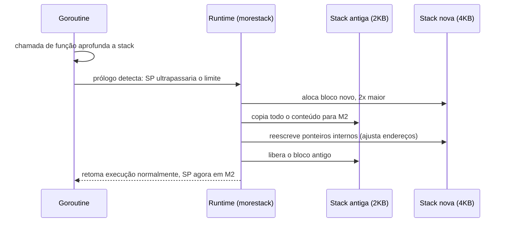
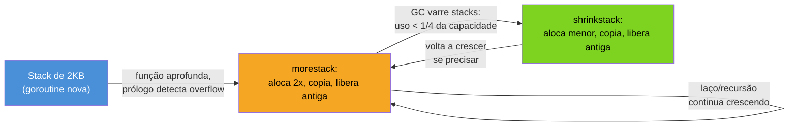

# A stack de uma goroutine

> [!abstract] TL;DR
> Uma goroutine nasce com uma stack de só **2KB** — mil vezes menor que a stack default de uma thread do sistema operacional (1-8MB). Isso é possível porque a stack de uma goroutine é **gerenciada pelo runtime**, não pelo SO: quando ela ameaça estourar, o runtime aloca uma stack nova, maior, **copia** o conteúdo inteiro (ajustando todo ponteiro interno que aponte para dentro da própria stack) e libera a antiga — um mecanismo chamado *stack copying* (ou *stack movement*). A stack também **encolhe** quando sobra espaço demais, durante o GC. É essa dupla — pequena no início, elástica sob demanda — que permite programas Go rodarem milhões de goroutines simultâneas onde milhares de threads do SO já travariam a máquina por exaustão de memória.

## O problema que uma thread do SO nunca resolveu bem

Imagine que você precisa atender 200 mil conexões simultâneas — um servidor de chat, um proxy, um gateway de streaming. Cada conexão precisa de uma linha de execução própria, porque ela vai bloquear em I/O o tempo todo (esperando dados chegarem, esperando o cliente responder).

Em Java clássico (antes de virtual threads), Python, ou C com pthreads, a resposta óbvia — uma thread do SO por conexão — não escala. Não porque a CPU não aguenta trocar de contexto entre 200 mil threads (isso já seria ruim), mas porque **cada thread reserva uma stack fixa**, tipicamente 1MB no Linux (`ulimit -s`), 1MB no Windows por default. Faça a conta: 200.000 × 1MB = 200GB só de espaço de endereçamento reservado para stacks, antes de qualquer dado de aplicação existir. Na prática o SO costuma reservar o espaço de endereço sem comprometer memória física imediatamente (páginas são alocadas sob demanda), mas o limite de threads que o kernel consegue agendar de forma decente já estoura bem antes disso — dezenas de milhares de threads já deixam o scheduler do SO gemendo.

Go ataca esse problema pela raiz: se cada goroutine tem uma stack de **2KB** em vez de 1MB, 200.000 goroutines custam ~400MB de stacks — cabe folgado em qualquer máquina moderna. É por isso que "spawn uma goroutine por conexão" é o padrão idiomático em Go, enquanto "spawn uma thread por conexão" é anti-padrão em quase toda outra linguagem com threads nativas do SO.

Mas 2KB é pouquíssimo. Uma função com algumas variáveis locais, mais uma chamada recursiva de profundidade razoável, estoura 2KB rapidinho. Como Go continua funcionando sem que o programador precise calcular "quanto de stack minha goroutine vai precisar" — como você é forçado a fazer, em teoria, com `pthread_attr_setstacksize`?

## Stacks contíguas, redimensionáveis

A resposta mudou de mecanismo ao longo da história do Go, e vale registrar isso porque documentação antiga na internet ainda descreve o mecanismo velho.

Até o Go 1.2, o runtime usava **segmented stacks** (também chamadas *split stacks*): quando a stack enchia, o runtime simplesmente alocava um segmento novo, ligado ao anterior por um ponteiro — como um encadeamento de blocos. Funcionava, mas tinha um problema de performance conhecido como *hot split*: uma função rodando bem na fronteira entre dois segmentos, dentro de um laço apertado, ficava alocando e desalocando segmento a cada iteração — chamada entra, estoura por pouco, aloca segmento novo; retorna, libera o segmento; chama de novo, aloca de novo. Um custo escondido, difícil de prever olhando o código-fonte.

Desde o **Go 1.3** (2014), o runtime usa **stacks contíguas** (*contiguous stacks*) com **cópia** (*stack copying*): a stack de uma goroutine é sempre um único bloco de memória contíguo. Quando ela precisa crescer, o runtime não remenda um pedaço novo — aloca um bloco **novo e maior** (tipicamente o dobro do tamanho), copia todo o conteúdo do bloco antigo para o novo, ajusta cada ponteiro que apontava para dentro da stack antiga (porque o endereço mudou!), e libera o bloco antigo. É o mesmo princípio de um `slice` do Go que estoura a capacidade e recebe um array subjacente novo via `append` — só que acontecendo automaticamente, para a stack inteira de uma goroutine, orquestrado pelo runtime.



O gatilho para esse processo é um detalhe elegante: toda função Go, no seu prólogo (o código gerado pelo compilador antes do corpo da função de fato começar), contém uma checagem barata — compara o *stack pointer* (SP) atual contra um limite (`stackguard0`) armazenado na estrutura `g` (o descritor da goroutine). Se o SP ultrapassaria esse limite ao completar a chamada, o prólogo desvia para uma rotina do runtime chamada `morestack`, que faz o trabalho de crescer a stack antes de deixar a função original continuar. Esse é o mesmo checkpoint, aliás, que o runtime usa para implementar *preemption* cooperativa em pontos de chamada de função — mas isso é aprofundado na [[02 - O scheduler GMP a fundo|nota 02]], não aqui.

> [!info] Go 1.3+ é a linha de base — versão do runtime atual
> Tudo descrito nesta nota — stacks contíguas de 2KB iniciais, crescimento por cópia com fator de dobra, encolhimento durante o GC — é o comportamento do runtime desde o Go 1.3 (2014) e continua válido em Go 1.23+. Não há flag de configuração para voltar ao esquema de segmented stacks; ele foi removido do código-fonte há mais de uma década.

## Por que copiar ponteiros internos é o passo difícil

Copiar bytes de um bloco de memória para outro é trivial. O que torna o stack copying um mecanismo sofisticado — e uma das razões pelas quais Go não expõe ponteiros de stack arbitrários para o programador — é que **qualquer variável local cujo endereço foi tomado com `&`** pode ter um ponteiro guardado em algum lugar dessa mesma stack, apontando para dentro dela.

```go
func soma(a, b int) int {
    resultado := a + b
    p := &resultado       // ponteiro para uma variável na stack local
    dobro(p)
    return resultado
}

func dobro(p *int) {
    *p *= 2                // acessa via ponteiro — precisa continuar válido após um resize
}
```

Quando o runtime copia a stack de `soma` para um bloco novo, `resultado` muda de endereço. Se `p` (guardado numa outra frame de stack, ou registrador) continuasse apontando para o endereço antigo, `dobro` corromperia memória já liberada — um *use-after-free* clássico. O runtime evita isso porque, durante a cópia, ele varre a stack usando informação de tipo gerada pelo compilador (*stack maps*, que dizem exatamente onde, em cada frame, há um ponteiro) e reescreve cada ponteiro que aponta para dentro do intervalo antigo, somando o deslocamento entre o endereço antigo e o novo.

Isso só é seguro porque o compilador Go sabe, em tempo de compilação, exatamente quais palavras de cada stack frame são ponteiros — a mesma informação de tipo que sustenta o [[04 - Escape analysis|escape analysis]] e o rastreamento do garbage collector. É também a razão prática, silenciosa, pela qual Go **não permite aritmética de ponteiros arbitrária**: se um `*int` pudesse virar um `uintptr`, ser incrementado e voltar a ser `*int` livremente, o runtime perderia a capacidade de rastrear e corrigir esse ponteiro durante um stack copy — o programa quebraria de forma sutil e esporádica, só sob a combinação certa de profundidade de recursão e timing de GC.

> [!warning] `unsafe.Pointer` guardado fora da stack pode sobreviver a um resize errado
> Código que usa `unsafe.Pointer` para converter um ponteiro de stack em `uintptr`, guarda esse `uintptr` em algum lugar (um campo de struct, uma variável global) e depois converte de volta para ponteiro **não é seguro** na presença de stack copying — o runtime não sabe que aquele `uintptr` "era" um ponteiro para a stack, então não o corrige durante a cópia. A [documentação do pacote `unsafe`](https://pkg.go.dev/unsafe#Pointer) é explícita sobre isso: conversões `Pointer → uintptr → Pointer` só são seguras dentro da mesma expressão, sem retenção intermediária. Esse é um dos motivos pelos quais `unsafe` é, de fato, unsafe.

## Encolhendo: a stack também some quando sobra

O crescimento chama mais atenção, mas o runtime também faz o caminho inverso: se, durante um ciclo do garbage collector, o runtime percebe que uma goroutine está usando menos de um quarto da sua stack atual, ele encolhe a stack pela metade — de novo via cópia, só que para um bloco menor. Isso importa porque uma goroutine que teve um pico de recursão profunda (parseando uma árvore grande, por exemplo) e depois volta a rodar código raso não fica carregando permanentemente uma stack de 64KB "só porque precisou dela uma vez". O `shrinkstack`, que faz esse trabalho, roda como parte da varredura de stacks do GC — outro ponto de contato entre este assunto e a [[05 - O garbage collector|nota 05]].



## Limite superior: a stack não cresce para sempre

Existe um teto. Por default, o runtime permite que a stack de uma única goroutine cresça até **1GB** em sistemas 64-bit (250MB em 32-bit) — configurável em tempo de execução via [`debug.SetMaxStack`](https://pkg.go.dev/runtime/debug#SetMaxStack). Ultrapassar esse limite — tipicamente por recursão infinita sem caso-base — não produz um `StackOverflowError` recuperável como em Java; produz um crash fatal do processo inteiro, do tipo `runtime: goroutine stack exceeds 1000000000-byte limit` seguido de `fatal error: stack overflow`. Não é um `panic` capturável com `recover` — é o runtime abortando o processo, porque nesse ponto a integridade da memória não pode mais ser garantida com segurança.

```go
func recursaoSemFim(n int) int {
    return recursaoSemFim(n + 1) // sem caso-base — cresce a stack até estourar
}

func main() {
    recursaoSemFim(0)
    // fatal error: stack overflow
    // exit status 2 — processo inteiro morre, não só a goroutine
}
```

> [!warning] Uma goroutine travada em recursão infinita mata o processo inteiro
> Diferente de uma exceção de stack overflow em Java (que mata só a thread, geralmente recuperável no nível certo), um stack overflow em Go é um `fatal error` do runtime — não um `panic`. `defer`/`recover` não intercepta, e o processo inteiro morre. Se seu código tem recursão sobre entrada não confiável (parsing de estruturas aninhadas vindas de um cliente, por exemplo), o limite de profundidade precisa ser controlado explicitamente pela sua lógica, não pela expectativa de que o runtime vai te salvar com um erro recuperável.

## Vindo de outra stack: comparação rápida

| Runtime/linguagem | Stack inicial | Redimensionamento | Custo de 100 mil unidades concorrentes |
|---|---|---|---|
| Thread POSIX (C, Java clássico) | 1-8MB fixo | não redimensiona — `ulimit`/`pthread_attr` define no início | inviável: 100GB+ de espaço reservado, scheduler do kernel sobrecarregado |
| Java (virtual threads, Project Loom, JDK 21+) | pequena, cresce sob demanda em heap gerenciado pela JVM | similar em espírito ao Go — heap-allocated, cresce dinamicamente | viável — Loom foi desenhado justamente para competir com esse modelo do Go |
| Goroutine (Go) | 2KB | cresce/encolhe por cópia, runtime gerencia | ~200-400MB de stacks — trivial |
| `async`/coroutine (Python asyncio, JS event loop) | não tem stack própria por task — compartilha a stack da thread única | N/A — modelo cooperativo single-thread, sem stack por unidade | leve em memória, mas sem paralelismo real (GIL/single-thread) |

A comparação mais honesta, hoje, é com as *virtual threads* do Java (JDK 21+, finalizadas na JEP 444): a motivação é quase idêntica à das goroutines — permitir milhões de unidades de concorrência bloqueante sem o custo de threads do SO. A diferença de implementação (Go copia stacks contíguas; a JVM usa uma estrutura de *continuation* baseada em heap, mais próxima de uma stack segmentada moderna) é detalhe de baixo nível; o problema que ambas resolvem, e a ordem de grandeza do ganho, são o mesmo.

## Como explicar em inglês

> A goroutine starts with a tiny stack — just 2KB — compared to the fixed 1-8MB a typical OS thread reserves. That's only possible because the Go runtime, not the OS, manages goroutine stacks: each function prologue cheaply checks whether the stack pointer is about to exceed its current bound, and if so, calls into `morestack`, which allocates a new, larger contiguous block, copies the entire old stack into it — rewriting every internal pointer that referenced the old addresses — and frees the old block. The same mechanism runs in reverse during GC: stacks using less than a quarter of their capacity get shrunk. This grow-and-shrink-by-copy design is exactly what lets Go programs spawn hundreds of thousands, even millions, of goroutines where spawning that many OS threads would exhaust memory and choke the kernel scheduler long before any application logic ran.

| Termo PT | Termo EN |
|---|---|
| pilha (de execução) | stack |
| cópia de pilha | stack copying / stack movement |
| pilha contígua | contiguous stack |
| pilha segmentada (esquema antigo) | segmented stack / split stack |
| crescer a pilha | grow the stack |
| encolher a pilha | shrink the stack |
| estouro de pilha | stack overflow |
| ponteiro de pilha | stack pointer (SP) |
| mapa de pilha | stack map |

## O que vem a seguir

Stack copying resolve o crescimento de uma goroutine que já existe — mas não decide *onde* uma variável nasce em primeiro lugar. Toda vez que o compilador Go decide se um valor vive na stack (rápido, descartado ao retornar) ou precisa "escapar" para a heap (mais caro, rastreado pelo GC), ele está fazendo uma análise estática chamada **escape analysis** — e é ela que determina, silenciosamente, boa parte do que este capítulo assumiu como dado: que a stack de uma goroutine pode ser pequena porque a maioria dos valores locais nunca precisa sair dela. A [[04 - Escape analysis|próxima nota]] entra nesse mecanismo a fundo — como o compilador decide, e como ler a decisão dele com `go build -gcflags="-m"`.

## Veja também

- [[01 - O runtime Go por baixo|01 — O runtime Go por baixo]] — visão geral do runtime como sistema operacional embutido no binário
- [[02 - O scheduler GMP a fundo|02 — O scheduler GMP a fundo]] — o mesmo checkpoint de prólogo usado para crescer a stack também é ponto de preempção cooperativa
- [[04 - Escape analysis|04 — Escape analysis]] — próxima nota: por que a maioria dos valores locais nunca precisa sair da stack
- [[05 - O garbage collector|05 — O garbage collector]] — o `shrinkstack` roda durante a varredura de stacks do GC
- [[03-Dominios/Tecnologia/Go/index|Trilha Go]]

## Fontes

- The Go Authors. *Go 1.3 Release Notes — Goroutine Stacks*. go.dev. https://go.dev/doc/go1.3#stacks (acessado em 2026-07-18)
- The Go Authors. *Package runtime/debug — func SetMaxStack*. pkg.go.dev. https://pkg.go.dev/runtime/debug#SetMaxStack (acessado em 2026-07-18)
- The Go Authors. *Package unsafe — type Pointer*. pkg.go.dev. https://pkg.go.dev/unsafe#Pointer (acessado em 2026-07-18)
- The Go Authors. *runtime package source — stack.go*. go.dev. https://go.dev/src/runtime/stack.go (acessado em 2026-07-18)
- The Go Authors. *A Tour of Go — Goroutines*. go.dev. https://go.dev/tour/concurrency/1 (acessado em 2026-07-18)
- Oracle/OpenJDK. *JEP 444: Virtual Threads*. openjdk.org. https://openjdk.org/jeps/444 (acessado em 2026-07-18)
