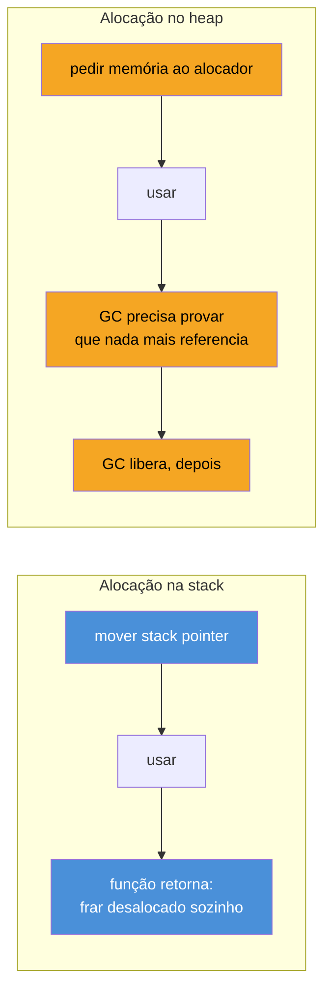
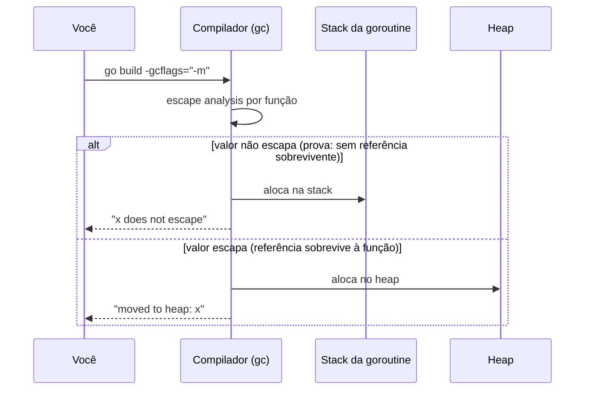
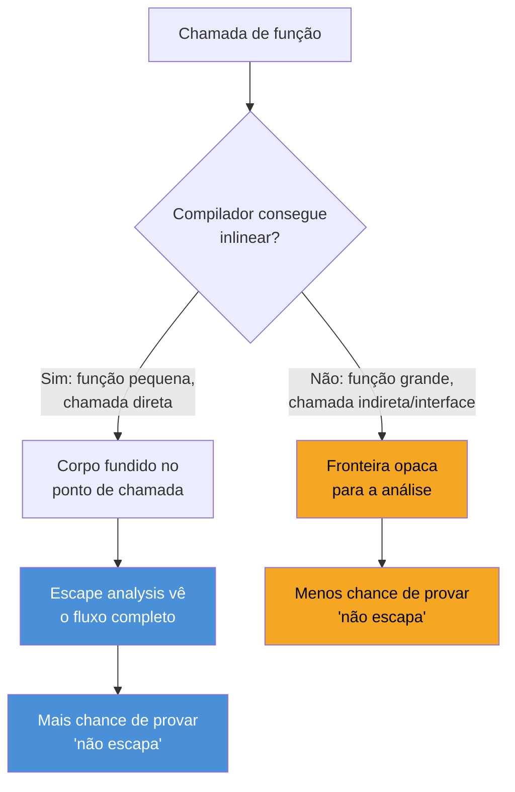

# Escape analysis

> [!abstract] TL;DR
> **Escape analysis** é a fase do compilador que decide, em tempo de compilação, se cada valor de uma função pode viver na **stack** (barato, some sozinho quando a função retorna) ou precisa ir para o **heap** (mais caro, entra na contabilidade do garbage collector). A decisão não depende de você escrever `new` ou `&` — Go não tem essa distinção sintática de C++ — depende de o compilador conseguir **provar** que o valor não é referenciado depois que a função termina. Se conseguir provar, fica na stack; se não conseguir (ou se provar o contrário), "escapa" para o heap. `go build -gcflags="-m"` expõe essa decisão linha por linha. Entender escape analysis é o que separa "código Go que funciona" de "código Go que não bombardeia o GC com lixo desnecessário" — é o pré-requisito direto para a nota seguinte, sobre o próprio coletor.

## O mistério do ponteiro que sobrevive

Aqui vai um experimento mental que quebra a intuição de quem vem de C: em C, retornar o endereço de uma variável local é o pecado capital número um.

```c
int *perigoso() {
    int x = 42;
    return &x; // UB: x morre quando a função retorna
}
```

`x` mora na stack frame de `perigoso`. Quando a função retorna, essa stack frame é destruída — o ponteiro devolvido aponta para memória que já não é mais sua, prestes a ser reescrita pela próxima chamada de função. É *undefined behavior* clássico, o tipo de bug que passa despercebido em testes e explode em produção.

Agora o mesmo padrão em Go:

```go
func naoTaoPerigoso() *int {
    x := 42
    return &x // Go: perfeitamente seguro
}

func main() {
    p := naoTaoPerigoso()
    fmt.Println(*p) // 42, sem drama nenhum
}
```

Isso compila, roda, e `*p` imprime `42` de forma totalmente confiável. Nenhuma mágica de runtime "corrige" o ponteiro depois — o compilador **decidiu, antes mesmo de gerar código de máquina**, que `x` não podia viver na stack de `naoTaoPerigoso`. Ele alocou `x` no heap desde o início. Quando a função retorna, a stack frame é destruída normalmente — mas `x` nunca esteve lá. `x` escapou.

Essa é a pergunta central deste capítulo: como o compilador sabe, olhando só para o código-fonte, que um valor precisa ir para o heap? E por que isso importa o suficiente para virar uma ferramenta de linha de comando dedicada?

## Por que a stack é barata e o heap é caro

Antes de entrar no mecanismo, vale relembrar o porquê da distinção importar (a [[03 - A stack de uma goroutine|nota 03]] trata a stack de uma goroutine em detalhe — aqui só o resumo que sustenta este capítulo).

A stack de uma goroutine é uma região de memória contígua, e alocar nela é **uma soma**: mover o ponteiro de topo da stack (*stack pointer*) alguns bytes para frente. Desalocar é **outra soma**, na direção contrária, quando a função retorna. Não há busca por espaço livre, não há contabilidade de quem ainda referencia o quê — o compilador já sabe, estaticamente, o tamanho exato de cada frame.

O heap é outra história. Alocar no heap passa pelo alocador de memória do runtime (que por sua vez negocia páginas com o sistema operacional), e desalocar depende do **garbage collector** provar que nada mais referencia aquele valor — um trabalho que roda concorrentemente com o programa, consome ciclos de CPU e, em cargas com alocação pesada, pode se tornar o gargalo dominante do sistema.



A diferença de custo não é sutil: alocação de stack é medida em nanosegundos e não deixa rastro para o GC visitar depois; alocação de heap soma ao trabalho do alocador **e** ao trabalho futuro do coletor. Um programa que aloca compulsivamente no heap onde a stack bastaria não está "errado" — continua correto — mas está pagando um imposto de performance evitável. Escape analysis é a ferramenta que decide, automaticamente, qual imposto se aplica a cada valor.

## A regra de ouro: quem prova que o valor não escapa, fica

O compilador Go roda escape analysis durante a compilação, como parte do processo de otimização, antes de gerar código de máquina. A regra que ele aplica é conservadora por natureza: um valor só fica na stack se o compilador conseguir **provar** que nenhuma referência a ele sobrevive ao retorno da função que o criou. Se essa prova falhar — por qualquer motivo, incluindo os limites da própria análise estática — o valor vai para o heap. Não existe meio-termo: a decisão é binária, por valor, e o compilador prefere errar para o lado seguro.

Alguns motivos comuns de escape:

- **O endereço do valor é devolvido** (como no exemplo de `naoTaoPerigoso` acima) — se a função retorna `&x`, o chamador pode segurar essa referência indefinidamente, muito além do tempo de vida da stack frame.
- **O valor é armazenado em algo que sobrevive à função** — um campo de struct que é retornado, uma entrada de slice ou map que é passada adiante, uma variável de pacote (global).
- **O compilador não consegue determinar o tamanho em tempo de compilação** — um slice cujo tamanho depende de uma variável, não de uma constante, geralmente escapa, porque a stack precisa saber seu tamanho de frame antecipadamente.
- **O valor é atribuído a uma `interface{}`** (ou `any`) — passar um valor concreto para um parâmetro de tipo interface costuma forçar o *boxing* do valor no heap, porque a interface guarda um ponteiro internamente, e o compilador em geral não consegue provar que esse ponteiro não sobrevive.
- **A função é passada como argumento para algo que o compilador não consegue inlinear** — chamadas indiretas (via ponteiro de função, ou métodos de interface) quebram a visibilidade do compilador sobre o que acontece com o valor depois.

```go
type Ponto struct {
    X, Y float64
}

// Não escapa: valor usado e descartado dentro da função
func distanciaOrigem(p Ponto) float64 {
    return math.Sqrt(p.X*p.X + p.Y*p.Y)
}

// Escapa: o endereço sai da função
func novoPonto(x, y float64) *Ponto {
    p := Ponto{X: x, Y: y}
    return &p
}
```

Repare que a *sintaxe* das duas funções é parecida — ambas criam um `Ponto` — mas o **fluxo do valor** é completamente diferente. `distanciaOrigem` consome `p` e não deixa vazar referência nenhuma: fica na stack. `novoPonto` devolve `&p`: o compilador prova exatamente o contrário, e `p` vai para o heap. Isso é o cerne de escape analysis — não é sobre *o que* o valor é, é sobre *para onde* uma referência a ele pode viajar.

> [!question]- Se eu usar `new(Ponto)` em vez de `Ponto{}`, isso força alocação no heap?
> Não necessariamente — e essa é a segunda grande surpresa de quem vem de C++ ou Java, onde `new` sempre significa heap. Em Go, `new(Ponto)` só descreve *como* o valor é inicializado (zerado, com ponteiro devolvido) — não *onde* ele mora. Se o ponteiro retornado por `new` não escapar da função, o compilador ainda pode decidir alocá-lo na stack, apesar da sintaxe sugerir heap. A [documentação oficial de FAQ](https://go.dev/doc/faq#stack_or_heap) é explícita sobre isso: "the choice of stack or heap is not a matter of correctness, only performance", e essa escolha é do compilador, não do programador — mesmo quando o programador usa `new` ou `&`.

## `go build -gcflags="-m"`: tornando a decisão visível

Adivinhar mentalmente se um valor escapa é frágil — o comportamento do compilador muda entre versões, e "parece óbvio" nem sempre bate com a análise real. A ferramenta certa é pedir para o próprio compilador relatar suas decisões:

```bash
go build -gcflags="-m" ./...
```

A flag `-m` pede ao compilador para imprimir, linha por linha, cada decisão de escape analysis. Repetir a flag (`-m -m`) aumenta a verbosidade, mostrando também *por que* a decisão foi tomada — útil quando o motivo não é óbvio à primeira vista.

Rodando contra o exemplo acima:

```bash
$ go build -gcflags="-m" ./...
./main.go:10:6: can inline distanciaOrigem
./main.go:10:23: p does not escape
./main.go:15:6: can inline novoPonto
./main.go:17:9: &p escapes to heap
./main.go:16:10: moved to heap: p
```

A leitura é direta: `p does not escape` confirma que `distanciaOrigem` mantém `p` na stack. `moved to heap: p` e `&p escapes to heap` mostram exatamente a linha (`return &p`) responsável por forçar `p` para o heap dentro de `novoPonto`. Não é preciso adivinhar — o compilador documenta a própria decisão.



> [!info] Comportamento estável desde o Go 1.x clássico, sem mudança de flag recente
> `-gcflags="-m"` é parte do toolchain `gc` desde as primeiras versões públicas de Go — não é uma feature nova de release recente. O que muda entre versões é a **qualidade** da análise: cada release do compilador tende a provar mais casos como "não escapa" do que a versão anterior, sem exigir mudança nenhuma no código-fonte. Um valor que escapava no Go 1.15 pode não escapar mais no Go 1.23 — motivo a mais para não memorizar regras de escape como verdade absoluta e sim reconferir com `-gcflags="-m"` na versão real em uso.

## Casos práticos: lendo o relatório do compilador

**1. Slice pré-dimensionado que não escapa** — quando o tamanho é conhecido em tempo de compilação e o slice não sai da função, ele pode ficar na stack:

```go
func somaQuadrados() int {
    nums := []int{1, 2, 3, 4, 5} // literal de tamanho fixo, uso local
    soma := 0
    for _, n := range nums {
        soma += n * n
    }
    return soma
}
```

```
./main.go:3:10: nums does not escape
```

**2. Slice que escapa por causa de tamanho dinâmico ou retorno**:

```go
func gerarSlice(n int) []int {
    s := make([]int, n) // tamanho dinâmico: compilador não sabe o tamanho da frame
    for i := range s {
        s[i] = i * i
    }
    return s // e ainda é devolvido — escaparia mesmo com n constante
}
```

```
./main.go:2:11: make([]int, n) escapes to heap
```

**3. O caso clássico de interface: `fmt.Println` força boxing**:

```go
func imprimirIdade(idade int) {
    fmt.Println(idade) // idade é "boxed" numa interface{} internamente
}
```

```
./main.go:2:14: idade escapes to heap
```

`fmt.Println` recebe `...any` (`any` é o alias de `interface{}` desde o Go 1.18). Passar `idade` para um parâmetro de tipo interface geralmente força o valor a escapar, porque uma interface em Go carrega um ponteiro para o dado subjacente — o compilador, em geral, não consegue provar que esse ponteiro não vai sobreviver à chamada. Esse é um dos motivos pelos quais código sensível a alocação (hot paths de logging, por exemplo) evita `fmt.Println`/`fmt.Sprintf` em favor de APIs mais estruturadas, como as do `log/slog` (Go 1.21), que reduzem — sem eliminar totalmente — esse tipo de boxing.

**4. Reduzindo alocação: passar ponteiro só quando o struct é grande, valor quando é pequeno**:

```go
type Grande struct {
    dados [1024]byte
}

// Value receiver em struct grande: copia 1KB a cada chamada,
// mas a cópia em si pode ficar na stack se não escapar.
func (g Grande) Tamanho() int {
    return len(g.dados)
}

// Retornar ponteiro para struct criado localmente sempre escapa —
// é o preço de expor a referência para fora.
func novaGrande() *Grande {
    return &Grande{}
}
```

O trade-off aqui não é "ponteiro sempre vence" — é situacional. Um value receiver em struct pequeno costuma ficar na stack e ser mais barato que um ponteiro (sem indireção, sem pressão sobre o GC). Um struct grande passado por valor paga o custo de cópia a cada chamada, mesmo ficando na stack. E qualquer valor cujo endereço precisa sobreviver à função — como em `novaGrande` — vai para o heap de qualquer forma, independentemente do tamanho. A decisão certa depende de medir, não de aplicar regra geral — assunto que a [[08 - Otimização guiada por entendimento|nota 08]] retoma com profiling real.

## Inlining muda o resultado da análise

Uma peça que costuma faltar em explicações rasas de escape analysis: a decisão não olha só para o corpo de uma função isolada — ela interage diretamente com **inlining**, a otimização que substitui uma chamada de função pelo próprio corpo da função chamada, eliminando o custo da chamada em si.

Quando o compilador consegue inlinear uma função pequena no ponto de chamada, o escape analysis passa a enxergar o código combinado como se fosse uma função só — o que frequentemente permite provar "não escapa" em casos que, olhando as duas funções separadamente, pareceriam escapar:

```go
func dobro(x int) int {
    return x * 2
}

func calcular() int {
    v := 21
    return dobro(v) // dobro é pequena o suficiente para inlinear
}
```

Como `dobro` é trivial, o compilador a inlineia dentro de `calcular` antes mesmo de rodar escape analysis — o relatório de `-m -m` mostra `can inline dobro` seguido da análise já considerando o corpo fundido. Se `dobro` fosse grande demais, ou envolvesse uma chamada indireta que o compilador não consegue resolver estaticamente (um ponteiro de função, um método de interface), o inlining não acontece — e a visibilidade do compilador sobre o destino final do valor cai, o que costuma **piorar** a taxa de valores que ficam na stack.



É por isso que funções muito pequenas — *getters*, *setters*, wrappers finos — tendem a ser boas candidatas a inlining, e por extensão, a manter seus valores na stack: o compilador consegue "ver através" delas. Funções grandes, ou que escondem a lógica atrás de uma interface, empurram valores para o heap com mais frequência — não porque o valor em si seja mais complexo, mas porque a fronteira opaca impede a prova.

> [!question]- Dá para forçar inlining manualmente, tipo `inline` em C++?
> Não existe uma keyword `inline` em Go — a decisão é inteiramente do compilador, baseada num orçamento de complexidade interno (o "custo" de inlining de uma função, calculado a partir do número de operações no corpo). O que dá para fazer é **observar** a decisão com `-gcflags="-m"` (que reporta `can inline` ou o motivo da recusa, como `function too complex` ou `unhandled op`) e, ocasionalmente, reestruturar uma função quente para ficar dentro do orçamento — extrair a parte fria para uma função separada, por exemplo. É uma tática de último recurso depois de medir com profiling (nota 08), não um hábito para aplicar a esmo.

## Reduzindo alocação de propósito: pré-alocar e reutilizar

Uma vez que você sabe *ler* o relatório de escape analysis, o próximo passo natural é usá-lo para guiar mudanças reais de código em hot paths — trechos executados com frequência alta o bastante para que alocação extra vire gargalo mensurável.

Duas táticas cobrem a maioria dos casos práticos:

**Pré-dimensionar slices e maps** evita realocações internas (que por si só não mudam a decisão de escape, mas multiplicam o volume de heap se o valor já escapa):

```go
// Cresce o slice várias vezes, cada crescimento pode realocar
func semCapacidade(n int) []int {
    var s []int
    for i := 0; i < n; i++ {
        s = append(s, i*i)
    }
    return s
}

// Uma alocação só, do tamanho final
func comCapacidade(n int) []int {
    s := make([]int, 0, n) // capacidade conhecida de antemão
    for i := 0; i < n; i++ {
        s = append(s, i*i)
    }
    return s
}
```

Ambas as versões escapam — o slice é retornado — mas `comCapacidade` evita as realocações intermediárias que `append` faria ao longo do caminho, cada uma potencialmente uma nova alocação de heap descartando a anterior.

**Reutilizar buffers com `sync.Pool`** ataca o caso em que o mesmo tipo de valor é alocado e descartado repetidamente, em vez de eliminar o escape (que muitas vezes é inevitável — um buffer de I/O quase sempre precisa sobreviver além de uma única chamada):

```go
var bufPool = sync.Pool{
    New: func() any {
        return new(bytes.Buffer)
    },
}

func processar(dados []byte) string {
    buf := bufPool.Get().(*bytes.Buffer)
    defer func() {
        buf.Reset()
        bufPool.Put(buf)
    }()

    buf.Write(dados)
    return buf.String()
}
```

O `*bytes.Buffer` ainda escapa para o heap na primeira alocação — `sync.Pool` não muda a decisão do compilador. O que muda é a **frequência** de alocação: em vez de um `new(bytes.Buffer)` por chamada de `processar`, o pool reaproveita buffers já alocados entre chamadas, reduzindo o volume total de trabalho que o GC precisa varrer. `sync.Pool` é útil justamente onde escape analysis não ajuda — quando a fuga para o heap é uma exigência real do problema, não um artefato evitável de como o código foi escrito.

## Armadilhas comuns

> [!warning] "Escapou" não significa "está errado"
> Escape analysis não é um linter de bugs — é uma decisão de performance. Um valor escapar para o heap não torna o programa incorreto; só o torna, potencialmente, um pouco mais lento e um pouco mais pesado para o GC. Otimizar escape analysis prematuramente, sem medir onde a alocação realmente dói, é o clássico desperdício de esforço em cima de um problema que talvez nem exista no seu hot path.

> [!warning] Fechar sobre variável de loop (closures) é fonte clássica de escape
> Uma closure que captura uma variável por referência frequentemente força essa variável a escapar, porque o compilador não consegue provar quando a closure vai parar de ser chamada:
>
> ```go
> func criarContadores(n int) []func() int {
>     contadores := make([]func() int, n)
>     for i := 0; i < n; i++ {
>         i := i // Go 1.22+: nem precisaria mais desse shadow por escopo de loop
>         contadores[i] = func() int { return i } // i escapa: capturado pela closure
>     }
>     return contadores
> }
> ```
>
> Cada `i` capturado escapa para o heap, porque a closure que o referencia sobrevive ao término do loop.

> [!info] Semântica de loop variable mudou no Go 1.22
> Antes do Go 1.22, cada iteração de `for i := range ...` reutilizava a **mesma** variável `i`, e capturar `i` numa closure sem o idiom `i := i` era um bug clássico (todas as closures acabavam vendo o último valor). Desde o Go 1.22, cada iteração cria uma variável nova — o shadow manual não é mais necessário para correção, embora o exemplo acima ainda funcione igual em ambas as versões, e `i` ainda escapa nos dois casos porque a closure o referencia.

> [!warning] `-gcflags="-m"` reflete a versão do compilador em uso, não uma verdade universal
> O relatório de `-m` é preciso para o binário exato do `go` instalado. Rodar o mesmo código com Go 1.18 e Go 1.23 pode produzir relatórios diferentes — o compilador só melhora a análise ao longo do tempo. Nunca trate um "escapes to heap" antigo, visto numa versão velha do compilador, como garantia de que o mesmo código ainda escapa hoje.

## Vindo de outras linguagens

| Linguagem | Como decide stack vs heap |
|---|---|
| Java/JVM | Historicamente, todo objeto (não-primitivo) vai para o heap; JITs modernas (HotSpot) fazem *escape analysis* em tempo de execução e podem aplicar *scalar replacement* — decompor o objeto em variáveis de stack — mas é uma otimização opcional do JIT, não garantida, e não visível no código-fonte |
| Python/CPython | Não existe stack de valores no mesmo sentido — quase tudo é objeto no heap, com contagem de referência; não há escape analysis porque não há alternativa de stack para objetos |
| C/C++ | Você escolhe explicitamente — `int x` é stack, `malloc`/`new` é heap; nenhuma análise automática, e o erro (como no exemplo de abertura) fica por sua conta |
| Rust | Semelhante a Go na sintaxe (`Box::new` marca heap explicitamente), mas o *borrow checker* prova estaticamente, em tempo de compilação, que referências à stack nunca sobrevivem ao escopo — erro de compilação, não decisão silenciosa do compilador |
| Go | Sintaxe não distingue (`&x` é igual seja destino stack ou heap); o compilador decide sozinho via escape analysis, e você só descobre o resultado com `-gcflags="-m"` |

A comparação mais próxima conceitualmente é com o *escape analysis* do JIT da JVM — mesma ideia, provar que um objeto não escapa para evitar heap — mas em Go a análise roda **estaticamente, uma vez, na compilação**, e o resultado é fixo no binário. Na JVM, é uma otimização de runtime, reavaliada (ou não) a cada execução, dependendo de como o JIT compilou aquele método específico.

## Como explicar em inglês

> **Escape analysis** is the compiler pass that decides, at compile time, whether each value can live on the goroutine's **stack** — cheap, deallocated automatically when the function returns — or must go on the **heap**, where it becomes garbage-collector-managed memory. The decision isn't driven by syntax like `new` or `&`, unlike C++; it's driven by whether the compiler can *prove* no reference to the value outlives the function. If a pointer to a local value is returned, stored in a struct field that escapes, or boxed into an interface, the compiler moves that value to the heap — this is called "escaping." `go build -gcflags="-m"` prints this decision line by line, reporting either "does not escape" or "escapes to heap" with the reason. This isn't a correctness concern — escaped values are still perfectly safe — it's purely a performance signal, and it's the direct prerequisite for reasoning about garbage collector pressure.

| Termo PT | Termo EN |
|---|---|
| análise de fuga / escape analysis | escape analysis |
| escapar (para o heap) | to escape (to the heap) |
| alocação na stack | stack allocation |
| alocação no heap | heap allocation |
| prova estática | static proof |
| boxing (em interface) | boxing |
| pressão sobre o GC | GC pressure |
| stack frame | stack frame |
| valor capturado por closure | closure-captured value |

## O que vem a seguir

Todo valor que escapa para o heap vira, mais cedo ou mais tarde, trabalho para um processo concorrente que precisa provar que ele não é mais necessário antes de liberá-lo. A [[05 - O garbage collector|nota 05]] entra exatamente nesse processo: como o coletor de Go marca e varre o heap, por que ele é concorrente por design, e como o volume de alocação que este capítulo ensinou a enxergar se traduz em pausas e uso de CPU no mundo real.

## Veja também

- [[03 - A stack de uma goroutine|03 — A stack de uma goroutine]] — por que alocar na stack é barato, pré-requisito direto deste capítulo
- [[05 - O garbage collector|05 — O garbage collector]] — próxima nota: o destino de tudo que escapa
- [[06 - Tuning do GC|06 — Tuning do GC]] — ajustar o coletor depois de já ter reduzido alocação por escape analysis
- [[08 - Otimização guiada por entendimento|08 — Otimização guiada por entendimento]] — medir antes de otimizar, incluindo decisões de escape
- [[03-Dominios/Tecnologia/Go/index|Trilha Go]]

## Fontes

- The Go Authors. *Frequently Asked Questions (FAQ) — How do I know whether a variable is allocated on the heap or the stack?*. go.dev. https://go.dev/doc/faq#stack_or_heap (acessado em 2026-07-18)
- The Go Authors. *Go 1.22 Release Notes — Changes to the language (for loop variable semantics)*. go.dev. https://go.dev/doc/go1.22 (acessado em 2026-07-18)
- The Go Authors. *Go 1.18 Release Notes — Generics and the `any` alias*. go.dev. https://go.dev/doc/go1.18 (acessado em 2026-07-18)
- The Go Authors. *Package log/slog*. pkg.go.dev. https://pkg.go.dev/log/slog (acessado em 2026-07-18)
- The Go Authors. *The Go Programming Language Specification*. go.dev. https://go.dev/ref/spec (acessado em 2026-07-18)
