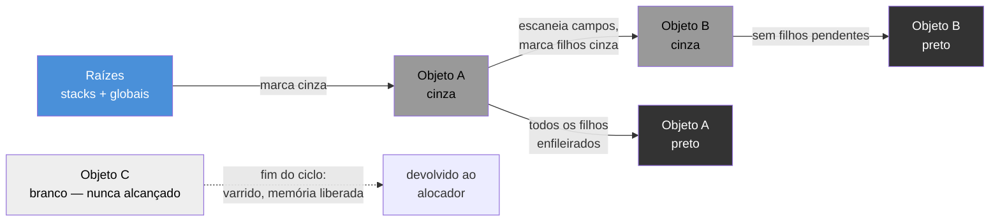
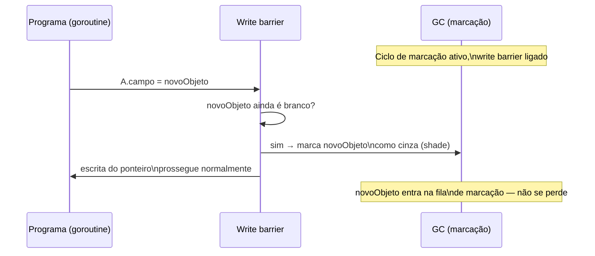

# O garbage collector

> [!abstract] TL;DR
> O GC de Go é **concurrent, tri-color, mark-sweep, non-generational** — desenhado desde o dia zero para um objetivo único: **latência baixa e previsível**, não throughput máximo. A fase de marcação roda **junto com o programa**, usando um **write barrier** para não perder objetos que o programa move enquanto o GC olha para o outro lado; a única pausa *stop-the-world* real dura microssegundos, não milissegundos, e não cresce com o tamanho do heap. O preço dessa escolha é CPU: o GC de Go gasta mais ciclos de processador reescaneando o heap inteiro a cada ciclo do que um coletor geracional da JVM, que economiza trabalho assumindo que "a maioria dos objetos morre jovem". Go troca throughput por previsibilidade — decisão coerente com o público-alvo da linguagem: servidores de rede que não podem congelar por centenas de milissegundos no meio de uma resposta.

## O problema que motivou o design

Imagine um servidor HTTP em Go atendendo milhares de requisições por segundo, cada uma alocando um punhado de objetos temporários — um `struct` de resposta aqui, uma `slice` de bytes ali. Em algum momento, a memória alocada e não mais referenciada precisa voltar para o sistema. Alguém tem que varrer o heap, achar o que está vivo, liberar o que não está.

A pergunta de design não é "como fazer isso" — todo runtime com coleta automática de lixo resolve essa parte. A pergunta que separa os GCs de verdade é: **o programa para de rodar enquanto isso acontece, e por quanto tempo?**

Um GC ingênuo — *stop-the-world mark-sweep* — para o mundo inteiro, varre tudo, e só então deixa o programa continuar. Simples de implementar, catastrófico para latência: se o heap tem alguns gigabytes, essa pausa pode passar de centenas de milissegundos. Para um servidor respondendo requisições em tempo real, isso é uma requisição perdida, um timeout, um usuário vendo a rodinha girar. JVMs mais antigas com coletores simples (como o *Serial* ou o *Parallel* sob carga pesada) sofreram exatamente com isso — e décadas de pesquisa em coleta de lixo giram em torno de reduzir essa pausa sem quebrar a correção do programa.

Go entrou nesse jogo em 2015, com o GC concorrente introduzido no Go 1.5, já mirando um alvo específico: pausas na casa de **microssegundos**, não milissegundos, independente do tamanho do heap. Não é otimização incremental de um design antigo — é a razão de existir do design atual, documentada pela equipe do runtime no [design doc do GC concorrente](https://go.dev/blog/go15gc) e refinada em posts posteriores como o [Getting to Go: The Journey of Go's Garbage Collector](https://go.dev/blog/ismmkeynote).

## Tri-color mark-sweep: a estrutura básica

O algoritmo de marcação usa três "cores" para rastrear o estado de cada objeto durante a varredura — uma abstração clássica da literatura de GC concorrente (Dijkstra et al., 1978), não invenção do Go, mas é o vocabulário que a documentação e o código-fonte do runtime usam o tempo todo.

- **Branco**: ainda não visitado pelo GC. No início do ciclo, todo objeto é branco — "presumido morto até prova em contrário".
- **Cinza**: visitado, mas seus ponteiros internos (campos que apontam para outros objetos) ainda não foram todos escaneados.
- **Preto**: visitado *e* todos os ponteiros que ele contém já foram enfileirados para visita.



O ciclo tem três fases lógicas:

1. **Mark setup** (STW curtíssimo): habilita o write barrier em todo o programa e enfileira as **raízes** — variáveis globais e o topo de cada stack de goroutine — como cinzas.
2. **Marking** (concorrente): o GC processa a fila de objetos cinza, escaneando os ponteiros de cada um e pintando os filhos de cinza, até que a fila esvazie e todo objeto alcançável esteja preto. Isso roda **enquanto o programa continua executando** — inclusive alocando memória nova e mutando ponteiros existentes.
3. **Mark termination** (STW curtíssimo): reconfere que não sobrou nada cinza, desliga o write barrier.
4. **Sweep** (concorrente, sob demanda): tudo que ainda é branco depois da marcação é, por definição, inalcançável — o *sweeper* devolve essa memória ao alocador, mas não de uma vez: cada alocação nova "paga" um pedaço da varredura (*lazy sweep*), espalhando o custo ao longo do tempo em vez de concentrá-lo numa pausa.

A pergunta óbvia é: se o programa continua rodando *durante* a marcação, como o GC evita perder um objeto que virou alcançável no meio do processo — ou pior, marcar como morto algo que uma goroutine acabou de referenciar? É exatamente aí que entra o write barrier.

## O write barrier: o cimento da concorrência

Considere este cenário, que é o problema central de qualquer GC concorrente: o GC já visitou e pintou de **preto** o objeto `A` (terminou de escanear seus ponteiros). Nesse instante, uma goroutine em execução paralela faz `A.campo = novoObjeto`, apontando `A` para um objeto `novoObjeto` que só existia, até então, alcançável a partir de um objeto ainda **branco** que ninguém mais referencia. Sem cuidado extra, `novoObjeto` fica "invisível" para o GC — preto não é revisitado, branco vai ser varrido no fim do ciclo — e o programa perde memória viva por engano. É a corrida clássica que a invariante tricolor precisa impedir: **um objeto preto nunca pode apontar diretamente para um objeto branco**.

O **write barrier** é o mecanismo que garante essa invariante. É um pequeno trecho de código que o compilador insere em *toda escrita de ponteiro* enquanto o GC está no meio de um ciclo de marcação — não uma trava de sistema operacional, mas instruções extras compiladas dentro do próprio binário.



Go usa, desde o Go 1.8, o **hybrid write barrier** — uma combinação do *Dijkstra write barrier* (colore o novo alvo do ponteiro) com o *Yuasa write barrier* (colore o valor antigo que estava lá antes da escrita). O híbrido existe por um motivo prático e específico do Go: o runtime precisa lidar com **stacks que crescem e são copiadas** (assunto da [[03 - A stack de uma goroutine|nota 03]] deste galho) sem precisar de write barrier sobre a stack em si — ler e escrever ponteiros locais de função é o caminho mais quente do programa, e instrumentá-lo destruiria a performance. O hybrid write barrier resolve isso: dá conta da correção sem exigir barreira nas escritas dentro da stack, só no heap. Foi essa mudança, junto com outras otimizações, que derrubou a pausa STW típica de "alguns milissegundos" (Go 1.5-1.7) para a casa dos **microssegundos** a partir do Go 1.8.

> [!info] Write barrier é ligado e desligado por ciclo
> O write barrier não fica ativo o tempo todo — teria custo de CPU permanente. Ele liga no início da fase de marcação (STW curtíssimo) e desliga em mark termination (outro STW curtíssimo). Fora de um ciclo de GC, escritas de ponteiro são "normais", sem instrumentação nenhuma.

## Por que o STW é tão curto

As únicas pausas *stop-the-world* de verdade no ciclo — mark setup e mark termination — não escalam com o tamanho do heap. Elas fazem trabalho de **coordenação**: parar todas as goroutines (via preempção do scheduler, assunto da [[02 - O scheduler GMP a fundo|nota 02]]), ligar/desligar o write barrier, confirmar que a fila de marcação esvaziou. Nada disso depende de quantos objetos existem no heap — é por isso que o runtime Go consegue prometer pausas na casa de microssegundos mesmo com heaps de dezenas de gigabytes, ao contrário de um coletor *fully stop-the-world* clássico, onde a pausa cresce linearmente (ou pior) com o volume de memória viva.

O trabalho que *de fato* escala com o heap — escanear e marcar cada objeto — é todo feito de forma **concorrente**, competindo por CPU junto com o código da aplicação. O runtime até usa parte das próprias goroutines da aplicação para ajudar: se uma goroutine aloca memória rápido demais enquanto o GC está atrasado, ela é convocada a fazer um pouco de trabalho de marcação antes de poder alocar mais — mecanismo chamado **mutator assist** (a goroutine da aplicação é o "mutator", termo clássico de GC para "quem muda o grafo de objetos enquanto o coletor observa"). É uma forma de contrapressão: em vez de deixar o heap crescer sem controle enquanto o GC não dá conta, o próprio alocador desacelera quem está alocando demais.

## Não-geracional: a escolha que mais separa Go da JVM

Aqui está o ponto de maior contraste com o mundo Java, e vale explicar o porquê — não é omissão, é decisão deliberada.

A maioria dos coletores modernos de linguagens gerenciadas (JVM com G1, ZGC, Shenandoah; .NET; V8) é **geracional**: parte da premissa empírica de que a maioria dos objetos morre jovem (*generational hypothesis*). Por isso, dividem o heap em gerações — uma **jovem** (*young generation*), onde a maior parte das alocações acontece e é coletada com frequência e barato, e uma **velha** (*old generation*), varrida raramente, porque o que sobrevive a algumas coletas jovens tende a viver muito. Isso reduz drasticamente o trabalho total do GC: em vez de reescanear o heap inteiro a cada ciclo, o coletor escaneia só a fatia pequena e barata na maior parte do tempo.

O GC de Go **não faz isso**. É um único heap, uma única "geração", varrida por inteiro a cada ciclo de marcação. A equipe do Go considerou GC geracional nos anos iniciais e decidiu não seguir esse caminho — por uma razão estrutural, não de preguiça: mover objetos entre gerações (*copying/compacting*) exige atualizar todos os ponteiros que apontam para o objeto movido, o que em Go significa lidar com **ponteiros para o meio de structs**, **conversões `unsafe.Pointer`** e chamadas para código C via cgo — casos em que o GC não pode simplesmente mover memória e corrigir referências como faz um coletor compactante. A JVM não tem esse problema porque nunca expôs ponteiros brutos ao programador; Go expõe (`unsafe.Pointer`, ponteiros para campos internos), e isso fecha a porta para mover objetos livremente.

| | Go (mark-sweep concorrente) | JVM típica (G1/geracional) |
|---|---|---|
| Estrutura do heap | única, não-geracional | jovem + velha (+ às vezes mais gerações) |
| Move objetos na memória? | não — heap não-compactante | sim — cópia entre gerações e compactação |
| Trabalho por ciclo | reescaneia heap alcançável inteiro | normalmente só a geração jovem |
| Pausa STW | microssegundos, quase constante | variável — G1 mira alvos configuráveis (ex. 200ms), ZGC/Shenandoah também miram sub-ms |
| Custo de CPU | mais alto (retrabalho a cada ciclo) | mais baixo em média (aproveita a hipótese geracional) |
| Ajuste principal | `GOGC` / `GOMEMLIMIT` | dezenas de flags de heap/geração |

Não é que a JVM seja "pior" — coletores modernos como ZGC e Shenandoah também chegam a pausas sub-milissegundo, inclusive sendo geracionais nas versões mais recentes. A diferença é de filosofia de simplicidade: Go aceita gastar mais CPU total, de forma consistente e previsível, para manter o coletor **mais simples de raciocinar** e sem necessidade de dezenas de flags de tuning — o padrão de fábrica já entrega baixa latência para a esmagadora maioria dos programas, sem exigir engenharia de GC como especialidade separada.

> [!question]- Se o GC de Go não move objetos, ele não sofre com fragmentação de heap?
> Sofre, em algum grau — é o preço de não compactar. O alocador de Go mitiga isso organizando alocações por **classes de tamanho** (*size classes*): objetos de tamanhos parecidos são agrupados em páginas dedicadas, então a fragmentação fica contida dentro de cada classe, não espalhada pelo heap inteiro. Não elimina o problema, mas o mantém administrável sem precisar de compactação ativa.

## Casos práticos

Nenhum desses exemplos "chama o GC" — a interação de código de aplicação com o coletor em Go é quase sempre indireta. Isso por si só já é um dado de design: escrever Go correto não deveria exigir pensar em GC linha a linha.

**1. Observando o ciclo do GC em tempo real**, com `runtime.ReadMemStats`:

```go
package main

import (
	"fmt"
	"runtime"
)

func main() {
	var m runtime.MemStats

	// aloca bastante lixo de propósito, pra dar trabalho ao GC
	for i := 0; i < 2_000_000; i++ {
		_ = make([]byte, 128)
	}

	runtime.ReadMemStats(&m)
	fmt.Printf("ciclos de GC completados: %d\n", m.NumGC)
	fmt.Printf("tempo total pausado (STW), em ns: %d\n", m.PauseTotalNs)
	fmt.Printf("bytes alocados atualmente: %d\n", m.HeapAlloc)
}
```

`PauseTotalNs` é a soma de **todas** as pausas STW desde que o processo começou — em programas normais, esse número cresce em nanossegundos e microssegundos por ciclo, não em milissegundos, mesmo depois de milhões de alocações.

**2. Forçando um ciclo de GC manualmente**, útil sobretudo em benchmarks e testes, quase nunca em código de produção:

```go
package main

import "runtime"

func main() {
	// ... trabalho que gera lixo ...

	runtime.GC() // bloqueia até um ciclo completo de coleta terminar
}
```

> [!warning] `runtime.GC()` é síncrono e caro — não chame em hot path
> `runtime.GC()` força um ciclo completo (não incremental) e só retorna quando ele termina. É uma ferramenta de diagnóstico e benchmark, não algo para chamar depois de cada requisição HTTP "pra garantir que a memória foi liberada" — isso ativamente piora a latência que o GC concorrente foi desenhado para preservar.

**3. Escutando eventos de GC via `debug.SetGCPercent`/trace**, para observabilidade em produção:

```go
package main

import (
	"fmt"
	"runtime/debug"
)

func main() {
	// GOGC=100 é o default: próximo ciclo dispara quando
	// o heap dobrar de tamanho em relação ao pós-coleta anterior
	antigo := debug.SetGCPercent(50) // GC mais agressivo: dispara com +50% de crescimento
	fmt.Println("GOGC anterior:", antigo)
}
```

> [!info] `GOGC` e `GOMEMLIMIT` (Go 1.19+) são o ajuste fino real
> `GOGC` controla a frequência de ciclos em função do crescimento do heap; `GOMEMLIMIT`, introduzido no **Go 1.19**, impõe um teto **absoluto** de memória, útil sobretudo em containers com limite de memória fixo (Kubernetes, por exemplo), onde crescer o heap "até dobrar" pode estourar o cgroup antes do GC agir. Tuning detalhado desses dois — quando usar cada um, como combiná-los — é o assunto inteiro da próxima nota.

## Armadilhas comuns

> [!warning] "GC concorrente" não significa "sem custo de CPU"
> O trabalho de marcação concorrente ainda consome ciclos de processador — só não *bloqueia* o programa fazendo isso. Em cargas com alocação intensa, o GC pode consumir uma fatia relevante da CPU disponível (o runtime tenta manter isso perto de 25% da capacidade da máquina, por padrão). "Baixa latência" não é sinônimo de "grátis" — é uma troca deliberada de CPU por previsibilidade.

> [!warning] Confundir pausa STW com "tempo total gasto em GC"
> `m.PauseTotalNs` mede só as pausas *stop-the-world* — não o tempo que o GC passou rodando concorrentemente junto com o programa. Um programa pode ter STW irrisório e ainda assim gastar uma fatia grande de CPU total em trabalho de GC concorrente. Para medir o impacto real, `runtime/trace` ou o campo `GCCPUFraction` de `MemStats` dão o quadro completo — pausas curtas não implicam GC barato.

> [!warning] Heap não-compactante não é "sem fragmentação nenhuma"
> É tentador assumir que, por não haver movimentação de objetos, o GC de Go elimina qualquer preocupação com layout de memória. Não elimina — só desloca o problema para as *size classes* do alocador. Em cargas com muitos objetos de tamanhos muito variados e vida útil imprevisível, fragmentação ainda é uma variável real de performance.

## Vindo de Java

| Conceito | Java (JVM, G1 default) | Go |
|---|---|---|
| Modelo de heap | geracional (jovem/velha) | único, não-geracional |
| Move/compacta objetos? | sim | não |
| Pausa STW típica | alvo configurável (ex. 200ms no G1; sub-ms no ZGC/Shenandoah) | microssegundos, quase invariável ao heap |
| Mecanismo de correção durante coleta concorrente | *SATB* (snapshot-at-the-beginning) no G1 | write barrier híbrido (Dijkstra + Yuasa) |
| Superfície de tuning | dezenas de flags (`-XX:...`) | essencialmente `GOGC` e `GOMEMLIMIT` |
| Ponteiros brutos do programador | não existem | `unsafe.Pointer` existe — trava a possibilidade de mover objetos |

A intuição de quem vem de Java tende a ser "todo GC moderno é geracional, então Go deve ser também" — e é exatamente aí que a suposição falha. Go escolheu simplicidade e previsibilidade de pausa em troca de throughput, uma opção estrutural que a exposição de ponteiros brutos ao programador (algo que a JVM nunca permitiu) tornou tecnicamente necessária, não só estilística.

## Como explicar em inglês

> Go's garbage collector is a **concurrent, tri-color, mark-and-sweep, non-generational** collector, purpose-built to minimize stop-the-world pause times rather than maximize throughput. Marking happens concurrently with the running program, using a **hybrid write barrier** (combining Dijkstra and Yuasa barriers) to preserve the tricolor invariant — a black object must never point directly to a white one — even as the mutator rewrites pointers mid-cycle. The only real STW pauses, mark setup and mark termination, do pure coordination work and stay in the microsecond range regardless of heap size, because the heap-proportional work (scanning and marking) all happens concurrently. Unlike the JVM's generational collectors, which exploit the "objects mostly die young" heuristic to scan only a small young generation most of the time, Go's collector rescans the entire live heap every cycle and never moves objects — a direct consequence of exposing raw pointers (`unsafe.Pointer`) to the programmer, which forecloses safe object relocation. The trade-off is explicit: Go spends more CPU overall in exchange for pause-time predictability that needs almost no tuning knobs beyond `GOGC` and `GOMEMLIMIT`.

| Termo PT | Termo EN |
|---|---|
| coletor de lixo concorrente | concurrent garbage collector |
| marca e varre (tri-color) | tri-color mark-and-sweep |
| barreira de escrita | write barrier |
| pausa total do mundo | stop-the-world (STW) pause |
| invariante tricolor | tricolor invariant |
| geracional / não-geracional | generational / non-generational |
| mutador (programa em execução) | mutator |
| assistência do mutador | mutator assist |
| compactação de heap | heap compaction |
| classe de tamanho | size class |

## O que vem a seguir

Entender o mecanismo do GC — tri-color, write barrier, ausência de gerações — é a metade teórica. A metade prática é saber **operar** esse coletor em produção: como `GOGC` e `GOMEMLIMIT` interagem, quando reduzir a frequência de ciclos custa mais do que economiza CPU, como ler `runtime/trace` para diagnosticar um GC que está competindo demais por CPU com a aplicação, e os erros comuns de quem tenta "ajustar o GC" sem medir antes. A [[06 - Tuning do GC|próxima nota]] entra nesse tuning a fundo.

## Veja também

- [[01 - O runtime Go por baixo]] — visão geral do runtime onde o GC se encaixa como um dos subsistemas
- [[02 - O scheduler GMP a fundo]] — como o GC preempta e coordena goroutines para os STWs curtíssimos
- [[03 - A stack de uma goroutine]] — por que stacks que crescem/copiam motivaram o hybrid write barrier
- [[04 - Escape analysis]] — o que decide, antes de qualquer coleta acontecer, se um objeto vai parar no heap que o GC gerencia
- [[06 - Tuning do GC]] — próxima nota: `GOGC`, `GOMEMLIMIT` e diagnóstico prático
- [[03-Dominios/Tecnologia/Go/index|Trilha Go]]

## Fontes

- The Go Authors. *Getting to Go: The Journey of Go's Garbage Collector*. go.dev/blog. https://go.dev/blog/ismmkeynote (acessado em 2026-07-18)
- Rick Hudson. *Go GC: Prioritizing low latency and simplicity*. go.dev/blog. https://go.dev/blog/go15gc (acessado em 2026-07-18)
- The Go Authors. *Package runtime — GOGC, GOMEMLIMIT and MemStats*. pkg.go.dev. https://pkg.go.dev/runtime#hdr-Environment_Variables (acessado em 2026-07-18)
- The Go Authors. *Package runtime/debug*. pkg.go.dev. https://pkg.go.dev/runtime/debug (acessado em 2026-07-18)
- The Go Authors. *A Guide to the Go Garbage Collector*. go.dev/doc. https://go.dev/doc/gc-guide (acessado em 2026-07-18)
