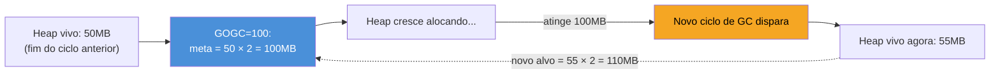
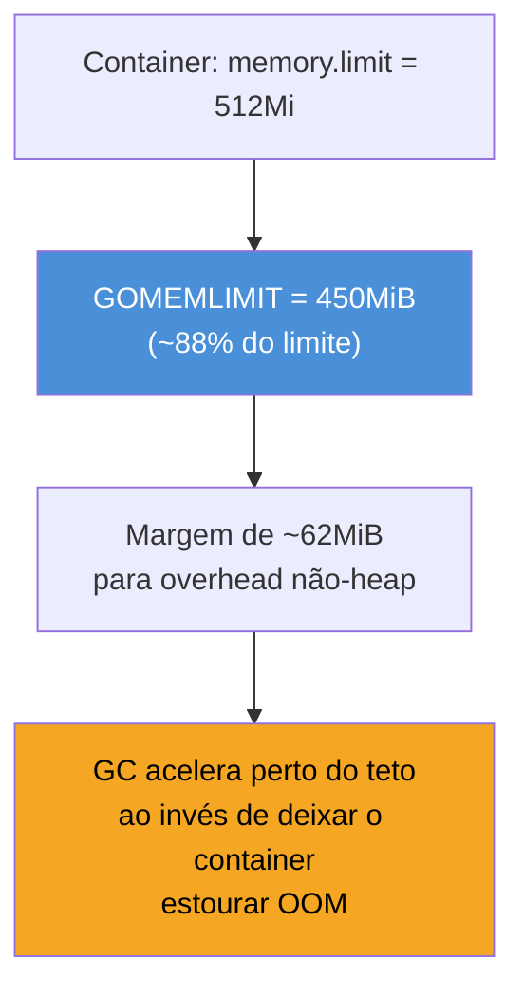
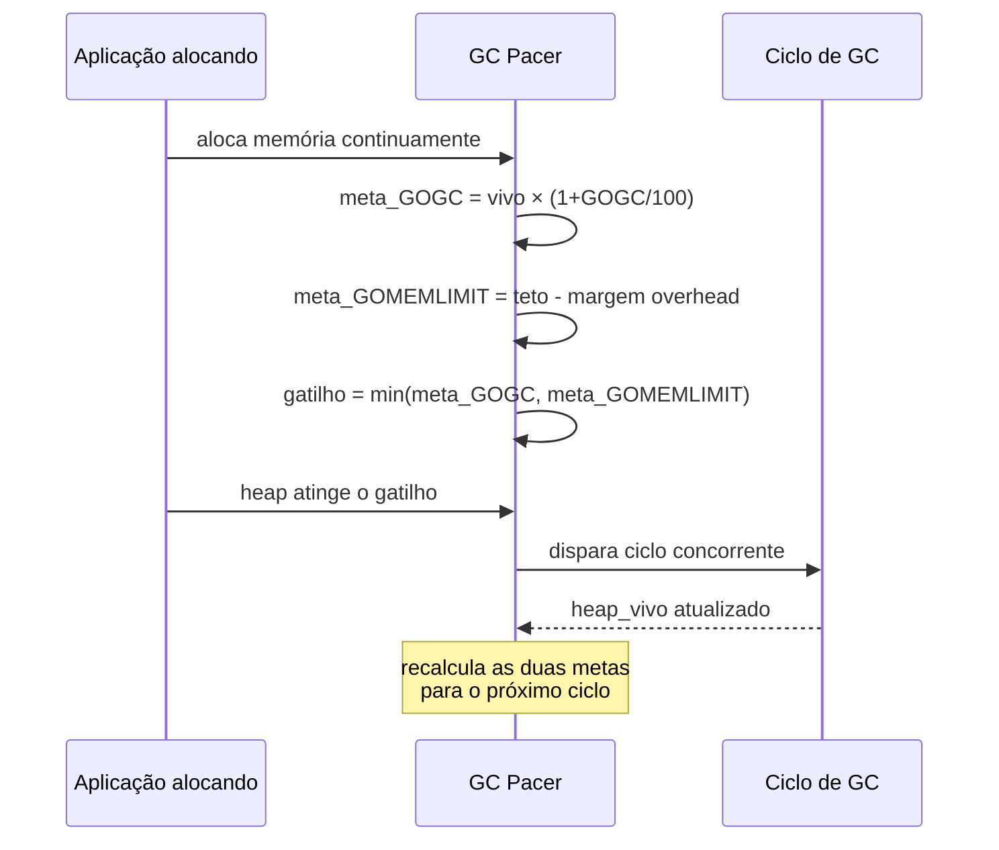

# Tuning do GC

> [!abstract] TL;DR
> O GC concorrente de Go (nota anterior) roda sozinho — mas duas variáveis controlam **quando** ele dispara: `GOGC` (padrão 100) diz "deixe o heap dobrar antes de coletar de novo", trocando CPU por memória; `GOMEMLIMIT` (Go 1.19+) impõe um teto absoluto de memória, forçando coletas mais agressivas se necessário para nunca estourar o limite — essencial em container com `memory.limit` do cgroup. `GODEBUG=gctrace=1` expõe cada ciclo em uma linha de log: quanto heap, quanto CPU, quanto tempo de pausa. A regra prática: **não mexa em nada até medir** — a maioria dos serviços Go roda bem com os defaults; tuning entra quando `gctrace` mostra CPU alta demais gasta em GC (baixe agressividade, suba `GOGC`) ou memória batendo no limite do container (baixe `GOGC` ou trave com `GOMEMLIMIT`).

## O problema que motiva isto

Sua aplicação Go roda dentro de um pod Kubernetes com `resources.limits.memory: 512Mi`. Ela processa uma fila, aloca bastante lixo por request — e um dia o pod morre com `OOMKilled`. Você olha o heap com `pprof` (galho 16) e não vê vazamento: os objetos são coletados, só que **tarde demais** — o heap cresce até estourar o limite do container antes que o GC decida agir.

Por outro lado, talvez o problema seja o oposto: seu serviço tem memória de sobra, mas o profiler de CPU mostra 15% do tempo gasto em `runtime.gcBgMarkWorker` — o GC está rodando com uma frequência que a aplicação não precisa, roubando ciclos de CPU que poderiam processar mais requests.

Os dois cenários têm a mesma causa raiz: o GC de Go, por padrão, decide **quando** coletar usando uma única heurística — o tamanho do heap dobrar — sem saber nada sobre o limite de memória do seu container nem sobre quanto CPU sobra. `GOGC` e `GOMEMLIMIT` são os dois botões que ajustam essa heurística para a realidade do seu ambiente.

## GOGC: o trade-off CPU vs memória

A nota anterior descreveu o *pacing* do GC de forma qualitativa. Aqui está a fórmula real, documentada no [pacote `runtime`](https://pkg.go.dev/runtime#hdr-Environment_Variables): o GC dispara um novo ciclo quando

```
heap_atual = heap_ao_fim_do_ciclo_anterior × (1 + GOGC/100)
```

Com `GOGC=100` (o padrão), o heap pode **dobrar** — crescer 100% além do que sobrou vivo depois da última coleta — antes do próximo ciclo começar. Se seu heap ficou em 50 MB de dados vivos após uma coleta, o próximo ciclo só dispara quando o heap alcançar ~100 MB.



O trade-off é direto e vale internalizar como uma régua:

| GOGC | Efeito | Quando faz sentido |
|---|---|---|
| Alto (ex.: 400) | Heap cresce mais antes de coletar → **menos ciclos de GC → menos CPU** gasta em GC, mas pico de memória maior | CPU é o gargalo, memória sobra (batch jobs, workers com limite de memória alto) |
| 100 (padrão) | Meio-termo — heap dobra a cada ciclo | Serviço genérico sem perfil de recurso especial |
| Baixo (ex.: 50) | Coleta mais cedo, heap fica menor → **menos memória de pico**, mas mais ciclos → mais CPU em GC | Memória é escassa/cara (container pequeno), CPU sobra |
| `off` (via `debug.SetGCPercent(-1)`) | Desliga o GC por porcentagem inteiramente | Programas de vida curta (CLIs, scripts) onde o SO libera tudo ao sair — nunca em serviço de longa duração |

Ajustar em runtime via variável de ambiente:

```bash
GOGC=200 ./meu-servico   # tolera heap dobrar até 3x antes de coletar — menos CPU em GC
```

Ou programaticamente, via [`runtime/debug.SetGCPercent`](https://pkg.go.dev/runtime/debug#SetGCPercent):

```go
import "runtime/debug"

func main() {
    debug.SetGCPercent(200) // equivalente a GOGC=200, mas ajustável em tempo de execução
    // ...
}
```

> [!warning] GOGC alto sem teto de memória é uma aposta perigosa em produção
> Subir `GOGC` para 400 reduz CPU em GC — mas o heap agora pode crescer até 5x o tamanho dos dados vivos antes de qualquer coleta. Se a carga de tráfego picar, esse pico de alocação pode facilmente estourar o limite de memória do container, resultando em `OOMKilled` sem aviso — o GC nunca teve chance de agir a tempo, porque sua meta (baseada só em `GOGC`) não sabia que havia um teto físico. É exatamente esse buraco que `GOMEMLIMIT` fecha.

## GOMEMLIMIT: o teto absoluto (Go 1.19+)

> [!info] `GOMEMLIMIT` é recente — chegou no Go 1.19 (agosto de 2022)
> Antes disso, a única alavanca era `GOGC` — uma heurística *relativa* ao heap vivo, sem noção nenhuma de quanto de memória física existe disponível. Times rodando Go em Kubernetes tocavam `GOGC` manualmente, quase sempre baixo demais "pra garantir", pagando CPU extra o tempo todo como seguro contra OOM. O [`runtime/debug.SetMemoryLimit`](https://pkg.go.dev/runtime/debug#SetMemoryLimit) e a variável `GOMEMLIMIT` resolveram isso: agora dá para dizer ao runtime, em termos absolutos, "não passe deste tanto de memória", e deixar o GC decidir a agressividade sozinho para respeitar esse teto.

`GOMEMLIMIT` define um limite de *soft memory* — o total de memória (heap + stacks + metadados do runtime) que o processo tenta não ultrapassar. Quando o heap se aproxima desse teto, o GC passa a coletar **mais cedo e com mais frequência do que `GOGC` sozinho pediria** — na prática, o runtime trata o menor entre "meta do GOGC" e "quase no GOMEMLIMIT" como gatilho.

```go
package main

import (
    "runtime/debug"
)

func main() {
    // 450 MiB — deixa margem sob um limite de container de 512Mi
    debug.SetMemoryLimit(450 << 20)
    // ...
}
```

Ou via variável de ambiente, com sufixos de unidade (`B`, `KiB`, `MiB`, `GiB`):

```bash
GOMEMLIMIT=450MiB ./meu-servico
```

O caso de uso canônico é exatamente o cenário de abertura: container com limite de memória do cgroup (`resources.limits.memory` no Kubernetes). A recomendação da própria documentação do Go é reservar uma margem — não configurar `GOMEMLIMIT` igual ao limite do container, porque memória fora do heap Go (stacks de threads do SO, buffers de rede, overhead do runtime) também consome esse orçamento:



> [!warning] GOMEMLIMIT sozinho, sem GOGC, não é "desligar o GC até o limite"
> Um erro comum: configurar só `GOMEMLIMIT` e achar que o GC vai ficar ocioso até chegar perto do teto, maximizando throughput o tempo todo. Na prática, os dois mecanismos coexistem — `GOGC=100` continua disparando ciclos normalmente pela heurística de dobrar o heap; `GOMEMLIMIT` é um **teto adicional de segurança**, não substituto. Para deixar o heap crescer livremente até perto do limite (maximizando o tempo entre coletas), é preciso subir `GOGC` também — por exemplo, `GOGC=400` combinado com `GOMEMLIMIT=450MiB`, deixando o `GOGC` alto governar o caso comum e o `GOMEMLIMIT` intervir só quando a memória aperta.

> [!warning] GOMEMLIMIT não é hard limit do SO — é um alvo do GC
> Se a aplicação genuinamente precisa de mais memória viva do que o `GOMEMLIMIT` configurado (não é lixo, são dados que o programa está de fato usando), o GC vai rodar continuamente tentando (e falhando) em ficar abaixo do teto — consumindo 100% de um núcleo de CPU em coleta sem conseguir baixar a memória, porque não há lixo suficiente para coletar. Isso é conhecido como *GC thrashing*. `GOMEMLIMIT` protege contra picos temporários e vazamentos lentos — não é substituto para dimensionar corretamente o limite do container.

## GC pacing: como os dois se combinam

*Pacing* é o nome que o runtime dá ao algoritmo que decide, em tempo real, quando iniciar o próximo ciclo de coleta — e ele leva em conta as duas variáveis ao mesmo tempo. Simplificando o [design doc oficial](https://go.dev/doc/gc-guide), o pacer calcula duas metas de heap-size e usa a **menor**:

1. **Meta por GOGC**: `heap_vivo × (1 + GOGC/100)` — a fórmula de crescimento relativo já vista.
2. **Meta por GOMEMLIMIT**: um valor que deixa margem para o heap não ultrapassar o teto absoluto, considerando também o overhead estimado fora do heap.



Isso explica um comportamento que confunde quem só olha `GOGC` isoladamente: perto do `GOMEMLIMIT`, o GC pode disparar **bem antes** do heap dobrar — porque a meta por memória ficou menor que a meta por `GOGC` naquele momento. É o mecanismo funcionando como projetado, não um bug.

Há ainda uma válvula de segurança extra: se mesmo coletando agressivamente o heap continuar subindo rumo ao `GOMEMLIMIT` (sinal de que o problema é alocação genuína, não lixo acumulado), o runtime pode limitar o paralelismo dos *mutators* (as goroutines da aplicação) para dar mais tempo de CPU ao GC — o preço de manter a promessa do limite de memória é aceitar throughput menor num momento de aperto real.

## GODEBUG=gctrace: observando o GC em produção

Antes de tocar em qualquer uma das duas variáveis, a pergunta certa é: **o que o GC está fazendo agora?** `GODEBUG=gctrace=1` responde isso, imprimindo uma linha em `stderr` a cada ciclo de coleta, sem precisar instrumentar nada no código:

```bash
GODEBUG=gctrace=1 ./meu-servico
```

Uma linha típica de saída:

```
gc 14 @6.032s 2%: 0.021+1.9+0.083 ms clock, 0.17+0.42/2.1/3.3+0.66 ms cpu, 4->6->3 MB, 5 MB goal, 8 P
```

Os campos que valem decorar, na ordem em que aparecem:

| Campo | Significado |
|---|---|
| `gc 14` | número sequencial deste ciclo de GC desde o início do processo |
| `@6.032s` | tempo decorrido desde o início do programa |
| `2%` | percentual de tempo de CPU gasto em GC desde o início do processo — **o número mais importante para decidir se vale subir GOGC** |
| `0.021+1.9+0.083 ms clock` | tempo de parede das três fases: STW de setup, marcação concorrente, STW de finalização |
| `4->6->3 MB` | heap no início do ciclo → pico durante o ciclo → heap vivo ao final (esse último valor é a base do próximo cálculo de meta) |
| `5 MB goal` | a meta calculada pelo pacer para este ciclo — compare com o heap real para ver se `GOMEMLIMIT` está apertando |
| `8 P` | número de Ps (do modelo GMP, [[02 - O scheduler GMP a fundo|nota 02]]) disponíveis para o trabalho de GC |

Ler essa saída em produção (redirecionada para um coletor de logs, nunca deixada solta em `stdout` de um serviço real) é o jeito mais barato de responder às duas perguntas que motivam tuning:

- **"Estou gastando CPU demais em GC?"** — olhe a série de percentuais (`2%`, `3%`, `2%`...). Acima de ~10-15% sustentado geralmente indica heap crescendo rápido demais para o `GOGC` atual — candidato a subir `GOGC` (se memória permitir) ou reduzir alocação (nota anterior sobre escape analysis).
- **"Estou perto do limite de memória?"** — compare a coluna `->` com seu `GOMEMLIMIT`. Se o pico regularmente encosta no teto, o pacer está trabalhando no limite — considere se o próprio `GOMEMLIMIT` está baixo demais para a carga real, ou se há alocação que pode ser reduzida.

> [!info] Runtime metrics programáticas: pacote `runtime/metrics`
> Para expor esses números via Prometheus/OpenTelemetry em vez de ler `stderr` manualmente, o pacote [`runtime/metrics`](https://pkg.go.dev/runtime/metrics) (estável desde Go 1.16) expõe as mesmas informações — `/gc/heap/live:bytes`, `/gc/cycles/total:gc-cycles`, `/memory/classes/...` — como séries numéricas, prontas para um scraper. É o caminho recomendado para observabilidade contínua; `gctrace` é melhor para depuração pontual ou investigação ad-hoc.

## Antes de 1.19: o truque do "memory ballast"

Vale conhecer a solução que a comunidade usava antes de `GOMEMLIMIT` existir, porque ela aparece em código legado e ajuda a entender por que a feature foi tão bem recebida. Sem um teto absoluto, times que precisavam de heaps grandes com poucas coletas recorriam a um *memory ballast*: alocar deliberadamente um bloco grande e nunca liberá-lo, só para enganar a heurística do `GOGC`.

```go
// Padrão pré-1.19, hoje obsoleto — não reproduzir em código novo.
var ballast = make([]byte, 10<<30) // 10 GiB "fantasma", nunca usado de verdade
```

Como esse slice de 10 GiB conta como heap vivo, a fórmula `heap_vivo × (1 + GOGC/100)` passa a operar sobre uma base artificialmente alta — o GC efetivamente para de disparar até a aplicação alocar dezenas de gigabytes de dados reais por cima do lastro. A técnica funcionava, mas era frágil: o valor do ballast tinha que ser recalculado manualmente para cada ambiente, escalava mal com múltiplas réplicas de tamanhos diferentes, e não protegia contra nada — só adiava o problema, sem o teto de segurança que `GOMEMLIMIT` oferece nativamente. O [design doc do GOMEMLIMIT](https://go.dev/doc/gc-guide) cita esse padrão explicitamente como uma das motivações da feature: dar ao runtime, de forma nativa e sem gambiarra, a mesma flexibilidade que o ballast tentava simular às cegas.

## Casos práticos

**1. Diagnosticando com gctrace antes de tocar em qualquer variável** — sempre o primeiro passo:

```bash
GODEBUG=gctrace=1 ./api-server 2> gc.log

# depois, inspecionar:
tail -f gc.log
# gc 101 @340.2s 1%: 0.02+0.8+0.05 ms clock, ... 40->42->18 MB, 36 MB goal, 4 P
# gc 102 @341.9s 1%: 0.02+0.9+0.04 ms clock, ... 18->20->19 MB, 38 MB goal, 4 P
```

Aqui o percentual de CPU está baixo (1%) e o heap está estável — não há motivo para tuning. Esse é o caso comum: **a maioria dos serviços Go nunca precisa tocar em GOGC ou GOMEMLIMIT**.

**2. Container com memória apertada, `GOGC` sozinho não é suficiente**:

```go
package main

import (
    "log/slog"
    "os"
    "runtime/debug"
)

func main() {
    logger := slog.New(slog.NewJSONHandler(os.Stdout, nil))

    // Container com limite de 512Mi — reserva margem para
    // stacks de threads do SO e overhead do runtime.
    limit := 450 << 20 // 450 MiB
    debug.SetMemoryLimit(int64(limit))
    logger.Info("gc memory limit configurado", "limit_mib", limit>>20)

    // GOGC continua no padrão (100) — GOMEMLIMIT age só
    // como teto de segurança quando o heap aperta.
    run()
}

func run() { /* ... */ }
```

**3. Job batch de vida curta, priorizando throughput sobre memória de pico** (cenário oposto — CPU é o recurso escasso):

```go
package main

import "runtime/debug"

func main() {
    // Este processo roda sozinho numa máquina dedicada por alguns
    // minutos e depois termina — memória de pico não importa,
    // throughput sim. GOGC alto reduz a frequência de coleta.
    debug.SetGCPercent(400)

    processarLoteGrande()
}

func processarLoteGrande() { /* ... */ }
```

**4. Combinando as duas variáveis via ambiente, sem tocar em código** — a forma mais comum em produção, configurada no manifesto do deployment:

```yaml
# trecho de um Deployment Kubernetes
env:
  - name: GOGC
    value: "150"
  - name: GOMEMLIMIT
    value: "900MiB"
resources:
  limits:
    memory: "1Gi"
```

`GOGC=150` deixa o heap crescer até 2.5x antes de coletar (menos CPU que o padrão), e `GOMEMLIMIT=900MiB` garante que, mesmo numa carga atípica, o GC intervenha antes de bater no limite físico de `1Gi` do container.

**5. Interpretando um `gctrace` que pede ação** — o cenário inverso do caso 1, onde a leitura do log de fato justifica mexer em algo:

```
gc 340 @1200.5s 18%: 0.03+12.4+0.09 ms clock, 0.24+8.1/24.8/30.2+0.72 ms cpu, 380->410->395 MB, 400 MB goal, 8 P
gc 341 @1201.9s 19%: 0.03+13.1+0.08 ms clock, 0.24+8.4/25.1/31.0+0.71 ms cpu, 395->420->402 MB, 402 MB goal, 8 P
```

Dois sinais lidos juntos: o percentual de CPU (`18%`, `19%`) está bem acima do 1-2% saudável do caso 1, **e** o heap vivo ao final de cada ciclo (`395 MB`, `402 MB`) está subindo de ciclo a ciclo, não estabilizando. O primeiro sinal, isolado, sugeriria só "suba GOGC". O segundo, junto, muda o diagnóstico: o heap crescendo persistentemente é característica de vazamento (ou de um pico de carga genuíno), não de coleta ineficiente — nesse caso a ação certa é investigar com `pprof` (heap profile, galho 16) *antes* de qualquer tuning de variável, porque nenhuma combinação de `GOGC`/`GOMEMLIMIT` resolve memória que nunca é liberada — só adia o `OOMKilled` por mais alguns ciclos.

## Quando (não) ajustar

A régua prática, na ordem em que vale aplicá-la:

1. **Rode com o padrão primeiro.** `GOGC=100` sem `GOMEMLIMIT` é um ponto de partida razoável para a esmagadora maioria dos serviços.
2. **Meça antes de mexer.** `GODEBUG=gctrace` ou `runtime/metrics` em produção — nunca ajuste "no escuro" baseado em intuição sobre o que "deveria" estar acontecendo.
3. **Se roda em container com limite de memória, configure `GOMEMLIMIT`.** Isso é quase sempre uma boa ideia independentemente de haver problema — é uma rede de segurança contra OOM barata de configurar, com margem de ~10-15% abaixo do limite do cgroup.
4. **Só suba `GOGC` se o percentual de CPU em GC for alto E houver memória de sobra** para absorver um heap de pico maior.
5. **Só desça `GOGC` se a memória for o recurso apertado** e o `GOMEMLIMIT` sozinho não bastar (ex.: quer evitar até picos temporários, não só o OOM).

> [!warning] Tuning de GC não substitui reduzir alocação
> `GOGC` e `GOMEMLIMIT` mexem em **quando** o GC roda — não reduzem quanto lixo sua aplicação produz por request. Se `gctrace` mostra CPU alta em GC, a correção com maior alavancagem quase sempre é reduzir alocações no *hot path* (a [[04 - Escape analysis|nota 04]] deste galho mostra como) antes de compensar tocando nas variáveis de ambiente. Subir `GOGC` sem reduzir alocação só adia o problema para um heap maior — a mesma quantidade de lixo por segundo continua sendo produzida e eventualmente coletada.

## Vindo de outra linguagem

| Linguagem | Mecanismo equivalente |
|---|---|
| Java | `-Xmx` (heap máximo, hard) parece `GOMEMLIMIT`, mas a JVM tem múltiplos coletores (G1, ZGC, Shenandoah) com flags próprias por coletor; Go tem um único GC com duas alavancas simples |
| Node.js / V8 | `--max-old-space-size` é o análogo mais próximo de `GOMEMLIMIT` — teto de heap; V8 não expõe algo tão direto quanto `GOGC` para controlar a frequência relativa de coleta |
| Python (CPython) | `gc.set_threshold()` ajusta contagem de objetos entre coletas geracionais — mais parecido em espírito com `GOGC`, mas CPython soma reference counting por cima, um modelo bem diferente do tracing GC de Go |

A diferença mais marcante é a simplicidade: Go expõe **duas** variáveis (uma relativa, uma absoluta) em vez de um conjunto de flags específicas por algoritmo de coletor — reflexo de o runtime ter um único GC, tunável, mas não trocável por outro.

## Como explicar em inglês

> Go's GC exposes two knobs to control *when* a collection cycle fires. `GOGC` (default 100) is a relative target: the heap is allowed to grow by that percentage past the live-heap size from the last cycle before the next one triggers — higher values trade more memory for less GC CPU overhead, lower values do the opposite. `GOMEMLIMIT`, added in Go 1.19, is an absolute soft cap on total memory (heap plus runtime overhead); as usage approaches that limit, the GC's pacer collects more aggressively than `GOGC` alone would ask for, which is exactly what you want when running inside a container with a hard memory limit — it turns an eventual OOM kill into a proactive, earlier collection. The two mechanisms compose: the pacer computes a goal from each and always triggers on whichever is smaller. `GODEBUG=gctrace=1` is the cheapest way to observe this in production — one line per cycle showing CPU percentage spent in GC and the heap size before/peak/after — and it should always come before touching either variable, never after a guess.

| Termo PT | Termo EN |
|---|---|
| coleta de lixo | garbage collection |
| ciclo de GC | GC cycle |
| heap vivo | live heap |
| meta de heap | heap goal |
| ritmo / cadência do GC | GC pacing |
| teto de memória | memory limit |
| percentual de crescimento | growth percentage |
| overhead fora do heap | non-heap overhead |
| coleta agressiva | aggressive collection |
| esgotamento por thrashing | GC thrashing |

## O que vem a seguir

`GOGC` e `GOMEMLIMIT` controlam **quando** o GC roda, mas não tocam em uma pergunta mais sutil: quando múltiplas goroutines leem e escrevem a mesma memória sem sincronização explícita, o que exatamente é permitido enxergar? A [[07 - O memory model|próxima nota]] entra no *memory model* de Go — as garantias formais de *happens-before* que definem quando uma escrita numa goroutine fica visível para uma leitura em outra, e por que "funcionou no teste" não é prova de ausência de *data race*.

## Veja também

- [[05 - O garbage collector|05 — O garbage collector]] — mecanismo do GC concorrente tricolor que esta nota ajusta
- [[04 - Escape analysis|04 — Escape analysis]] — reduzir alocação no hot path, a alavanca de maior impacto antes de tunar GOGC
- [[02 - O scheduler GMP a fundo|02 — O scheduler GMP a fundo]] — os Ps citados na saída do gctrace
- [[07 - O memory model|07 — O memory model]] — próxima nota do galho
- [[03-Dominios/Tecnologia/Go/index|Trilha Go]]

## Fontes

- The Go Authors. *Package runtime — Environment Variables (GOGC, GOMEMLIMIT)*. pkg.go.dev. https://pkg.go.dev/runtime#hdr-Environment_Variables (acessado em 2026-07-18)
- The Go Authors. *Package runtime/debug — SetGCPercent, SetMemoryLimit*. pkg.go.dev. https://pkg.go.dev/runtime/debug (acessado em 2026-07-18)
- The Go Authors. *A Guide to the Go Garbage Collector*. go.dev. https://go.dev/doc/gc-guide (acessado em 2026-07-18)
- The Go Authors. *Package runtime/metrics*. pkg.go.dev. https://pkg.go.dev/runtime/metrics (acessado em 2026-07-18)
- The Go Blog. *Go 1.19 Release Notes — Soft memory limit*. go.dev. https://go.dev/doc/go1.19 (acessado em 2026-07-18)

