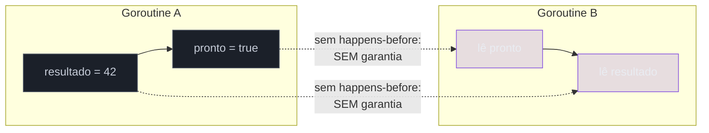
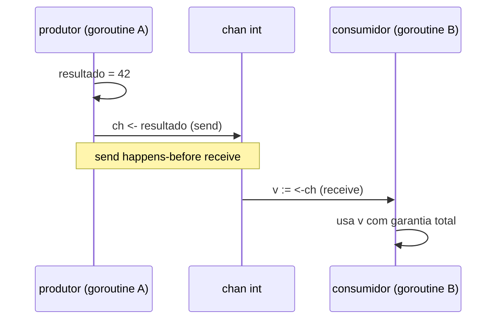
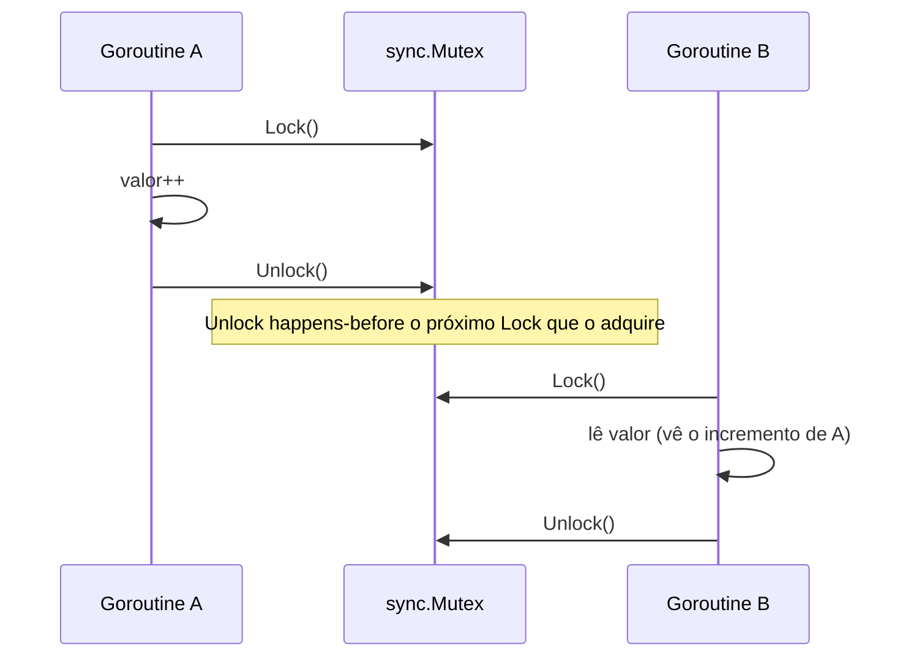
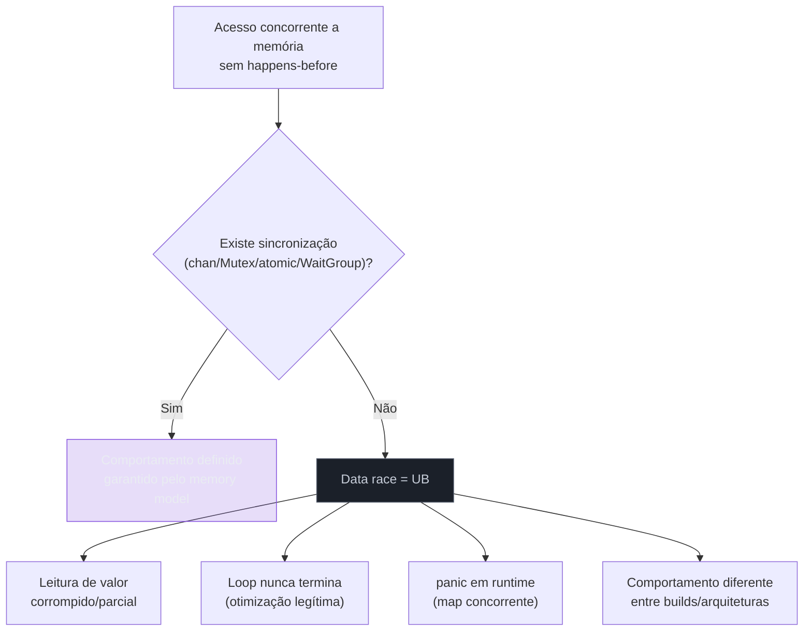

# O memory model

> [!abstract] TL;DR
> O **Go Memory Model** responde uma pergunta que só existe porque CPUs, compiladores e o runtime todos reordenam e cacheiam operações de memória por conta própria: "se a goroutine A escreve numa variável e a goroutine B lê essa variável, quando é que B tem **garantia** de enxergar o valor que A escreveu?" A resposta não é "sempre" — é uma relação formal chamada **happens-before**. Sem uma aresta happens-before explícita entre a escrita e a leitura, o compilador e o hardware têm licença para reordenar, e o resultado observado é indefinido. `chan`, `sync.Mutex`/`RWMutex`, `sync.WaitGroup` e o pacote `sync/atomic` são, cada um, uma forma diferente de **fabricar** essa aresta. Compartilhar memória sem nenhum desses mecanismos — a chamada **data race** — não é "provavelmente vai dar ruim": é **comportamento indefinido (UB)** pela definição formal do memory model, mesmo que o programa "pareça funcionar" em testes locais. O antídoto de projeto é o mantra oficial: *"Do not communicate by sharing memory; instead, share memory by communicating."*

## Por que "escrevi X, então devo ler X" não é garantia nenhuma

Imagine duas goroutines rodando ao mesmo tempo, sem nenhuma sincronização entre elas:

```go
var pronto bool
var resultado int

func produtor() {
    resultado = 42
    pronto = true
}

func consumidor() {
    for !pronto {
        // espera ativa
    }
    fmt.Println(resultado)
}
```

A intuição de quem vem de uma linguagem de thread única, ou mesmo de Java/C# com um modelo de memória que "já resolve isso sozinho" em certos casos, é: *"óbvio que quando `pronto` vira `true`, `resultado` já é 42 — a atribuição de `resultado` vem antes na ordem do código."* Essa intuição está certa **dentro de uma única goroutine** — Go garante que, vista de dentro da própria goroutine, a ordem de execução é exatamente a ordem do código-fonte (isso se chama *program order*). Mas o programa acima tem **duas** goroutines, e a garantia de program order não atravessa a fronteira entre elas.

Do ponto de vista de `consumidor`, não existe nenhuma regra que force o compilador ou a CPU a publicar a escrita de `resultado` "antes" da escrita de `pronto`, no sentido que importa para outra goroutine observando por fora. Três coisas legítimas podem quebrar essa intuição, e todas são otimizações padrão, não bugs:

1. **O compilador pode reordenar** as duas atribuições em `produtor`, porque, olhando só para `produtor`, elas são independentes — nada no corpo dessa função exige que `resultado = 42` aconteça antes de `pronto = true`.
2. **A CPU pode reordenar** o efeito das escritas na memória visível a outros núcleos, mesmo que a instrução tenha sido emitida na ordem "certa" pelo compilador — arquiteturas com modelo de memória fraco (ARM é o exemplo canônico) fazem isso rotineiramente.
3. **O compilador pode nem manter `pronto` em memória compartilhada** — se `consumidor` só lê `pronto` num loop apertado sem nenhuma barreira, o compilador tem base teórica para promover a leitura para um registrador e nunca mais recarregar da memória, travando o loop para sempre (a otimização assume, corretamente pelas regras da linguagem, que nada mais pode estar mudando aquela variável concorrentemente sem sincronização).

Nenhuma dessas três coisas é "o compilador sendo malicioso". São otimizações que fazem sentido pleno **sob a promessa de que código sem sincronização não é observado concorrentemente**. O Go Memory Model é o documento que formaliza essa promessa: ele diz exatamente quando uma leitura enxerga uma escrita, e deixa tudo o mais — inclusive esse exemplo — sem garantia nenhuma.

> [!question]- Mas eu já rodei código parecido com esse e "funcionou". Isso não prova que está certo?
> Não prova nada, e essa é a parte mais perigosa do assunto. Em `amd64`, o modelo de memória do hardware é relativamente forte — a maioria das reordenações que quebrariam esse programa em ARM simplesmente não acontece na prática, porque a CPU já entrega mais ordem do que a arquitetura formalmente promete. Some a isso o compilador Go sendo, historicamente, pouco agressivo em reordenar cargas e armazenamentos simples. O resultado: esse código "funciona" na sua máquina, no seu build, hoje. Muda a arquitetura (ARM em produção, Apple Silicon), muda a versão do compilador, ou simplesmente muda o nível de otimização, e o mesmo código trava ou lê lixo — sem nenhuma mudança na sua lógica. Comportamento indefinido não significa "sempre quebra"; significa "o compilador não te deve nada", e o preço dessa dívida pode vencer em qualquer atualização.

## happens-before: a única moeda que vale

O Go Memory Model define tudo em cima de uma única relação: **happens-before**. A definição formal, do próprio [documento oficial](https://go.dev/ref/mem):

> "Within a single goroutine, happens-before is the order expressed by the program." Entre goroutines diferentes, happens-before só existe onde a linguagem **explicitamente diz que existe** — e a regra de ouro que decide se uma leitura é segura é:

> "A read r of a variable v is allowed to observe a write w to v if both of the following hold: r does not happen before w, and there is no other write w' to v that happens after w but before r."

Em português, sem o texto formal: **uma leitura só tem garantia de ver uma escrita se existir uma cadeia de eventos happens-before ligando a escrita à leitura** — e, mesmo assim, só se nenhuma outra escrita "roubar a cena" no meio do caminho. Sem essa aresta, a leitura pode ver o valor antigo, o valor novo, ou (em casos com múltiplos campos, como structs de mais de uma palavra de máquina) um valor **corrompido**, uma mistura dos dois.



O trabalho de projetar código concorrente correto em Go, visto por essa lente, é sempre a mesma pergunta: **"que mecanismo estou usando para fabricar a aresta happens-before entre esta escrita e esta leitura?"** `chan`, `Mutex`, `WaitGroup` e `atomic` são, cada um à sua maneira, geradores dessa aresta. Sem um deles no meio, a resposta é "nenhuma garantia" — não importa quão improvável pareça o problema na prática.

## Channels: a garantia mais forte e mais idiomática

Channels são o mecanismo que o próprio slogan de Go recomenda: comunicar em vez de compartilhar. E não é só estilo — o memory model dá a channels a garantia mais direta de todas:

> "A send on a channel happens before the corresponding receive from that channel completes." (para channel sem buffer, o envio "sincroniza com" — *synchronizes before* — o recebimento correspondente)
>
> "The closing of a channel happens before a receive that returns because the channel is closed."
>
> Para channel com buffer de capacidade C: "The k-th receive on a channel with capacity C is considered to happen before the k+C-th send from that channel completes."



Reescrevendo o exemplo anterior de forma correta, usando um channel como o único ponto de handoff:

```go
func produtor(ch chan<- int) {
    resultado := 42
    ch <- resultado // send: publica resultado E sinaliza "pronto" no mesmo evento
}

func consumidor(ch <-chan int) {
    v := <-ch // receive: garantidamente enxerga o resultado = 42 escrito antes do send
    fmt.Println(v)
}

func main() {
    ch := make(chan int)
    go produtor(ch)
    consumidor(ch)
}
```

Não existem mais duas variáveis separadas (`resultado` e `pronto`) com uma corrida implícita entre elas — o channel funde "publicar o dado" e "sinalizar que está pronto" num único evento síncrono, e é exatamente esse evento que o memory model amarra com happens-before. Isso é o motivo pelo qual "share memory by communicating" não é só um slogan de marketing: um channel bem usado **elimina a necessidade** de raciocinar sobre reordenação, porque o próprio ato de comunicação já carrega a garantia de visibilidade.

> [!info] Buffered vs unbuffered muda o ponto exato da garantia
> Um channel sem buffer sincroniza no momento em que o send **e** o receive se encontram (rendezvous) — o send não completa até o receive começar a consumir. Um channel com buffer permite que o send complete antes de qualquer receive, mas o memory model ainda garante ordem: o k-ésimo receive acontece antes do (k+C)-ésimo send completar, onde C é a capacidade. Na prática, para a maioria do código de aplicação, o que importa reter é mais simples: **todo par send/receive correspondente carrega uma aresta happens-before**, buffer ou não.

## Mutex e RWMutex: seções críticas como pontos de sincronização

Onde channels comunicam um valor, `sync.Mutex` protege acesso repetido a estado compartilhado — o padrão clássico de "região crítica". O memory model dá a ele uma garantia simétrica à dos channels:

> "For any call to l.Lock() on a sync.Mutex or sync.RWMutex variable l, there is an n such that the n'th call to l.Unlock() happens before that call to l.Lock() returns."

Ou seja: **um `Unlock()` acontece antes do `Lock()` seguinte que o "captura"**. Toda escrita feita dentro de uma seção crítica antes do `Unlock()` fica garantidamente visível para qualquer goroutine que consiga o `Lock()` depois:

```go
type Contador struct {
    mu    sync.Mutex
    valor int
}

func (c *Contador) Incrementa() {
    c.mu.Lock()
    defer c.mu.Unlock()
    c.valor++ // protegido: qualquer leitura futura sob o mesmo mutex vê este incremento
}

func (c *Contador) Valor() int {
    c.mu.Lock()
    defer c.mu.Unlock()
    return c.valor // garantido: happens-after o Unlock() de qualquer Incrementa() anterior
}
```



O detalhe que costuma escapar: a garantia é sobre **o próprio mutex protegendo consistentemente todo acesso à variável**. Se `Valor()` lesse `c.valor` sem adquirir o lock — "só uma leitura, não precisa de lock" — a leitura voltaria a ser uma data race, mesmo com `Incrementa()` disciplinadamente usando o mutex. Não existe sincronização parcial: ou **todo** acesso concorrente à variável passa pelo mesmo mecanismo, ou a garantia desaparece por completo, mesmo nos pontos onde o mutex é usado corretamente.

`RWMutex` segue a mesma regra — `RLock()`/`RUnlock()` fazem parte da mesma teia de happens-before, permitindo múltiplos leitores concorrentes desde que nenhum escritor tenha o lock exclusivo no meio.

## WaitGroup: sincronizar conclusão, não dado

`sync.WaitGroup` não protege uma variável — ele sincroniza **o fim de um conjunto de goroutines**. O memory model garante:

> "The return from a call to wg.Wait() [...] happens after the call to wg.Done() that caused wg's counter to reach zero."

```go
func processarTudo(itens []int) []int {
    resultados := make([]int, len(itens))
    var wg sync.WaitGroup

    for i, item := range itens {
        wg.Add(1)
        go func(idx, v int) {
            defer wg.Done()
            resultados[idx] = v * v // escrita em índice exclusivo — sem corrida entre goroutines
        }(i, item)
    }

    wg.Wait() // garantidamente enxerga TODAS as escritas feitas antes de cada Done()
    return resultados
}
```

> [!info] Go 1.22 mudou a variável de loop — mas o padrão acima já era necessário antes
> Desde a Go 1.22, cada iteração de `for i, item := range itens` cria uma nova instância de `i` e `item`, então capturar a variável de loop direto numa closure deixou de ser a armadilha clássica de "todas as goroutines veem o último valor". Mesmo assim, o exemplo acima passa `idx, v` como parâmetros explícitos da goroutine — hábito que continua válido e deixa a dependência explícita na assinatura, útil inclusive em código que ainda roda sob `go.mod` com versão de linguagem anterior a 1.22 (o comportamento de loop var é controlado pela diretiva `go` no `go.mod`, não pela versão do compilador instalado).

Cada goroutine escreve num índice exclusivo de `resultados` — não há duas goroutines escrevendo na mesma posição, então não há data race *entre* as goroutines de trabalho. O que falta sincronizar é só o momento em que a goroutine principal pode **ler** `resultados` com segurança — e é exatamente isso que `wg.Wait()` garante: ele só retorna depois que todo `Done()` correspondente já aconteceu, e o memory model amarra essa relação com happens-before.

## atomic: a garantia mínima, célula por célula

`sync/atomic` é a ferramenta certa quando o que precisa de sincronização é uma única palavra de máquina — um contador, uma flag booleana, um ponteiro — sem justificar o custo (e a complexidade) de um mutex inteiro em volta dela.

```go
var contador int64

func incrementar() {
    atomic.AddInt64(&contador, 1)
}

func ler() int64 {
    return atomic.LoadInt64(&contador)
}
```

O memory model documenta as garantias do pacote `atomic` desde a especificação passar a incorporar formalmente esse modelo (inspirado no C11/C++ memory model), com `atomic.Load`/`atomic.Store` e as operações `Compare-and-Swap` estabelecendo ordem sequencialmente consistente entre si. Na prática, o ponto que mais importa reter: **um `atomic.LoadInt64` que enxerga o valor escrito por um `atomic.AddInt64` também enxerga, por transitividade da relação happens-before, todo efeito de memória que aconteceu antes desse `Add` na goroutine que o executou** — desde que ambos os acessos àquela variável específica sejam sempre atômicos.

> [!info] Go 1.19 trouxe os tipos atômicos como structs (`atomic.Int64`, `atomic.Bool`, ...)
> Desde a Go 1.19, o pacote `sync/atomic` oferece tipos dedicados — `atomic.Int64`, `atomic.Uint32`, `atomic.Bool`, `atomic.Pointer[T]` (este com generics, Go 1.18+) — em vez de só as funções soltas `AddInt64`/`LoadInt64` operando sobre `*int64`. A vantagem não é só ergonomia: o tipo encapsula o valor e **impede**, por construção, o erro clássico de misturar um acesso atômico com um acesso comum (`c.valor++`) na mesma variável.

```go
// Estilo pré-1.19, ainda válido mas mais fácil de usar errado:
var contador int64
atomic.AddInt64(&contador, 1)

// Estilo 1.19+, o tipo evita que alguém acesse contador.valor diretamente:
var contador atomic.Int64
contador.Add(1)
v := contador.Load()
```

> [!warning] Atomic garante A OPERAÇÃO, não o resto do programa
> `atomic.AddInt64` garante que o incremento em si é livre de corrida — nenhuma outra goroutine vê um valor intermediário corrompido. Mas isso não estende sincronização a **outras** variáveis do seu programa que não passam por operações atômicas. Se `incrementar()` também escrevesse em `var nomeCache string` sem atomic nem mutex, essa segunda variável continuaria sendo uma data race pura, mesmo cercada de código atômico ao redor. Atomicidade é uma propriedade **por variável, por operação** — não contagia o resto do estado do programa por proximidade.

## sync.Once: o padrão de inicialização preguiçosa que não pode dar errado

Um caso especial de sincronização, comum o bastante para merecer tipo próprio: inicializar algo **exatamente uma vez**, não importa quantas goroutines tentem disparar a inicialização ao mesmo tempo — o clássico *singleton* ou cache de configuração carregada sob demanda. O memory model garante:

> "The completion of a single call of f() from once.Do(f) is synchronized before the return of any call of once.Do(f)."

Ou seja: não importa quantas goroutines cheguem simultaneamente em `once.Do(f)` — só uma executa `f`, e **todas** as outras, mesmo as que não executaram `f`, têm garantia de enxergar tudo que `f` escreveu, porque o retorno de qualquer chamada a `once.Do` sincroniza-depois da única execução real de `f`.

```go
type Config struct {
    once   sync.Once
    valor  map[string]string
}

func (c *Config) Get() map[string]string {
    c.once.Do(func() {
        c.valor = carregarConfigDoDisco() // roda uma única vez, não importa a concorrência
    })
    return c.valor // garantido: happens-after a única execução de f(), mesmo que esta
                    // goroutine não tenha sido a que executou f()
}
```

Cem goroutines podem chamar `cfg.Get()` ao mesmo tempo na primeira inicialização — só uma vai efetivamente rodar `carregarConfigDoDisco()`, as outras 99 bloqueiam em `once.Do` até a primeira terminar, e todas retornam vendo o mesmo `c.valor` já populado. Nenhuma delas vê um mapa parcialmente inicializado.

> [!warning] Double-checked locking manual é a armadilha clássica que `sync.Once` existe para eliminar
> Quem vem de Java pré-`volatile` correto ou de C++ lembra do padrão *double-checked locking*: checar a flag sem lock, e só entrar na seção crítica se ela ainda estiver "não inicializada". A versão ingênua em Go é exatamente o mesmo erro do exemplo de abertura desta nota:
> ```go
> // ERRADO — data race na leitura de "inicializado" fora do lock
> var inicializado bool
> var mu sync.Mutex
> var dado *Config
>
> func Obter() *Config {
>     if !inicializado { // leitura SEM sincronização — UB
>         mu.Lock()
>         if !inicializado {
>             dado = carregarConfigDoDisco()
>             inicializado = true
>         }
>         mu.Unlock()
>     }
>     return dado // pode ver dado != nil só parcialmente escrito
> }
> ```
> A primeira leitura de `inicializado`, fora do lock, é uma data race pura — exatamente o padrão que abre esta nota, só que disfarçado atrás de um mutex que só protege *parte* do acesso. `sync.Once` existe precisamente para que ninguém precise reimplementar esse padrão à mão: use `once.Do`, não a checagem dupla manual.

## Caso prático completo: de data race a código correto

Um cenário realista, do tipo que aparece em qualquer servidor HTTP com cache em memória: múltiplas goroutines de requisição lendo e escrevendo um cache compartilhado, sem nenhuma disciplina de sincronização.

```go
// ERRADO — cache compartilhado sem nenhuma sincronização
type CacheQuebrado struct {
    dados map[string]string
}

func NovoCacheQuebrado() *CacheQuebrado {
    return &CacheQuebrado{dados: make(map[string]string)}
}

func (c *CacheQuebrado) Set(chave, valor string) {
    c.dados[chave] = valor // escrita concorrente em map — sem lock
}

func (c *CacheQuebrado) Get(chave string) string {
    return c.dados[chave] // leitura concorrente em map — sem lock
}
```

Rodado sob `go test -race`, ou simplesmente sob carga real em produção com handlers concorrentes chamando `Set`/`Get`, esse código produz `fatal error: concurrent map writes` — o runtime detectando a data race e preferindo derrubar o processo a corromper o `map` silenciosamente. A correção mais direta, protegendo com `sync.RWMutex` (leituras concorrentes entre si são seguras; só escrita exige exclusividade):

```go
// CORRETO — RWMutex protegendo todo acesso ao map
type Cache struct {
    mu    sync.RWMutex
    dados map[string]string
}

func NovoCache() *Cache {
    return &Cache{dados: make(map[string]string)}
}

func (c *Cache) Set(chave, valor string) {
    c.mu.Lock()
    defer c.mu.Unlock()
    c.dados[chave] = valor
}

func (c *Cache) Get(chave string) (string, bool) {
    c.mu.RLock()
    defer c.mu.RUnlock()
    valor, ok := c.dados[chave]
    return valor, ok
}
```

O `Unlock()` de qualquer `Set` acontece-antes do `Lock()`/`RLock()` seguinte que consegue adquirir o mutex — a mesma garantia vista na seção sobre `Mutex`, agora aplicada a um `map` real. Toda leitura concorrente entre si (`RLock`) é permitida porque nenhuma delas muta o `map`; qualquer escrita exige o lock exclusivo (`Lock`), que bloqueia leitores e escritores até terminar.

> [!info] `sync.Map` (desde Go 1.9) resolve o mesmo problema para um padrão de acesso específico
> O pacote `sync` também oferece `sync.Map`, um tipo já pronto para uso concorrente, sem lock explícito no código de chamada (`m.Store(chave, valor)`, `m.Load(chave)`). Vale a ressalva da própria documentação: `sync.Map` é otimizado para dois padrões específicos — chaves que só crescem monotonicamente (cache que nunca ou raramente remove entradas) ou muitas goroutines lendo/escrevendo/removendo chaves *disjuntas* entre si. Para o caso comum de um `map` genérico com leitura e escrita concorrentes misturadas, um `map` comum protegido por `RWMutex`, como acima, costuma ser mais simples de raciocinar e, em benchmarks típicos, competitivo ou mais rápido — `sync.Map` não é um substituto automático para "map + mutex", é uma ferramenta para um formato de carga específico.

> [!info] Go 1.21 acrescentou `sync.OnceFunc`, `sync.OnceValue` e `sync.OnceValues`
> Para o caso comum de "quero uma função que só executa de verdade na primeira chamada e depois sempre devolve o mesmo resultado", a Go 1.21 poupa o boilerplate de declarar um `sync.Once` e uma variável de resultado à parte: `sync.OnceValue(func() *Config { return carregarConfigDoDisco() })` devolve uma `func() *Config` que já encapsula essa lógica internamente, sem exigir um struct dedicado como `Config` acima. Para o padrão exato do exemplo desta nota — cache de valor único, carregado sob demanda — `sync.OnceValue` costuma ser a forma mais direta de escrever, deixando o `sync.Once` explícito para os casos em que a inicialização também precisa mutar outros campos do struct.

## Por que data race é comportamento indefinido, não "raro"

O memory model é explícito sobre a consequência de acessar memória compartilhada sem nenhum dos mecanismos acima:

> "Data races are defined as [...] and the result of any such data race is undefined behavior at execution time." (parafraseando a seção de definição do documento oficial — a formulação exata trata leitura e escrita concorrentes sem sincronização, ou duas escritas concorrentes, como violação da regra "no other write w' between w and r")

"Comportamento indefinido" aqui não é retórica — é a mesma categoria formal que existe em C/C++: uma vez que o programa contém uma data race, **o compilador não é mais obrigado a produzir nenhum comportamento previsível para aquele trecho**, nem mesmo "ele lê ou o valor antigo ou o novo". Isso porque a existência de uma data race torna outras otimizações do compilador — que são seguras sob a premissa de "nenhum outro observador concorrente" — inválidas de formas que podem se propagar. Casos documentados e reais em Go:

- **Structs multi-palavra** (interfaces, slices, strings, `map` internals) podem ser lidos "pela metade" — a leitura enxerga bytes de um valor antigo misturados com bytes de um valor novo, produzindo um valor que **nunca existiu** em nenhum momento do programa.
- **Um `map` acessado concorrentemente sem lock** (leitura e escrita simultâneas, ou duas escritas simultâneas) faz o runtime **detectar isso em tempo de execução e chamar `panic`** deliberadamente — `fatal error: concurrent map writes` — porque a implementação interna do `map` não é segura para concorrência e o Go time preferiu falhar alto a silenciosamente corromper dados.
- O compilador pode legitimamente **eliminar um loop inteiro** que parece "esperar uma flag mudar", porque, sob as regras do memory model, nada externo pode estar mudando aquela variável concorrentemente sem sincronização — exatamente o cenário do primeiro exemplo desta nota, que na prática pode travar para sempre em vez de "só ler o valor antigo".



> [!warning] "Rodei com -race e não deu nada" não prova ausência de data race
> O detector de race (assunto do Galho 9 — não redefinido aqui) instrumenta acessos de memória e detecta corridas **que de fato aconteceram durante aquela execução específica**. Ele não prova ausência de corrida em caminhos de código que a execução não exercitou. Um data race pode existir há meses num código que "sempre funcionou" simplesmente porque o agendamento do scheduler nunca produziu, na prática, a intercalação exata que expõe o problema — até que uma mudança de carga, de hardware, ou de versão do runtime muda o agendamento e o bug aparece em produção.

## Armadilhas comuns

> [!warning] `go func()` cria happens-before de criação, mas não de retorno
> O memory model garante: "The go statement that starts a new goroutine happens before the goroutine's execution begins." Ou seja, tudo que a goroutine-pai escreveu **antes** do `go f()` é visível dentro de `f` com garantia total — sem essa aresta, nem `f` conseguiria enxergar seus próprios argumentos de forma confiável. Mas não existe a garantia simétrica de volta: nada dentro da goroutine-pai, depois do `go f()`, tem qualquer ordem garantida em relação ao que `f` está fazendo, a menos que outro mecanismo (channel, `WaitGroup`, mutex) amarre essa segunda ponta explicitamente. É comum ver código que dispara `go f()` e, logo depois, lê um resultado que `f` "deveria" ter produzido — sem esperar por nenhum sinal de conclusão. Isso não é happens-before nenhum; é aposta.

> [!warning] Copiar um struct que contém `sync.Mutex` quebra a garantia silenciosamente
> `sync.Mutex` não pode ser copiado depois de usado — copiar duplica o estado interno do lock, e as duas cópias deixam de sincronizar entre si (`go vet` detecta isso na maioria dos casos, com o aviso `passes copylock`, mas não em todos). O sintoma costuma ser sutil: o programa compila, os testes passam na maioria das execuções, e só sob carga real — quando as duas cópias do mutex realmente disputam a seção crítica ao mesmo tempo — a corrida aparece. A regra prática: qualquer struct com `sync.Mutex`, `sync.WaitGroup` ou `sync.Once` embutido deve ser sempre passado por ponteiro, nunca por valor, a partir do momento em que é usado concorrentemente.

> [!warning] Misturar acesso atômico e acesso comum na mesma variável não é "melhor que nada"
> `atomic.AddInt64(&contador, 1)` numa goroutine e `contador++` (sem `atomic`) em outra não é "parcialmente seguro" — é uma data race completa, porque a garantia do memory model para `atomic` exige que **toda** operação sobre aquela variável, em todas as goroutines, passe pelo pacote `atomic`. Um único acesso não-atômico no meio de um código que "geralmente" usa `atomic` derruba a garantia inteira, e costuma ser o tipo de erro que só aparece em code review cuidadoso — o compilador não avisa, porque `contador++` sobre um `int64` comum é uma instrução perfeitamente válida por si só.

## Lendo o Go Memory Model de verdade

A [especificação oficial](https://go.dev/ref/mem) — hoje incorporada como parte formal da linguagem, não mais um documento à parte como era até a Go 1.19 — é curta (poucas páginas) e vale a leitura direta, não só um resumo de terceiros, por dois motivos: primeiro, ela lista **exaustivamente** todos os mecanismos que criam happens-before (incluindo casos de nicho como `sync.Once.Do` e a inicialização de pacotes via `init()`, que este capítulo não cobriu); segundo, ela é o texto que efetivamente arbitra qualquer dúvida sobre "isso é seguro ou é sorte" — sem substituto confiável de segunda mão.

Estrutura do documento, para quem for ler:

1. **Introdução** — a pergunta que o modelo responde: "sob que condições a leitura de uma variável numa goroutine pode observar um valor produzido por uma escrita numa goroutine diferente."
2. **Happens Before** — a definição formal (citada acima) e a distinção entre *program order* (dentro de uma goroutine) e a ordem observável entre goroutines.
3. **Synchronization** — seção por mecanismo: inicialização de pacotes, criação de goroutine (`go`), término de goroutine, channels, `sync.Mutex`/`RWMutex`, `sync.Once`, `sync.WaitGroup`, e o pacote `atomic`. Cada subseção lista a garantia exata, na mesma linguagem formal citada nesta nota — incluindo a inicialização de pacotes via `init()`, caso de nicho que este capítulo não cobriu: o documento garante que toda inicialização de pacote happens-before o `main()` do programa.
4. **Incorrect synchronization** — a seção mais curta e mais importante na prática: alguns exemplos diretos de padrões que **parecem** corretos e não são (variações do exemplo de abertura desta nota estão lá).

> [!question]- Se o documento é tão curto, por que essa nota inteira não é só um link para ele?
> Porque o documento é uma especificação formal — precisa, mas seca, escrita para arbitrar disputas, não para ensinar a intuição de por que a regra existe. Ler "a send on a channel happens before the corresponding receive completes" sem antes ter visto o exemplo de `pronto`/`resultado` quebrando é ler uma regra sem sentir a dor que ela resolve. O caminho recomendado, e o que esta nota tentou modelar: primeiro sentir o problema com um exemplo que quebra, depois ler a especificação sabendo exatamente que pergunta cada garantia responde.

## Qual mecanismo escolher

As quatro ferramentas desta nota não são intercambiáveis — cada uma resolve um formato diferente de problema de sincronização, e a pergunta certa para escolher não é "qual é mais rápida" isoladamente, é "o que exatamente preciso sincronizar":

| Preciso sincronizar... | Ferramenta | Por quê |
|---|---|---|
| Transferir um valor de uma goroutine para outra, uma vez | `chan` (unbuffered) | O rendezvous do send/receive já fornece a aresta happens-before sem estado compartilhado extra |
| Distribuir trabalho entre várias goroutines, coletar resultados | `chan` (buffered) + goroutines consumidoras | Padrão *worker pool* — o channel já serializa o acesso à fila de trabalho |
| Proteger uma estrutura de dados complexa (map, struct com vários campos) acessada de formas variadas | `sync.Mutex` / `sync.RWMutex` | A seção crítica cobre operações compostas (ex.: "leia, calcule, escreva") que uma única operação atômica não expressa |
| Incrementar um contador, ler/escrever uma flag, um ponteiro — uma única palavra de máquina | `sync/atomic` | Menor custo que um mutex inteiro para o caso mais simples possível; evita até o overhead de `Lock`/`Unlock` |
| Esperar N goroutines terminarem, sem trocar dado nenhum entre elas | `sync.WaitGroup` | Sincroniza conclusão, não protege estado — combine com outro mecanismo se as goroutines também escrevem em memória compartilhada |
| Garantir que uma inicialização rode exatamente uma vez | `sync.Once` | Elimina a necessidade de reimplementar double-checked locking à mão |

Uma heurística prática, coerente com o slogan do próprio Go: se a pergunta é "como faço estes dois pedaços de código conversarem", channel costuma ser a resposta mais idiomática. Se a pergunta é "como faço vários pedaços de código concordarem sobre o estado *atual* de algo", mutex ou atomic — dependendo da granularidade do dado — costuma vencer. Nenhuma das duas família de resposta dispensa entender happens-before; elas só mudam **como** a aresta é fabricada.

## Vindo de outras linguagens

| Origem | Modelo de memória | Diferença central em relação a Go |
|---|---|---|
| Java | JMM (Java Memory Model), formalizado desde o JSR-133 (Java 5) | Conceitualmente muito próximo — Java também usa happens-before como relação central, e `volatile`/`synchronized` desempenham papéis análogos a `atomic`/`Mutex`. Quem já internalizou o JMM tem vantagem real aqui. |
| C/C++ | C11/C++11 memory model, com `std::atomic` e várias *memory orders* configuráveis (`relaxed`, `acquire`, `release`, `seq_cst`) | Go **não expõe** memory orders configuráveis — o pacote `atomic` de Go é, na prática, sempre sequencialmente consistente. Menos poder, menos formas de errar. |
| Python (CPython) | Em grande parte irrelevante na prática, por causa do GIL — só uma thread Python executa bytecode por vez | Ausência de GIL em Go significa que a disciplina de sincronização não é opcional "porque o runtime já serializa tudo" — é sempre sua responsabilidade explícita. |
| JavaScript/Node | Single-threaded no event loop; `Worker` usa `SharedArrayBuffer` com seu próprio memory model, pouco usado na prática | A maioria dos devs JS nunca precisou pensar em happens-before entre threads, porque quase todo JS de produção não compartilha memória entre threads de verdade. Go torna isso rotina, não exceção. |

## Como explicar em inglês

> The Go Memory Model defines exactly when a read in one goroutine is guaranteed to observe a write from another — the answer hinges on a formal relation called **happens-before**. Inside a single goroutine, happens-before matches program order; across goroutines, it only exists where the language explicitly creates it — a channel send happening-before the matching receive, a mutex `Unlock()` happening-before the next `Lock()` that acquires it, a `WaitGroup.Wait()` return happening-after the `Done()` calls that zeroed its counter, or an atomic store happening-before the atomic load that observes it. Access shared memory without one of those mechanisms in place — a **data race** — and the result is undefined behavior, not merely "probably fine": the compiler is free to reorder, cache in a register forever, or, for multi-word values, produce a torn read that never corresponds to any value your program actually wrote. This is the concrete meaning behind Go's proverb: "Don't communicate by sharing memory; share memory by communicating."

| Termo PT | Termo EN |
|---|---|
| modelo de memória | memory model |
| acontece-antes | happens-before |
| ordem do programa | program order |
| condição de corrida de dados | data race |
| comportamento indefinido | undefined behavior (UB) |
| seção crítica | critical section |
| leitura corrompida/parcial | torn read |
| sincronizar com | synchronize with |
| escrita atômica | atomic write/store |

## O que vem a seguir

Entender happens-before responde "meu código está correto?" — mas correção e performance puxam para direções diferentes: mutex, channel e atomic têm custos bem distintos entre si, e a escolha errada de mecanismo pode deixar um programa correto, porém lento de um jeito que só aparece sob carga real. A [[08 - Otimização guiada por entendimento|nota 08]] fecha o galho juntando as sete peças anteriores — scheduler, stack, escape analysis, GC e memory model — num método de diagnóstico: como ler um problema de performance concreto e decidir, com evidência, qual dessas peças é a culpada.

## Veja também

- [[02 - O scheduler GMP a fundo|02 — O scheduler GMP a fundo]] — como o scheduler decide quando cada goroutine roda, pano de fundo para entender por que reordenação entre goroutines é possível
- [[05 - O garbage collector|05 — O garbage collector]] — o GC também depende de barreiras de memória (write barrier) para funcionar corretamente sob concorrência
- [[06 - Tuning do GC|06 — Tuning do GC]] — nota anterior do galho
- [[08 - Otimização guiada por entendimento|08 — Otimização guiada por entendimento]] — próxima nota, fecha o galho
- [[03-Dominios/Tecnologia/Go/index|Trilha Go]]

## Fontes

- The Go Authors. *The Go Memory Model*. go.dev. https://go.dev/ref/mem (acessado em 2026-07-18)
- The Go Authors. *Package sync/atomic*. pkg.go.dev. https://pkg.go.dev/sync/atomic (acessado em 2026-07-18)
- The Go Authors. *Package sync*. pkg.go.dev. https://pkg.go.dev/sync (acessado em 2026-07-18)
- The Go Blog. *Share Memory By Communicating*. go.dev/blog. https://go.dev/blog/codelab-share (acessado em 2026-07-18)
- The Go Authors. *Go 1.19 Release Notes — sync/atomic*. go.dev. https://go.dev/doc/go1.19#atomic_types (acessado em 2026-07-18)
- Go by Example. *Atomic Counters*. gobyexample.com. https://gobyexample.com/atomic-counters (acessado em 2026-07-18)
