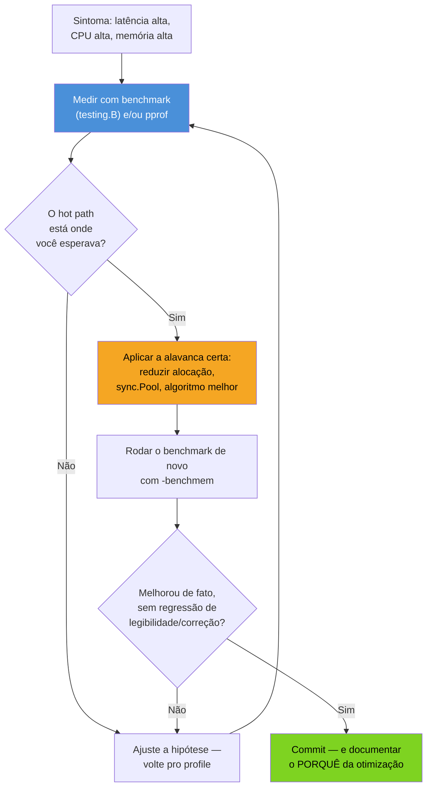
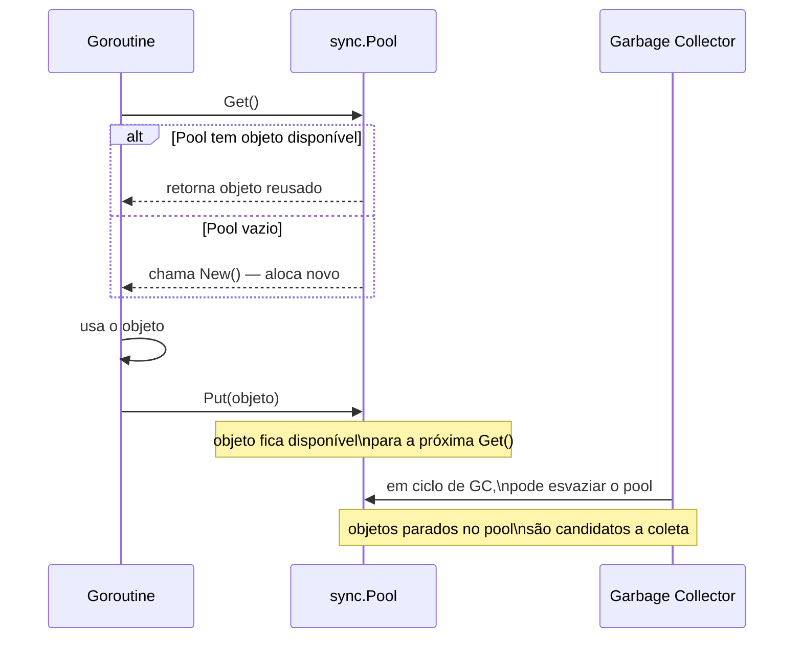

# Otimização guiada por entendimento

> [!abstract] TL;DR
> Depois de sete notas dissecando scheduler, stack, escape analysis, GC e memory model, a pergunta final é prática: **o que fazer com esse entendimento na hora de otimizar?** A resposta curta — quase nada, quase nunca, sem medir primeiro. Micro-otimização sem profile é a forma mais cara de perder tempo em Go: você reescreve código legível baseado num palpite, e o palpite erra na maioria das vezes porque a intuição humana sobre onde o tempo vai não bate com onde ele realmente vai. Quando o profile aponta um hot path real, as alavancas de baixo nível que este galho ensinou entram em cena: reduzir alocações que escapam pro heap (nota 04), reusar buffers com `sync.Pool` para tirar pressão do GC (nota 05), e entender o custo real de cada operação a partir do modelo mental do runtime — não de achismo.

## O cenário: um serviço lento, e dois jeitos de reagir

Imagine um handler HTTP que parseia JSON, monta uma resposta e serializa de volta. Em produção, a latência p99 subiu. Duas equipes reagem diferente.

A primeira abre o código, lê a função, e "sente" que o `json.Marshal` deve ser o problema — afinal, "serialização é sempre lenta" é uma crença comum. Trocam por um encoder customizado, testam localmente com um payload pequeno, veem uma melhora de 5% e fazem deploy. Duas semanas depois, a p99 continua alta — porque o gargalo real era uma alocação de slice dentro de um loop que rodava 50 mil vezes por request, três funções acima do `Marshal`.

A segunda equipe roda `pprof` em produção sob carga real (o galho 16, sobre Observabilidade, cobre `pprof` e análise de profiles em detalhe — aqui só entra o "e depois?"), olha o flame graph, e vê exatamente onde o tempo — e as alocações — se concentram. Encontra o loop, entende *por que* ele aloca (um `append` que redimensiona a cada iteração, sem capacidade pré-reservada), corrige uma linha, e a p99 volta ao normal.

A diferença entre as duas equipes não é conhecimento de Go — as duas sabem a linguagem. É **onde aplicaram o esforço**. A primeira otimizou o que "parecia" caro. A segunda otimizou o que o profile *provou* caro. Esta nota é sobre a segunda abordagem: como pensar em custo de forma que o entendimento de runtime construído neste galho — GMP, stack, GC, memory model — vire decisão de engenharia em vez de intuição solta.

## Regra zero: sem profile, não se otimiza

> [!warning] "Achar" que algo é lento não é dado
> A citação mais repetida sobre performance em qualquer linguagem é de Donald Knuth: "premature optimization is the root of all evil" — e ela se aplica a Go com força extra, porque o compilador e o runtime já fazem um trabalho considerável de otimização automática (inlining, escape analysis, GC generational-ish via geração implícita por tamanho). Reescrever código "na mão" para ficar mais rápido, sem medir, frequentemente produz código **pior** — menos legível e sem ganho real, porque o compilador já tinha otimizado o caso simples e sua versão "esperta" bloqueia inlining ou introduz uma alocação nova.

O fluxo correto, na ordem certa:



Repare que o profile aparece **duas vezes** no fluxo: antes de tocar no código (pra saber onde olhar) e depois (pra confirmar que a mudança realmente ajudou). Pular a segunda medição é tão comum quanto pular a primeira — e tão perigoso, porque "eu acho que ficou mais rápido" não é verificação.

Como isso liga ao restante da trilha: profiling detalhado com `pprof` (flame graphs, `go tool pprof`, `-cpuprofile`/`-memprofile`) é assunto do galho 16, sobre Observabilidade — não repetido aqui. Esta nota assume que você já sabe *encontrar* o hot path e foca no que fazer *depois de encontrado*, usando o vocabulário construído neste galho: escape analysis, GC, e o custo de cada operação em termos de runtime.

## Alavanca 1: reduzir alocações que escapam

A nota 04 já explicou escape analysis: o compilador decide, em tempo de compilação, se um valor pode viver na stack (barato, liberado automaticamente no fim do frame) ou precisa ir pro heap (caro, sujeito a GC). Otimização guiada por entendimento começa aqui, porque **menos alocação no heap é a alavanca de maior retorno na maioria dos hot paths Go** — mais impactante, na prática, do que reescrever algoritmos.

O comando que revela o veredito do compilador:

```bash
go build -gcflags="-m" ./...
```

Um exemplo concreto: uma função que monta uma mensagem de log a partir de vários campos.

```go
// Versão que aloca em excesso
func formatarLog(nivel string, msg string, campos map[string]string) string {
    resultado := "[" + nivel + "] " + msg
    for k, v := range campos {
        resultado += " " + k + "=" + v // cada += aqui é uma alocação nova
    }
    return resultado
}
```

Cada `+=` numa string em Go aloca uma string nova — strings são imutáveis, então concatenar sempre copia. Num loop, isso é O(n²) em alocação, não O(n). A correção usa `strings.Builder`, que mantém um buffer mutável internamente e só materializa a string final uma vez:

```go
func formatarLog(nivel, msg string, campos map[string]string) string {
    var b strings.Builder
    b.WriteByte('[')
    b.WriteString(nivel)
    b.WriteString("] ")
    b.WriteString(msg)
    for k, v := range campos {
        b.WriteByte(' ')
        b.WriteString(k)
        b.WriteByte('=')
        b.WriteString(v)
    }
    return b.String()
}
```

`strings.Builder` ainda aloca — o buffer interno cresce como um slice — mas aloca de forma amortizada (dobra de capacidade, como `append`), não a cada concatenação. Se o tamanho final é previsível, `b.Grow(n)` pré-aloca o buffer de uma vez, eliminando até essas realocações intermediárias.

> [!info] `strings.Builder` existe desde Go 1.10 — mas `b.Grow` continua subutilizado
> Muito código Go usa `strings.Builder` corretamente mas esquece de chamar `Grow` quando o tamanho é conhecido ou estimável, deixando na mesa uma otimização de uma linha.

O mesmo raciocínio se aplica a slices: `append` sem capacidade pré-alocada realoca e copia toda vez que ultrapassa a capacidade atual.

```go
// Aloca e realoca várias vezes conforme cresce
resultado := []int{}
for i := 0; i < n; i++ {
    resultado = append(resultado, i*2)
}

// Uma alocação só, do tamanho certo
resultado := make([]int, 0, n)
for i := 0; i < n; i++ {
    resultado = append(resultado, i*2)
}
```

> [!warning] Reduzir alocação não é reescrever tudo com ponteiro
> Uma armadilha comum de quem "aprendeu" sobre escape analysis é passar a usar `*T` em toda struct, achando que ponteiro é sempre mais barato que valor. É o oposto do que a nota 04 mostrou: um ponteiro que escapa pro heap é **mais** caro que um valor pequeno que fica na stack. A regra não é "sempre ponteiro" — é "deixe o compilador decidir, e só force uma direção quando o profile mostrar que a decisão automática está custando caro" (por exemplo, um valor grande sendo copiado repetidamente por value, quando um ponteiro evitaria a cópia).

## Alavanca 2: `sync.Pool` — reusar em vez de realocar

Quando um hot path aloca objetos temporários de vida curta e alta frequência — buffers de serialização, structs de trabalho por request — a alavanca seguinte é **não alocar de novo, reusar um objeto que já existe**. É exatamente o papel de `sync.Pool`: um cache de objetos temporários, seguro para concorrência, que o GC pode esvaziar entre ciclos.



O caso canônico é um buffer para serialização — `bytes.Buffer` reusado entre requests, em vez de um `new(bytes.Buffer)` a cada chamada:

```go
var bufPool = sync.Pool{
    New: func() any {
        return new(bytes.Buffer)
    },
}

func handler(w http.ResponseWriter, r *http.Request) {
    buf := bufPool.Get().(*bytes.Buffer)
    buf.Reset() // essencial: o buffer vem "sujo" de um uso anterior
    defer bufPool.Put(buf)

    json.NewEncoder(buf).Encode(montarResposta(r))
    w.Write(buf.Bytes())
}
```

Três pontos que fazem `sync.Pool` funcionar corretamente, e que o código acima ilustra:

1. **`buf.Reset()` é obrigatório** — o objeto que sai do `Get()` pode ter estado de um uso anterior. `sync.Pool` não limpa nada por você; ele só evita a alocação.
2. **`defer bufPool.Put(buf)`** garante devolução mesmo se `handler` retornar cedo por erro.
3. **`New` é a função chamada quando o pool está vazio** — o primeiro `Get()` de cada worker, ou depois que o GC esvaziou o pool, paga o custo de alocação normalmente. `sync.Pool` não elimina alocação, **amortiza** ela ao longo de muitas chamadas.

> [!info] `sync.Pool` desde sempre, mas o comportamento de esvaziamento mudou
> O pacote existe desde as primeiras versões de Go, mas o runtime já ajustou mais de uma vez a agressividade com que o GC esvazia pools ociosos entre ciclos. Na prática atual, um objeto que fica parado no pool por dois ciclos de GC seguidos tende a ser coletado — então `sync.Pool` é para objetos de vida curta e uso frequente, não um cache de longo prazo.

> [!warning] `sync.Pool` não é solução para "memória alta" em geral
> `sync.Pool` ajuda quando o padrão é *alocar → usar rápido → descartar*, com alta frequência (milhares de vezes por segundo). Para objetos de vida longa, ou para "eu tenho memória alta e não sei por quê", a resposta correta é profiling (`pprof` com `-memprofile`, coberto a fundo no galho 16, sobre Observabilidade) — não enfiar tudo num pool na esperança de que ajude. Um pool mal dimensionado, guardando objetos grandes que raramente são reusados, pode até *piorar* o uso de memória, porque mantém objetos vivos por mais tempo do que ficariam se apenas fossem coletados normalmente.

> [!warning] Pool de objetos com estado sensível é uma fonte clássica de bug sutil
> Se o objeto reusado tem um campo que "vaza" entre usos — um slice reaproveitado que ainda referencia dados do request anterior, por exemplo — o bug não aparece em teste unitário isolado. Aparece em produção, sob concorrência, como dado de um request vazando pra resposta de outro. `Reset()` completo e disciplinado (limpar **todos** os campos que importam, não só os óbvios) é o preço de usar `sync.Pool` com segurança.

## Quando micro-otimizar: quase nunca, mas às vezes sim

A regra zero desta nota — "sem profile, não se otimiza" — tem uma contraparte importante: quando o profile *aponta* um hot path real, otimizar ali vale a pena, mesmo que o ganho pareça pequeno em isolamento. A calibração certa depende de três perguntas, nesta ordem:

1. **O código está num hot path medido, não suposto?** Se `pprof` mostra 40% do tempo de CPU numa função, ou ela é responsável por uma fatia desproporcional das alocações no `-memprofile`, é candidata real. Se não aparece no profile sob carga representativa, não é.
2. **O ganho justifica a perda de legibilidade?** Uma otimização que troca um `for range` claro por um loop manual com índices e ponteiros, para ganhar 2% numa função que roda uma vez por request, raramente vale o custo de manutenção. Uma que elimina 80% das alocações num parser que roda milhões de vezes por segundo, sim.
3. **Existe benchmark reproduzível que prova o ganho?** `testing.B` com `-benchmem` é o mínimo — sem ele, "otimizado" é opinião, não fato.

```go
func BenchmarkFormatarLogConcat(b *testing.B) {
    campos := map[string]string{"user": "123", "path": "/api"}
    b.ReportAllocs()
    for i := 0; i < b.N; i++ {
        formatarLogConcat("INFO", "requisição recebida", campos)
    }
}

func BenchmarkFormatarLogBuilder(b *testing.B) {
    campos := map[string]string{"user": "123", "path": "/api"}
    b.ReportAllocs()
    for i := 0; i < b.N; i++ {
        formatarLogBuilder("INFO", "requisição recebida", campos)
    }
}
```

Rodando com `go test -bench=. -benchmem`, a saída mostra `ns/op`, `B/op` (bytes alocados por operação) e `allocs/op` (número de alocações) lado a lado — os três números que decidem se a otimização é real, não a impressão de que "parece mais rápido".

> [!question]- Se um benchmark mostra 5% de ganho, isso já justifica a mudança?
> Depende inteiramente do contexto — 5% numa função que consome 60% do tempo de CPU do serviço é uma vitória grande em produção; 5% numa função que aparece com 0.1% no profile é ruído estatístico disfarçado de otimização. A pergunta certa nunca é "o benchmark melhorou?", é "essa função importa o suficiente, no profile real, para o ganho valer o código mais complexo?". Quando a resposta é não, o código mais simples vence — mesmo perdendo o microbenchmark isolado.

## Pensar em custo com base no runtime, não em regra de bolso

O fio que amarra este galho inteiro — GMP, stack, escape analysis, GC, memory model — é que ele te dá um **modelo mental de custo real**, em vez de regras de bolso genéricas tipo "loops são lentos" ou "interfaces são caras". Alguns exemplos de como o entendimento de runtime muda a pergunta que você faz:

| Regra de bolso (evitar) | Pergunta guiada por entendimento (usar) |
|---|---|
| "Ponteiro é sempre mais rápido que valor" | "Esse valor é grande o suficiente pra cópia doer, e escapa mesmo se eu usar valor?" (nota 04) |
| "Goroutines são baratas, então crie quantas quiser" | "O scheduler GMP consegue distribuir essa carga sem contenção de M's ou GOMAXPROCS insuficiente?" (nota 02) |
| "GC é lento, desative ele" | "O `GOGC`/`GOMEMLIMIT` estão calibrados pro trade-off memória-vs-CPU do meu workload?" (nota 06) |
| "Mutex sempre serializa, evite a todo custo" | "A contenção real, medida, justifica um design lock-free, ou o mutex simples já é rápido o bastante?" (nota 07, memory model) |
| "Mapas são lentos, use slice sempre" | "O padrão de acesso é por chave (mapa vence) ou por índice sequencial (slice vence), medido no meu caso?" |

A tabela não é uma lista de respostas prontas — é o formato da pergunta que muda. Regra de bolso responde sem olhar pro código. Entendimento de runtime pergunta "o que o profile mostra, e o que eu sei sobre como esse mecanismo funciona por baixo, dizem juntos?".

> [!info] `GOMEMLIMIT` (Go 1.19+) como alavanca de custo, não só de segurança
> A nota 06 já cobriu `GOMEMLIMIT` como proteção contra OOM. Vale lembrar aqui, na chave de "custo": ajustar `GOMEMLIMIT` é uma forma de trocar memória por CPU (mais memória disponível → GC roda com menos frequência → menos CPU gasta em coleta) sem tocar em uma linha de código de aplicação — às vezes a otimização mais barata é de configuração, não de algoritmo.

## Lente cross-stack: onde a intuição de outras linguagens engana

> [!tip] Vindo de Java/Node/Python, cuidado com o que "parece" caro
> Em Java, a JIT e o escape analysis da JVM tornam certos padrões (objetos pequenos de vida curta) quase gratuitos depois de warmup — o que ensina o reflexo de não se preocupar com alocação. Em Go, **não há warmup** e o compilador decide escape em tempo de compilação, não em runtime adaptativo — então um padrão que era barato "depois de esquentar" na JVM pode custar caro desde a primeira chamada em Go. Em Node/Python, a esperança comum é "a linguagem já é lenta mesmo, não adianta micro-otimizar" — o que leva a ignorar alocação desnecessária mesmo quando o profile aponta ela como gargalo real, porque a cultura da linguagem normalizou o overhead. Em Go, que compete de perto com C/C++/Rust em benchmarks, a expectativa cultural é oposta: alocação evitável *é* considerada bug de performance, e ferramentas como `pprof` e `-gcflags="-m"` tornam essa investigação barata o suficiente para valer a pena fazer.

## Como explicar em inglês

> Optimization in Go should follow evidence, not intuition: profile first with `pprof` or benchmarks, find the actual hot path, and only then decide where to spend effort — premature optimization based on a guess is often worse than doing nothing, because the compiler and runtime already handle the common case well. When a hot path is confirmed, the highest-leverage move is usually reducing heap allocations — checking escape analysis output (`-gcflags="-m"`), preallocating slices and using `strings.Builder` with `Grow`, and reaching for `sync.Pool` to reuse short-lived, high-frequency objects instead of reallocating them every time, always calling `Reset()` on what comes out of the pool. The deeper payoff of understanding the runtime — scheduler, stack growth, escape analysis, garbage collection, memory model — isn't memorizing rules of thumb like "pointers are always faster"; it's knowing which question to ask about a specific piece of code, and having the tools (`go test -bench -benchmem`, `pprof`) to answer it with numbers instead of opinion.

| Termo PT | Termo EN |
|---|---|
| otimização prematura | premature optimization |
| caminho quente / hot path | hot path |
| alocação no heap | heap allocation |
| reuso de objetos | object pooling |
| amortizado | amortized |
| benchmark | benchmark |
| vazamento de estado entre usos | state leak across reuse |
| regra de bolso | rule of thumb |

## O que vem a seguir

Este é o fim do Galho 17 — o modelo mental de runtime está completo: scheduler, stack, escape analysis, GC, memory model e, agora, como transformar tudo isso em decisão de otimização guiada por dados. O próximo passo natural é sair do runtime isolado e entrar no ambiente onde esse código realmente roda em produção: o Galho 18 — Cloud-native e produção cobre empacotamento, comportamento da aplicação dentro de containers e Kubernetes, observabilidade operacional e o resto do que separa "código Go que funciona" de "serviço Go que roda de forma confiável em produção".

## Veja também

- [[04 - Escape analysis|04 — Escape analysis]] — a base para entender o que "escapar pro heap" significa e como ler `-gcflags="-m"`
- [[05 - O garbage collector|05 — O garbage collector]] — o que `sync.Pool` está aliviando: pressão sobre o coletor
- [[06 - Tuning do GC|06 — Tuning do GC]] — `GOGC`/`GOMEMLIMIT` como alavanca de custo complementar ao que esta nota cobre
- [[07 - O memory model|07 — O memory model]] — por que `sync.Pool` é seguro sob concorrência sem locks explícitos no seu código
- [[03-Dominios/Tecnologia/Go/index|Trilha Go]]

## Fontes

- The Go Authors. *Package sync — Pool*. pkg.go.dev. https://pkg.go.dev/sync#Pool (acessado em 2026-07-18)
- The Go Authors. *Package strings — Builder*. pkg.go.dev. https://pkg.go.dev/strings#Builder (acessado em 2026-07-18)
- The Go Authors. *Package testing — Benchmarks*. pkg.go.dev. https://pkg.go.dev/testing#hdr-Benchmarks (acessado em 2026-07-18)
- The Go Authors. *Profiling Go Programs*. go.dev/blog. https://go.dev/blog/pprof (acessado em 2026-07-18)
- The Go Authors. *A Guide to the Go Garbage Collector*. go.dev/doc. https://go.dev/doc/gc-guide (acessado em 2026-07-18)
- Go by Example. *Testing and Benchmarking*. gobyexample.com. https://gobyexample.com/testing-and-benchmarking (acessado em 2026-07-18)
