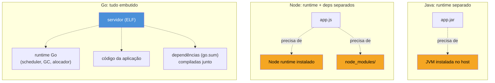
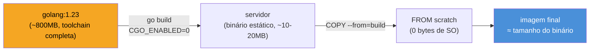

# O binário estático

> [!abstract] TL;DR
> `go build` produz, por padrão, um **binário único e estático** — sem `.dll`/`.so` para instalar ao lado, sem runtime externo, sem `node_modules`. Isso só é garantido quando **CGO_ENABLED=0**: com cgo ligado (o padrão em muitos ambientes com `gcc` instalado), o pacote `net` pode puxar `libc` via `dlopen` para resolução de nomes, e o binário resultante volta a depender de bibliotecas do sistema operacional em tempo de execução. Um binário Go verdadeiramente estático roda em `FROM scratch` — uma imagem Docker vazia, sem Linux nenhum por baixo — e é exatamente essa propriedade que torna Go o material preferido para containers cloud-native: a imagem final pode pesar poucos megabytes, sem SO, sem JRE, sem interpretador.

## O problema que quem vem de outras linguagens carrega

Imagine que você precisa mandar para produção um serviço escrito em Java. O artefato não é "o programa" — é um `.jar`, e para rodá-lo alguém (você, o Dockerfile, o servidor de destino) precisa primeiro instalar uma JVM compatível. Node é pior ainda: o `.js` não roda sozinho, precisa do runtime Node instalado *e* de uma árvore `node_modules` inteira ao lado, ou tudo trava com `Cannot find module`. Python mistura os dois problemas — interpretador certo, versão certa, `pip install -r requirements.txt` certo, e torça para nenhuma dependência nativa (`numpy`, `psycopg2`) ter sido compilada para a arquitetura errada.

Em todos esses casos, "implantar o programa" na verdade significa "recriar, no destino, um ambiente inteiro capaz de executá-lo". É esse pano de fundo — o problema que motivou containers, virtualenvs, e um ecossistema inteiro de gerenciamento de runtime — que torna a resposta de Go surpreendente na primeira vez que alguém vê de perto: `go build` produz um arquivo. Um só. Sem dependências externas de runtime. Copie esse arquivo para uma máquina Linux nua, sem Go instalado, sem bibliotecas, e ele roda.

```bash
$ go build -o servidor .
$ file servidor
servidor: ELF 64-bit LSB executable, x86-64, statically linked, ...
$ ldd servidor
        not a dynamic executable
```

`ldd` — o comando que lista quais bibliotecas dinâmicas (`.so`) um executável Linux precisa carregar antes de rodar — não encontra nenhuma. É essa a definição prática de "estático": o binário carrega dentro de si tudo que precisa, incluindo o runtime de Go inteiro (goroutine scheduler, garbage collector, tudo).

## Por que isso é possível: o runtime vive dentro do binário

A diferença de raiz em relação a Java/Node/Python é onde mora o runtime da linguagem. Nessas três, o runtime (JVM, motor V8, CPython) é um programa **separado**, instalado à parte, que carrega e interpreta (ou faz JIT de) o seu código. Em Go, o compilador (`gc`, o compilador oficial) faz *link estático* do runtime **dentro** do próprio binário na hora do build — goroutine scheduler, coletor de lixo, alocador de memória, tudo embutido no mesmo arquivo ELF que o seu `main()`.



Não é só o runtime de Go que entra no binário — as dependências declaradas em `go.mod`/`go.sum` também são compiladas junto, não baixadas em tempo de execução. Não existe um equivalente Go de `node_modules` ou `site-packages` acompanhando o artefato final: o `go build` resolve tudo em tempo de compilação e produz um único arquivo autocontido.

## O detalhe que quebra a promessa: cgo e `net`

A explicação acima é verdadeira só sob uma condição: **CGO_ENABLED=0**. Cgo é o mecanismo que permite código Go chamar bibliotecas C — útil para usar `libsqlite3` ou bindings nativos, mas com um efeito colateral que pega muita gente de surpresa: quando cgo está ligado, o pacote `net` da biblioteca padrão pode, dependendo do sistema operacional e da configuração de resolução de nomes (`/etc/nsswitch.conf` no Linux), usar o resolver de DNS da **libc do sistema** via `dlopen`/`dlsym`, em vez do resolver puro-Go.

```bash
$ go env CGO_ENABLED
1    # padrão na maioria dos ambientes com gcc disponível

$ go build -o servidor .
$ ldd servidor
        linux-vdso.so.1
        libc.so.6 => /lib/x86_64-linux-gnu/libc.so.6
        /lib64/ld-linux-x86-64.so.2
```

Esse binário não é mais estático — depende de `libc.so.6` estar presente no destino, na versão certa. É exatamente o tipo de dependência de runtime que Go promete evitar, reintroduzida silenciosamente porque cgo estava ligado por padrão (o `go build` detecta um `gcc`/`cc` disponível no `PATH` e liga cgo automaticamente, mesmo que o seu código nunca use `import "C"` diretamente — basta um pacote da std lib, como `net`, decidir usar o resolver via cgo).

A correção é uma variável de ambiente:

```bash
$ CGO_ENABLED=0 go build -o servidor .
$ ldd servidor
        not a dynamic executable
```

Com `CGO_ENABLED=0`, o pacote `net` cai de volta no resolver de DNS **puro-Go** (reimplementação em Go da resolução de nomes, sem tocar `libc`), e o binário volta a ser genuinamente estático — sem nenhuma dependência dinâmica.

> [!info] `CGO_ENABLED=0` não é opcional em cross-compilation
> A [[02 - Cross-compilation|próxima nota]] mostra que, além de garantir estaticidade, `CGO_ENABLED=0` costuma ser **obrigatório** para cross-compilar: cgo precisa de um compilador C para a plataforma de destino instalado localmente, algo que raramente existe pronto (compilar para `linux/amd64` a partir de um Mac exige um cross-compilador C específico). Sem cgo, o compilador Go faz tudo sozinho.

> [!warning] "Estático" não é o padrão universal — depende do ambiente de build
> A ideia de que "Go sempre gera binário estático" é meia verdade perigosa. Em macOS e Windows, `CGO_ENABLED` normalmente já vem como `0` por padrão em builds simples sem dependência C. Mas em ambientes Linux com `gcc` instalado (a maioria das imagens de CI, muitas distros de desenvolvedor), `CGO_ENABLED=1` é o padrão silencioso. Não assuma — rode `go env CGO_ENABLED` e `ldd` no binário final antes de confiar que ele é estático.

## Por que isso importa para produção: uma imagem Docker minúscula

Aqui a lente muda de "como funciona" para "por que alguém se importa". Um binário estático não depende de bibliotecas do sistema operacional — o que significa que ele não depende, tecnicamente, de sistema operacional **nenhum**. Isso viabiliza a imagem Docker mais enxuta que existe: `FROM scratch`, a imagem base literalmente vazia, sem nenhum arquivo, nenhuma distro Linux, nenhum shell.

```dockerfile
# build stage (imagem completa, com toolchain Go)
FROM golang:1.23 AS build
WORKDIR /app
COPY . .
RUN CGO_ENABLED=0 go build -o servidor .

# imagem final: vazia, exceto pelo binário
FROM scratch
COPY --from=build /app/servidor /servidor
ENTRYPOINT ["/servidor"]
```



Compare com o equivalente em Java ou Node: a imagem final precisa, no mínimo, de uma JRE (`eclipse-temurin:21-jre-alpine` já soma dezenas de MB) ou de um runtime Node completo, mesmo usando Alpine como base. Go dispensa os dois — a imagem final pode ser literalmente só o binário, tipicamente na casa de poucos megabytes a algumas dezenas, dependendo do que a aplicação importa. Menos superfície de ataque (nada de shell, nada de pacotes de SO com CVEs para corrigir), menos tempo de pull da imagem, e menos coisa para o `docker scan` reclamar. A [[04 - Docker — imagens mínimas|nota 04]] deste galho retoma exatamente essa construção com multi-stage build em profundidade — esta nota cobre só a pré-condição que a torna possível: o binário estático em si.

> [!question]- Se cgo está desligado, `os/user` e outros pacotes que dependem de recursos do SO ainda funcionam?
> Sim, na maioria dos casos — `os/user`, por exemplo, tem uma implementação puro-Go alternativa que lê `/etc/passwd` diretamente em vez de chamar `getpwnam` da libc, usada automaticamente quando cgo está desligado. Alguns poucos recursos avançados (resolução NSS customizada muito específica, alguns detalhes de `os/user` em sistemas com diretórios não padrão) só funcionam com cgo ligado — mas para a esmagadora maioria dos serviços de rede e CLIs, `CGO_ENABLED=0` não perde funcionalidade nenhuma.

## Casos práticos

**1. Um serviço HTTP mínimo, só com biblioteca padrão**, o tipo de programa que vira container em produção:

```go
package main

import (
    "log/slog"
    "net/http"
    "os"
)

func main() {
    logger := slog.New(slog.NewJSONHandler(os.Stdout, nil))

    mux := http.NewServeMux()
    mux.HandleFunc("GET /saude", func(w http.ResponseWriter, r *http.Request) {
        w.WriteHeader(http.StatusOK)
        w.Write([]byte("ok"))
    })

    logger.Info("iniciando servidor", "porta", 8080)
    if err := http.ListenAndServe(":8080", mux); err != nil {
        logger.Error("servidor caiu", "erro", err)
        os.Exit(1)
    }
}
```

> [!info] `GET /saude` no `ServeMux` exige Go 1.22+
> Registrar rota com método HTTP embutido no padrão (`"GET /saude"` em vez de só `"/saude"`) é um recurso do `net/http.ServeMux` reescrito na Go 1.22 — versões anteriores ignoravam o prefixo `GET ` e tratavam a string inteira como path. `log/slog`, usado aqui para log estruturado, é biblioteca padrão desde a 1.21.

Compile e confira o resultado nos dois modos:

```bash
$ CGO_ENABLED=0 go build -o servidor-estatico .
$ ldd servidor-estatico
        not a dynamic executable

$ CGO_ENABLED=1 go build -o servidor-dinamico .
$ ldd servidor-dinamico
        linux-vdso.so.1
        libc.so.6 => /lib/x86_64-linux-gnu/libc.so.6
        /lib64/ld-linux-x86-64.so.2
```

Mesmo código-fonte, dois binários com propriedades de deploy completamente diferentes — a única variável foi `CGO_ENABLED`.

**2. Confirmando a estaticidade sem depender do sabor de `ldd` do seu Linux**, com `go tool nm` ou inspecionando o próprio ELF:

```bash
$ go build -o servidor .
$ file servidor
servidor: ELF 64-bit LSB executable, x86-64, statically linked, ...

# Alternativa portátil, sem depender do "ldd" do host:
$ readelf -d servidor | grep NEEDED
# saída vazia = nenhuma dependência dinâmica declarada = estático
```

`readelf -d` lista as entradas `NEEDED` do binário — as bibliotecas dinâmicas que o *loader* do SO precisa resolver antes de executar. Um binário estático simplesmente não tem nenhuma.

## Comparando: de onde você vem muda a surpresa

| Vindo de | Unidade de deploy | Runtime no destino? |
|---|---|---|
| Java | `.jar`/`.war` | Sim — JVM precisa estar instalada e na versão compatível |
| Node | `.js` + `node_modules/` | Sim — runtime Node + árvore de dependências completa |
| Python | `.py` + `venv`/`requirements.txt` | Sim — interpretador CPython + pacotes, inclusive nativos |
| Go (`CGO_ENABLED=0`) | um único binário ELF | Não — nada além do próprio kernel Linux |

A linha de Go não é modéstia retórica: é o motivo pelo qual `FROM scratch` é uma opção real em Go e praticamente inviável nas outras três linguagens sem reinventar o runtime dentro do container.

## Armadilhas comuns

> [!warning] `FROM scratch` sem certificados TLS quebra chamadas HTTPS de saída
> Uma imagem `scratch` não tem `/etc/ssl/certs` — nenhum certificado raiz para validar TLS. Um serviço que só recebe requisições HTTP funciona sem problema; um que faz chamadas HTTPS de **saída** (chamar uma API externa, por exemplo) falha com `x509: certificate signed by unknown authority`. A correção usual é copiar os certificados da imagem de build no `COPY --from=build`: `COPY --from=build /etc/ssl/certs/ca-certificates.crt /etc/ssl/certs/`. A [[04 - Docker — imagens mínimas|nota 04]] retoma esse detalhe junto do Dockerfile completo.

> [!warning] Binário estático não significa "sem `CGO_ENABLED` em lugar nenhum do pipeline"
> É comum zerar `CGO_ENABLED=0` no `Dockerfile` mas esquecer que o mesmo `go build` também roda, sem essa variável, na máquina de um desenvolvedor ou num job de CI diferente — produzindo um binário dinâmico ali mesmo que o Dockerfile esteja correto. Trate `CGO_ENABLED=0` como parte do contrato de build do projeto (documentado, ou fixado em `Makefile`/scripts de CI), não como um detalhe implícito só do Dockerfile.

> [!warning] Cross-compilation com cgo ligado costuma falhar silenciosamente ou não compilar
> Tentar `GOOS=linux GOARCH=amd64 CGO_ENABLED=1 go build` a partir de um Mac, sem um cross-compilador C instalado, tipicamente falha na hora do link ou produz um binário que não roda no destino. A [[02 - Cross-compilation|próxima nota]] cobre isso em detalhe — mas o ponto aqui é que "estático" e "cross-compilável sem dor" andam juntos: as duas propriedades nascem da mesma decisão, `CGO_ENABLED=0`.

## Como explicar em inglês

> By default, `go build` produces a single, statically-linked binary — no separate runtime to install, no `node_modules` tree, no interpreter version to match. That guarantee only holds with **`CGO_ENABLED=0`**: when cgo is enabled (often the silent default on Linux build environments with `gcc` available), the standard library's `net` package can resolve DNS names via the system's `libc` through `dlopen`, quietly turning the binary into a dynamically-linked one again — check with `ldd` on the result. A genuinely static Go binary needs no operating system at all underneath it, which is exactly why it can run in a `FROM scratch` Docker image: no JRE, no interpreter, no OS packages, just the binary. That's the core reason Go became a favorite for cloud-native services — minimal image size, minimal attack surface, minimal moving parts to keep patched.

| Termo PT | Termo EN |
|---|---|
| binário estático | static binary / statically-linked binary |
| link dinâmico | dynamic linking |
| ligação em tempo de compilação | static linking |
| resolver de DNS puro-Go | pure-Go DNS resolver |
| imagem base vazia | scratch image |
| superfície de ataque | attack surface |
| build multi-estágio | multi-stage build |

## O que vem a seguir

Estático resolve "depende de bibliotecas do sistema" — mas não resolve "compilado para a arquitetura certa". A [[02 - Cross-compilation|próxima nota]] mostra como `GOOS` e `GOARCH` permitem compilar, de uma máquina de desenvolvimento qualquer, um binário Linux/amd64 (ou ARM, ou qualquer combinação suportada) sem precisar de uma VM ou container da plataforma alvo — e por que `CGO_ENABLED=0`, visto aqui, costuma ser pré-requisito para isso funcionar sem atrito.

## Veja também

- [[02 - Cross-compilation|02 — Cross-compilation]] — próxima nota do galho, usa CGO_ENABLED=0 como base
- [[04 - Docker — imagens mínimas|04 — Docker — imagens mínimas]] — constrói o Dockerfile `FROM scratch` em profundidade, com multi-stage build completo
- [[03-Dominios/Tecnologia/Go/index|Trilha Go]]

## Fontes

- The Go Authors. *Command go — Environment variables (CGO_ENABLED)*. pkg.go.dev. https://pkg.go.dev/cmd/go#hdr-Environment_variables (acessado em 2026-07-18)
- The Go Authors. *Package net — Name Resolution*. pkg.go.dev. https://pkg.go.dev/net#hdr-Name_Resolution (acessado em 2026-07-18)
- The Go Authors. *cmd/cgo*. pkg.go.dev. https://pkg.go.dev/cmd/cgo (acessado em 2026-07-18)
- Docker, Inc. *Dockerfile reference — FROM scratch*. docs.docker.com. https://docs.docker.com/build/building/base-images/#create-a-minimal-base-image-using-scratch (acessado em 2026-07-18)
- The Go Authors. *Go Wiki: cgo*. go.dev. https://go.dev/wiki/cgo (acessado em 2026-07-18)
