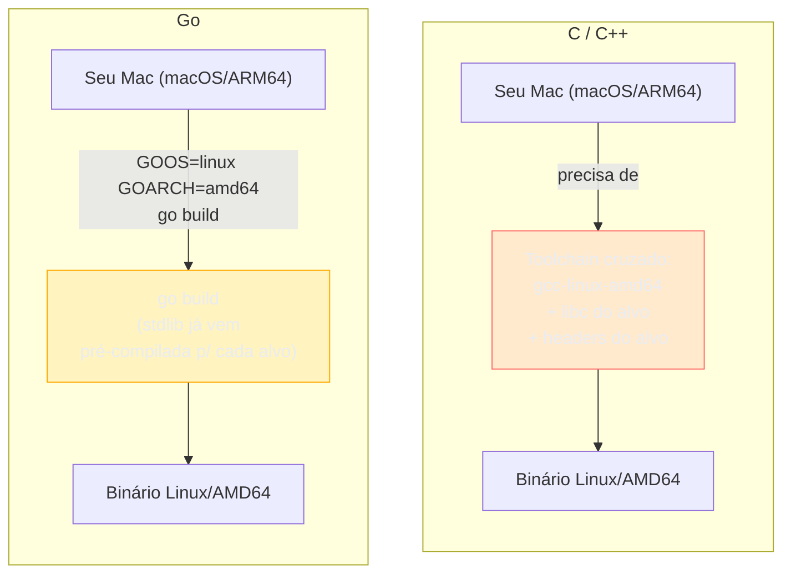
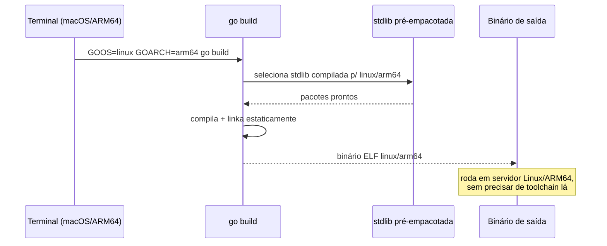

# Cross-compilation

> [!abstract] TL;DR
> Cross-compilation em Go é `GOOS=linux GOARCH=arm64 go build` — só isso. Duas variáveis de ambiente trocam o sistema operacional e a arquitetura de destino, e o compilador (que já é o *linker* também, graças ao binário estático da [[01 - O binário estático|nota 01]]) gera um executável pronto para rodar noutra plataforma, sem instalar toolchain nenhuma, sem Docker, sem VM. Compilar num MacBook M1 um binário para servidor Linux/AMD64 é uma linha de comando. Isso é possível porque o próprio compilador Go é escrito em Go e distribuído com bibliotecas-padrão pré-compiladas para cada combinação suportada — o oposto do C, onde cross-compiling historicamente exige um toolchain dedicado (`arm-linux-gnueabihf-gcc` e afins) para cada alvo.

## O problema que outras linguagens sofrem

Imagine que você desenvolve num MacBook (macOS/ARM64) e precisa entregar um binário para um servidor Linux/AMD64 em produção — o caso mais comum de todos, já que quase todo cloud roda Linux/x86_64 enquanto boa parte dos devs hoje usa Mac com chip Apple Silicon.

Em C ou C++, isso costuma significar instalar um *cross-toolchain* inteiro: um compilador GCC configurado para gerar código para a arquitetura e o SO de destino, mais as bibliotecas de sistema (headers, `libc`) daquele alvo — porque o linker precisa resolver símbolos contra as bibliotecas *do destino*, não as do seu Mac. Rust melhorou bastante esse cenário com `rustup target add`, mas ainda depende de baixar um *target* específico e, para alguns pares SO/arquitetura, de um linker externo (`musl-gcc`, por exemplo). Python e Node nem entram nessa discussão da mesma forma — eles não compilam para binário nativo, então "cross-compiling" significa outra coisa (empacotar o interpretador junto, tipo PyInstaller).

Go trilha um caminho radicalmente mais simples. E a simplicidade não é acidente — é consequência direta de duas decisões de design que já apareceram nesta trilha: o binário é **estático** (sem dependência de `libc` do sistema de destino, na maioria dos casos) e o **runtime é embutido** no próprio binário, não uma DLL/`.so` separada que precisa existir no alvo. Sem essas duas peças, cross-compiling seria tão dolorido em Go quanto é em C.



## GOOS e GOARCH: as duas variáveis que decidem tudo

O `go build` sempre compila para *algum* par sistema operacional + arquitetura. Sem configuração explícita, ele usa o par da máquina onde está rodando — chamado de **build nativo**. Duas variáveis de ambiente sobrescrevem esse par:

- **`GOOS`** — o sistema operacional de destino: `linux`, `darwin` (macOS), `windows`, `freebsd`, entre outros.
- **`GOARCH`** — a arquitetura de CPU de destino: `amd64` (x86-64), `arm64` (ARM 64-bit, o chip da maioria dos servidores cloud modernos e dos Macs Apple Silicon), `386`, `arm`, entre outras.

```bash
# build nativo: compila para o SO/arquitetura da própria máquina
go build -o app .

# cross-compile: Linux/AMD64, o alvo mais comum em produção cloud
GOOS=linux GOARCH=amd64 go build -o app-linux-amd64 .

# cross-compile: Linux/ARM64, comum em instâncias cloud mais baratas (AWS Graviton, etc.)
GOOS=linux GOARCH=arm64 go build -o app-linux-arm64 .

# cross-compile: Windows, se precisar
GOOS=windows GOARCH=amd64 go build -o app.exe .
```

Repare que essas variáveis são passadas **na frente** do comando, não como flag — é a convenção do shell para variáveis de ambiente escopadas a um único comando. `go build` lê `GOOS`/`GOARCH` do ambiente do processo, decide qual conjunto de arquivos da biblioteca-padrão usar (o compilador já vem com a stdlib pré-compilada — ou pré-compilável rapidamente — para cada combinação suportada) e produz o binário final para aquele alvo. Nenhum passo extra, nenhuma instalação prévia.



> [!info] `go tool dist list` lista todos os pares suportados
> A partir do Go 1.x moderno (comando estável há várias versões), rodar `go tool dist list` no terminal mostra a lista completa de combinações `GOOS/GOARCH` que a *toolchain* instalada sabe compilar — dezenas de pares, de `linux/amd64` a `js/wasm` e `plan9/386`. É o jeito canônico de descobrir se um alvo específico é suportado sem precisar consultar a documentação.

## Compilando para ARM de qualquer máquina — sem toolchain externa

O caso concreto mais comum na prática de hoje: você desenvolve num Mac com Apple Silicon (`darwin/arm64`) e o servidor de produção é uma instância Linux/ARM64 (AWS Graviton, por exemplo, escolhida por custo-benefício) ou um Raspberry Pi. A dúvida de quem vem de C é sempre a mesma: "preciso instalar um cross-compiler ARM?"

Não. O comando é idêntico ao de qualquer outro alvo:

```bash
GOOS=linux GOARCH=arm64 go build -o servidor-arm .
```

Isso funciona **de qualquer máquina host** — Linux/AMD64, macOS/ARM64, Windows/AMD64, não importa. O par de origem e o par de destino são completamente independentes, porque `go build` nunca invoca um compilador C do sistema para gerar o binário final (a menos que CGO esteja habilitado — ver armadilha adiante). Todo o trabalho de gerar código de máquina ARM64 é feito pelo próprio compilador Go, que sabe emitir código para qualquer arquitetura suportada, independente da arquitetura em que ele mesmo está rodando.

Um exemplo prático, um servidor HTTP mínimo que você compila num Mac e roda num Raspberry Pi (Linux/ARM):

```go
package main

import (
	"fmt"
	"log/slog"
	"net/http"
	"runtime"
)

func main() {
	mux := http.NewServeMux()
	mux.HandleFunc("GET /", func(w http.ResponseWriter, r *http.Request) {
		fmt.Fprintf(w, "rodando em %s/%s\n", runtime.GOOS, runtime.GOARCH)
	})

	slog.Info("servidor iniciado", "porta", 8080)
	if err := http.ListenAndServe(":8080", mux); err != nil {
		slog.Error("servidor caiu", "erro", err)
	}
}
```

> [!info] `net/http` com padrões de método e wildcard (Go 1.22+)
> `mux.HandleFunc("GET /", ...)` usa a sintaxe de roteamento reforçada do `ServeMux`, que passou a aceitar o verbo HTTP e wildcards de path diretamente no padrão a partir do Go 1.22 — antes disso, filtrar por método exigia checar `r.Method` manualmente dentro do handler.

Compilar isso para o Pi, a partir de um Mac:

```bash
GOOS=linux GOARCH=arm go build -o servidor-pi .
scp servidor-pi pi@raspberrypi.local:/home/pi/
ssh pi@raspberrypi.local ./servidor-pi
```

`GOARCH=arm` (sem o `64`) mira ARM 32-bit, o caso de Raspberry Pi mais antigos; `arm64` mira os modelos recentes (Pi 3+ em modo 64-bit, Pi 4, Pi 5). Nenhum dos dois comandos precisou de um SDK ARM instalado no Mac — só a variável de ambiente certa.

## GOARM: uma terceira variável, só para ARM 32-bit

Quando o alvo é `GOARCH=arm` (32-bit), existe ainda uma terceira variável opcional, `GOARM`, que escolhe a versão do conjunto de instruções ARM (`5`, `6` ou `7`) — relevante porque Raspberry Pi de gerações diferentes suportam extensões de hardware diferentes (como instruções de ponto flutuante). Para `arm64`, `GOARM` não se aplica — a arquitetura 64-bit já padroniza esse conjunto.

```bash
GOOS=linux GOARCH=arm GOARM=6 go build -o servidor-pi-antigo .
```

Isso é um detalhe de nicho — a maioria dos deploys modernos usa `amd64` ou `arm64`, onde essa variável nem entra em jogo.

## Casos práticos: um único build feito de várias formas

**1. Build local, o padrão do dia a dia de desenvolvimento:**

```bash
go build -o app .
./app
```

**2. Build para deploy Linux, o caso mais comum de todos — do notebook (qualquer SO) para servidor:**

```bash
GOOS=linux GOARCH=amd64 go build -o app-prod .
```

**3. Matriz de builds para múltiplas plataformas**, útil quando o binário é distribuído publicamente (uma CLI, por exemplo) e precisa rodar em várias combinações de SO/arquitetura:

```bash
#!/bin/bash
# build-all.sh — gera um binário por combinação SO/arquitetura
set -euo pipefail

TARGETS="linux/amd64 linux/arm64 darwin/amd64 darwin/arm64 windows/amd64"

for target in $TARGETS; do
	GOOS="${target%/*}"
	GOARCH="${target#*/}"
	output="dist/app-${GOOS}-${GOARCH}"
	[ "$GOOS" = "windows" ] && output="${output}.exe"

	echo "compilando ${GOOS}/${GOARCH}..."
	GOOS=$GOOS GOARCH=$GOARCH go build -o "$output" .
done
```

Esse padrão de script — um loop simples sobre pares `GOOS/GOARCH` — é como a maioria dos projetos Go de código aberto gera os binários que aparecem numa página de *releases* do GitHub, sem depender de nenhuma ferramenta externa de build cruzado.

**4. Verificando o alvo de um binário já compilado**, útil para confirmar que o build certo foi gerado antes de subir para produção:

```bash
go tool nm app-linux-arm64 | head -1   # confirma símbolos presentes
file app-linux-arm64                   # no Linux/macOS: mostra "ELF 64-bit ARM aarch64"
```

**5. Makefile de conveniência**, o jeito mais comum de fixar os alvos de build num projeto real, evitando digitar `GOOS`/`GOARCH` de memória a cada release:

```makefile
BINARY := app

.PHONY: build-linux-amd64 build-linux-arm64 build-all

build-linux-amd64:
	GOOS=linux GOARCH=amd64 CGO_ENABLED=0 go build -o dist/$(BINARY)-linux-amd64 .

build-linux-arm64:
	GOOS=linux GOARCH=arm64 CGO_ENABLED=0 go build -o dist/$(BINARY)-linux-arm64 .

build-all: build-linux-amd64 build-linux-arm64
```

`CGO_ENABLED=0` aparece fixado em cada alvo — não por acaso: é a garantia de que o Makefile nunca vai, sem querer, depender de um compilador C instalado na máquina que roda o CI. Ferramentas de release mais sofisticadas (como `goreleaser`, comum em projetos open source Go) automatizam exatamente esse padrão — matriz de `GOOS`/`GOARCH`, `CGO_ENABLED=0` por padrão, e empacotamento do binário resultante — mas o mecanismo por baixo continua sendo essas mesmas duas variáveis de ambiente.

Para inspecionar o par ativo sem alterar nada, `go env GOOS GOARCH` imprime a configuração atual do ambiente — útil em scripts de CI que precisam decidir dinamicamente o nome do artefato de saída.

## Armadilhas comuns

> [!warning] CGO quebra a promessa de cross-compiling "sem toolchain"
> Se o código (ou uma dependência) usa `cgo` — chamando bibliotecas C via `import "C"` — o `go build` passa a precisar de um compilador C **para o alvo de destino** durante o build, porque o CGO de fato invoca `gcc`/`clang` por baixo. Nesse cenário, cross-compiling volta a exigir um toolchain cruzado de verdade (algo como `CC=aarch64-linux-gnu-gcc`), exatamente o problema que Go normalmente evita. A saída mais comum é desabilitar CGO explicitamente quando ele não é necessário: `CGO_ENABLED=0 GOOS=linux GOARCH=arm64 go build`. Isso também é o que garante o binário 100% estático da [[01 - O binário estático|nota 01]] — CGO habilitado tende a linkar contra a `libc` do sistema, quebrando a portabilidade que faz o binário rodar em qualquer Linux sem instalar nada.

> [!warning] Testar num alvo cross-compilado exige emulação ou a máquina de destino
> Compilar `GOOS=linux GOARCH=arm64` num Mac gera o binário certo, mas você não consegue *rodar* esse binário ARM64/Linux localmente no Mac sem alguma camada de emulação (QEMU, ou `docker run --platform linux/arm64`). Cross-compiling resolve a geração do binário, não a validação dele — testes de integração no alvo real (ou um ambiente que o emule fielmente) continuam necessários antes do deploy.

> [!warning] `GOOS`/`GOARCH` não substituem `go vet`/testes específicos de plataforma
> Código que usa arquivos com sufixo de plataforma (`arquivo_linux.go`, `arquivo_windows.go`) ou `build tags` só é *de fato* compilado e verificado quando `GOOS` corresponde àquele sufixo. Rodar `go build` sem cross-compile explícito nunca vai pegar um erro de compilação escondido num `arquivo_windows.go`, se você desenvolve no Linux — vale rodar `GOOS=windows go build ./...` (sem `-o`, só para checar compilação) como sanity check antes de assumir que o build cruzado vai funcionar.

## Vindo de outras linguagens

| Linguagem | Cross-compilation |
|---|---|
| Go | `GOOS=x GOARCH=y go build` — nativo, sem instalar nada extra (exceto se CGO estiver ligado) |
| Rust | `rustup target add <triple>` + `cargo build --target <triple>`; alguns alvos pedem linker externo |
| C/C++ | Toolchain cruzado dedicado por alvo (`arm-linux-gnueabihf-gcc`), ou containers tipo `dockcross` |
| Java | Não se aplica da mesma forma — bytecode roda em qualquer JVM que exista no alvo; a JVM em si, essa sim, é nativa por plataforma |
| Python/Node | Não compilam para binário nativo por padrão; empacotadores (PyInstaller, `pkg`) embutem o interpretador, mas ainda por plataforma |

A comparação com Java é a mais instrutiva: a JVM resolve portabilidade fazendo o *bytecode* ser universal e exigindo uma JVM nativa instalada em cada alvo. Go resolve o mesmo problema de um jeito oposto — o binário final já é nativo do alvo, e é o *processo de build* que vira portátil, não o artefato.

## Como explicar em inglês

> Go's cross-compilation story is refreshingly simple: setting two environment variables, `GOOS` and `GOARCH`, before `go build` tells the compiler which target operating system and CPU architecture to produce a binary for — no external toolchain, no cross-compiler installation, no Docker required. This works because the Go compiler is itself written in Go and ships with a pre-built standard library for every supported platform pair, and because Go binaries are statically linked by default, so the resulting executable has no runtime dependency on the target system's libraries. Compiling a `linux/arm64` binary on a `darwin/arm64` MacBook is a one-line command: `GOOS=linux GOARCH=arm64 go build`. The one thing that breaks this story is CGO — if the code calls into C libraries via `cgo`, the build needs an actual C compiler for the target platform, which reintroduces the cross-toolchain problem Go otherwise avoids. Disabling it explicitly with `CGO_ENABLED=0` restores true zero-dependency cross-compiling.

| Termo PT | Termo EN |
|---|---|
| compilação cruzada | cross-compilation |
| sistema operacional de destino | target operating system |
| arquitetura de destino | target architecture |
| toolchain cruzado | cross-toolchain |
| build nativo | native build |
| binário estático | statically linked binary |
| ligação dinâmica | dynamic linking |

## O que vem a seguir

Cross-compilation resolve "compilar para outra plataforma" — mas não resolve "incorporar metadados no binário", como a versão exata do git commit, a data do build ou flags de configuração que variam entre ambientes. A [[03 - Build flags e versionamento|nota 03]] mostra como `-ldflags` injeta esses valores em tempo de build, e completa o quadro de como um binário Go vira artefato rastreável de produção.

## Veja também

- [[01 - O binário estático|01 — O binário estático]] — por que o binário não depende de bibliotecas do sistema de destino, pré-requisito direto para cross-compiling funcionar sem toolchain
- [[03 - Build flags e versionamento|03 — Build flags e versionamento]] — próxima nota do galho
- [[04 - Docker — imagens mínimas|04 — Docker, imagens mínimas]] — cross-compiling combinado com imagens `FROM scratch`, onde o binário estático + o alvo Linux/ARM ou AMD64 corretos importam ainda mais
- [[03-Dominios/Tecnologia/Go/index|Trilha Go]]

## Fontes

- The Go Authors. *Command go — Environment variables*. go.dev. https://pkg.go.dev/cmd/go#hdr-Environment_variables (acessado em 2026-07-18)
- The Go Authors. *Go Wiki: GoArm*. go.dev. https://go.dev/wiki/GoArm (acessado em 2026-07-18)
- The Go Authors. *Go Wiki: cgo*. go.dev. https://go.dev/wiki/cgo (acessado em 2026-07-18)
- The Go Authors. *Command go — Compile packages and dependencies*. go.dev. https://pkg.go.dev/cmd/go#hdr-Compile_packages_and_dependencies (acessado em 2026-07-18)
- The Go Authors. *net/http package documentation*. pkg.go.dev. https://pkg.go.dev/net/http (acessado em 2026-07-18)
