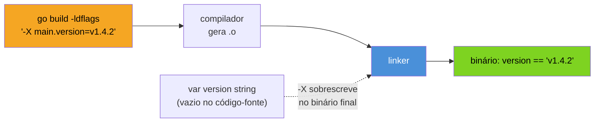
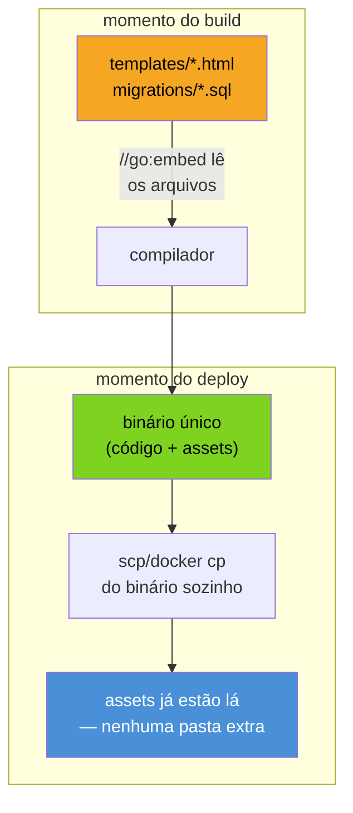

# Build flags e versionamento

> [!abstract] TL;DR
> `go build` sozinho não sabe em que commit você está nem que versão está compilando — essa informação precisa ser **injetada** no binário na hora do build, porque o Go não tem acesso a metadados de Git dentro do próprio código. A ferramenta é `-ldflags "-X pacote.variável=valor"`, que sobrescreve o valor de uma variável `string` exportada antes do linker fechar o binário. `-ldflags "-s -w"` remove tabelas de debug e símbolos, encolhendo o binário — ao custo de stack traces piores. `//go:embed` resolve um problema adjacente: empacotar assets (HTML, migrations, certificados) *dentro* do binário, para que `go build` produza um único artefato autocontido, sem pasta `assets/` para carregar em runtime. Os três mecanismos convergem para o mesmo objetivo: um binário de produção que se identifica sozinho, é pequeno, e não depende de arquivos ao lado dele no deploy.

## O problema: o binário não sabe quem ele é

Imagine que o serviço em produção começou a devolver respostas erradas às 3h da manhã. Você entra no host, roda o binário com `--version`, e ele responde... nada. Ou pior: responde `dev`, porque foi assim que alguém escreveu o `const Version = "dev"` há oito meses e ninguém tocou de novo. Qual commit está rodando? Qual branch gerou esse artefato? Foi buildado hoje ou há três semanas? Sem essa informação, o primeiro passo de qualquer incidente — "o que mudou, e quando" — vira arqueologia.

A tentação óbvia é resolver isso em runtime: rodar `git rev-parse HEAD` dentro do próprio programa, ou ler um arquivo `VERSION` no disco. Os dois falam a mesma mentira: assumem que o `.git` ou o arquivo estarão presentes onde o binário roda. Em produção, geralmente não estão — o artefato que sobe pro Kubernetes é só o binário estático (assunto da [[01 - O binário estático|nota 01]] deste galho), sem o repositório inteiro grudado nele. Perguntar "que versão eu sou?" a um processo em runtime só funciona se a resposta já estivesse *dentro* dele antes de começar a rodar.

Go resolve isso virando o problema de cabeça para baixo: em vez de o binário descobrir sua própria identidade em runtime, você **carimba** essa identidade nele no momento do build — quando o Git, o CI e o ambiente de build ainda têm toda a informação disponível.

## `-ldflags -X`: escrevendo em uma variável antes dela existir

`go build` compila o código-fonte e depois passa o resultado para o **linker** (`cmd/link`), que junta tudo em um binário executável. O linker tem uma flag específica para sobrescrever o valor inicial de variáveis `string` no momento da linkagem — antes de qualquer linha do seu `main()` rodar:



O padrão tem três peças. Primeiro, você declara variáveis `string` de nível de pacote, deixando-as vazias — elas existem só para servir de "alvo" da injeção:

```go
package main

import "fmt"

// Preenchidas via -ldflags -X no momento do build.
// Vazias aqui de propósito — não é um bug esquecer de setar.
var (
    version   = "dev"
    commit    = "none"
    buildTime = "unknown"
)

func printVersion() {
    fmt.Printf("versão=%s commit=%s build=%s\n", version, commit, buildTime)
}
```

Segundo, o comando de build captura os metadados reais do Git e do ambiente e os injeta:

```bash
VERSION=$(git describe --tags --always --dirty)
COMMIT=$(git rev-parse --short HEAD)
BUILD_TIME=$(date -u +%Y-%m-%dT%H:%M:%SZ)

go build -ldflags "\
  -X main.version=${VERSION} \
  -X main.commit=${COMMIT} \
  -X main.buildTime=${BUILD_TIME}" \
  -o myservice .
```

Terceiro, em runtime, o binário já nasce sabendo quem ele é — sem tocar em `.git`, sem ler arquivo nenhum:

```bash
$ ./myservice --version
versão=v1.4.2 commit=a3f9c21 build=2026-07-18T03:12:00Z
```

> [!warning] O caminho passado a `-X` é o import path completo, não um atalho
> `-X main.version=...` só funciona porque a variável está no pacote `main`. Se ela mora em `internal/build`, a flag precisa do caminho completo do módulo: `-X github.com/seuorg/seurepo/internal/build.Version=...`. Errar esse caminho não gera erro de build — o linker silenciosamente ignora a flag e a variável fica com o valor original do código-fonte. É a armadilha mais comum do mecanismo: build "passa", versão continua `dev`.

> [!warning] `-X` só funciona em variáveis `string`, não em `const`
> `const Version = "dev"` é resolvida em tempo de compilação, antes do linker existir — não há "slot" para sobrescrever depois. `-X` exige `var Version = "dev"` (ou `var Version string`). Trocar `const` por `var` é a correção mais comum quando alguém tenta esse padrão pela primeira vez e o valor não muda.

## `go version -m`: verificando o que foi injetado sem rodar o binário

Além de `--version` no próprio programa, o Go embute metadados de build no binário de um jeito que dá para inspecionar de fora, sem executar nada:

```bash
$ go version -m myservice
myservice: go1.23.0
    path    github.com/seuorg/myservice
    mod     github.com/seuorg/myservice    (devel)
    build   -ldflags="-X main.version=v1.4.2 -X main.commit=a3f9c21"
    build   CGO_ENABLED=0
    build   GOOS=linux
    build   GOARCH=amd64
```

> [!info] `go version -m` existe desde o Go 1.18, junto com o suporte a *build info* embutido — útil em auditoria de artefatos: dá para confirmar de que commit um binário em produção veio sem confiar em nenhum log externo.

## `-s -w`: encolhendo o binário para deploy

A [[01 - O binário estático|nota 01]] já estabeleceu que um binário Go carrega o runtime inteiro embutido — não é pequeno por padrão. Duas sub-flags do linker cortam peso morto que só serve para depuração:

- `-s` — omite a **tabela de símbolos** (nomes de funções e variáveis usados por debuggers).
- `-w` — omite as informações de **DWARF** (mapeamento de linha de código-fonte, usado por `dlv` e stack traces com nomes de arquivo).

```bash
go build -ldflags "-s -w" -o myservice .

# comparação de tamanho:
go build -o myservice-full .
ls -lh myservice myservice-full
# myservice        18M
# myservice-full   24M
```

A redução — tipicamente 20 a 30% — importa em cenários concretos: imagens Docker mínimas (próxima nota deste galho), onde cada megabyte a menos acelera pull e reduz a superfície da imagem; ou distribuição de CLI, onde o binário é baixado por milhares de usuários.

> [!warning] `-s -w` troca tamanho por observabilidade em produção
> Sem tabela de símbolos e DWARF, um `panic` em produção ainda imprime o stack trace — mas com endereços de memória em vez de nomes de função e linha. `dlv attach` num binário `-s -w` não consegue mapear símbolos, e ferramentas de profiling como `pprof` perdem granularidade. O trade-off comum: usar `-s -w` no artefato final que sobe pro cluster, mas manter um build de debug separado (sem essas flags) disponível para investigação de incidentes graves — muitas equipes resolvem isso guardando os arquivos de símbolo à parte via `-ldflags "-w" ` só, ou publicando o binário completo num artefato interno paralelo ao "de produção".

## `//go:embed`: o binário carrega os próprios assets

Um segundo problema, adjacente mas distinto: um serviço web frequentemente precisa de arquivos que não são código — templates HTML, um `schema.sql` de migrations, um certificado, arquivos estáticos de frontend. A solução ingênua é deixá-los numa pasta ao lado do binário e ler com `os.ReadFile` em runtime. Isso funciona até o dia em que alguém copia o binário para um host novo e esquece a pasta `templates/` — o deploy "funciona" (o binário sobe, o processo inicia) e só quebra na primeira requisição que precisa de um template.

`//go:embed`, desde o **Go 1.16**, resolve isso incluindo os arquivos **dentro** do binário compilado, como parte da seção de dados — o `go build` lê os arquivos do disco uma vez, no momento do build, e os empacota junto com o código:



```go
package main

import (
    "embed"
    "html/template"
    "log"
    "net/http"
)

//go:embed templates/*.html
var templatesFS embed.FS

var tmpl = template.Must(template.ParseFS(templatesFS, "templates/*.html"))

func handleIndex(w http.ResponseWriter, r *http.Request) {
    tmpl.ExecuteTemplate(w, "index.html", map[string]string{"Titulo": "Home"})
}

func main() {
    mux := http.NewServeMux()
    mux.HandleFunc("GET /", handleIndex)
    log.Fatal(http.ListenAndServe(":8080", mux))
}
```

`//go:embed templates/*.html` é uma diretiva de compilador — não uma chamada de função — que precisa vir imediatamente acima de uma variável do tipo `embed.FS` (ou `string`/`[]byte`, para um arquivo único). `embed.FS` implementa `fs.FS`, a interface padrão de sistema de arquivos da biblioteca padrão, então qualquer API que aceite `fs.FS` — como `template.ParseFS` acima, ou `http.FileServer(http.FS(...))` para servir estáticos — funciona direto sobre os assets embutidos, sem código de leitura manual.

> [!info] `http.ServeMux` com método e padrão de rota (`"GET /"`) é do Go 1.22
> O `net/http` ganhou roteamento por método HTTP e padrões de path (`/users/{id}`) na `ServeMux` padrão no Go 1.22 — antes disso, era preciso checar `r.Method` manualmente dentro do handler, ou recorrer a um router de terceiros só para isso.

**Combinando os três embutindo a própria versão como asset**, um padrão útil quando o time de frontend quer expor a versão do backend numa página de status sem tocar em código Go:

```go
//go:embed all:static
var staticFS embed.FS

var version = "dev" // injetado via -ldflags -X

func handleStatus(w http.ResponseWriter, r *http.Request) {
    fmt.Fprintf(w, `{"version":"%s","status":"ok"}`, version)
}

func handleStatic() http.Handler {
    sub, _ := fs.Sub(staticFS, "static")
    return http.FileServer(http.FS(sub))
}
```

`all:static` (em vez de só `static`) inclui também arquivos que começam com `.` ou `_` — normalmente ignorados pelo `go:embed` por padrão, porque a convenção do Go trata esses prefixos como "arquivos privados" de ferramentas.

> [!warning] `go:embed` falha o build se o padrão não casar com nada
> Ao contrário de `os.ReadFile`, que só falha em runtime se o arquivo não existir, `//go:embed templates/*.html` falha o **build** se a pasta `templates/` estiver vazia ou ausente no momento da compilação — `pattern templates/*.html: no matching files found`. Isso parece rígido, mas é o comportamento desejado: prefere-se descobrir "esqueci de commitar o template" no CI, antes do deploy, do que às 3h da manhã com um handler devolvendo 500.

## Build reprodutível: o mesmo commit sempre gera o mesmo binário

Um build **reprodutível** é aquele em que compilar o mesmo commit, nas mesmas condições, sempre produz um binário byte-a-byte idêntico — propriedade que importa para auditoria de supply chain: dado um binário em produção, dá para provar que ele veio exatamente do código publicado, sem nada adicionado no caminho.

Duas fontes comuns de não-determinismo, e como o toolchain do Go lida com cada uma:

1. **Caminhos absolutos do ambiente de build** vazando para dentro do binário (ex.: `/home/ci-runner-42/build/...` embutido em stack traces). A flag `-trimpath`, passada ao `go build`, remove esses caminhos, normalizando-os para o caminho do módulo:

```bash
go build -trimpath -ldflags "-X main.version=${VERSION}" -o myservice .
```

2. **Timestamps e metadados do ambiente** — o próprio `go build` já é determinístico por padrão desde que as entradas (código-fonte, versão do Go, `GOOS`/`GOARCH`, flags) sejam idênticas; o módulo `go.sum` garante que as dependências baixadas são byte-a-byte as mesmas em qualquer máquina, via hash criptográfico.

```bash
# build A, numa máquina:
go build -trimpath -o bin-a .
sha256sum bin-a

# build B, noutra máquina, mesmo commit/go.sum/versão do Go:
go build -trimpath -o bin-b .
sha256sum bin-b

# os hashes devem bater
```

> [!info] `go.sum` já protege a cadeia de dependências desde o Go 1.11 (module mode)
> `go.sum` registra o hash criptográfico de cada dependência baixada. Combinado com `GOFLAGS=-mod=readonly` (padrão desde o Go 1.16) e `-trimpath`, o build fica reprodutível ponta a ponta: mesmo código, mesmas dependências verificadas por hash, sem caminho de máquina vazando. Verificação de vulnerabilidades nessas dependências (`govulncheck`) é assunto do galho de segurança de deps, fora do escopo desta nota.

Um `Makefile` (ou script de CI) típico junta os três mecanismos desta nota num único alvo de build de produção:

```makefile
VERSION    := $(shell git describe --tags --always --dirty)
COMMIT     := $(shell git rev-parse --short HEAD)
BUILD_TIME := $(shell date -u +%Y-%m-%dT%H:%M:%SZ)
LDFLAGS    := -s -w \
  -X main.version=$(VERSION) \
  -X main.commit=$(COMMIT) \
  -X main.buildTime=$(BUILD_TIME)

build:
	CGO_ENABLED=0 go build -trimpath -ldflags "$(LDFLAGS)" -o bin/myservice .
```

`CGO_ENABLED=0` retoma o assunto da [[01 - O binário estático|nota 01]]: sem cgo, o binário resultante continua estático, portável para a imagem Docker mínima da próxima nota, sem depender de `libc` do host de build.

## Mais armadilhas

> [!warning] `-ldflags` como uma única string, com aspas certas
> `go build -ldflags -X main.version=v1 -X main.commit=abc ...` (sem aspas ao redor de tudo) faz o `go build` interpretar só o primeiro `-X main.version=v1` como valor de `-ldflags` e tratar o resto como argumentos soltos, geralmente causando `flag provided but not defined`. A forma correta agrupa todas as sub-flags numa única string: `-ldflags "-s -w -X main.version=v1 -X main.commit=abc"`. Em scripts shell, aspas duplas com variáveis interpoladas (`-ldflags "-X main.version=${VERSION}"`) — atenção redobrada se `VERSION` puder conter espaço (não deveria, mas tags maliciosas ou `git describe --dirty` com sufixo estranho já causaram builds quebrados).

> [!warning] Assets grandes embutidos inflam o binário e o tempo de build
> `//go:embed` copia os bytes dos arquivos casados para dentro do binário — não é um symlink nem uma referência preguiçosa. Embutir uma pasta `data/` com gigabytes de arquivos produz um binário do mesmo tamanho, e cada rebuild recompila esses bytes junto. Para assets grandes e raramente alterados (datasets, modelos), a alternativa costuma ser buscar de um object storage (S3, GCS) em runtime, guardando `//go:embed` para o que é pequeno e crítico ter sempre disponível — templates, migrations, chaves públicas.

> [!warning] `embed.FS` é somente leitura — não dá para "escrever de volta"
> `embed.FS` implementa `fs.FS`, que só define métodos de leitura (`Open`, `ReadDir`, `ReadFile`). Não existe `WriteFile` num `embed.FS` porque os dados vivem na seção de dados do binário compilado, imutável em runtime. Se o serviço precisa de um template editável em produção sem novo deploy, `go:embed` é a ferramenta errada — a saída é carregar de um volume/config externo, aceitando o trade-off inverso do resto desta nota.

## Casos práticos: endpoint de versão completo

Juntando `-ldflags -X` com um handler HTTP — o padrão real que aparece em quase todo serviço Go de produção, geralmente exposto em `/version` ou `/healthz`:

```go
package main

import (
    "encoding/json"
    "log/slog"
    "net/http"
)

var (
    version   = "dev"
    commit    = "none"
    buildTime = "unknown"
)

type buildInfo struct {
    Version   string `json:"version"`
    Commit    string `json:"commit"`
    BuildTime string `json:"build_time"`
}

func handleVersion(w http.ResponseWriter, r *http.Request) {
    info := buildInfo{Version: version, Commit: commit, BuildTime: buildTime}
    w.Header().Set("Content-Type", "application/json")
    json.NewEncoder(w).Encode(info)
}

func main() {
    slog.Info("iniciando serviço", "version", version, "commit", commit)

    mux := http.NewServeMux()
    mux.HandleFunc("GET /version", handleVersion)
    if err := http.ListenAndServe(":8080", mux); err != nil {
        slog.Error("servidor encerrado", "erro", err)
    }
}
```

> [!info] `log/slog` é a biblioteca padrão de logging estruturado desde o Go 1.21
> Antes do 1.21, logging estruturado em produção exigia uma dependência externa (`zap`, `zerolog`, `logrus`). `slog.Info("mensagem", "chave", valor)` já produz JSON estruturado (com `slog.NewJSONHandler`) sem dependência nenhuma — relevante aqui porque um serviço de produção normalmente loga a própria versão no boot, exatamente como no exemplo acima.

## Blindando o CI contra versão silenciosamente vazia

O erro descrito acima — caminho do import errado em `-X`, e a variável fica em `dev` sem nenhum erro de build — é traiçoeiro justamente porque não quebra nada visivelmente. Um jeito barato de blindar o pipeline é adicionar um passo que falha explicitamente se a versão não foi injetada:

```bash
#!/usr/bin/env bash
set -euo pipefail

VERSION=$(git describe --tags --always --dirty)
go build -trimpath -ldflags "-s -w -X main.version=${VERSION}" -o bin/myservice .

# grep no binário: a string da versão precisa aparecer nos bytes compilados.
if ! strings bin/myservice | grep -qF "${VERSION}"; then
    echo "ERRO: versão ${VERSION} não foi encontrada no binário — -ldflags -X falhou silenciosamente" >&2
    exit 1
fi

echo "build ok: ${VERSION}"
```

`strings bin/myservice | grep` funciona porque, mesmo com `-s -w` removendo símbolos de debug, o **valor literal** da string injetada continua nos dados do binário — só o metadado de depuração some, não o conteúdo em si. Esse tipo de checagem custa uma linha de CI e transforma um bug silencioso ("`--version` respondendo `dev` em produção há semanas") num build vermelho, óbvio, no pull request.

## Lente cross-stack

| Vindo de... | O equivalente a `-ldflags -X` |
|---|---|
| **Java** | `MANIFEST.MF` com `Implementation-Version`, populado pelo Maven (`maven-jar-plugin`) a partir de `${project.version}` e `git-commit-id-plugin` — mas lido em runtime via reflection sobre o manifest do JAR, não injetado no bytecode. |
| **Node.js** | Não há equivalente direto — o padrão comum é ler `package.json` (`require('./package.json').version`) em runtime, ou gerar um arquivo `version.json` no passo de build do CI. O Node não tem um "linker" que reescreva constantes antes do processo iniciar. |
| **Python** | `importlib.metadata.version("pacote")`, lido do `pyproject.toml`/pacote instalado em runtime — de novo, descoberta em runtime, não injeção em build time. Ferramentas como `setuptools-scm` derivam a versão de tags do Git no momento do *build do pacote* (wheel), o que é conceitualmente mais próximo do `-ldflags -X`. |

A diferença de fundo: Go tem um passo de **linkagem** explícito e separado da compilação, e esse linker aceita sobrescrever valores — por isso `-X` é possível sem gerar código extra nem exigir leitura de arquivo em runtime. Nas outras stacks, a informação de versão quase sempre é lida de um manifesto/arquivo em runtime, porque não existe esse ponto de injeção no processo de build.

## Como explicar em inglês

> Go binaries don't know their own version unless you inject it at build time — `go build -ldflags "-X main.version=v1.4.2"` overwrites a `var` string in your `main` package right before the linker seals the binary, letting a service report exactly which commit and build time produced it, with no `.git` directory or version file needed at runtime. `-ldflags "-s -w"` strips the symbol table and DWARF debug info to shrink the binary, at the cost of readable stack traces and debugger support — a trade-off usually accepted for the production artifact while keeping a debug build available separately. `//go:embed`, since Go 1.16, solves a related problem: bundling static assets (templates, migrations, certificates) directly into the compiled binary via `embed.FS`, so deployment is a single self-contained file instead of a binary plus a folder of assets that can go missing. Combined with `-trimpath` and a checked-in `go.sum`, these flags make production builds both self-identifying and reproducible — the same commit always yields the same bytes.

| Termo PT | Termo EN |
|---|---|
| flags de build | build flags |
| linker | linker |
| injetar versão | inject version |
| tabela de símbolos | symbol table |
| build reprodutível | reproducible build |
| ativos embutidos | embedded assets |
| caminho absoluto vazado | leaked absolute path |
| hash de dependência | dependency hash |

## O que vem a seguir

Um binário estático, versionado e com assets embutidos ainda precisa de um lugar para rodar. A [[04 - Docker — imagens mínimas|próxima nota]] pega exatamente esse artefato — pequeno, autocontido, sem dependência de `libc` — e mostra como empacotá-lo numa imagem Docker que não carrega nada além do necessário: `FROM scratch` ou `distroless`, multi-stage build, e por que uma imagem Go bem construída pode pesar poucos megabytes em vez de centenas.

## Veja também

- [[01 - O binário estático|01 — O binário estático]] — por que o binário Go não depende de arquivos externos, pré-requisito para `-trimpath` e `CGO_ENABLED=0` fazerem sentido
- [[02 - Cross-compilation|02 — Cross-compilation]] — `GOOS`/`GOARCH` combinados com as mesmas flags de build desta nota
- [[04 - Docker — imagens mínimas|04 — Docker — imagens mínimas]] — próxima nota; empacota o binário produzido aqui
- [[03-Dominios/Tecnologia/Go/index|Trilha Go]]

## Fontes

- The Go Authors. *cmd/link — Command link*. pkg.go.dev. https://pkg.go.dev/cmd/link (acessado em 2026-07-18)
- The Go Authors. *embed package documentation*. pkg.go.dev. https://pkg.go.dev/embed (acessado em 2026-07-18)
- The Go Authors. *Go 1.16 Release Notes — Embedding files*. go.dev. https://go.dev/doc/go1.16#library-embed (acessado em 2026-07-18)
- The Go Authors. *Go 1.21 Release Notes — log/slog*. go.dev. https://go.dev/doc/go1.21#slog (acessado em 2026-07-18)
- The Go Authors. *Go Modules Reference — go.sum files*. go.dev. https://go.dev/ref/mod#go-sum-files (acessado em 2026-07-18)
- The Go Authors. *go command documentation — Build and test caching, trimpath*. go.dev. https://go.dev/cmd/go/ (acessado em 2026-07-18)
