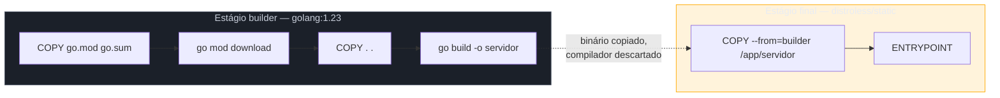

# Docker — imagens mínimas

> [!abstract] TL;DR
> Um `Dockerfile` ingênuo para Go (`FROM golang:1.23` na imagem final) empacota o compilador inteiro, o cache de módulos e a toolchain junto com o binário — centenas de MB para rodar um único executável estático. A solução é **multi-stage build**: um estágio `builder` com a imagem completa do Go compila o binário; um estágio final, minúsculo (`gcr.io/distroless/static` ou `scratch`), copia só o binário e roda. Como a [[01 - O binário estático|nota 01]] já estabeleceu, um binário Go com `CGO_ENABLED=0` não tem dependências dinâmicas — então a imagem final não precisa nem de libc, nem de shell, nem de um pacote gerenciador. O resultado: imagens de 5-20MB em vez de 800MB+, superfície de ataque drasticamente menor (sem shell = sem `RUN sh -c` malicioso possível dentro do container) e deploy mais rápido porque menos bytes trafegam até o cluster.

## O problema: o Dockerfile óbvio é gordo demais

Imagine que você acabou de terminar seu primeiro serviço HTTP em Go e quer publicá-lo como imagem Docker. O caminho de menor resistência é este:

```dockerfile
FROM golang:1.23
WORKDIR /app
COPY . .
RUN go build -o servidor .
CMD ["./servidor"]
```

Funciona. `docker build` compila, `docker run` executa, o serviço responde. Mas rode `docker images` depois e a surpresa aparece:

```
REPOSITORY   TAG       SIZE
meu-servico  latest    862MB
```

Oitocentos e sessenta megabytes para servir um binário que, sozinho, pesa uns 8MB. Onde foi o resto? A imagem `golang:1.23` inclui o compilador Go completo, o cache de build, `git`, `gcc`, bibliotecas de desenvolvimento — tudo que é necessário para *compilar* Go, não para *rodar* um binário Go já compilado. Você está publicando a fábrica inteira junto com o produto.

Isso importa por três motivos concretos, não só estética:

1. **Deploy mais lento** — cada `docker pull` em cada nó do cluster baixa esses 862MB, toda vez que a imagem muda.
2. **Superfície de ataque maior** — um `gcc`, um `git`, um shell completo dentro do container são ferramentas que um invasor que ganhar execução de código pode usar para escalar o ataque. Container sem shell é container onde `docker exec -it meu-servico sh` simplesmente não tem o que executar.
3. **Custo de armazenamento e transferência** — em registries pagos por volume, ou em ambientes com egress caro, o peso da imagem é dinheiro.

A boa notícia, como a [[01 - O binário estático|nota 01]] já estabeleceu, é que Go compila para um **binário estático**: sem `CGO_ENABLED=0`, o executável não depende de libc nem de nenhuma biblioteca dinâmica do sistema operacional. Isso é exatamente a propriedade que torna possível rodar esse binário numa imagem *praticamente vazia*.

## Multi-stage build: dois `FROM`, uma imagem final

Docker resolve esse problema com um recurso chamado **multi-stage build**: o `Dockerfile` declara múltiplos estágios, cada um com seu próprio `FROM`, e só o *último* estágio vira a imagem publicada. Estágios anteriores existem só para produzir artefatos que o estágio seguinte copia via `COPY --from=`.



O ponto chave: o estágio `builder` (com seus 800MB de toolchain) **não faz parte da imagem final**. O Docker daemon descarta as camadas do `builder` depois do build — só o que foi explicitamente copiado via `COPY --from=builder` sobrevive. É como usar uma cozinha industrial inteira para preparar um prato e depois entregar só o prato, não a cozinha, ao cliente.

```dockerfile
# Estágio 1: build
FROM golang:1.23 AS builder
WORKDIR /app

COPY go.mod go.sum ./
RUN go mod download

COPY . .
RUN CGO_ENABLED=0 GOOS=linux go build -o /servidor .

# Estágio 2: runtime, minúsculo
FROM gcr.io/distroless/static-debian12
COPY --from=builder /servidor /servidor
ENTRYPOINT ["/servidor"]
```

Repare em duas escolhas que não são acidentais:

- `COPY go.mod go.sum ./` seguido de `RUN go mod download` **antes** de `COPY . .`: isola a etapa de download de dependências numa camada Docker separada. Enquanto `go.mod`/`go.sum` não mudam, o Docker reaproveita o cache dessa camada em builds seguintes — só o código-fonte muda com frequência, as dependências não.
- `CGO_ENABLED=0` explícito: garante o binário estático mesmo que a imagem `builder` tenha `gcc` disponível (o que ligaria CGO por padrão em certas configurações). Sem essa garantia, o binário final pode acabar linkado dinamicamente contra uma libc que a imagem final — sem libc nenhuma — não tem.

## `distroless` vs `scratch`: duas formas de "quase vazio"

Depois de isolar o binário no estágio final, sobra escolher a imagem-base desse estágio. Duas opções dominam o ecossistema Go, e a diferença entre elas é sutil, mas importa em produção.

**`scratch`** é a imagem mais vazia que existe — literalmente zero bytes, zero arquivos, nem `/etc/passwd`. Não é baixada de lugar nenhum: é uma palavra-chave reservada do Docker que instrui o builder a começar do "nada absoluto".

```dockerfile
FROM scratch
COPY --from=builder /servidor /servidor
ENTRYPOINT ["/servidor"]
```

**`distroless`** (mantida pelo Google, `gcr.io/distroless/*`) é quase tão vazia quanto `scratch`, mas inclui o mínimo que um binário de produção costuma precisar sem precisar de shell nem gerenciador de pacotes: certificados CA (`/etc/ssl/certs/ca-certificates.crt`, essencial se o serviço faz chamadas HTTPS de saída), timezone data, e um `/etc/passwd` mínimo com um usuário não-root.

```dockerfile
FROM gcr.io/distroless/static-debian12:nonroot
COPY --from=builder /servidor /servidor
ENTRYPOINT ["/servidor"]
```

> [!warning] `scratch` sem certificados CA quebra qualquer chamada HTTPS de saída
> Um binário Go rodando em `scratch` que faz `http.Get("https://api.exemplo.com")` falha com `x509: certificate signed by unknown authority` — não porque o certificado do servidor remoto esteja errado, mas porque a imagem não tem **nenhum** certificado raiz confiável instalado para validar contra. `scratch` não vem com `/etc/ssl/certs`. Duas saídas: usar `distroless/static` (que já inclui os certificados), ou copiar manualmente o arquivo de certificados do estágio builder — `COPY --from=builder /etc/ssl/certs/ca-certificates.crt /etc/ssl/certs/`.

| | `scratch` | `distroless/static` |
|---|---|---|
| Tamanho base | 0 bytes | ~2MB |
| Certificados CA | não — precisa copiar manual | sim, já incluídos |
| Timezone data | não | sim (`distroless/static`, não a variante `-debian12` mínima) |
| Usuário não-root pronto | não — precisa criar | sim, tag `:nonroot` |
| Shell | não | não |
| Debug com `docker exec sh` | impossível | impossível |
| Uso típico | binários 100% autocontidos, sem I/O de rede TLS | a maioria dos serviços Go de produção |

Na prática, `distroless/static-debian12:nonroot` é a escolha default sensata para a maioria dos serviços Go — os poucos MB extras compram certificados CA, timezone data e um usuário não-root prontos, sem abrir mão de "sem shell, sem superfície de ataque". `scratch` vale quando o binário literalmente não faz I/O de rede TLS e cada byte importa (por exemplo, uma ferramenta CLI distribuída como imagem, ou um sidecar extremamente restrito).

> [!question]- Por que não simplesmente usar `alpine` na imagem final, como todo tutorial da internet sugere?
> `alpine` é pequena (~5-7MB) e tem shell (`sh`), o que facilita debug com `docker exec -it container sh`. Mas paga dois preços: primeiro, `alpine` usa `musl libc`, não `glibc` — se algum binário ou dependência CGO assumir `glibc`, comportamento sutil pode divergir (resolução DNS é o caso clássico historicamente problemático). Segundo, e mais importante para produção: ter um shell dentro do container é exatamente a superfície que `distroless`/`scratch` eliminam de propósito. Um invasor que ganhe execução remota de código (RCE) numa aplicação rodando em `alpine` pode abrir um shell interativo dentro do container; na mesma situação, rodando em `distroless`, não há `sh` para abrir. `alpine` é uma melhoria real sobre `golang:1.23` na imagem final — mas `distroless` vai além.

## Boas práticas de Dockerfile para Go

Juntando as peças anteriores num `Dockerfile` de produção completo, mais alguns cuidados adicionais que não aparecem nos exemplos minimalistas acima:

```dockerfile
# syntax=docker/dockerfile:1

FROM golang:1.23 AS builder
WORKDIR /app

# Cache de dependências separado do código-fonte
COPY go.mod go.sum ./
RUN go mod download

COPY . .

# Binário estático, sem debug symbols, versão embutida via ldflags
ARG VERSION=dev
RUN CGO_ENABLED=0 GOOS=linux GOARCH=amd64 \
    go build -trimpath -ldflags="-s -w -X main.version=${VERSION}" \
    -o /servidor .

FROM gcr.io/distroless/static-debian12:nonroot
WORKDIR /
COPY --from=builder /servidor /servidor

EXPOSE 8080
USER nonroot:nonroot
ENTRYPOINT ["/servidor"]
```

Alguns detalhes valem explicação:

- **`-ldflags="-s -w"`** remove a tabela de símbolos e informação de debug do binário — reduz o tamanho final em geral 20-30%. Trade-off real: stack traces de panic ficam menos legíveis (sem nomes de símbolo), então times que dependem de debug via `dlv` em produção às vezes abrem mão disso.
- **`-X main.version=${VERSION}`** injeta a versão de build no binário sem hardcode no código — assunto que a [[03 - Build flags e versionamento|nota 03]] cobre em detalhe; aqui ela aparece só como consumidora natural desse mecanismo dentro do Dockerfile.
- **`-trimpath`** remove caminhos absolutos do filesystem de build (`/app`, `/home/...`) dos binários compilados — reduz vazamento de informação sobre a máquina que fez o build e torna builds reproduzíveis mais fáceis de comparar byte a byte.
- **`USER nonroot:nonroot`** garante que o processo dentro do container não rode como root — mesmo sem shell, um processo root dentro de um container mal configurado (por exemplo, com um volume montado incorretamente) tem mais poder de causar dano do que um processo não-privilegiado.
- **`.dockerignore`** (arquivo separado, não mostrado acima) deveria excluir `.git`, binários já compilados localmente, e `node_modules` de qualquer tooling de frontend embutido no mesmo repo — cada byte que entra no contexto de build via `COPY . .` é enviado ao daemon Docker e pode invalidar cache de camada sem necessidade:

```
.git
*.md
bin/
tmp/
.dockerignore
Dockerfile
```

- **Fixar a imagem-base por digest**, não só por tag, em builds que exigem reprodutibilidade forte (auditoria, compliance, supply chain): `FROM gcr.io/distroless/static-debian12:nonroot@sha256:abc123...` em vez de só `:nonroot`. Tags como `:nonroot` ou `:latest` são móveis — a mantenedora pode publicar uma nova imagem sob a mesma tag amanhã, com pacotes atualizados (bom para patches de segurança, ruim se o objetivo é "o mesmo build, byte a byte, daqui a um ano"). Fixar por digest imobiliza a imagem-base; o trade-off é que patches de segurança da base deixam de chegar automaticamente — alguém precisa atualizar o digest manualmente, o que reabre a discussão de scanning de vulnerabilidades feita no galho de segurança de dependências.

> [!warning] `COPY . .` antes de `go mod download` invalida o cache de dependências a cada mudança de código
> Se a ordem for invertida — copiar todo o código-fonte e só depois rodar `go mod download` — qualquer alteração em qualquer arquivo `.go`, mesmo sem tocar `go.mod`, invalida a camada Docker que continha o download de dependências, forçando o Docker a rebaixar todos os módulos a cada build. Separar `COPY go.mod go.sum` + `go mod download` (que muda raramente) de `COPY . .` (que muda a cada commit) é o que faz o cache de camadas funcionar a favor do build, não contra ele.

> [!warning] Multi-stage build sem `AS builder` nomeado obriga referência por índice numérico
> `COPY --from=0 /app/servidor .` funciona (índice do estágio, começando em 0), mas é frágil: inserir um novo `FROM` no meio do arquivo desloca todos os índices seguintes e quebra o `COPY --from=N` silenciosamente até o próximo build falhar de um jeito confuso. Nomear estágios com `AS builder` (ou `AS test`, `AS lint`, se houver mais estágios intermediários) torna `COPY --from=builder` imune a essa reordenação.

## Cache mounts do BuildKit: acelerando ainda mais o `builder`

Separar `go.mod`/`go.sum` de `COPY . .` já resolve boa parte do problema de cache entre builds *de imagens diferentes* (camadas Docker reaproveitadas quando `go.mod` não muda). Mas dentro de um único ambiente de CI que builda a mesma imagem repetidamente, ainda existe desperdício: cada build limpo baixa módulos do zero se o cache de camada expirou, e o cache de compilação do Go (`$GOCACHE`) nunca persiste entre builds distintos, porque cada `RUN` roda num filesystem efêmero.

O BuildKit (motor de build padrão do Docker desde a versão 23) resolve isso com **cache mounts** — diretórios montados durante o `RUN` que persistem entre builds, fora do sistema de camadas normal:

```dockerfile
# syntax=docker/dockerfile:1
FROM golang:1.23 AS builder
WORKDIR /app

COPY go.mod go.sum ./
RUN --mount=type=cache,target=/go/pkg/mod \
    go mod download

COPY . .
RUN --mount=type=cache,target=/go/pkg/mod \
    --mount=type=cache,target=/root/.cache/go-build \
    CGO_ENABLED=0 go build -o /servidor .
```

`/go/pkg/mod` é o cache de módulos baixados; `/root/.cache/go-build` é o cache de compilação incremental do próprio `go build`. Com esses dois montados como cache persistente, um segundo build do mesmo Dockerfile — mesmo que `go.mod` tenha mudado, ou que o cache de camada Docker tenha sido invalidado por qualquer motivo — ainda reaproveita módulos já baixados e pacotes já compilados, reduzindo builds de minutos para segundos em projetos grandes. Cache mounts não afetam a imagem final: como todo o resto do estágio `builder`, eles são descartados — só existem para acelerar o `RUN` que os declara.

## Lente cross-stack: o que muda vindo de outras linguagens

Quem chega de ecossistemas com runtime pesado sente essa diferença de forma bem concreta:

| Linguagem | Imagem final típica | Por quê |
|---|---|---|
| Java (JAR + JRE) | 150-300MB mesmo com `distroless/java` | precisa da JVM inteira rodando dentro do container |
| Node.js | 150-900MB (`node:20` completo) ou ~120MB (`node:20-alpine`) | precisa do runtime V8 + `node_modules` completo |
| Python | 150-900MB (`python:3.12`) ou ~50MB (`python:3.12-slim`) | precisa do interpretador CPython + bibliotecas do venv |
| Go (multi-stage + distroless) | 5-20MB | binário estático já compilado, sem runtime a carregar |

A diferença não é acidente de tooling — é consequência direta do modelo de execução. Java, Node e Python distribuem *código-fonte ou bytecode* que precisa de um runtime presente no container para interpretar ou compilar just-in-time. Go distribui um **binário nativo já compilado para a arquitetura-alvo** — não há runtime a carregar, porque o "runtime" que Go precisa (o `scheduler` de goroutines, o garbage collector) já está *linkado dentro do próprio binário*, não é um processo externo. É a mesma propriedade que a [[01 - O binário estático|nota 01]] descreveu como "binário autocontido" — aqui ela se traduz diretamente em "imagem Docker minúscula".

## Casos práticos

**1. Verificando o tamanho da imagem** para confirmar que o multi-stage build funcionou:

```bash
docker build -t meu-servico:latest .
docker images meu-servico
# REPOSITORY    TAG       SIZE
# meu-servico   latest    12.4MB
```

**2. Rodando e confirmando que não há shell** — prova de que a superfície de ataque foi de fato reduzida:

```bash
docker run -d --name teste meu-servico:latest
docker exec -it teste sh
# OCI runtime exec failed: exec failed: unable to start container process:
# exec: "sh": executable file not found in $PATH: unknown
```

Esse erro é o comportamento **desejado** — não um bug a corrigir.

**3. Dockerfile completo de um serviço HTTP mínimo**, do código Go ao container:

```go
// main.go
package main

import (
    "fmt"
    "log/slog"
    "net/http"
    "os"
)

var version = "dev" // injetado via -ldflags no build

func main() {
    logger := slog.New(slog.NewJSONHandler(os.Stdout, nil))

    mux := http.NewServeMux()
    mux.HandleFunc("GET /health", func(w http.ResponseWriter, r *http.Request) {
        fmt.Fprintf(w, "ok — versão %s", version)
    })

    logger.Info("servidor iniciando", "version", version, "port", 8080)
    if err := http.ListenAndServe(":8080", mux); err != nil {
        logger.Error("servidor caiu", "erro", err)
        os.Exit(1)
    }
}
```

> [!info] `GET /health` como padrão de rota é sintaxe do novo `http.ServeMux` (Go 1.22+)
> A forma `mux.HandleFunc("GET /health", ...)`, com verbo HTTP e wildcards embutidos no padrão, só existe a partir do Go 1.22 — antes disso, `ServeMux` só fazia roteamento por path, sem verbo, exigindo checar `r.Method` manualmente dentro do handler.

```dockerfile
FROM golang:1.23 AS builder
WORKDIR /app
COPY go.mod go.sum ./
RUN go mod download
COPY . .
ARG VERSION=dev
RUN CGO_ENABLED=0 GOOS=linux go build \
    -ldflags="-s -w -X main.version=${VERSION}" \
    -o /servidor .

FROM gcr.io/distroless/static-debian12:nonroot
COPY --from=builder /servidor /servidor
EXPOSE 8080
USER nonroot:nonroot
ENTRYPOINT ["/servidor"]
```

```bash
docker build --build-arg VERSION=$(git describe --tags) -t meu-servico:$(git describe --tags) .
docker run -p 8080:8080 meu-servico:$(git describe --tags)
curl localhost:8080/health
# ok — versão v1.3.0
```

## Como explicar em inglês

> A naive Dockerfile that uses the full `golang` image as the final stage ships the entire compiler toolchain alongside the binary — often 800MB+ for a service that's a single 8MB executable. The fix is a **multi-stage build**: a `builder` stage compiles the binary with the full Go toolchain, and a separate, minimal final stage — `gcr.io/distroless/static` or `scratch` — copies over just the compiled binary and runs it. Because a Go binary built with `CGO_ENABLED=0` is statically linked with no dynamic dependencies, the final image doesn't need libc, a shell, or a package manager at all. `distroless` includes CA certificates and a non-root user out of the box; `scratch` is truly empty and requires copying certificates manually if the service makes outbound HTTPS calls. The payoff is a 5-20MB image instead of hundreds of megabytes, faster deploys, and — because there's no shell inside the container — a meaningfully smaller attack surface if an attacker gains remote code execution.

| Termo PT | Termo EN |
|---|---|
| build em múltiplos estágios | multi-stage build |
| imagem-base | base image |
| binário estático | static binary |
| superfície de ataque | attack surface |
| cache de camada | layer cache |
| certificados raiz confiáveis | root CA certificates |
| usuário não-privilegiado | non-root user |
| contexto de build | build context |

## O que vem a seguir

Uma imagem mínima resolve tamanho e superfície de ataque, mas não resolve um problema distinto: o que acontece quando o Kubernetes decide encerrar esse container — durante um deploy, um scale-down, ou uma falha de nó? Um binário Go que morre no meio de uma requisição HTTP em andamento, sem tratar o sinal de encerramento, derruba requisições em voo e corrompe a experiência de quem estava do outro lado. A [[05 - Graceful shutdown|nota 05]] entra nesse mecanismo: `signal.NotifyContext`, o `context` de encerramento propagado, e o `Shutdown()` do `http.Server` que dá tempo para requisições em andamento terminarem antes do processo morrer de fato.

## Veja também

- [[01 - O binário estático|01 — O binário estático]] — a propriedade (binário sem dependências dinâmicas) que torna imagens `scratch`/`distroless` possíveis
- [[02 - Cross-compilation|02 — Cross-compilation]] — `GOOS`/`GOARCH` usados dentro do estágio `builder` para gerar o binário certo para o container-alvo
- [[03 - Build flags e versionamento|03 — Build flags e versionamento]] — `-ldflags -X` para injetar versão, usado aqui via `ARG VERSION`
- [[05 - Graceful shutdown|05 — Graceful shutdown]] — próxima nota do galho
- [[03-Dominios/Tecnologia/Go/index|Trilha Go]]

## Fontes

- Docker, Inc. *Multi-stage builds*. docs.docker.com. https://docs.docker.com/build/building/multi-stage/ (acessado em 2026-07-18)
- Google. *distroless — Container images with no package manager or shell*. GitHub. https://github.com/GoogleContainerTools/distroless (acessado em 2026-07-18)
- The Go Authors. *Deploying Go servers with Docker*. go.dev/blog. https://go.dev/blog/docker (acessado em 2026-07-18)
- The Go Authors. *Go 1.22 Release Notes — enhanced routing patterns in net/http*. go.dev. https://go.dev/doc/go1.22#enhanced_routing_patterns (acessado em 2026-07-18)
- Docker, Inc. *Dockerfile reference*. docs.docker.com. https://docs.docker.com/reference/dockerfile/ (acessado em 2026-07-18)
