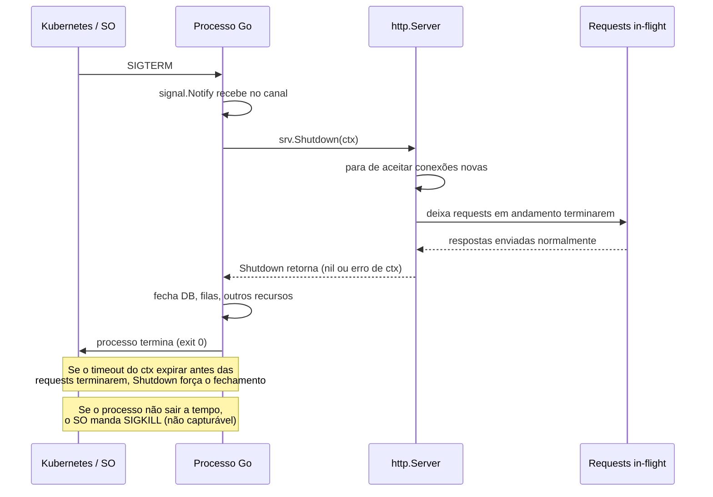

# Graceful shutdown

> [!abstract] TL;DR
> Um processo Go em produção não morre sozinho — quem manda o sinal é o orquestrador (Kubernetes manda `SIGTERM` antes do `SIGKILL`, systemd faz o mesmo). Se o programa ignora esse sinal, o `SIGKILL` que vem depois mata o processo no meio de requests in-flight, conexões de banco abertas e transações incompletas. **Graceful shutdown** é o padrão que evita isso: capturar `SIGINT`/`SIGTERM` com `signal.Notify`, parar de aceitar conexões novas, dar um prazo para as requisições em andamento terminarem via `srv.Shutdown(ctx)` com timeout, e só então fechar banco, filas e outros recursos — nessa ordem, nunca ao contrário.

## O corte no meio da frase

Imagine um garçom que, no meio de anotar o pedido de uma mesa, simplesmente vira as costas e vai embora porque o turno acabou. O cliente fica com a caneta na mão, o pedido pela metade, sem saber se deve repetir tudo ou se algo já foi registrado. É basicamente o que acontece quando um servidor HTTP em Go é encerrado sem cuidado: o processo recebe ordem de parar e, se a única reação for `os.Exit` — ou nenhuma reação, o sistema operacional mata o processo do jeito bruto — qualquer requisição no meio do caminho é cortada sem aviso. O cliente do outro lado recebe uma conexão resetada, sem resposta, sem status HTTP nenhum — só silêncio.

Em desenvolvimento local isso passa despercebido: você aperta `Ctrl+C`, o terminal fecha, ninguém mais está fazendo requisição àquele processo. Em produção, sob Kubernetes, a história é diferente. Um deploy novo, um autoscaler reduzindo réplicas, um node sendo drenado para manutenção — tudo termina do mesmo jeito: o `kubelet` manda `SIGTERM` para o processo dentro do pod e espera um `terminationGracePeriodSeconds` (30s por padrão) antes de mandar `SIGKILL`, que não pode ser capturado nem adiado. Se o binário não faz nada com o `SIGTERM`, ele passa esses 30 segundos simplesmente ignorando o aviso — e quando o `SIGKILL` chega, corta no meio da frase qualquer requisição, transação de banco ou mensagem de fila que estivesse em voo.

Graceful shutdown é o contrato que o processo assume: "ao receber o sinal de parada, eu paro de aceitar trabalho novo, termino o que já comecei dentro de um prazo razoável, e só então saio". Não é um detalhe de polimento — é a diferença entre um deploy que os usuários nem percebem e um deploy que gera uma rajada de erros 502 exatamente na hora da troca de versão. O contrato completo com o Kubernetes (probes, `terminationGracePeriodSeconds`, `preStop` hooks) é o assunto da [[06 - Contrato com Kubernetes|próxima nota]] — aqui o foco é só o que acontece dentro do processo Go.

## Anatomia do sinal ao encerramento



Três fases, em ordem estrita:

1. **Captura do sinal** — o processo precisa estar escutando `SIGINT`/`SIGTERM` *antes* de o sinal chegar. Sem isso, o comportamento default do Go para esses sinais é terminar o processo imediatamente, sem nenhuma chance de limpeza.
2. **Drenagem** — parar de aceitar conexões novas, mas deixar as que já estão em andamento terminarem, dentro de um prazo com timeout.
3. **Liberação de recursos** — só depois que o servidor HTTP confirmou que parou é que faz sentido fechar pool de conexões de banco, consumers de fila, e qualquer outro recurso que as requests em voo ainda pudessem precisar. Fechar o banco *antes* do servidor terminar seria trocar um corte por outro: a request sobrevive ao `Shutdown`, mas falha ao tentar consultar um banco já fechado.

## Capturando o sinal com `signal.Notify`

O pacote [`os/signal`](https://pkg.go.dev/os/signal) entrega sinais do SO como valores em um canal Go — o mesmo mecanismo de canal usado para qualquer outra comunicação entre goroutines, sem API especial de callback:

```go
package main

import (
    "os"
    "os/signal"
    "syscall"
)

func main() {
    quit := make(chan os.Signal, 1)
    signal.Notify(quit, syscall.SIGINT, syscall.SIGTERM)

    <-quit // bloqueia até um dos dois sinais chegar
    // a partir daqui, começa o shutdown
}
```

`signal.Notify` não intercepta o sinal de forma exclusiva — ele registra o canal como um dos ouvintes. `SIGINT` é o que o terminal manda quando você aperta `Ctrl+C`; `SIGTERM` é o que o Kubernetes (e `docker stop`, e systemd) manda como pedido educado de encerramento. O canal precisa ter buffer 1 (`make(chan os.Signal, 1)`) porque a entrega de sinais em Go é non-blocking do lado do runtime — se o canal não tiver espaço livre no instante em que o sinal chega, a notificação é descartada silenciosamente.

> [!warning] `SIGKILL` não é capturável
> Só `SIGINT` e `SIGTERM` — e alguns outros sinais "educados" — passam por `signal.Notify`. `SIGKILL` (o que o `kubelet` manda depois que o `terminationGracePeriodSeconds` estoura) é tratado direto pelo kernel; nenhum programa em nenhuma linguagem consegue interceptá-lo ou atrasá-lo. Isso é *feature*, não limitação: garante que sempre existe uma forma de matar um processo travado. A implicação prática é que o shutdown gracioso precisa terminar **dentro do prazo que o orquestrador concede** — se o seu `Shutdown` demora mais que o `terminationGracePeriodSeconds`, o `SIGKILL` chega de qualquer jeito e corta o que sobrou, gracioso ou não.

## `srv.Shutdown(ctx)`: parar de aceitar, deixar terminar

O método [`(*http.Server).Shutdown`](https://pkg.go.dev/net/http#Server.Shutdown) faz exatamente a fase de drenagem: fecha todos os *listeners* abertos (não aceita conexão nova nenhuma a partir da chamada), depois espera as conexões idle fecharem e as requisições ativas terminarem, e só retorna quando tudo isso aconteceu — ou quando o `context.Context` passado como argumento é cancelado, o que vier primeiro.

```go
package main

import (
    "context"
    "errors"
    "log/slog"
    "net/http"
    "os"
    "os/signal"
    "syscall"
    "time"
)

func main() {
    mux := http.NewServeMux()
    mux.HandleFunc("/health", func(w http.ResponseWriter, r *http.Request) {
        w.WriteHeader(http.StatusOK)
    })

    srv := &http.Server{
        Addr:    ":8080",
        Handler: mux,
    }

    // Sobe o servidor numa goroutine — ListenAndServe bloqueia,
    // então main precisa seguir livre para escutar o sinal.
    go func() {
        if err := srv.ListenAndServe(); err != nil && !errors.Is(err, http.ErrServerClosed) {
            slog.Error("servidor caiu inesperadamente", "erro", err)
            os.Exit(1)
        }
    }()

    quit := make(chan os.Signal, 1)
    signal.Notify(quit, syscall.SIGINT, syscall.SIGTERM)
    <-quit

    slog.Info("sinal de shutdown recebido, drenando requests em andamento")

    ctx, cancel := context.WithTimeout(context.Background(), 30*time.Second)
    defer cancel()

    if err := srv.Shutdown(ctx); err != nil {
        slog.Error("shutdown forçado — nem tudo drenou a tempo", "erro", err)
    } else {
        slog.Info("servidor encerrado sem perder requests")
    }
}
```

> [!info] `log/slog` é da standard library desde Go 1.21
> O exemplo usa `log/slog` em vez do `log` tradicional — desde a 1.21, structured logging é parte da standard library, sem precisar de `logrus` nem `zap` para ter `slog.Info("mensagem", "chave", valor)` com saída estruturada.

Repare no detalhe que costuma passar despercebido: `srv.ListenAndServe()` **sempre** retorna um erro quando o servidor para — mesmo em shutdown limpo. O erro nesse caso é o sentinel `http.ErrServerClosed`, e a checagem `!errors.Is(err, http.ErrServerClosed)` é o que distingue "parou porque eu mandei parar" de "caiu por um motivo real". Tratar qualquer erro de `ListenAndServe` como fatal, sem essa distinção, faz o programa logar um "erro" numa saída completamente normal.

O `context.WithTimeout` é o que impede o shutdown de esperar para sempre por uma requisição travada: se depois de 30 segundos ainda existir uma conexão pendurada, `Shutdown` desiste, fecha à força o que sobrou e retorna o erro do contexto (`context.DeadlineExceeded`). O valor do timeout não é arbitrário — ele precisa ser **menor** que o `terminationGracePeriodSeconds` do Kubernetes, com folga para as outras etapas de shutdown (fechar banco, flush de métricas). Se o timeout do `Shutdown` for igual ou maior que o grace period do orquestrador, o `SIGKILL` chega primeiro e a lógica de timeout do seu código nunca teve chance de agir.

## Drenando o que não é HTTP: banco, filas, workers

`srv.Shutdown` resolve a parte HTTP, mas um serviço real quase sempre tem outros recursos vivos: pool de conexões de banco (`*sql.DB`), consumer de fila, goroutines de worker rodando em loop. A ordem certa é sempre a mesma — **parar de aceitar trabalho novo primeiro, drenar o que está em andamento, fechar recursos compartilhados por último**:

```go
func main() {
    db, err := sql.Open("pgx", os.Getenv("DATABASE_URL"))
    if err != nil {
        slog.Error("falha ao abrir conexão com o banco", "erro", err)
        os.Exit(1)
    }
    defer db.Close() // só executa quando main retorna — depois do shutdown do HTTP

    srv := &http.Server{Addr: ":8080", Handler: buildRouter(db)}

    go func() {
        if err := srv.ListenAndServe(); err != nil && !errors.Is(err, http.ErrServerClosed) {
            slog.Error("servidor caiu inesperadamente", "erro", err)
            os.Exit(1)
        }
    }()

    quit := make(chan os.Signal, 1)
    signal.Notify(quit, syscall.SIGINT, syscall.SIGTERM)
    <-quit

    ctx, cancel := context.WithTimeout(context.Background(), 25*time.Second)
    defer cancel()

    if err := srv.Shutdown(ctx); err != nil {
        slog.Warn("nem todas as requests drenaram a tempo", "erro", err)
    }

    // Só chega aqui depois que o HTTP parou de aceitar e drenou —
    // agora é seguro fechar o banco. defer db.Close() cuida disso na saída.
    slog.Info("encerrado com limpeza")
}
```

O `defer db.Close()` funciona aqui porque ele só dispara quando `main` retorna — e `main` só retorna depois que `srv.Shutdown` já terminou de bloquear. A ordem de execução dos `defer` (LIFO) garante, de graça, que os recursos abertos por último fecham primeiro — mas o ponto estrutural que importa é: **nenhum recurso compartilhado por handlers HTTP pode fechar antes do `Shutdown` retornar**, senão uma request que sobreviveu à drenagem encontra um banco já fechado.

Se o serviço tem workers em background (consumer de fila, cron interno) além do servidor HTTP, o padrão se generaliza com `context.Context` cancelável e `sync.WaitGroup`, coordenando várias goroutines de trabalho com o mesmo sinal de shutdown:

```go
func main() {
    ctx, cancel := context.WithCancel(context.Background())
    var wg sync.WaitGroup

    wg.Add(1)
    go func() {
        defer wg.Done()
        runQueueConsumer(ctx) // sai do loop quando ctx.Done() fecha
    }()

    srv := &http.Server{Addr: ":8080", Handler: buildRouter()}
    go func() {
        if err := srv.ListenAndServe(); err != nil && !errors.Is(err, http.ErrServerClosed) {
            slog.Error("servidor caiu", "erro", err)
        }
    }()

    quit := make(chan os.Signal, 1)
    signal.Notify(quit, syscall.SIGINT, syscall.SIGTERM)
    <-quit

    shutdownCtx, shutdownCancel := context.WithTimeout(context.Background(), 25*time.Second)
    defer shutdownCancel()
    srv.Shutdown(shutdownCtx)

    cancel()  // avisa runQueueConsumer para parar
    wg.Wait() // espera o worker terminar o item que estava processando
}
```

Aqui `cancel()` (do `context.WithCancel` externo) é o sinal que os workers em background escutam via `ctx.Done()` para parar de puxar itens novos da fila — e `wg.Wait()` bloqueia até que o item que já estava em processamento termine, o mesmo princípio de drenagem do `srv.Shutdown`, só que aplicado a goroutines manuais em vez de conexões HTTP.

## Orçando o tempo: quem gasta quanto do grace period

O `terminationGracePeriodSeconds` do Kubernetes é um orçamento total, não um cheque em branco só para o `Shutdown`. Ele precisa ser repartido entre todas as etapas que acontecem depois do `SIGTERM`:

| Etapa | Quem executa | Ordem de grandeza típica |
|---|---|---|
| Propagação do `SIGTERM` até o processo perceber | kernel + runtime Go | instantâneo |
| Readiness probe passa a falhar, load balancer para de mandar tráfego novo | Kubernetes (fora do processo) | 1-5s, depende do `periodSeconds` da probe |
| `srv.Shutdown(ctx)` drenando requests em andamento | seu código | segundos, depende da duração das requests |
| Fechar banco, filas, flush de métricas/traces | seu código | frações de segundo a poucos segundos |
| **Total precisa caber em** | — | `terminationGracePeriodSeconds` (default 30s) |

A armadilha mais comum é dimensionar o timeout do `context.WithTimeout` como se ele sozinho tivesse os 30 segundos inteiros — esquecendo que o tempo para o load balancer parar de mandar tráfego novo (via readiness probe) já consumiu uma fatia, e que fechar banco e flushar métricas depois do `Shutdown` também consome tempo. Uma distribuição defensiva comum é reservar algo como 20-25s para o `Shutdown` em si, deixando margem para o resto — sempre calibrado pelo `terminationGracePeriodSeconds` real do manifesto, que é assunto detalhado da próxima nota.

## Testando o shutdown localmente

Confiar que o código "deveria funcionar" sem observar o comportamento sob pressão é como confiar num paraquedas sem nunca ter puxado o cordão em treino. Dá para simular o cenário de request lenta + shutdown com poucas linhas:

```go
mux.HandleFunc("/slow", func(w http.ResponseWriter, r *http.Request) {
    time.Sleep(5 * time.Second) // simula trabalho demorado
    w.Write([]byte("terminei\n"))
})
```

Com o servidor rodando (`go run .`), dispare uma request lenta num terminal e, em outro, mande o sinal antes dela terminar:

```bash
curl http://localhost:8080/slow &   # inicia a request lenta em background
sleep 1
kill -TERM $(pgrep -f "go-build.*main")  # ou o PID exibido no primeiro terminal
```

Se o graceful shutdown estiver correto, o log deve mostrar "sinal de shutdown recebido" quase imediatamente, mas o `curl` só recebe a resposta `terminei` depois dos 5 segundos completos — prova de que `Shutdown` esperou a request em voo terminar em vez de cortá-la. Reduzindo o timeout do `context.WithTimeout` para, digamos, 2 segundos (menor que o `time.Sleep` de 5s do handler), o comportamento se inverte: o log mostra "shutdown forçado" e o `curl` recebe conexão resetada — o cenário exato que acontece em produção quando o timeout está mal calibrado frente à duração real das requisições.

## Armadilhas comuns

> [!warning] Esquecer de capturar o sinal — o default mata sem aviso
> Sem `signal.Notify`, o comportamento padrão do runtime Go para `SIGTERM` é terminar o processo imediatamente — sem rodar `defer`, sem fechar nada. É fácil escrever um `main` inteiro sem esse bloco e só descobrir o problema em produção, quando um deploy comum começa a gerar erros 502 em rajada durante a troca de pods.

> [!warning] Timeout do `Shutdown` maior que o grace period do orquestrador
> Se `context.WithTimeout` usa 60 segundos mas o pod só tem `terminationGracePeriodSeconds: 30`, o `SIGKILL` chega no meio do caminho e a "graça" do shutdown nunca teve chance de valer o esperado. Dimensione o timeout do `Shutdown` **abaixo** do grace period configurado no manifesto do Kubernetes, com folga para o fechamento de outros recursos.

> [!warning] Fechar o banco (ou outro recurso compartilhado) antes de `Shutdown` retornar
> `defer db.Close()` logo depois de abrir a conexão, sem pensar na ordem, é seguro só porque `defer` roda no retorno de `main` — mas se alguém reescrever o fluxo para chamar `db.Close()` explicitamente **antes** de `srv.Shutdown(ctx)` (por exemplo, num cleanup "para garantir"), qualquer request ainda em voo que dependa do banco começa a falhar com conexão fechada, exatamente o cenário que o graceful shutdown existe para evitar.

> [!warning] Testar shutdown só com `Ctrl+C` local não reproduz o `SIGKILL` do Kubernetes
> Rodar `go run .` e apertar `Ctrl+C` valida a captura de `SIGINT` e a lógica de `Shutdown`, mas não exercita o cenário em que o timeout estoura e o `SIGKILL` chega de verdade. Vale testar isso deliberadamente — reduzir o timeout para 1 segundo, segurar uma request propositalmente lenta, e observar o comportamento sob pressão de tempo, antes de confiar no código em produção.

## Vindo de outra stack

| Vindo de | Em Go |
|---|---|
| Java / Spring Boot: `@PreDestroy`, shutdown hooks do `ApplicationContext`, `server.shutdown=graceful` no `application.properties` | `signal.Notify` + `srv.Shutdown(ctx)` — o mesmo objetivo, mas explícito no `main`, sem contêiner de DI orquestrando por baixo |
| Node.js / Express: `process.on('SIGTERM', ...)` fechando o `http.Server` manualmente com `server.close()` | Estrutura quase idêntica — `server.close()` do Node e `srv.Shutdown(ctx)` do Go fazem a mesma drenagem; a diferença é que o Go exige o `context.Context` com timeout explícito em vez de depender de um callback |
| Python / Gunicorn: `worker_exit`, timeout de graceful reload via `--graceful-timeout` | Gunicorn resolve isso por configuração de processo; em Go, a lógica mora no próprio binário, porque não há um processo-gerente separado do processo da aplicação |

## Como explicar em inglês

> Graceful shutdown in Go means capturing `SIGINT`/`SIGTERM` with `signal.Notify` before the process ever needs to exit, so the default "kill immediately" behavior never kicks in. Once the signal arrives, `(*http.Server).Shutdown(ctx)` stops accepting new connections but lets in-flight requests finish, bounded by the `context.Context`'s deadline — if that deadline passes before every request completes, `Shutdown` forces the remaining connections closed. The `context.WithTimeout` value must stay comfortably under the orchestrator's grace period (Kubernetes' `terminationGracePeriodSeconds`, default 30s), because `SIGKILL` — sent once that period expires — cannot be intercepted by any program. Shared resources like a database pool should only close after `Shutdown` returns, never before, or a request that survived the drain will hit a closed connection anyway.

| Termo PT | Termo EN |
|---|---|
| encerramento gracioso | graceful shutdown |
| sinal de encerramento | termination signal |
| drenar requisições em andamento | drain in-flight requests |
| prazo de tolerância | grace period |
| capturar sinal | trap / catch signal |
| fechar ordenadamente | shut down in order |
| forçar encerramento | force shutdown |

## O que vem a seguir

Capturar `SIGTERM` e drenar requests com `srv.Shutdown` resolve a metade que mora dentro do binário Go — mas o Kubernetes tem meia dúzia de outras peças que precisam se encaixar com esse comportamento: `readinessProbe` avisando o load balancer para parar de mandar tráfego *antes* do `SIGTERM` chegar, `preStop` hook dando um respiro extra, e o próprio `terminationGracePeriodSeconds` que limita quanto tempo esse shutdown gracioso realmente tem. A [[06 - Contrato com Kubernetes|próxima nota]] fecha esse contrato do lado de fora do processo.

## Veja também

- [[04 - Docker — imagens mínimas|04 — Docker — imagens mínimas]] — o container onde esse processo roda, e por que `docker stop` também manda `SIGTERM`
- [[06 - Contrato com Kubernetes|06 — Contrato com Kubernetes]] — próxima nota do galho: probes, `terminationGracePeriodSeconds` e `preStop`
- [[03-Dominios/Tecnologia/Go/index|Trilha Go]]

## Fontes

- The Go Authors. *net/http package — Server.Shutdown*. pkg.go.dev. https://pkg.go.dev/net/http#Server.Shutdown (acessado em 2026-07-18)
- The Go Authors. *os/signal package*. pkg.go.dev. https://pkg.go.dev/os/signal (acessado em 2026-07-18)
- The Go Authors. *log/slog package*. pkg.go.dev. https://pkg.go.dev/log/slog (acessado em 2026-07-18)
- Kubernetes. *Pod Lifecycle — Termination of Pods*. kubernetes.io. https://kubernetes.io/docs/concepts/workloads/pods/pod-lifecycle/#pod-termination (acessado em 2026-07-18)
- The Go Blog. *Contexts and structured concurrency* (para o uso de `context.WithTimeout` em shutdown). go.dev. https://go.dev/blog/context (acessado em 2026-07-18)
